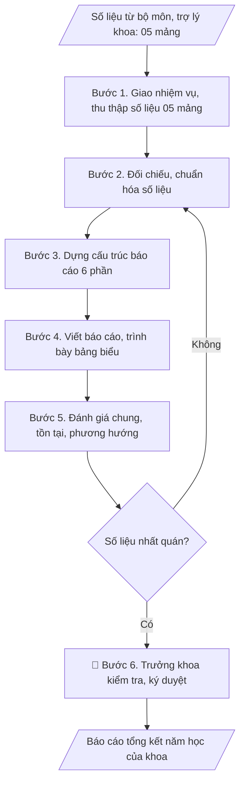

# Báo cáo tổng kết năm học của khoa

## Định dạng và file đầu ra

Định dạng đầu ra có thể chọn theo sản phẩm/yêu cầu: .docx, .pdf. Đọc mục “Định dạng bổ sung” trong quy cách đầu ra trước khi chọn.

**Phải tạo file thực tế để tải xuống, không chỉ trả nội dung trong chat.** Định dạng mặc định của skill: **.docx**. Nếu có bảng số liệu nghiệp vụ yêu cầu file bảng tính riêng, tạo thêm Excel theo yêu cầu; không tự tạo file kiểm tra. Không chờ người dùng yêu cầu xuất file lần nữa. Ưu tiên định dạng người dùng chỉ định; đọc quy tắc xuất file tại references/quy-cach-dau-ra.md.

## Quy cách đầu ra và thông tin thiếu
Khi dựng file Word/Excel, áp dụng mục “Thể thức và bảng biểu khi dựng file” trong quy cách đầu ra (cỡ chữ từng thành phần, bảng nhiều trang, số trang, phụ lục). Đọc [quy cách và cấu trúc sản phẩm](references/quy-cach-dau-ra.md) trước khi soạn/xuất. File giao chỉ gồm sản phẩm nghiệp vụ được yêu cầu; kiểm tra nội bộ không xuất kèm. Thiếu thông tin thì giữ nguyên trường/mục và chỗ điền theo mẫu gốc (dòng dấu chấm, dấu gạch hoặc ô trống); không tự điền dữ liệu mẫu, số 0, mã chờ xác minh hay dòng chờ ký. Mẫu chuyên ngành còn áp dụng được ưu tiên về cấu trúc, mã biểu và người ký. Bản đầy đủ: [quy tắc chung](references/quy-tac-chung.md).

Khi báo cáo có số liệu cần so sánh hoặc nêu xu hướng, đọc mục “Biểu đồ và hình trong báo cáo số liệu” trong quy cách đầu ra trước khi vẽ.

## Kiểm soát áp dụng và phê duyệt
Trước khi chạy, xác định `ngay_ap_dung`, `loai_hinh_truong`, `quy_che_noi_bo`, `nguon_du_lieu`, `nguoi_kiem_duyet`; chỉ hỏi thông tin liên quan nghiệp vụ, không dùng giá trị giả định thay dữ liệu bắt buộc. Đối chiếu căn cứ pháp lý với văn bản gốc, hiệu lực, điều khoản áp dụng và chuyển tiếp. Bản đầy đủ: [quy tắc chung](references/quy-tac-chung.md).

## Giới hạn và human gate
AI hỗ trợ chuẩn bị và đối chiếu; cán bộ phụ trách kiểm tra dữ liệu/căn cứ, người có thẩm quyền duyệt và ký. Không đánh dấu đã ký, đã duyệt, đã công bố khi chưa có chứng cứ. Dữ liệu sinh viên, sức khỏe, nhân sự, tài chính chỉ dùng theo mục đích và phân quyền, che thông tin định danh khi dùng ví dụ (Luật 91/2025/QH15, hiệu lực 01/01/2026); không tải dữ liệu lên dịch vụ ngoài khi chưa có quyền. Bản đầy đủ: [quy tắc chung](references/quy-tac-chung.md).

## Khi nào dùng
Khi kết thúc năm học, khoa cần tổng hợp toàn bộ hoạt động (đào tạo, NCKH, CTSV,
đội ngũ, CSVC) thành báo cáo gửi Ban Giám hiệu.

## Đầu vào (Input)

| Trường | Mô tả | Bắt buộc |
|---|---|---|
| `khoa` | Tên khoa | Có |
| `nam_hoc` | Năm học báo cáo | Có |
| `so_lieu_dao_tao` | Số ngành/CTĐT, số SV, tỷ lệ tốt nghiệp, kết quả học tập | Có |
| `so_lieu_nckh` | Số đề tài, bài báo, hội thảo, giáo trình | Có |
| `so_lieu_doi_ngu` | Số GV, trình độ (TS/ThS), biến động nhân sự | Có |
| `so_lieu_ctsv` | Học bổng, rèn luyện, kỷ luật, việc làm SV tốt nghiệp | Không |
| `ton_tai_phuong_huong` | Tồn tại và phương hướng năm tới | Không |

## Quy trình

**Bước 1. Giao nhiệm vụ và thu thập số liệu**
- Làm gì: Trưởng khoa giao nhiệm vụ tổng kết; gửi văn bản/phiếu yêu cầu số liệu đến
  các bộ môn và trợ lý khoa kèm biểu mẫu thống nhất và thời hạn nộp; đôn đốc và thu
  thập số liệu thô theo 05 mảng: đào tạo, NCKH, CTSV, đội ngũ, CSVC – tài chính; lập
  bảng theo dõi tiến độ nộp của từng đơn vị.
- Dùng input: `khoa`, `nam_hoc`
- Vai trò: Trưởng khoa · AI hỗ trợ: soạn văn bản yêu cầu số liệu và biểu mẫu thống nhất, Trưởng khoa giao nhiệm vụ · ⏱ 2–3 ngày làm việc (ước tính)
- Lưu ý nghiệp vụ: Biểu mẫu thu thập phải thống nhất đơn vị tính (số lượng, tỷ lệ %,
  mốc thời gian) ngay từ đầu — số liệu gửi về với đơn vị tính khác nhau là nguyên nhân
  số 1 gây mất thời gian chuẩn hóa; ấn định thời hạn nộp trước ít nhất 10 ngày so với
  hạn báo cáo của trường.
- → Kết quả bước: Bộ số liệu thô 05 mảng + bảng theo dõi tiến độ nộp của các bộ môn.

**Bước 2. Đối chiếu và chuẩn hóa số liệu**
- Làm gì: Kiểm tra tính đầy đủ của số liệu từng mảng; đối chiếu chéo với số liệu các
  phòng chức năng đã báo cáo (Đào tạo, KHCN, CTSV...) để phát hiện chênh lệch; chuẩn
  hóa đơn vị tính, quy về cùng mốc thời gian; lập bảng so sánh với năm học trước
  (tăng/giảm, % thay đổi).
- Dùng input: `so_lieu_dao_tao`, `so_lieu_nckh`, `so_lieu_doi_ngu`, `so_lieu_ctsv`
- Vai trò: Trợ lý Khoa · AI hỗ trợ: đối chiếu chéo, chuẩn hóa đơn vị tính và lập bảng so sánh năm trước · ⏱ 1–2 ngày làm việc (ước tính)
- Lưu ý nghiệp vụ: Số liệu khoa phải khớp với số liệu đã báo cáo của các phòng chức
  năng — chênh lệch là điểm kiểm tra đầu tiên của Ban Giám hiệu; mọi con số trong
  báo cáo đều phải truy được nguồn (bộ môn nào cung cấp); số liệu thiếu thì ghi rõ
  "chưa có số liệu" thay vì bịa.
- → Kết quả bước: Bảng số liệu chuẩn hóa 05 mảng (đã đối chiếu nhất quán, có cột so
  sánh với năm học trước).

**Bước 3. Dựng cấu trúc báo cáo 6 phần**
- Làm gì: Dựng dàn ý chi tiết theo 6 phần cố định: Phần 1 Khái quát; Phần 2 Công tác
  đào tạo; Phần 3 NCKH; Phần 4 Công tác sinh viên; Phần 5 Đội ngũ và CSVC; Phần 6
  Đánh giá chung và phương hướng; phân bổ số liệu chuẩn hóa vào từng phần; xác định
  các bảng biểu cần vẽ cho từng phần.
- Dùng input: `nam_hoc`, `khoa`
- Vai trò: Trưởng khoa · AI hỗ trợ: dựng dàn ý 6 phần và phân bổ số liệu, Trưởng khoa/bộ phận duyệt khung cấu trúc · ⏱ 2–3 giờ (ước tính)
- Lưu ý nghiệp vụ: Giữ nguyên thứ tự 6 phần qua các năm để Ban Giám hiệu dễ đối
  chiếu; Phần 1 chỉ tóm tắt quy mô đầu năm, không dồn hết số liệu vào đây.
- → Kết quả bước: Khung báo cáo 6 phần (dàn ý chi tiết + danh sách bảng biểu).

**Bước 4. Viết báo cáo và trình bày bảng biểu**
- Làm gì: Viết đầy đủ 6 phần theo dàn ý; trình bày số liệu bằng bảng biểu, kèm so
  sánh với năm học trước (tăng/giảm, %); nêu các kết quả nổi bật, điểm sáng của khoa
  bằng gạch đầu dòng cụ thể, có số liệu minh chứng; rà soát văn phong hành chính,
  chính tả.
- Dùng input: (xử lý trên số liệu chuẩn hóa từ Bước 2 và dàn ý từ Bước 3)
- Vai trò: Trợ lý Khoa · AI hỗ trợ: viết dự thảo 6 phần theo dàn ý kèm bảng biểu · ⏱ 1–2 ngày làm việc (ước tính)
- Lưu ý nghiệp vụ: Mỗi nhận định "tăng/giảm/tốt" phải có số liệu đi kèm — tránh nhận
  định chung chung không chứng cứ; bảng biểu phải có tiêu đề, đơn vị tính, nguồn số
  liệu; không đưa số liệu chưa được đối chiếu vào báo cáo chính thức.
- → Kết quả bước: Bản thảo báo cáo đầy đủ 6 phần với bảng biểu so sánh năm trước.

**Bước 5. Đánh giá chung, tồn tại và phương hướng**
- Làm gì: Tổng hợp ưu điểm nổi bật của năm học; xác định tồn tại, hạn chế (đối chiếu
  với mục tiêu/kế hoạch đầu năm); phân tích nguyên nhân khách quan/chủ quan; xây dựng
  phương hướng năm học tới: mục tiêu cụ thể, giải pháp, đơn vị thực hiện.
- Dùng input: `ton_tai_phuong_huong`
- Vai trò: Trưởng khoa · AI hỗ trợ: đề xuất dự thảo tồn tại và phương hướng từ đối chiếu kế hoạch, Trưởng khoa quyết định nội dung chính · ⏱ 3–5 giờ (ước tính)
- Lưu ý nghiệp vụ: Tồn tại phải nói thẳng, không né tránh — báo cáo "toàn ưu điểm"
  mất uy tín khi đối chiếu thực tế; mỗi tồn tại nên gắn với nguyên nhân và giải pháp
  tương ứng trong phương hướng; phương hướng phải có chỉ tiêu đo lường được, tránh
  chung chung.
- → Kết quả bước: Phần VI hoàn chỉnh (đánh giá chung – tồn tại – nguyên nhân –
  phương hướng năm học tới).

**Bước 6. Kiểm tra nhất quán và trình Trưởng khoa ký duyệt**
- Làm gì: Kiểm tra lần cuối: số liệu trong văn bản khớp với bảng biểu; tổng các bộ
  phận khớp với tổng toàn khoa; chính tả, thể thức văn bản; trình Trưởng khoa kiểm
  tra, ký duyệt; gửi báo cáo cho Ban Giám hiệu và lưu hồ sơ khoa.
- Dùng input: (kiểm tra trên bản thảo từ Bước 4–5)
- Vai trò: Trưởng khoa · AI hỗ trợ: tổng hợp, đối chiếu và trình bày số liệu · ⏱ 1–2 ngày làm việc (ước tính)
- Lưu ý nghiệp vụ: Lỗi hay gặp nhất ở bước này là số liệu trong văn bản và trong
  bảng không khớp nhau sau khi sửa; kiểm tra số ký hiệu văn bản, ngày tháng trước khi
  ký — báo cáo ký sai thể thức sẽ bị trả về.
- → Kết quả bước: Báo cáo tổng kết năm học của khoa đã ký duyệt + hồ sơ lưu.

## Luồng quy trình (Workflow)

## Đầu ra

File nghiệp vụ thực tế theo định dạng mặc định ở đầu skill hoặc định dạng người dùng yêu cầu, kèm liên kết tải trong phản hồi cuối.

Sản phẩm nghiệp vụ hoàn chỉnh theo [quy cách và cấu trúc](references/quy-cach-dau-ra.md), giữ các trường chưa có dữ liệu ở trạng thái trống. Không xuất kèm checklist/phụ lục kiểm tra đầu ra.

## Kiểm tra nội bộ trước khi giao

- [ ] Bố cục khớp mẫu áp dụng và cấu trúc tại references/quy-cach-dau-ra.md.
- [ ] Số liệu trong văn bản khớp 100% với bảng biểu; tổng các bộ phận khớp với tổng toàn khoa.
- [ ] Số liệu khớp với số liệu đã báo cáo của các phòng chức năng (Đào tạo, KHCN, CTSV...).
- [ ] Không bịa đặt số liệu; số liệu thiếu được ghi rõ "chưa có số liệu" thay vì tự điền.
- [ ] Mỗi nhận định tăng/giảm/tốt đều có số liệu minh chứng đi kèm; bảng biểu có tiêu đề, đơn vị tính, nguồn số liệu.
- [ ] Đúng thể thức: số ký hiệu văn bản, ngày tháng, nơi nhận, chữ ký Trưởng khoa (họ tên, học hàm/học vị).
- [ ] Phần VI: tồn tại nêu thẳng với nguyên nhân; phương hướng có chỉ tiêu đo lường được và giải pháp tương ứng từng tồn tại.
- [ ] Đã qua Human gate: Trưởng khoa đã ký duyệt; báo cáo đã gửi Ban Giám hiệu.

Tiêu chí đạt = tất cả các ô được đánh dấu.

## Căn cứ & lưu ý
- Quy chế tổ chức và hoạt động của Trường Đại học A (giả lập).
- Báo cáo khoa là đầu vào cho báo cáo tổng kết năm học toàn trường và báo cáo 3 công khai.
- Số liệu phải khớp với số liệu đã báo cáo của các phòng chức năng (đào tạo, KHCN, CTSV...).
- Không dùng tên thật của trường/cá nhân khi mô phỏng.

## Quản trị phiên bản
- Phiên bản gói `1.3.2` (cập nhật 2026-10-10); hồ sơ đầy đủ tại [references/version.json](references/version.json).
- Người phê duyệt nghiệp vụ: **chưa chỉ định**. Trạng thái: dự thảo nghiệp vụ; kiểm tra pháp lý trước thực thi. Ngày cập nhật không đồng nghĩa mọi văn bản đã được rà soát toàn văn.
- Giấy phép theo LICENSE của kho (bản quyền CES Global). Lịch sử thay đổi: CHANGELOG.md.
