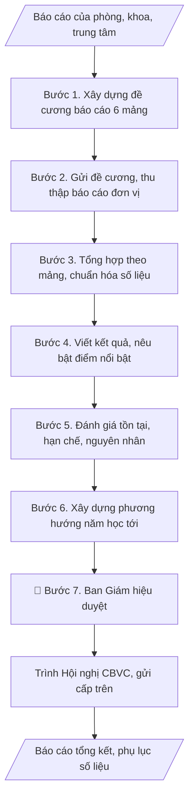

# Soạn báo cáo tổng kết năm học toàn trường

## Định dạng và file đầu ra

Định dạng đầu ra có thể chọn theo sản phẩm/yêu cầu: .docx, .pdf, .pptx. Đọc mục “Định dạng bổ sung” trong quy cách đầu ra trước khi chọn.

**Phải tạo file thực tế để tải xuống, không chỉ trả nội dung trong chat.** Định dạng mặc định của skill: **.docx**. Nếu có bảng số liệu nghiệp vụ yêu cầu file bảng tính riêng, tạo thêm Excel theo yêu cầu; không tự tạo file kiểm tra. Không chờ người dùng yêu cầu xuất file lần nữa. Ưu tiên định dạng người dùng chỉ định; đọc quy tắc xuất file tại references/quy-cach-dau-ra.md.

## Quy cách đầu ra và thông tin thiếu
Khi dựng file Word/Excel, áp dụng mục “Thể thức và bảng biểu khi dựng file” trong quy cách đầu ra (cỡ chữ từng thành phần, bảng nhiều trang, số trang, phụ lục). Đọc [quy cách và cấu trúc sản phẩm](references/quy-cach-dau-ra.md) trước khi soạn/xuất. File giao chỉ gồm sản phẩm nghiệp vụ được yêu cầu; kiểm tra nội bộ không xuất kèm. Thiếu thông tin thì giữ nguyên trường/mục và chỗ điền theo mẫu gốc (dòng dấu chấm, dấu gạch hoặc ô trống); không tự điền dữ liệu mẫu, số 0, mã chờ xác minh hay dòng chờ ký. Mẫu chuyên ngành còn áp dụng được ưu tiên về cấu trúc, mã biểu và người ký. Bản đầy đủ: [quy tắc chung](references/quy-tac-chung.md).

Khi người dùng yêu cầu bộ slide (.pptx), đọc mục “Xuất PowerPoint (.pptx) khi được yêu cầu” trong quy cách đầu ra.

Khi báo cáo có số liệu cần so sánh hoặc nêu xu hướng, đọc mục “Biểu đồ và hình trong báo cáo số liệu” trong quy cách đầu ra trước khi vẽ.

## Kiểm soát áp dụng và phê duyệt
Trước khi chạy, xác định `ngay_ap_dung`, `loai_hinh_truong`, `quy_che_noi_bo`, `nguon_du_lieu`, `nguoi_kiem_duyet`; chỉ hỏi thông tin liên quan nghiệp vụ, không dùng giá trị giả định thay dữ liệu bắt buộc. Đối chiếu căn cứ pháp lý với văn bản gốc, hiệu lực, điều khoản áp dụng và chuyển tiếp. Bản đầy đủ: [quy tắc chung](references/quy-tac-chung.md).

## Giới hạn và human gate
AI hỗ trợ chuẩn bị và đối chiếu; cán bộ phụ trách kiểm tra dữ liệu/căn cứ, người có thẩm quyền duyệt và ký. Không đánh dấu đã ký, đã duyệt, đã công bố khi chưa có chứng cứ. Dữ liệu sinh viên, sức khỏe, nhân sự, tài chính chỉ dùng theo mục đích và phân quyền, che thông tin định danh khi dùng ví dụ (Luật 91/2025/QH15, hiệu lực 01/01/2026); không tải dữ liệu lên dịch vụ ngoài khi chưa có quyền. Bản đầy đủ: [quy tắc chung](references/quy-tac-chung.md).

## Khi nào dùng
Khi tổng hợp báo cáo tổng kết năm học để trình Hội nghị cán bộ viên chức, báo cáo
cơ quan chủ quản, Bộ GD&ĐT.

## Đầu vào (Input)

| Trường | Mô tả | Bắt buộc |
|---|---|---|
| `nam_hoc` | Năm học (VD: 2025–2026) | Có |
| `bao_cao_don_vi` | Báo cáo / số liệu của các phòng, khoa, trung tâm theo từng mảng | Có |
| `dinh_huong_chung` | Định hướng, chỉ đạo của Ban Giám hiệu cho năm học | Không |

## Quy trình

**Bước 1. Xây dựng đề cương báo cáo**
- Làm gì: Dựng đề cương chi tiết với 6 mảng cố định: (1) Công tác đào tạo (tuyển sinh,
  CTĐT, học vụ, tốt nghiệp); (2) KHCN & hợp tác quốc tế; (3) Công tác sinh viên;
  (4) Tổ chức cán bộ, thi đua khen thưởng; (5) Tài chính, cơ sở vật chất; (6) Đảm bảo
  chất lượng, kiểm định. Với mỗi mảng, liệt kê các chỉ số bắt buộc phải có và biểu
  mẫu số liệu đính kèm; lấy ý kiến Ban Giám hiệu về định hướng, điểm nhấn của năm học.
- Dùng input: `nam_hoc`, `dinh_huong_chung`
- Vai trò: Ban Giám hiệu · AI hỗ trợ: dựng đề cương 6 mảng và biểu mẫu số liệu, Văn phòng trình Ban Giám hiệu chốt định hướng · ⏱ 3–5 giờ (ước tính)
- Lưu ý nghiệp vụ: Đề cương là "hợp đồng" với các đơn vị — càng chi tiết, số liệu thu
  về càng đồng đều, tránh mỗi đơn vị báo cáo một kiểu; chốt đề cương sớm (trước ít
  nhất 1 tháng so với hạn báo cáo) để đơn vị có thời gian chuẩn bị.
- → Kết quả bước: Đề cương báo cáo chi tiết 6 mảng (kèm biểu mẫu số liệu từng mảng).

**Bước 2. Gửi đề cương và thu thập báo cáo đơn vị**
- Làm gì: Gửi đề cương + biểu mẫu + thời hạn nộp đến tất cả phòng, khoa, trung tâm;
  đôn đốc các đơn vị nộp đúng hạn; tiếp nhận báo cáo/số liệu từng đơn vị; lập bảng
  theo dõi tiến độ nộp.
- Dùng input: `bao_cao_don_vi`
- Vai trò: Chuyên viên Văn phòng · AI hỗ trợ: hỗ trợ soạn văn bản, lập bảng theo dõi tiến độ nộp, Văn phòng đôn đốc và tiếp nhận báo cáo đơn vị · ⏱ 1–2 tuần (chờ đơn vị nộp) (ước tính)
- Lưu ý nghiệp vụ: Đơn vị nộp muộn là chuyện thường — gửi nhắc trước hạn 7 ngày và
  3 ngày; khi nhận báo cáo, kiểm tra ngay tính đầy đủ (có đủ các chỉ số trong đề cương
  không), thiếu thì yêu cầu bổ sung ngay, không để dồn đến lúc tổng hợp.
- → Kết quả bước: Tập hợp báo cáo/số liệu các đơn vị + bảng theo dõi tiến độ nộp.

**Bước 3. Tổng hợp theo mảng, chuẩn hóa số liệu**
- Làm gì: Gom số liệu các đơn vị theo 6 mảng; loại bỏ trùng lặp (nhiều đơn vị cùng
  báo một hoạt động); chuẩn hóa đơn vị tính và mốc thời gian; đối chiếu chéo số liệu
  liên quan giữa các đơn vị (VD: số SV tốt nghiệp của Đào tạo với số liệu việc làm
  của CTSV); yêu cầu đơn vị xác nhận lại các chênh lệch.
- Dùng input: `bao_cao_don_vi`
- Vai trò: Chuyên viên Văn phòng · AI hỗ trợ: gom số liệu, loại trùng lặp, chuẩn hóa đơn vị tính và đối chiếu chéo · ⏱ 2–4 ngày làm việc (ước tính)
- Lưu ý nghiệp vụ: Số liệu tổng hợp phải thống nhất một mốc thời gian (VD: tính đến
  31/7); chênh lệch chưa giải trình được thì không đưa vào báo cáo chính thức; ghi rõ
  nguồn số liệu từng dòng để truy xuất khi Ban Giám hiệu hỏi.
- → Kết quả bước: Bảng số liệu tổng hợp 6 mảng đã chuẩn hóa, đối chiếu nhất quán.

**Bước 4. Viết phần kết quả, nêu bật điểm nổi bật**
- Làm gì: Viết phần I (Kết quả thực hiện các mặt công tác) theo 6 mảng; rút gọn số
  liệu đơn vị thành các con số tổng hợp cấp trường; nêu bật kết quả nổi bật, điểm sáng
  (vượt chỉ tiêu, lần đầu đạt được, được cấp trên ghi nhận) bằng gạch đầu dòng có số
  liệu minh chứng; trình bày bảng biểu tổng hợp.
- Dùng input: (xử lý trên số liệu tổng hợp từ Bước 3)
- Vai trò: Chuyên viên Văn phòng · AI hỗ trợ: viết dự thảo Phần I theo 6 mảng kèm bảng biểu · ⏱ 1–2 ngày làm việc (ước tính)
- Lưu ý nghiệp vụ: Báo cáo cấp trường phải có "tầm" — tránh liệt kê vụn vặt kiểu cộng
  gộp báo cáo đơn vị; mỗi nhận định tích cực phải có số liệu đi kèm; số liệu so sánh
  với năm trước giúp Ban Giám hiệu thấy xu hướng.
- → Kết quả bước: Bản thảo Phần I (kết quả 6 mảng) với bảng biểu tổng hợp.

**Bước 5. Đánh giá tồn tại, hạn chế và nguyên nhân**
- Làm gì: Đối chiếu kết quả với kế hoạch/mục tiêu đầu năm học để xác định tồn tại,
  hạn chế; phân tích nguyên nhân khách quan và chủ quan cho từng tồn tại chính; viết
  Phần II (Tồn tại, hạn chế) ngắn gọn, thẳng thắn.
- Dùng input: `dinh_huong_chung`
- Vai trò: Ban Giám hiệu · AI hỗ trợ: đề xuất tồn tại từ đối chiếu kế hoạch đầu năm, Ban Giám hiệu quyết định nội dung Phần II · ⏱ 3–5 giờ (ước tính)
- Lưu ý nghiệp vụ: Tồn tại phải nói thẳng — báo cáo trình Hội nghị CBVC và cấp trên
  mà "toàn ưu điểm" sẽ mất uy tín; không đổ lỗi chung chung ("do khách quan"), mỗi
  tồn tại cần nguyên nhân cụ thể để phần phương hướng có cơ sở đề xuất giải pháp.
- → Kết quả bước: Bản thảo Phần II (tồn tại, hạn chế + nguyên nhân).

**Bước 6. Xây dựng phương hướng năm học tới**
- Làm gì: Căn cứ định hướng của Ban Giám hiệu và các tồn tại đã xác định, xây dựng
  Phần III: nhiệm vụ trọng tâm, chỉ tiêu cụ thể từng mảng, giải pháp thực hiện; mỗi
  nhiệm vụ gắn đơn vị chủ trì và thời gian hoàn thành.
- Dùng input: `dinh_huong_chung`
- Vai trò: Ban Giám hiệu · AI hỗ trợ: soạn dự thảo Phần III (nhiệm vụ, chỉ tiêu, giải pháp), Ban Giám hiệu chốt phương hướng · ⏱ 3–5 giờ (ước tính)
- Lưu ý nghiệp vụ: Phương hướng phải trả lời được các tồn tại ở Phần II — tồn tại nào
  không có giải pháp tương ứng sẽ bị chất vấn tại Hội nghị CBVC; chỉ tiêu phải đo lường
  được, tránh khẩu hiệu chung chung.
- → Kết quả bước: Bản thảo Phần III (nhiệm vụ trọng tâm, chỉ tiêu, giải pháp).

**Bước 7. Hoàn thiện, trình Ban Giám hiệu duyệt**
- Làm gì: Gộp 3 phần thành văn bản hoàn chỉnh; kiểm tra lần cuối: số liệu trong văn
  bản khớp bảng biểu và phụ lục, chính tả, thể thức; lập phụ lục số liệu tổng hợp theo
  mảng; trình Ban Giám hiệu duyệt; sau duyệt, trình Hội nghị CBVC và gửi cơ quan chủ
  quản/Bộ GD&ĐT; lưu hồ sơ.
- Dùng input: `nam_hoc`
- Vai trò: Ban Giám hiệu · AI hỗ trợ: tổng hợp, đối chiếu và trình bày số liệu · ⏱ 2–3 ngày làm việc (ước tính)
- Lưu ý nghiệp vụ: Kiểm tra số ký hiệu văn bản, ngày tháng, nơi nhận trước khi trình
  ký — sai thể thức ở báo cáo cấp trường rất mất điểm; phụ lục số liệu phải khớp 100%
  với số liệu trong văn bản chính.
- → Kết quả bước: Báo cáo tổng kết năm học toàn trường trình Ban Giám hiệu duyệt + phụ lục số liệu
  tổng hợp theo mảng.

## Luồng quy trình (Workflow)

## Đầu ra

File nghiệp vụ thực tế theo định dạng mặc định ở đầu skill hoặc định dạng người dùng yêu cầu, kèm liên kết tải trong phản hồi cuối.

Sản phẩm nghiệp vụ hoàn chỉnh theo [quy cách và cấu trúc](references/quy-cach-dau-ra.md), giữ các trường chưa có dữ liệu ở trạng thái trống. Không xuất kèm checklist/phụ lục kiểm tra đầu ra.

## Kiểm tra nội bộ trước khi giao

- [ ] Bố cục khớp mẫu áp dụng và cấu trúc tại references/quy-cach-dau-ra.md.
- [ ] Phần I có đủ 6 mảng công tác; số liệu trong văn bản khớp 100% với phụ lục số liệu theo mảng.
- [ ] Số liệu khớp với báo cáo các đơn vị đã nộp; chênh lệch chưa giải trình được đã loại khỏi báo cáo.
- [ ] Không bịa đặt số liệu, minh chứng; số liệu thiếu để trống ô và ghi nhận trong bảng theo dõi nộp.
- [ ] Mỗi nhận định tích cực có số liệu minh chứng đi kèm; có so sánh với năm học trước.
- [ ] Phần II: tồn tại nêu thẳng với nguyên nhân cụ thể; Phần III: mỗi tồn tại có giải pháp tương ứng, chỉ tiêu đo lường được.
- [ ] Đúng thể thức: số ký hiệu văn bản, ngày tháng, nơi nhận, chữ ký Hiệu trưởng.
- [ ] Đã qua Human gate: Ban Giám hiệu đã duyệt; đã trình Hội nghị CBVC và gửi cơ quan chủ quản/Bộ GD&ĐT.

Tiêu chí đạt = tất cả các ô được đánh dấu.

## Căn cứ & lưu ý
- Quy chế tổ chức và hoạt động của trường; yêu cầu báo cáo của cơ quan chủ quản.
- Số liệu các đơn vị phải được đối chiếu, thống nhất trước khi đưa vào báo cáo chung.
- Không dùng tên thật của trường/cá nhân khi mô phỏng.

## Quản trị phiên bản
- Phiên bản gói `1.3.2` (cập nhật 2026-10-10); hồ sơ đầy đủ tại [references/version.json](references/version.json).
- Người phê duyệt nghiệp vụ: **chưa chỉ định**. Trạng thái: dự thảo nghiệp vụ; kiểm tra pháp lý trước thực thi. Ngày cập nhật không đồng nghĩa mọi văn bản đã được rà soát toàn văn.
- Giấy phép theo LICENSE của kho (bản quyền CES Global). Lịch sử thay đổi: CHANGELOG.md.
