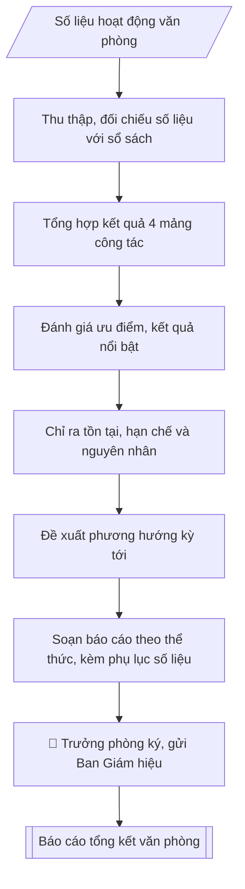

# Soạn báo cáo tổng kết công tác văn phòng

## Kiểm soát áp dụng và phê duyệt

Trước khi chạy quy trình, xác định `ngay_ap_dung`, `loai_hinh_truong`, `quy_che_noi_bo`, `nguon_du_lieu` và `nguoi_kiem_duyet`. Chỉ yêu cầu thông tin có liên quan đến nghiệp vụ; không dùng giá trị giả định thay dữ liệu bắt buộc. Hồ sơ có yếu tố pháp lý phải kèm văn bản gốc, tình trạng hiệu lực, điều khoản áp dụng và chuyển tiếp.

## Giới hạn và human gate

AI hỗ trợ chuẩn bị và đối chiếu. Cán bộ phụ trách kiểm tra dữ liệu/căn cứ, người có thẩm quyền duyệt và ký. Mọi đầu ra mặc định là **DỰ THẢO – CHỜ KIỂM DUYỆT**; không đánh dấu đã ký, đã duyệt hoặc đã công bố nếu chưa có chứng cứ. Dữ liệu sinh viên, sức khỏe, nhân sự và tài chính phải hạn chế theo mục đích, phân quyền và che thông tin định danh khi dùng ví dụ. Không tải dữ liệu lên dịch vụ ngoài khi chưa có quyền. Kiểm tra Luật 91/2025/QH15 về bảo vệ dữ liệu cá nhân (hiệu lực 01/01/2026) và quy định áp dụng trước xử lý/chia sẻ dữ liệu cá nhân.


## Khi nào dùng
Khi tổng kết công tác của Phòng Hành chính – Tổng hợp theo quý, 6 tháng, năm;
khi báo cáo chuyên đề về công tác văn thư, cải cách hành chính.

## Đầu vào (Input)

| Trường | Mô tả | Bắt buộc |
|---|---|---|
| `ky_bao_cao` | Quý / 6 tháng / năm + thời gian cụ thể | Có |
| `so_lieu` | Số liệu các mảng: văn bản đi/đến, cuộc họp phục vụ, sự kiện tổ chức, kiến nghị | Có |
| `don_vi` | Phòng Hành chính – Tổng hợp (mặc định) | Không |

## Quy trình

**Bước 1. Thu thập, đối chiếu số liệu**
- Làm gì: tập hợp `so_lieu` từ các nguồn (sổ văn bản đi/đến, lịch công tác tuần, biên bản họp, hồ sơ sự kiện); đối chiếu chéo giữa các nguồn để loại số liệu không có căn cứ, số liệu trùng lặp; chốt bộ số liệu chính thức của `ky_bao_cao`.
- Dùng input: `so_lieu`, `ky_bao_cao`.
- Vai trò: Chuyên viên Phòng HCTH (Trưởng phòng kiểm tra lại) · AI hỗ trợ: đối chiếu chéo tự động · ⏱ ~15–30 phút (ước tính)
- Lưu ý nghiệp vụ: số liệu phải đối chiếu với sổ văn bản đi/đến trước khi đưa vào báo cáo — bẫy là lấy số liệu miệng chưa kiểm chứng; ghi rõ nguồn của từng con số để truy vết khi bị chất vấn.
- → Kết quả bước: bảng số liệu đã đối chiếu, có ghi nguồn.

**Bước 2. Tổng hợp kết quả theo 4 mảng công tác**
- Làm gì: phân loại số liệu và kết quả vào 4 mảng: (1) công tác văn thư (văn bản đi/đến, tỷ lệ đúng hạn); (2) lễ tân, khánh tiết (số cuộc họp, sự kiện đã phục vụ); (3) quản trị hành chính (lịch công tác, quản lý con dấu, giấy tờ); (4) cải cách hành chính, ứng dụng CNTT trong văn phòng; viết thành dự thảo phần "Kết quả thực hiện", mỗi mảng có số liệu minh chứng.
- Dùng input: `so_lieu` (bảng đã đối chiếu từ Bước 1), `don_vi`.
- Vai trò: Chuyên viên Phòng HCTH · AI hỗ trợ: tổng hợp và chuẩn hóa dữ liệu · ⏱ ~20–45 phút (ước tính)
- Lưu ý nghiệp vụ: mỗi kết quả nêu ra phải có số liệu đi kèm — bẫy là viết chung chung "đạt kết quả tốt" không có con số; mảng nào không có hoạt động trong kỳ thì ghi rõ "không phát sinh", không bỏ trống.
- → Kết quả bước: dự thảo phần I. Kết quả thực hiện (4 mảng, có số liệu).

**Bước 3. Đánh giá ưu điểm, kết quả nổi bật**
- Làm gì: so sánh kết quả với kế hoạch công tác của kỳ; chọn 2–3 kết quả nổi bật nhất (có số liệu so sánh với kỳ trước hoặc vượt chỉ tiêu); viết thành dự thảo phần đánh giá ưu điểm.
- Dùng input: `so_lieu`, `ky_bao_cao`.
- Vai trò: Chuyên viên Phòng HCTH (Trưởng phòng kiểm tra lại) · AI hỗ trợ: xử lý sơ bộ theo quy trình · ⏱ ~15–30 phút (ước tính)
- Lưu ý nghiệp vụ: "nổi bật" phải chứng minh bằng số liệu (tăng bao nhiêu %, rút ngắn bao nhiêu thời gian), không tự phong; gắn kết quả với nỗ lực cụ thể của tập thể/cá nhân.
- → Kết quả bước: dự thảo phần đánh giá ưu điểm, kết quả nổi bật.

**Bước 4. Chỉ ra tồn tại, hạn chế và nguyên nhân**
- Làm gì: liệt kê các tồn tại, hạn chế (văn bản quá hạn, sự cố kỹ thuật, phối hợp chậm...); mỗi hạn chế phân tích nguyên nhân cụ thể (chủ quan / khách quan), không đổ lỗi chung chung; xác định hạn chế nào cần khắc phục ngay trong kỳ tới.
- Dùng input: `so_lieu` (các chỉ số chưa đạt).
- Vai trò: Chuyên viên Phòng HCTH · AI hỗ trợ: phân tích input, xác định yêu cầu · ⏱ ~20–30 phút (ước tính)
- Lưu ý nghiệp vụ: dám nêu hạn chế trung thực — báo cáo chỉ toàn ưu điểm sẽ mất giá trị; nguyên nhân phải chỉ đúng địa chỉ (đơn vị nào, khâu nào), tránh viết "do khách quan" chung chung.
- → Kết quả bước: dự thảo phần II. Tồn tại, hạn chế (kèm nguyên nhân).

**Bước 5. Đề xuất phương hướng kỳ tới**
- Làm gì: từ các tồn tại ở Bước 4, đề xuất nhiệm vụ trọng tâm và giải pháp khắc phục tương ứng; đặt chỉ tiêu phấn đấu cụ thể, đo được cho kỳ tới (VD: tỷ lệ văn bản đúng hạn, số sự kiện phục vụ); viết thành dự thảo phần "Phương hướng".
- Dùng input: `ky_bao_cao` (xác định kỳ tiếp theo), kết quả Bước 4.
- Vai trò: Chuyên viên Phòng HCTH · AI hỗ trợ: soạn dự thảo đúng thể thức · ⏱ ~20–30 phút (ước tính)
- Lưu ý nghiệp vụ: mỗi giải pháp phải gắn với một tồn tại đã nêu — bẫy là phương hướng chung chung không liên quan tồn tại; chỉ tiêu phải thực tế, có cơ sở đạt được.
- → Kết quả bước: dự thảo phần III. Phương hướng kỳ tới (nhiệm vụ, giải pháp, chỉ tiêu).

**Bước 6. Soạn báo cáo theo thể thức, trình duyệt**
- Làm gì: ghép các phần theo khung chuẩn (tiêu đề đơn vị – tên báo cáo – kết quả – tồn tại – phương hướng – ngày tháng, chữ ký); kiểm tra thể thức báo cáo hành chính theo Nghị định 30/2020/NĐ-CP; đính kèm phụ lục số liệu chi tiết; trình Trưởng phòng `don_vi` ký, gửi Ban Giám hiệu.
- Dùng input: `don_vi`, `ky_bao_cao`.
- Vai trò: Chuyên viên Phòng HCTH chuẩn bị, Trưởng phòng HCTH phê duyệt · AI hỗ trợ: tổng hợp hồ sơ, soạn phiếu trình/tờ trình đầy đủ · ⏱ ~15–30 phút chuẩn bị + chờ duyệt (ước tính)
- Lưu ý nghiệp vụ: kiểm tra lần cuối tính nhất quán số liệu giữa phần chính và phụ lục; báo cáo quý/năm phải gửi đúng thời hạn quy định về chế độ báo cáo nội bộ của trường.
- → Kết quả bước: báo cáo tổng kết công tác văn phòng hoàn chỉnh (+ phụ lục số liệu).

## Luồng quy trình (Workflow)



## Đầu ra (Output)
- Báo cáo tổng kết công tác văn phòng.
- Phụ lục số liệu chi tiết.

**Cấu trúc output chuẩn:** khung mẫu cố định của báo cáo tổng kết công tác văn phòng, theo đúng thứ tự:
1. Tiêu đề đơn vị (tên trường, tên phòng);
2. Tiêu đề báo cáo + kỳ báo cáo;
3. Phần I. Kết quả thực hiện — theo 4 mảng: công tác văn thư; lễ tân, khánh tiết; quản trị hành chính; cải cách hành chính (mỗi mảng có số liệu minh chứng);
4. Phần II. Tồn tại, hạn chế (kèm nguyên nhân cụ thể từng điểm);
5. Phần III. Phương hướng kỳ tới (nhiệm vụ trọng tâm, giải pháp khắc phục, chỉ tiêu phấn đấu);
6. Địa danh, ngày tháng; chữ ký Trưởng phòng (chức danh, họ tên);
7. Phụ lục số liệu chi tiết (kèm theo báo cáo).

## Checklist nghiệm thu

Tiêu chí đạt: tất cả các ô dưới đây được đánh dấu.

- [ ] Đủ các phần theo Cấu trúc output chuẩn: Tiêu đề đơn vị (tên trường, tên phòng); Tiêu đề báo cáo + kỳ báo cáo; Phần I. Kết quả thực hiện — theo 4 mảng: công tác văn thư; lễ tân,…; Phần II. Tồn tại, hạn chế (kèm nguyên nhân cụ thể từng điểm); … (đủ 7 phần)
- [ ] Nội dung và số liệu trong output khớp đúng với Input đã cho (không thêm, bớt hay suy diễn)
- [ ] Không bịa đặt số liệu, minh chứng, trích dẫn hay căn cứ
- [ ] Đúng thể thức và định dạng theo Kế hoạch công tác của Phòng
- [ ] Căn cứ pháp lý được trích dẫn đầy đủ và còn hiệu lực
- [ ] Đã qua Human gate: người có thẩm quyền đã kiểm tra/duyệt trước khi phát hành
- [ ] Số liệu phải đối chiếu với sổ văn bản đi/đến trước khi đưa vào báo cáo — bẫy là lấy số liệu miệng chưa kiểm chứng
- [ ] Mỗi kết quả nêu ra phải có số liệu đi kèm — bẫy là viết chung chung "đạt kết quả tốt" không có con số
- [ ] "nổi bật" phải chứng minh bằng số liệu (tăng bao nhiêu %, rút ngắn bao nhiêu thời gian), không tự phong

## Ví dụ mô phỏng (dữ liệu giả lập)

> Tất cả tên trường, cá nhân, số liệu dưới đây đều là **giả lập**, không liên quan tổ chức/cá nhân có thật.

### Input mẫu

| Trường | Giá trị |
|---|---|
| `ky_bao_cao` | Quý III năm 2026 (tháng 7–9/2026) |
| `so_lieu` | Văn bản đến: 342 (xử lý đúng hạn 98%); văn bản đi: 186; phục vụ 24 cuộc họp, 06 sự kiện (khai giảng, hội thảo...); 02 kiến nghị cải tiến quy trình văn thư |

### Output mẫu

```
TRƯỜNG ĐẠI HỌC A
PHÒNG HÀNH CHÍNH – TỔNG HỢP

BÁO CÁO TỔNG KẾT CÔNG TÁC VĂN PHÒNG QUÝ III NĂM 2026
(Dữ liệu giả lập)

I. KẾT QUẢ THỰC HIỆN
1. Công tác văn thư
- Tiếp nhận, xử lý 342 văn bản đến, đúng hạn 98% (335/342).
- Phát hành 186 văn bản đi, đảm bảo thể thức theo Nghị định 30/2020.
2. Lễ tân, khánh tiết
- Phục vụ 24 cuộc họp giao ban, hội đồng và 06 sự kiện (Lễ khai giảng,
  02 hội thảo khoa học, đón 03 đoàn khách).
3. Quản trị hành chính
- Ban hành lịch công tác tuần đầy đủ 13/13 tuần; quản lý con dấu, giấy tờ
  đúng quy định, không xảy ra sai sót.
4. Cải cách hành chính
- Triển khai ký số cho 100% văn bản đi nội bộ; rút ngắn 30% thời gian luân
  chuyển văn bản.

II. TỒN TẠI, HẠN CHẾ
- 07 văn bản đến xử lý quá hạn do đơn vị phối hợp chậm phản hồi.
- Hệ thống quản lý văn bản điện tử đôi lúc quá tải giờ cao điểm.

III. PHƯƠNG HƯỚNG QUÝ IV
1. Phấn đấu 100% văn bản đến xử lý đúng hạn; đôn đốc đơn vị phối hợp.
2. Nâng cấp hạ tầng hệ thống văn bản điện tử.
3. Chuẩn bị tổng kết công tác văn phòng năm 2026.

Thành phố C, ngày 02 tháng 10 năm 2026
TRƯỞNG PHÒNG [CHỜ KÝ]
ThS. Vũ Thị D

PHỤ LỤC: SỐ LIỆU CHI TIẾT QUÝ III/2026 (trích)
| Chỉ tiêu | Số lượng | Ghi chú |
|----------|----------|---------|
| Văn bản đến tiếp nhận | 342 | Đúng hạn 335 (98%) |
| Văn bản đi phát hành | 186 | 100% đúng thể thức |
| Cuộc họp phục vụ | 24 | Giao ban, hội đồng |
| Sự kiện phục vụ | 06 | Khai giảng, hội thảo, đón khách |
| Kiến nghị cải tiến | 02 | Cải tiến quy trình văn thư |
```

## Căn cứ & lưu ý
- Kế hoạch công tác của Phòng; quy định về chế độ báo cáo nội bộ của trường.
- Số liệu phải đối chiếu với sổ văn bản đi/đến trước khi đưa vào báo cáo.
- Không dùng tên thật của trường/cá nhân khi mô phỏng.

## Quản trị phiên bản

- Phiên bản gói: `1.1.0`; ngày cập nhật: `2026-10-09`.
- Kho nguồn: https://github.com/phamtruong91/dh-skills
- Người duy trì trên GitHub: `phamtruong91` (Phạm Văn Trường). Người phê duyệt nghiệp vụ: **chưa chỉ định**.
- Commit nguồn trước cập nhật: `78fd1d51b8acd1a724d9b9af6c488460bc7551ad`. Commit chứa phiên bản này xem bằng `git log -1 -- skills/bao-cao-tong-ket-vp`; không tự gán SHA chưa tạo.
- Giấy phép: theo LICENSE của kho; bản quyền CES Global.
- Lịch sử 1.1.0: bổ sung metadata giao diện, kiểm soát áp dụng, quản trị phiên bản.
- Trạng thái: dự thảo nghiệp vụ; kiểm tra pháp lý trước thực thi. Ngày cập nhật không đồng nghĩa mọi văn bản đã được rà soát toàn văn.
