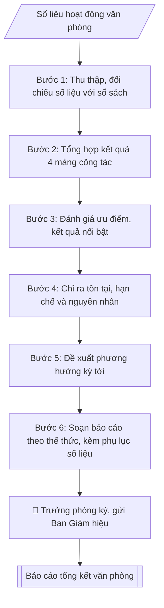

# Soạn báo cáo tổng kết công tác văn phòng

## Định dạng và file đầu ra

Định dạng đầu ra có thể chọn theo sản phẩm/yêu cầu: .docx, .pdf. Đọc mục “Định dạng bổ sung” trong quy cách đầu ra trước khi chọn.

**Phải tạo file thực tế để tải xuống, không chỉ trả nội dung trong chat.** Định dạng mặc định của skill: **.docx**. Nếu có bảng số liệu nghiệp vụ yêu cầu file bảng tính riêng, tạo thêm Excel theo yêu cầu; không tự tạo file kiểm tra. Không chờ người dùng yêu cầu xuất file lần nữa. Ưu tiên định dạng người dùng chỉ định; đọc quy tắc xuất file tại references/quy-cach-dau-ra.md.

## Quy cách đầu ra và thông tin thiếu
Khi dựng file Word/Excel, áp dụng mục “Thể thức và bảng biểu khi dựng file” trong quy cách đầu ra (cỡ chữ từng thành phần, bảng nhiều trang, số trang, phụ lục). Đọc [quy cách và cấu trúc sản phẩm](references/quy-cach-dau-ra.md) trước khi soạn/xuất. File giao chỉ gồm sản phẩm nghiệp vụ được yêu cầu; kiểm tra nội bộ không xuất kèm. Thiếu thông tin thì giữ nguyên trường/mục và chỗ điền theo mẫu gốc (dòng dấu chấm, dấu gạch hoặc ô trống); không tự điền dữ liệu mẫu, số 0, mã chờ xác minh hay dòng chờ ký. Mẫu chuyên ngành còn áp dụng được ưu tiên về cấu trúc, mã biểu và người ký. Bản đầy đủ: [quy tắc chung](references/quy-tac-chung.md).

Khi người dùng yêu cầu bộ slide (.pptx), đọc mục “Xuất PowerPoint (.pptx) khi được yêu cầu” trong quy cách đầu ra.

Khi báo cáo có số liệu cần so sánh hoặc nêu xu hướng, đọc mục “Biểu đồ và hình trong báo cáo số liệu” trong quy cách đầu ra trước khi vẽ.

## Kiểm soát áp dụng và phê duyệt
Trước khi chạy, xác định `ngay_ap_dung`, `loai_hinh_truong`, `quy_che_noi_bo`, `nguon_du_lieu`, `nguoi_kiem_duyet`; chỉ hỏi thông tin liên quan nghiệp vụ, không dùng giá trị giả định thay dữ liệu bắt buộc. Đối chiếu căn cứ pháp lý với văn bản gốc, hiệu lực, điều khoản áp dụng và chuyển tiếp. Bản đầy đủ: [quy tắc chung](references/quy-tac-chung.md).

## Giới hạn và human gate
AI hỗ trợ chuẩn bị và đối chiếu; cán bộ phụ trách kiểm tra dữ liệu/căn cứ, người có thẩm quyền duyệt và ký. Không đánh dấu đã ký, đã duyệt, đã công bố khi chưa có chứng cứ. Dữ liệu sinh viên, sức khỏe, nhân sự, tài chính chỉ dùng theo mục đích và phân quyền, che thông tin định danh khi dùng ví dụ (Luật 91/2025/QH15, hiệu lực 01/01/2026); không tải dữ liệu lên dịch vụ ngoài khi chưa có quyền. Bản đầy đủ: [quy tắc chung](references/quy-tac-chung.md).

## Khi nào dùng
Khi tổng kết công tác của Phòng Hành chính – Tổng hợp theo quý, 6 tháng, năm;
khi báo cáo chuyên đề về công tác văn thư, cải cách hành chính.

## Đầu vào (Input)

| Trường | Mô tả | Bắt buộc |
|---|---|---|
| `ky_bao_cao` | Quý / 6 tháng / năm + thời gian cụ thể | Có |
| `so_lieu` | Số liệu các mảng: văn bản đi/đến, cuộc họp phục vụ, sự kiện tổ chức, kiến nghị | Có |
| `don_vi` | Phòng Hành chính – Tổng hợp (mặc định) | Không |

## Quy trình

**Bước 1. Thu thập, đối chiếu số liệu**
- Làm gì: tập hợp `so_lieu` từ các nguồn (sổ văn bản đi/đến, lịch công tác tuần, biên bản họp, hồ sơ sự kiện); đối chiếu chéo giữa các nguồn để loại số liệu không có căn cứ, số liệu trùng lặp; chốt bộ số liệu chính thức của `ky_bao_cao`.
- Dùng input: `so_lieu`, `ky_bao_cao`.
- Vai trò: Chuyên viên Phòng HCTH (Trưởng phòng kiểm tra lại) · AI hỗ trợ: đối chiếu chéo tự động · ⏱ ~15–30 phút (ước tính)
- Lưu ý nghiệp vụ: số liệu phải đối chiếu với sổ văn bản đi/đến trước khi đưa vào báo cáo — bẫy là lấy số liệu miệng chưa kiểm chứng; ghi rõ nguồn của từng con số để truy vết khi bị chất vấn.
- → Kết quả bước: bảng số liệu đã đối chiếu, có ghi nguồn.

**Bước 2. Tổng hợp kết quả theo 4 mảng công tác**
- Làm gì: phân loại số liệu và kết quả vào 4 mảng: (1) công tác văn thư (văn bản đi/đến, tỷ lệ đúng hạn); (2) lễ tân, khánh tiết (số cuộc họp, sự kiện đã phục vụ); (3) quản trị hành chính (lịch công tác, quản lý con dấu, giấy tờ); (4) cải cách hành chính, ứng dụng CNTT trong văn phòng; viết thành dự thảo phần "Kết quả thực hiện", mỗi mảng có số liệu minh chứng.
- Dùng input: `so_lieu` (bảng đã đối chiếu từ Bước 1), `don_vi`.
- Vai trò: Chuyên viên Phòng HCTH · AI hỗ trợ: tổng hợp và chuẩn hóa dữ liệu · ⏱ ~20–45 phút (ước tính)
- Lưu ý nghiệp vụ: mỗi kết quả nêu ra phải có số liệu đi kèm — bẫy là viết chung chung "đạt kết quả tốt" không có con số; mảng nào không có hoạt động trong kỳ thì ghi rõ "không phát sinh", không bỏ trống.
- → Kết quả bước: dự thảo phần I. Kết quả thực hiện (4 mảng, có số liệu).

**Bước 3. Đánh giá ưu điểm, kết quả nổi bật**
- Làm gì: so sánh kết quả với kế hoạch công tác của kỳ; chọn 2–3 kết quả nổi bật nhất (có số liệu so sánh với kỳ trước hoặc vượt chỉ tiêu); viết thành dự thảo phần đánh giá ưu điểm.
- Dùng input: `so_lieu`, `ky_bao_cao`.
- Vai trò: Chuyên viên Phòng HCTH (Trưởng phòng kiểm tra lại) · AI hỗ trợ: xử lý sơ bộ theo quy trình · ⏱ ~15–30 phút (ước tính)
- Lưu ý nghiệp vụ: "nổi bật" phải chứng minh bằng số liệu (tăng bao nhiêu %, rút ngắn bao nhiêu thời gian), không tự phong; gắn kết quả với nỗ lực cụ thể của tập thể/cá nhân.
- → Kết quả bước: dự thảo phần đánh giá ưu điểm, kết quả nổi bật.

**Bước 4. Chỉ ra tồn tại, hạn chế và nguyên nhân**
- Làm gì: liệt kê các tồn tại, hạn chế (văn bản quá hạn, sự cố kỹ thuật, phối hợp chậm...); mỗi hạn chế phân tích nguyên nhân cụ thể (chủ quan / khách quan), không đổ lỗi chung chung; xác định hạn chế nào cần khắc phục ngay trong kỳ tới.
- Dùng input: `so_lieu` (các chỉ số chưa đạt).
- Vai trò: Chuyên viên Phòng HCTH · AI hỗ trợ: phân tích input, xác định yêu cầu · ⏱ ~20–30 phút (ước tính)
- Lưu ý nghiệp vụ: dám nêu hạn chế trung thực — báo cáo chỉ toàn ưu điểm sẽ mất giá trị; nguyên nhân phải chỉ đúng địa chỉ (đơn vị nào, khâu nào), tránh viết "do khách quan" chung chung.
- → Kết quả bước: dự thảo phần II. Tồn tại, hạn chế (kèm nguyên nhân).

**Bước 5. Đề xuất phương hướng kỳ tới**
- Làm gì: từ các tồn tại ở Bước 4, đề xuất nhiệm vụ trọng tâm và giải pháp khắc phục tương ứng; đặt chỉ tiêu phấn đấu cụ thể, đo được cho kỳ tới (VD: tỷ lệ văn bản đúng hạn, số sự kiện phục vụ); viết thành dự thảo phần "Phương hướng".
- Dùng input: `ky_bao_cao` (xác định kỳ tiếp theo), kết quả Bước 4.
- Vai trò: Chuyên viên Phòng HCTH · AI hỗ trợ: soạn dự thảo đúng thể thức · ⏱ ~20–30 phút (ước tính)
- Lưu ý nghiệp vụ: mỗi giải pháp phải gắn với một tồn tại đã nêu — bẫy là phương hướng chung chung không liên quan tồn tại; chỉ tiêu phải thực tế, có cơ sở đạt được.
- → Kết quả bước: dự thảo phần III. Phương hướng kỳ tới (nhiệm vụ, giải pháp, chỉ tiêu).

**Bước 6. Soạn báo cáo theo thể thức, trình duyệt**
- Làm gì: ghép các phần theo khung chuẩn (tiêu đề đơn vị – tên báo cáo – kết quả – tồn tại – phương hướng – ngày tháng, chữ ký); kiểm tra thể thức báo cáo hành chính theo Nghị định 30/2020/NĐ-CP; đính kèm phụ lục số liệu chi tiết; trình Trưởng phòng `don_vi` ký, gửi Ban Giám hiệu.
- Dùng input: `don_vi`, `ky_bao_cao`.
- Vai trò: Chuyên viên Phòng HCTH chuẩn bị, Trưởng phòng HCTH phê duyệt · AI hỗ trợ: tổng hợp hồ sơ, soạn phiếu trình/tờ trình đầy đủ · ⏱ ~15–30 phút chuẩn bị + chờ duyệt (ước tính)
- Lưu ý nghiệp vụ: kiểm tra lần cuối tính nhất quán số liệu giữa phần chính và phụ lục; báo cáo quý/năm phải gửi đúng thời hạn quy định về chế độ báo cáo nội bộ của trường.
- → Kết quả bước: báo cáo tổng kết công tác văn phòng hoàn chỉnh (+ phụ lục số liệu).

## Luồng quy trình (Workflow)

## Đầu ra

File nghiệp vụ thực tế theo định dạng mặc định ở đầu skill hoặc định dạng người dùng yêu cầu, kèm liên kết tải trong phản hồi cuối.

Sản phẩm nghiệp vụ hoàn chỉnh theo [quy cách và cấu trúc](references/quy-cach-dau-ra.md), giữ các trường chưa có dữ liệu ở trạng thái trống. Không xuất kèm checklist/phụ lục kiểm tra đầu ra.

## Kiểm tra nội bộ trước khi giao

Các tiêu chí sau dùng để tự đối chiếu; không sao chép vào file xuất. Mục thiếu dữ liệu được để trống, không đánh dấu đã đạt hoặc đã duyệt.

- [ ] Bố cục khớp mẫu áp dụng và cấu trúc tại references/quy-cach-dau-ra.md.
- [ ] Nội dung và số liệu trong output khớp đúng với Input đã cho (không thêm, bớt hay suy diễn)
- [ ] Không bịa đặt số liệu, minh chứng, trích dẫn hay căn cứ
- [ ] Đúng cấu trúc và thể thức theo references/quy-cach-dau-ra.md.
- [ ] Căn cứ pháp lý được trích dẫn đầy đủ và còn hiệu lực
- [ ] Không coi bản soạn là đã ký/đã duyệt; việc phê duyệt thuộc người có thẩm quyền trước phát hành
- [ ] Số liệu phải đối chiếu với sổ văn bản đi/đến trước khi đưa vào báo cáo — bẫy là lấy số liệu miệng chưa kiểm chứng
- [ ] Mỗi kết quả nêu ra phải có số liệu đi kèm — bẫy là viết chung chung "đạt kết quả tốt" không có con số
- [ ] "nổi bật" phải chứng minh bằng số liệu (tăng bao nhiêu %, rút ngắn bao nhiêu thời gian), không tự phong

## Căn cứ & lưu ý
- Kế hoạch công tác của Phòng; quy định về chế độ báo cáo nội bộ của trường.
- Số liệu phải đối chiếu với sổ văn bản đi/đến trước khi đưa vào báo cáo.
- Không dùng tên thật của trường/cá nhân khi mô phỏng.

## Quản trị phiên bản
- Phiên bản gói `1.3.2` (cập nhật 2026-10-10); hồ sơ đầy đủ tại [references/version.json](references/version.json).
- Người phê duyệt nghiệp vụ: **chưa chỉ định**. Trạng thái: dự thảo nghiệp vụ; kiểm tra pháp lý trước thực thi. Ngày cập nhật không đồng nghĩa mọi văn bản đã được rà soát toàn văn.
- Giấy phép theo LICENSE của kho (bản quyền CES Global). Lịch sử thay đổi: CHANGELOG.md.
