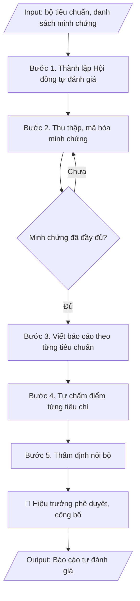

# Skill: Báo cáo tự đánh giá (kiểm định chất lượng)

## Khi nào dùng
Khi trường tiến hành tự đánh giá cơ sở giáo dục (CSGD) hoặc chương trình đào tạo (CTĐT)
để chuẩn bị đăng ký kiểm định chất lượng giáo dục.

## Đầu vào (Input)

| Trường | Mô tả | Bắt buộc |
|---|---|---|
| `doi_tuong` | Tự đánh giá CSGD / Tự đánh giá CTĐT (ghi rõ tên CTĐT, ngành) | Có |
| `bo_tieu_chuan` | Bộ tiêu chuẩn áp dụng (VD: 25 tiêu chuẩn CSGD theo TT 12/2017) | Có |
| `chu_ky` | Chu kỳ đánh giá (VD: 2021–2026) | Có |
| `minh_chung` | Danh sách minh chứng đã mã hóa theo từng tiêu chí | Có |
| `don_vi_thuc_hien` | Hội đồng tự đánh giá, các nhóm công tác | Không |

## Quy trình

**Bước 1. Thành lập Hội đồng tự đánh giá**
- Làm gì: Ban hành quyết định thành lập Hội đồng tự đánh giá (Chủ tịch, Phó Chủ tịch, Thư ký, các ủy viên); thành lập các nhóm công tác theo từng lĩnh vực/tiêu chuẩn của bộ tiêu chuẩn; ban hành kế hoạch tự đánh giá chi tiết (mốc thời gian, sản phẩm từng nhóm, kinh phí).
- Dùng input: `doi_tuong`, `bo_tieu_chuan`, `don_vi_thuc_hien`.
- Vai trò: Hiệu trưởng ký ban hành quyết định thành lập Hội đồng tự đánh giá · AI hỗ trợ: soạn dự thảo quyết định và kế hoạch tự đánh giá, gợi ý thành phần hội đồng theo lĩnh vực · ⏱ ~3 ngày làm việc (ước tính)
- Lưu ý nghiệp vụ: thành viên hội đồng phải bao quát đủ các lĩnh vực trong bộ tiêu chuẩn; nhóm công tác mỗi tiêu chuẩn cần có người am hiểu lĩnh vực đó và 01 thư ký theo dõi minh chứng.
- → Kết quả bước: Quyết định thành lập Hội đồng + kế hoạch tự đánh giá chi tiết.

**Bước 2. Thu thập và mã hóa minh chứng**
- Làm gì: Mỗi nhóm công tác thu thập minh chứng cho các tiêu chí được phân công từ các đơn vị (văn bản, quyết định, số liệu, biên bản, hình ảnh...); kiểm tra mỗi tiêu chí có tối thiểu minh chứng theo yêu cầu của bộ tiêu chuẩn; mã hóa thống nhất toàn trường theo quy tắc (VD: H1.1.01 – minh chứng 01 của tiêu chí 1, tiêu chuẩn 1); lập danh mục minh chứng theo mã.
- Dùng input: `bo_tieu_chuan`, `minh_chung`, `chu_ky`.
- Vai trò: Nhóm công tác theo từng tiêu chuẩn (thu thập minh chứng từ các đơn vị) · AI hỗ trợ: kiểm tra tính đầy đủ minh chứng và mã hóa sơ bộ theo quy tắc · ⏱ ~2 tuần (ước tính)
- Lưu ý nghiệp vụ: minh chứng phải có thật, còn hiệu lực trong chu kỳ đánh giá, lưu trữ được để đoàn đánh giá ngoài kiểm tra gốc — tuyệt đối không tạo minh chứng giả; mã minh chứng phải duy nhất và nhất quán giữa checklist, báo cáo và hồ sơ lưu.
- → Kết quả bước: Danh mục minh chứng đã mã hóa thống nhất theo từng tiêu chí.

**Bước 3. Viết báo cáo theo từng tiêu chuẩn**
- Làm gì: Mỗi nhóm công tác viết phần đánh giá các tiêu chí được phân công theo cấu trúc chuẩn của từng tiêu chí: **Mô tả** (hiện trạng của trường/CTĐT đối với tiêu chí, mỗi nhận định dẫn chiếu mã minh chứng) → **Điểm mạnh** (những mặt đã đạt, vượt yêu cầu) → **Tồn tại** (những mặt chưa đạt hoặc cần cải thiện) → **Kế hoạch cải tiến** (giải pháp cụ thể, đơn vị thực hiện, thời hạn); thư ký tổng hợp thành dự thảo báo cáo đầy đủ các tiêu chuẩn.
- Dùng input: `bo_tieu_chuan`, `minh_chung`, `chu_ky`, `doi_tuong`.
- Vai trò: Nhóm công tác theo từng tiêu chuẩn (viết và biên tập báo cáo) · AI hỗ trợ: soạn dự thảo từng tiêu chí từ minh chứng đã mã hóa · ⏱ ~2 tuần (ước tính)
- Lưu ý nghiệp vụ: bẫy thường gặp — viết mô tả chung chung không dẫn chiếu minh chứng; "điểm mạnh" thực chất là việc đương nhiên phải làm; kế hoạch cải tiến thiếu đơn vị thực hiện và thời hạn cụ thể.
- → Kết quả bước: Dự thảo báo cáo tự đánh giá đầy đủ các tiêu chuẩn theo cấu trúc chuẩn từng tiêu chí.

**Bước 4. Đánh giá mức đạt**
- Làm gì: Hội đồng tự chấm điểm từng tiêu chí theo thang đánh giá của bộ tiêu chuẩn (VD: thang 7 mức của kiểm định CSGD); đối chiếu điểm tự chấm với minh chứng và mô tả đã viết — mức điểm cao phải có minh chứng tương xứng; tổng hợp bảng tự đánh giá mức đạt theo từng tiêu chí/tiêu chuẩn.
- Dùng input: `bo_tieu_chuan`, `minh_chung`.
- Vai trò: Hội đồng tự đánh giá (họp tự chấm điểm) · AI hỗ trợ: tổng hợp bảng tự đánh giá mức đạt, đối chiếu mức điểm với minh chứng · ⏱ ~2 ngày làm việc (ước tính)
- Lưu ý nghiệp vụ: không tự chấm điểm cao hơn mức minh chứng cho phép — đoàn đánh giá ngoài sẽ hạ điểm và ghi nhận thiếu trung thực; các tiêu chí cùng một tiêu chuẩn phải có mức điểm nhất quán với nhận định trong báo cáo.
- → Kết quả bước: Bảng tự đánh giá mức đạt theo từng tiêu chí (Phụ lục 01).

**Bước 5. Thẩm định nội bộ**
- Làm gì: Hội đồng tự đánh giá họp rà soát toàn bộ dự thảo: tính nhất quán giữa các tiêu chuẩn, đầy đủ dẫn chiếu minh chứng, số liệu không mâu thuẫn giữa các phần; kiểm tra ngẫu nhiên hồ sơ minh chứng gốc; hiệu đính và hoàn thiện dự thảo cuối.
- Dùng input: `minh_chung`, `doi_tuong`.
- Vai trò: Hội đồng tự đánh giá (thẩm định nội bộ, kiểm tra chéo) · AI hỗ trợ: rà soát tính nhất quán số liệu và dẫn chiếu minh chứng giữa các phần · ⏱ ~3 ngày làm việc (ước tính)
- Lưu ý nghiệp vụ: kiểm tra chéo — nhóm này rà soát phần viết của nhóm khác để phát hiện thiên vị; mọi số liệu trong báo cáo phải truy xuất được đến minh chứng gốc.
- → Kết quả bước: Dự thảo báo cáo cuối cùng đã thẩm định nội bộ.

**Bước 6. Phê duyệt – công bố**
- Làm gì: Trình Hiệu trưởng ký ban hành báo cáo tự đánh giá; gửi báo cáo đến cơ quan quản lý và tổ chức kiểm định theo quy định; công bố nội bộ trong trường; lưu hồ sơ báo cáo + toàn bộ minh chứng theo mã.
- Dùng input: `doi_tuong`, `chu_ky`.
- Vai trò: Hiệu trưởng ký ban hành · AI hỗ trợ: kiểm tra thể thức văn bản và danh sách nơi nhận trước khi ban hành · ⏱ ~1 tuần (ước tính)
- Lưu ý nghiệp vụ: báo cáo tự đánh giá là tài liệu gốc cho đoàn đánh giá ngoài — sau khi ban hành không tự ý sửa nội dung; lưu trữ đầy đủ để phục vụ chu kỳ kiểm định tiếp theo.
- → Kết quả bước: Báo cáo tự đánh giá đã ban hành + hồ sơ minh chứng lưu trữ đầy đủ.

## Luồng quy trình (Workflow)


## Đầu ra (Output)
- Báo cáo tự đánh giá hoàn chỉnh (cấu trúc: mở đầu – tổng quan – đánh giá từng tiêu chuẩn – kết luận – phụ lục minh chứng).
- Bảng tự đánh giá mức đạt theo từng tiêu chí.

**Cấu trúc output chuẩn:** báo cáo tự đánh giá gồm các phần bắt buộc theo đúng thứ tự:
1. Trang bìa (tên báo cáo, đối tượng tự đánh giá, chu kỳ đánh giá, tên trường, năm ban hành);
2. Mục lục;
3. Phần mở đầu (cơ sở pháp lý, mục đích, phạm vi, phương pháp tự đánh giá, tổ chức thực hiện);
4. Tổng quan về trường / chương trình đào tạo (lịch sử, quy mô, sứ mệnh, cơ cấu tổ chức);
5. Đánh giá từng tiêu chuẩn theo thứ tự của bộ tiêu chuẩn; mỗi tiêu chí gồm đúng 5 mục: Mô tả (dẫn chiếu mã minh chứng) – Điểm mạnh – Tồn tại – Kế hoạch cải tiến – Tự đánh giá mức đạt;
6. Kết luận chung (số tiêu chuẩn đạt/không đạt, nhận định tổng thể, định hướng cải tiến);
7. Phụ lục 01 – Bảng tự đánh giá mức đạt theo từng tiêu chí;
8. Phụ lục 02 – Danh mục minh chứng mã hóa (mã MC, tên minh chứng, đơn vị cung cấp, tình trạng).

## Checklist nghiệm thu

- [ ] Đủ 8 phần theo "Cấu trúc output chuẩn": trang bìa; mục lục; phần mở đầu; tổng quan về trường/chương trình đào tạo; đánh giá từng tiêu chuẩn (mỗi tiêu chí đủ 5 mục: Mô tả – Điểm mạnh – Tồn tại – Kế hoạch cải tiến – Tự đánh giá mức đạt); kết luận chung; Phụ lục 01 – bảng tự đánh giá mức đạt; Phụ lục 02 – danh mục minh chứng mã hóa.
- [ ] Số liệu, nhận định trong báo cáo khớp với Input và truy xuất được đến minh chứng gốc.
- [ ] Không bịa đặt minh chứng, số liệu, mức điểm tự đánh giá.
- [ ] Đúng bộ tiêu chuẩn kiểm định hiện hành, đúng thứ tự tiêu chuẩn/tiêu chí; cấu trúc mỗi tiêu chí đúng 5 mục.
- [ ] Căn cứ pháp lý (bộ tiêu chuẩn, quy định kiểm định) đầy đủ, còn hiệu lực.
- [ ] Đã qua Human gate: người có thẩm quyền theo quy trình đã duyệt.
- [ ] Mỗi nhận định trong phần Mô tả đều dẫn chiếu mã minh chứng; mã minh chứng duy nhất, nhất quán giữa báo cáo, checklist và hồ sơ lưu.
- [ ] Mức điểm tự chấm không cao hơn mức minh chứng cho phép; kế hoạch cải tiến của mỗi tiêu chí có đơn vị thực hiện và thời hạn cụ thể.

Tiêu chí đạt = tất cả các ô được đánh dấu.

## Ví dụ mô phỏng (dữ liệu giả lập)

> Tất cả tên trường, cá nhân, số liệu dưới đây đều là **giả lập**, không liên quan tổ chức/cá nhân có thật.

### Input mẫu

| Trường | Giá trị |
|---|---|
| `doi_tuong` | Tự đánh giá chương trình đào tạo ngành Công nghệ thông tin, trình độ đại học |
| `bo_tieu_chuan` | Bộ tiêu chuẩn đánh giá CTĐT (11 tiêu chuẩn) |
| `chu_ky` | 2021–2026 |
| `minh_chung` | 85 minh chứng đã mã hóa (H1.01 – H11.12) |

### Output mẫu (trích 01 tiêu chuẩn)

```
BÁO CÁO TỰ ĐÁNH GIÁ
Chương trình đào tạo ngành Công nghệ thông tin – Trường Đại học A
Chu kỳ đánh giá: 2021–2026

...

Tiêu chuẩn 3. CHƯƠNG TRÌNH DẠY HỌC

Tiêu chí 3.1. Triết lý giáo dục của nhà trường được tuyên bố rõ ràng và
được phổ biến để định hướng các hoạt động đào tạo.

Mô tả:
Triết lý giáo dục "Thực học – Thực hành – Thực nghiệp" được nêu trong Chiến lược
phát triển Trường giai đoạn 2021–2030 (minh chứng H3.1.01) và Sổ tay sinh viên
(minh chứng H3.1.02). 92% giảng viên được khảo sát nắm được triết lý giáo dục
(minh chứng H3.1.03).

Điểm mạnh:
Triết lý giáo dục được văn bản hóa đầy đủ, phổ biến rộng rãi đến các bên liên quan.

Tồn tại:
Việc lồng ghép triết lý giáo dục vào từng học phần chưa đồng đều giữa các bộ môn.

Kế hoạch cải tiến:
- Rà soát, bổ sung triết lý giáo dục vào đề cương chi tiết 100% học phần (Khoa CNTT,
  hoàn thành trước tháng 6/2027).
- Tổ chức 02 hội thảo chia sẻ kinh nghiệm lồng ghép triết lý vào giảng dạy.

Tự đánh giá mức đạt: 5/7.

...

KẾT LUẬN CHUNG
Chương trình đào tạo ngành Công nghệ thông tin đáp ứng 10/11 tiêu chuẩn ở mức
đạt yêu cầu trở lên; 01 tiêu chuẩn cần cải tiến (tiêu chuẩn 6 – Giảng viên).
Kế hoạch cải tiến tổng thể kèm theo Phụ lục 02.

PHỤ LỤC: Danh mục minh chứng (trích mẫu)

| Mã MC | Tên minh chứng | Đơn vị cung cấp | Tình trạng |
|---|---|---|---|
| H3.1.01 | Chiến lược phát triển Trường 2021–2030 | P. HCTH | Đầy đủ |
| H3.1.02 | Sổ tay sinh viên năm học 2026–2027 | P. CTSV | Đầy đủ |
| H3.1.03 | Kết quả khảo sát giảng viên 2026 | P. KT&ĐBCL | Đầy đủ |
```

## Căn cứ & lưu ý
- Thông tư 12/2017/TT-BGDĐT: kiểm định chất lượng cơ sở giáo dục đại học (25 tiêu chuẩn).
- Thông tư 04/2016/TT-BGDĐT: tiêu chuẩn đánh giá chương trình đào tạo.
- Mỗi nhận định trong báo cáo **bắt buộc** dẫn chiếu mã minh chứng; minh chứng phải có thật,
  lưu trữ đầy đủ để đoàn đánh giá ngoài kiểm tra.
- Không dùng tên thật của trường/cá nhân khi mô phỏng.
