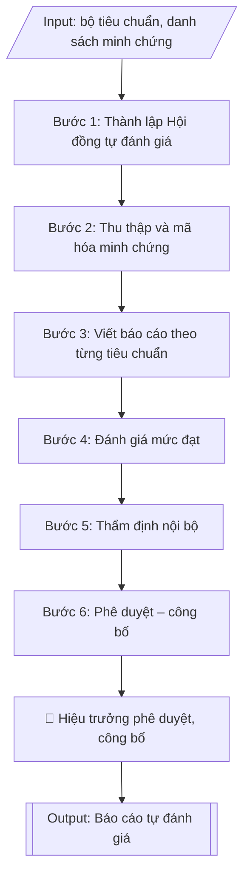

# Báo cáo tự đánh giá (kiểm định chất lượng)

## Định dạng và file đầu ra
Định dạng đầu ra có thể chọn theo sản phẩm/yêu cầu: .docx, .pdf. Đọc mục “Định dạng bổ sung” trong quy cách đầu ra trước khi chọn.

**Phải tạo file thực tế để tải xuống, không chỉ trả nội dung trong chat.** Định dạng mặc định của skill: **.docx**. Nếu có bảng số liệu nghiệp vụ yêu cầu file bảng tính riêng, tạo thêm Excel theo yêu cầu; không tự tạo file kiểm tra. Không chờ người dùng yêu cầu xuất file lần nữa. Ưu tiên định dạng người dùng chỉ định; đọc quy tắc xuất file tại references/quy-cach-dau-ra.md.

## Quy cách đầu ra và thông tin thiếu
Đọc [quy cách và cấu trúc sản phẩm](references/quy-cach-dau-ra.md) trước khi soạn/xuất. File giao chỉ gồm sản phẩm nghiệp vụ được yêu cầu; kiểm tra nội bộ không xuất kèm. Thiếu thông tin thì giữ nguyên trường/mục và chỗ điền theo mẫu gốc (dòng dấu chấm, dấu gạch hoặc ô trống); không tự điền dữ liệu mẫu, số 0, mã chờ xác minh hay dòng chờ ký. Mẫu chuyên ngành còn áp dụng được ưu tiên về cấu trúc, mã biểu và người ký. Bản đầy đủ: [quy tắc chung](references/quy-tac-chung.md).

## Kiểm soát áp dụng và phê duyệt
Trước khi chạy, xác định `ngay_ap_dung`, `loai_hinh_truong`, `quy_che_noi_bo`, `nguon_du_lieu`, `nguoi_kiem_duyet`; chỉ hỏi thông tin liên quan nghiệp vụ, không dùng giá trị giả định thay dữ liệu bắt buộc. Đối chiếu căn cứ pháp lý với văn bản gốc, hiệu lực, điều khoản áp dụng và chuyển tiếp. Bản đầy đủ: [quy tắc chung](references/quy-tac-chung.md).

Nếu có cập nhật pháp lý dưới đây, đọc [căn cứ và điều kiện áp dụng](references/phap-ly.md) trước khi làm. Quy trình dưới đây giữ nghiệp vụ từ bản gốc; mọi viện dẫn văn bản, mẫu biểu, điều khoản phải theo căn cứ đã chọn trong phap-ly.md, không theo văn bản cũ.

## Giới hạn và human gate
AI hỗ trợ chuẩn bị và đối chiếu; cán bộ phụ trách kiểm tra dữ liệu/căn cứ, người có thẩm quyền duyệt và ký. Không đánh dấu đã ký, đã duyệt, đã công bố khi chưa có chứng cứ. Dữ liệu sinh viên, sức khỏe, nhân sự, tài chính chỉ dùng theo mục đích và phân quyền, che thông tin định danh khi dùng ví dụ (Luật 91/2025/QH15, hiệu lực 01/01/2026); không tải dữ liệu lên dịch vụ ngoài khi chưa có quyền. Bản đầy đủ: [quy tắc chung](references/quy-tac-chung.md).

## Khi nào dùng
Khi trường tiến hành tự đánh giá cơ sở giáo dục (CSGD) hoặc chương trình đào tạo (CTĐT)
để chuẩn bị đăng ký kiểm định chất lượng giáo dục.

## Đầu vào (Input)
| Trường | Mô tả | Bắt buộc |
|---|---|---|
| `doi_tuong` | Tự đánh giá CSGD / Tự đánh giá CTĐT (ghi rõ tên CTĐT, ngành) | Có |
| `bo_tieu_chuan` | Bộ tiêu chuẩn áp dụng (VD: 25 tiêu chuẩn CSGD theo văn bản hiện hành nêu tại phap-ly.md) | Có |
| `chu_ky` | Chu kỳ đánh giá (VD: 2021–2026) | Có |
| `minh_chung` | Danh sách minh chứng đã mã hóa theo từng tiêu chí | Có |
| `don_vi_thuc_hien` | Hội đồng tự đánh giá, các nhóm công tác | Không |

## Quy trình
**Ràng buộc pháp lý khi thực hiện** (trích references/phap-ly.md; đối chiếu toàn văn và hiệu lực tại ngày nghiệp vụ):
- Thông tư 20/2026/TT-BGDĐT, hiệu lực 15/05/2026: Yêu cầu ngày hoàn tất tự đánh giá, ngày đăng ký đánh giá ngoài, khung tiêu chuẩn và minh chứng. Điều 51: chỉ cơ sở đã tự đánh giá VÀ đăng ký đánh giá ngoài trước 15/05/2026 được tiếp tục khung 12/2017, hoàn tất chậm nhất 31/12/2026. Ngoài chuyển tiếp dùng 20/2026; không chuyển thang điểm cơ học.
- Thông tư 04/2025/TT-BGDĐT, hiệu lực 04/04/2025: Tách kiểm định chương trình khỏi kiểm định cơ sở. Yêu cầu phiên bản tiêu chuẩn, ngày đăng ký và bộ minh chứng; trích tiêu chí từ phụ lục hiện hành. Không mặc định khung 11 tiêu chuẩn của 04/2016 là khung hiện hành; đối chiếu chuyển tiếp trước khi tiếp tục hồ sơ cũ.
- Trước Bước 1: chọn căn cứ theo đối tượng, loại hình trường và chuyển tiếp; lập bảng văn bản / điều khoản / lý do áp dụng / bằng chứng. Thiếu văn bản gốc hoặc điều khoản thì ghi nhận nội bộ [CẦN XÁC MINH] (không đưa vào file giao), để trống phần tương ứng, chưa kết luận tuân thủ.
- Các con số, thời hạn, số điều, số mức xếp loại, hệ số và mẫu biểu nêu trong các bước dưới đây được giữ từ quy trình gốc (trước cập nhật pháp lý); chỉ dùng khi đã đối chiếu đúng với căn cứ đã chọn, khác thì theo căn cứ. Danh sách điểm cần đối chiếu: docs/DIEM_CAN_DOI_CHIEU_PHAP_LY.md.

**Bước 1. Thành lập Hội đồng tự đánh giá**
- Làm gì: Ban hành quyết định thành lập Hội đồng tự đánh giá (Chủ tịch, Phó Chủ tịch, Thư ký, các ủy viên); thành lập các nhóm công tác theo từng lĩnh vực/tiêu chuẩn của bộ tiêu chuẩn; ban hành kế hoạch tự đánh giá chi tiết (mốc thời gian, sản phẩm từng nhóm, kinh phí).
- Dùng input: `doi_tuong`, `bo_tieu_chuan`, `don_vi_thuc_hien`.
- Vai trò: Hiệu trưởng ký ban hành quyết định thành lập Hội đồng tự đánh giá · AI hỗ trợ: soạn dự thảo quyết định và kế hoạch tự đánh giá, gợi ý thành phần hội đồng theo lĩnh vực · ⏱ ~3 ngày làm việc (ước tính)
- Lưu ý nghiệp vụ: thành viên hội đồng phải bao quát đủ các lĩnh vực trong bộ tiêu chuẩn; nhóm công tác mỗi tiêu chuẩn cần có người am hiểu lĩnh vực đó và 01 thư ký theo dõi minh chứng.
- → Kết quả bước: Quyết định thành lập Hội đồng + kế hoạch tự đánh giá chi tiết.

**Bước 2. Thu thập và mã hóa minh chứng**
- Làm gì: Mỗi nhóm công tác thu thập minh chứng cho các tiêu chí được phân công từ các đơn vị (văn bản, quyết định, số liệu, biên bản, hình ảnh...); kiểm tra mỗi tiêu chí có tối thiểu minh chứng theo yêu cầu của bộ tiêu chuẩn; mã hóa thống nhất toàn trường theo quy tắc (VD: H1.1.01 – minh chứng 01 của tiêu chí 1, tiêu chuẩn 1); lập danh mục minh chứng theo mã.
- Dùng input: `bo_tieu_chuan`, `minh_chung`, `chu_ky`.
- Vai trò: Nhóm công tác theo từng tiêu chuẩn (thu thập minh chứng từ các đơn vị) · AI hỗ trợ: kiểm tra tính đầy đủ minh chứng và mã hóa sơ bộ theo quy tắc · ⏱ ~2 tuần (ước tính)
- Lưu ý nghiệp vụ: minh chứng phải có thật, còn hiệu lực trong chu kỳ đánh giá, lưu trữ được để đoàn đánh giá ngoài kiểm tra gốc — tuyệt đối không tạo minh chứng giả; mã minh chứng phải duy nhất và nhất quán giữa checklist, báo cáo và hồ sơ lưu.
- → Kết quả bước: Danh mục minh chứng đã mã hóa thống nhất theo từng tiêu chí.

**Bước 3. Viết báo cáo theo từng tiêu chuẩn**
- Làm gì: Mỗi nhóm công tác viết phần đánh giá các tiêu chí được phân công theo cấu trúc chuẩn của từng tiêu chí: **Mô tả** (hiện trạng của trường/CTĐT đối với tiêu chí, mỗi nhận định dẫn chiếu mã minh chứng) → **Điểm mạnh** (những mặt đã đạt, vượt yêu cầu) → **Tồn tại** (những mặt chưa đạt hoặc cần cải thiện) → **Kế hoạch cải tiến** (giải pháp cụ thể, đơn vị thực hiện, thời hạn); thư ký tổng hợp thành dự thảo báo cáo đầy đủ các tiêu chuẩn.
- Dùng input: `bo_tieu_chuan`, `minh_chung`, `chu_ky`, `doi_tuong`.
- Vai trò: Nhóm công tác theo từng tiêu chuẩn (viết và biên tập báo cáo) · AI hỗ trợ: soạn dự thảo từng tiêu chí từ minh chứng đã mã hóa · ⏱ ~2 tuần (ước tính)
- Lưu ý nghiệp vụ: bẫy thường gặp — viết mô tả chung chung không dẫn chiếu minh chứng; "điểm mạnh" thực chất là việc đương nhiên phải làm; kế hoạch cải tiến thiếu đơn vị thực hiện và thời hạn cụ thể.
- → Kết quả bước: Dự thảo báo cáo tự đánh giá đầy đủ các tiêu chuẩn theo cấu trúc chuẩn từng tiêu chí.

**Bước 4. Đánh giá mức đạt**
- Làm gì: Hội đồng tự chấm điểm từng tiêu chí theo thang đánh giá của bộ tiêu chuẩn (VD: thang 7 mức của kiểm định CSGD); đối chiếu điểm tự chấm với minh chứng và mô tả đã viết — mức điểm cao phải có minh chứng tương xứng; tổng hợp bảng tự đánh giá mức đạt theo từng tiêu chí/tiêu chuẩn.
- Dùng input: `bo_tieu_chuan`, `minh_chung`.
- Vai trò: Hội đồng tự đánh giá (họp tự chấm điểm) · AI hỗ trợ: tổng hợp bảng tự đánh giá mức đạt, đối chiếu mức điểm với minh chứng · ⏱ ~2 ngày làm việc (ước tính)
- Lưu ý nghiệp vụ: không tự chấm điểm cao hơn mức minh chứng cho phép — đoàn đánh giá ngoài sẽ hạ điểm và ghi nhận thiếu trung thực; các tiêu chí cùng một tiêu chuẩn phải có mức điểm nhất quán với nhận định trong báo cáo.
- → Kết quả bước: Bảng tự đánh giá mức đạt theo từng tiêu chí (Phụ lục 01).

**Bước 5. Thẩm định nội bộ**
- Làm gì: Hội đồng tự đánh giá họp rà soát toàn bộ dự thảo: tính nhất quán giữa các tiêu chuẩn, đầy đủ dẫn chiếu minh chứng, số liệu không mâu thuẫn giữa các phần; kiểm tra ngẫu nhiên hồ sơ minh chứng gốc; hiệu đính và hoàn thiện dự thảo cuối.
- Dùng input: `minh_chung`, `doi_tuong`.
- Vai trò: Hội đồng tự đánh giá (thẩm định nội bộ, kiểm tra chéo) · AI hỗ trợ: rà soát tính nhất quán số liệu và dẫn chiếu minh chứng giữa các phần · ⏱ ~3 ngày làm việc (ước tính)
- Lưu ý nghiệp vụ: kiểm tra chéo — nhóm này rà soát phần viết của nhóm khác để phát hiện thiên vị; mọi số liệu trong báo cáo phải truy xuất được đến minh chứng gốc.
- → Kết quả bước: Dự thảo báo cáo cuối cùng đã thẩm định nội bộ.

**Bước 6. Phê duyệt – công bố**
- Làm gì: Trình Hiệu trưởng ký ban hành báo cáo tự đánh giá; gửi báo cáo đến cơ quan quản lý và tổ chức kiểm định theo quy định; công bố nội bộ trong trường; lưu hồ sơ báo cáo + toàn bộ minh chứng theo mã.
- Dùng input: `doi_tuong`, `chu_ky`.
- Vai trò: Hiệu trưởng ký ban hành · AI hỗ trợ: kiểm tra thể thức văn bản và danh sách nơi nhận trước khi ban hành · ⏱ ~1 tuần (ước tính)
- Lưu ý nghiệp vụ: báo cáo tự đánh giá là tài liệu gốc cho đoàn đánh giá ngoài — sau khi ban hành không tự ý sửa nội dung; lưu trữ đầy đủ để phục vụ chu kỳ kiểm định tiếp theo.
- → Kết quả bước: Báo cáo tự đánh giá đã ban hành + hồ sơ minh chứng lưu trữ đầy đủ.

## Luồng quy trình (Workflow)

## Đầu ra
- Báo cáo tự đánh giá hoàn chỉnh (cấu trúc: mở đầu – tổng quan – đánh giá từng tiêu chuẩn – kết luận – phụ lục minh chứng).
- Bảng tự đánh giá mức đạt theo từng tiêu chí.

File nghiệp vụ thực tế theo định dạng mặc định ở đầu skill hoặc định dạng người dùng yêu cầu, kèm liên kết tải trong phản hồi cuối.

Sản phẩm nghiệp vụ hoàn chỉnh theo [quy cách và cấu trúc](references/quy-cach-dau-ra.md), giữ các trường chưa có dữ liệu ở trạng thái trống. Không xuất kèm checklist/phụ lục kiểm tra đầu ra.

## Kiểm tra nội bộ trước khi giao
Các tiêu chí sau dùng để tự đối chiếu; không sao chép vào file xuất. Mục thiếu dữ liệu được để trống, không đánh dấu đã đạt hoặc đã duyệt.

- [ ] Đủ các phần và đúng bố cục theo cấu trúc tại references/quy-cach-dau-ra.md (không theo cấu trúc của bản gốc).
- [ ] Số liệu, nhận định trong báo cáo khớp với Input và truy xuất được đến minh chứng gốc.
- [ ] Không bịa đặt minh chứng, số liệu, mức điểm tự đánh giá.
- [ ] Đúng bộ tiêu chuẩn kiểm định hiện hành, đúng thứ tự tiêu chuẩn/tiêu chí; cấu trúc mỗi tiêu chí đúng 5 mục.
- [ ] Căn cứ pháp lý (bộ tiêu chuẩn, quy định kiểm định) đầy đủ, còn hiệu lực.
- [ ] Đã qua Human gate: người có thẩm quyền theo quy trình đã duyệt.
- [ ] Mỗi nhận định trong phần Mô tả đều dẫn chiếu mã minh chứng; mã minh chứng duy nhất, nhất quán giữa báo cáo, checklist và hồ sơ lưu.
- [ ] Mức điểm tự chấm không cao hơn mức minh chứng cho phép; kế hoạch cải tiến của mỗi tiêu chí có đơn vị thực hiện và thời hạn cụ thể.

## Căn cứ & lưu ý
- Căn cứ hiện hành: xem [căn cứ và điều kiện áp dụng](references/phap-ly.md); phải đối chiếu văn bản gốc, hiệu lực và chuyển tiếp tại ngày nghiệp vụ.
- Thông tư 04/2016/TT-BGDĐT: tiêu chuẩn đánh giá chương trình đào tạo.
- Mỗi nhận định trong báo cáo **bắt buộc** dẫn chiếu mã minh chứng; minh chứng phải có thật,
  lưu trữ đầy đủ để đoàn đánh giá ngoài kiểm tra.
- Không dùng tên thật của trường/cá nhân khi mô phỏng.

## Tư liệu đối chiếu
Bản gốc trước cập nhật pháp lý (kèm ví dụ giả lập) lưu tại `references/quy-trinh-lich-su.md`, chỉ để đối chiếu hồ sơ lịch sử; không dùng căn cứ, mẫu hay số liệu trong đó làm chỉ dẫn hiện hành.

## Quản trị phiên bản
- Phiên bản gói `1.3.2` (cập nhật 2026-10-10); hồ sơ đầy đủ tại [references/version.json](references/version.json).
- Người phê duyệt nghiệp vụ: **chưa chỉ định**. Trạng thái: dự thảo nghiệp vụ; kiểm tra pháp lý trước thực thi. Ngày cập nhật không đồng nghĩa mọi văn bản đã được rà soát toàn văn.
- Giấy phép theo LICENSE của kho (bản quyền CES Global). Lịch sử thay đổi: CHANGELOG.md.
