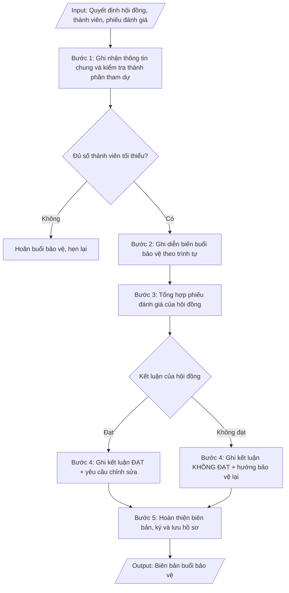

# Biên bản bảo vệ luận văn / luận án

## Định dạng và file đầu ra

Định dạng đầu ra có thể chọn theo sản phẩm/yêu cầu: .docx, .pdf. Đọc mục “Định dạng bổ sung” trong quy cách đầu ra trước khi chọn.

**Phải tạo file thực tế để tải xuống, không chỉ trả nội dung trong chat.** Định dạng mặc định của skill: **.docx**. Nếu có bảng số liệu nghiệp vụ yêu cầu file bảng tính riêng, tạo thêm Excel theo yêu cầu; không tự tạo file kiểm tra. Không chờ người dùng yêu cầu xuất file lần nữa. Ưu tiên định dạng người dùng chỉ định; đọc quy tắc xuất file tại references/quy-cach-dau-ra.md.

## Quy cách đầu ra và thông tin thiếu

Đọc [quy cách và cấu trúc sản phẩm](references/quy-cach-dau-ra.md) trước khi soạn/xuất. File giao chỉ gồm văn bản hoặc sản phẩm nghiệp vụ được yêu cầu; kiểm tra nội bộ không xuất kèm. Thiếu thông tin giữ nguyên trường/mục và chỗ điền theo mẫu gốc (dòng dấu chấm, dấu gạch hoặc ô trống); không tự điền dữ liệu mẫu, số 0, mã chờ xác minh hoặc dòng chờ ký. Mẫu chuyên ngành còn áp dụng được ưu tiên về cấu trúc, mã biểu và người ký. Các trường “bắt buộc” là điều kiện hoàn thiện hồ sơ, không ngăn việc soạn bản có chỗ chừa để điền. Mọi chỉ dẫn “để trống” trong skill được hiểu là không điền dữ liệu và giữ cách chừa chỗ của mẫu gốc, không phải xóa dấu chấm của mẫu.

## Kiểm soát áp dụng và phê duyệt

Trước khi chạy quy trình, xác định `ngay_ap_dung`, `loai_hinh_truong`, `quy_che_noi_bo`, `nguon_du_lieu` và `nguoi_kiem_duyet`. Chỉ yêu cầu thông tin có liên quan đến nghiệp vụ; không dùng giá trị giả định thay dữ liệu bắt buộc. Đối chiếu nội bộ hồ sơ có yếu tố pháp lý với văn bản gốc, hiệu lực, điều khoản áp dụng và chuyển tiếp; không tự đính kèm bảng kiểm tra vào file giao.

## Giới hạn và human gate

AI hỗ trợ chuẩn bị và đối chiếu. Cán bộ phụ trách kiểm tra dữ liệu/căn cứ, người có thẩm quyền duyệt và ký. Văn bản soạn chưa được coi là đã ban hành; không tự chèn nhãn trạng thái kiểm duyệt vào file giao; không đánh dấu đã ký, đã duyệt hoặc đã công bố nếu chưa có chứng cứ. Dữ liệu sinh viên, sức khỏe, nhân sự và tài chính phải hạn chế theo mục đích, phân quyền và che thông tin định danh khi dùng ví dụ. Không tải dữ liệu lên dịch vụ ngoài khi chưa có quyền. Kiểm tra Luật 91/2025/QH15 về bảo vệ dữ liệu cá nhân (hiệu lực 01/01/2026) và quy định áp dụng trước xử lý/chia sẻ dữ liệu cá nhân.

## Khi nào dùng
Ngay sau khi kết thúc buổi bảo vệ luận văn thạc sĩ / luận án tiến sĩ: thư ký hội đồng tổng hợp
ghi chép diễn biến, phiếu đánh giá của từng thành viên để lập biên bản làm căn cứ ra quyết định
công nhận tốt nghiệp và cấp văn bằng.

## Đầu vào (Input)

| Trường | Mô tả | Bắt buộc |
|---|---|---|
| `bac_dao_tao` | Thạc sĩ / Tiến sĩ | Có |
| `ho_ten_hv` | Họ tên học viên / NCS, mã HV, ngành | Có |
| `ten_de_tai` | Tên đề tài luận văn / luận án | Có |
| `quyet_dinh_hd` | Số quyết định thành lập hội đồng, ngày ký | Có |
| `thanh_phan_tham_du` | Danh sách thành viên hội đồng có mặt / vắng mặt (lý do) | Có |
| `dien_bien` | Tóm tắt phần trình bày của học viên; câu hỏi của từng thành viên và trả lời tóm tắt | Có |
| `phieu_danh_gia` | Điểm đánh giá của từng thành viên (thang 10), nhận xét tóm tắt | Có |
| `ket_luan` | Đạt / Không đạt; yêu cầu chỉnh sửa, bổ sung (nếu có); thời hạn nộp bản hoàn chỉnh | Có |
| `thoi_gian_dia_diem` | Ngày, giờ, địa điểm buổi bảo vệ | Có |

## Quy trình

**Bước 1. Ghi nhận thông tin chung và kiểm tra thành phần tham dự**
- Làm gì: ghi căn cứ quyết định thành lập hội đồng (số, ngày ký, người ký); thời gian, địa điểm
  buổi bảo vệ; thông tin HV/NCS (họ tên, mã, ngành, đề tài, người hướng dẫn); lập danh sách thành
  viên hội đồng có mặt / vắng mặt (ghi rõ lý do vắng). Kiểm tra điều kiện tiến hành: buổi bảo vệ
  chỉ được tiến hành khi có ít nhất 4/5 thành viên (thạc sĩ) hoặc 5/7 thành viên (tiến sĩ) có mặt,
  trong đó bắt buộc có Chủ tịch, Thư ký và ít nhất 01 phản biện — nếu không đủ thì hoãn và hẹn lại.
- Dùng input: `quyet_dinh_hd`, `thanh_phan_tham_du`, `ho_ten_hv`, `ten_de_tai`, `thoi_gian_dia_diem`,
  `bac_dao_tao`
- Vai trò: Thư ký hội đồng bảo vệ · AI hỗ trợ: chuẩn bị mẫu biên bản, danh sách thành phần đối chiếu trước buổi bảo vệ · ⏱ ~30 phút (ước tính)
- Lưu ý nghiệp vụ: ghi chính xác số quyết định thành lập hội đồng (sai số là lỗi pháp lý); vắng
  Chủ tịch hoặc Thư ký thì bắt buộc hoãn, không thay thế tùy tiện.
- → Kết quả bước: phần thông tin chung của biên bản + xác nhận đủ điều kiện tiến hành buổi bảo vệ
  (hoặc quyết định hoãn).

**Bước 2. Ghi diễn biến buổi bảo vệ theo trình tự**
- Làm gì: ghi tóm tắt diễn biến theo đúng trình tự: (1) Chủ tịch tuyên bố lý do, giới thiệu hội
  đồng, công bố quyết định thành lập; (2) HV/NCS trình bày tóm tắt luận văn/luận án (15–20 phút);
  (3) các phản biện đọc nhận xét; (4) thành viên hội đồng nêu câu hỏi, HV/NCS trả lời; (5) hội đồng
  họp kín thảo luận, bỏ phiếu đánh giá; (6) công bố kết quả. Ghi tóm tắt trung thực từng câu hỏi
  và ý trả lời chính, không ghi nguyên văn dài dòng.
- Dùng input: `dien_bien`, `thanh_phan_tham_du`
- Vai trò: Thư ký hội đồng bảo vệ · AI hỗ trợ: chuẩn bị đề cương diễn biến mẫu theo đúng trình tự · ⏱ trong buổi bảo vệ, ~2–3 giờ (ước tính)
- Lưu ý nghiệp vụ: ghi rõ ai hỏi – hỏi gì – trả lời thế nào (gắn tên thành viên với câu hỏi);
  không bỏ sót câu hỏi của phản biện vì đây là cơ sở của yêu cầu chỉnh sửa ở bước 4.
- → Kết quả bước: phần diễn biến buổi bảo vệ (theo trình tự, gắn câu hỏi với từng thành viên).

**Bước 3. Tổng hợp phiếu đánh giá của hội đồng**
- Làm gì: lập bảng điểm đánh giá của từng thành viên (thang điểm 10) kèm nhận xét tóm tắt; tính
  điểm trung bình; đếm số phiếu "đạt"/"không đạt". Áp nguyên tắc đạt: thạc sĩ đạt khi điểm trung
  bình ≥ 5,5 và không có quá 01 phiếu dưới 5,0; luận án tiến sĩ đạt khi đa số phiếu tán thành và
  không có phiếu phản đối về tính trung thực khoa học.
- Dùng input: `phieu_danh_gia`, `bac_dao_tao`
- Vai trò: Thư ký hội đồng bảo vệ · AI hỗ trợ: tổng hợp bảng điểm tự động, tính điểm trung bình · ⏱ ~30 phút (ước tính)
- Lưu ý nghiệp vụ: kiểm tra từng phiếu có chữ ký của thành viên — phiếu không ký không có giá trị;
  tính lại điểm trung bình độc lập, không copy số liệu từ ghi chép tay.
- → Kết quả bước: bảng tổng hợp điểm đánh giá từng thành viên + điểm trung bình + số phiếu
  đạt/không đạt.

**Bước 4. Ghi kết luận của hội đồng**
- Làm gì: ghi kết luận theo 2 trường hợp: (a) ĐẠT — ghi rõ đạt không cần chỉnh sửa, hay đạt nhưng
  cần chỉnh sửa/bổ sung (liệt kê từng yêu cầu chỉnh sửa chi tiết kèm thời hạn nộp bản hoàn chỉnh);
  (b) KHÔNG ĐẠT — nêu lý do và hướng xử lý (bảo vệ lại, thời gian bảo vệ lại).
- Dùng input: `ket_luan`, `phieu_danh_gia`
- Vai trò: Hội đồng bảo vệ luận văn · AI hỗ trợ: chuẩn bị mẫu kết luận theo 2 trường hợp đạt/không đạt · ⏱ ~30 phút (ước tính)
- Lưu ý nghiệp vụ: yêu cầu chỉnh sửa phải cụ thể, kiểm chứng được (tránh ghi chung chung kiểu
  "hoàn thiện thêm"); thời hạn nộp bản hoàn chỉnh phải khả thi và được hội đồng thống nhất.
- → Kết quả bước: phần kết luận của hội đồng (đạt/không đạt + danh mục yêu cầu chỉnh sửa kèm
  thời hạn).

**Bước 5. Hoàn thiện biên bản, ký và lưu hồ sơ**
- Làm gì: hoàn thiện biên bản đầy đủ các phần; thư ký ký, chủ tịch hội đồng ký xác nhận; đính kèm
  phiếu đánh giá của từng thành viên (tài liệu bắt buộc); ghi rõ số bản và nơi lưu (hồ sơ HV/NCS,
  Phòng Đào tạo SĐH, người hướng dẫn); chuyển Phòng Đào tạo SĐH làm thủ tục công nhận tốt nghiệp.
- Dùng input: `ket_luan`, `thoi_gian_dia_diem`
- Vai trò: Thư ký và Chủ tịch hội đồng ký biên bản · AI hỗ trợ: kiểm tra đầy đủ chữ ký và phụ lục đính kèm trước khi lưu · ⏱ ~1 giờ (ước tính)
- Lưu ý nghiệp vụ: biên bản thiếu chữ ký Chủ tịch hoặc thiếu phiếu đánh giá đính kèm thì không đủ
  căn cứ ra quyết định công nhận tốt nghiệp; lưu bản chính, không chỉ lưu bản photo.
- → Kết quả bước: biên bản buổi bảo vệ hoàn chỉnh (có chữ ký, có phiếu đánh giá đính kèm), đã
  phân phối và lưu hồ sơ.

## Luồng quy trình (Workflow)

## Đầu ra

File nghiệp vụ thực tế theo định dạng mặc định ở đầu skill hoặc định dạng người dùng yêu cầu, kèm liên kết tải trong phản hồi cuối.

Sản phẩm nghiệp vụ hoàn chỉnh theo [quy cách và cấu trúc](references/quy-cach-dau-ra.md), giữ các trường chưa có dữ liệu ở trạng thái trống. Không xuất kèm checklist/phụ lục kiểm tra đầu ra.

## Kiểm tra nội bộ trước khi giao
- [ ] Bố cục khớp mẫu áp dụng và cấu trúc tại references/quy-cach-dau-ra.md.
- [ ] Số liệu/nội dung trong output khớp với Input đã cho (bậc đào tạo, thông tin HV/NCS, đề tài, quyết định hội đồng, thành viên, diễn biến, phiếu điểm, kết luận, thời gian – địa điểm).
- [ ] Không bịa đặt số liệu, minh chứng, trích dẫn.
- [ ] Đúng thể thức văn bản hành chính của biên bản.
- [ ] Căn cứ pháp lý đầy đủ, còn hiệu lực (Thông tư 23/2021/TT-BGDĐT đối với thạc sĩ; Thông tư 18/2021/TT-BGDĐT đối với tiến sĩ).
- [ ] Đã qua Human gate: thư ký và Chủ tịch hội đồng đã ký biên bản; phiếu đánh giá của từng thành viên có chữ ký và đã đính kèm đầy đủ.
- [ ] Buổi bảo vệ chỉ được tiến hành khi đủ số thành viên tối thiểu (thạc sĩ 4/5, tiến sĩ 5/7) trong đó bắt buộc có Chủ tịch, Thư ký và ít nhất 01 phản biện; số quyết định thành lập hội đồng ghi chính xác.
- [ ] Diễn biến ghi rõ ai hỏi – hỏi gì – trả lời thế nào, gắn tên thành viên với từng câu hỏi; không bỏ sót câu hỏi của phản biện.
- [ ] Điểm trung bình được tính lại độc lập; nguyên tắc đạt áp đúng quy chế (thạc sĩ: ĐTB ≥ 5,5 và không quá 01 phiếu dưới 5,0; tiến sĩ: đa số phiếu tán thành, không phiếu phản đối về tính trung thực khoa học).
- [ ] Yêu cầu chỉnh sửa cụ thể, kiểm chứng được, có thời hạn khả thi được hội đồng thống nhất; ghi rõ số bản biên bản và nơi lưu.
Tiêu chí đạt = tất cả các ô được đánh dấu.

## Căn cứ & lưu ý
- Thông tư 23/2021/TT-BGDĐT (Quy chế đào tạo trình độ thạc sĩ); Thông tư 18/2021/TT-BGDĐT
  (Quy chế tuyển sinh và đào tạo trình độ tiến sĩ).
- Buổi bảo vệ chỉ tiến hành khi đủ số thành viên tối thiểu có mặt (thạc sĩ: 4/5 gồm
  Chủ tịch, Thư ký và ít nhất 01 phản biện; tiến sĩ: 5/7).
- Phiếu đánh giá của từng thành viên là tài liệu đính kèm bắt buộc của biên bản.
- Không dùng tên thật của trường/cá nhân khi mô phỏng.

## Quản trị phiên bản

- Phiên bản gói: `1.3.1`; ngày cập nhật: `2026-10-10`.
- Kho nguồn: https://github.com/phamtruong91/university-skills-framework
- Người duy trì trên GitHub: `phamtruong91` (Phạm Văn Trường). Người phê duyệt nghiệp vụ: **chưa chỉ định**.
- Commit nguồn trước cập nhật: `346719e6b0318ed034b4b016703f79733aa575e7`. Commit chứa phiên bản này xem bằng `git log -1 -- skills/bien-ban-bao-ve-luan-van`; không tự gán SHA chưa tạo.
- Giấy phép: theo LICENSE của kho; bản quyền CES Global.
- Lịch sử 1.1.0: bổ sung metadata giao diện, kiểm soát áp dụng, quản trị phiên bản.
- Trạng thái: dự thảo nghiệp vụ; kiểm tra pháp lý trước thực thi. Ngày cập nhật không đồng nghĩa mọi văn bản đã được rà soát toàn văn.
