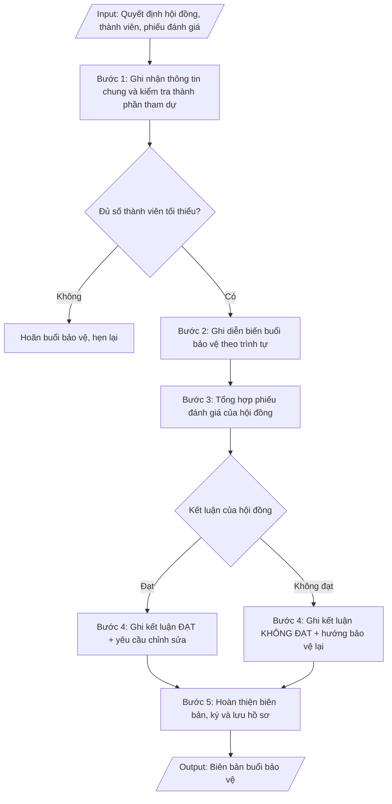

# Skill: Biên bản bảo vệ luận văn / luận án

## Khi nào dùng
Ngay sau khi kết thúc buổi bảo vệ luận văn thạc sĩ / luận án tiến sĩ: thư ký hội đồng tổng hợp
ghi chép diễn biến, phiếu đánh giá của từng thành viên để lập biên bản làm căn cứ ra quyết định
công nhận tốt nghiệp và cấp văn bằng.

## Đầu vào (Input)

| Trường | Mô tả | Bắt buộc |
|---|---|---|
| `bac_dao_tao` | Thạc sĩ / Tiến sĩ | Có |
| `ho_ten_hv` | Họ tên học viên / NCS, mã HV, ngành | Có |
| `ten_de_tai` | Tên đề tài luận văn / luận án | Có |
| `quyet_dinh_hd` | Số quyết định thành lập hội đồng, ngày ký | Có |
| `thanh_phan_tham_du` | Danh sách thành viên hội đồng có mặt / vắng mặt (lý do) | Có |
| `dien_bien` | Tóm tắt phần trình bày của học viên; câu hỏi của từng thành viên và trả lời tóm tắt | Có |
| `phieu_danh_gia` | Điểm đánh giá của từng thành viên (thang 10), nhận xét tóm tắt | Có |
| `ket_luan` | Đạt / Không đạt; yêu cầu chỉnh sửa, bổ sung (nếu có); thời hạn nộp bản hoàn chỉnh | Có |
| `thoi_gian_dia_diem` | Ngày, giờ, địa điểm buổi bảo vệ | Có |

## Quy trình

**Bước 1. Ghi nhận thông tin chung và kiểm tra thành phần tham dự**
- Làm gì: ghi căn cứ quyết định thành lập hội đồng (số, ngày ký, người ký); thời gian, địa điểm
  buổi bảo vệ; thông tin HV/NCS (họ tên, mã, ngành, đề tài, người hướng dẫn); lập danh sách thành
  viên hội đồng có mặt / vắng mặt (ghi rõ lý do vắng). Kiểm tra điều kiện tiến hành: buổi bảo vệ
  chỉ được tiến hành khi có ít nhất 4/5 thành viên (thạc sĩ) hoặc 5/7 thành viên (tiến sĩ) có mặt,
  trong đó bắt buộc có Chủ tịch, Thư ký và ít nhất 01 phản biện — nếu không đủ thì hoãn và hẹn lại.
- Dùng input: `quyet_dinh_hd`, `thanh_phan_tham_du`, `ho_ten_hv`, `ten_de_tai`, `thoi_gian_dia_diem`,
  `bac_dao_tao`
- Vai trò: Thư ký hội đồng bảo vệ · AI hỗ trợ: chuẩn bị mẫu biên bản, danh sách thành phần đối chiếu trước buổi bảo vệ · ⏱ ~30 phút (ước tính)
- Lưu ý nghiệp vụ: ghi chính xác số quyết định thành lập hội đồng (sai số là lỗi pháp lý); vắng
  Chủ tịch hoặc Thư ký thì bắt buộc hoãn, không thay thế tùy tiện.
- → Kết quả bước: phần thông tin chung của biên bản + xác nhận đủ điều kiện tiến hành buổi bảo vệ
  (hoặc quyết định hoãn).

**Bước 2. Ghi diễn biến buổi bảo vệ theo trình tự**
- Làm gì: ghi tóm tắt diễn biến theo đúng trình tự: (1) Chủ tịch tuyên bố lý do, giới thiệu hội
  đồng, công bố quyết định thành lập; (2) HV/NCS trình bày tóm tắt luận văn/luận án (15–20 phút);
  (3) các phản biện đọc nhận xét; (4) thành viên hội đồng nêu câu hỏi, HV/NCS trả lời; (5) hội đồng
  họp kín thảo luận, bỏ phiếu đánh giá; (6) công bố kết quả. Ghi tóm tắt trung thực từng câu hỏi
  và ý trả lời chính, không ghi nguyên văn dài dòng.
- Dùng input: `dien_bien`, `thanh_phan_tham_du`
- Vai trò: Thư ký hội đồng bảo vệ · AI hỗ trợ: chuẩn bị đề cương diễn biến mẫu theo đúng trình tự · ⏱ trong buổi bảo vệ, ~2–3 giờ (ước tính)
- Lưu ý nghiệp vụ: ghi rõ ai hỏi – hỏi gì – trả lời thế nào (gắn tên thành viên với câu hỏi);
  không bỏ sót câu hỏi của phản biện vì đây là cơ sở của yêu cầu chỉnh sửa ở bước 4.
- → Kết quả bước: phần diễn biến buổi bảo vệ (theo trình tự, gắn câu hỏi với từng thành viên).

**Bước 3. Tổng hợp phiếu đánh giá của hội đồng**
- Làm gì: lập bảng điểm đánh giá của từng thành viên (thang điểm 10) kèm nhận xét tóm tắt; tính
  điểm trung bình; đếm số phiếu "đạt"/"không đạt". Áp nguyên tắc đạt: thạc sĩ đạt khi điểm trung
  bình ≥ 5,5 và không có quá 01 phiếu dưới 5,0; luận án tiến sĩ đạt khi đa số phiếu tán thành và
  không có phiếu phản đối về tính trung thực khoa học.
- Dùng input: `phieu_danh_gia`, `bac_dao_tao`
- Vai trò: Thư ký hội đồng bảo vệ · AI hỗ trợ: tổng hợp bảng điểm tự động, tính điểm trung bình · ⏱ ~30 phút (ước tính)
- Lưu ý nghiệp vụ: kiểm tra từng phiếu có chữ ký của thành viên — phiếu không ký không có giá trị;
  tính lại điểm trung bình độc lập, không copy số liệu từ ghi chép tay.
- → Kết quả bước: bảng tổng hợp điểm đánh giá từng thành viên + điểm trung bình + số phiếu
  đạt/không đạt.

**Bước 4. Ghi kết luận của hội đồng**
- Làm gì: ghi kết luận theo 2 trường hợp: (a) ĐẠT — ghi rõ đạt không cần chỉnh sửa, hay đạt nhưng
  cần chỉnh sửa/bổ sung (liệt kê từng yêu cầu chỉnh sửa chi tiết kèm thời hạn nộp bản hoàn chỉnh);
  (b) KHÔNG ĐẠT — nêu lý do và hướng xử lý (bảo vệ lại, thời gian bảo vệ lại).
- Dùng input: `ket_luan`, `phieu_danh_gia`
- Vai trò: Hội đồng bảo vệ luận văn · AI hỗ trợ: chuẩn bị mẫu kết luận theo 2 trường hợp đạt/không đạt · ⏱ ~30 phút (ước tính)
- Lưu ý nghiệp vụ: yêu cầu chỉnh sửa phải cụ thể, kiểm chứng được (tránh ghi chung chung kiểu
  "hoàn thiện thêm"); thời hạn nộp bản hoàn chỉnh phải khả thi và được hội đồng thống nhất.
- → Kết quả bước: phần kết luận của hội đồng (đạt/không đạt + danh mục yêu cầu chỉnh sửa kèm
  thời hạn).

**Bước 5. Hoàn thiện biên bản, ký và lưu hồ sơ**
- Làm gì: hoàn thiện biên bản đầy đủ các phần; thư ký ký, chủ tịch hội đồng ký xác nhận; đính kèm
  phiếu đánh giá của từng thành viên (tài liệu bắt buộc); ghi rõ số bản và nơi lưu (hồ sơ HV/NCS,
  Phòng Đào tạo SĐH, người hướng dẫn); chuyển Phòng Đào tạo SĐH làm thủ tục công nhận tốt nghiệp.
- Dùng input: `ket_luan`, `thoi_gian_dia_diem`
- Vai trò: Thư ký và Chủ tịch hội đồng ký biên bản · AI hỗ trợ: kiểm tra đầy đủ chữ ký và phụ lục đính kèm trước khi lưu · ⏱ ~1 giờ (ước tính)
- Lưu ý nghiệp vụ: biên bản thiếu chữ ký Chủ tịch hoặc thiếu phiếu đánh giá đính kèm thì không đủ
  căn cứ ra quyết định công nhận tốt nghiệp; lưu bản chính, không chỉ lưu bản photo.
- → Kết quả bước: biên bản buổi bảo vệ hoàn chỉnh (có chữ ký, có phiếu đánh giá đính kèm), đã
  phân phối và lưu hồ sơ.

## Luồng quy trình (Workflow)


## Đầu ra (Output)
- Biên bản buổi bảo vệ hoàn chỉnh (có chữ ký Chủ tịch, Thư ký).
- Bảng tổng hợp điểm đánh giá từng thành viên hội đồng.
- Danh mục yêu cầu chỉnh sửa (nếu có) kèm thời hạn.

**Cấu trúc output chuẩn:** khung mẫu cố định của biên bản buổi bảo vệ luận văn/luận án, các phần theo đúng thứ tự:
1. Phần đầu: tên trường + đơn vị (Phòng Đào tạo Sau đại học); quốc hiệu – tiêu ngữ.
2. Tên biên bản + đối tượng: "BIÊN BẢN" + "Buổi bảo vệ luận văn thạc sĩ / luận án tiến sĩ
   của học viên/NCS…" (họ tên).
3. Phần căn cứ: quyết định thành lập hội đồng (số, ngày ký, người ký).
4. Thông tin chung: thời gian (giờ, ngày), địa điểm buổi bảo vệ; thông tin HV/NCS (họ tên, mã,
   ngành, đề tài trong ngoặc kép, người hướng dẫn).
5. Nội dung chính theo thứ tự: I. Thành phần tham dự (đánh số, ghi rõ có mặt/vắng mặt và lý do);
   II. Diễn biến buổi bảo vệ (theo trình tự, gắn câu hỏi với từng thành viên); III. Kết quả đánh
   giá (bảng điểm từng thành viên — vai trò, điểm thang 10, phiếu đạt/không đạt — + điểm trung
   bình); IV. Kết luận của hội đồng (ĐẠT/KHÔNG ĐẠT + xếp loại nếu có + danh mục yêu cầu chỉnh
   sửa chi tiết kèm thời hạn nộp bản hoàn chỉnh).
6. Phần phân phối: số bản biên bản và nơi lưu (hồ sơ HV/NCS, Phòng Đào tạo SĐH, người hướng dẫn).
7. Phần ký: Thư ký hội đồng và Chủ tịch hội đồng (chữ ký, họ tên).
8. Tài liệu đính kèm bắt buộc: phiếu đánh giá của từng thành viên.


## Checklist nghiệm thu
- [ ] Đủ các phần theo "Cấu trúc output chuẩn": phần đầu; tên biên bản + đối tượng; phần căn cứ (quyết định thành lập hội đồng); thông tin chung; nội dung I–IV (thành phần tham dự; diễn biến; kết quả đánh giá; kết luận); phần phân phối; phần ký; phiếu đánh giá đính kèm.
- [ ] Số liệu/nội dung trong output khớp với Input đã cho (bậc đào tạo, thông tin HV/NCS, đề tài, quyết định hội đồng, thành viên, diễn biến, phiếu điểm, kết luận, thời gian – địa điểm).
- [ ] Không bịa đặt số liệu, minh chứng, trích dẫn.
- [ ] Đúng thể thức văn bản hành chính của biên bản.
- [ ] Căn cứ pháp lý đầy đủ, còn hiệu lực (Thông tư 23/2021/TT-BGDĐT đối với thạc sĩ; Thông tư 18/2021/TT-BGDĐT đối với tiến sĩ).
- [ ] Đã qua Human gate: thư ký và Chủ tịch hội đồng đã ký biên bản; phiếu đánh giá của từng thành viên có chữ ký và đã đính kèm đầy đủ.
- [ ] Buổi bảo vệ chỉ được tiến hành khi đủ số thành viên tối thiểu (thạc sĩ 4/5, tiến sĩ 5/7) trong đó bắt buộc có Chủ tịch, Thư ký và ít nhất 01 phản biện; số quyết định thành lập hội đồng ghi chính xác.
- [ ] Diễn biến ghi rõ ai hỏi – hỏi gì – trả lời thế nào, gắn tên thành viên với từng câu hỏi; không bỏ sót câu hỏi của phản biện.
- [ ] Điểm trung bình được tính lại độc lập; nguyên tắc đạt áp đúng quy chế (thạc sĩ: ĐTB ≥ 5,5 và không quá 01 phiếu dưới 5,0; tiến sĩ: đa số phiếu tán thành, không phiếu phản đối về tính trung thực khoa học).
- [ ] Yêu cầu chỉnh sửa cụ thể, kiểm chứng được, có thời hạn khả thi được hội đồng thống nhất; ghi rõ số bản biên bản và nơi lưu.
Tiêu chí đạt = tất cả các ô được đánh dấu.

## Ví dụ mô phỏng (dữ liệu giả lập)

> Tất cả tên trường, cá nhân, số liệu dưới đây đều là **giả lập**, không liên quan tổ chức/cá nhân có thật.

### Input mẫu

| Trường | Giá trị |
|---|---|
| `bac_dao_tao` | Thạc sĩ |
| `ho_ten_hv` | Hoàng Thị Yến — CH2024-018 — ngành Quản trị kinh doanh |
| `ten_de_tai` | Các nhân tố ảnh hưởng đến ý định mua sắm trực tuyến của người tiêu dùng trẻ tại thành phố C |
| `quyet_dinh_hd` | Số 486/QĐ-ĐHA-SĐH ngày 09/10/2026 của Hiệu trưởng Trường ĐH A |
| `thanh_phan_tham_du` | Có mặt 5/5: GS.TS. Lê Văn D (Chủ tịch), PGS.TS. Trần Văn B (PB1), TS. Trần Văn D (PB2), TS. Phạm Thị C (Ủy viên), ThS. Đỗ Thị A (Thư ký) |
| `dien_bien` | HV trình bày 18 phút. PB1 hỏi về tính đại diện của mẫu khảo sát (n=412, chỉ thành phố C) — HV trả lời đã nêu rõ phạm vi và hạn chế trong mục 5.3. PB2 hỏi vì sao loại biến "niềm tin" khỏi mô hình — HV giải thích biến bị loại do hệ số tải < 0,5 ở phân tích EFA. Ủy viên hỏi về đóng góp thực tiễn — HV nêu 3 khuyến nghị cho doanh nghiệp TMĐT. |
| `phieu_danh_gia` | Lê Văn D: 8,5; Trần Văn B: 8,0; Trần Văn D: 8,0; Phạm Thị C: 8,5; Đỗ Thị A: 9,0. Điểm TB: 8,4. 5/5 phiếu "đạt". |
| `ket_luan` | Đạt. Yêu cầu chỉnh sửa: bổ sung phần hạn chế nghiên cứu về phạm vi mẫu; chuẩn hóa danh mục tài liệu tham khảo theo APA 7. Thời hạn nộp bản hoàn chỉnh: 10/11/2026. |
| `thoi_gian_dia_diem` | 09h00–11h30, ngày 25/10/2026, Phòng họp A2.03, Trường ĐH A |

### Output mẫu

```
TRƯỜNG ĐẠI HỌC A             CỘNG HÒA XÃ HỘI CHỦ NGHĨA VIỆT NAM
PHÒNG ĐÀO TẠO SAU ĐẠI HỌC                 Độc lập – Tự do – Hạnh phúc

                                  BIÊN BẢN
           Buổi bảo vệ luận văn thạc sĩ của học viên Hoàng Thị Yến

Căn cứ Quyết định số 486/QĐ-ĐHA-SĐH ngày 09/10/2026 của Hiệu trưởng
Trường Đại học A về việc thành lập Hội đồng đánh giá luận văn thạc sĩ.

Hôm nay, hồi 09h00 ngày 25 tháng 10 năm 2026, tại Phòng họp A2.03,
Trường Đại học A, Hội đồng đánh giá luận văn thạc sĩ đã họp
để đánh giá luận văn của học viên:

- Họ và tên: Hoàng Thị Yến — Mã học viên: CH2024-018
- Ngành: Quản trị kinh doanh
- Đề tài: "Các nhân tố ảnh hưởng đến ý định mua sắm trực tuyến của
  người tiêu dùng trẻ tại thành phố C"
- Người hướng dẫn: PGS.TS. Ngô Thị A

I. THÀNH PHẦN THAM DỰ (có mặt 5/5 thành viên)
1. GS.TS. Lê Văn D — Chủ tịch Hội đồng
2. PGS.TS. Trần Văn B — Phản biện 1
3. TS. Trần Văn D — Phản biện 2
4. TS. Phạm Thị C — Ủy viên
5. ThS. Đỗ Thị A — Ủy viên, Thư ký Hội đồng

II. DIỄN BIẾN BUỔI BẢO VỆ
1. Chủ tịch Hội đồng tuyên bố lý do, giới thiệu thành phần Hội đồng và
công bố Quyết định thành lập Hội đồng.
2. Học viên trình bày tóm tắt luận văn trong 18 phút: mục tiêu, phương pháp
(khảo sát 412 người tiêu dùng trẻ tại thành phố C, phân tích EFA và hồi quy),
kết quả chính và 3 khuyến nghị cho doanh nghiệp thương mại điện tử.
3. Phản biện 1 (PGS.TS. Trần Văn B) đọc nhận xét; nêu câu hỏi về tính
đại diện của mẫu khảo sát (chỉ trong phạm vi thành phố C). Học viên trả lời:
đã xác định rõ phạm vi và hạn chế nghiên cứu tại mục 5.3 của luận văn.
4. Phản biện 2 (TS. Trần Văn D) đọc nhận xét; hỏi lý do loại biến "niềm tin"
khỏi mô hình. Học viên trả lời: biến bị loại do hệ số tải nhân tố < 0,5
ở bước phân tích EFA, đã trình bày tại mục 4.2.
5. Ủy viên (TS. Phạm Thị C) hỏi về đóng góp thực tiễn của đề tài.
Học viên trình bày 3 khuyến nghị cụ thể cho doanh nghiệp TMĐT.
6. Hội đồng họp kín, thảo luận và bỏ phiếu đánh giá.

III. KẾT QUẢ ĐÁNH GIÁ
| Thành viên             | Vai trò      | Điểm (thang 10) | Phiếu |
|------------------------|--------------|-----------------|-------|
| GS.TS. Lê Văn D    | Chủ tịch      | 8,5             | Đạt   |
| PGS.TS. Trần Văn B  | Phản biện 1  | 8,0             | Đạt   |
| TS. Trần Văn D       | Phản biện 2  | 8,0             | Đạt   |
| TS. Phạm Thị C       | Ủy viên      | 8,5             | Đạt   |
| ThS. Đỗ Thị A    | Thư ký       | 9,0             | Đạt   |
| ĐIỂM TRUNG BÌNH        |              | **8,4**         | **5/5 phiếu Đạt** |

IV. KẾT LUẬN CỦA HỘI ĐỒNG
Hội đồng nhất trí đánh giá luận văn của học viên Hoàng Thị Yến: **ĐẠT**,
xếp loại Khá (điểm trung bình 8,4).
Yêu cầu học viên chỉnh sửa, bổ sung trước khi nộp bản luận văn hoàn chỉnh:
1. Bổ sung, làm rõ phần hạn chế của nghiên cứu về phạm vi mẫu khảo sát;
2. Chuẩn hóa toàn bộ danh mục tài liệu tham khảo theo chuẩn APA 7.
Thời hạn nộp bản hoàn chỉnh về Phòng Đào tạo Sau đại học: ngày 10/11/2026.

Biên bản được lập thành 03 bản có giá trị như nhau: 01 bản lưu hồ sơ
học viên, 01 bản lưu Phòng Đào tạo Sau đại học, 01 bản gửi người hướng dẫn.

        THƯ KÝ HỘI ĐỒNG                        CHỦ TỊCH HỘI ĐỒNG
            (đã ký)                                  (đã ký)

       ThS. Đỗ Thị A                      GS.TS. Lê Văn D
```

## Căn cứ & lưu ý
- Thông tư 23/2021/TT-BGDĐT (Quy chế đào tạo trình độ thạc sĩ); Thông tư 18/2021/TT-BGDĐT
  (Quy chế tuyển sinh và đào tạo trình độ tiến sĩ).
- Buổi bảo vệ chỉ tiến hành khi đủ số thành viên tối thiểu có mặt (thạc sĩ: 4/5 gồm
  Chủ tịch, Thư ký và ít nhất 01 phản biện; tiến sĩ: 5/7).
- Phiếu đánh giá của từng thành viên là tài liệu đính kèm bắt buộc của biên bản.
- Không dùng tên thật của trường/cá nhân khi mô phỏng.
