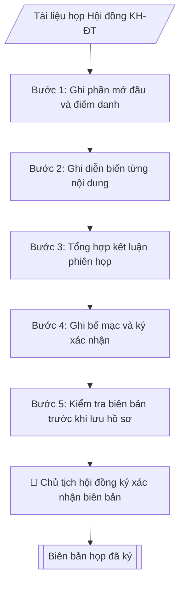

# Biên bản họp Hội đồng KH&ĐT

## Định dạng và file đầu ra

Định dạng đầu ra có thể chọn theo sản phẩm/yêu cầu: .docx, .pdf. Đọc mục “Định dạng bổ sung” trong quy cách đầu ra trước khi chọn.

**Phải tạo file thực tế để tải xuống, không chỉ trả nội dung trong chat.** Định dạng mặc định của skill: **.docx**. Nếu có bảng số liệu nghiệp vụ yêu cầu file bảng tính riêng, tạo thêm Excel theo yêu cầu; không tự tạo file kiểm tra. Không chờ người dùng yêu cầu xuất file lần nữa. Ưu tiên định dạng người dùng chỉ định; đọc quy tắc xuất file tại references/quy-cach-dau-ra.md.

## Quy cách đầu ra và thông tin thiếu
Khi dựng file Word/Excel, áp dụng mục “Thể thức và bảng biểu khi dựng file” trong quy cách đầu ra (cỡ chữ từng thành phần, bảng nhiều trang, số trang, phụ lục). Đọc [quy cách và cấu trúc sản phẩm](references/quy-cach-dau-ra.md) trước khi soạn/xuất. File giao chỉ gồm sản phẩm nghiệp vụ được yêu cầu; kiểm tra nội bộ không xuất kèm. Thiếu thông tin thì giữ nguyên trường/mục và chỗ điền theo mẫu gốc (dòng dấu chấm, dấu gạch hoặc ô trống); không tự điền dữ liệu mẫu, số 0, mã chờ xác minh hay dòng chờ ký. Mẫu chuyên ngành còn áp dụng được ưu tiên về cấu trúc, mã biểu và người ký. Bản đầy đủ: [quy tắc chung](references/quy-tac-chung.md).

Khi người dùng yêu cầu bộ slide (.pptx), đọc mục “Xuất PowerPoint (.pptx) khi được yêu cầu” trong quy cách đầu ra.

## Kiểm soát áp dụng và phê duyệt
Trước khi chạy, xác định `ngay_ap_dung`, `loai_hinh_truong`, `quy_che_noi_bo`, `nguon_du_lieu`, `nguoi_kiem_duyet`; chỉ hỏi thông tin liên quan nghiệp vụ, không dùng giá trị giả định thay dữ liệu bắt buộc. Đối chiếu căn cứ pháp lý với văn bản gốc, hiệu lực, điều khoản áp dụng và chuyển tiếp. Bản đầy đủ: [quy tắc chung](references/quy-tac-chung.md).

## Giới hạn và human gate
AI hỗ trợ chuẩn bị và đối chiếu; cán bộ phụ trách kiểm tra dữ liệu/căn cứ, người có thẩm quyền duyệt và ký. Không đánh dấu đã ký, đã duyệt, đã công bố khi chưa có chứng cứ. Dữ liệu sinh viên, sức khỏe, nhân sự, tài chính chỉ dùng theo mục đích và phân quyền, che thông tin định danh khi dùng ví dụ (Luật 91/2025/QH15, hiệu lực 01/01/2026); không tải dữ liệu lên dịch vụ ngoài khi chưa có quyền. Bản đầy đủ: [quy tắc chung](references/quy-tac-chung.md).

## Khi nào dùng
Sau mỗi phiên họp Hội đồng Khoa học và Đào tạo (định kỳ hoặc đột xuất) cần lập biên bản ghi
nhận đầy đủ diễn biến, ý kiến thành viên và kết quả biểu quyết từng nội dung làm căn cứ ban hành
nghị quyết.

## Đầu vào (Input)

| Trường | Mô tả | Bắt buộc |
|---|---|---|
| `phien_hop` | Phiên họp thứ mấy, năm học | Có |
| `thoi_gian` | Ngày, giờ bắt đầu – kết thúc | Có |
| `dia_diem` | Địa điểm họp | Có |
| `chu_tich` | Chủ tịch hội đồng (chủ trì) | Có |
| `thu_ky` | Thư ký hội đồng | Có |
| `thanh_vien` | Danh sách thành viên: dự họp / vắng mặt (lý do) | Có |
| `noi_dung` | Từng nội dung: tờ trình/báo cáo trình bày, ý kiến thảo luận chính | Có |
| `bieu_quyet` | Kết quả biểu quyết từng nội dung: tán thành / không tán thành / không ý kiến | Có |

## Quy trình

**Bước 1. Ghi phần mở đầu và điểm danh**
- Làm gì: ghi phiên họp (`phien_hop`), `thoi_gian`, `dia_diem`, chủ trì (`chu_tich`), thư ký (`thu_ky`); điểm danh `thanh_vien` (dự họp/vắng mặt + lý do); xác nhận đủ túc số theo quy chế (thường > 1/2 thành viên dự họp).
- Dùng input: `phien_hop`, `thoi_gian`, `dia_diem`, `chu_tich`, `thu_ky`, `thanh_vien`.
- Vai trò: Thư ký hội đồng (soạn phần mở đầu, điểm danh, xác nhận túc số) · AI hỗ trợ: soạn thảo phần mở đầu, kiểm tra túc số từ danh sách thành viên · ⏱ ~10–15 phút (ước tính)
- Lưu ý nghiệp vụ: nếu không đủ túc số thì không họp tiếp — ghi rõ lý do dừng vào biên bản và kết thúc tại bước này.
- → Kết quả bước: phần mở đầu biên bản (phiên họp, chủ trì, điểm danh, xác nhận túc số).

**Bước 2. Ghi diễn biến từng nội dung**
- Làm gì: với mỗi nội dung trong `noi_dung`, ghi người trình bày → tóm tắt ý kiến thảo luận chính (ghi tên thành viên + ý chính) → kết quả biểu quyết trong `bieu_quyet` (số tán thành/không tán thành/không ý kiến).
- Dùng input: `noi_dung`, `bieu_quyet`.
- Vai trò: Thư ký hội đồng (ghi diễn biến, ý kiến và kết quả biểu quyết tại phiên họp) · AI hỗ trợ: chuẩn bị trước khung biên bản (chương trình, danh sách thành viên) phục vụ ghi chép · ⏱ theo thời lượng phiên họp (ước tính)
- Lưu ý nghiệp vụ: chỉ ghi ý kiến thực sự phát biểu tại phiên họp, không suy diễn, không thêm bớt; số liệu biểu quyết phải đếm thực tế tại chỗ.
- → Kết quả bước: phần nội dung biên bản (từng nội dung có trình bày – ý kiến – biểu quyết).

**Bước 3. Tổng hợp kết luận phiên họp**
- Làm gì: liệt kê các nội dung được thông qua / chưa thông qua / cần bổ sung; ghi rõ đầu mối đơn vị thực hiện và thời hạn nếu có.
- Dùng input: kết quả bước 2 (diễn biến và biểu quyết từng nội dung).
- Vai trò: Thư ký / Chủ tịch hội đồng (xác nhận kết luận phiên họp) · AI hỗ trợ: tổng hợp kết luận phiên họp sơ bộ từ diễn biến và biểu quyết · ⏱ ~15–20 phút (ước tính)
- Lưu ý nghiệp vụ: kết luận phải rõ ràng, không để nội dung lửng lơ (nội dung chưa thông qua phải ghi rõ lý do và hướng xử lý tiếp theo).
- → Kết quả bước: phần kết luận phiên họp.

**Bước 4. Ghi bế mạc và ký xác nhận**
- Làm gì: ghi thời gian bế mạc; trình Chủ tịch và thư ký ký xác nhận; các thành viên được quyền kiểm tra, đề nghị đính chính trước khi ký.
- Dùng input: `chu_tich`, `thu_ky`, kết quả bước 1–3.
- Vai trò: Chủ tịch hội đồng và Thư ký hội đồng (ký xác nhận sau khi mọi đính chính hoàn tất) · AI hỗ trợ: chuẩn bị tài liệu, tổng hợp trước các đính chính cần ký · ⏱ ~15–30 phút (ước tính)
- Lưu ý nghiệp vụ: mọi đính chính phải hoàn tất trước khi ký; biên bản đã ký là căn cứ ban hành nghị quyết.
- → Kết quả bước: biên bản họp có chữ ký chủ tịch và thư ký.

**Bước 5. Kiểm tra biên bản trước khi lưu hồ sơ**
- Làm gì: đối chiếu tổng số phiếu biểu quyết từng nội dung với số thành viên dự họp (bước 1); kiểm tra nội dung kết luận rõ ràng, có đầu mối thực hiện nếu cần; sửa lỗi chính tả, số liệu.
- Dùng input: kết quả bước 1–4.
- Vai trò: Thư ký hội đồng (đối chiếu, kiểm tra trước khi lưu hồ sơ) · AI hỗ trợ: đối chiếu tổng số phiếu với số thành viên dự họp, kiểm tra lỗi số liệu/chính tả · ⏱ ~10–15 phút (ước tính)
- Lưu ý nghiệp vụ: tổng số phiếu không được vượt số người dự họp; phát hiện sai lệch thì đối chiếu lại với ghi chép tại chỗ, tuyệt đối không tự điều chỉnh số liệu biểu quyết.
- → Kết quả bước: biên bản họp hoàn chỉnh, sẵn sàng ký và lưu hồ sơ.
## Luồng quy trình (Workflow)

## Đầu ra

File nghiệp vụ thực tế theo định dạng mặc định ở đầu skill hoặc định dạng người dùng yêu cầu, kèm liên kết tải trong phản hồi cuối.

Sản phẩm nghiệp vụ hoàn chỉnh theo [quy cách và cấu trúc](references/quy-cach-dau-ra.md), giữ các trường chưa có dữ liệu ở trạng thái trống. Không xuất kèm checklist/phụ lục kiểm tra đầu ra.

## Kiểm tra nội bộ trước khi giao

- [ ] Bố cục khớp mẫu áp dụng và cấu trúc tại references/quy-cach-dau-ra.md.
- [ ] Điểm danh đủ dự/vắng (kèm lý do vắng); xác nhận đủ túc số theo quy chế (thường > 1/2 thành viên dự họp) — không đủ túc số thì không họp tiếp.
- [ ] Chỉ ghi ý kiến thực sự phát biểu tại phiên họp — không suy diễn, không thêm bớt.
- [ ] Tổng số phiếu biểu quyết từng nội dung không vượt số thành viên dự họp; sai lệch phải đối chiếu lại ghi chép tại chỗ, tuyệt đối không tự điều chỉnh số liệu biểu quyết.
- [ ] Kết luận phiên họp rõ ràng: nội dung nào thông qua/chưa thông qua/cần bổ sung (+ lý do và hướng xử lý với nội dung chưa thông qua); có đầu mối đơn vị thực hiện và thời hạn nếu cần.
- [ ] Mọi đính chính hoàn tất trước khi ký; biên bản có chữ ký của thư ký và chủ tịch hội đồng.
- [ ] Đã qua Human gate: các thành viên được kiểm tra, đề nghị đính chính trước khi ký; Chủ tịch ký xác nhận biên bản.

> Tiêu chí đạt: tất cả các ô được đánh dấu.

## Human gate (người kiểm duyệt)
- **Thư ký hội đồng** chịu trách nhiệm ghi chép trung thực, đầy đủ.
- **Chủ tịch hội đồng** ký xác nhận biên bản; các thành viên được quyền kiểm tra, đề nghị
  đính chính trước khi ký.

## Giới hạn (guardrails)
- KHÔNG suy diễn, thêm bớt ý kiến của thành viên không phát biểu trong phiên họp.
- KHÔNG thay đổi kết quả biểu quyết đã được ghi nhận.
- Biên bản là tài liệu mật nội bộ — không phát tán khi chưa được phép.

## Căn cứ & lưu ý
- Quy chế tổ chức và hoạt động của Hội đồng Khoa học và Đào tạo của trường.
- Không dùng tên thật của trường/cá nhân khi mô phỏng.

## Quản trị phiên bản
- Phiên bản gói `1.3.2` (cập nhật 2026-10-10); hồ sơ đầy đủ tại [references/version.json](references/version.json).
- Người phê duyệt nghiệp vụ: **chưa chỉ định**. Trạng thái: dự thảo nghiệp vụ; kiểm tra pháp lý trước thực thi. Ngày cập nhật không đồng nghĩa mọi văn bản đã được rà soát toàn văn.
- Giấy phép theo LICENSE của kho (bản quyền CES Global). Lịch sử thay đổi: CHANGELOG.md.
