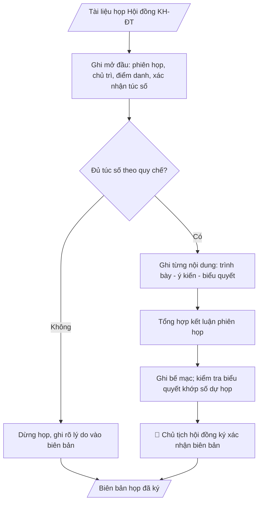

# Skill: Biên bản họp Hội đồng KH&ĐT

## Khi nào dùng
Sau mỗi phiên họp Hội đồng Khoa học và Đào tạo (định kỳ hoặc đột xuất) cần lập biên bản ghi
nhận đầy đủ diễn biến, ý kiến thành viên và kết quả biểu quyết từng nội dung làm căn cứ ban hành
nghị quyết.

## Đầu vào (Input)

| Trường | Mô tả | Bắt buộc |
|---|---|---|
| `phien_hop` | Phiên họp thứ mấy, năm học | Có |
| `thoi_gian` | Ngày, giờ bắt đầu – kết thúc | Có |
| `dia_diem` | Địa điểm họp | Có |
| `chu_tich` | Chủ tịch hội đồng (chủ trì) | Có |
| `thu_ky` | Thư ký hội đồng | Có |
| `thanh_vien` | Danh sách thành viên: dự họp / vắng mặt (lý do) | Có |
| `noi_dung` | Từng nội dung: tờ trình/báo cáo trình bày, ý kiến thảo luận chính | Có |
| `bieu_quyet` | Kết quả biểu quyết từng nội dung: tán thành / không tán thành / không ý kiến | Có |

## Quy trình

**Bước 1. Ghi phần mở đầu và điểm danh**
- Làm gì: ghi phiên họp (`phien_hop`), `thoi_gian`, `dia_diem`, chủ trì (`chu_tich`), thư ký (`thu_ky`); điểm danh `thanh_vien` (dự họp/vắng mặt + lý do); xác nhận đủ túc số theo quy chế (thường > 1/2 thành viên dự họp).
- Dùng input: `phien_hop`, `thoi_gian`, `dia_diem`, `chu_tich`, `thu_ky`, `thanh_vien`.
- Vai trò: Thư ký hội đồng (soạn phần mở đầu, điểm danh, xác nhận túc số) · AI hỗ trợ: soạn thảo phần mở đầu, kiểm tra túc số từ danh sách thành viên · ⏱ ~10–15 phút (ước tính)
- Lưu ý nghiệp vụ: nếu không đủ túc số thì không họp tiếp — ghi rõ lý do dừng vào biên bản và kết thúc tại bước này.
- → Kết quả bước: phần mở đầu biên bản (phiên họp, chủ trì, điểm danh, xác nhận túc số).

**Bước 2. Ghi diễn biến từng nội dung**
- Làm gì: với mỗi nội dung trong `noi_dung`, ghi người trình bày → tóm tắt ý kiến thảo luận chính (ghi tên thành viên + ý chính) → kết quả biểu quyết trong `bieu_quyet` (số tán thành/không tán thành/không ý kiến).
- Dùng input: `noi_dung`, `bieu_quyet`.
- Vai trò: Thư ký hội đồng (ghi diễn biến, ý kiến và kết quả biểu quyết tại phiên họp) · AI hỗ trợ: chuẩn bị trước khung biên bản (chương trình, danh sách thành viên) phục vụ ghi chép · ⏱ theo thời lượng phiên họp (ước tính)
- Lưu ý nghiệp vụ: chỉ ghi ý kiến thực sự phát biểu tại phiên họp, không suy diễn, không thêm bớt; số liệu biểu quyết phải đếm thực tế tại chỗ.
- → Kết quả bước: phần nội dung biên bản (từng nội dung có trình bày – ý kiến – biểu quyết).

**Bước 3. Tổng hợp kết luận phiên họp**
- Làm gì: liệt kê các nội dung được thông qua / chưa thông qua / cần bổ sung; ghi rõ đầu mối đơn vị thực hiện và thời hạn nếu có.
- Dùng input: kết quả bước 2 (diễn biến và biểu quyết từng nội dung).
- Vai trò: Thư ký / Chủ tịch hội đồng (xác nhận kết luận phiên họp) · AI hỗ trợ: tổng hợp kết luận phiên họp sơ bộ từ diễn biến và biểu quyết · ⏱ ~15–20 phút (ước tính)
- Lưu ý nghiệp vụ: kết luận phải rõ ràng, không để nội dung lửng lơ (nội dung chưa thông qua phải ghi rõ lý do và hướng xử lý tiếp theo).
- → Kết quả bước: phần kết luận phiên họp.

**Bước 4. Ghi bế mạc và ký xác nhận**
- Làm gì: ghi thời gian bế mạc; trình Chủ tịch và thư ký ký xác nhận; các thành viên được quyền kiểm tra, đề nghị đính chính trước khi ký.
- Dùng input: `chu_tich`, `thu_ky`, kết quả bước 1–3.
- Vai trò: Chủ tịch hội đồng và Thư ký hội đồng (ký xác nhận sau khi mọi đính chính hoàn tất) · AI hỗ trợ: chuẩn bị tài liệu, tổng hợp trước các đính chính cần ký · ⏱ ~15–30 phút (ước tính)
- Lưu ý nghiệp vụ: mọi đính chính phải hoàn tất trước khi ký; biên bản đã ký là căn cứ ban hành nghị quyết.
- → Kết quả bước: biên bản họp có chữ ký chủ tịch và thư ký.

**Bước 5. Kiểm tra biên bản trước khi lưu hồ sơ**
- Làm gì: đối chiếu tổng số phiếu biểu quyết từng nội dung với số thành viên dự họp (bước 1); kiểm tra nội dung kết luận rõ ràng, có đầu mối thực hiện nếu cần; sửa lỗi chính tả, số liệu.
- Dùng input: kết quả bước 1–4.
- Vai trò: Thư ký hội đồng (đối chiếu, kiểm tra trước khi lưu hồ sơ) · AI hỗ trợ: đối chiếu tổng số phiếu với số thành viên dự họp, kiểm tra lỗi số liệu/chính tả · ⏱ ~10–15 phút (ước tính)
- Lưu ý nghiệp vụ: tổng số phiếu không được vượt số người dự họp; phát hiện sai lệch thì đối chiếu lại với ghi chép tại chỗ, tuyệt đối không tự điều chỉnh số liệu biểu quyết.
- → Kết quả bước: biên bản họp hoàn chỉnh, sẵn sàng ký và lưu hồ sơ.
## Luồng quy trình (Workflow)


## Đầu ra (Output)
- Biên bản họp hội đồng hoàn chỉnh (markdown), sẵn sàng ký và lưu hồ sơ.

**Cấu trúc output chuẩn:** khung mẫu cố định của biên bản họp:
1. Quốc hiệu – tiêu ngữ + tên cơ quan (HỘI ĐỒNG KHOA HỌC VÀ ĐÀO TẠO) và tên trường.
2. Tiêu đề "BIÊN BẢN" + phiên họp, năm học.
3. Thời gian, địa điểm, chủ trì, thư ký.
4. Thành phần: số thành viên dự/vắng (lý do vắng), xác nhận đủ túc số.
5. Nội dung: từng nội dung gồm người trình bày → ý kiến thảo luận (tên thành viên + ý chính) → kết quả biểu quyết.
6. Kết luận phiên họp (nội dung thông qua/chưa thông qua/cần bổ sung).
7. Thời gian bế mạc.
8. Chữ ký thư ký và chủ tịch hội đồng (họ tên đầy đủ).

## Checklist nghiệm thu

- [ ] Đủ 8 phần theo Cấu trúc output chuẩn: quốc hiệu–tiêu ngữ + tên cơ quan, tiêu đề biên bản, thời gian/địa điểm/chủ trì/thư ký, thành phần + túc số, nội dung từng nội dung (trình bày–ý kiến–biểu quyết), kết luận, thời gian bế mạc, chữ ký.
- [ ] Điểm danh đủ dự/vắng (kèm lý do vắng); xác nhận đủ túc số theo quy chế (thường > 1/2 thành viên dự họp) — không đủ túc số thì không họp tiếp.
- [ ] Chỉ ghi ý kiến thực sự phát biểu tại phiên họp — không suy diễn, không thêm bớt.
- [ ] Tổng số phiếu biểu quyết từng nội dung không vượt số thành viên dự họp; sai lệch phải đối chiếu lại ghi chép tại chỗ, tuyệt đối không tự điều chỉnh số liệu biểu quyết.
- [ ] Kết luận phiên họp rõ ràng: nội dung nào thông qua/chưa thông qua/cần bổ sung (+ lý do và hướng xử lý với nội dung chưa thông qua); có đầu mối đơn vị thực hiện và thời hạn nếu cần.
- [ ] Mọi đính chính hoàn tất trước khi ký; biên bản có chữ ký của thư ký và chủ tịch hội đồng.
- [ ] Đã qua Human gate: các thành viên được kiểm tra, đề nghị đính chính trước khi ký; Chủ tịch ký xác nhận biên bản.

> Tiêu chí đạt: tất cả các ô được đánh dấu.

## Ví dụ mô phỏng (dữ liệu giả lập)

> Tất cả tên trường, cá nhân, số liệu dưới đây đều là **giả lập**.

### Input mẫu

| Trường | Giá trị |
|---|---|
| `phien_hop` | Phiên họp thứ 2, năm học 2026–2027 |
| `thoi_gian` | 08h30 – 11h00, ngày 15/10/2026 |
| `dia_diem` | Phòng họp A201, Trường Đại học A |
| `chu_tich` | GS.TS. Hoàng Văn C |
| `thu_ky` | TS. Trần Thị A |
| `thanh_vien` | 15 thành viên; dự 13, vắng 02 (công tác) |
| `noi_dung` | 1. Thông qua đề cương đề tài NCKH cấp trường 2027 (13 đề tài). 2. Xét công nhận chức danh giảng viên chính cho 04 viên chức. |
| `bieu_quyet` | Nội dung 1: 13/13 tán thành. Nội dung 2: 12 tán thành, 01 không ý kiến. |

### Output mẫu

```
TRƯỜNG ĐẠI HỌC A            CỘNG HÒA XÃ HỘI CHỦ NGHĨA VIỆT NAM
HỘI ĐỒNG KHOA HỌC VÀ ĐÀO TẠO             Độc lập – Tự do – Hạnh phúc

                          BIÊN BẢN
         Họp Hội đồng Khoa học và Đào tạo (phiên thứ 2, năm học 2026–2027)

Thời gian: 08h30 – 11h00, ngày 15 tháng 10 năm 2026
Địa điểm: Phòng họp A201, Trường Đại học A
Chủ trì: GS.TS. Hoàng Văn C – Chủ tịch Hội đồng
Thư ký: TS. Trần Thị A
Thành phần: 15 thành viên; dự họp 13, vắng 02 (đi công tác). Đủ túc số theo quy chế.

NỘI DUNG

1. Thông qua đề cương đề tài NCKH cấp trường năm 2027
   - TS. Trần Văn D trình bày danh mục 13 đề cương đề tài.
   - Ý kiến thảo luận: PGS.TS. Trần Văn B đề nghị bổ sung chỉ tiêu sản phẩm ứng dụng
     cho 03 đề tài khối kỹ thuật; TS. Bùi Thị A nhất trí.
   - Biểu quyết: 13/13 tán thành thông qua danh mục (có tiếp thu ý kiến bổ sung).

2. Xét công nhận chức danh giảng viên chính
   - Hội đồng xem xét hồ sơ 04 viên chức theo tiêu chuẩn quy định.
   - Biểu quyết (bỏ phiếu kín): 12 tán thành, 01 không ý kiến đối với cả 04 hồ sơ.

KẾT LUẬN: Hội đồng nhất trí thông qua 02 nội dung trên.

Phiên họp bế mạc lúc 11h00 cùng ngày./.

        THƯ KÝ                                    CHỦ TỊCH HỘI ĐỒNG
        (đã ký)                                            (đã ký)

   TS. Trần Thị A                          GS.TS. Hoàng Văn C
```

## Human gate (người kiểm duyệt)
- **Thư ký hội đồng** chịu trách nhiệm ghi chép trung thực, đầy đủ.
- **Chủ tịch hội đồng** ký xác nhận biên bản; các thành viên được quyền kiểm tra, đề nghị
  đính chính trước khi ký.

## Giới hạn (guardrails)
- KHÔNG suy diễn, thêm bớt ý kiến của thành viên không phát biểu trong phiên họp.
- KHÔNG thay đổi kết quả biểu quyết đã được ghi nhận.
- Biên bản là tài liệu mật nội bộ — không phát tán khi chưa được phép.

## Căn cứ & lưu ý
- Quy chế tổ chức và hoạt động của Hội đồng Khoa học và Đào tạo của trường.
- Không dùng tên thật của trường/cá nhân khi mô phỏng.
