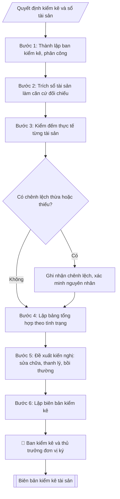

# Lập biên bản kiểm kê tài sản

## Định dạng và file đầu ra
Định dạng đầu ra có thể chọn theo sản phẩm/yêu cầu: .docx, .pdf. Đọc mục “Định dạng bổ sung” trong quy cách đầu ra trước khi chọn.

**Phải tạo file thực tế để tải xuống, không chỉ trả nội dung trong chat.** Định dạng mặc định của skill: **.docx**. Nếu có bảng số liệu nghiệp vụ yêu cầu file bảng tính riêng, tạo thêm Excel theo yêu cầu; không tự tạo file kiểm tra. Không chờ người dùng yêu cầu xuất file lần nữa. Ưu tiên định dạng người dùng chỉ định; đọc quy tắc xuất file tại references/quy-cach-dau-ra.md.

## Quy cách đầu ra và thông tin thiếu
Khi dựng file Word/Excel, áp dụng mục “Thể thức và bảng biểu khi dựng file” trong quy cách đầu ra (cỡ chữ từng thành phần, bảng nhiều trang, số trang, phụ lục). Đọc [quy cách và cấu trúc sản phẩm](references/quy-cach-dau-ra.md) trước khi soạn/xuất. File giao chỉ gồm sản phẩm nghiệp vụ được yêu cầu; kiểm tra nội bộ không xuất kèm. Thiếu thông tin thì giữ nguyên trường/mục và chỗ điền theo mẫu gốc (dòng dấu chấm, dấu gạch hoặc ô trống); không tự điền dữ liệu mẫu, số 0, mã chờ xác minh hay dòng chờ ký. Mẫu chuyên ngành còn áp dụng được ưu tiên về cấu trúc, mã biểu và người ký. Bản đầy đủ: [quy tắc chung](references/quy-tac-chung.md).

Khi người dùng yêu cầu bộ slide (.pptx), đọc mục “Xuất PowerPoint (.pptx) khi được yêu cầu” trong quy cách đầu ra.

## Kiểm soát áp dụng và phê duyệt
Trước khi chạy, xác định `ngay_ap_dung`, `loai_hinh_truong`, `quy_che_noi_bo`, `nguon_du_lieu`, `nguoi_kiem_duyet`; chỉ hỏi thông tin liên quan nghiệp vụ, không dùng giá trị giả định thay dữ liệu bắt buộc. Đối chiếu căn cứ pháp lý với văn bản gốc, hiệu lực, điều khoản áp dụng và chuyển tiếp. Bản đầy đủ: [quy tắc chung](references/quy-tac-chung.md).

## Giới hạn và human gate
AI hỗ trợ chuẩn bị và đối chiếu; cán bộ phụ trách kiểm tra dữ liệu/căn cứ, người có thẩm quyền duyệt và ký. Không đánh dấu đã ký, đã duyệt, đã công bố khi chưa có chứng cứ. Dữ liệu sinh viên, sức khỏe, nhân sự, tài chính chỉ dùng theo mục đích và phân quyền, che thông tin định danh khi dùng ví dụ (Luật 91/2025/QH15, hiệu lực 01/01/2026); không tải dữ liệu lên dịch vụ ngoài khi chưa có quyền. Bản đầy đủ: [quy tắc chung](references/quy-tac-chung.md).

## Khi nào dùng
Khi tổ chức kiểm kê tài sản cố định, công cụ dụng cụ cuối năm; khi kiểm kê đột xuất
khi bàn giao, sáp nhập, giải thể đơn vị.

## Đầu vào (Input)
| Trường | Mô tả | Bắt buộc |
|---|---|---|
| `don_vi` | Đơn vị được kiểm kê | Có |
| `danh_muc` | Bảng tài sản: mã TS, tên, năm đưa vào sử dụng, nguyên giá, giá trị còn lại | Có |
| `tinh_trang` | Tình trạng thực tế từng tài sản: tốt / cần sửa chữa / hỏng / mất / thanh lý | Có |
| `ban_kiem_ke` | Thành phần ban kiểm kê (trưởng ban, thành viên) | Có |
| `thoi_gian` | Thời gian kiểm kê | Có |

## Quy trình
**Ràng buộc pháp lý khi thực hiện** (trích references/phap-ly.md; đối chiếu toàn văn và hiệu lực tại ngày nghiệp vụ):
- Nghị định 186/2025/NĐ-CP, hiệu lực 01/07/2025: Yêu cầu nguồn hình thành, chủ sở hữu, phân cấp quản lý và hồ sơ tài sản công; phân biệt mua sắm, kiểm kê, khai thác, thanh lý. Đối chiếu thẩm quyền và điều kiện theo NĐ 186, không tự quyết định xử lý tài sản.
- Trước Bước 1: chọn căn cứ theo đối tượng, loại hình trường và chuyển tiếp; lập bảng văn bản / điều khoản / lý do áp dụng / bằng chứng. Thiếu văn bản gốc hoặc điều khoản thì ghi nhận nội bộ [CẦN XÁC MINH] (không đưa vào file giao), để trống phần tương ứng, chưa kết luận tuân thủ.
- Các con số, thời hạn, số điều, số mức xếp loại, hệ số và mẫu biểu nêu trong các bước dưới đây được giữ từ quy trình gốc (trước cập nhật pháp lý); chỉ dùng khi đã đối chiếu đúng với căn cứ đã chọn, khác thì theo căn cứ. Danh sách điểm cần đối chiếu: docs/DIEM_CAN_DOI_CHIEU_PHAP_LY.md.

**Bước 1. Thành lập ban kiểm kê và phân công**
- Làm gì: ban hành quyết định thành lập ban kiểm kê (`ban_kiem_ke`: trưởng ban, thành viên);
  phân công đơn vị được kiểm kê (`don_vi`), thời gian thực hiện (`thoi_gian`) và phạm vi
  tài sản kiểm kê.
- Dùng input: `don_vi`, `ban_kiem_ke`, `thoi_gian`.
- Vai trò: Hiệu trưởng (ban hành quyết định thành lập Ban kiểm kê) · AI hỗ trợ: xử lý sơ bộ, tổng hợp · ⏱ ~0,5–1 ngày làm việc (ước tính)
- Lưu ý nghiệp vụ: thành phần ban kiểm kê phải độc lập với đơn vị được kiểm kê (có đại diện
  Phòng TCKT và đơn vị sử dụng); quyết định thành lập là căn cứ pháp lý của toàn bộ đợt
  kiểm kê.
- → Kết quả bước: quyết định thành lập ban kiểm kê + kế hoạch phân công.

**Bước 2. Chuẩn bị số liệu: trích sổ tài sản làm căn cứ đối chiếu**
- Làm gì: trích sổ tài sản cố định của đơn vị từ `danh_muc` (mã tài sản, tên, năm đưa vào
  sử dụng, nguyên giá, giá trị còn lại); lập thành bảng căn cứ để đối chiếu với thực tế
  tại Bước 3.
- Dùng input: `danh_muc`, `don_vi`.
- Vai trò: Chuyên viên Phòng Quản trị – Thiết bị · AI hỗ trợ: đối chiếu tự động, cảnh báo sai lệch · ⏱ ~1–2 giờ (ước tính)
- Lưu ý nghiệp vụ: số liệu trích phải là số đã khóa đến thời điểm kiểm kê; mọi tài sản
  trong sổ đều phải có mặt trong danh sách kiểm kê — không được bỏ sót dòng.
- → Kết quả bước: bảng căn cứ đối chiếu từ sổ sách (đầy đủ mã, tên, nguyên giá, giá trị
  còn lại).

**Bước 3. Kiểm kê thực tế từng tài sản**
- Làm gì: đến từng vị trí, đếm và đối chiếu từng tài sản với bảng căn cứ (mã, tên, số serial
  nếu có); ghi nhận tình trạng thực tế (`tinh_trang`: tốt / cần sửa chữa / hỏng / mất /
  thanh lý); ghi nhận tài sản thừa hoặc thiếu so với sổ sách ngay tại hiện trường.
- Dùng input: `tinh_trang`, kết quả Bước 2.
- Vai trò: Tổ kiểm kê · AI hỗ trợ: đối chiếu tự động, cảnh báo sai lệch · ⏱ ~0,5–1 ngày làm việc (ước tính)
- Lưu ý nghiệp vụ: kiểm kê phải thấy tận mắt từng tài sản — không kiểm kê qua báo cáo của
  đơn vị; tài sản không tìm thấy phải ghi "thiếu", không ghi "chưa kiểm".
- → Kết quả bước: phiếu kiểm kê thực tế + danh sách chênh lệch thừa/thiếu so với sổ sách.

**Bước 4. Lập bảng tổng hợp kết quả kiểm kê**
- Làm gì: tổng hợp kết quả Bước 3 thành bảng (mã TS, tên, năm sử dụng, nguyên giá, giá trị
  còn lại, tình trạng thực tế); phân loại tài sản theo tình trạng; tính chênh lệch thừa –
  thiếu so với sổ sách; cộng tổng nguyên giá và giá trị còn lại.
- Dùng input: kết quả Bước 2 – 3.
- Vai trò: Tổ kiểm kê · AI hỗ trợ: tổng hợp, chuẩn hóa dữ liệu, tính toán, phân tích số liệu · ⏱ ~0,5–1 ngày làm việc (ước tính)
- Lưu ý nghiệp vụ: tổng số lượng và giá trị trên bảng tổng hợp phải đối chiếu khớp với
  phiếu kiểm kê thực tế — sai lệch là dấu hiệu bỏ sót hoặc ghi trùng.
- → Kết quả bước: bảng tổng hợp kết quả kiểm kê (phụ lục biên bản).

**Bước 5. Đề xuất kiến nghị xử lý**
- Làm gì: với từng nhóm tài sản có vấn đề, đề xuất hướng xử lý: sửa chữa (ghi rõ tài sản,
  thời hạn); thanh lý (tài sản hỏng không còn giá trị sử dụng); bồi thường (tài sản mất mát
  do lỗi cá nhân — xem xét trách nhiệm theo quy định).
- Dùng input: kết quả Bước 4.
- Vai trò: Tổ kiểm kê (đề xuất kiến nghị xử lý) · AI hỗ trợ: xử lý sơ bộ, tổng hợp · ⏱ ~30–90 phút (ước tính)
- Lưu ý nghiệp vụ: kiến nghị phải cụ thể đến từng tài sản (mã TS), có thời hạn thực hiện;
  tài sản mất mát do lỗi cá nhân phải xem xét bồi thường theo quy định, không bỏ qua.
- → Kết quả bước: phần kiến nghị xử lý hoàn chỉnh.

**Bước 6. Lập và ký biên bản**
- Làm gì: viết biên bản theo cấu trúc: tiêu đề → thời gian, địa điểm, thành phần ban kiểm
  kê (`ban_kiem_ke`) → I. Kết quả kiểm kê (bảng tổng hợp Bước 4) → II. Chênh lệch thừa/thiếu
  so với sổ sách → III. Kiến nghị (Bước 5) → số bản biên bản → chữ ký của ban kiểm kê và
  thủ trưởng đơn vị được kiểm kê (ghi rõ họ tên, chức vụ).
- Dùng input: `ban_kiem_ke`, `thoi_gian`, kết quả Bước 4 – 5.
- Vai trò: Ban kiểm kê (ký biên bản) · AI hỗ trợ: soạn dự thảo, tổng hợp, chuẩn hóa dữ liệu · ⏱ ~30–60 phút (ước tính)
- Lưu ý nghiệp vụ: biên bản chỉ có giá trị khi có đủ chữ ký của ban kiểm kê và đại diện
  đơn vị được kiểm kê xác nhận.
- → Kết quả bước: biên bản kiểm kê tài sản hoàn chỉnh, đã ký.

## Luồng quy trình (Workflow)

## Đầu ra
- Biên bản kiểm kê tài sản.
- Bảng tổng hợp kết quả kiểm kê (phụ lục).

File nghiệp vụ thực tế theo định dạng mặc định ở đầu skill hoặc định dạng người dùng yêu cầu, kèm liên kết tải trong phản hồi cuối.

Sản phẩm nghiệp vụ theo [quy cách và cấu trúc](references/quy-cach-dau-ra.md); trường thiếu để trống, không kèm tài liệu kiểm tra đầu ra.

## Kiểm tra nội bộ trước khi giao
Các tiêu chí sau dùng để tự đối chiếu; không sao chép vào file xuất. Mục thiếu dữ liệu được để trống, không đánh dấu đã đạt hoặc đã duyệt.

- [ ] Đủ các phần và đúng bố cục theo cấu trúc tại references/quy-cach-dau-ra.md (không theo cấu trúc của bản gốc).
- [ ] Có đầy đủ sản phẩm: Biên bản kiểm kê tài sản
- [ ] Có đầy đủ sản phẩm: Bảng tổng hợp kết quả kiểm kê (phụ lục)
- [ ] Mọi số liệu, tên, ngày tháng trong output khớp với Input đã cung cấp (không thêm bớt, không suy đoán)
- [ ] Không bịa đặt số liệu, minh chứng, trích dẫn hay căn cứ
- [ ] Đúng thể thức, định dạng văn bản theo quy định hiện hành
- [ ] Căn cứ pháp lý nêu đầy đủ, còn hiệu lực tại thời điểm lập
- [ ] Đã qua Human gate: người có thẩm quyền đã kiểm tra/ký duyệt trước khi phát hành
- [ ] Thành phần ban kiểm kê phải độc lập với đơn vị được kiểm kê (có đại diện
- [ ] Số liệu trích phải là số đã khóa đến thời điểm kiểm kê

## Căn cứ & lưu ý
- Chế độ quản lý, sử dụng tài sản công; quy chế quản lý tài sản nội bộ của trường.
- Tài sản mất mát do lỗi cá nhân phải xem xét bồi thường theo quy định.
- Không dùng tên thật của trường/cá nhân khi mô phỏng.

## Tư liệu đối chiếu
Bản gốc trước cập nhật pháp lý (kèm ví dụ giả lập) lưu tại `references/quy-trinh-lich-su.md`, chỉ để đối chiếu hồ sơ lịch sử; không dùng căn cứ, mẫu hay số liệu trong đó làm chỉ dẫn hiện hành.

## Quản trị phiên bản
- Phiên bản gói `1.3.2` (cập nhật 2026-10-10); hồ sơ đầy đủ tại [references/version.json](references/version.json).
- Người phê duyệt nghiệp vụ: **chưa chỉ định**. Trạng thái: dự thảo nghiệp vụ; kiểm tra pháp lý trước thực thi. Ngày cập nhật không đồng nghĩa mọi văn bản đã được rà soát toàn văn.
- Giấy phép theo LICENSE của kho (bản quyền CES Global). Lịch sử thay đổi: CHANGELOG.md.
