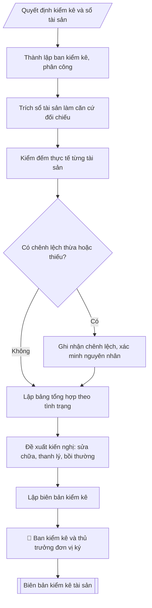

# Tư liệu lịch sử — không dùng làm quy trình hiện hành


## Khi nào dùng
Khi tổ chức kiểm kê tài sản cố định, công cụ dụng cụ cuối năm; khi kiểm kê đột xuất
khi bàn giao, sáp nhập, giải thể đơn vị.

## Đầu vào (Input)

| Trường | Mô tả | Bắt buộc |
|---|---|---|
| `don_vi` | Đơn vị được kiểm kê | Có |
| `danh_muc` | Bảng tài sản: mã TS, tên, năm đưa vào sử dụng, nguyên giá, giá trị còn lại | Có |
| `tinh_trang` | Tình trạng thực tế từng tài sản: tốt / cần sửa chữa / hỏng / mất / thanh lý | Có |
| `ban_kiem_ke` | Thành phần ban kiểm kê (trưởng ban, thành viên) | Có |
| `thoi_gian` | Thời gian kiểm kê | Có |

## Quy trình

**Bước 1. Thành lập ban kiểm kê và phân công**
- Làm gì: ban hành quyết định thành lập ban kiểm kê (`ban_kiem_ke`: trưởng ban, thành viên);
  phân công đơn vị được kiểm kê (`don_vi`), thời gian thực hiện (`thoi_gian`) và phạm vi
  tài sản kiểm kê.
- Dùng input: `don_vi`, `ban_kiem_ke`, `thoi_gian`.
- Vai trò: Hiệu trưởng (ban hành quyết định thành lập Ban kiểm kê) · AI hỗ trợ: xử lý sơ bộ, tổng hợp · ⏱ ~0,5–1 ngày làm việc (ước tính)
- Lưu ý nghiệp vụ: thành phần ban kiểm kê phải độc lập với đơn vị được kiểm kê (có đại diện
  Phòng TCKT và đơn vị sử dụng); quyết định thành lập là căn cứ pháp lý của toàn bộ đợt
  kiểm kê.
- → Kết quả bước: quyết định thành lập ban kiểm kê + kế hoạch phân công.

**Bước 2. Chuẩn bị số liệu: trích sổ tài sản làm căn cứ đối chiếu**
- Làm gì: trích sổ tài sản cố định của đơn vị từ `danh_muc` (mã tài sản, tên, năm đưa vào
  sử dụng, nguyên giá, giá trị còn lại); lập thành bảng căn cứ để đối chiếu với thực tế
  tại Bước 3.
- Dùng input: `danh_muc`, `don_vi`.
- Vai trò: Chuyên viên Phòng Quản trị – Thiết bị · AI hỗ trợ: đối chiếu tự động, cảnh báo sai lệch · ⏱ ~1–2 giờ (ước tính)
- Lưu ý nghiệp vụ: số liệu trích phải là số đã khóa đến thời điểm kiểm kê; mọi tài sản
  trong sổ đều phải có mặt trong danh sách kiểm kê — không được bỏ sót dòng.
- → Kết quả bước: bảng căn cứ đối chiếu từ sổ sách (đầy đủ mã, tên, nguyên giá, giá trị
  còn lại).

**Bước 3. Kiểm kê thực tế từng tài sản**
- Làm gì: đến từng vị trí, đếm và đối chiếu từng tài sản với bảng căn cứ (mã, tên, số serial
  nếu có); ghi nhận tình trạng thực tế (`tinh_trang`: tốt / cần sửa chữa / hỏng / mất /
  thanh lý); ghi nhận tài sản thừa hoặc thiếu so với sổ sách ngay tại hiện trường.
- Dùng input: `tinh_trang`, kết quả Bước 2.
- Vai trò: Tổ kiểm kê · AI hỗ trợ: đối chiếu tự động, cảnh báo sai lệch · ⏱ ~0,5–1 ngày làm việc (ước tính)
- Lưu ý nghiệp vụ: kiểm kê phải thấy tận mắt từng tài sản — không kiểm kê qua báo cáo của
  đơn vị; tài sản không tìm thấy phải ghi "thiếu", không ghi "chưa kiểm".
- → Kết quả bước: phiếu kiểm kê thực tế + danh sách chênh lệch thừa/thiếu so với sổ sách.

**Bước 4. Lập bảng tổng hợp kết quả kiểm kê**
- Làm gì: tổng hợp kết quả Bước 3 thành bảng (mã TS, tên, năm sử dụng, nguyên giá, giá trị
  còn lại, tình trạng thực tế); phân loại tài sản theo tình trạng; tính chênh lệch thừa –
  thiếu so với sổ sách; cộng tổng nguyên giá và giá trị còn lại.
- Dùng input: kết quả Bước 2 – 3.
- Vai trò: Tổ kiểm kê · AI hỗ trợ: tổng hợp, chuẩn hóa dữ liệu, tính toán, phân tích số liệu · ⏱ ~0,5–1 ngày làm việc (ước tính)
- Lưu ý nghiệp vụ: tổng số lượng và giá trị trên bảng tổng hợp phải đối chiếu khớp với
  phiếu kiểm kê thực tế — sai lệch là dấu hiệu bỏ sót hoặc ghi trùng.
- → Kết quả bước: bảng tổng hợp kết quả kiểm kê (phụ lục biên bản).

**Bước 5. Đề xuất kiến nghị xử lý**
- Làm gì: với từng nhóm tài sản có vấn đề, đề xuất hướng xử lý: sửa chữa (ghi rõ tài sản,
  thời hạn); thanh lý (tài sản hỏng không còn giá trị sử dụng); bồi thường (tài sản mất mát
  do lỗi cá nhân — xem xét trách nhiệm theo quy định).
- Dùng input: kết quả Bước 4.
- Vai trò: Tổ kiểm kê (đề xuất kiến nghị xử lý) · AI hỗ trợ: xử lý sơ bộ, tổng hợp · ⏱ ~30–90 phút (ước tính)
- Lưu ý nghiệp vụ: kiến nghị phải cụ thể đến từng tài sản (mã TS), có thời hạn thực hiện;
  tài sản mất mát do lỗi cá nhân phải xem xét bồi thường theo quy định, không bỏ qua.
- → Kết quả bước: phần kiến nghị xử lý hoàn chỉnh.

**Bước 6. Lập và ký biên bản**
- Làm gì: viết biên bản theo cấu trúc: tiêu đề → thời gian, địa điểm, thành phần ban kiểm
  kê (`ban_kiem_ke`) → I. Kết quả kiểm kê (bảng tổng hợp Bước 4) → II. Chênh lệch thừa/thiếu
  so với sổ sách → III. Kiến nghị (Bước 5) → số bản biên bản → chữ ký của ban kiểm kê và
  thủ trưởng đơn vị được kiểm kê (ghi rõ họ tên, chức vụ).
- Dùng input: `ban_kiem_ke`, `thoi_gian`, kết quả Bước 4 – 5.
- Vai trò: Ban kiểm kê (ký biên bản) · AI hỗ trợ: soạn dự thảo, tổng hợp, chuẩn hóa dữ liệu · ⏱ ~30–60 phút (ước tính)
- Lưu ý nghiệp vụ: biên bản chỉ có giá trị khi có đủ chữ ký của ban kiểm kê và đại diện
  đơn vị được kiểm kê xác nhận.
- → Kết quả bước: biên bản kiểm kê tài sản hoàn chỉnh, đã ký.

## Luồng quy trình (Workflow)



## Đầu ra (Output)
- Biên bản kiểm kê tài sản.
- Bảng tổng hợp kết quả kiểm kê (phụ lục).

**Cấu trúc output chuẩn:** khung mẫu cố định của biên bản kiểm kê tài sản, các phần theo
đúng thứ tự xuất hiện:
1. Quốc hiệu – Tiêu ngữ;
2. Tiêu đề biên bản;
3. Thời gian, địa điểm, thành phần ban kiểm kê;
4. Phần I: Kết quả kiểm kê (bảng: STT, mã tài sản, tên tài sản, năm đưa vào sử dụng,
   nguyên giá, giá trị còn lại, tình trạng thực tế);
5. Phần II: Chênh lệch thừa/thiếu so với sổ sách;
6. Phần III: Kiến nghị xử lý (sửa chữa, thanh lý, bồi thường — cụ thể đến từng tài sản,
   có thời hạn);
7. Số bản biên bản;
8. Chữ ký: ban kiểm kê và thủ trưởng đơn vị được kiểm kê (ghi rõ họ tên, chức vụ);
9. Phụ lục: Bảng tổng hợp kết quả kiểm kê.

## Checklist nghiệm thu

- [ ] Đủ các phần theo "Cấu trúc output chuẩn": Quốc hiệu; Tiêu đề biên bản;; Thời gian, địa điểm, thành phần ban kiểm kê;; Phần I; Phần II; Phần III; …
- [ ] Có đầy đủ sản phẩm: Biên bản kiểm kê tài sản
- [ ] Có đầy đủ sản phẩm: Bảng tổng hợp kết quả kiểm kê (phụ lục)
- [ ] Mọi số liệu, tên, ngày tháng trong output khớp với Input đã cung cấp (không thêm bớt, không suy đoán)
- [ ] Không bịa đặt số liệu, minh chứng, trích dẫn hay căn cứ
- [ ] Đúng thể thức, định dạng văn bản theo quy định hiện hành
- [ ] Căn cứ pháp lý nêu đầy đủ, còn hiệu lực tại thời điểm lập
- [ ] Đã qua Human gate: người có thẩm quyền đã kiểm tra/ký duyệt trước khi phát hành
- [ ] Thành phần ban kiểm kê phải độc lập với đơn vị được kiểm kê (có đại diện
- [ ] Số liệu trích phải là số đã khóa đến thời điểm kiểm kê

> Tiêu chí đạt: tất cả các ô đều được đánh dấu.

## Ví dụ mô phỏng (dữ liệu giả lập)

> Tất cả tên trường, cá nhân, số liệu dưới đây đều là **giả lập**, không liên quan tổ chức/cá nhân có thật.

### Input mẫu

| Trường | Giá trị |
|---|---|
| `don_vi` | Khoa Công nghệ thông tin – Trường Đại học A |
| `danh_muc` | 1. Máy chủ Dell R450 (TS-ĐHA-001, 2022, 180tr, còn lại 108tr). 2. 40 máy tính Lab A2 (TS-ĐHA-040→079, 2026, 2,32 tỷ). 3. Máy chiếu Sony (TS-ĐHA-101, 2021, 35tr, còn lại 7tr). |
| `tinh_trang` | Máy chủ: tốt. 40 máy tính: tốt (39), hỏng nguồn 01 (SM26017). Máy chiếu: cần thay bóng đèn. |
| `ban_kiem_ke` | Trưởng ban: Ông Vũ Văn C (P. QTTB); Thành viên: Bà Đỗ Thị A (Khoa CNTT), Ông Lê Văn Sơn (P. TCKT) |
| `thoi_gian` | Ngày 20/12/2026 |

### Output mẫu

```
CỘNG HÒA XÃ HỘI CHỦ NGHĨA VIỆT NAM
Độc lập – Tự do – Hạnh phúc

BIÊN BẢN KIỂM KÊ TÀI SẢN CỐ ĐỊNH
(Dữ liệu giả lập)

Hôm nay, ngày 20 tháng 12 năm 2026, tại Khoa Công nghệ thông tin, Trường Đại học
A, Ban kiểm kê gồm:

1. Ông Vũ Văn C – Trưởng phòng Quản trị – Thiết bị – Trưởng ban;
2. Bà Đỗ Thị A – Đại diện Khoa Công nghệ thông tin – Thành viên;
3. Ông Lê Văn Sơn – Đại diện Phòng Tài chính – Kế toán – Thành viên.

Đã tiến hành kiểm kê tài sản cố định của Khoa Công nghệ thông tin, kết quả:

I. KẾT QUẢ KIỂM KÊ
| STT | Mã TS | Tên tài sản | Năm SD | Nguyên giá (đ) | Giá trị còn lại (đ) | Tình trạng thực tế |
|-----|-------|-------------|--------|----------------|---------------------|---------------------|
| 1 | TS-ĐHA-001 | Máy chủ Dell R450 | 2022 | 180.000.000 | 108.000.000 | Tốt |
| 2 | TS-ĐHA-040→079 | 40 máy tính Lab A2 | 2026 | 2.320.000.000 | 2.320.000.000 | 39 tốt, 01 hỏng nguồn (SM26017) |
| 3 | TS-ĐHA-101 | Máy chiếu Sony | 2021 | 35.000.000 | 7.000.000 | Cần thay bóng đèn |

II. CHÊNH LỆCH: Không có chênh lệch thừa/thiếu so với sổ sách.

III. KIẾN NGHỊ
1. Sửa chữa 01 máy tính hỏng nguồn (SM26017) trong thời gian bảo hành.
2. Thay bóng đèn máy chiếu TS-ĐHA-101 trong quý I/2027.

Biên bản lập thành 03 bản.

   TRƯỞNG BAN        THÀNH VIÊN         THÀNH VIÊN       ĐẠI DIỆN ĐƠN VỊ
    [CHỜ KÝ]           [CHỜ KÝ]             [CHỜ KÝ]             [CHỜ KÝ]
 Vũ Văn C     Đỗ Thị A       Lê Văn Sơn        (Thủ trưởng đơn vị)
```

## Căn cứ & lưu ý
- Chế độ quản lý, sử dụng tài sản công; quy chế quản lý tài sản nội bộ của trường.
- Tài sản mất mát do lỗi cá nhân phải xem xét bồi thường theo quy định.
- Không dùng tên thật của trường/cá nhân khi mô phỏng.
