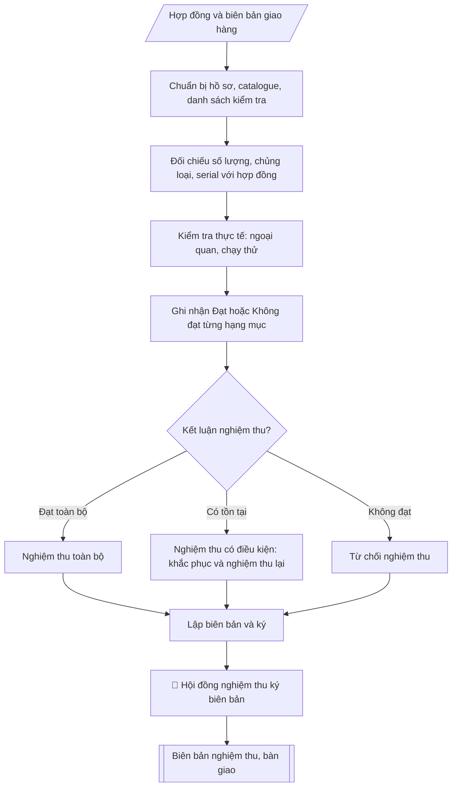

# Lập biên bản nghiệm thu thiết bị

## Định dạng và file đầu ra

Định dạng đầu ra có thể chọn theo sản phẩm/yêu cầu: .docx, .pdf. Đọc mục “Định dạng bổ sung” trong quy cách đầu ra trước khi chọn.

**Phải tạo file thực tế để tải xuống, không chỉ trả nội dung trong chat.** Định dạng mặc định của skill: **.docx**. Nếu có bảng số liệu nghiệp vụ yêu cầu file bảng tính riêng, tạo thêm Excel theo yêu cầu; không tự tạo file kiểm tra. Không chờ người dùng yêu cầu xuất file lần nữa. Ưu tiên định dạng người dùng chỉ định; đọc quy tắc xuất file tại references/quy-cach-dau-ra.md.

## Quy cách đầu ra và thông tin thiếu

Đọc [quy cách và cấu trúc sản phẩm](references/quy-cach-dau-ra.md) trước khi soạn/xuất. File giao chỉ gồm văn bản hoặc sản phẩm nghiệp vụ được yêu cầu; kiểm tra nội bộ không xuất kèm. Thiếu thông tin giữ nguyên trường/mục và chỗ điền theo mẫu gốc (dòng dấu chấm, dấu gạch hoặc ô trống); không tự điền dữ liệu mẫu, số 0, mã chờ xác minh hoặc dòng chờ ký. Mẫu chuyên ngành còn áp dụng được ưu tiên về cấu trúc, mã biểu và người ký. Các trường “bắt buộc” là điều kiện hoàn thiện hồ sơ, không ngăn việc soạn bản có chỗ chừa để điền. Mọi chỉ dẫn “để trống” trong skill được hiểu là không điền dữ liệu và giữ cách chừa chỗ của mẫu gốc, không phải xóa dấu chấm của mẫu.

## Kiểm soát áp dụng và phê duyệt

Trước khi chạy quy trình, xác định `ngay_ap_dung`, `loai_hinh_truong`, `quy_che_noi_bo`, `nguon_du_lieu` và `nguoi_kiem_duyet`. Chỉ yêu cầu thông tin có liên quan đến nghiệp vụ; không dùng giá trị giả định thay dữ liệu bắt buộc. Đối chiếu nội bộ hồ sơ có yếu tố pháp lý với văn bản gốc, hiệu lực, điều khoản áp dụng và chuyển tiếp; không tự đính kèm bảng kiểm tra vào file giao.

## Giới hạn và human gate

AI hỗ trợ chuẩn bị và đối chiếu. Cán bộ phụ trách kiểm tra dữ liệu/căn cứ, người có thẩm quyền duyệt và ký. Văn bản soạn chưa được coi là đã ban hành; không tự chèn nhãn trạng thái kiểm duyệt vào file giao; không đánh dấu đã ký, đã duyệt hoặc đã công bố nếu chưa có chứng cứ. Dữ liệu sinh viên, sức khỏe, nhân sự và tài chính phải hạn chế theo mục đích, phân quyền và che thông tin định danh khi dùng ví dụ. Không tải dữ liệu lên dịch vụ ngoài khi chưa có quyền. Kiểm tra Luật 91/2025/QH15 về bảo vệ dữ liệu cá nhân (hiệu lực 01/01/2026) và quy định áp dụng trước xử lý/chia sẻ dữ liệu cá nhân.

## Khi nào dùng
Khi thiết bị đã được giao, lắp đặt xong và cần nghiệm thu trước khi thanh toán;
khi bàn giao thiết bị cho đơn vị sử dụng quản lý.

## Đầu vào (Input)

| Trường | Mô tả | Bắt buộc |
|---|---|---|
| `hop_dong` | Số hợp đồng, ngày ký, các bên | Có |
| `danh_muc` | Bảng thiết bị: tên, model, số serial, số lượng, đơn vị tính | Có |
| `ket_qua_kiem_tra` | Kết quả kiểm tra từng hạng mục: đạt / không đạt, ghi chú lỗi (nếu có) | Có |
| `thanh_phan` | Thành phần hội đồng nghiệm thu (đại diện các bên, chức vụ) | Có |
| `thoi_gian_dia_diem` | Thời gian, địa điểm nghiệm thu | Có |

## Quy trình

**Bước 1. Chuẩn bị hồ sơ nghiệm thu**
- Làm gì: tập hợp hợp đồng (`hop_dong`), HSMT, biên bản giao hàng, catalogue/thông số kỹ
  thuật của thiết bị; từ `danh_muc` lập danh sách kiểm tra (tên, model, số serial, số lượng
  từng hạng mục) để dùng khi đối chiếu thực tế.
- Dùng input: `hop_dong`, `danh_muc`.
- Vai trò: Tổ nghiệm thu · AI hỗ trợ: tổng hợp, chuẩn hóa dữ liệu, đối chiếu tự động, cảnh báo sai lệch · ⏱ ~0,5–1 ngày làm việc (ước tính)
- Lưu ý nghiệp vụ: thiếu biên bản giao hàng hoặc catalogue thì chưa đủ cơ sở nghiệm thu —
  yêu cầu nhà thầu cung cấp trước buổi nghiệm thu.
- → Kết quả bước: bộ hồ sơ nghiệm thu + danh sách kiểm tra theo danh mục hợp đồng.

**Bước 2. Đối chiếu hồ sơ: số lượng, chủng loại, số serial**
- Làm gì: kiểm tra thực tế từng hạng mục so với hợp đồng: đếm số lượng, đối chiếu chủng loại,
  model và số serial từng chiếc với danh mục hợp đồng; ghi lại mọi chênh lệch (thiếu số
  lượng, sai model, serial không khớp).
- Dùng input: `danh_muc`, kết quả Bước 1.
- Vai trò: Chuyên viên Phòng Quản trị – Thiết bị · AI hỗ trợ: đối chiếu tự động, cảnh báo sai lệch · ⏱ ~1–2 giờ (ước tính)
- Lưu ý nghiệp vụ: số serial là định danh duy nhất của từng thiết bị — phải đối chiếu từng
  chiếc, không kiểm tra mẫu; chênh lệch serial phải được làm rõ ngay tại buổi nghiệm thu.
- → Kết quả bước: bảng đối chiếu hồ sơ (từng hạng mục: khớp/lệch so với hợp đồng).

**Bước 3. Kiểm tra thực tế: ngoại quan và chạy thử**
- Làm gì: kiểm tra ngoại quan (nguyên đai, nguyên kiện; móp méo, trầy xước); kiểm tra tình
  trạng hoạt động và chạy thử các chức năng chính theo tiêu chí đã thống nhất trong
  `ket_qua_kiem_tra`; thực hiện tại `thoi_gian_dia_diem` đã ấn định với đầy đủ thành phần.
- Dùng input: `ket_qua_kiem_tra`, `thoi_gian_dia_diem`.
- Vai trò: Cán bộ Phòng Quản trị – Thiết bị (thực hiện trực tiếp) · AI hỗ trợ: đối chiếu tự động, cảnh báo sai lệch · ⏱ ~1–2 giờ (ước tính)
- Lưu ý nghiệp vụ: chạy thử phải bao phủ chức năng chính mà thiết bị sẽ phục vụ (ví dụ máy
  tính: khởi động, kiểm tra cấu hình, chạy phần mềm chuyên dụng); ghi nhận cụ thể từng lỗi
  phát hiện, không ghi chung chung "chưa đạt".
- → Kết quả bước: biên bản ghi nhận kiểm tra thực tế (ngoại quan + chạy thử từng hạng mục).

**Bước 4. Ghi nhận kết quả từng hạng mục**
- Làm gì: tổng hợp kết quả Bước 2 – 3 thành bảng: mỗi hạng mục ghi Đạt hoặc Không đạt, kèm
  mô tả cụ thể tồn tại (nếu có: lỗi gì, số serial nào, mức độ).
- Dùng input: kết quả Bước 2 – 3.
- Vai trò: Chuyên viên Phòng Quản trị – Thiết bị · AI hỗ trợ: tổng hợp, chuẩn hóa dữ liệu · ⏱ ~0,5–1 ngày làm việc (ước tính)
- Lưu ý nghiệp vụ: kết quả phải khách quan, dựa trên bằng chứng kiểm tra — đây là căn cứ
  để kết luận nghiệm thu và xử lý bảo hành về sau.
- → Kết quả bước: bảng kết quả Đạt/Không đạt từng hạng mục.

**Bước 5. Kết luận nghiệm thu**
- Làm gì: căn cứ bảng kết quả Bước 4, đưa ra một trong ba kết luận: (1) nghiệm thu toàn bộ
  (tất cả đạt); (2) nghiệm thu có điều kiện (ghi rõ nội dung phải khắc phục, thời hạn khắc
  phục, và tổ chức nghiệm thu lại sau khắc phục); (3) từ chối nghiệm thu (không đạt ở mức
  không thể chấp nhận).
- Dùng input: kết quả Bước 4.
- Vai trò: Tổ nghiệm thu · AI hỗ trợ: xử lý sơ bộ, tổng hợp · ⏱ ~0,5–1 ngày làm việc (ước tính)
- Lưu ý nghiệp vụ: nghiệm thu có điều kiện phải ghi rõ thời hạn khắc phục và trách nhiệm
  của nhà thầu; không thanh toán đợt cuối khi chưa nghiệm thu đạt.
- → Kết quả bước: dự thảo kết luận nghiệm thu.

**Bước 6. Lập và ký biên bản**
- Làm gì: viết biên bản theo cấu trúc: tiêu đề → căn cứ (hợp đồng) → thời gian, địa điểm,
  thành phần hội đồng (`thanh_phan`, `thoi_gian_dia_diem`) → I. Thiết bị nghiệm thu
  (danh mục) → II. Kết quả kiểm tra (số lượng, ngoại quan, chạy thử) → III. Kết luận →
  số bản biên bản → chữ ký các thành viên (ghi rõ họ tên, chức vụ); đính kèm phụ lục bảng
  chi tiết thiết bị kèm số serial.
- Dùng input: `thanh_phan`, `thoi_gian_dia_diem`, kết quả Bước 4 – 5.
- Vai trò: Tổ nghiệm thu (ký biên bản) · AI hỗ trợ: soạn dự thảo, đối chiếu tự động, cảnh báo sai lệch · ⏱ ~30–60 phút (ước tính)
- Lưu ý nghiệp vụ: biên bản phải có chữ ký của đủ thành phần (chủ tịch hội đồng, đơn vị sử
  dụng, đại diện nhà thầu); phụ lục serial là tài liệu bắt buộc đính kèm.
- → Kết quả bước: biên bản nghiệm thu, bàn giao thiết bị hoàn chỉnh, đã ký.

## Luồng quy trình (Workflow)

## Đầu ra

File nghiệp vụ thực tế theo định dạng mặc định ở đầu skill hoặc định dạng người dùng yêu cầu, kèm liên kết tải trong phản hồi cuối.

Sản phẩm nghiệp vụ hoàn chỉnh theo [quy cách và cấu trúc](references/quy-cach-dau-ra.md), giữ các trường chưa có dữ liệu ở trạng thái trống. Không xuất kèm checklist/phụ lục kiểm tra đầu ra.

## Kiểm tra nội bộ trước khi giao

- [ ] Bố cục khớp mẫu áp dụng và cấu trúc tại references/quy-cach-dau-ra.md.
- [ ] Có đầy đủ sản phẩm: Biên bản nghiệm thu, bàn giao thiết bị
- [ ] Có đầy đủ sản phẩm: Bảng chi tiết thiết bị kèm số serial (phụ lục)
- [ ] Mọi số liệu, tên, ngày tháng trong output khớp với Input đã cung cấp (không thêm bớt, không suy đoán)
- [ ] Không bịa đặt số liệu, minh chứng, trích dẫn hay căn cứ
- [ ] Đúng thể thức, định dạng văn bản theo quy định hiện hành
- [ ] Căn cứ pháp lý nêu đầy đủ, còn hiệu lực tại thời điểm lập
- [ ] Đã qua Human gate: người có thẩm quyền đã kiểm tra/ký duyệt trước khi phát hành
- [ ] Thiếu biên bản giao hàng hoặc catalogue thì chưa đủ cơ sở nghiệm thu —
- [ ] Số serial là định danh duy nhất của từng thiết bị — phải đối chiếu từng

> Tiêu chí đạt: tất cả các ô đều được đánh dấu.

## Căn cứ & lưu ý
- Hợp đồng mua sắm đã ký; HSMT và HSDT của nhà thầu trúng thầu.
- Trường hợp nghiệm thu có điều kiện: ghi rõ nội dung phải khắc phục và thời hạn, nghiệm thu lại sau khắc phục.
- Không dùng tên thật của trường/cá nhân khi mô phỏng.

## Quản trị phiên bản

- Phiên bản gói: `1.3.1`; ngày cập nhật: `2026-10-10`.
- Kho nguồn: https://github.com/phamtruong91/university-skills-framework
- Người duy trì trên GitHub: `phamtruong91` (Phạm Văn Trường). Người phê duyệt nghiệp vụ: **chưa chỉ định**.
- Commit nguồn trước cập nhật: `346719e6b0318ed034b4b016703f79733aa575e7`. Commit chứa phiên bản này xem bằng `git log -1 -- skills/bien-ban-nghiem-thu-thiet-bi`; không tự gán SHA chưa tạo.
- Giấy phép: theo LICENSE của kho; bản quyền CES Global.
- Lịch sử 1.1.0: bổ sung metadata giao diện, kiểm soát áp dụng, quản trị phiên bản.
- Trạng thái: dự thảo nghiệp vụ; kiểm tra pháp lý trước thực thi. Ngày cập nhật không đồng nghĩa mọi văn bản đã được rà soát toàn văn.
