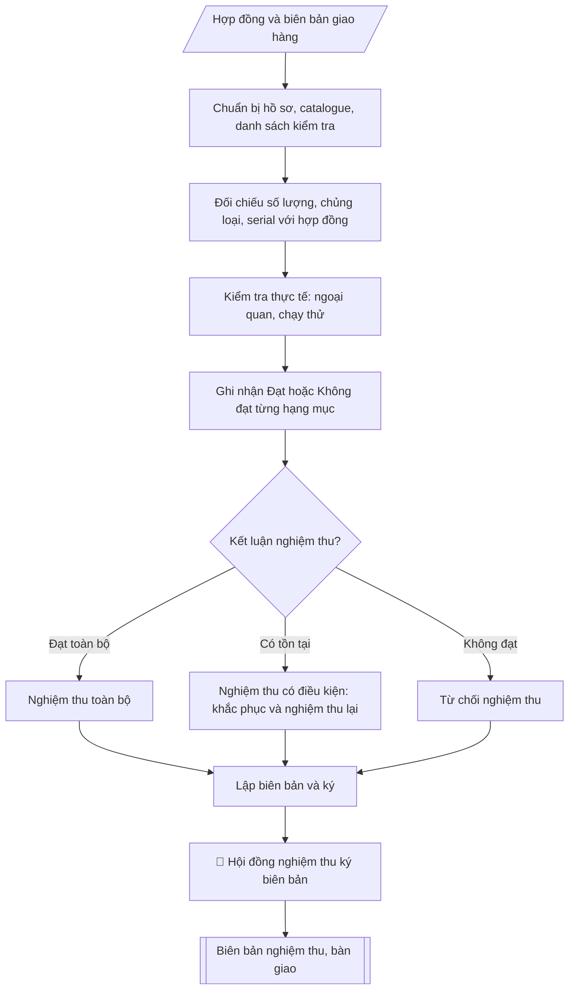

# Skill: Lập biên bản nghiệm thu thiết bị

## Khi nào dùng
Khi thiết bị đã được giao, lắp đặt xong và cần nghiệm thu trước khi thanh toán;
khi bàn giao thiết bị cho đơn vị sử dụng quản lý.

## Đầu vào (Input)

| Trường | Mô tả | Bắt buộc |
|---|---|---|
| `hop_dong` | Số hợp đồng, ngày ký, các bên | Có |
| `danh_muc` | Bảng thiết bị: tên, model, số serial, số lượng, đơn vị tính | Có |
| `ket_qua_kiem_tra` | Kết quả kiểm tra từng hạng mục: đạt / không đạt, ghi chú lỗi (nếu có) | Có |
| `thanh_phan` | Thành phần hội đồng nghiệm thu (đại diện các bên, chức vụ) | Có |
| `thoi_gian_dia_diem` | Thời gian, địa điểm nghiệm thu | Có |

## Quy trình

**Bước 1. Chuẩn bị hồ sơ nghiệm thu**
- Làm gì: tập hợp hợp đồng (`hop_dong`), HSMT, biên bản giao hàng, catalogue/thông số kỹ
  thuật của thiết bị; từ `danh_muc` lập danh sách kiểm tra (tên, model, số serial, số lượng
  từng hạng mục) để dùng khi đối chiếu thực tế.
- Dùng input: `hop_dong`, `danh_muc`.
- Vai trò: Tổ nghiệm thu · AI hỗ trợ: tổng hợp, chuẩn hóa dữ liệu, đối chiếu tự động, cảnh báo sai lệch · ⏱ ~0,5–1 ngày làm việc (ước tính)
- Lưu ý nghiệp vụ: thiếu biên bản giao hàng hoặc catalogue thì chưa đủ cơ sở nghiệm thu —
  yêu cầu nhà thầu cung cấp trước buổi nghiệm thu.
- → Kết quả bước: bộ hồ sơ nghiệm thu + danh sách kiểm tra theo danh mục hợp đồng.

**Bước 2. Đối chiếu hồ sơ: số lượng, chủng loại, số serial**
- Làm gì: kiểm tra thực tế từng hạng mục so với hợp đồng: đếm số lượng, đối chiếu chủng loại,
  model và số serial từng chiếc với danh mục hợp đồng; ghi lại mọi chênh lệch (thiếu số
  lượng, sai model, serial không khớp).
- Dùng input: `danh_muc`, kết quả Bước 1.
- Vai trò: Chuyên viên Phòng Quản trị – Thiết bị · AI hỗ trợ: đối chiếu tự động, cảnh báo sai lệch · ⏱ ~1–2 giờ (ước tính)
- Lưu ý nghiệp vụ: số serial là định danh duy nhất của từng thiết bị — phải đối chiếu từng
  chiếc, không kiểm tra mẫu; chênh lệch serial phải được làm rõ ngay tại buổi nghiệm thu.
- → Kết quả bước: bảng đối chiếu hồ sơ (từng hạng mục: khớp/lệch so với hợp đồng).

**Bước 3. Kiểm tra thực tế: ngoại quan và chạy thử**
- Làm gì: kiểm tra ngoại quan (nguyên đai, nguyên kiện; móp méo, trầy xước); kiểm tra tình
  trạng hoạt động và chạy thử các chức năng chính theo tiêu chí đã thống nhất trong
  `ket_qua_kiem_tra`; thực hiện tại `thoi_gian_dia_diem` đã ấn định với đầy đủ thành phần.
- Dùng input: `ket_qua_kiem_tra`, `thoi_gian_dia_diem`.
- Vai trò: Cán bộ Phòng Quản trị – Thiết bị (thực hiện trực tiếp) · AI hỗ trợ: đối chiếu tự động, cảnh báo sai lệch · ⏱ ~1–2 giờ (ước tính)
- Lưu ý nghiệp vụ: chạy thử phải bao phủ chức năng chính mà thiết bị sẽ phục vụ (ví dụ máy
  tính: khởi động, kiểm tra cấu hình, chạy phần mềm chuyên dụng); ghi nhận cụ thể từng lỗi
  phát hiện, không ghi chung chung "chưa đạt".
- → Kết quả bước: biên bản ghi nhận kiểm tra thực tế (ngoại quan + chạy thử từng hạng mục).

**Bước 4. Ghi nhận kết quả từng hạng mục**
- Làm gì: tổng hợp kết quả Bước 2 – 3 thành bảng: mỗi hạng mục ghi Đạt hoặc Không đạt, kèm
  mô tả cụ thể tồn tại (nếu có: lỗi gì, số serial nào, mức độ).
- Dùng input: kết quả Bước 2 – 3.
- Vai trò: Chuyên viên Phòng Quản trị – Thiết bị · AI hỗ trợ: tổng hợp, chuẩn hóa dữ liệu · ⏱ ~0,5–1 ngày làm việc (ước tính)
- Lưu ý nghiệp vụ: kết quả phải khách quan, dựa trên bằng chứng kiểm tra — đây là căn cứ
  để kết luận nghiệm thu và xử lý bảo hành về sau.
- → Kết quả bước: bảng kết quả Đạt/Không đạt từng hạng mục.

**Bước 5. Kết luận nghiệm thu**
- Làm gì: căn cứ bảng kết quả Bước 4, đưa ra một trong ba kết luận: (1) nghiệm thu toàn bộ
  (tất cả đạt); (2) nghiệm thu có điều kiện (ghi rõ nội dung phải khắc phục, thời hạn khắc
  phục, và tổ chức nghiệm thu lại sau khắc phục); (3) từ chối nghiệm thu (không đạt ở mức
  không thể chấp nhận).
- Dùng input: kết quả Bước 4.
- Vai trò: Tổ nghiệm thu · AI hỗ trợ: xử lý sơ bộ, tổng hợp · ⏱ ~0,5–1 ngày làm việc (ước tính)
- Lưu ý nghiệp vụ: nghiệm thu có điều kiện phải ghi rõ thời hạn khắc phục và trách nhiệm
  của nhà thầu; không thanh toán đợt cuối khi chưa nghiệm thu đạt.
- → Kết quả bước: dự thảo kết luận nghiệm thu.

**Bước 6. Lập và ký biên bản**
- Làm gì: viết biên bản theo cấu trúc: tiêu đề → căn cứ (hợp đồng) → thời gian, địa điểm,
  thành phần hội đồng (`thanh_phan`, `thoi_gian_dia_diem`) → I. Thiết bị nghiệm thu
  (danh mục) → II. Kết quả kiểm tra (số lượng, ngoại quan, chạy thử) → III. Kết luận →
  số bản biên bản → chữ ký các thành viên (ghi rõ họ tên, chức vụ); đính kèm phụ lục bảng
  chi tiết thiết bị kèm số serial.
- Dùng input: `thanh_phan`, `thoi_gian_dia_diem`, kết quả Bước 4 – 5.
- Vai trò: Tổ nghiệm thu (ký biên bản) · AI hỗ trợ: soạn dự thảo, đối chiếu tự động, cảnh báo sai lệch · ⏱ ~30–60 phút (ước tính)
- Lưu ý nghiệp vụ: biên bản phải có chữ ký của đủ thành phần (chủ tịch hội đồng, đơn vị sử
  dụng, đại diện nhà thầu); phụ lục serial là tài liệu bắt buộc đính kèm.
- → Kết quả bước: biên bản nghiệm thu, bàn giao thiết bị hoàn chỉnh, đã ký.

## Luồng quy trình (Workflow)



## Đầu ra (Output)
- Biên bản nghiệm thu, bàn giao thiết bị.
- Bảng chi tiết thiết bị kèm số serial (phụ lục).

**Cấu trúc output chuẩn:** khung mẫu cố định của biên bản nghiệm thu, các phần theo đúng
thứ tự xuất hiện:
1. Quốc hiệu – Tiêu ngữ;
2. Tiêu đề biên bản;
3. Căn cứ (hợp đồng mua sắm);
4. Thời gian, địa điểm, thành phần hội đồng nghiệm thu;
5. Phần I: Thiết bị nghiệm thu (danh mục thiết bị);
6. Phần II: Kết quả kiểm tra (số lượng, ngoại quan, chạy thử);
7. Phần III: Kết luận nghiệm thu (nghiệm thu toàn bộ / nghiệm thu có điều kiện ghi rõ việc
   khắc phục và thời hạn / từ chối nghiệm thu);
8. Số bản biên bản;
9. Chữ ký các thành viên hội đồng (ghi rõ họ tên, chức vụ);
10. Phụ lục: Bảng chi tiết thiết bị kèm số serial.

## Checklist nghiệm thu

- [ ] Đủ các phần theo "Cấu trúc output chuẩn": Quốc hiệu; Tiêu đề biên bản;; Căn cứ (hợp đồng mua sắm);; Thời gian, địa điểm, thành phần hội đồng…; Phần I; Phần II; …
- [ ] Có đầy đủ sản phẩm: Biên bản nghiệm thu, bàn giao thiết bị
- [ ] Có đầy đủ sản phẩm: Bảng chi tiết thiết bị kèm số serial (phụ lục)
- [ ] Mọi số liệu, tên, ngày tháng trong output khớp với Input đã cung cấp (không thêm bớt, không suy đoán)
- [ ] Không bịa đặt số liệu, minh chứng, trích dẫn hay căn cứ
- [ ] Đúng thể thức, định dạng văn bản theo quy định hiện hành
- [ ] Căn cứ pháp lý nêu đầy đủ, còn hiệu lực tại thời điểm lập
- [ ] Đã qua Human gate: người có thẩm quyền đã kiểm tra/ký duyệt trước khi phát hành
- [ ] Thiếu biên bản giao hàng hoặc catalogue thì chưa đủ cơ sở nghiệm thu —
- [ ] Số serial là định danh duy nhất của từng thiết bị — phải đối chiếu từng

> Tiêu chí đạt: tất cả các ô đều được đánh dấu.

## Ví dụ mô phỏng (dữ liệu giả lập)

> Tất cả tên trường, cá nhân, số liệu dưới đây đều là **giả lập**, không liên quan tổ chức/cá nhân có thật.

### Input mẫu

| Trường | Giá trị |
|---|---|
| `hop_dong` | Số 12/2026/HĐMB-ĐHA ngày 28/03/2026 giữa Trường Đại học A và Công ty TNHH D |
| `danh_muc` | 40 bộ máy tính (CPU i5-13400, RAM 16GB, SSD 512GB, màn 24"); số serial SM26001–SM26040 |
| `ket_qua_kiem_tra` | 40/40 bộ đúng chủng loại, ngoại quan tốt, khởi động và chạy thử phần mềm đạt yêu cầu |
| `thanh_phan` | 1. Ông Vũ Văn C – Trưởng phòng QTTB (Chủ tịch HĐ). 2. Bà Đỗ Thị A – Khoa CNTT (đơn vị sử dụng). 3. Ông Đỗ Quang Huy – Đại diện nhà thầu. |
| `thoi_gian_dia_diem` | 09h00 ngày 25/04/2026, phòng Lab A2 |

### Output mẫu

```
CỘNG HÒA XÃ HỘI CHỦ NGHĨA VIỆT NAM
Độc lập – Tự do – Hạnh phúc

BIÊN BẢN NGHIỆM THU, BÀN GIAO THIẾT BỊ
(Dữ liệu giả lập)

Căn cứ Hợp đồng số 12/2026/HĐMB-ĐHA ngày 28/03/2026 giữa Trường Đại học A
và Công ty TNHH D;

Hôm nay, hồi 09 giờ 00 ngày 25 tháng 04 năm 2026, tại phòng Lab A2, Trường Đại
học A, chúng tôi gồm:

1. Ông Vũ Văn C – Trưởng phòng Quản trị – Thiết bị – Chủ tịch Hội đồng;
2. Bà Đỗ Thị A – Đại diện Khoa Công nghệ thông tin (đơn vị sử dụng);
3. Ông Đỗ Quang Huy – Đại diện Công ty TNHH D (nhà thầu).

Cùng tiến hành nghiệm thu thiết bị thuộc hợp đồng nêu trên, với nội dung:

I. THIẾT BỊ NGHIỆM THU
40 bộ máy tính để bàn (CPU Intel Core i5-13400, RAM 16GB DDR4, SSD 512GB,
màn hình 24" Full HD), số serial từ SM26001 đến SM26040 (chi tiết tại Phụ lục).

II. KẾT QUẢ KIỂM TRA
1. Số lượng: đủ 40/40 bộ, đúng chủng loại, model theo hợp đồng.
2. Ngoại quan: nguyên đai, nguyên kiện, không móp méo, trầy xước.
3. Chạy thử: 40/40 bộ khởi động bình thường, kiểm tra cấu hình đúng yêu cầu,
   chạy thử phần mềm văn phòng và lập trình ổn định.

III. KẾT LUẬN
Hội đồng thống nhất nghiệm thu toàn bộ 40 bộ máy tính, đạt yêu cầu theo hợp
đồng. Nhà thầu bàn giao cho Khoa Công nghệ thông tin đưa vào sử dụng; thời
gian bảo hành 36 tháng kể từ ngày ký biên bản này.

Biên bản lập thành 04 bản có giá trị như nhau.

   CHỦ TỊCH HỘI ĐỒNG      ĐƠN VỊ SỬ DỤNG         ĐẠI DIỆN NHÀ THẦU
       (đã ký)                (đã ký)                 (đã ký)

   Vũ Văn C           Đỗ Thị A           Đỗ Quang Huy

PHỤ LỤC: Bảng chi tiết 40 bộ máy tính kèm số serial SM26001–SM26040.
```

## Căn cứ & lưu ý
- Hợp đồng mua sắm đã ký; HSMT và HSDT của nhà thầu trúng thầu.
- Trường hợp nghiệm thu có điều kiện: ghi rõ nội dung phải khắc phục và thời hạn, nghiệm thu lại sau khắc phục.
- Không dùng tên thật của trường/cá nhân khi mô phỏng.
