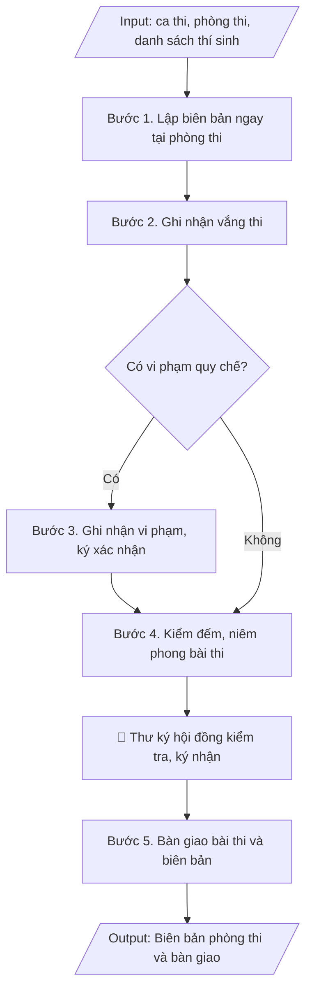

# Biên bản phòng thi & bàn giao bài thi

## Định dạng và file đầu ra
Định dạng đầu ra có thể chọn theo sản phẩm/yêu cầu: .docx, .pdf. Đọc mục “Định dạng bổ sung” trong quy cách đầu ra trước khi chọn.

**Phải tạo file thực tế để tải xuống, không chỉ trả nội dung trong chat.** Định dạng mặc định của skill: **.docx**. Nếu có bảng số liệu nghiệp vụ yêu cầu file bảng tính riêng, tạo thêm Excel theo yêu cầu; không tự tạo file kiểm tra. Không chờ người dùng yêu cầu xuất file lần nữa. Ưu tiên định dạng người dùng chỉ định; đọc quy tắc xuất file tại references/quy-cach-dau-ra.md.

## Quy cách đầu ra và thông tin thiếu
Khi dựng file Word/Excel, áp dụng mục “Thể thức và bảng biểu khi dựng file” trong quy cách đầu ra (cỡ chữ từng thành phần, bảng nhiều trang, số trang, phụ lục). Đọc [quy cách và cấu trúc sản phẩm](references/quy-cach-dau-ra.md) trước khi soạn/xuất. File giao chỉ gồm sản phẩm nghiệp vụ được yêu cầu; kiểm tra nội bộ không xuất kèm. Thiếu thông tin thì giữ nguyên trường/mục và chỗ điền theo mẫu gốc (dòng dấu chấm, dấu gạch hoặc ô trống); không tự điền dữ liệu mẫu, số 0, mã chờ xác minh hay dòng chờ ký. Mẫu chuyên ngành còn áp dụng được ưu tiên về cấu trúc, mã biểu và người ký. Bản đầy đủ: [quy tắc chung](references/quy-tac-chung.md).

## Kiểm soát áp dụng và phê duyệt
Trước khi chạy, xác định `ngay_ap_dung`, `loai_hinh_truong`, `quy_che_noi_bo`, `nguon_du_lieu`, `nguoi_kiem_duyet`; chỉ hỏi thông tin liên quan nghiệp vụ, không dùng giá trị giả định thay dữ liệu bắt buộc. Đối chiếu căn cứ pháp lý với văn bản gốc, hiệu lực, điều khoản áp dụng và chuyển tiếp. Bản đầy đủ: [quy tắc chung](references/quy-tac-chung.md).

Nếu có cập nhật pháp lý dưới đây, đọc [căn cứ và điều kiện áp dụng](references/phap-ly.md) trước khi làm. Quy trình dưới đây giữ nghiệp vụ từ bản gốc; mọi viện dẫn văn bản, mẫu biểu, điều khoản phải theo căn cứ đã chọn trong phap-ly.md, không theo văn bản cũ.

## Giới hạn và human gate
AI hỗ trợ chuẩn bị và đối chiếu; cán bộ phụ trách kiểm tra dữ liệu/căn cứ, người có thẩm quyền duyệt và ký. Không đánh dấu đã ký, đã duyệt, đã công bố khi chưa có chứng cứ. Dữ liệu sinh viên, sức khỏe, nhân sự, tài chính chỉ dùng theo mục đích và phân quyền, che thông tin định danh khi dùng ví dụ (Luật 91/2025/QH15, hiệu lực 01/01/2026); không tải dữ liệu lên dịch vụ ngoài khi chưa có quyền. Bản đầy đủ: [quy tắc chung](references/quy-tac-chung.md).

## Khi nào dùng
Khi kết thúc mỗi ca thi: cán bộ coi thi lập biên bản ghi nhận tình hình phòng thi
và bàn giao bài thi, giấy thi cho thư ký hội đồng.

## Đầu vào (Input)
| Trường | Mô tả | Bắt buộc |
|---|---|---|
| `ky_thi` | Tên kỳ thi | Có |
| `mon_thi` | Mã + tên học phần thi | Có |
| `ngay_thi` | Ngày, ca thi | Có |
| `phong_thi` | Số phòng thi | Có |
| `can_bo_coi_thi` | Họ tên 02 cán bộ coi thi | Có |
| `tong_so_thi_sinh` | Tổng số thí sinh theo danh sách | Có |
| `so_thi_sinh_du_thi` | Số thí sinh thực tế dự thi | Có |
| `so_thi_sinh_vang` | Số thí sinh vắng (kèm họ tên, MSSV nếu có) | Không |
| `vi_pham` | Các trường hợp vi phạm quy chế (nếu có): họ tên, MSSV, hình thức xử lý | Không |
| `so_bai_thi_ban_giao` | Số bài thi / túi bài thi bàn giao | Có |

## Quy trình
**Ràng buộc pháp lý khi thực hiện** (trích references/phap-ly.md; đối chiếu toàn văn và hiệu lực tại ngày nghiệp vụ):
- Thông tư 56/2026/TT-BGDĐT, hiệu lực 07/07/2026: Yêu cầu khóa tuyển sinh, chương trình, ngày áp dụng và quy chế đào tạo nội bộ. Đối chiếu điều khoản chuyển tiếp trong toàn văn trước khi chọn quy tắc; không tự áp dụng quy định mới hồi tố cho mọi khóa. Không dùng điều/khoản, thang điểm hoặc điều kiện tốt nghiệp cũ như quy định hiện hành nếu chưa đối chiếu.
- Trước Bước 1: chọn căn cứ theo đối tượng, loại hình trường và chuyển tiếp; lập bảng văn bản / điều khoản / lý do áp dụng / bằng chứng. Thiếu văn bản gốc hoặc điều khoản thì ghi nhận nội bộ [CẦN XÁC MINH] (không đưa vào file giao), để trống phần tương ứng, chưa kết luận tuân thủ.
- Các con số, thời hạn, số điều, số mức xếp loại, hệ số và mẫu biểu nêu trong các bước dưới đây được giữ từ quy trình gốc (trước cập nhật pháp lý); chỉ dùng khi đã đối chiếu đúng với căn cứ đã chọn, khác thì theo căn cứ. Danh sách điểm cần đối chiếu: docs/DIEM_CAN_DOI_CHIEU_PHAP_LY.md.

**Bước 1. Lập biên bản ngay tại phòng thi**
- Làm gì: Ngay sau khi thu bài xong tại phòng thi, cán bộ coi thi lập biên bản trên mẫu chuẩn của trường: ghi đầy đủ kỳ thi, mã + tên học phần, ngày thi, ca thi, số phòng thi, họ tên 02 cán bộ coi thi; ghi số liệu thí sinh theo 03 con số: tổng số theo danh sách (`tong_so_thi_sinh`), số thực tế dự thi (`so_thi_sinh_du_thi`), số vắng (đối chiếu với danh sách điểm danh).
- Dùng input: `ky_thi`, `mon_thi`, `ngay_thi`, `phong_thi`, `can_bo_coi_thi`, `tong_so_thi_sinh`, `so_thi_sinh_du_thi`.
- Vai trò: Cán bộ coi thi · AI hỗ trợ: điền sẵn thông tin ca thi vào mẫu biên bản trước giờ thi để đối chiếu tại chỗ · ⏱ ~15 phút (ước tính)
- Lưu ý nghiệp vụ: lập biên bản ngay tại phòng thi, không để về sau mới ghi lại từ trí nhớ; 03 con số thí sinh phải cộng khớp nhau (dự thi + vắng = tổng số).
- → Kết quả bước: Dự thảo biên bản phòng thi với đầy đủ thông tin ca thi và số liệu thí sinh.

**Bước 2. Ghi nhận vắng thi**
- Làm gì: Đối chiếu danh sách điểm danh, liệt kê vào biên bản từng thí sinh vắng: họ tên, MSSV; phân loại vắng có phép (có đơn xin phép/giấy tờ kèm theo) hay vắng không phép; đính kèm giấy tờ (nếu có) vào hồ sơ phòng thi.
- Dùng input: `so_thi_sinh_vang`.
- Vai trò: Cán bộ coi thi · AI hỗ trợ: đối chiếu chéo số liệu vắng thi với danh sách điểm danh, cảnh báo sai lệch · ⏱ ~10 phút (ước tính)
- Lưu ý nghiệp vụ: vắng có phép/không phép ảnh hưởng đến quyền dự thi lại của sinh viên — phải ghi đúng, đủ giấy tờ; không ghi tên thí sinh vắng theo trí nhớ mà phải đối chiếu danh sách điểm danh có chữ ký.
- → Kết quả bước: Danh sách thí sinh vắng thi đã phân loại, kèm trong biên bản phòng thi.

**Bước 3. Ghi nhận vi phạm**
- Làm gì: Nếu có vi phạm quy chế, mô tả cụ thể hành vi vi phạm, tang vật thu giữ, thời điểm phát hiện; áp dụng hình thức xử lý theo quy chế (khiển trách/cảnh cáo/đình chỉ thi); thí sinh vi phạm và 02 cán bộ coi thi cùng ký xác nhận vào biên bản (nếu thí sinh từ chối ký, ghi rõ "thí sinh từ chối ký" vào biên bản).
- Dùng input: `vi_pham`.
- Vai trò: Cán bộ coi thi (lập biên bản), thí sinh vi phạm (ký xác nhận) · AI hỗ trợ: chuẩn bị mẫu biên bản vi phạm và tra cứu quy chế xử lý đúng thẩm quyền · ⏱ ~10 phút (ước tính)
- Lưu ý nghiệp vụ: mức xử lý phải đúng thẩm quyền — cán bộ coi thi chỉ được khiển trách, cảnh cáo và đình chỉ phải báo trưởng ban chỉ đạo; biên bản vi phạm lập riêng, đính kèm biên bản phòng thi.
- → Kết quả bước: Biên bản ghi nhận vi phạm (nếu có) đã có chữ ký xác nhận.

**Bước 4. Kiểm đếm bài thi**
- Làm gì: Đếm số bài thi thực tế thu được, đối chiếu với số thí sinh dự thi (số bài = số thí sinh dự thi); kiểm tra mỗi bài thi có đủ thông tin (họ tên, MSSV, số tờ); cho toàn bộ bài thi vào túi, niêm phong, ghi số niêm phong vào biên bản.
- Dùng input: `so_thi_sinh_du_thi`, `so_bai_thi_ban_giao`.
- Vai trò: Cán bộ coi thi · AI hỗ trợ: đối chiếu số bài thu được với số thí sinh dự thi, cảnh báo thiếu/thừa ngay tại phòng · ⏱ ~15 phút (ước tính)
- Lưu ý nghiệp vụ: bẫy thường gặp — thiếu bài do thí sinh nộp 02 lần/kẹp nhầm bài; nếu số bài không khớp số thí sinh dự thi phải kiểm đếm lại ngay tại phòng, không mang túi bài chưa khớp đi bàn giao.
- → Kết quả bước: Túi bài thi đã niêm phong, số lượng khớp với số thí sinh dự thi.

**Bước 5. Bàn giao**
- Làm gì: Cán bộ coi thi mang túi bài thi đã niêm phong + biên bản phòng thi đến văn phòng hội đồng thi; cùng thư ký hội đồng kiểm tra tình trạng niêm phong còn nguyên vẹn, đối chiếu số lượng bài thi với biên bản; hai bên ký xác nhận vào biên bản bàn giao bài thi (lập thành 02 bản, mỗi bên giữ 01 bản).
- Dùng input: `so_bai_thi_ban_giao`, `can_bo_coi_thi`.
- Vai trò: Cán bộ coi thi (bên giao), Thư ký Hội đồng thi (bên nhận, kiểm tra niêm phong) · AI hỗ trợ: chuẩn bị mẫu biên bản bàn giao, đối chiếu số liệu bài thi với biên bản phòng thi · ⏱ ~20 phút (ước tính)
- Lưu ý nghiệp vụ: không bàn giao khi niêm phong bị rách/hở — phải lập biên bản ghi nhận ngay; thư ký hội đồng từ chối nhận nếu số liệu không khớp biên bản phòng thi.
- → Kết quả bước: Biên bản bàn giao bài thi đã ký hai bên + túi bài thi nhập kho hội đồng.

## Luồng quy trình (Workflow)

## Đầu ra
- Biên bản phòng thi hoàn chỉnh.
- Biên bản bàn giao bài thi (kèm theo).

File nghiệp vụ thực tế theo định dạng mặc định ở đầu skill hoặc định dạng người dùng yêu cầu, kèm liên kết tải trong phản hồi cuối.

Sản phẩm nghiệp vụ hoàn chỉnh theo [quy cách và cấu trúc](references/quy-cach-dau-ra.md), giữ các trường chưa có dữ liệu ở trạng thái trống. Không xuất kèm checklist/phụ lục kiểm tra đầu ra.

## Kiểm tra nội bộ trước khi giao
Các tiêu chí sau dùng để tự đối chiếu; không sao chép vào file xuất. Mục thiếu dữ liệu được để trống, không đánh dấu đã đạt hoặc đã duyệt.

- [ ] Đủ các phần và đúng bố cục theo cấu trúc tại references/quy-cach-dau-ra.md (không theo cấu trúc của bản gốc).
- [ ] 03 con số thí sinh cộng khớp nhau (dự thi + vắng = tổng số); số bài thi thực tế thu được = số thí sinh dự thi.
- [ ] Không bịa đặt số liệu thí sinh, bài thi, nội dung vi phạm.
- [ ] Đúng mẫu biên bản chuẩn của trường; biên bản vi phạm lập riêng, đính kèm biên bản phòng thi.
- [ ] Mức xử lý vi phạm đúng thẩm quyền theo quy chế thi: cán bộ coi thi chỉ được khiển trách; cảnh cáo và đình chỉ phải báo trưởng ban chỉ đạo.
- [ ] Đã qua Human gate: người có thẩm quyền theo quy trình đã duyệt.
- [ ] Biên bản được lập ngay tại phòng thi sau khi thu bài, không ghi lại từ trí nhớ sau.
- [ ] Túi bài thi còn nguyên niêm phong khi bàn giao; thư ký hội đồng đã kiểm tra và ký xác nhận (mỗi bên giữ 01 bản).
- [ ] Thí sinh vắng phân loại đúng có phép/không phép, có giấy tờ kèm theo; thí sinh vi phạm ký xác nhận (nếu từ chối ký đã ghi rõ "thí sinh từ chối ký").

## Căn cứ & lưu ý
- Căn cứ hiện hành: xem [căn cứ và điều kiện áp dụng](references/phap-ly.md); phải đối chiếu văn bản gốc, hiệu lực và chuyển tiếp tại ngày nghiệp vụ.
- Biên bản phải lập thành 02 bản, cán bộ coi thi và thư ký hội đồng cùng ký.
- Trường hợp có vi phạm: lập biên bản vi phạm riêng, thí sinh vi phạm phải ký xác nhận
  (nếu từ chối ký, ghi rõ vào biên bản).
- Không dùng tên thật của trường/cá nhân khi mô phỏng.

## Tư liệu đối chiếu
Bản gốc trước cập nhật pháp lý (kèm ví dụ giả lập) lưu tại `references/quy-trinh-lich-su.md`, chỉ để đối chiếu hồ sơ lịch sử; không dùng căn cứ, mẫu hay số liệu trong đó làm chỉ dẫn hiện hành.

## Quản trị phiên bản
- Phiên bản gói `1.3.2` (cập nhật 2026-10-10); hồ sơ đầy đủ tại [references/version.json](references/version.json).
- Người phê duyệt nghiệp vụ: **chưa chỉ định**. Trạng thái: dự thảo nghiệp vụ; kiểm tra pháp lý trước thực thi. Ngày cập nhật không đồng nghĩa mọi văn bản đã được rà soát toàn văn.
- Giấy phép theo LICENSE của kho (bản quyền CES Global). Lịch sử thay đổi: CHANGELOG.md.
