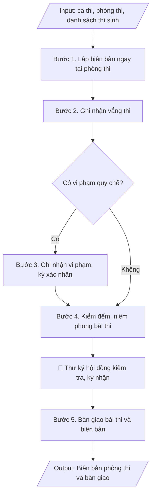

# Skill: Biên bản phòng thi & bàn giao bài thi

## Khi nào dùng
Khi kết thúc mỗi ca thi: cán bộ coi thi lập biên bản ghi nhận tình hình phòng thi
và bàn giao bài thi, giấy thi cho thư ký hội đồng.

## Đầu vào (Input)

| Trường | Mô tả | Bắt buộc |
|---|---|---|
| `ky_thi` | Tên kỳ thi | Có |
| `mon_thi` | Mã + tên học phần thi | Có |
| `ngay_thi` | Ngày, ca thi | Có |
| `phong_thi` | Số phòng thi | Có |
| `can_bo_coi_thi` | Họ tên 02 cán bộ coi thi | Có |
| `tong_so_thi_sinh` | Tổng số thí sinh theo danh sách | Có |
| `so_thi_sinh_du_thi` | Số thí sinh thực tế dự thi | Có |
| `so_thi_sinh_vang` | Số thí sinh vắng (kèm họ tên, MSSV nếu có) | Không |
| `vi_pham` | Các trường hợp vi phạm quy chế (nếu có): họ tên, MSSV, hình thức xử lý | Không |
| `so_bai_thi_ban_giao` | Số bài thi / túi bài thi bàn giao | Có |

## Quy trình

**Bước 1. Lập biên bản ngay tại phòng thi**
- Làm gì: Ngay sau khi thu bài xong tại phòng thi, cán bộ coi thi lập biên bản trên mẫu chuẩn của trường: ghi đầy đủ kỳ thi, mã + tên học phần, ngày thi, ca thi, số phòng thi, họ tên 02 cán bộ coi thi; ghi số liệu thí sinh theo 03 con số: tổng số theo danh sách (`tong_so_thi_sinh`), số thực tế dự thi (`so_thi_sinh_du_thi`), số vắng (đối chiếu với danh sách điểm danh).
- Dùng input: `ky_thi`, `mon_thi`, `ngay_thi`, `phong_thi`, `can_bo_coi_thi`, `tong_so_thi_sinh`, `so_thi_sinh_du_thi`.
- Vai trò: Cán bộ coi thi · AI hỗ trợ: điền sẵn thông tin ca thi vào mẫu biên bản trước giờ thi để đối chiếu tại chỗ · ⏱ ~15 phút (ước tính)
- Lưu ý nghiệp vụ: lập biên bản ngay tại phòng thi, không để về sau mới ghi lại từ trí nhớ; 03 con số thí sinh phải cộng khớp nhau (dự thi + vắng = tổng số).
- → Kết quả bước: Dự thảo biên bản phòng thi với đầy đủ thông tin ca thi và số liệu thí sinh.

**Bước 2. Ghi nhận vắng thi**
- Làm gì: Đối chiếu danh sách điểm danh, liệt kê vào biên bản từng thí sinh vắng: họ tên, MSSV; phân loại vắng có phép (có đơn xin phép/giấy tờ kèm theo) hay vắng không phép; đính kèm giấy tờ (nếu có) vào hồ sơ phòng thi.
- Dùng input: `so_thi_sinh_vang`.
- Vai trò: Cán bộ coi thi · AI hỗ trợ: đối chiếu chéo số liệu vắng thi với danh sách điểm danh, cảnh báo sai lệch · ⏱ ~10 phút (ước tính)
- Lưu ý nghiệp vụ: vắng có phép/không phép ảnh hưởng đến quyền dự thi lại của sinh viên — phải ghi đúng, đủ giấy tờ; không ghi tên thí sinh vắng theo trí nhớ mà phải đối chiếu danh sách điểm danh có chữ ký.
- → Kết quả bước: Danh sách thí sinh vắng thi đã phân loại, kèm trong biên bản phòng thi.

**Bước 3. Ghi nhận vi phạm**
- Làm gì: Nếu có vi phạm quy chế, mô tả cụ thể hành vi vi phạm, tang vật thu giữ, thời điểm phát hiện; áp dụng hình thức xử lý theo quy chế (khiển trách/cảnh cáo/đình chỉ thi); thí sinh vi phạm và 02 cán bộ coi thi cùng ký xác nhận vào biên bản (nếu thí sinh từ chối ký, ghi rõ "thí sinh từ chối ký" vào biên bản).
- Dùng input: `vi_pham`.
- Vai trò: Cán bộ coi thi (lập biên bản), thí sinh vi phạm (ký xác nhận) · AI hỗ trợ: chuẩn bị mẫu biên bản vi phạm và tra cứu quy chế xử lý đúng thẩm quyền · ⏱ ~10 phút (ước tính)
- Lưu ý nghiệp vụ: mức xử lý phải đúng thẩm quyền — cán bộ coi thi chỉ được khiển trách, cảnh cáo và đình chỉ phải báo trưởng ban chỉ đạo; biên bản vi phạm lập riêng, đính kèm biên bản phòng thi.
- → Kết quả bước: Biên bản ghi nhận vi phạm (nếu có) đã có chữ ký xác nhận.

**Bước 4. Kiểm đếm bài thi**
- Làm gì: Đếm số bài thi thực tế thu được, đối chiếu với số thí sinh dự thi (số bài = số thí sinh dự thi); kiểm tra mỗi bài thi có đủ thông tin (họ tên, MSSV, số tờ); cho toàn bộ bài thi vào túi, niêm phong, ghi số niêm phong vào biên bản.
- Dùng input: `so_thi_sinh_du_thi`, `so_bai_thi_ban_giao`.
- Vai trò: Cán bộ coi thi · AI hỗ trợ: đối chiếu số bài thu được với số thí sinh dự thi, cảnh báo thiếu/thừa ngay tại phòng · ⏱ ~15 phút (ước tính)
- Lưu ý nghiệp vụ: bẫy thường gặp — thiếu bài do thí sinh nộp 02 lần/kẹp nhầm bài; nếu số bài không khớp số thí sinh dự thi phải kiểm đếm lại ngay tại phòng, không mang túi bài chưa khớp đi bàn giao.
- → Kết quả bước: Túi bài thi đã niêm phong, số lượng khớp với số thí sinh dự thi.

**Bước 5. Bàn giao**
- Làm gì: Cán bộ coi thi mang túi bài thi đã niêm phong + biên bản phòng thi đến văn phòng hội đồng thi; cùng thư ký hội đồng kiểm tra tình trạng niêm phong còn nguyên vẹn, đối chiếu số lượng bài thi với biên bản; hai bên ký xác nhận vào biên bản bàn giao bài thi (lập thành 02 bản, mỗi bên giữ 01 bản).
- Dùng input: `so_bai_thi_ban_giao`, `can_bo_coi_thi`.
- Vai trò: Cán bộ coi thi (bên giao), Thư ký Hội đồng thi (bên nhận, kiểm tra niêm phong) · AI hỗ trợ: chuẩn bị mẫu biên bản bàn giao, đối chiếu số liệu bài thi với biên bản phòng thi · ⏱ ~20 phút (ước tính)
- Lưu ý nghiệp vụ: không bàn giao khi niêm phong bị rách/hở — phải lập biên bản ghi nhận ngay; thư ký hội đồng từ chối nhận nếu số liệu không khớp biên bản phòng thi.
- → Kết quả bước: Biên bản bàn giao bài thi đã ký hai bên + túi bài thi nhập kho hội đồng.

## Luồng quy trình (Workflow)


## Đầu ra (Output)
- Biên bản phòng thi hoàn chỉnh.
- Biên bản bàn giao bài thi (kèm theo).

**Cấu trúc output chuẩn:** 02 văn bản, mỗi văn bản gồm các phần bắt buộc theo đúng thứ tự:
A. Biên bản phòng thi:
1. Quốc hiệu – tiêu ngữ;
2. Tên biên bản (BIÊN BẢN PHÒNG THI);
3. Thông tin ca thi: kỳ thi, mã + tên học phần, ngày thi, ca thi, phòng thi, họ tên 02 cán bộ coi thi;
4. Số lượng thí sinh: theo danh sách – dự thi – vắng thi (kèm họ tên, MSSV thí sinh vắng, phân loại có phép/không phép);
5. Ghi nhận vi phạm quy chế (mô tả cụ thể hoặc ghi "Không có trường hợp vi phạm");
6. Số bài thi thu được, số túi niêm phong và số niêm phong;
7. Địa danh, ngày tháng năm lập biên bản;
8. Chữ ký của 02 cán bộ coi thi (ký, ghi rõ họ tên).
B. Biên bản bàn giao bài thi:
1. Quốc hiệu – tiêu ngữ;
2. Tên biên bản (BIÊN BẢN BÀN GIAO BÀI THI);
3. Thời gian, địa điểm bàn giao; thành phần bên giao (cán bộ coi thi) – bên nhận (thư ký hội đồng);
4. Nội dung bàn giao: số túi bài thi đã niêm phong (số niêm phong), số bài thi, học phần, ca thi, kèm 01 biên bản phòng thi; xác nhận túi bài thi còn nguyên niêm phong;
5. Chữ ký hai bên (ký, ghi rõ họ tên), lập thành 02 bản.

## Checklist nghiệm thu

- [ ] Đủ các phần theo "Cấu trúc output chuẩn": (A) Biên bản phòng thi: quốc hiệu – tiêu ngữ; tên biên bản; thông tin ca thi; số lượng thí sinh (danh sách – dự thi – vắng, kèm họ tên, MSSV thí sinh vắng, phân loại có phép/không phép); ghi nhận vi phạm; số bài thi thu được, số túi niêm phong và số niêm phong; địa danh, ngày tháng năm lập; chữ ký 02 cán bộ coi thi; (B) Biên bản bàn giao bài thi: quốc hiệu – tiêu ngữ; tên biên bản; thời gian, địa điểm, thành phần bên giao – bên nhận; nội dung bàn giao; chữ ký hai bên, lập thành 02 bản.
- [ ] 03 con số thí sinh cộng khớp nhau (dự thi + vắng = tổng số); số bài thi thực tế thu được = số thí sinh dự thi.
- [ ] Không bịa đặt số liệu thí sinh, bài thi, nội dung vi phạm.
- [ ] Đúng mẫu biên bản chuẩn của trường; biên bản vi phạm lập riêng, đính kèm biên bản phòng thi.
- [ ] Mức xử lý vi phạm đúng thẩm quyền theo quy chế thi: cán bộ coi thi chỉ được khiển trách; cảnh cáo và đình chỉ phải báo trưởng ban chỉ đạo.
- [ ] Đã qua Human gate: người có thẩm quyền theo quy trình đã duyệt.
- [ ] Biên bản được lập ngay tại phòng thi sau khi thu bài, không ghi lại từ trí nhớ sau.
- [ ] Túi bài thi còn nguyên niêm phong khi bàn giao; thư ký hội đồng đã kiểm tra và ký xác nhận (mỗi bên giữ 01 bản).
- [ ] Thí sinh vắng phân loại đúng có phép/không phép, có giấy tờ kèm theo; thí sinh vi phạm ký xác nhận (nếu từ chối ký đã ghi rõ "thí sinh từ chối ký").

Tiêu chí đạt = tất cả các ô được đánh dấu.

## Ví dụ mô phỏng (dữ liệu giả lập)

> Tất cả tên trường, cá nhân, số liệu dưới đây đều là **giả lập**, không liên quan tổ chức/cá nhân có thật.

### Input mẫu

| Trường | Giá trị |
|---|---|
| `ky_thi` | Thi kết thúc học phần học kỳ 1, năm học 2026–2027 |
| `mon_thi` | CNTT101 – Nhập môn lập trình |
| `ngay_thi` | 15/12/2026 – Ca sáng |
| `phong_thi` | A101 |
| `can_bo_coi_thi` | TS. Phạm Văn B, ThS. Bùi Thị B |
| `tong_so_thi_sinh` | 40 |
| `so_thi_sinh_du_thi` | 38 |
| `so_thi_sinh_vang` | 02 (MD20230115 – Đặng Văn C, MD20230122 – Phạm Thị Dung) |
| `vi_pham` | Không |
| `so_bai_thi_ban_giao` | 38 bài thi, 01 túi niêm phong |

### Output mẫu

```
CỘNG HÒA XÃ HỘI CHỦ NGHĨA VIỆT NAM
Độc lập – Tự do – Hạnh phúc

BIÊN BẢN PHÒNG THI

Kỳ thi: Thi kết thúc học phần học kỳ 1, năm học 2026–2027
Học phần: CNTT101 – Nhập môn lập trình
Ngày thi: 15/12/2026 – Ca sáng          Phòng thi: A101
Cán bộ coi thi 1: TS. Phạm Văn B    Cán bộ coi thi 2: ThS. Bùi Thị B

1. Số lượng thí sinh:
   - Theo danh sách: 40 thí sinh
   - Dự thi: 38 thí sinh
   - Vắng thi: 02 thí sinh (MD20230115 – Đặng Văn C; MD20230122 – Phạm Thị Dung),
     đều vắng không phép

2. Vi phạm quy chế: Không có trường hợp vi phạm.

3. Bài thi thu được: 38 bài, đựng trong 01 túi đã niêm phong (niêm phong số 128).

Thành phố C, ngày 15 tháng 12 năm 2026

Cán bộ coi thi 1          Cán bộ coi thi 2
   (ký, ghi rõ họ tên)       (ký, ghi rõ họ tên)
Phạm Văn B             Bùi Thị B
```

```
BIÊN BẢN BÀN GIAO BÀI THI

Hôm nay, ngày 15/12/2026, tại Văn phòng Hội đồng thi – Trường Đại học A,
chúng tôi gồm:
- Bên giao: TS. Phạm Văn B, ThS. Bùi Thị B (cán bộ coi thi phòng A101)
- Bên nhận: TS. Đỗ Thị C (Thư ký Hội đồng thi)

Nội dung bàn giao: 01 túi bài thi đã niêm phong (niêm phong số 128), gồm 38 bài thi
học phần CNTT101 – Nhập môn lập trình, ca sáng ngày 15/12/2026, kèm 01 biên bản
phòng thi. Túi bài thi còn nguyên niêm phong.

Biên bản lập thành 02 bản, mỗi bên giữ 01 bản.

Bên giao                Bên nhận
(ký, họ tên)            (ký, họ tên)
```

## Căn cứ & lưu ý
- Quy chế đào tạo trình độ đại học (Thông tư 08/2021/TT-BGDĐT); quy chế thi của Trường
  Đại học A (giả lập).
- Biên bản phải lập thành 02 bản, cán bộ coi thi và thư ký hội đồng cùng ký.
- Trường hợp có vi phạm: lập biên bản vi phạm riêng, thí sinh vi phạm phải ký xác nhận
  (nếu từ chối ký, ghi rõ vào biên bản).
- Không dùng tên thật của trường/cá nhân khi mô phỏng.
