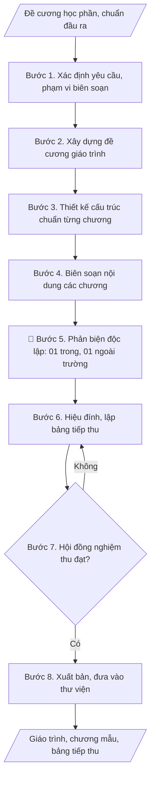

# Biên soạn giáo trình / bài giảng

## Định dạng và file đầu ra
Định dạng đầu ra có thể chọn theo sản phẩm/yêu cầu: .docx, .pdf, .pptx. Đọc mục “Định dạng bổ sung” trong quy cách đầu ra trước khi chọn.

**Phải tạo file thực tế để tải xuống, không chỉ trả nội dung trong chat.** Định dạng mặc định của skill: **.docx**. Nếu có bảng số liệu nghiệp vụ yêu cầu file bảng tính riêng, tạo thêm Excel theo yêu cầu; không tự tạo file kiểm tra. Không chờ người dùng yêu cầu xuất file lần nữa. Ưu tiên định dạng người dùng chỉ định; đọc quy tắc xuất file tại references/quy-cach-dau-ra.md.

## Quy cách đầu ra và thông tin thiếu
Khi dựng file Word/Excel, áp dụng mục “Thể thức và bảng biểu khi dựng file” trong quy cách đầu ra (cỡ chữ từng thành phần, bảng nhiều trang, số trang, phụ lục). Đọc [quy cách và cấu trúc sản phẩm](references/quy-cach-dau-ra.md) trước khi soạn/xuất. File giao chỉ gồm sản phẩm nghiệp vụ được yêu cầu; kiểm tra nội bộ không xuất kèm. Thiếu thông tin thì giữ nguyên trường/mục và chỗ điền theo mẫu gốc (dòng dấu chấm, dấu gạch hoặc ô trống); không tự điền dữ liệu mẫu, số 0, mã chờ xác minh hay dòng chờ ký. Mẫu chuyên ngành còn áp dụng được ưu tiên về cấu trúc, mã biểu và người ký. Bản đầy đủ: [quy tắc chung](references/quy-tac-chung.md).

Khi người dùng yêu cầu bộ slide (.pptx), đọc mục “Xuất PowerPoint (.pptx) khi được yêu cầu” trong quy cách đầu ra.

## Kiểm soát áp dụng và phê duyệt
Trước khi chạy, xác định `ngay_ap_dung`, `loai_hinh_truong`, `quy_che_noi_bo`, `nguon_du_lieu`, `nguoi_kiem_duyet`; chỉ hỏi thông tin liên quan nghiệp vụ, không dùng giá trị giả định thay dữ liệu bắt buộc. Đối chiếu căn cứ pháp lý với văn bản gốc, hiệu lực, điều khoản áp dụng và chuyển tiếp. Bản đầy đủ: [quy tắc chung](references/quy-tac-chung.md).

Nếu có cập nhật pháp lý dưới đây, đọc [căn cứ và điều kiện áp dụng](references/phap-ly.md) trước khi làm. Quy trình dưới đây giữ nghiệp vụ từ bản gốc; mọi viện dẫn văn bản, mẫu biểu, điều khoản phải theo căn cứ đã chọn trong phap-ly.md, không theo văn bản cũ.

## Giới hạn và human gate
AI hỗ trợ chuẩn bị và đối chiếu; cán bộ phụ trách kiểm tra dữ liệu/căn cứ, người có thẩm quyền duyệt và ký. Không đánh dấu đã ký, đã duyệt, đã công bố khi chưa có chứng cứ. Dữ liệu sinh viên, sức khỏe, nhân sự, tài chính chỉ dùng theo mục đích và phân quyền, che thông tin định danh khi dùng ví dụ (Luật 91/2025/QH15, hiệu lực 01/01/2026); không tải dữ liệu lên dịch vụ ngoài khi chưa có quyền. Bản đầy đủ: [quy tắc chung](references/quy-tac-chung.md).

## Khi nào dùng
Khi giảng viên được giao nhiệm vụ biên soạn giáo trình, bài giảng phục vụ giảng dạy
học phần (theo kế hoạch biên soạn của khoa/trường).

## Đầu vào (Input)
| Trường | Mô tả | Bắt buộc |
|---|---|---|
| `ten_giao_trinh` | Tên giáo trình / bài giảng | Có |
| `hoc_phan` | Mã + tên học phần sử dụng | Có |
| `tac_gia` | Họ tên, học hàm/học vị, đơn vị của tác giả/nhóm tác giả | Có |
| `de_cuong_hoc_phan` | Đề cương chi tiết học phần (mục tiêu, nội dung, CLO) | Có |
| `doi_tuong_su_dung` | Sinh viên năm mấy, ngành nào | Không |

## Quy trình
**Ràng buộc pháp lý khi thực hiện** (trích references/phap-ly.md; đối chiếu toàn văn và hiệu lực tại ngày nghiệp vụ):
- Luật 131/2025/QH15 sửa đổi sở hữu trí tuệ, hiệu lực 01/04/2026: Yêu cầu chủ thể quyền, nguồn tài trợ, hợp đồng và loại tài sản trí tuệ; đối chiếu sửa đổi 131/2025 theo thời điểm. Không mặc định quyền thuộc trường hay tác giả khi chưa có căn cứ; rà soát quyền sử dụng học liệu trước chia sẻ/chuyển giao.
- Trước Bước 1: chọn căn cứ theo đối tượng, loại hình trường và chuyển tiếp; lập bảng văn bản / điều khoản / lý do áp dụng / bằng chứng. Thiếu văn bản gốc hoặc điều khoản thì ghi nhận nội bộ [CẦN XÁC MINH] (không đưa vào file giao), để trống phần tương ứng, chưa kết luận tuân thủ.
- Các con số, thời hạn, số điều, số mức xếp loại, hệ số và mẫu biểu nêu trong các bước dưới đây được giữ từ quy trình gốc (trước cập nhật pháp lý); chỉ dùng khi đã đối chiếu đúng với căn cứ đã chọn, khác thì theo căn cứ. Danh sách điểm cần đối chiếu: docs/DIEM_CAN_DOI_CHIEU_PHAP_LY.md.

**Bước 1. Xác định yêu cầu và phạm vi biên soạn**
- Làm gì: Tiếp nhận nhiệm vụ biên soạn từ khoa/trường; đọc kỹ đề cương chi tiết học
  phần để nắm mục tiêu, nội dung, chuẩn đầu ra (CLO); xác định đối tượng sử dụng
  (sinh viên năm mấy, ngành nào); xác minh học hàm/học vị, đơn vị của tác giả/nhóm
  tác giả; kiểm tra học phần có nằm trong kế hoạch biên soạn đã phê duyệt không;
  lập tiến độ biên soạn theo các mốc (đề cương → bản thảo → phản biện → nghiệm thu → xuất bản).
- Dùng input: `ten_giao_trinh`, `hoc_phan`, `tac_gia`, `de_cuong_hoc_phan`, `doi_tuong_su_dung`
- Vai trò: Giảng viên biên soạn · AI hỗ trợ: lập bảng yêu cầu và tiến độ dự thảo từ Input, chủ biên kiểm tra · ⏱ 3–5 giờ (ước tính)
- Lưu ý nghiệp vụ: Tên giáo trình nên trùng/khớp với tên học phần để tránh nhầm lẫn
  khi kiểm định học liệu; nếu là nhóm tác giả, phải phân công rõ chương/phần cho từng
  người ngay từ đầu và ghi vào biên bản; kiểm tra đề cương học phần là bản mới nhất
  đã phê duyệt, không dùng bản nháp cũ.
- → Kết quả bước: Bảng yêu cầu biên soạn (tên giáo trình, học phần, tác giả/phân công,
  đối tượng sử dụng, tiến độ các mốc).

**Bước 2. Xây dựng đề cương giáo trình**
- Làm gì: Từ đề cương chi tiết học phần, chia nội dung thành các chương; quyết định
  số chương và dung lượng mỗi chương (số trang dự kiến); đối chiếu từng chương với CLO
  để đảm bảo mọi chuẩn đầu ra đều được ít nhất một chương "phủ"; xác định thời lượng
  giảng dạy tương ứng từng chương (tiết lý thuyết/bài tập); trình tổ bộ môn/khoa góp
  ý và chốt đề cương.
- Dùng input: `de_cuong_hoc_phan`
- Vai trò: Giảng viên biên soạn · AI hỗ trợ: đề xuất chia chương và bảng đối chiếu chương–CLO, tổ bộ môn/khoa góp ý và chốt đề cương · ⏱ 1–2 ngày làm việc (ước tính)
- Lưu ý nghiệp vụ: Mỗi CLO phải được gắn với ít nhất một chương — đây là điểm kiểm
  định học liệu hay soi nhất; dung lượng các chương nên cân đối, tránh chương đầu quá
  dài, chương cuối sơ sài; số chương của giáo trình không nhất thiết bằng số chương
  trong đề cương học phần, có thể gộp/tách cho hợp lý về sư phạm.
- → Kết quả bước: Đề cương giáo trình (danh sách chương, dung lượng, thời lượng,
  bảng đối chiếu chương – CLO).

**Bước 3. Thiết kế cấu trúc chuẩn cho từng chương**
- Làm gì: Quy định khung mục bắt buộc áp dụng thống nhất cho mọi chương: (1) Mục tiêu
  chương (gắn CLO); (2) Nội dung lý thuyết có ví dụ minh họa; (3) Ví dụ/bài tập mẫu
  có lời giải; (4) Câu hỏi ôn tập; (5) Bài tập cuối chương (phân 3 mức độ: nhận biết –
  thông hiểu – vận dụng); (6) Tài liệu tham khảo của chương. Thống nhất quy tắc trình
  bày: cách đánh số mục/ví dụ/hình/bảng, kiểu trích dẫn, thuật ngữ chuyên môn dùng
  xuyên suốt giáo trình.
- Dùng input: `de_cuong_hoc_phan`
- Vai trò: Giảng viên biên soạn · AI hỗ trợ: soạn khung cấu trúc chuẩn và quy tắc trình bày, nhóm tác giả thống nhất áp dụng · ⏱ 3–5 giờ (ước tính)
- Lưu ý nghiệp vụ: Thuật ngữ phải thống nhất từ chương 1 đến chương cuối — bẫy thường
  gặp là mỗi tác giả trong nhóm dùng một cách dịch khác nhau; quy ước một chuẩn trích
  dẫn duy nhất (VD: [số thứ tự] hoặc APA) và áp dụng cho toàn giáo trình.
- → Kết quả bước: Khung giáo trình hoàn chỉnh (mục lục chi tiết + cấu trúc chuẩn
  từng chương) — sản phẩm chính thứ nhất.

**Bước 4. Biên soạn nội dung các chương**
- Làm gì: Viết đầy đủ từng chương theo cấu trúc chuẩn đã chốt: diễn đạt sư phạm,
  mạch lạc; mỗi khái niệm mới kèm ví dụ minh họa cụ thể; mỗi chương có ít nhất 2–3
  bài tập mẫu có lời giải chi tiết; cập nhật kiến thức, công nghệ mới của chuyên ngành;
  trích dẫn đầy đủ nguồn tài liệu tham khảo; viết Lời nói đầu và Phụ lục (nếu có).
- Dùng input: khung giáo trình từ Bước 3 (các trường input đã được cụ thể hóa ở
  các bước trước)
- Vai trò: Giảng viên · AI hỗ trợ: hỗ trợ soạn dự thảo nội dung từng chương · ⏱ 2–4 tuần (tùy dung lượng) (ước tính)
- Lưu ý nghiệp vụ: Tôn trọng bản quyền — trích dẫn đầy đủ, không sao chép nguyên văn
  tài liệu có bản quyền; tránh "viết cho xong": mỗi chương nên được đọc lại sau ít nhất
  1–2 ngày để phát hiện lỗi logic; nếu nhóm tác giả, chủ biên phải đọc soát toàn bộ
  để thống nhất giọng văn.
- → Kết quả bước: Bản thảo toàn văn giáo trình + 01 chương mẫu viết đầy đủ theo
  cấu trúc chuẩn.

**Bước 5. Tổ chức phản biện độc lập**
- Làm gì: Mời ít nhất 02 phản biện độc lập (01 trong trường, 01 ngoài trường — ưu tiên
  người có chuyên môn sâu về học phần); gửi bản thảo kèm phiếu nhận xét phản biện
  (đánh giá: tính khoa học, tính sư phạm, tính cập nhật, hình thức); thu phiếu nhận
  xét, phân loại ý kiến (bắt buộc sửa / nên sửa / góp ý tham khảo).
- Dùng input: (không dùng trường input mới; xử lý trên bản thảo từ Bước 4)
- Vai trò: Giảng viên biên soạn · AI hỗ trợ: chuẩn bị dự thảo, tài liệu và số liệu phục vụ bước này · ⏱ 2–3 tuần (ước tính)
- Lưu ý nghiệp vụ: Phản biện ngoài trường không được là đồng tác giả/cộng sự thân
  thiết của nhóm biên soạn để đảm bảo tính độc lập; yêu cầu phản biện trả lời đúng
  hạn và ghi rõ ý kiến nào "bắt buộc" để tác giả không bỏ sót.
- → Kết quả bước: Phiếu nhận xét phản biện + danh sách ý kiến phản biện đã phân loại.

**Bước 6. Hiệu đính theo ý kiến phản biện, lập bảng tiếp thu**
- Làm gì: Tác giả sửa bản thảo theo từng ý kiến phản biện; với ý kiến không tiếp thu
  phải ghi rõ lý do; lập bảng tiếp thu ý kiến (cột: STT, ý kiến phản biện, tiếp thu
  của tác giả); đối chiếu lần cuối thuật ngữ, đánh số mục/ví dụ/hình/bảng, trích dẫn
  sau hiệu đính.
- Dùng input: (không dùng trường input mới; xử lý trên ý kiến phản biện từ Bước 5)
- Vai trò: Giảng viên biên soạn · AI hỗ trợ: hỗ trợ đối chiếu và lập bảng tiếp thu, tác giả sửa bản thảo theo ý kiến phản biện · ⏱ 3–5 ngày làm việc (ước tính)
- Lưu ý nghiệp vụ: Bảng tiếp thu là minh chứng bắt buộc trong hồ sơ nghiệm thu —
  không được bỏ trống cột "tiếp thu"; ý kiến "bắt buộc sửa" của phản biện mà không
  tiếp thu thì phải có lý do thuyết phục, nếu không hội đồng nghiệm thu sẽ trả hồ sơ về.
- → Kết quả bước: Bản thảo đã hiệu đính + Bảng tiếp thu ý kiến phản biện (mẫu) —
  sản phẩm chính thứ hai.

**Bước 7. Nghiệm thu tại hội đồng cấp trường**
- Làm gì: Nộp hồ sơ nghiệm thu (bản thảo, bảng tiếp thu, phiếu phản biện, đề cương
  học phần); hội đồng nghiệm thu cấp trường đánh giá theo tiêu chí (khoa học, sư phạm,
  cập nhật, hình thức); ghi biên bản nghiệm thu (đạt / đạt có sửa / không đạt); nếu
  "đạt có sửa", tác giả chỉnh sửa lần cuối theo kết luận hội đồng.
- Dùng input: (không dùng trường input mới; xử lý trên hồ sơ từ Bước 6)
- Vai trò: Hội đồng thẩm định · AI hỗ trợ: chuẩn bị dự thảo, tài liệu và số liệu phục vụ bước này · ⏱ 1–2 ngày làm việc (ước tính)
- Lưu ý nghiệp vụ: Kiểm tra đủ thành phần hồ sơ trước khi nộp — thiếu phiếu phản biện
  ngoài trường là lỗi hay gặp nhất khiến hồ sơ bị trả; giữ lại biên bản nghiệm thu vì
  đây là minh chứng tính giờ NCKH và kiểm định học liệu.
- → Kết quả bước: Biên bản nghiệm thu + bản thảo hoàn chỉnh sau chỉnh sửa lần cuối.

**Bước 8. Xuất bản, lưu hành và đưa vào thư viện**
- Làm gì: Đăng ký xuất bản (nhà xuất bản) hoặc lưu hành nội bộ theo quy định của
  trường; nộp bản lưu chiểu cho thư viện, đưa giáo trình vào danh mục học liệu của
  thư viện; thông báo cho bộ môn/khoa đưa vào danh mục học liệu của học phần; lập kế
  hoạch cập nhật, tái bản định kỳ (3–5 năm).
- Dùng input: `ten_giao_trinh`, `hoc_phan`
- Vai trò: Giảng viên biên soạn · AI hỗ trợ: chuẩn bị dự thảo, tài liệu và số liệu phục vụ bước này · ⏱ 2–4 tuần (ước tính)
- Lưu ý nghiệp vụ: Giáo trình chỉ được tính là "đã xuất bản" khi có giấy phép xuất
  bản hoặc quyết định lưu hành nội bộ — bản in thử không tính; cập nhật mã học liệu
  vào đề cương chi tiết học phần để phục vụ kiểm định.
- → Kết quả bước: Giáo trình đã xuất bản/lưu hành nội bộ + hồ sơ đưa vào danh mục
  học liệu thư viện.

## Luồng quy trình (Workflow)

## Đầu ra
- Khung giáo trình hoàn chỉnh (mục lục chi tiết + cấu trúc từng chương).
- Chương mẫu (01 chương viết đầy đủ theo cấu trúc chuẩn).
- Bảng tiếp thu ý kiến phản biện (mẫu).

File nghiệp vụ thực tế theo định dạng mặc định ở đầu skill hoặc định dạng người dùng yêu cầu, kèm liên kết tải trong phản hồi cuối.

Sản phẩm nghiệp vụ hoàn chỉnh theo [quy cách và cấu trúc](references/quy-cach-dau-ra.md), giữ các trường chưa có dữ liệu ở trạng thái trống. Không xuất kèm checklist/phụ lục kiểm tra đầu ra.

## Kiểm tra nội bộ trước khi giao
Các tiêu chí sau dùng để tự đối chiếu; không sao chép vào file xuất. Mục thiếu dữ liệu được để trống, không đánh dấu đã đạt hoặc đã duyệt.

- [ ] Đủ các phần và đúng bố cục theo cấu trúc tại references/quy-cach-dau-ra.md (không theo cấu trúc của bản gốc).
- [ ] Mọi CLO của đề cương học phần đều được ít nhất một chương "phủ" (có bảng đối chiếu chương–CLO).
- [ ] Mỗi chương có đúng 6 mục theo đúng thứ tự; thuật ngữ và quy ước trích dẫn thống nhất toàn giáo trình.
- [ ] Nội dung output khớp với Input (`ten_giao_trinh`, `hoc_phan`, `tac_gia`, `de_cuong_hoc_phan`).
- [ ] Không sao chép nguyên văn tài liệu có bản quyền; trích dẫn đầy đủ nguồn tài liệu tham khảo.
- [ ] Đúng thể thức trình bày: đánh số mục/ví dụ/hình/bảng liên tục, chính tả chuẩn.
- [ ] Đã qua Human gate: đủ phiếu phản biện (01 trong trường, 01 ngoài trường) và biên bản nghiệm thu của hội đồng cấp trường.
- [ ] Bảng tiếp thu ý kiến phản biện đầy đủ cột "tiếp thu"; ý kiến "bắt buộc sửa" không tiếp thu đã có lý do thuyết phục.
- [ ] Hồ sơ nghiệm thu đầy đủ thành phần (bản thảo, bảng tiếp thu, phiếu phản biện, đề cương học phần).

## Căn cứ & lưu ý
- Quy định về biên soạn, lựa chọn, thẩm định giáo trình đại học của Trường
  Đại học A (giả lập).
- Tôn trọng quyền sở hữu trí tuệ: trích dẫn đầy đủ nguồn; không sao chép nội dung
  có bản quyền khi số hóa, xuất bản.
- Giáo trình nghiệm thu đạt được tính giờ NCKH và là minh chứng cho tiêu chí
  về học liệu trong kiểm định.
- Không dùng tên thật của trường/cá nhân khi mô phỏng.

## Tư liệu đối chiếu
Bản gốc trước cập nhật pháp lý (kèm ví dụ giả lập) lưu tại `references/quy-trinh-lich-su.md`, chỉ để đối chiếu hồ sơ lịch sử; không dùng căn cứ, mẫu hay số liệu trong đó làm chỉ dẫn hiện hành.

## Quản trị phiên bản
- Phiên bản gói `1.3.2` (cập nhật 2026-10-10); hồ sơ đầy đủ tại [references/version.json](references/version.json).
- Người phê duyệt nghiệp vụ: **chưa chỉ định**. Trạng thái: dự thảo nghiệp vụ; kiểm tra pháp lý trước thực thi. Ngày cập nhật không đồng nghĩa mọi văn bản đã được rà soát toàn văn.
- Giấy phép theo LICENSE của kho (bản quyền CES Global). Lịch sử thay đổi: CHANGELOG.md.
