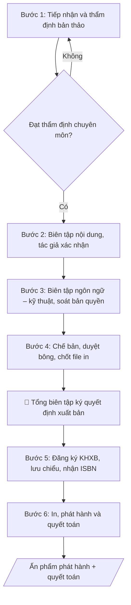

# Biên tập & xuất bản ấn phẩm

## Quy cách đầu ra và thông tin thiếu

Đọc [quy cách và cấu trúc sản phẩm](references/quy-cach-dau-ra.md) trước khi soạn/xuất. File giao chỉ gồm văn bản hoặc sản phẩm nghiệp vụ được yêu cầu; kiểm tra nội bộ không xuất kèm. Thiếu thông tin giữ nguyên trường/mục và chỗ điền theo mẫu gốc (dòng dấu chấm, dấu gạch hoặc ô trống); không tự điền dữ liệu mẫu, số 0, mã chờ xác minh hoặc dòng chờ ký. Mẫu chuyên ngành còn áp dụng được ưu tiên về cấu trúc, mã biểu và người ký. Các trường “bắt buộc” là điều kiện hoàn thiện hồ sơ, không ngăn việc soạn bản có chỗ chừa để điền. Mọi chỉ dẫn “để trống” trong skill được hiểu là không điền dữ liệu và giữ cách chừa chỗ của mẫu gốc, không phải xóa dấu chấm của mẫu.

## Kiểm soát áp dụng và phê duyệt

Trước khi chạy quy trình, xác định `ngay_ap_dung`, `loai_hinh_truong`, `quy_che_noi_bo`, `nguon_du_lieu` và `nguoi_kiem_duyet`. Chỉ yêu cầu thông tin có liên quan đến nghiệp vụ; không dùng giá trị giả định thay dữ liệu bắt buộc. Đối chiếu nội bộ hồ sơ có yếu tố pháp lý với văn bản gốc, hiệu lực, điều khoản áp dụng và chuyển tiếp; không tự đính kèm bảng kiểm tra vào file giao.

## Giới hạn và human gate

AI hỗ trợ chuẩn bị và đối chiếu. Cán bộ phụ trách kiểm tra dữ liệu/căn cứ, người có thẩm quyền duyệt và ký. Văn bản soạn chưa được coi là đã ban hành; không tự chèn nhãn trạng thái kiểm duyệt vào file giao; không đánh dấu đã ký, đã duyệt hoặc đã công bố nếu chưa có chứng cứ. Dữ liệu sinh viên, sức khỏe, nhân sự và tài chính phải hạn chế theo mục đích, phân quyền và che thông tin định danh khi dùng ví dụ. Không tải dữ liệu lên dịch vụ ngoài khi chưa có quyền. Kiểm tra Luật 91/2025/QH15 về bảo vệ dữ liệu cá nhân (hiệu lực 01/01/2026) và quy định áp dụng trước xử lý/chia sẻ dữ liệu cá nhân.

## Khi nào dùng
Khi trường (qua Nhà xuất bản hoặc ban biên tập) xuất bản giáo trình, sách chuyên khảo, kỷ yếu
hội thảo, tài liệu nội bộ: cần quy trình từ bản thảo đến sách in hoàn chỉnh, đúng quy định
xuất bản.

## Đầu vào (Input)

| Trường | Mô tả | Bắt buộc |
|---|---|---|
| `ten_an_pham` | Tên ấn phẩm, loại (giáo trình/sách chuyên khảo/kỷ yếu/tài liệu) | Có |
| `tac_gia` | Tác giả/chủ biên, đơn vị | Có |
| `ban_thao` | File bản thảo, số trang dự kiến | Có |
| `so_luong_in` | Số lượng bản in dự kiến | Có |
| `muc_dich` | Xuất bản thương mại / nội bộ / lưu hành nội bộ | Có |
| `thoi_han` | Thời hạn phát hành mong muốn | Không |

## Quy trình

**Bước 1. Tiếp nhận và thẩm định bản thảo**
- Làm gì: đối chiếu file bản thảo nhận được với thông tin `ten_an_pham`, `tac_gia` (tên tác giả/chủ biên, đơn vị) và số trang dự kiến trong `ban_thao`; kiểm tra tính mới của đề tài (đối chiếu danh mục ấn phẩm NXB/trường đã xuất bản 5 năm gần nhất), chạy kiểm tra trùng lặp/đạo văn sơ bộ; xác minh mục đích xuất bản (`muc_dich`) phù hợp tôn chỉ, chức năng của NXB/trường; với giáo trình, sách chuyên khảo thì chuyển hội đồng thẩm định gồm ít nhất 02 phản biện độc lập.
- Dùng input: `ten_an_pham`, `tac_gia`, `ban_thao`, `muc_dich`.
- Vai trò: Hội đồng biên tập · AI hỗ trợ: đối chiếu hồ sơ và kiểm tra trùng lặp/đạo văn sơ bộ · ⏱ 3–5 ngày làm việc (ước tính)
- Lưu ý nghiệp vụ: bản thảo giáo trình bắt buộc qua hội đồng thẩm định; mục đích "lưu hành nội bộ" thì thủ tục đơn giản hơn (không bắt buộc ISBN nhưng vẫn phải đăng ký kế hoạch xuất bản). Bẫy: tác giả gửi bản thảo chưa hoàn chỉnh (thiếu chương, thiếu hình) — phải yêu cầu bổ sung trước khi thẩm định, tránh thẩm định trên bản thảo dở.
- → Kết quả bước: phiếu tiếp nhận bản thảo + biên bản thẩm định (đạt/không đạt, nhận xét cần sửa của từng phản biện).

**Bước 2. Biên tập nội dung (tác giả xác nhận)**
- Làm gì: biên tập viên đọc toàn văn bản thảo, hiệu đính cấu trúc chương mục, thống nhất thuật ngữ chuyên ngành, kiểm tra trích dẫn và tài liệu tham khảo (đủ nguồn, đúng chuẩn trích dẫn), rà soát tính nhất quán số liệu/bảng biểu giữa các chương; lập "phiếu yêu cầu sửa" gửi tác giả; tác giả sửa và ký xác nhận vào bản biên tập.
- Dùng input: `ban_thao`, `tac_gia`.
- Vai trò: Biên tập viên · AI hỗ trợ: hỗ trợ kiểm tra trích dẫn, thống nhất thuật ngữ; biên tập viên biên tập, tác giả sửa và ký xác nhận · ⏱ 5–10 ngày làm việc (ước tính)
- Lưu ý nghiệp vụ: mọi thay đổi nội dung chuyên môn (thêm/bớt chương, đổi kết luận khoa học) phải có chữ ký xác nhận của tác giả/chủ biên — biên tập viên không tự ý sửa nội dung chuyên môn. Bẫy: thuật ngữ dịch không thống nhất (lúc dịch, lúc để nguyên tiếng Anh) — phải lập bảng thuật ngữ thống nhất ngay từ đầu.
- → Kết quả bước: bản thảo đã biên tập nội dung có chữ ký xác nhận của tác giả + bảng thuật ngữ thống nhất.

**Bước 3. Biên tập ngôn ngữ – kỹ thuật và soát bản quyền**
- Làm gì: soát chính tả, ngữ pháp, dấu câu toàn văn (ít nhất 2 lượt độc lập: biên tập viên + người soát chéo); chuẩn hóa định dạng (font, cỡ chữ, heading, đánh số bảng/hình); kiểm tra chất lượng hình ảnh (độ phân giải in ≥ 300dpi); xác minh bản quyền từng hình/bảng trích từ nguồn khác (có văn bản cho phép sử dụng hoặc ghi nguồn đúng quy định); lập danh sách lỗi kỹ thuật phân loại theo mức (chính tả / định dạng / bản quyền).
- Dùng input: `ban_thao` (bản đã qua biên tập nội dung ở Bước 2).
- Vai trò: Biên tập viên · AI hỗ trợ: soát chính tả, ngữ pháp, định dạng; biên tập viên xác minh bản quyền hình/bảng trích nguồn · ⏱ 3–5 ngày làm việc (ước tính)
- Lưu ý nghiệp vụ: hình ảnh lấy từ internet không rõ nguồn thì buộc thay thế hoặc xin phép bằng văn bản — đây là điểm hay bị "lọt" nhất. Không chuyển sang chế bản khi còn lỗi bản quyền chưa xử lý.
- → Kết quả bước: danh sách lỗi kỹ thuật đã xử lý xong + bản thảo sạch sẵn sàng chế bản.

**Bước 4. Chế bản, duyệt bông, chốt file in**
- Làm gì: dàn trang theo khổ sách đã duyệt; thiết kế bìa (bìa 1, bìa 4, gáy sách) theo nhận diện của NXB/trường; in bông (bản in thử) gửi tác giả duyệt — tác giả ký xác nhận từng trang hoặc ghi chú sửa; biên tập viên đối chiếu bông với bản thảo sạch (số trang chẵn, trang trắng, mục lục khớp số trang); chốt file in (PDF chuẩn in).
- Dùng input: `ten_an_pham`, `ban_thao` (bản sạch), `so_luong_in` (để chọn khổ giấy, định lượng).
- Vai trò: Biên tập viên · AI hỗ trợ: phòng chế bản dàn trang và đối chiếu bông với bản thảo sạch (AI hỗ trợ kiểm tra số trang, mục lục), tác giả ký duyệt bông · ⏱ 3–5 ngày làm việc (ước tính)
- Lưu ý nghiệp vụ: sau khi tác giả duyệt bông, mọi sửa chữa đều phát sinh chi phí chế bản lại — phải chốt bằng văn bản nguyên tắc "không sửa nội dung sau duyệt bông".
- → Kết quả bước: file in hoàn chỉnh (PDF chuẩn in) + bông có chữ ký duyệt của tác giả + mẫu bìa đã duyệt.

**Bước 5. Ký quyết định xuất bản và làm thủ tục (KHXB, lưu chiểu, ISBN)**
- Làm gì: trình Tổng biên tập/Giám đốc NXB ký quyết định xuất bản dựa trên hồ sơ (biên bản thẩm định, bản duyệt bông, file in) — human gate; đăng ký kế hoạch xuất bản với cơ quan quản lý; nộp lưu chiểu theo quy định; đăng ký ISBN (đối với xuất bản thương mại qua NXB có giấy phép); lưu số quyết định, số ISBN vào hồ sơ ấn phẩm.
- Dùng input: `muc_dich` (quyết định có cần ISBN hay không), `thoi_han` (sắp xếp thời điểm nộp hồ sơ).
- Vai trò: Tổng biên tập · AI hỗ trợ: chuẩn bị dự thảo, tài liệu và số liệu phục vụ bước này · ⏱ 5–10 ngày làm việc (ước tính)
- Lưu ý nghiệp vụ: KHÔNG được in trước khi có quyết định xuất bản và hoàn tất đăng ký — in trước là vi phạm Luật Xuất bản. Ấn phẩm "lưu hành nội bộ" vẫn phải đăng ký kế hoạch xuất bản nhưng không bắt buộc ISBN.
- → Kết quả bước: quyết định xuất bản đã ký + giấy xác nhận đăng ký KHXB/lưu chiểu + số ISBN (nếu có).

**Bước 6. In, phát hành và quyết toán**
- Làm gì: lựa chọn nhà in (đấu thầu/chỉ định theo quy định), ký hợp đồng in đúng `so_luong_in`; giám sát in thử, kiểm tra chất lượng bản in đại trà (màu sắc, đóng gáy, cắt xén), lập biên bản nghiệm thu in; phát hành theo kênh đã duyệt (thư viện, nhà sách, nội bộ) kèm phiếu xuất kho; đối chiếu số lượng in – phát hành – tồn kho; quyết toán chi phí (biên tập, chế bản, in, phát hành) so với dự toán.
- Dùng input: `so_luong_in`, `muc_dich`, `thoi_han`.
- Vai trò: Biên tập viên · AI hỗ trợ: soạn dự thảo văn bản trình ký, kiểm tra thể thức · ⏱ 10–20 ngày làm việc (ước tính)
- Lưu ý nghiệp vụ: giữ lại tối thiểu 02 bản lưu chiểu + bản lưu tại NXB; chênh lệch số lượng in so với quyết định xuất bản phải được phê duyệt bổ sung. Bẫy: nhà in giao thiếu/sai màu — phải nghiệm thu từng lô trước khi thanh toán.
- → Kết quả bước: biên bản nghiệm thu in + phiếu xuất kho phát hành + báo cáo quyết toán.

## Luồng quy trình (Workflow)

## Đầu ra

Sản phẩm nghiệp vụ hoàn chỉnh theo [quy cách và cấu trúc](references/quy-cach-dau-ra.md), giữ các trường chưa có dữ liệu ở trạng thái trống. Không xuất kèm checklist/phụ lục kiểm tra đầu ra.

## Kiểm tra nội bộ trước khi giao

- [ ] Bố cục khớp mẫu áp dụng và cấu trúc tại references/quy-cach-dau-ra.md.
- [ ] Nội dung khớp với Input: tên ấn phẩm, tác giả, số trang, số lượng in, mục đích xuất bản, thời hạn.
- [ ] Không bịa đặt số liệu, minh chứng, trích dẫn.
- [ ] Bảng tiến độ đúng định dạng (Giai đoạn | Nội dung công việc | Thời hạn | Đơn vị/Người phụ trách) và đúng thứ tự các giai đoạn.
- [ ] Căn cứ pháp lý đầy đủ, còn hiệu lực (Luật Xuất bản 2012 sửa đổi, quy định xuất bản giáo trình của Bộ GD&ĐT).
- [ ] Đã qua Human gate: hội đồng thẩm định kết luận đạt, Tổng biên tập/Giám đốc NXB ký quyết định xuất bản, tác giả xác nhận bản biên tập và bông.
- [ ] Không in trước khi có quyết định xuất bản và hoàn tất đăng ký KHXB/lưu chiểu; có số ISBN nếu xuất bản thương mại.
- [ ] Bản quyền hình/bảng trích nguồn đã xác minh (văn bản cho phép sử dụng hoặc ghi nguồn đúng quy định); không còn lỗi bản quyền chưa xử lý.
- [ ] Mọi thay đổi nội dung chuyên môn có chữ ký xác nhận của tác giả/chủ biên; chốt nguyên tắc không sửa nội dung sau duyệt bông.

Tiêu chí đạt = tất cả các ô được đánh dấu.

## Human gate
- **Hội đồng thẩm định** quyết định bản thảo có đủ điều kiện xuất bản.
- **Tổng biên tập/Giám đốc NXB** ký quyết định xuất bản và duyệt bông cuối.
- **Tác giả/chủ biên** xác nhận bản biên tập và bản in thử.

## Giới hạn
- AI không thay hội đồng thẩm định đánh giá chất lượng khoa học của bản thảo.
- Không xuất bản nội dung vi phạm bản quyền, đạo văn chưa xử lý.

## Căn cứ & lưu ý
- Luật Xuất bản 2012 (sửa đổi); quy định về xuất bản giáo trình của Bộ GD&ĐT.
- Không dùng tên thật của trường/ấn phẩm/cá nhân khi mô phỏng.

## Quản trị phiên bản

- Phiên bản gói: `1.2.1`; ngày cập nhật: `2026-10-10`.
- Kho nguồn: https://github.com/phamtruong91/university-skills-framework
- Người duy trì trên GitHub: `phamtruong91` (Phạm Văn Trường). Người phê duyệt nghiệp vụ: **chưa chỉ định**.
- Commit nguồn trước cập nhật: `346719e6b0318ed034b4b016703f79733aa575e7`. Commit chứa phiên bản này xem bằng `git log -1 -- skills/bien-tap-xuat-ban-an-pham`; không tự gán SHA chưa tạo.
- Giấy phép: theo LICENSE của kho; bản quyền CES Global.
- Lịch sử 1.1.0: bổ sung metadata giao diện, kiểm soát áp dụng, quản trị phiên bản.
- Trạng thái: dự thảo nghiệp vụ; kiểm tra pháp lý trước thực thi. Ngày cập nhật không đồng nghĩa mọi văn bản đã được rà soát toàn văn.
