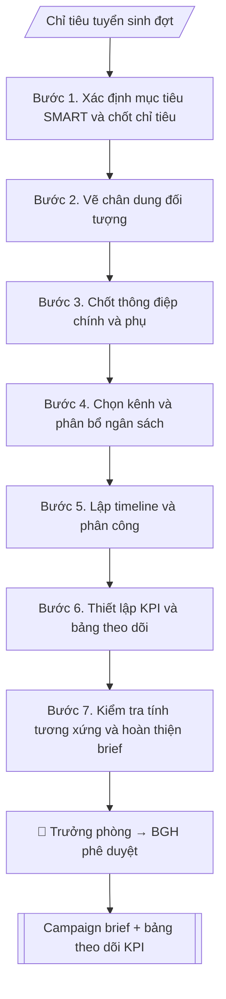

# Campaign brief tuyển sinh

## Định dạng và file đầu ra

Định dạng đầu ra có thể chọn theo sản phẩm/yêu cầu: .docx, .pdf, .pptx. Đọc mục “Định dạng bổ sung” trong quy cách đầu ra trước khi chọn.

**Phải tạo file thực tế để tải xuống, không chỉ trả nội dung trong chat.** Định dạng mặc định của skill: **.docx**. Nếu có bảng số liệu nghiệp vụ yêu cầu file bảng tính riêng, tạo thêm Excel theo yêu cầu; không tự tạo file kiểm tra. Không chờ người dùng yêu cầu xuất file lần nữa. Ưu tiên định dạng người dùng chỉ định; đọc quy tắc xuất file tại references/quy-cach-dau-ra.md.

## Quy cách đầu ra và thông tin thiếu
Đọc [quy cách và cấu trúc sản phẩm](references/quy-cach-dau-ra.md) trước khi soạn/xuất. File giao chỉ gồm sản phẩm nghiệp vụ được yêu cầu; kiểm tra nội bộ không xuất kèm. Thiếu thông tin thì giữ nguyên trường/mục và chỗ điền theo mẫu gốc (dòng dấu chấm, dấu gạch hoặc ô trống); không tự điền dữ liệu mẫu, số 0, mã chờ xác minh hay dòng chờ ký. Mẫu chuyên ngành còn áp dụng được ưu tiên về cấu trúc, mã biểu và người ký. Bản đầy đủ: [quy tắc chung](references/quy-tac-chung.md).

## Kiểm soát áp dụng và phê duyệt
Trước khi chạy, xác định `ngay_ap_dung`, `loai_hinh_truong`, `quy_che_noi_bo`, `nguon_du_lieu`, `nguoi_kiem_duyet`; chỉ hỏi thông tin liên quan nghiệp vụ, không dùng giá trị giả định thay dữ liệu bắt buộc. Đối chiếu căn cứ pháp lý với văn bản gốc, hiệu lực, điều khoản áp dụng và chuyển tiếp. Bản đầy đủ: [quy tắc chung](references/quy-tac-chung.md).

## Giới hạn và human gate
AI hỗ trợ chuẩn bị và đối chiếu; cán bộ phụ trách kiểm tra dữ liệu/căn cứ, người có thẩm quyền duyệt và ký. Không đánh dấu đã ký, đã duyệt, đã công bố khi chưa có chứng cứ. Dữ liệu sinh viên, sức khỏe, nhân sự, tài chính chỉ dùng theo mục đích và phân quyền, che thông tin định danh khi dùng ví dụ (Luật 91/2025/QH15, hiệu lực 01/01/2026); không tải dữ liệu lên dịch vụ ngoài khi chưa có quyền. Bản đầy đủ: [quy tắc chung](references/quy-tac-chung.md).

## Khi nào dùng
Trước mỗi đợt chiến dịch tuyển sinh (mở đợt, cao điểm, xét tuyển bổ sung...), khi cần một bản
brief thống nhất để cả nhóm triển khai và trình lãnh đạo phê duyệt.

## Đầu vào (Input)

| Trường | Mô tả | Bắt buộc |
|---|---|---|
| `ten_chien_dich` | Tên chiến dịch/đợt | Có |
| `thoi_gian` | Thời gian chạy chiến dịch | Có |
| `muc_tieu` | Mục tiêu cụ thể, đo được (lead, hồ sơ, nhập học) | Có |
| `doi_tuong` | Chân dung đối tượng (học sinh lớp 12 khu vực nào, phụ huynh...) | Có |
| `thong_diep` | Thông điệp chính + thông điệp phụ | Có |
| `kenh` | Kênh triển khai (paid + owned + earned) | Có |
| `ngan_sach` | Ngân sách dự kiến theo kênh | Có |
| `kpi` | KPI theo kênh và tổng | Có |

## Quy trình

**Bước 1. Xác định mục tiêu SMART và chốt chỉ tiêu**
- Làm gì: chuyển `muc_tieu` thành mục tiêu SMART (cụ thể, đo được, khả thi, liên quan, có thời hạn), gắn với chỉ tiêu tuyển sinh của đợt; chốt con số cuối (VD: 3.000 hồ sơ đợt 1) và mốc thời gian đo.
- Dùng input: `muc_tieu`, `thoi_gian`.
- Vai trò: Trưởng phòng Truyền thông – Tuyển sinh · AI hỗ trợ: xử lý sơ bộ, tổng hợp · ⏱ ~1–2 giờ (ước tính)
- Lưu ý nghiệp vụ: mục tiêu phải bám chỉ tiêu tuyển sinh đã được duyệt; tránh mục tiêu mơ hồ kiểu "tăng nhận biết" mà không đo được.
- → Kết quả bước: Mục tiêu SMART đã chốt (con số + thời hạn đo).

**Bước 2. Vẽ chân dung đối tượng**
- Làm gì: từ `doi_tuong`, mô tả chi tiết từng nhóm: học sinh lớp 12 ở khu vực nào, dùng kênh nào hằng ngày, quan tâm điều gì khi chọn trường; phụ huynh: mối bận tâm (học phí, đầu ra, xa nhà).
- Dùng input: `doi_tuong`.
- Vai trò: Chuyên viên Phòng Truyền thông – Tuyển sinh · AI hỗ trợ: xử lý sơ bộ, tổng hợp · ⏱ ~30–90 phút (ước tính)
- Lưu ý nghiệp vụ: chân dung càng cụ thể thì chọn kênh và thông điệp càng trúng; tách riêng học sinh và phụ huynh vì mối quan tâm khác nhau.
- → Kết quả bước: Bảng chân dung đối tượng (nhóm – đặc điểm – kênh hay dùng – mối quan tâm).

**Bước 3. Chốt thông điệp chính và thông điệp phụ**
- Làm gì: từ `thong_diep`, chốt 1 thông điệp chính (≤ 12 từ, dễ nhớ) + 2–3 thông điệp phụ; kiểm tra từng thông điệp có bằng chứng/số liệu trong đề án tuyển sinh không; rà soát theo brand voice trẻ trung, học thuật.
- Dùng input: `thong_diep`.
- Vai trò: Trưởng phòng Truyền thông – Tuyển sinh · AI hỗ trợ: đối chiếu tự động, cảnh báo sai lệch · ⏱ ~1–2 giờ (ước tính)
- Lưu ý nghiệp vụ: không đưa thông điệp sai lệch so với đề án tuyển sinh đã ban hành; mỗi thông điệp phụ phải có số liệu chứng minh.
- → Kết quả bước: Bộ thông điệp đã chốt (1 chính + 2–3 phụ, kèm bằng chứng).

**Bước 4. Chọn kênh và phân bổ ngân sách**
- Làm gì: từ `kenh`, liệt kê kênh paid/owned/earned; ưu tiên kênh có tỉ lệ chuyển đổi tốt từ các đợt trước; phân bổ `ngan_sach` theo từng kênh (số tiền cụ thể); ghi vai trò của từng kênh trong phễu.
- Dùng input: `kenh`, `ngan_sach` + bộ thông điệp (Bước 3).
- Vai trò: Chuyên viên Phòng Truyền thông – Tuyển sinh · AI hỗ trợ: xử lý sơ bộ, tổng hợp · ⏱ ~1–2 giờ (ước tính)
- Lưu ý nghiệp vụ: tổng phân bổ phải khớp 100% ngân sách được duyệt; không cam kết ngân sách vượt thẩm quyền.
- → Kết quả bước: Bảng kênh – ngân sách – vai trò (tổng khớp ngân sách duyệt).

**Bước 5. Lập timeline và phân công**
- Làm gì: chia 4 pha: chuẩn bị → chạy → cao điểm → tổng kết; gắn từng mốc vào `thoi_gian`; mỗi mốc ghi công việc, người phụ trách, sản phẩm bàn giao; đối chiếu timeline với lịch tuyển sinh chung của Bộ/trường.
- Dùng input: `thoi_gian` + bảng kênh – ngân sách (Bước 4).
- Vai trò: Chuyên viên Phòng Truyền thông – Tuyển sinh · AI hỗ trợ: đối chiếu tự động, cảnh báo sai lệch · ⏱ ~30–60 phút (ước tính)
- Lưu ý nghiệp vụ: mốc cao điểm phải trùng giai đoạn thí sinh quyết định (sau thi tốt nghiệp THPT); để dự phòng 5–7 ngày cho phê duyệt nội dung.
- → Kết quả bước: Timeline chi tiết (mốc – công việc – phụ trách – bàn giao).

**Bước 6. Thiết lập KPI và bảng theo dõi**
- Làm gì: từ `kpi`, chốt KPI tổng và KPI từng kênh; thiết kế bảng theo dõi hằng tuần (tuần – KPI kế hoạch – thực tế – chênh lệch – hành động); quy định ngưỡng cảnh báo (VD: đạt < 70% kế hoạch tuần → họp rà soát).
- Dùng input: `kpi` + mục tiêu SMART (Bước 1).
- Vai trò: Chuyên viên Phòng Truyền thông – Tuyển sinh · AI hỗ trợ: đối chiếu tự động, cảnh báo sai lệch, lập bảng biểu, định dạng · ⏱ ~30–60 phút (ước tính)
- Lưu ý nghiệp vụ: KPI phải đo được hằng tuần bằng dữ liệu thực (lead, hồ sơ), không dùng chỉ số cảm tính.
- → Kết quả bước: Bộ KPI đã chốt + mẫu bảng theo dõi hằng tuần.

**Bước 7. Kiểm tra tính tương xứng và hoàn thiện brief**
- Làm gì: kiểm tra tam giác mục tiêu – ngân sách – KPI có tương xứng không (ngân sách có đủ để đạt KPI không); rà soát toàn bộ brief: thông điệp bám đề án, timeline khớp lịch chung; tổng hợp thành văn bản brief hoàn chỉnh.
- Dùng input: toàn bộ bán thành phẩm Bước 1–6.
- Vai trò: Chuyên viên Phòng Truyền thông – Tuyển sinh · AI hỗ trợ: tổng hợp, chuẩn hóa dữ liệu, đối chiếu tự động, cảnh báo sai lệch · ⏱ ~1–2 giờ (ước tính)
- Lưu ý nghiệp vụ: nếu ngân sách không đủ đạt KPI thì hoặc giảm mục tiêu hoặc xin bổ sung — không để brief "thiếu tiền mà đòi kết quả".
- → Kết quả bước: Campaign brief hoàn chỉnh (sẵn sàng trình duyệt).

## Luồng quy trình (Workflow)

## Đầu ra

File nghiệp vụ thực tế theo định dạng mặc định ở đầu skill hoặc định dạng người dùng yêu cầu, kèm liên kết tải trong phản hồi cuối.

Sản phẩm nghiệp vụ hoàn chỉnh theo [quy cách và cấu trúc](references/quy-cach-dau-ra.md), giữ các trường chưa có dữ liệu ở trạng thái trống. Không xuất kèm checklist/phụ lục kiểm tra đầu ra.

## Kiểm tra nội bộ trước khi giao

- [ ] Bố cục khớp mẫu áp dụng và cấu trúc tại references/quy-cach-dau-ra.md.
- [ ] Có đầy đủ sản phẩm: Campaign brief hoàn chỉnh: mục tiêu, đối tượng, thông điệp, kênh, ngân sách,…
- [ ] Có đầy đủ sản phẩm: Bảng theo dõi KPI hằng tuần (mẫu)
- [ ] Mọi số liệu, tên, ngày tháng trong output khớp với Input đã cung cấp (không thêm bớt, không suy đoán)
- [ ] Không bịa đặt số liệu, minh chứng, trích dẫn hay căn cứ
- [ ] Đúng thể thức, định dạng văn bản theo quy định hiện hành
- [ ] Căn cứ pháp lý nêu đầy đủ, còn hiệu lực tại thời điểm lập
- [ ] Đã qua Human gate: người có thẩm quyền đã kiểm tra/ký duyệt trước khi phát hành
- [ ] Mục tiêu phải bám chỉ tiêu tuyển sinh đã được duyệt
- [ ] Chân dung càng cụ thể thì chọn kênh và thông điệp càng trúng

> Tiêu chí đạt: tất cả các ô đều được đánh dấu.

## Human gate (người kiểm duyệt)
- Trưởng phòng duyệt brief trước khi trình.
- Ban Giám hiệu phê duyệt ngân sách chiến dịch.
- Không chạy chiến dịch khi chưa được phê duyệt.

## Giới hạn (guardrails)
- Không tự chạy quảng cáo, tự chi ngân sách.
- Không cam kết ngân sách vượt thẩm quyền.
- Không đưa thông điệp sai lệch so với đề án tuyển sinh đã ban hành.
- Không dùng hình ảnh, KOLs không rõ bản quyền/thỏa thuận.

## Căn cứ & lưu ý
- Brief phải bám đề án tuyển sinh và lịch tuyển sinh của Bộ GD&ĐT.
- Brand voice: trẻ trung, học thuật.
- Không dùng tên thật của trường/cá nhân khi mô phỏng.

## Quản trị phiên bản
- Phiên bản gói `1.3.2` (cập nhật 2026-10-10); hồ sơ đầy đủ tại [references/version.json](references/version.json).
- Người phê duyệt nghiệp vụ: **chưa chỉ định**. Trạng thái: dự thảo nghiệp vụ; kiểm tra pháp lý trước thực thi. Ngày cập nhật không đồng nghĩa mọi văn bản đã được rà soát toàn văn.
- Giấy phép theo LICENSE của kho (bản quyền CES Global). Lịch sử thay đổi: CHANGELOG.md.
