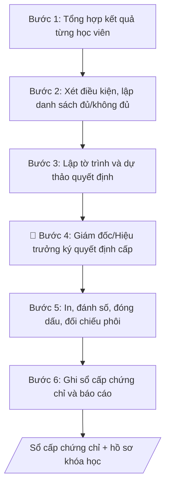

# Cấp chứng chỉ đào tạo liên tục

## Kiểm soát áp dụng và phê duyệt

Trước khi chạy quy trình, xác định `ngay_ap_dung`, `loai_hinh_truong`, `quy_che_noi_bo`, `nguon_du_lieu` và `nguoi_kiem_duyet`. Chỉ yêu cầu thông tin có liên quan đến nghiệp vụ; không dùng giá trị giả định thay dữ liệu bắt buộc. Hồ sơ có yếu tố pháp lý phải kèm văn bản gốc, tình trạng hiệu lực, điều khoản áp dụng và chuyển tiếp.

## Giới hạn và human gate

AI hỗ trợ chuẩn bị và đối chiếu. Cán bộ phụ trách kiểm tra dữ liệu/căn cứ, người có thẩm quyền duyệt và ký. Mọi đầu ra mặc định là **DỰ THẢO – CHỜ KIỂM DUYỆT**; không đánh dấu đã ký, đã duyệt hoặc đã công bố nếu chưa có chứng cứ. Dữ liệu sinh viên, sức khỏe, nhân sự và tài chính phải hạn chế theo mục đích, phân quyền và che thông tin định danh khi dùng ví dụ. Không tải dữ liệu lên dịch vụ ngoài khi chưa có quyền. Kiểm tra Luật 91/2025/QH15 về bảo vệ dữ liệu cá nhân (hiệu lực 01/01/2026) và quy định áp dụng trước xử lý/chia sẻ dữ liệu cá nhân.


## Khi nào dùng
Khi khóa bồi dưỡng ngắn hạn kết thúc: xét điều kiện hoàn thành của từng học viên,
trình cấp chứng chỉ, ghi sổ và quản lý phôi chứng chỉ.

## Đầu vào (Input)

| Trường | Mô tả | Bắt buộc |
|---|---|---|
| `ten_khoa` | Tên khóa học, thời gian tổ chức | Có |
| `danh_sach_hv` | Danh sách học viên: họ tên, ngày sinh, kết quả (chuyên cần, điểm) | Có |
| `dieu_kien_cap` | Điều kiện cấp chứng chỉ của khóa học | Có |
| `mau_chung_chi` | Mẫu chứng chỉ áp dụng | Có |
| `so_phoi` | Số phôi chứng chỉ cấp phát cho đợt này | Có |

## Quy trình

**Bước 1. Tổng hợp kết quả từng học viên**
- Làm gì: thu thập từ hồ sơ khóa học: bảng điểm danh/chuyên cần từng buổi và bảng điểm đánh giá (bài tập/kiểm tra); tính tỷ lệ chuyên cần (%) và điểm tổng kết cho từng học viên trong `danh_sach_hv`; đánh dấu các trường hợp số liệu thiếu/khuyết (nghỉ có phép, bỏ thi) để xác minh với phụ trách khóa học trước khi xét.
- Dùng input: `ten_khoa`, `danh_sach_hv`.
- Vai trò: Cán bộ Trung tâm · AI hỗ trợ: tổng hợp bảng kết quả và tính tỷ lệ chuyên cần/điểm, phụ trách khóa học xác minh các trường hợp số liệu thiếu · ⏱ 2–4 giờ (ước tính)
- Lưu ý nghiệp vụ: số liệu phải lấy từ hồ sơ gốc (bảng điểm danh có chữ ký, bài thi đã chấm) — không dùng số liệu "nhớ" của giảng viên. Trường hợp đặc biệt (ốm đau có giấy xác nhận) phải có biên bản xử lý riêng, không tự cộng điểm chuyên cần.
- → Kết quả bước: bảng tổng hợp kết quả từng học viên (họ tên, ngày sinh, chuyên cần %, điểm).

**Bước 2. Xét điều kiện và lập danh sách đủ/không đủ**
- Làm gì: đối chiếu từng học viên với `dieu_kien_cap` đã công bố (ngưỡng chuyên cần, ngưỡng điểm); lập 2 danh sách: đủ điều kiện (ghi rõ số hiệu phôi dự kiến cho từng người) và không đủ điều kiện (ghi rõ lý do từng người: nghỉ quá số buổi / không đạt điểm); phụ trách khóa học ký xác nhận cả 2 danh sách.
- Dùng input: `dieu_kien_cap` (+ bảng tổng hợp ở Bước 1).
- Vai trò: Giám đốc Trung tâm · AI hỗ trợ: đối chiếu từng học viên với điều kiện cấp và lập 2 danh sách dự thảo, phụ trách khóa học ký xác nhận · ⏱ 1–2 giờ (ước tính)
- Lưu ý nghiệp vụ: điều kiện xét phải ĐÚNG điều kiện đã công bố khi chiêu sinh — không được nâng/hạ chuẩn sau khi khóa học kết thúc. Học viên khiếu nại thì giải quyết dứt điểm trước khi trình cấp, không để danh sách "treo".
- → Kết quả bước: danh sách đủ điều kiện (kèm dải số hiệu dự kiến) + danh sách không đủ điều kiện (kèm lý do từng người), có chữ ký phụ trách khóa học.

**Bước 3. Lập tờ trình và dự thảo quyết định**
- Làm gì: soạn tờ trình gửi Giám đốc Trung tâm/Hiệu trưởng: thông tin khóa học (`ten_khoa`, thời gian, sĩ số), căn cứ điều kiện cấp đã công bố, kết quả xét (số đủ/không đủ điều kiện + lý do tóm tắt); soạn dự thảo quyết định cấp chứng chỉ theo `mau_chung_chi` (phần căn cứ, điều khoản, dải số hiệu); đính kèm danh sách học viên.
- Dùng input: `ten_khoa`, `mau_chung_chi` (+ 2 danh sách ở Bước 2).
- Vai trò: Giám đốc Trung tâm · AI hỗ trợ: soạn dự thảo tờ trình và quyết định theo mẫu · ⏱ 1–2 giờ (ước tính)
- Lưu ý nghiệp vụ: dải số hiệu trong quyết định phải khớp với `so_phoi` được cấp phát — lệch 1 số cũng phải giải trình. Tờ trình phải nêu cả số không đủ điều kiện để người ký nắm toàn cảnh.
- → Kết quả bước: tờ trình + dự thảo quyết định + danh sách học viên kèm theo, sẵn sàng trình ký.

**Bước 4. Trình ký quyết định (human gate)**
- Làm gì: trình Giám đốc Trung tâm/Hiệu trưởng ký quyết định cấp chứng chỉ; nếu người ký yêu cầu xác minh thêm (VD: trường hợp giáp ranh ngưỡng), quay lại Bước 2 bổ sung minh chứng; nhận quyết định đã ký, đóng số văn bản, lưu hồ sơ.
- Dùng input: hồ sơ tờ trình ở Bước 3.
- Vai trò: Giám đốc Trung tâm · AI hỗ trợ: soạn dự thảo văn bản trình ký, kiểm tra thể thức · ⏱ 1–3 ngày làm việc (chờ lịch ký) (ước tính)
- Lưu ý nghiệp vụ: chỉ in chứng chỉ SAU khi quyết định đã ký — in trước là sai quy trình và phát sinh rủi ro thừa/thiếu phôi.
- → Kết quả bước: quyết định cấp chứng chỉ đã ký, đóng dấu.

**Bước 5. In, đánh số và cấp phát chứng chỉ**
- Làm gì: in chứng chỉ theo `mau_chung_chi`, điền thông tin từng học viên, đánh số hiệu liên tục theo dải đã duyệt; trình ký, đóng dấu; đối chiếu số phôi đã dùng với `so_phoi` (đã dùng / hỏng / còn lại — phôi hỏng phải lưu lại, không được vứt bỏ); phát chứng chỉ cho học viên (ký nhận) hoặc gửi theo địa chỉ đã đăng ký.
- Dùng input: `mau_chung_chi`, `so_phoi` (+ quyết định đã ký ở Bước 4, danh sách ở Bước 2).
- Vai trò: Giám đốc Trung tâm · AI hỗ trợ: hỗ trợ kiểm tra chính tả và đối chiếu số hiệu · ⏱ 1–2 ngày làm việc (ước tính)
- Lưu ý nghiệp vụ: kiểm tra chính tả họ tên, ngày sinh trên từng chứng chỉ trước khi trình ký — sai 1 dấu cũng phải in lại, tuyệt đối không tẩy xóa. Phôi trắng tuyệt đối không để lọt ra ngoài; mất phôi phải lập biên bản ngay.
- → Kết quả bước: chứng chỉ đã ký, đóng dấu, cấp phát có ký nhận + biên bản đối chiếu phôi.

**Bước 6. Ghi sổ cấp chứng chỉ và báo cáo**
- Làm gì: ghi từng chứng chỉ vào sổ cấp chứng chỉ: số hiệu, họ tên, ngày sinh, tên khóa, ngày cấp; lưu hồ sơ khóa học (quyết định, danh sách, bảng điểm, biên bản đối chiếu phôi); tổng hợp báo cáo số chứng chỉ đã cấp trong kỳ gửi đơn vị quản lý.
- Dùng input: `ten_khoa` (+ kết quả Bước 5).
- Vai trò: Cán bộ Trung tâm · AI hỗ trợ: hỗ trợ điền số liệu vào biểu mẫu sổ số · ⏱ 2–3 giờ (ước tính)
- Lưu ý nghiệp vụ: sổ cấp chứng chỉ là căn cứ pháp lý khi xác minh văn bằng — ghi chép phải đầy đủ, không tẩy xóa; nên có bản số (scan) dự phòng. Số liệu báo cáo kỳ phải khớp với sổ.
- → Kết quả bước: sổ cấp chứng chỉ đã cập nhật + báo cáo số chứng chỉ đã cấp trong kỳ.

## Luồng quy trình (Workflow)


## Đầu ra (Output)
- Tờ trình + Quyết định cấp chứng chỉ kèm danh sách học viên.
- Sổ cấp chứng chỉ (số hiệu, thông tin, ngày cấp).

**Cấu trúc output chuẩn** (sản phẩm chính: Tờ trình + Quyết định cấp chứng chỉ):
1. Phần Tờ trình:
   - Tiêu đề hành chính: tên trường + tên trung tâm, quốc hiệu, số hiệu văn bản, địa danh và ngày ban hành.
   - Tên văn bản: "TỜ TRÌNH — Về việc cấp chứng chỉ khóa bồi dưỡng ngắn hạn".
   - Kính gửi: Giám đốc Trung tâm (hoặc Hiệu trưởng).
   - Nội dung: thông tin khóa học (tên khóa, thời gian, sĩ số); căn cứ điều kiện cấp chứng chỉ đã công bố; kết quả xét (số học viên đủ điều kiện + số không đủ điều kiện kèm lý do tóm tắt).
   - Đề nghị xem xét, ký quyết định; người lập ký tên.
2. Phần Quyết định (dự thảo):
   - Tên văn bản: "QUYẾT ĐỊNH — Về việc cấp chứng chỉ bồi dưỡng ngắn hạn".
   - Căn cứ ban hành.
   - Điều 1: cấp chứng chỉ cho N học viên có tên trong danh sách kèm theo (ghi rõ dải số hiệu phôi).
   - Điều 2: hiệu lực thi hành; chữ ký người có thẩm quyền.
3. Danh sách học viên kèm theo: bảng gồm các cột STT | Họ tên | Ngày sinh | Số hiệu chứng chỉ.

## Checklist nghiệm thu

- [ ] Đủ 3 phần của "Cấu trúc output chuẩn": Tờ trình, Quyết định (dự thảo), Danh sách học viên kèm theo.
- [ ] Số học viên và kết quả xét trong quyết định khớp với Input (`danh_sach_hv`, `dieu_kien_cap`).
- [ ] Dải số hiệu chứng chỉ trong quyết định khớp 100% với số phôi được cấp phát (`so_phoi`).
- [ ] Không bịa đặt số liệu, kết quả đánh giá học viên, số hiệu chứng chỉ.
- [ ] Đúng thể thức hành chính: tiêu đề, số hiệu, ngày tháng, chữ ký, đóng dấu.
- [ ] Đã qua Human gate: Giám đốc Trung tâm/Hiệu trưởng đã ký quyết định.
- [ ] Chỉ cấp chứng chỉ cho học viên đủ điều kiện theo đúng điều kiện đã công bố khi chiêu sinh.
- [ ] Biên bản đối chiếu phôi đầy đủ (đã dùng / hỏng / còn lại); phôi hỏng được lưu lại, không vứt bỏ.
- [ ] Họ tên, ngày sinh trên từng chứng chỉ chính xác, không tẩy xóa.
- [ ] Sổ cấp chứng chỉ đã ghi đầy đủ, không tẩy xóa; số liệu báo cáo kỳ khớp với sổ.

Tiêu chí đạt = tất cả các ô được đánh dấu.

## Ví dụ mô phỏng (dữ liệu giả lập)

> Tất cả tên trường, cá nhân, số liệu dưới đây đều là **giả lập**, không liên quan tổ chức/cá nhân có thật.

### Input mẫu

| Trường | Giá trị |
|---|---|
| `ten_khoa` | Ứng dụng AI trong công việc văn phòng — Khóa 1/2027 (12/01–30/01/2027) |
| `danh_sach_hv` | 38 học viên; 35 đạt (chuyên cần ≥80%, điểm ≥5), 03 không đạt (02 nghỉ quá số buổi, 01 điểm 4) |
| `dieu_kien_cap` | Chuyên cần ≥80%, bài tập thực hành ≥5/10 |
| `mau_chung_chi` | CC-ĐTLT-2027 |
| `so_phoi` | 40 phôi (số hiệu ĐHA-CC-2027-001 đến 040) |

### Output mẫu

```
TRƯỜNG ĐẠI HỌC A            CỘNG HÒA XÃ HỘI CHỦ NGHĨA VIỆT NAM
TRUNG TÂM ĐÀO TẠO LIÊN TỤC               Độc lập – Tự do – Hạnh phúc
      Số: 08/TTr-ĐHA-ĐTLT
                                                 Thành phố C, ngày 05 tháng 02 năm 2027

                          TỜ TRÌNH
         Về việc cấp chứng chỉ khóa bồi dưỡng ngắn hạn

Kính gửi: Giám đốc Trung tâm Đào tạo liên tục

Khóa bồi dưỡng "Ứng dụng AI trong công việc văn phòng — Khóa 1/2027" đã kết thúc
ngày 30/01/2027 với 38 học viên tham dự. Căn cứ điều kiện cấp chứng chỉ đã công bố
(chuyên cần ≥80%, bài tập ≥5/10), kết quả xét như sau:
- Đủ điều kiện cấp chứng chỉ: 35 học viên (danh sách kèm theo).
- Không đủ điều kiện: 03 học viên (02 nghỉ quá số buổi quy định, 01 không đạt điểm).

Kính trình Giám đốc xem xét, ký Quyết định cấp chứng chỉ cho 35 học viên có tên
trong danh sách./.

                                              NGƯỜI LẬP
                                          (phụ trách khóa học)

                                          ThS. Trần Thị C
---
                        QUYẾT ĐỊNH (dự thảo)
         Về việc cấp chứng chỉ bồi dưỡng ngắn hạn

GIÁM ĐỐC TRUNG TÂM ĐÀO TẠO LIÊN TỤC – TRƯỜNG ĐẠI HỌC A

Căn cứ Quy chế đào tạo liên tục, bồi dưỡng ngắn hạn của Trường Đại học A;
Căn cứ kết quả khóa bồi dưỡng "Ứng dụng AI trong công việc văn phòng — Khóa 1/2027";

QUYẾT ĐỊNH:

Điều 1. Cấp chứng chỉ "Ứng dụng AI trong công việc văn phòng" cho 35 học viên
có tên trong danh sách kèm theo (số hiệu ĐHA-CC-2027-001 đến 035).
Điều 2. Quyết định có hiệu lực kể từ ngày ký.

Nơi nhận:                                          GIÁM ĐỐC TRUNG TÂM
- Phòng Đào tạo (lưu);                                 (ký, đóng dấu)
- Lưu: VT, ĐTLT.

DANH SÁCH HỌC VIÊN ĐƯỢC CẤP CHỨNG CHỈ (kèm theo Quyết định; trích 3 dòng mẫu)

| STT | Họ tên (giả lập) | Ngày sinh (giả lập) | Số hiệu chứng chỉ |
|-----|------------------|---------------------|-------------------|
| 1 | Nguyễn Văn Hùng | 12/03/1990 | ĐHA-CC-2027-001 |
| 2 | Trần Thị Lan | 25/07/1988 | ĐHA-CC-2027-002 |
| 3 | Lê Đức Minh | 08/11/1995 | ĐHA-CC-2027-003 |
| ... | (32 học viên còn lại) | ... | ĐHA-CC-2027-004 đến 035 |
```

## Human gate
- Phụ trách khóa học lập danh sách; Giám đốc Trung tâm ký quyết định cấp.
- Đối chiếu số phôi sử dụng với sổ quản lý phôi (kế toán/văn thư).

## Giới hạn
- Tuyệt đối không cấp chứng chỉ cho người không đủ điều kiện hoặc không tham dự khóa học.
- Không sửa thông tin trên chứng chỉ sau khi đã ký; sai sót phải thu hồi và cấp lại theo quy trình.
- Không để lộ/lọt phôi chứng chỉ trắng; mất phôi phải lập biên bản ngay.

## Căn cứ & lưu ý
- Quy định về mẫu, in, quản lý và cấp chứng chỉ đào tạo, bồi dưỡng của Bộ GD&ĐT và của trường.
- Không dùng tên thật của trường/cá nhân khi mô phỏng.

## Quản trị phiên bản

- Phiên bản gói: `1.1.0`; ngày cập nhật: `2026-10-09`.
- Kho nguồn: https://github.com/phamtruong91/dh-skills
- Người duy trì trên GitHub: `phamtruong91` (Phạm Văn Trường). Người phê duyệt nghiệp vụ: **chưa chỉ định**.
- Commit nguồn trước cập nhật: `78fd1d51b8acd1a724d9b9af6c488460bc7551ad`. Commit chứa phiên bản này xem bằng `git log -1 -- skills/cap-chung-chi-dao-tao-lien-tuc`; không tự gán SHA chưa tạo.
- Giấy phép: theo LICENSE của kho; bản quyền CES Global.
- Lịch sử 1.1.0: bổ sung metadata giao diện, kiểm soát áp dụng, quản trị phiên bản.
- Trạng thái: dự thảo nghiệp vụ; kiểm tra pháp lý trước thực thi. Ngày cập nhật không đồng nghĩa mọi văn bản đã được rà soát toàn văn.
