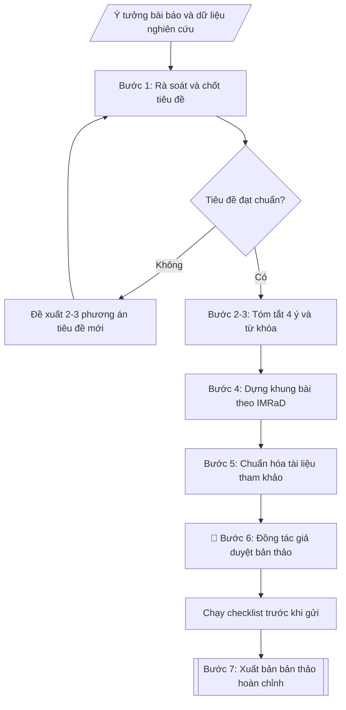

# Cấu trúc bài báo khoa học

## Định dạng và file đầu ra

Định dạng đầu ra có thể chọn theo sản phẩm/yêu cầu: .docx, .pdf, .tex, .bib, .md. Đọc mục “Định dạng bổ sung” trong quy cách đầu ra trước khi chọn.

**Phải tạo file thực tế để tải xuống, không chỉ trả nội dung trong chat.** Định dạng mặc định của skill: **.docx**. Nếu có bảng số liệu nghiệp vụ yêu cầu file bảng tính riêng, tạo thêm Excel theo yêu cầu; không tự tạo file kiểm tra. Không chờ người dùng yêu cầu xuất file lần nữa. Ưu tiên định dạng người dùng chỉ định; đọc quy tắc xuất file tại references/quy-cach-dau-ra.md.

## Quy cách đầu ra và thông tin thiếu

Đọc [quy cách và cấu trúc sản phẩm](references/quy-cach-dau-ra.md) trước khi soạn/xuất. File giao chỉ gồm văn bản hoặc sản phẩm nghiệp vụ được yêu cầu; kiểm tra nội bộ không xuất kèm. Thiếu thông tin giữ nguyên trường/mục và chỗ điền theo mẫu gốc (dòng dấu chấm, dấu gạch hoặc ô trống); không tự điền dữ liệu mẫu, số 0, mã chờ xác minh hoặc dòng chờ ký. Mẫu chuyên ngành còn áp dụng được ưu tiên về cấu trúc, mã biểu và người ký. Các trường “bắt buộc” là điều kiện hoàn thiện hồ sơ, không ngăn việc soạn bản có chỗ chừa để điền. Mọi chỉ dẫn “để trống” trong skill được hiểu là không điền dữ liệu và giữ cách chừa chỗ của mẫu gốc, không phải xóa dấu chấm của mẫu.

## Kiểm soát áp dụng và phê duyệt

Trước khi chạy quy trình, xác định `ngay_ap_dung`, `loai_hinh_truong`, `quy_che_noi_bo`, `nguon_du_lieu` và `nguoi_kiem_duyet`. Chỉ yêu cầu thông tin có liên quan đến nghiệp vụ; không dùng giá trị giả định thay dữ liệu bắt buộc. Đối chiếu nội bộ hồ sơ có yếu tố pháp lý với văn bản gốc, hiệu lực, điều khoản áp dụng và chuyển tiếp; không tự đính kèm bảng kiểm tra vào file giao.

## Giới hạn và human gate

AI hỗ trợ chuẩn bị và đối chiếu. Cán bộ phụ trách kiểm tra dữ liệu/căn cứ, người có thẩm quyền duyệt và ký. Văn bản soạn chưa được coi là đã ban hành; không tự chèn nhãn trạng thái kiểm duyệt vào file giao; không đánh dấu đã ký, đã duyệt hoặc đã công bố nếu chưa có chứng cứ. Dữ liệu sinh viên, sức khỏe, nhân sự và tài chính phải hạn chế theo mục đích, phân quyền và che thông tin định danh khi dùng ví dụ. Không tải dữ liệu lên dịch vụ ngoài khi chưa có quyền. Kiểm tra Luật 91/2025/QH15 về bảo vệ dữ liệu cá nhân (hiệu lực 01/01/2026) và quy định áp dụng trước xử lý/chia sẻ dữ liệu cá nhân.

## Khi nào dùng
Khi giảng viên, nghiên cứu sinh, học viên cao học cần dàn ý và hoàn thiện bản thảo
bài báo khoa học gửi tạp chí: từ tiêu đề, tóm tắt, các mục nội dung (đặt vấn đề,
phương pháp, kết quả, thảo luận, kết luận) đến tài liệu tham khảo và kiểm tra
lần cuối trước khi nộp.

## Đầu vào (Input)

| Trường | Mô tả | Bắt buộc |
|---|---|---|
| `ten_bai_bao` | Tên bài báo (có thể là tên dự kiến, sẽ góp ý chỉnh sửa) | Có |
| `tac_gia` | Danh sách tác giả, đơn vị công tác, tác giả liên hệ | Có |
| `tap_chi_muc_tieu` | Tạp chí dự kiến gửi (yêu cầu về độ dài, định dạng trích dẫn nếu biết) | Không |
| `tom_tat_du_kien` | Ý chính của tóm tắt: mục tiêu, phương pháp chính, kết quả nổi bật, kết luận | Có |
| `tu_khoa` | 3–6 từ khóa dự kiến | Không |
| `dat_van_de` | Bối cảnh nghiên cứu, khoảng trống tri thức, mục tiêu nghiên cứu | Có |
| `phuong_phap` | Đối tượng, dữ liệu, phương pháp/công cụ nghiên cứu | Có |
| `ket_qua` | Kết quả chính, số liệu, bảng biểu/hình minh họa dự kiến | Có |
| `thao_luan` | So sánh với nghiên cứu khác, giải thích, hạn chế của nghiên cứu | Không |
| `ket_luan` | Kết luận chính và hướng nghiên cứu tiếp theo | Có |
| `tai_lieu_tham_khao` | Danh sách tài liệu tham khảo thô (chưa chuẩn định dạng) | Không |

## Quy trình

**Bước 1. Rà soát và chốt tiêu đề**
- Làm gì: đánh giá `ten_bai_bao` theo 3 tiêu chí: ngắn gọn (thường ≤15–20 từ), nêu rõ đối tượng + phương pháp/yếu tố mới, không dùng từ ngữ chung chung; nếu chưa đạt thì đề xuất 2–3 phương án thay thế và chốt 01 tiêu đề chính.
- Dùng input: `ten_bai_bao`, `ket_qua` (để trích con số nổi bật đưa vào tiêu đề nếu phù hợp).
- Vai trò: Tác giả · AI hỗ trợ: đề xuất 2–3 phương án · ⏱ ~30–45 phút (ước tính)
- Lưu ý nghiệp vụ: tiêu đề có con số kết quả nổi bật (VD: "độ chính xác 94,2%") tăng khả năng được chú ý nhưng phải trung thực với nội dung bài; tránh tiêu đề dạng câu hỏi hoặc quá "kêu" không phản ánh nội dung.
- → Kết quả bước: tiêu đề đã chốt + 2–3 phương án dự phòng.

**Bước 2. Soạn tóm tắt (abstract)**
- Làm gì: từ `tom_tat_du_kien` viết tóm tắt theo cấu trúc 4 ý: (1) bối cảnh/mục tiêu; (2) phương pháp chính; (3) kết quả chính có số liệu; (4) kết luận/ý nghĩa; kiểm tra độ dài theo yêu cầu của `tap_chi_muc_tieu` (thường 150–250 từ — đếm từ trước khi chốt).
- Dùng input: `tom_tat_du_kien`, `tap_chi_muc_tieu`, `ket_qua`.
- Vai trò: Tác giả · AI hỗ trợ: soạn tóm tắt 4 ý · ⏱ ~30–60 phút (ước tính)
- Lưu ý nghiệp vụ: tóm tắt là phần duy nhất mà nhiều người đọc — mỗi ý viết 2–3 câu, không trích dẫn tài liệu trong tóm tắt; số liệu kết quả phải khớp với mục Kết quả của bài.
- → Kết quả bước: tóm tắt hoàn chỉnh (đủ 4 ý, đúng giới hạn từ của tạp chí).

**Bước 3. Chuẩn hóa từ khóa**
- Làm gì: từ `tu_khoa` chọn 3–6 từ khóa phản ánh đúng nội dung bài; ưu tiên thuật ngữ chuyên ngành phổ biến để tăng khả năng được tìm thấy trên các cơ sở dữ liệu học thuật.
- Dùng input: `tu_khoa`, kết quả bước 1.
- Vai trò: Tác giả · AI hỗ trợ: chuẩn hoá · ⏱ ~15–20 phút (ước tính)
- Lưu ý nghiệp vụ: tránh từ khóa quá chung chung hoặc từ chỉ nội bộ nhóm nghiên cứu dùng; kiểm tra các từ khóa đã xuất hiện trong tiêu đề/tóm tắt.
- → Kết quả bước: danh mục 3–6 từ khóa đã chuẩn hóa.

**Bước 4. Dựng khung bài báo theo IMRaD**
- Làm gì: từ `dat_van_de`, `phuong_phap`, `ket_qua`, `thao_luan`, `ket_luan` dựng dàn ý chi tiết 5 mục: (1) Đặt vấn đề: bối cảnh, tổng quan ngắn, khoảng trống nghiên cứu, mục tiêu; (2) Phương pháp: đối tượng/dữ liệu, quy trình, công cụ phân tích — đủ chi tiết để người khác có thể lặp lại; (3) Kết quả: trình bày khách quan theo logic, liệt kê bảng/hình dự kiến với chú thích đầy đủ; (4) Thảo luận: diễn giải kết quả, so sánh với nghiên cứu khác, nêu hạn chế; (5) Kết luận: trả lời mục tiêu, đóng góp mới, hướng nghiên cứu tiếp theo.
- Dùng input: `dat_van_de`, `phuong_phap`, `ket_qua`, `thao_luan`, `ket_luan`.
- Vai trò: Tác giả · AI hỗ trợ: dựng dàn ý IMRaD · ⏱ ~1–2 giờ (ước tính)
- Lưu ý nghiệp vụ: nguyên tắc "mỗi mục một việc" — mục Kết quả chỉ trình bày số liệu, không diễn giải (diễn giải để dành cho Thảo luận); Kết luận phải trả lời đúng các mục tiêu đã nêu ở Đặt vấn đề, không kết luận điều chưa nghiên cứu.
- → Kết quả bước: dàn ý chi tiết 5 mục IMRaD với gợi ý nội dung cần viết cho từng mục.

**Bước 5. Chuẩn hóa tài liệu tham khảo**
- Làm gì: từ `tai_lieu_tham_khao` định dạng lại từng tài liệu theo kiểu trích dẫn mà `tap_chi_muc_tieu` yêu cầu (APA/IEEE/Vancouver...); đối chiếu chéo: mỗi trích dẫn trong bài phải có trong danh mục và ngược lại; sắp xếp danh mục theo đúng quy tắc của kiểu trích dẫn.
- Dùng input: `tai_lieu_tham_khao`, `tap_chi_muc_tieu`.
- Vai trò: Tác giả · AI hỗ trợ: định dạng và đối chiếu chéo trích dẫn · ⏱ ~45–60 phút (ước tính, tùy số lượng trích dẫn)
- Lưu ý nghiệp vụ: lỗi phổ biến — trích dẫn trong bài không có trong danh mục (và ngược lại), sai năm xuất bản, thiếu số trang; ưu tiên tài liệu 5 năm gần nhất và tạp chí có uy tín.
- → Kết quả bước: danh mục tài liệu tham khảo đã chuẩn hóa + bảng đối chiếu trích dẫn trong bài.

**Bước 6. Đồng tác giả duyệt và chạy checklist**
- Làm gì: gửi bản thảo cho các đồng tác giả trong `tac_gia` duyệt (nội dung, thứ tự tác giả, tác giả liên hệ); chạy checklist trước khi gửi tạp chí: tiêu đề, tóm tắt, từ khóa, đủ 5 mục IMRaD, bảng/hình có số thứ tự và chú thích đầy đủ, tài liệu tham khảo đúng định dạng, thông tin tác giả, kiểm tra tỷ lệ trùng lặp (đạo văn).
- Dùng input: `tac_gia`, kết quả bước 1–5.
- Vai trò: Đồng tác giả · AI hỗ trợ: rà soát kỹ thuật, tổng hợp và lưu trữ hồ sơ · ⏱ ~vài ngày làm việc (ước tính, phụ thuộc nhóm tác giả)
- Lưu ý nghiệp vụ: thứ tự tác giả và tác giả liên hệ phải được tất cả đồng tác giả xác nhận — tranh chấp tác giả sau khi nộp rất khó xử lý; kiểm tra đạo văn/trùng lặp là trách nhiệm của nhóm tác giả, thực hiện trước khi nộp.
- → Kết quả bước: bản thảo đã được đồng tác giả duyệt + checklist trước khi gửi đã hoàn tất.

**Bước 7. Xuất bản**
- Làm gì: xuất dàn ý chi tiết/bản thảo hoàn chỉnh file theo định dạng đầu ra của skill, sẵn sàng nộp cho tạp chí mục tiêu.
- Dùng input: kết quả bước 6.
- Vai trò: Tác giả · AI hỗ trợ: xuất bản thảo hoàn chỉnh · ⏱ ~15–20 phút (ước tính)
- Lưu ý nghiệp vụ: khi nộp chính thức, lưu bản thảo theo định dạng file mà tạp chí yêu cầu (thường .docx); giữ bản markdown làm bản gốc để theo dõi các vòng sửa sau phản biện.
- → Kết quả bước: bản thảo hoàn chỉnh sẵn sàng nộp tạp chí.

## Luồng quy trình (Workflow)

## Đầu ra

File nghiệp vụ thực tế theo định dạng mặc định ở đầu skill hoặc định dạng người dùng yêu cầu, kèm liên kết tải trong phản hồi cuối.

Sản phẩm nghiệp vụ hoàn chỉnh theo [quy cách và cấu trúc](references/quy-cach-dau-ra.md), giữ các trường chưa có dữ liệu ở trạng thái trống. Không xuất kèm checklist/phụ lục kiểm tra đầu ra.

## Kiểm tra nội bộ trước khi giao
- [ ] Bố cục khớp mẫu áp dụng và cấu trúc tại references/quy-cach-dau-ra.md.
- [ ] Số liệu, tên tác giả, đơn vị trong output khớp với Input đã cho.
- [ ] Không bịa đặt số liệu, kết quả, trích dẫn, tài liệu tham khảo.
- [ ] Đúng định dạng tạp chí mục tiêu: giới hạn từ tóm tắt, kiểu trích dẫn (APA/IEEE/Vancouver).
- [ ] Trích dẫn trong bài khớp danh mục tham khảo (không có trích dẫn "ma"), sắp xếp đúng quy tắc.
- [ ] Đã qua Human gate: đồng tác giả xác nhận nội dung, thứ tự tác giả, tác giả liên hệ.
- [ ] Tóm tắt đủ 4 ý (bối cảnh – phương pháp – kết quả có số liệu – kết luận), không trích dẫn tài liệu trong tóm tắt.
- [ ] Bảng/hình có số thứ tự và chú thích đầy đủ; mục Kết luận trả lời đúng mục tiêu đã đặt ra.
- [ ] Đã kiểm tra tỷ lệ trùng lặp (đạo văn) trước khi nộp.

Tiêu chí đạt = tất cả các ô được đánh dấu.

## Căn cứ & lưu ý
- Hướng dẫn viết và gửi bài của tạp chí mục tiêu (luôn ưu tiên yêu cầu riêng
  của từng tạp chí về độ dài, định dạng, kiểu trích dẫn).
- Cấu trúc IMRaD (Introduction – Methods – Results – Discussion) là chuẩn phổ
  biến của bài báo khoa học.
- Kiểm tra đạo văn/trùng lặp và xin ý kiến đồng tác giả trước khi nộp là
  trách nhiệm của nhóm tác giả.
- Không dùng tên thật của trường/cá nhân khi mô phỏng.

## Quản trị phiên bản

- Phiên bản gói: `1.3.1`; ngày cập nhật: `2026-10-10`.
- Kho nguồn: https://github.com/phamtruong91/university-skills-framework
- Người duy trì trên GitHub: `phamtruong91` (Phạm Văn Trường). Người phê duyệt nghiệp vụ: **chưa chỉ định**.
- Commit nguồn trước cập nhật: `346719e6b0318ed034b4b016703f79733aa575e7`. Commit chứa phiên bản này xem bằng `git log -1 -- skills/cau-truc-bai-bao-khoa-hoc`; không tự gán SHA chưa tạo.
- Giấy phép: theo LICENSE của kho; bản quyền CES Global.
- Lịch sử 1.1.0: bổ sung metadata giao diện, kiểm soát áp dụng, quản trị phiên bản.
- Trạng thái: dự thảo nghiệp vụ; kiểm tra pháp lý trước thực thi. Ngày cập nhật không đồng nghĩa mọi văn bản đã được rà soát toàn văn.
