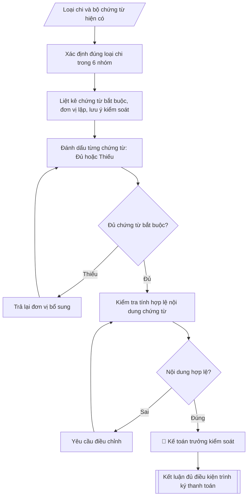

# Skill: Lập checklist chứng từ thanh toán

## Khi nào dùng
Khi kiểm tra, đối chiếu bộ chứng từ của một khoản chi trước khi trình ký thanh toán:
xác định chứng từ bắt buộc theo từng loại chi, đơn vị lập, và các điểm kiểm soát trọng yếu.

## Đầu vào (Input)

| Trường | Mô tả | Bắt buộc |
|---|---|---|
| `loai_chi` | Một trong 6 loại: (a) lương–phụ cấp, (b) học bổng–hỗ trợ SV, (c) đề tài NCKH, (d) mua sắm tài sản–thiết bị, (e) công tác phí, (f) tiếp khách–hội nghị | Có |
| `noi_dung_chi` | Nội dung cụ thể của khoản chi (vd: thanh toán đợt 2 hợp đồng mua máy chiếu) | Có |
| `so_tien` | Số tiền đề nghị thanh toán | Có |
| `chung_tu_hien_co` | Danh sách chứng từ đơn vị đã nộp (để đánh dấu đủ/thiếu) | Không |
| `don_vi_de_nghi` | Đơn vị đề nghị thanh toán | Có |

## Quy trình

**Bước 1. Xác định đúng loại chi**
- Làm gì: căn cứ `loai_chi` đã khai báo và đối chiếu với `noi_dung_chi`, `so_tien` thực tế;
  nếu nội dung chi không thuộc nhóm đã chọn (ví dụ khai (d) mua sắm nhưng thực chất là
  thuê dịch vụ tổ chức hội nghị), phân loại lại cho đúng trước khi lập checklist.
- Dùng input: `loai_chi`, `noi_dung_chi`, `so_tien`.
- Vai trò: Chuyên viên Phòng TCKT · AI hỗ trợ: đối chiếu tự động, cảnh báo sai lệch · ⏱ ~1–2 giờ (ước tính)
- Lưu ý nghiệp vụ: phân loại sai loại chi dẫn đến áp sai danh mục chứng từ — kiểm tra bản
  chất khoản chi (mua tài sản, thuê dịch vụ, chi cho con người), không chỉ dựa vào tên gọi
  của đơn vị đề nghị.
- → Kết quả bước: phiếu phân loại chi (loại chi đã xác định trong 6 nhóm + nội dung chi).

**Bước 2. Liệt kê chứng từ bắt buộc, đơn vị lập và lưu ý kiểm soát theo loại chi**
- Làm gì: lấy danh mục chứng từ chuẩn của loại chi đã xác định ở Bước 1 (xem chi tiết
  (a)–(f) bên dưới); với mỗi chứng từ ghi rõ đơn vị lập và các điểm kiểm soát trọng yếu.
- Dùng input: kết quả Bước 1 (loại chi).
- Vai trò: Chuyên viên Phòng TCKT · AI hỗ trợ: xử lý sơ bộ, tổng hợp · ⏱ ~30–60 phút (ước tính)
- Lưu ý nghiệp vụ: danh mục chứng từ của từng loại chi là cố định theo quy định — không
  được tự ý bớt chứng từ bắt buộc; chứng từ do đơn vị nào lập thì đơn vị đó chịu trách
  nhiệm về tính đúng đắn.
- → Kết quả bước: danh mục chứng từ bắt buộc của loại chi (kèm đơn vị lập và lưu ý kiểm
  soát từng chứng từ).

Danh mục chi tiết theo từng loại chi:

**(a) Chi lương – phụ cấp**
- Chứng từ: Quyết định nâng lương/chuyển ngạch/bổ nhiệm (nếu có thay đổi); bảng chấm công
  (đơn vị lập: các đơn vị, Phòng Tổ chức cán bộ tổng hợp); bảng thanh toán tiền lương,
  phụ cấp (Phòng TCKT lập theo mẫu); danh sách ký nhận/ủy nhiệm chi chuyển khoản;
  quyết định phê duyệt quỹ lương tháng/quý của Hiệu trưởng.
- Đơn vị lập: Phòng Tổ chức cán bộ (chấm công, biến động nhân sự); Phòng TCKT (bảng lương).
- Lưu ý kiểm soát: đối chiếu họ tên, hệ số lương, phụ cấp với quyết định nhân sự còn hiệu lực;
  kiểm tra người nghỉ không lương, nghỉ thai sản đã trừ đúng; chữ ký phê duyệt của Hiệu trưởng.

**(b) Chi học bổng – hỗ trợ sinh viên**
- Chứng từ: Quyết định phê duyệt danh sách học bổng/hỗ trợ của Hiệu trưởng (kèm danh sách
  chi tiết: họ tên, mã SV, lớp, mức, số tiền); biên bản họp Hội đồng xét học bổng;
  bảng điểm/result xét duyệt (Phòng Đào tạo/Phòng CTSV cung cấp); danh sách ký nhận
  hoặc ủy nhiệm chi chuyển khoản vào tài khoản sinh viên.
- Đơn vị lập: Phòng Công tác sinh viên (đề xuất, danh sách); Phòng Đào tạo (kết quả học tập);
  Phòng TCKT (chi trả).
- Lưu ý kiểm soát: sinh viên trong danh sách còn đang theo học (không bảo lưu/bị đình chỉ);
  mức học bổng đúng quy định, không trùng lặp hai nguồn học bổng cùng kỳ; số tài khoản
  nhận đúng tên sinh viên.

**(c) Thanh toán đề tài NCKH**
- Chứng từ: Quyết định phê duyệt đề tài và dự toán kinh phí; hợp đồng thực hiện đề tài
  (giữa Trường và chủ nhiệm đề tài); thuyết minh đề tài đã duyệt; biên bản nghiệm thu
  đề tài (cấp trường/cấp bộ); báo cáo quyết toán kinh phí đề tài; hóa đơn, chứng từ gốc
  của các khoản chi (mua vật tư, thuê chuyên gia, công tác phí...); thanh lý hợp đồng.
- Đơn vị lập: Phòng KHCN (quyết định, hợp đồng, nghiệm thu); chủ nhiệm đề tài (chứng từ chi);
  Phòng TCKT (kiểm tra, thanh toán).
- Lưu ý kiểm soát: nội dung chi đúng dự toán đã duyệt theo thuyết minh; hóa đơn hợp lệ,
  đúng thời gian thực hiện đề tài; nghiệm thu đạt mới thanh toán đợt cuối (thường giữ lại
  10–20% đến khi nghiệm thu).

**(d) Mua sắm tài sản – thiết bị**
- Chứng từ: Tờ trình/đề nghị mua sắm của đơn vị sử dụng; quyết định phê duyệt kế hoạch
  mua sắm; quyết định phê duyệt kết quả lựa chọn nhà thầu (hoặc phê duyệt chỉ định thầu/
  chào hàng cạnh tranh theo hạn mức); hợp đồng mua bán; hóa đơn GTGT; biên bản giao nhận;
  biên bản nghiệm thu, bàn giao đưa vào sử dụng; phiếu nhập kho (nếu qua kho); biên bản
  thanh lý hợp đồng; chứng từ bảo hành (nếu có).
- Đơn vị lập: Đơn vị sử dụng (tờ trình); Phòng Quản trị – Thiết bị (kế hoạch, hợp đồng,
  nghiệm thu); nhà cung cấp (hóa đơn); Phòng TCKT (thanh toán).
- Lưu ý kiểm soát: giá trị mua sắm đúng hạn mức được duyệt theo Luật Đấu thầu; tài sản
  có giá trị từ mức quy định phải ghi tăng TSCĐ và dán mã tài sản; đối chiếu số lượng,
  chủng loại, model trên biên bản nghiệm thu với hợp đồng và hóa đơn.

**(e) Công tác phí**
- Chứng từ: Quyết định/giấy đi công tác (ghi rõ họ tên, chức vụ, nơi đi, thời gian, nhiệm vụ);
  giấy đi đường có xác nhận của nơi đến; vé tàu xe, vé máy bay (cuống vé/hóa đơn điện tử);
  hóa đơn lưu trú; bảng kê thanh toán công tác phí (theo mẫu, Phòng TCKT); báo cáo kết quả
  công tác (đối với đoàn công tác dài ngày/nhiệm vụ quan trọng).
- Đơn vị lập: Đơn vị cử đi (đề xuất); Phòng HCTH/Văn phòng (quyết định); cá nhân đi công tác
  (chứng từ chi); Phòng TCKT (bảng kê, thanh toán).
- Lưu ý kiểm soát: thời gian, địa điểm trên giấy đi đường khớp với quyết định và vé;
  định mức khoán (phụ cấp lưu trú, tiền thuê phòng) đúng Quy chế chi tiêu nội bộ;
  không thanh toán trùng các khoản đã khoán; vé máy bay hạng thương gia chỉ khi được
  phê duyệt riêng theo quy định.

**(f) Tiếp khách – hội nghị**
- Chứng từ: Kế hoạch/tờ trình tổ chức (nêu rõ mục đích, thành phần, thời gian, địa điểm,
  dự toán kinh phí) đã được phê duyệt; quyết định phê duyệt của Hiệu trưởng (đối với
  hội nghị lớn/vượt định mức); hóa đơn dịch vụ (ăn uống, thuê hội trường, in ấn...);
  danh sách đại biểu/khách mời tham dự (ký xác nhận); bảng kê chi tiết các khoản chi;
  biên bản nghiệm thu dịch vụ (nếu thuê đơn vị tổ chức sự kiện).
- Đơn vị lập: Đơn vị tổ chức (kế hoạch, danh sách); Phòng HCTH (phối hợp); nhà cung cấp
  dịch vụ (hóa đơn); Phòng TCKT (kiểm tra, thanh toán).
- Lưu ý kiểm soát: định mức chi tiếp khách đúng Quy chế chi tiêu nội bộ (mức chi/người/
  buổi); không dùng ngân sách cho chi tiếp khách không phục vụ nhiệm vụ; hóa đơn ăn uống
  phải ghi rõ số lượng khách, khớp danh sách đại biểu; chi hội nghị có tài trợ phải tách
  bạch nguồn kinh phí.

**Bước 3. Đối chiếu chứng từ hiện có, đánh dấu Đủ/Thiếu**
- Làm gì: đối chiếu từng chứng từ trong `chung_tu_hien_co` với danh mục bắt buộc ở Bước 2;
  đánh dấu từng dòng "Đủ" hoặc "Thiếu"; chứng từ chưa đến hạn theo tiến độ hợp đồng
  (ví dụ biên bản thanh lý khi chưa thanh toán đợt cuối) ghi rõ "chưa đến hạn", không tính
  là thiếu.
- Dùng input: `chung_tu_hien_co`, kết quả Bước 2.
- Vai trò: Chuyên viên Phòng TCKT · AI hỗ trợ: đối chiếu tự động, cảnh báo sai lệch, tính toán, phân tích số liệu · ⏱ ~1–2 giờ (ước tính)
- Lưu ý nghiệp vụ: chứng từ thiếu → trả lại đơn vị bổ sung, tuyệt đối không trình ký thanh
  toán khi thiếu chứng từ bắt buộc.
- → Kết quả bước: bảng đối chiếu chứng từ (từng chứng từ bắt buộc + trạng thái Đủ/Thiếu).

**Bước 4. Kiểm tra tính hợp lệ của nội dung chứng từ**
- Làm gì: với các chứng từ đã "Đủ", kiểm tra: số tiền khớp `so_tien`/hợp đồng; chữ ký người
  lập, người duyệt và con dấu đầy đủ; hóa đơn hợp lệ (MST, nội dung, số tiền khớp hợp đồng);
  thời hiệu chứng từ đúng niên độ ngân sách; áp dụng các lưu ý kiểm soát đặc thù của loại
  chi tại Bước 2.
- Dùng input: `so_tien`, kết quả Bước 2 – 3.
- Vai trò: Chuyên viên Phòng TCKT · AI hỗ trợ: đối chiếu tự động, cảnh báo sai lệch, tính toán, phân tích số liệu · ⏱ ~1–2 giờ (ước tính)
- Lưu ý nghiệp vụ: chứng từ đủ nhưng sai nội dung (số tiền, chữ ký, con dấu) → yêu cầu đơn
  vị điều chỉnh, không tự sửa thay; nguyên tắc kiểm soát: người lập, người kiểm tra và người
  phê duyệt thanh toán phải độc lập nhau.
- → Kết quả bước: danh sách lỗi chứng từ đã phân loại (thiếu chứng từ / sai nội dung).

**Bước 5. Kết luận kiểm soát và trả kết quả cho đơn vị**
- Làm gì: tổng hợp kết quả Bước 3 – 4 thành kết luận: đủ điều kiện trình ký thanh toán, hoặc
  chưa đủ điều kiện kèm danh mục cụ thể cần bổ sung/điều chỉnh; gửi trả `don_vi_de_nghi`
  để thực hiện; sau khi đơn vị bổ sung đầy đủ thì trình ký thanh toán.
- Dùng input: `don_vi_de_nghi`, kết quả Bước 3 – 4.
- Vai trò: Chuyên viên Phòng TCKT · AI hỗ trợ: tổng hợp, chuẩn hóa dữ liệu, chuẩn bị hồ sơ trình đầy đủ · ⏱ ~1–3 giờ (ước tính)
- Lưu ý nghiệp vụ: kết luận phải nêu đích danh từng chứng từ cần bổ sung, không ghi chung
  chung "bổ sung hồ sơ"; lưu vết các lần trả lại để theo dõi.
- → Kết quả bước: kết luận kiểm soát (đủ điều kiện trình ký / yêu cầu bổ sung chi tiết).

## Luồng quy trình (Workflow)

## Đầu ra (Output)
- Bảng checklist chứng từ đầy đủ cho loại chi được yêu cầu, gồm các cột: TT, Chứng từ bắt
  buộc, Đơn vị lập, Tình trạng (Đủ/Thiếu), Ghi chú kiểm soát.
- Kết luận kiểm soát: đủ điều kiện trình ký thanh toán hay phải bổ sung.

**Cấu trúc output chuẩn:** khung mẫu cố định của bảng checklist, các phần theo đúng thứ
tự xuất hiện:
1. Tiêu đề checklist (loại chi, nội dung chi, số tiền, đơn vị đề nghị);
2. Bảng checklist (cột: TT, chứng từ bắt buộc, đơn vị lập, Đủ/Thiếu, ghi chú kiểm soát);
3. Kết luận kiểm soát (đủ điều kiện trình ký thanh toán, hoặc chưa đủ điều kiện kèm danh
   mục chứng từ cụ thể cần bổ sung/điều chỉnh);
4. (Phụ lục) Bảng checklist tương tự cho các loại chi còn lại theo danh mục chứng từ
   tại mục Quy trình.

## Checklist nghiệm thu

- [ ] Đủ các phần theo "Cấu trúc output chuẩn": Tiêu đề checklist (loại chi, nội dung chi,…; Bảng checklist (cột; Kết luận kiểm soát (đủ điều kiện trình ký…; (Phụ lục) Bảng checklist tương tự cho các…
- [ ] Có đầy đủ sản phẩm: Bảng checklist chứng từ đầy đủ cho loại chi được yêu cầu, gồm các cột: TT, Chứng từ bắt
- [ ] Có đầy đủ sản phẩm: Kết luận kiểm soát: đủ điều kiện trình ký thanh toán hay phải bổ sung
- [ ] Mọi số liệu, tên, ngày tháng trong output khớp với Input đã cung cấp (không thêm bớt, không suy đoán)
- [ ] Không bịa đặt số liệu, minh chứng, trích dẫn hay căn cứ
- [ ] Đúng thể thức, định dạng văn bản theo quy định hiện hành
- [ ] Căn cứ pháp lý nêu đầy đủ, còn hiệu lực tại thời điểm lập
- [ ] Đã qua Human gate: người có thẩm quyền đã kiểm tra/ký duyệt trước khi phát hành
- [ ] Phân loại sai loại chi dẫn đến áp sai danh mục chứng từ — kiểm tra bản
- [ ] Danh mục chứng từ của từng loại chi là cố định theo quy định — không

> Tiêu chí đạt: tất cả các ô đều được đánh dấu.

## Ví dụ mô phỏng (dữ liệu giả lập)

> Tất cả tên trường, cá nhân, số liệu dưới đây đều là **giả lập**, không liên quan tổ chức/cá nhân có thật.

### Input mẫu

| Trường | Giá trị |
|---|---|
| `loai_chi` | (d) mua sắm tài sản – thiết bị |
| `noi_dung_chi` | Thanh toán đợt 2 (70%) hợp đồng mua 10 máy chiếu phục vụ giảng dạy |
| `so_tien` | 385.000.000 đồng |
| `chung_tu_hien_co` | Tờ trình; quyết định phê duyệt kế hoạch; quyết định phê duyệt KQLCNT; hợp đồng; hóa đơn GTGT; biên bản nghiệm thu đợt 2 |
| `don_vi_de_nghi` | Phòng Quản trị – Thiết bị |

### Output mẫu

**CHECKLIST CHỨNG TỪ THANH TOÁN**
Loại chi: (d) Mua sắm tài sản – thiết bị
Nội dung: Thanh toán đợt 2 (70%) hợp đồng mua 10 máy chiếu phục vụ giảng dạy
Số tiền: 385.000.000 đồng — Đơn vị đề nghị: Phòng Quản trị – Thiết bị

| TT | Chứng từ bắt buộc | Đơn vị lập | Đủ/Thiếu | Ghi chú kiểm soát |
|----|-------------------|------------|----------|-------------------|
| 1 | Tờ trình đề nghị mua sắm | Phòng QTTB | Đủ | Đã phê duyệt |
| 2 | Quyết định phê duyệt kế hoạch mua sắm | Hiệu trưởng | Đủ | Số 155/QĐ-ĐHA |
| 3 | Quyết định phê duyệt kết quả lựa chọn nhà thầu | Hiệu trưởng | Đủ | Hình thức: chào hàng cạnh tranh |
| 4 | Hợp đồng mua bán | Phòng QTTB + nhà thầu | Đủ | Điều khoản thanh toán đợt 2: 70% sau nghiệm thu |
| 5 | Hóa đơn GTGT | Nhà thầu | Đủ | Kiểm tra MST, số tiền khớp hợp đồng |
| 6 | Biên bản giao nhận hàng hóa | Phòng QTTB + nhà thầu | **Thiếu** | Yêu cầu bổ sung |
| 7 | Biên bản nghiệm thu, bàn giao đưa vào sử dụng | Hội đồng nghiệm thu | Đủ | 10/10 máy đạt yêu cầu kỹ thuật |
| 8 | Phiếu nhập kho | Thủ kho | **Thiếu** | Yêu cầu bổ sung (thiết bị qua kho trước khi cấp phát) |
| 9 | Biên bản thanh lý hợp đồng | — | Thiếu (chưa đến hạn) | Chỉ yêu cầu khi thanh toán đợt cuối |
| 10 | Chứng từ bảo hành | Nhà thầu | Đủ | Bảo hành 24 tháng |

**Kết luận kiểm soát**: Chưa đủ điều kiện trình ký thanh toán. Đề nghị Phòng Quản trị –
Thiết bị bổ sung: (1) Biên bản giao nhận hàng hóa; (2) Phiếu nhập kho. Sau khi bổ sung
đầy đủ, Phòng Tài chính – Kế toán sẽ trình ký thanh toán đợt 2 theo hợp đồng.

*(Bảng checklist tương tự được lập cho 5 loại chi còn lại: (a) lương–phụ cấp,
(b) học bổng–hỗ trợ SV, (c) đề tài NCKH, (e) công tác phí, (f) tiếp khách–hội nghị —
theo danh mục chứng từ tại mục Quy trình.)*

## Căn cứ & lưu ý
- Luật Kế toán 2015: mọi nghiệp vụ kinh tế, tài chính phát sinh đều phải lập chứng từ
  kế toán; chứng từ phải đầy đủ, hợp lệ, hợp pháp trước khi ghi sổ và chi tiền.
- Luật Đấu thầu 2023 (sửa đổi): tuân thủ hạn mức, hình thức lựa chọn nhà thầu đối với
  chi mua sắm tài sản, thiết bị.
- Quy chế chi tiêu nội bộ của trường là căn cứ định mức trực tiếp cho công tác phí,
  tiếp khách – hội nghị, khoán chi.
- Nguyên tắc kiểm soát: người lập chứng từ, người kiểm tra và người phê duyệt thanh toán
  phải độc lập nhau; không chi tiền khi thiếu chứng từ bắt buộc.
- Không dùng tên thật của trường/cá nhân khi mô phỏng.
