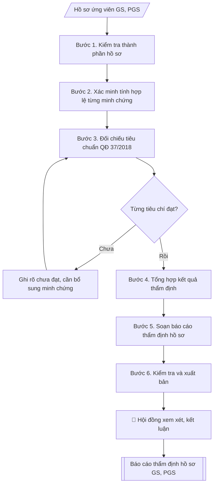

# Checklist hồ sơ xét công nhận GS/PGS + báo cáo thẩm định

## Định dạng và file đầu ra

Định dạng đầu ra có thể chọn theo sản phẩm/yêu cầu: .docx, .pdf. Đọc mục “Định dạng bổ sung” trong quy cách đầu ra trước khi chọn.

**Phải tạo file thực tế để tải xuống, không chỉ trả nội dung trong chat.** Định dạng mặc định của skill: **.docx**. Nếu có bảng số liệu nghiệp vụ yêu cầu file bảng tính riêng, tạo thêm Excel theo yêu cầu; không tự tạo file kiểm tra. Không chờ người dùng yêu cầu xuất file lần nữa. Ưu tiên định dạng người dùng chỉ định; đọc quy tắc xuất file tại references/quy-cach-dau-ra.md.

## Quy cách đầu ra và thông tin thiếu
Khi dựng file Word/Excel, áp dụng mục “Thể thức và bảng biểu khi dựng file” trong quy cách đầu ra (cỡ chữ từng thành phần, bảng nhiều trang, số trang, phụ lục). Đọc [quy cách và cấu trúc sản phẩm](references/quy-cach-dau-ra.md) trước khi soạn/xuất. File giao chỉ gồm sản phẩm nghiệp vụ được yêu cầu; kiểm tra nội bộ không xuất kèm. Thiếu thông tin thì giữ nguyên trường/mục và chỗ điền theo mẫu gốc (dòng dấu chấm, dấu gạch hoặc ô trống); không tự điền dữ liệu mẫu, số 0, mã chờ xác minh hay dòng chờ ký. Mẫu chuyên ngành còn áp dụng được ưu tiên về cấu trúc, mã biểu và người ký. Bản đầy đủ: [quy tắc chung](references/quy-tac-chung.md).

Khi người dùng yêu cầu bộ slide (.pptx), đọc mục “Xuất PowerPoint (.pptx) khi được yêu cầu” trong quy cách đầu ra.

## Kiểm soát áp dụng và phê duyệt
Trước khi chạy, xác định `ngay_ap_dung`, `loai_hinh_truong`, `quy_che_noi_bo`, `nguon_du_lieu`, `nguoi_kiem_duyet`; chỉ hỏi thông tin liên quan nghiệp vụ, không dùng giá trị giả định thay dữ liệu bắt buộc. Đối chiếu căn cứ pháp lý với văn bản gốc, hiệu lực, điều khoản áp dụng và chuyển tiếp. Bản đầy đủ: [quy tắc chung](references/quy-tac-chung.md).

## Giới hạn và human gate
AI hỗ trợ chuẩn bị và đối chiếu; cán bộ phụ trách kiểm tra dữ liệu/căn cứ, người có thẩm quyền duyệt và ký. Không đánh dấu đã ký, đã duyệt, đã công bố khi chưa có chứng cứ. Dữ liệu sinh viên, sức khỏe, nhân sự, tài chính chỉ dùng theo mục đích và phân quyền, che thông tin định danh khi dùng ví dụ (Luật 91/2025/QH15, hiệu lực 01/01/2026); không tải dữ liệu lên dịch vụ ngoài khi chưa có quyền. Bản đầy đủ: [quy tắc chung](references/quy-tac-chung.md).

## Khi nào dùng
Khi tiếp nhận hồ sơ đăng ký xét công nhận chức danh Giáo sư (GS) / Phó giáo sư (PGS):
kiểm tra tính đầy đủ, hợp lệ của từng thành phần hồ sơ theo quy định, đối chiếu tiêu chuẩn,
và soạn báo cáo thẩm định trình Hội đồng xét.

## Đầu vào (Input)

| Trường | Mô tả | Bắt buộc |
|---|---|---|
| `ho_ten` | Họ tên ứng viên | Có |
| `chuc_danh` | Giáo sư / Phó giáo sư (đăng ký xét) | Có |
| `nganh` | Ngành / chuyên ngành xét | Có |
| `don_vi` | Đơn vị công tác | Có |
| `ly_lich_khoa_hoc` | Tóm tắt quá trình đào tạo, công tác, chức danh hiện tại | Có |
| `tieu_chuan_dao_tao` | Trình độ đào tạo, số NCS/học viên cao học đã hướng dẫn | Có |
| `tieu_chuan_khoa_hoc` | Số công trình khoa học, bài báo, sách, sáng chế (phân loại) | Có |
| `tieu_chuan_giang_day` | Số năm giảng dạy, giờ giảng, đánh giá | Có |
| `minh_chung` | Danh mục minh chứng kèm theo (văn bằng, quyết định, bài báo...) | Có |
| `thanh_phan_ho_so` | Danh sách tài liệu thực tế có trong hồ sơ nộp | Có |

## Quy trình

**Bước 1. Kiểm tra thành phần hồ sơ**
- Làm gì: lập danh sách các thành phần bắt buộc của hồ sơ xét GS/PGS theo quy định
(đơn đăng ký, bản đăng ký xét/lý lịch khoa học, bản sao văn bằng, minh chứng quá trình
giảng dạy, minh chứng hướng dẫn NCS/học viên cao học, minh chứng công trình khoa học,
xác nhận của đơn vị công tác); đối chiếu với `thanh_phan_ho_so` thực tế nộp, đánh dấu
từng mục: Đủ / Thiếu / Chưa hợp lệ.
- Dùng input: `thanh_phan_ho_so`, `ho_ten`, `chuc_danh`, `nganh`.
- Vai trò: Chuyên viên Phòng TCCB (Trưởng phòng kiểm tra lại) · AI hỗ trợ: quét lỗi theo checklist · ⏱ ~15–30 phút (ước tính)
- Lưu ý nghiệp vụ: hồ sơ GS/PGS có danh mục thành phần cố định theo quy định của Hội đồng
chức danh — thiếu một thành phần là hồ sơ không đủ điều kiện trình Hội đồng; kiểm tra
ngay từ đầu để yêu cầu bổ sung sớm, tránh mất thời gian đối chiếu tiêu chuẩn rồi mới
phát hiện thiếu.
- → Kết quả bước: bảng checklist thành phần hồ sơ (thành phần | tình trạng | ghi chú).

**Bước 2. Xác minh tính hợp lệ của từng minh chứng**
- Làm gì: kiểm tra từng tài liệu trong `minh_chung`: văn bằng có chứng thực/khớp với bản
gốc không; bài báo có bản sao đầy đủ (trang bìa, mục lục, toàn văn) và thông tin tạp chí
khớp với kê khai không; quyết định hướng dẫn NCS có số, ngày, đúng tên ứng viên không;
xác nhận của đơn vị có chữ ký, đóng dấu không; đối chiếu số liệu kê khai trong
`ly_lich_khoa_hoc` với minh chứng đính kèm.
- Dùng input: `minh_chung`, `ly_lich_khoa_hoc`, `tieu_chuan_khoa_hoc`, `tieu_chuan_dao_tao`, `tieu_chuan_giang_day`.
- Vai trò: Chuyên viên Phòng TCCB (Trưởng phòng kiểm tra lại) · AI hỗ trợ: quét lỗi theo checklist, lập bảng đối chiếu · ⏱ ~15–30 phút (ước tính)
- Lưu ý nghiệp vụ: bẫy thường gặp là số công trình kê khai nhiều hơn số có bản sao minh
chứng, hoặc bài báo ghi "tác giả chính" nhưng minh chứng không thể hiện thứ tự tác giả;
minh chứng hướng dẫn NCS phải là quyết định giao nhiệm vụ (không chấp nhận giấy xác nhận
chung chung của khoa).
- → Kết quả bước: danh sách lỗi phân loại (lỗi thiếu minh chứng | lỗi minh chứng chưa
hợp lệ | lỗi số liệu kê khai không khớp minh chứng).

**Bước 3. Đối chiếu tiêu chuẩn theo Quyết định 37/2018/QĐ-TTg**
- Làm gì: đối chiếu từng nhóm tiêu chuẩn với thực tế ứng viên đã xác minh ở Bước 2:
(a) tiêu chuẩn chung (phẩm chất, trình độ tiến sĩ, thâm niên giảng dạy); (b) tiêu chuẩn
về đào tạo (số NCS, học viên cao học đã hướng dẫn thành công); (c) tiêu chuẩn về khoa học
và công nghệ (số lượng, chất lượng công trình, bài báo quốc tế, sách chuyên khảo, bằng
sáng chế — phân biệt yêu cầu giữa GS và PGS); (d) tiêu chuẩn về giảng dạy (số năm, giờ
chuẩn, đánh giá). Ghi rõ từng tiêu chí: Đạt / Chưa đạt / Cần bổ sung minh chứng.
- Dùng input: `chuc_danh`, `nganh`, `tieu_chuan_dao_tao`, `tieu_chuan_khoa_hoc`, `tieu_chuan_giang_day`, `ly_lich_khoa_hoc`.
- Vai trò: Chuyên viên Phòng TCCB (Trưởng phòng kiểm tra lại) · AI hỗ trợ: đối chiếu chéo tự động · ⏱ ~15–30 phút (ước tính)
- Lưu ý nghiệp vụ: tiêu chuẩn GS cao hơn PGS ở mọi nhóm (đặc biệt số bài báo quốc tế uy
tín và số NCS hướng dẫn) — phải đối chiếu đúng cột tiêu chuẩn của `chuc_danh` đăng ký;
tiêu chí "Chưa đạt" và "Cần bổ sung minh chứng" khác nhau: chưa đạt là thiếu về thực chất,
cần bổ sung là có thực chất nhưng thiếu giấy tờ — kiến nghị xử lý khác nhau.
- → Kết quả bước: bảng đối chiếu tiêu chuẩn (tiêu chí | yêu cầu | thực tế | kết quả).

**Bước 4. Tổng hợp kết quả thẩm định**
- Làm gì: hợp nhất kết quả Bước 1–3 thành kết luận thẩm định: liệt kê đầy đủ các mục hồ sơ
còn thiếu, các tiêu chí chưa đạt, các minh chứng cần bổ sung (kèm thời hạn bổ sung cụ thể);
phân loại kết luận: (a) đủ điều kiện trình Hội đồng; (b) đủ điều kiện có điều kiện (bổ sung
minh chứng trước ngày cụ thể); (c) chưa đủ điều kiện (nêu rõ lý do).
- Dùng input: kết quả Bước 1–3 (tổng hợp từ toàn bộ input).
- Vai trò: Chuyên viên Phòng TCCB (Trưởng phòng kiểm tra lại) · AI hỗ trợ: tổng hợp và chuẩn hóa dữ liệu · ⏱ ~15–30 phút (ước tính)
- Lưu ý nghiệp vụ: kết luận phải rõ ràng, không dùng từ mập mờ ("cơ bản đáp ứng" phải đi
kèm danh sách cụ thể những gì còn thiếu); thời hạn bổ sung phải thực tế và ghi rõ vào
kiến nghị để ứng viên và đơn vị cùng theo dõi.
- → Kết quả bước: dự thảo kết luận thẩm định (phân loại a/b/c + danh sách việc cần bổ sung).

**Bước 5. Soạn báo cáo thẩm định hồ sơ**
- Làm gì: soạn văn bản báo cáo theo thể thức NĐ 30/2020: Quốc hiệu – Tiêu ngữ, tên Phòng
Tổ chức – Cán bộ, số/ký hiệu, địa danh ngày tháng, tên loại "BÁO CÁO" + trích yếu (thẩm định
hồ sơ của ông/bà..., chức danh đăng ký, ngành); Kính gửi Hội đồng xét công nhận chức danh
GS, PGS; nội dung 3 mục: 1. Về thành phần hồ sơ (kết quả Bước 1); 2. Về tiêu chuẩn theo
QĐ 37/2018 (kết quả Bước 3, nêu số liệu cụ thể); 3. Kiến nghị (kết luận Bước 4 + thời hạn
bổ sung); Nơi nhận (Hội đồng, ứng viên để bổ sung, lưu VT/TCCB); Trưởng phòng ký.
- Dùng input: `ho_ten`, `chuc_danh`, `nganh`, `don_vi` + kết quả Bước 1–4.
- Vai trò: Chuyên viên Phòng TCCB (Trưởng phòng kiểm tra lại) · AI hỗ trợ: soạn dự thảo đúng thể thức · ⏱ ~15–30 phút (ước tính)
- Lưu ý nghiệp vụ: báo cáo là văn bản trình Hội đồng nên chỉ nêu kết quả thẩm định, không
sao chép nguyên bảng checklist dài vào thân báo cáo (bảng checklist đính kèm hoặc lưu hồ
sơ); số liệu trong báo cáo phải khớp tuyệt đối với bảng đối chiếu ở Bước 3.
- → Kết quả bước: dự thảo báo cáo thẩm định hồ sơ hoàn chỉnh.

**Bước 6. Kiểm tra và xuất bản**
- Làm gì: soát toàn văn báo cáo: họ tên ứng viên, chức danh đăng ký, ngành xét chính xác;
số liệu minh chứng khớp với kê khai; trích dẫn Quyết định 37/2018 đúng số, ngày; kiến nghị
rõ ràng, có thời hạn; đính kèm bảng checklist thành phần hồ sơ và bảng đối chiếu tiêu chuẩn
từ Bước 1 và Bước 3.
- Dùng input: toàn bộ input (tổng soát).
- Vai trò: Chuyên viên Phòng TCCB (Trưởng phòng kiểm tra lại) · AI hỗ trợ: quét lỗi theo checklist · ⏱ ~15–30 phút (ước tính)
- Lưu ý nghiệp vụ: lỗi sai tên ngành xét hoặc sai chức danh đăng ký (GS/PGS) khiến Hội đồng
phải trả hồ sơ; kiểm tra lần cuối rằng mọi tiêu chí "Cần bổ sung minh chứng" đều đã có
trong mục Kiến nghị với thời hạn cụ thể.
- → Kết quả bước: bộ hồ sơ thẩm định hoàn chỉnh (bảng checklist + bảng đối chiếu tiêu
chuẩn + báo cáo thẩm định), sẵn sàng trình Hội đồng.

## Luồng quy trình (Workflow)

## Đầu ra

File nghiệp vụ thực tế theo định dạng mặc định ở đầu skill hoặc định dạng người dùng yêu cầu, kèm liên kết tải trong phản hồi cuối.

Sản phẩm nghiệp vụ hoàn chỉnh theo [quy cách và cấu trúc](references/quy-cach-dau-ra.md), giữ các trường chưa có dữ liệu ở trạng thái trống. Không xuất kèm checklist/phụ lục kiểm tra đầu ra.

## Kiểm tra nội bộ trước khi giao

Các tiêu chí sau dùng để tự đối chiếu; không sao chép vào file xuất. Mục thiếu dữ liệu được để trống, không đánh dấu đã đạt hoặc đã duyệt.

- [ ] Bố cục khớp mẫu áp dụng và cấu trúc tại references/quy-cach-dau-ra.md.
- [ ] Nội dung và số liệu trong output khớp đúng với Input đã cho (không thêm, bớt hay suy diễn)
- [ ] Không bịa đặt số liệu, minh chứng, trích dẫn hay căn cứ
- [ ] Đúng thể thức theo Quyết định số 37/2018/QĐ-TTg và Nghị định 30/2020/NĐ-CP; đối chiếu hiệu lực của căn cứ tại ngày nghiệp vụ.
- [ ] Căn cứ pháp lý được trích dẫn đầy đủ và còn hiệu lực
- [ ] Không coi bản soạn là đã ký/đã duyệt; việc phê duyệt thuộc người có thẩm quyền trước phát hành
- [ ] Kết luận phải rõ ràng, không dùng từ mập mờ ("cơ bản đáp ứng" phải đi

## Căn cứ & lưu ý
- Quyết định số 37/2018/QĐ-TTg ngày 31/8/2018 của Thủ tướng Chính phủ quy định tiêu chuẩn,
thủ tục xét công nhận đạt tiêu chuẩn và bổ nhiệm chức danh giáo sư, phó giáo sư.
- Nghị định 30/2020/NĐ-CP về công tác văn thư (thể thức văn bản).
- Kiểm tra kỹ tính xác thực của minh chứng; số liệu kê khai phải khớp với minh chứng đính kèm.
- Không dùng tên thật của trường/cá nhân khi mô phỏng.

## Quản trị phiên bản
- Phiên bản gói `1.3.2` (cập nhật 2026-10-10); hồ sơ đầy đủ tại [references/version.json](references/version.json).
- Người phê duyệt nghiệp vụ: **chưa chỉ định**. Trạng thái: dự thảo nghiệp vụ; kiểm tra pháp lý trước thực thi. Ngày cập nhật không đồng nghĩa mọi văn bản đã được rà soát toàn văn.
- Giấy phép theo LICENSE của kho (bản quyền CES Global). Lịch sử thay đổi: CHANGELOG.md.
