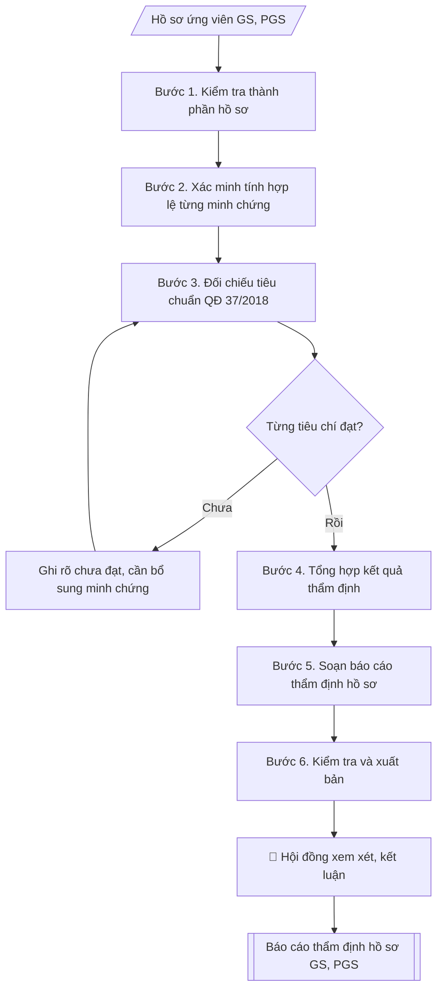

# Skill: Checklist hồ sơ xét công nhận GS/PGS + báo cáo thẩm định

## Khi nào dùng
Khi tiếp nhận hồ sơ đăng ký xét công nhận chức danh Giáo sư (GS) / Phó giáo sư (PGS):
kiểm tra tính đầy đủ, hợp lệ của từng thành phần hồ sơ theo quy định, đối chiếu tiêu chuẩn,
và soạn báo cáo thẩm định trình Hội đồng xét.

## Đầu vào (Input)

| Trường | Mô tả | Bắt buộc |
|---|---|---|
| `ho_ten` | Họ tên ứng viên | Có |
| `chuc_danh` | Giáo sư / Phó giáo sư (đăng ký xét) | Có |
| `nganh` | Ngành / chuyên ngành xét | Có |
| `don_vi` | Đơn vị công tác | Có |
| `ly_lich_khoa_hoc` | Tóm tắt quá trình đào tạo, công tác, chức danh hiện tại | Có |
| `tieu_chuan_dao_tao` | Trình độ đào tạo, số NCS/học viên cao học đã hướng dẫn | Có |
| `tieu_chuan_khoa_hoc` | Số công trình khoa học, bài báo, sách, sáng chế (phân loại) | Có |
| `tieu_chuan_giang_day` | Số năm giảng dạy, giờ giảng, đánh giá | Có |
| `minh_chung` | Danh mục minh chứng kèm theo (văn bằng, quyết định, bài báo...) | Có |
| `thanh_phan_ho_so` | Danh sách tài liệu thực tế có trong hồ sơ nộp | Có |

## Quy trình

**Bước 1. Kiểm tra thành phần hồ sơ**
- Làm gì: lập danh sách các thành phần bắt buộc của hồ sơ xét GS/PGS theo quy định
(đơn đăng ký, bản đăng ký xét/lý lịch khoa học, bản sao văn bằng, minh chứng quá trình
giảng dạy, minh chứng hướng dẫn NCS/học viên cao học, minh chứng công trình khoa học,
xác nhận của đơn vị công tác); đối chiếu với `thanh_phan_ho_so` thực tế nộp, đánh dấu
từng mục: Đủ / Thiếu / Chưa hợp lệ.
- Dùng input: `thanh_phan_ho_so`, `ho_ten`, `chuc_danh`, `nganh`.
- Vai trò: Chuyên viên Phòng TCCB (Trưởng phòng kiểm tra lại) · AI hỗ trợ: quét lỗi theo checklist · ⏱ ~15–30 phút (ước tính)
- Lưu ý nghiệp vụ: hồ sơ GS/PGS có danh mục thành phần cố định theo quy định của Hội đồng
chức danh — thiếu một thành phần là hồ sơ không đủ điều kiện trình Hội đồng; kiểm tra
ngay từ đầu để yêu cầu bổ sung sớm, tránh mất thời gian đối chiếu tiêu chuẩn rồi mới
phát hiện thiếu.
- → Kết quả bước: bảng checklist thành phần hồ sơ (thành phần | tình trạng | ghi chú).

**Bước 2. Xác minh tính hợp lệ của từng minh chứng**
- Làm gì: kiểm tra từng tài liệu trong `minh_chung`: văn bằng có chứng thực/khớp với bản
gốc không; bài báo có bản sao đầy đủ (trang bìa, mục lục, toàn văn) và thông tin tạp chí
khớp với kê khai không; quyết định hướng dẫn NCS có số, ngày, đúng tên ứng viên không;
xác nhận của đơn vị có chữ ký, đóng dấu không; đối chiếu số liệu kê khai trong
`ly_lich_khoa_hoc` với minh chứng đính kèm.
- Dùng input: `minh_chung`, `ly_lich_khoa_hoc`, `tieu_chuan_khoa_hoc`, `tieu_chuan_dao_tao`, `tieu_chuan_giang_day`.
- Vai trò: Chuyên viên Phòng TCCB (Trưởng phòng kiểm tra lại) · AI hỗ trợ: quét lỗi theo checklist, lập bảng đối chiếu · ⏱ ~15–30 phút (ước tính)
- Lưu ý nghiệp vụ: bẫy thường gặp là số công trình kê khai nhiều hơn số có bản sao minh
chứng, hoặc bài báo ghi "tác giả chính" nhưng minh chứng không thể hiện thứ tự tác giả;
minh chứng hướng dẫn NCS phải là quyết định giao nhiệm vụ (không chấp nhận giấy xác nhận
chung chung của khoa).
- → Kết quả bước: danh sách lỗi phân loại (lỗi thiếu minh chứng | lỗi minh chứng chưa
hợp lệ | lỗi số liệu kê khai không khớp minh chứng).

**Bước 3. Đối chiếu tiêu chuẩn theo Quyết định 37/2018/QĐ-TTg**
- Làm gì: đối chiếu từng nhóm tiêu chuẩn với thực tế ứng viên đã xác minh ở Bước 2:
(a) tiêu chuẩn chung (phẩm chất, trình độ tiến sĩ, thâm niên giảng dạy); (b) tiêu chuẩn
về đào tạo (số NCS, học viên cao học đã hướng dẫn thành công); (c) tiêu chuẩn về khoa học
và công nghệ (số lượng, chất lượng công trình, bài báo quốc tế, sách chuyên khảo, bằng
sáng chế — phân biệt yêu cầu giữa GS và PGS); (d) tiêu chuẩn về giảng dạy (số năm, giờ
chuẩn, đánh giá). Ghi rõ từng tiêu chí: Đạt / Chưa đạt / Cần bổ sung minh chứng.
- Dùng input: `chuc_danh`, `nganh`, `tieu_chuan_dao_tao`, `tieu_chuan_khoa_hoc`, `tieu_chuan_giang_day`, `ly_lich_khoa_hoc`.
- Vai trò: Chuyên viên Phòng TCCB (Trưởng phòng kiểm tra lại) · AI hỗ trợ: đối chiếu chéo tự động · ⏱ ~15–30 phút (ước tính)
- Lưu ý nghiệp vụ: tiêu chuẩn GS cao hơn PGS ở mọi nhóm (đặc biệt số bài báo quốc tế uy
tín và số NCS hướng dẫn) — phải đối chiếu đúng cột tiêu chuẩn của `chuc_danh` đăng ký;
tiêu chí "Chưa đạt" và "Cần bổ sung minh chứng" khác nhau: chưa đạt là thiếu về thực chất,
cần bổ sung là có thực chất nhưng thiếu giấy tờ — kiến nghị xử lý khác nhau.
- → Kết quả bước: bảng đối chiếu tiêu chuẩn (tiêu chí | yêu cầu | thực tế | kết quả).

**Bước 4. Tổng hợp kết quả thẩm định**
- Làm gì: hợp nhất kết quả Bước 1–3 thành kết luận thẩm định: liệt kê đầy đủ các mục hồ sơ
còn thiếu, các tiêu chí chưa đạt, các minh chứng cần bổ sung (kèm thời hạn bổ sung cụ thể);
phân loại kết luận: (a) đủ điều kiện trình Hội đồng; (b) đủ điều kiện có điều kiện (bổ sung
minh chứng trước ngày cụ thể); (c) chưa đủ điều kiện (nêu rõ lý do).
- Dùng input: kết quả Bước 1–3 (tổng hợp từ toàn bộ input).
- Vai trò: Chuyên viên Phòng TCCB (Trưởng phòng kiểm tra lại) · AI hỗ trợ: tổng hợp và chuẩn hóa dữ liệu · ⏱ ~15–30 phút (ước tính)
- Lưu ý nghiệp vụ: kết luận phải rõ ràng, không dùng từ mập mờ ("cơ bản đáp ứng" phải đi
kèm danh sách cụ thể những gì còn thiếu); thời hạn bổ sung phải thực tế và ghi rõ vào
kiến nghị để ứng viên và đơn vị cùng theo dõi.
- → Kết quả bước: dự thảo kết luận thẩm định (phân loại a/b/c + danh sách việc cần bổ sung).

**Bước 5. Soạn báo cáo thẩm định hồ sơ**
- Làm gì: soạn văn bản báo cáo theo thể thức NĐ 30/2020: Quốc hiệu – Tiêu ngữ, tên Phòng
Tổ chức – Cán bộ, số/ký hiệu, địa danh ngày tháng, tên loại "BÁO CÁO" + trích yếu (thẩm định
hồ sơ của ông/bà..., chức danh đăng ký, ngành); Kính gửi Hội đồng xét công nhận chức danh
GS, PGS; nội dung 3 mục: 1. Về thành phần hồ sơ (kết quả Bước 1); 2. Về tiêu chuẩn theo
QĐ 37/2018 (kết quả Bước 3, nêu số liệu cụ thể); 3. Kiến nghị (kết luận Bước 4 + thời hạn
bổ sung); Nơi nhận (Hội đồng, ứng viên để bổ sung, lưu VT/TCCB); Trưởng phòng ký.
- Dùng input: `ho_ten`, `chuc_danh`, `nganh`, `don_vi` + kết quả Bước 1–4.
- Vai trò: Chuyên viên Phòng TCCB (Trưởng phòng kiểm tra lại) · AI hỗ trợ: soạn dự thảo đúng thể thức · ⏱ ~15–30 phút (ước tính)
- Lưu ý nghiệp vụ: báo cáo là văn bản trình Hội đồng nên chỉ nêu kết quả thẩm định, không
sao chép nguyên bảng checklist dài vào thân báo cáo (bảng checklist đính kèm hoặc lưu hồ
sơ); số liệu trong báo cáo phải khớp tuyệt đối với bảng đối chiếu ở Bước 3.
- → Kết quả bước: dự thảo báo cáo thẩm định hồ sơ hoàn chỉnh.

**Bước 6. Kiểm tra và xuất bản**
- Làm gì: soát toàn văn báo cáo: họ tên ứng viên, chức danh đăng ký, ngành xét chính xác;
số liệu minh chứng khớp với kê khai; trích dẫn Quyết định 37/2018 đúng số, ngày; kiến nghị
rõ ràng, có thời hạn; đính kèm bảng checklist thành phần hồ sơ và bảng đối chiếu tiêu chuẩn
từ Bước 1 và Bước 3.
- Dùng input: toàn bộ input (tổng soát).
- Vai trò: Chuyên viên Phòng TCCB (Trưởng phòng kiểm tra lại) · AI hỗ trợ: quét lỗi theo checklist · ⏱ ~15–30 phút (ước tính)
- Lưu ý nghiệp vụ: lỗi sai tên ngành xét hoặc sai chức danh đăng ký (GS/PGS) khiến Hội đồng
phải trả hồ sơ; kiểm tra lần cuối rằng mọi tiêu chí "Cần bổ sung minh chứng" đều đã có
trong mục Kiến nghị với thời hạn cụ thể.
- → Kết quả bước: bộ hồ sơ thẩm định hoàn chỉnh (bảng checklist + bảng đối chiếu tiêu
chuẩn + báo cáo thẩm định), sẵn sàng trình Hội đồng.

## Luồng quy trình (Workflow)



## Đầu ra (Output)
- Bảng checklist hồ sơ (thành phần | tình trạng | ghi chú).
- Bảng đối chiếu tiêu chuẩn GS/PGS (tiêu chí | yêu cầu | thực tế | kết quả).
- Báo cáo thẩm định hồ sơ hoàn chỉnh (trình Hội đồng).

**Cấu trúc output chuẩn:** (Báo cáo thẩm định hồ sơ — sản phẩm chính, theo thể thức NĐ 30/2020)
1. Quốc hiệu – Tiêu ngữ ("CỘNG HÒA XÃ HỘI CHỦ NGHĨA VIỆT NAM" / "Độc lập – Tự do – Hạnh phúc").
2. Tên cơ quan ban hành (Phòng Tổ chức – Cán bộ).
3. Số, ký hiệu báo cáo.
4. Địa danh, ngày tháng năm ban hành.
5. Tên loại văn bản "BÁO CÁO" + trích yếu (thẩm định hồ sơ đăng ký xét công nhận chức danh
GS/PGS của ông/bà...).
6. Kính gửi (Hội đồng xét công nhận chức danh GS, PGS Trường Đại học A).
7. Phần mở đầu: căn cứ nhiệm vụ thẩm định; thông tin ứng viên (họ tên, đơn vị, chức danh
đăng ký, ngành xét).
8. Nội dung chính: 1. Về thành phần hồ sơ (số nhóm tài liệu, nhóm đủ/thiếu cụ thể);
2. Về tiêu chuẩn theo Quyết định 37/2018/QĐ-TTg (nêu số liệu từng nhóm tiêu chuẩn);
3. Kiến nghị (kết luận đủ điều kiện / cần bổ sung gì + thời hạn bổ sung cụ thể).
9. Nơi nhận (Hội đồng; ứng viên để bổ sung; lưu VT, TCCB).
10. Chữ ký (Trưởng phòng + họ tên).

## Checklist nghiệm thu

Tiêu chí đạt: tất cả các ô dưới đây được đánh dấu.

- [ ] Đủ các phần theo Cấu trúc output chuẩn: Quốc hiệu – Tiêu ngữ ("CỘNG HÒA XÃ HỘI CHỦ NGHĨA VIỆT NAM" / "Độc l…; Tên cơ quan ban hành (Phòng Tổ chức – Cán bộ).; Số, ký hiệu báo cáo.; Địa danh, ngày tháng năm ban hành.; … (đủ 12 phần)
- [ ] Nội dung và số liệu trong output khớp đúng với Input đã cho (không thêm, bớt hay suy diễn)
- [ ] Không bịa đặt số liệu, minh chứng, trích dẫn hay căn cứ
- [ ] Đúng thể thức và định dạng theo Quyết định số 37/2018/QĐ-TTg ngày 31/8/2018 của Thủ tướng Chính phủ…
- [ ] Căn cứ pháp lý được trích dẫn đầy đủ và còn hiệu lực
- [ ] Đã qua Human gate: người có thẩm quyền đã kiểm tra/duyệt trước khi phát hành
- [ ] Kết luận phải rõ ràng, không dùng từ mập mờ ("cơ bản đáp ứng" phải đi

## Ví dụ mô phỏng (dữ liệu giả lập)

> Tất cả tên trường, cá nhân, số liệu dưới đây đều là **giả lập**, không liên quan tổ chức/cá nhân có thật.

### Input mẫu

| Trường | Giá trị |
|---|---|
| `ho_ten` | Trần Văn B |
| `chuc_danh` | Phó giáo sư |
| `nganh` | Công nghệ thông tin |
| `don_vi` | Khoa Công nghệ thông tin, Trường Đại học A |
| `ly_lich_khoa_hoc` | Tiến sĩ CNTT (2015); 11 năm giảng dạy đại học; giảng viên chính từ 2019 |
| `tieu_chuan_dao_tao` | Đã hướng dẫn thành công 02 NCS tiến sĩ, 09 học viên cao học |
| `tieu_chuan_khoa_hoc` | 32 công trình: 08 bài báo quốc tế uy tín (tác giả chính 05), 01 sách chuyên khảo, 01 bằng sáng chế |
| `tieu_chuan_giang_day` | 11 năm giảng dạy liên tục, 280 giờ chuẩn/năm, đánh giá hoàn thành tốt nhiệm vụ |
| `minh_chung` | Bằng tiến sĩ; quyết định công nhận giảng viên chính; danh mục 32 công trình có bản sao bài báo; giấy chứng nhận hướng dẫn NCS |
| `thanh_phan_ho_so` | Đơn đăng ký; lý lịch khoa học; bản sao văn bằng; minh chứng công trình; minh chứng giảng dạy; xác nhận đơn vị — thiếu: bản sao quyết định hướng dẫn NCS số 2 |

### Output mẫu

**A. CHECKLIST THÀNH PHẦN HỒ SƠ**

| TT | Thành phần | Tình trạng | Ghi chú |
|----|------------|------------|---------|
| 1 | Đơn đăng ký xét công nhận chức danh PGS | Đủ | Đúng mẫu, có chữ ký |
| 2 | Bản đăng ký xét (lý lịch khoa học) | Đủ | Kê khai đầy đủ |
| 3 | Bản sao văn bằng tiến sĩ | Đủ | Có chứng thực |
| 4 | Minh chứng quá trình giảng dạy | Đủ | Xác nhận của Khoa |
| 5 | Minh chứng hướng dẫn NCS, học viên cao học | Thiếu 01 mục | Thiếu bản sao QĐ hướng dẫn NCS thứ 2 |
| 6 | Minh chứng công trình khoa học | Đủ | 32 công trình, có bản sao |
| 7 | Xác nhận của đơn vị công tác | Đủ | Có ý kiến đồng ý giới thiệu |

**B. ĐỐI CHIẾU TIÊU CHUẨN (Quyết định 37/2018/QĐ-TTg)**

| Tiêu chí | Yêu cầu (PGS) | Thực tế ứng viên | Kết quả |
|---|---|---|---|
| Trình độ tiến sĩ | Có | Tiến sĩ CNTT (2015) | Đạt |
| Thâm niên giảng dạy | ≥ 6 năm | 11 năm | Đạt |
| Hướng dẫn NCS/HVCH | Theo quy định ngành | 02 NCS, 09 HVCH | Đạt (cần bổ sung QĐ) |
| Công trình khoa học | Đủ số lượng, chất lượng | 32 công trình, 08 bài quốc tế | Đạt |
| Sách/bằng sáng chế | Theo quy định | 01 sách chuyên khảo, 01 bằng sáng chế | Đạt |

**C. BÁO CÁO THẨM ĐỊNH HỒ SƠ**

```
TRƯỜNG ĐẠI HỌC A            CỘNG HÒA XÃ HỘI CHỦ NGHĨA VIỆT NAM
PHÒNG TỔ CHỨC – CÁN BỘ                    Độc lập – Tự do – Hạnh phúc
      Số: 42/BC-ĐHA-TCCB
                                                 Thành phố C, ngày 09 tháng 10 năm 2026

                       BÁO CÁO
      Thẩm định hồ sơ đăng ký xét công nhận chức danh Phó giáo sư
              của ông Trần Văn B

Kính gửi: Hội đồng xét công nhận chức danh GS, PGS Trường Đại học A

Thực hiện nhiệm vụ thẩm định hồ sơ ứng viên xét công nhận chức danh năm 2026,
Phòng Tổ chức – Cán bộ báo cáo kết quả thẩm định hồ sơ của ông Trần Văn B,
giảng viên Khoa Công nghệ thông tin, đăng ký xét công nhận chức danh Phó giáo sư,
ngành Công nghệ thông tin, như sau:

1. Về thành phần hồ sơ: hồ sơ gồm 07 nhóm tài liệu theo quy định; 06 nhóm đầy đủ,
hợp lệ; còn thiếu 01 minh chứng: bản sao quyết định giao nhiệm vụ hướng dẫn
nghiên cứu sinh thứ hai.

2. Về tiêu chuẩn theo Quyết định số 37/2018/QĐ-TTg ngày 31/8/2018 của Thủ tướng
Chính phủ:
   - Tiêu chuẩn chung, tiêu chuẩn về đào tạo, khoa học và công nghệ, giảng dạy:
     ứng viên cơ bản đáp ứng; các minh chứng về công trình khoa học (32 công trình,
     trong đó 08 bài báo quốc tế uy tín) và hướng dẫn đào tạo (02 NCS, 09 học viên
     cao học) phù hợp quy định.

3. Kiến nghị: đề nghị ứng viên bổ sung bản sao quyết định hướng dẫn nghiên cứu sinh
thứ hai trước ngày 20/10/2026 để hoàn thiện hồ sơ trình Hội đồng xem xét./.

Nơi nhận:                                          TRƯỞNG PHÒNG
- Như trên;
- Ông Trần Văn B (bổ sung);
- Lưu: VT, TCCB.                                       (đã ký)
```

## Căn cứ & lưu ý
- Quyết định số 37/2018/QĐ-TTg ngày 31/8/2018 của Thủ tướng Chính phủ quy định tiêu chuẩn,
thủ tục xét công nhận đạt tiêu chuẩn và bổ nhiệm chức danh giáo sư, phó giáo sư.
- Nghị định 30/2020/NĐ-CP về công tác văn thư (thể thức văn bản).
- Kiểm tra kỹ tính xác thực của minh chứng; số liệu kê khai phải khớp với minh chứng đính kèm.
- Không dùng tên thật của trường/cá nhân khi mô phỏng.
