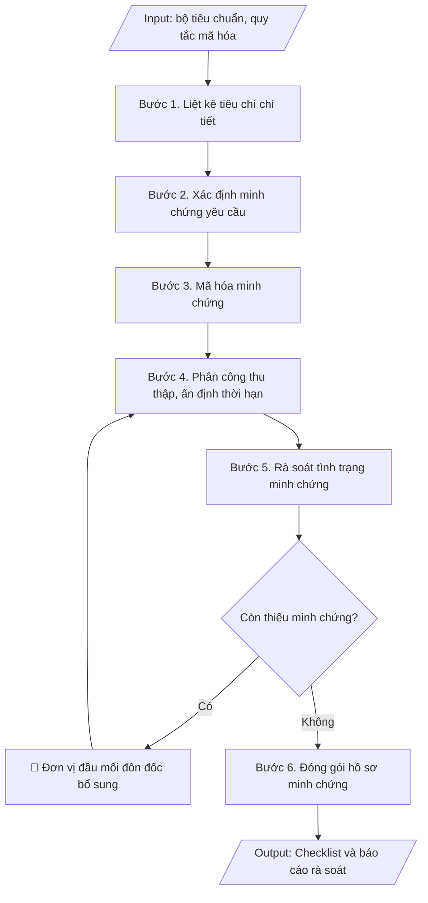

# Checklist minh chứng kiểm định

## Định dạng và file đầu ra
Định dạng đầu ra có thể chọn theo sản phẩm/yêu cầu: .xlsx, .csv, .pdf. Đọc mục “Định dạng bổ sung” trong quy cách đầu ra trước khi chọn.

**Phải tạo file thực tế để tải xuống, không chỉ trả nội dung trong chat.** Định dạng mặc định của skill: **.xlsx**. Nếu yêu cầu gồm cả báo cáo thuyết minh, tạo thêm file Word cho báo cáo; không ghép báo cáo dài vào bảng tính. Không chờ người dùng yêu cầu xuất file lần nữa. Ưu tiên định dạng người dùng chỉ định; đọc quy tắc xuất file tại references/quy-cach-dau-ra.md.

## Quy cách đầu ra và thông tin thiếu
Khi dựng file Word/Excel, áp dụng mục “Thể thức và bảng biểu khi dựng file” trong quy cách đầu ra (cỡ chữ từng thành phần, bảng nhiều trang, số trang, phụ lục). Đọc [quy cách và cấu trúc sản phẩm](references/quy-cach-dau-ra.md) trước khi soạn/xuất. File giao chỉ gồm sản phẩm nghiệp vụ được yêu cầu; kiểm tra nội bộ không xuất kèm. Thiếu thông tin thì giữ nguyên trường/mục và chỗ điền theo mẫu gốc (dòng dấu chấm, dấu gạch hoặc ô trống); không tự điền dữ liệu mẫu, số 0, mã chờ xác minh hay dòng chờ ký. Mẫu chuyên ngành còn áp dụng được ưu tiên về cấu trúc, mã biểu và người ký. Bản đầy đủ: [quy tắc chung](references/quy-tac-chung.md).

Khi người dùng yêu cầu bộ slide (.pptx), đọc mục “Xuất PowerPoint (.pptx) khi được yêu cầu” trong quy cách đầu ra.

## Kiểm soát áp dụng và phê duyệt
Trước khi chạy, xác định `ngay_ap_dung`, `loai_hinh_truong`, `quy_che_noi_bo`, `nguon_du_lieu`, `nguoi_kiem_duyet`; chỉ hỏi thông tin liên quan nghiệp vụ, không dùng giá trị giả định thay dữ liệu bắt buộc. Đối chiếu căn cứ pháp lý với văn bản gốc, hiệu lực, điều khoản áp dụng và chuyển tiếp. Bản đầy đủ: [quy tắc chung](references/quy-tac-chung.md).

Nếu có cập nhật pháp lý dưới đây, đọc [căn cứ và điều kiện áp dụng](references/phap-ly.md) trước khi làm. Quy trình dưới đây giữ nghiệp vụ từ bản gốc; mọi viện dẫn văn bản, mẫu biểu, điều khoản phải theo căn cứ đã chọn trong phap-ly.md, không theo văn bản cũ.

## Giới hạn và human gate
AI hỗ trợ chuẩn bị và đối chiếu; cán bộ phụ trách kiểm tra dữ liệu/căn cứ, người có thẩm quyền duyệt và ký. Không đánh dấu đã ký, đã duyệt, đã công bố khi chưa có chứng cứ. Dữ liệu sinh viên, sức khỏe, nhân sự, tài chính chỉ dùng theo mục đích và phân quyền, che thông tin định danh khi dùng ví dụ (Luật 91/2025/QH15, hiệu lực 01/01/2026); không tải dữ liệu lên dịch vụ ngoài khi chưa có quyền. Bản đầy đủ: [quy tắc chung](references/quy-tac-chung.md).

## Khi nào dùng
Khi cần rà soát, thu thập và quản lý hệ thống minh chứng phục vụ tự đánh giá /
kiểm định chất lượng CSGD hoặc CTĐT.

## Đầu vào (Input)
| Trường | Mô tả | Bắt buộc |
|---|---|---|
| `doi_tuong` | Kiểm định CSGD / CTĐT (ghi rõ tên) | Có |
| `bo_tieu_chuan` | Danh sách tiêu chuẩn – tiêu chí áp dụng | Có |
| `quy_tac_ma_hoa` | Quy tắc mã minh chứng (VD: H<tieu-chuan>.<tieu-chi>.<stt>) | Không (mặc định: H + số tiêu chuẩn.tiêu chí.stt) |
| `don_vi_dau_moi` | Đơn vị đầu mối từng nhóm minh chứng | Không |

## Quy trình
**Ràng buộc pháp lý khi thực hiện** (trích references/phap-ly.md; đối chiếu toàn văn và hiệu lực tại ngày nghiệp vụ):
- Thông tư 20/2026/TT-BGDĐT, hiệu lực 15/05/2026: Yêu cầu ngày hoàn tất tự đánh giá, ngày đăng ký đánh giá ngoài, khung tiêu chuẩn và minh chứng. Điều 51: chỉ cơ sở đã tự đánh giá VÀ đăng ký đánh giá ngoài trước 15/05/2026 được tiếp tục khung 12/2017, hoàn tất chậm nhất 31/12/2026. Ngoài chuyển tiếp dùng 20/2026; không chuyển thang điểm cơ học.
- Thông tư 04/2025/TT-BGDĐT, hiệu lực 04/04/2025: Tách kiểm định chương trình khỏi kiểm định cơ sở. Yêu cầu phiên bản tiêu chuẩn, ngày đăng ký và bộ minh chứng; trích tiêu chí từ phụ lục hiện hành. Không mặc định khung 11 tiêu chuẩn của 04/2016 là khung hiện hành; đối chiếu chuyển tiếp trước khi tiếp tục hồ sơ cũ.
- Trước Bước 1: chọn căn cứ theo đối tượng, loại hình trường và chuyển tiếp; lập bảng văn bản / điều khoản / lý do áp dụng / bằng chứng. Thiếu văn bản gốc hoặc điều khoản thì ghi nhận nội bộ [CẦN XÁC MINH] (không đưa vào file giao), để trống phần tương ứng, chưa kết luận tuân thủ.
- Các con số, thời hạn, số điều, số mức xếp loại, hệ số và mẫu biểu nêu trong các bước dưới đây được giữ từ quy trình gốc (trước cập nhật pháp lý); chỉ dùng khi đã đối chiếu đúng với căn cứ đã chọn, khác thì theo căn cứ. Danh sách điểm cần đối chiếu: docs/DIEM_CAN_DOI_CHIEU_PHAP_LY.md.

**Bước 1. Liệt kê tiêu chí**
- Làm gì: Bóc tách `bo_tieu_chuan` thành danh sách tiêu chí chi tiết theo đúng thứ tự (tiêu chuẩn → tiêu chí), đánh số thứ tự đầy đủ; ghi kèm yêu cầu/yếu tố cần đánh giá của từng tiêu chí theo hướng dẫn của bộ tiêu chuẩn.
- Dùng input: `bo_tieu_chuan`, `doi_tuong`.
- Vai trò: Chuyên viên Phòng Khảo thí & ĐBCL · AI hỗ trợ: bóc tách bộ tiêu chuẩn thành danh sách tiêu chí đầy đủ theo đúng thứ tự · ⏱ ~30 phút (ước tính)
- Lưu ý nghiệp vụ: không gộp/bỏ tiêu chí — mỗi tiêu chí đều phải có minh chứng riêng; kiểm tra đang dùng đúng phiên bản bộ tiêu chuẩn hiện hành.
- → Kết quả bước: Danh sách tiêu chí chi tiết đầy đủ của bộ tiêu chuẩn.

**Bước 2. Xác định minh chứng yêu cầu cho mỗi tiêu chí**
- Làm gì: Căn cứ hướng dẫn của bộ tiêu chuẩn, xác định cho từng tiêu chí các loại minh chứng cần có (văn bản, quyết định, số liệu, biên bản, hình ảnh...), mỗi tiêu chí tối thiểu 02–03 minh chứng; ghi tên minh chứng yêu cầu cụ thể (không ghi chung chung "các văn bản liên quan").
- Dùng input: `bo_tieu_chuan`.
- Vai trò: Chuyên viên Phòng Khảo thí & ĐBCL · AI hỗ trợ: đề xuất danh sách minh chứng sơ bộ cho từng tiêu chí · ⏱ ~2 giờ (ước tính)
- Lưu ý nghiệp vụ: bẫy thường gặp — liệt kê minh chứng không gắn với yếu tố cụ thể của tiêu chí, dẫn đến thu thập thừa/thiếu; ưu tiên minh chứng trong chu kỳ đánh giá.
- → Kết quả bước: Bảng minh chứng yêu cầu cho từng tiêu chí (chưa mã hóa).

**Bước 3. Mã hóa minh chứng**
- Làm gì: Áp dụng `quy_tac_ma_hoa` thống nhất toàn trường (mặc định: H + số tiêu chuẩn.tiêu chí.số thứ tự, VD: H1.2.01); gán mã duy nhất cho từng minh chứng, kiểm tra không trùng mã, không sót minh chứng chưa có mã.
- Dùng input: `quy_tac_ma_hoa`, `bo_tieu_chuan`.
- Vai trò: Chuyên viên Phòng Khảo thí & ĐBCL · AI hỗ trợ: gán mã minh chứng theo quy tắc và kiểm tra không trùng mã · ⏱ ~1 giờ (ước tính)
- Lưu ý nghiệp vụ: mã minh chứng phải nhất quán giữa checklist, báo cáo tự đánh giá và hồ sơ lưu — sai một ký tự mã là đoàn đánh giá ngoài không truy xuất được; khi bổ sung minh chứng mới, đánh số thứ tự tiếp theo, không chèn số làm lệch thứ tự cũ.
- → Kết quả bước: Bảng minh chứng đã mã hóa, mỗi mã là duy nhất.

**Bước 4. Phân công thu thập**
- Làm gì: Gán từng minh chứng cho 01 đơn vị đầu mối (`don_vi_dau_moi`) chịu trách nhiệm cung cấp; ấn định thời hạn nộp cụ thể cho từng nhóm minh chứng; gửi văn bản đề nghị các đơn vị cung cấp minh chứng theo mã.
- Dùng input: `don_vi_dau_moi`.
- Vai trò: Trưởng phòng Khảo thí & ĐBCL · AI hỗ trợ: soạn văn bản phân công, lập bảng phân công theo mã minh chứng · ⏱ ~0,5 ngày làm việc (ước tính)
- Lưu ý nghiệp vụ: thời hạn phải trừ hao thời gian kiểm tra, hiệu đính trước khi đóng gói hồ sơ; giao 01 đầu mối duy nhất cho mỗi minh chứng để tránh đùn đẩy.
- → Kết quả bước: Bảng phân công thu thập (mã MC, đơn vị đầu mối, thời hạn).

**Bước 5. Rà soát tình trạng**
- Làm gì: Thu minh chứng từ các đơn vị, kiểm tra từng minh chứng có thật, còn hiệu lực, đúng nội dung yêu cầu; đánh dấu tình trạng từng dòng: Đầy đủ / Cần bổ sung / Thiếu; tổng hợp danh sách minh chứng còn thiếu, gửi văn bản đôn đốc các đơn vị nợ minh chứng.
- Dùng input: `doi_tuong`, `don_vi_dau_moi`.
- Vai trò: Chuyên viên Phòng Khảo thí & ĐBCL · AI hỗ trợ: tổng hợp bảng tình trạng minh chứng sơ bộ, cảnh báo các đơn vị nợ minh chứng · ⏱ ~1 tuần (ước tính)
- Lưu ý nghiệp vụ: minh chứng "có nhưng không đúng nội dung tiêu chí" vẫn tính là Cần bổ sung; đôn đốc bằng văn bản có thời hạn cụ thể, không đôn đốc miệng.
- → Kết quả bước: Bảng checklist đã cập nhật tình trạng + danh sách minh chứng còn thiếu cần đôn đốc.

**Bước 6. Đóng gói hồ sơ**
- Làm gì: Sắp xếp toàn bộ minh chứng theo thứ tự mã; lập danh mục minh chứng kèm theo báo cáo tự đánh giá; chuẩn bị 02 bộ hồ sơ: bản cứng (đóng tập theo tiêu chuẩn) và bản số (scan/file, đặt tên file theo mã MC) phục vụ đoàn đánh giá ngoài.
- Dùng input: `doi_tuong`, `bo_tieu_chuan`.
- Vai trò: Chuyên viên Phòng Khảo thí & ĐBCL · AI hỗ trợ: đối chiếu danh mục minh chứng với hồ sơ thực tế, kiểm tra tên file bản số trùng mã MC · ⏱ ~1 ngày làm việc (ước tính)
- Lưu ý nghiệp vụ: tên file bản số phải trùng mã MC để tra cứu nhanh; kiểm tra lần cuối không thiếu trang, không nhầm mã trước khi niêm phong hồ sơ.
- → Kết quả bước: Hồ sơ minh chứng đã đóng gói (bản cứng + bản số) + danh mục minh chứng.

## Luồng quy trình (Workflow)

## Đầu ra
- Bảng checklist minh chứng theo từng tiêu chí (mã, tên, đơn vị, thời hạn, tình trạng).
- Hướng dẫn mã hóa minh chứng.
- Báo cáo rà soát: tỷ lệ minh chứng đã đủ / còn thiếu.

File nghiệp vụ thực tế theo định dạng mặc định ở đầu skill hoặc định dạng người dùng yêu cầu, kèm liên kết tải trong phản hồi cuối.

Sản phẩm nghiệp vụ hoàn chỉnh theo [quy cách và cấu trúc](references/quy-cach-dau-ra.md), giữ các trường chưa có dữ liệu ở trạng thái trống. Không xuất kèm checklist/phụ lục kiểm tra đầu ra.

## Kiểm tra nội bộ trước khi giao
Các tiêu chí sau dùng để tự đối chiếu; không sao chép vào file xuất. Mục thiếu dữ liệu được để trống, không đánh dấu đã đạt hoặc đã duyệt.

- [ ] Đủ các phần và đúng bố cục theo cấu trúc tại references/quy-cach-dau-ra.md (không theo cấu trúc của bản gốc).
- [ ] Mỗi tiêu chí của bộ tiêu chuẩn đều có minh chứng riêng, không gộp/bỏ tiêu chí; ưu tiên minh chứng trong chu kỳ đánh giá.
- [ ] Không bịa đặt minh chứng, mã minh chứng, tình trạng thu thập.
- [ ] Mã minh chứng duy nhất, đúng quy tắc mã hóa, nhất quán giữa checklist, báo cáo tự đánh giá và hồ sơ lưu.
- [ ] Đúng phiên bản bộ tiêu chuẩn hiện hành.
- [ ] Đã qua Human gate: người có thẩm quyền theo quy trình đã duyệt.
- [ ] Mỗi minh chứng có 01 đơn vị đầu mối duy nhất và thời hạn nộp cụ thể; đã đôn đốc bằng văn bản (có thời hạn) các đơn vị nợ minh chứng.
- [ ] Bản số đặt tên file trùng mã minh chứng; đã kiểm tra lần cuối không thiếu trang, không nhầm mã trước khi niêm phong hồ sơ.

## Căn cứ & lưu ý
- Căn cứ hiện hành: xem [căn cứ và điều kiện áp dụng](references/phap-ly.md); phải đối chiếu văn bản gốc, hiệu lực và chuyển tiếp tại ngày nghiệp vụ.
- Minh chứng phải là văn bản/số liệu **có thật, còn hiệu lực, lưu trữ được**; không tạo minh chứng
  giả — đoàn đánh giá ngoài sẽ kiểm tra gốc.
- Mã minh chứng phải nhất quán giữa checklist, báo cáo tự đánh giá và hồ sơ lưu.
- Không dùng tên thật của trường/cá nhân khi mô phỏng.

## Tư liệu đối chiếu
Bản gốc trước cập nhật pháp lý (kèm ví dụ giả lập) lưu tại `references/quy-trinh-lich-su.md`, chỉ để đối chiếu hồ sơ lịch sử; không dùng căn cứ, mẫu hay số liệu trong đó làm chỉ dẫn hiện hành.

## Quản trị phiên bản
- Phiên bản gói `1.3.2` (cập nhật 2026-10-10); hồ sơ đầy đủ tại [references/version.json](references/version.json).
- Người phê duyệt nghiệp vụ: **chưa chỉ định**. Trạng thái: dự thảo nghiệp vụ; kiểm tra pháp lý trước thực thi. Ngày cập nhật không đồng nghĩa mọi văn bản đã được rà soát toàn văn.
- Giấy phép theo LICENSE của kho (bản quyền CES Global). Lịch sử thay đổi: CHANGELOG.md.
