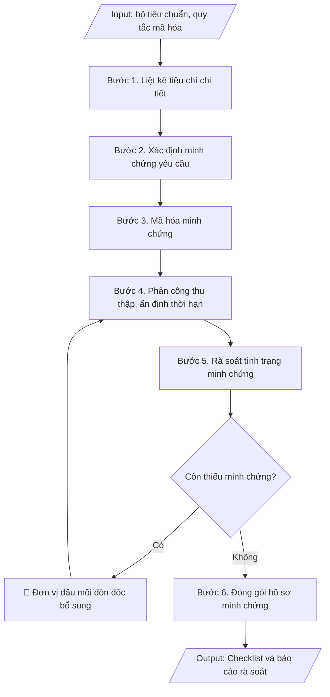

# Skill: Checklist minh chứng kiểm định

## Khi nào dùng
Khi cần rà soát, thu thập và quản lý hệ thống minh chứng phục vụ tự đánh giá /
kiểm định chất lượng CSGD hoặc CTĐT.

## Đầu vào (Input)

| Trường | Mô tả | Bắt buộc |
|---|---|---|
| `doi_tuong` | Kiểm định CSGD / CTĐT (ghi rõ tên) | Có |
| `bo_tieu_chuan` | Danh sách tiêu chuẩn – tiêu chí áp dụng | Có |
| `quy_tac_ma_hoa` | Quy tắc mã minh chứng (VD: H<tieu-chuan>.<tieu-chi>.<stt>) | Không (mặc định: H + số tiêu chuẩn.tiêu chí.stt) |
| `don_vi_dau_moi` | Đơn vị đầu mối từng nhóm minh chứng | Không |

## Quy trình

**Bước 1. Liệt kê tiêu chí**
- Làm gì: Bóc tách `bo_tieu_chuan` thành danh sách tiêu chí chi tiết theo đúng thứ tự (tiêu chuẩn → tiêu chí), đánh số thứ tự đầy đủ; ghi kèm yêu cầu/yếu tố cần đánh giá của từng tiêu chí theo hướng dẫn của bộ tiêu chuẩn.
- Dùng input: `bo_tieu_chuan`, `doi_tuong`.
- Vai trò: Chuyên viên Phòng Khảo thí & ĐBCL · AI hỗ trợ: bóc tách bộ tiêu chuẩn thành danh sách tiêu chí đầy đủ theo đúng thứ tự · ⏱ ~30 phút (ước tính)
- Lưu ý nghiệp vụ: không gộp/bỏ tiêu chí — mỗi tiêu chí đều phải có minh chứng riêng; kiểm tra đang dùng đúng phiên bản bộ tiêu chuẩn hiện hành.
- → Kết quả bước: Danh sách tiêu chí chi tiết đầy đủ của bộ tiêu chuẩn.

**Bước 2. Xác định minh chứng yêu cầu cho mỗi tiêu chí**
- Làm gì: Căn cứ hướng dẫn của bộ tiêu chuẩn, xác định cho từng tiêu chí các loại minh chứng cần có (văn bản, quyết định, số liệu, biên bản, hình ảnh...), mỗi tiêu chí tối thiểu 02–03 minh chứng; ghi tên minh chứng yêu cầu cụ thể (không ghi chung chung "các văn bản liên quan").
- Dùng input: `bo_tieu_chuan`.
- Vai trò: Chuyên viên Phòng Khảo thí & ĐBCL · AI hỗ trợ: đề xuất danh sách minh chứng sơ bộ cho từng tiêu chí · ⏱ ~2 giờ (ước tính)
- Lưu ý nghiệp vụ: bẫy thường gặp — liệt kê minh chứng không gắn với yếu tố cụ thể của tiêu chí, dẫn đến thu thập thừa/thiếu; ưu tiên minh chứng trong chu kỳ đánh giá.
- → Kết quả bước: Bảng minh chứng yêu cầu cho từng tiêu chí (chưa mã hóa).

**Bước 3. Mã hóa minh chứng**
- Làm gì: Áp dụng `quy_tac_ma_hoa` thống nhất toàn trường (mặc định: H + số tiêu chuẩn.tiêu chí.số thứ tự, VD: H1.2.01); gán mã duy nhất cho từng minh chứng, kiểm tra không trùng mã, không sót minh chứng chưa có mã.
- Dùng input: `quy_tac_ma_hoa`, `bo_tieu_chuan`.
- Vai trò: Chuyên viên Phòng Khảo thí & ĐBCL · AI hỗ trợ: gán mã minh chứng theo quy tắc và kiểm tra không trùng mã · ⏱ ~1 giờ (ước tính)
- Lưu ý nghiệp vụ: mã minh chứng phải nhất quán giữa checklist, báo cáo tự đánh giá và hồ sơ lưu — sai một ký tự mã là đoàn đánh giá ngoài không truy xuất được; khi bổ sung minh chứng mới, đánh số thứ tự tiếp theo, không chèn số làm lệch thứ tự cũ.
- → Kết quả bước: Bảng minh chứng đã mã hóa, mỗi mã là duy nhất.

**Bước 4. Phân công thu thập**
- Làm gì: Gán từng minh chứng cho 01 đơn vị đầu mối (`don_vi_dau_moi`) chịu trách nhiệm cung cấp; ấn định thời hạn nộp cụ thể cho từng nhóm minh chứng; gửi văn bản đề nghị các đơn vị cung cấp minh chứng theo mã.
- Dùng input: `don_vi_dau_moi`.
- Vai trò: Trưởng phòng Khảo thí & ĐBCL · AI hỗ trợ: soạn văn bản phân công, lập bảng phân công theo mã minh chứng · ⏱ ~0,5 ngày làm việc (ước tính)
- Lưu ý nghiệp vụ: thời hạn phải trừ hao thời gian kiểm tra, hiệu đính trước khi đóng gói hồ sơ; giao 01 đầu mối duy nhất cho mỗi minh chứng để tránh đùn đẩy.
- → Kết quả bước: Bảng phân công thu thập (mã MC, đơn vị đầu mối, thời hạn).

**Bước 5. Rà soát tình trạng**
- Làm gì: Thu minh chứng từ các đơn vị, kiểm tra từng minh chứng có thật, còn hiệu lực, đúng nội dung yêu cầu; đánh dấu tình trạng từng dòng: Đầy đủ / Cần bổ sung / Thiếu; tổng hợp danh sách minh chứng còn thiếu, gửi văn bản đôn đốc các đơn vị nợ minh chứng.
- Dùng input: `doi_tuong`, `don_vi_dau_moi`.
- Vai trò: Chuyên viên Phòng Khảo thí & ĐBCL · AI hỗ trợ: tổng hợp bảng tình trạng minh chứng sơ bộ, cảnh báo các đơn vị nợ minh chứng · ⏱ ~1 tuần (ước tính)
- Lưu ý nghiệp vụ: minh chứng "có nhưng không đúng nội dung tiêu chí" vẫn tính là Cần bổ sung; đôn đốc bằng văn bản có thời hạn cụ thể, không đôn đốc miệng.
- → Kết quả bước: Bảng checklist đã cập nhật tình trạng + danh sách minh chứng còn thiếu cần đôn đốc.

**Bước 6. Đóng gói hồ sơ**
- Làm gì: Sắp xếp toàn bộ minh chứng theo thứ tự mã; lập danh mục minh chứng kèm theo báo cáo tự đánh giá; chuẩn bị 02 bộ hồ sơ: bản cứng (đóng tập theo tiêu chuẩn) và bản số (scan/file, đặt tên file theo mã MC) phục vụ đoàn đánh giá ngoài.
- Dùng input: `doi_tuong`, `bo_tieu_chuan`.
- Vai trò: Chuyên viên Phòng Khảo thí & ĐBCL · AI hỗ trợ: đối chiếu danh mục minh chứng với hồ sơ thực tế, kiểm tra tên file bản số trùng mã MC · ⏱ ~1 ngày làm việc (ước tính)
- Lưu ý nghiệp vụ: tên file bản số phải trùng mã MC để tra cứu nhanh; kiểm tra lần cuối không thiếu trang, không nhầm mã trước khi niêm phong hồ sơ.
- → Kết quả bước: Hồ sơ minh chứng đã đóng gói (bản cứng + bản số) + danh mục minh chứng.

## Luồng quy trình (Workflow)


## Đầu ra (Output)
- Bảng checklist minh chứng theo từng tiêu chí (mã, tên, đơn vị, thời hạn, tình trạng).
- Hướng dẫn mã hóa minh chứng.
- Báo cáo rà soát: tỷ lệ minh chứng đã đủ / còn thiếu.

**Cấu trúc output chuẩn:** bộ sản phẩm gồm các phần bắt buộc theo đúng thứ tự:
1. Tiêu đề danh mục (DANH MỤC MINH CHỨNG KIỂM ĐỊNH) + đối tượng kiểm định + quy tắc mã hóa áp dụng;
2. Bảng checklist theo từng tiêu chuẩn, mỗi dòng gồm: Mã MC – Tiêu chí – Tên minh chứng yêu cầu – Đơn vị đầu mối – Thời hạn – Tình trạng (Đầy đủ / Cần bổ sung / Thiếu);
3. Báo cáo rà soát (tính đến ngày lập): tổng số minh chứng yêu cầu, số đã đầy đủ (tỷ lệ %), số cần bổ sung, số còn thiếu; liệt kê các đơn vị còn nợ minh chứng nhiều nhất;
4. Hướng dẫn mã hóa minh chứng: quy tắc mã hóa, ví dụ minh họa, nguyên tắc mã duy nhất và nhất quán với báo cáo tự đánh giá.

## Checklist nghiệm thu

- [ ] Đủ 4 phần theo "Cấu trúc output chuẩn": tiêu đề danh mục + đối tượng kiểm định + quy tắc mã hóa; bảng checklist theo từng tiêu chuẩn (Mã MC – Tiêu chí – Tên minh chứng yêu cầu – Đơn vị đầu mối – Thời hạn – Tình trạng); báo cáo rà soát (tổng số minh chứng, số đầy đủ + tỷ lệ %, số cần bổ sung, số còn thiếu; đơn vị nợ nhiều nhất); hướng dẫn mã hóa minh chứng.
- [ ] Mỗi tiêu chí của bộ tiêu chuẩn đều có minh chứng riêng, không gộp/bỏ tiêu chí; ưu tiên minh chứng trong chu kỳ đánh giá.
- [ ] Không bịa đặt minh chứng, mã minh chứng, tình trạng thu thập.
- [ ] Mã minh chứng duy nhất, đúng quy tắc mã hóa, nhất quán giữa checklist, báo cáo tự đánh giá và hồ sơ lưu.
- [ ] Đúng phiên bản bộ tiêu chuẩn hiện hành.
- [ ] Đã qua Human gate: người có thẩm quyền theo quy trình đã duyệt.
- [ ] Mỗi minh chứng có 01 đơn vị đầu mối duy nhất và thời hạn nộp cụ thể; đã đôn đốc bằng văn bản (có thời hạn) các đơn vị nợ minh chứng.
- [ ] Bản số đặt tên file trùng mã minh chứng; đã kiểm tra lần cuối không thiếu trang, không nhầm mã trước khi niêm phong hồ sơ.

Tiêu chí đạt = tất cả các ô được đánh dấu.

## Ví dụ mô phỏng (dữ liệu giả lập)

> Tất cả tên trường, cá nhân, số liệu dưới đây đều là **giả lập**, không liên quan tổ chức/cá nhân có thật.

### Input mẫu

| Trường | Giá trị |
|---|---|
| `doi_tuong` | Kiểm định CTĐT ngành Công nghệ thông tin |
| `bo_tieu_chuan` | 11 tiêu chuẩn đánh giá CTĐT |
| `quy_tac_ma_hoa` | H<tiêu chuẩn>.<tiêu chí>.<số thứ tự> |

### Output mẫu (trích 02 tiêu chí)

```
DANH MỤC MINH CHỨNG KIỂM ĐỊNH
CTĐT ngành Công nghệ thông tin – Trường Đại học A
Quy tắc mã hóa: H<tiêu chuẩn>.<tiêu chí>.<số thứ tự>

Tiêu chuẩn 1. MỤC TIÊU VÀ CHUẨN ĐẦU RA CỦA CHƯƠNG TRÌNH ĐÀO TẠO

| Mã MC | Tiêu chí | Tên minh chứng yêu cầu | Đơn vị đầu mối | Thời hạn | Tình trạng |
|---|---|---|---|---|---|
| H1.1.01 | 1.1 | Quyết định ban hành mục tiêu CTĐT ngành CNTT | P. Đào tạo | 30/11/2026 | Đầy đủ |
| H1.1.02 | 1.1 | Biên bản họp góp ý mục tiêu CTĐT với doanh nghiệp | Khoa CNTT | 30/11/2026 | Đầy đủ |
| H1.2.01 | 1.2 | Quyết định ban hành chuẩn đầu ra CTĐT | P. Đào tạo | 30/11/2026 | Đầy đủ |
| H1.2.02 | 1.2 | Ma trận đối sánh CLO–PLO | Khoa CNTT | 15/12/2026 | Cần bổ sung |
| H1.2.03 | 1.2 | Kết quả khảo sát cựu SV về chuẩn đầu ra | P. KT&ĐBCL | 15/12/2026 | Thiếu |

Tiêu chuẩn 2. BẢN MÔ TẢ CHƯƠNG TRÌNH

| Mã MC | Tiêu chí | Tên minh chứng yêu cầu | Đơn vị đầu mối | Thời hạn | Tình trạng |
|---|---|---|---|---|---|
| H2.1.01 | 2.1 | Khung chương trình đào tạo đã ban hành | P. Đào tạo | 30/11/2026 | Đầy đủ |
| H2.1.02 | 2.1 | Đề cương chi tiết các học phần | Khoa CNTT | 30/11/2026 | Đầy đủ |

BÁO CÁO RÀ SOÁT (tính đến 09/10/2026):
- Tổng số minh chứng yêu cầu: 96 | Đã đầy đủ: 71 (74%) | Cần bổ sung: 14 | Còn thiếu: 11
- 03 đơn vị còn nợ minh chứng nhiều nhất: Khoa CNTT (06), P. KT&ĐBCL (03), P. TCCB (02).

HƯỚNG DẪN MÃ HÓA MINH CHỨNG (trích mẫu)
- Quy tắc: H<tiêu chuẩn>.<tiêu chí>.<số thứ tự> (VD: H1.2.01 là minh chứng 01
  của tiêu chí 2, tiêu chuẩn 1).
- Mỗi mã là duy nhất, không dùng lại mã đã xóa; khi bổ sung minh chứng mới thì
  đánh số thứ tự tiếp theo.
- Mã minh chứng phải nhất quán giữa checklist, báo cáo tự đánh giá và tên file
  bản số (đặt tên file đúng theo mã MC).
```

## Căn cứ & lưu ý
- Thông tư 12/2017/TT-BGDĐT (kiểm định CSGD); Thông tư 04/2016/TT-BGDĐT (đánh giá CTĐT).
- Minh chứng phải là văn bản/số liệu **có thật, còn hiệu lực, lưu trữ được**; không tạo minh chứng
  giả — đoàn đánh giá ngoài sẽ kiểm tra gốc.
- Mã minh chứng phải nhất quán giữa checklist, báo cáo tự đánh giá và hồ sơ lưu.
- Không dùng tên thật của trường/cá nhân khi mô phỏng.
