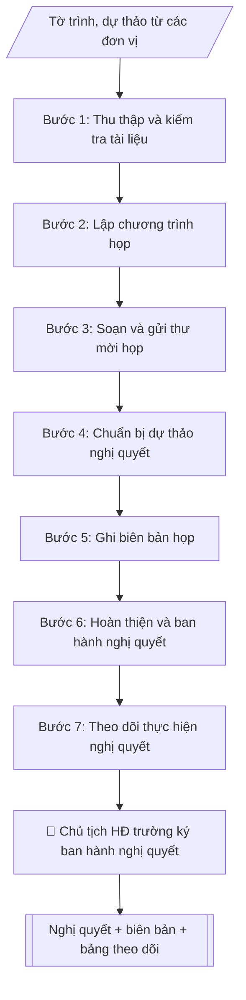

# Chuẩn bị họp Hội đồng trường

## Định dạng và file đầu ra
Định dạng đầu ra có thể chọn theo sản phẩm/yêu cầu: .docx, .pdf. Đọc mục “Định dạng bổ sung” trong quy cách đầu ra trước khi chọn.

**Phải tạo file thực tế để tải xuống, không chỉ trả nội dung trong chat.** Định dạng mặc định của skill: **.docx**. Nếu có bảng số liệu nghiệp vụ yêu cầu file bảng tính riêng, tạo thêm Excel theo yêu cầu; không tự tạo file kiểm tra. Không chờ người dùng yêu cầu xuất file lần nữa. Ưu tiên định dạng người dùng chỉ định; đọc quy tắc xuất file tại references/quy-cach-dau-ra.md.

## Quy cách đầu ra và thông tin thiếu
Khi dựng file Word/Excel, áp dụng mục “Thể thức và bảng biểu khi dựng file” trong quy cách đầu ra (cỡ chữ từng thành phần, bảng nhiều trang, số trang, phụ lục). Đọc [quy cách và cấu trúc sản phẩm](references/quy-cach-dau-ra.md) trước khi soạn/xuất. File giao chỉ gồm sản phẩm nghiệp vụ được yêu cầu; kiểm tra nội bộ không xuất kèm. Thiếu thông tin thì giữ nguyên trường/mục và chỗ điền theo mẫu gốc (dòng dấu chấm, dấu gạch hoặc ô trống); không tự điền dữ liệu mẫu, số 0, mã chờ xác minh hay dòng chờ ký. Mẫu chuyên ngành còn áp dụng được ưu tiên về cấu trúc, mã biểu và người ký. Bản đầy đủ: [quy tắc chung](references/quy-tac-chung.md).

Khi người dùng yêu cầu bộ slide (.pptx), đọc mục “Xuất PowerPoint (.pptx) khi được yêu cầu” trong quy cách đầu ra.

## Kiểm soát áp dụng và phê duyệt
Trước khi chạy, xác định `ngay_ap_dung`, `loai_hinh_truong`, `quy_che_noi_bo`, `nguon_du_lieu`, `nguoi_kiem_duyet`; chỉ hỏi thông tin liên quan nghiệp vụ, không dùng giá trị giả định thay dữ liệu bắt buộc. Đối chiếu căn cứ pháp lý với văn bản gốc, hiệu lực, điều khoản áp dụng và chuyển tiếp. Bản đầy đủ: [quy tắc chung](references/quy-tac-chung.md).

Nếu có cập nhật pháp lý dưới đây, đọc [căn cứ và điều kiện áp dụng](references/phap-ly.md) trước khi làm. Quy trình dưới đây giữ nghiệp vụ từ bản gốc; mọi viện dẫn văn bản, mẫu biểu, điều khoản phải theo căn cứ đã chọn trong phap-ly.md, không theo văn bản cũ.

## Giới hạn và human gate
Không dùng để tổ chức hoạt động mới của hội đồng trường công lập theo mô hình cũ từ 2026. Chỉ xử lý hồ sơ lịch sử hoặc trường tư thục sau khi xác nhận mô hình quản trị và thẩm quyền theo pháp luật hiện hành.

AI hỗ trợ chuẩn bị và đối chiếu; cán bộ phụ trách kiểm tra dữ liệu/căn cứ, người có thẩm quyền duyệt và ký. Không đánh dấu đã ký, đã duyệt, đã công bố khi chưa có chứng cứ. Dữ liệu sinh viên, sức khỏe, nhân sự, tài chính chỉ dùng theo mục đích và phân quyền, che thông tin định danh khi dùng ví dụ (Luật 91/2025/QH15, hiệu lực 01/01/2026); không tải dữ liệu lên dịch vụ ngoài khi chưa có quyền. Bản đầy đủ: [quy tắc chung](references/quy-tac-chung.md).

## Khi nào dùng
Khi Văn phòng Hội đồng trường chuẩn bị các kỳ họp định kỳ hoặc đột xuất của Hội đồng trường:
tổng hợp tài liệu, gửi thư mời, chuẩn bị dự thảo nghị quyết, ghi biên bản và theo dõi thực hiện.

## Đầu vào (Input)
| Trường | Mô tả | Bắt buộc |
|---|---|---|
| `ky_hop` | Kỳ họp thứ mấy, năm nào | Có |
| `thoi_gian_dia_diem` | Thời gian, địa điểm họp | Có |
| `noi_dung_chuong_trinh` | Danh mục nội dung họp, tờ trình của từng nội dung | Có |
| `thanh_phan` | Thành viên Hội đồng trường, khách mời | Có |
| `tai_lieu_kem_theo` | Tờ trình, dự thảo văn bản của từng nội dung | Không |

## Quy trình
**Ràng buộc pháp lý khi thực hiện** (trích references/phap-ly.md; đối chiếu toàn văn và hiệu lực tại ngày nghiệp vụ):
- Luật 125/2025/QH15; Nghị quyết 10/2026/NQ-CP giữ99/2019 một phần; phạm vi: Quản trị cơ sở giáo dục đại học; phân biệt công lập và tư thục: 99/2019 không bị thay thế toàn bộ. NQ 10 loại trừ quy định về hội đồng trường/đại học công lập: điểm b khoản 4 Điều 2, điểm e khoản 1 Điều 3, điểm a khoản 2 Điều 4, điểm c khoản 4 Điều 4, điểm b khoản 2 Điều 5, Điều 7, khoản 1 Điều 9, điểm c khoản 2 Điều 16. Không tổ chức hoạt động mới của hội đồng trường công lập theo quy trình cũ. Yêu cầu loại hình trường, thời điểm xử lý, quy chế hiện hành, quyết định phân quyền; tư thục phải đối chiếu Luật 125.
- Trước Bước 1: chọn căn cứ theo đối tượng, loại hình trường và chuyển tiếp; lập bảng văn bản / điều khoản / lý do áp dụng / bằng chứng. Thiếu văn bản gốc hoặc điều khoản thì ghi nhận nội bộ [CẦN XÁC MINH] (không đưa vào file giao), để trống phần tương ứng, chưa kết luận tuân thủ.
- Các con số, thời hạn, số điều, số mức xếp loại, hệ số và mẫu biểu nêu trong các bước dưới đây được giữ từ quy trình gốc (trước cập nhật pháp lý); chỉ dùng khi đã đối chiếu đúng với căn cứ đã chọn, khác thì theo căn cứ. Danh sách điểm cần đối chiếu: docs/DIEM_CAN_DOI_CHIEU_PHAP_LY.md.

**Bước 1. Thu thập và kiểm tra tài liệu**
- Làm gì: nhận tờ trình, dự thảo văn bản của từng nội dung từ các đơn vị; đối chiếu với `noi_dung_chuong_trinh` xem nội dung nào đã có đủ tài liệu, nội dung nào còn thiếu; lập danh mục tài liệu họp (tên tài liệu – đơn vị trình – tình trạng).
- Dùng input: `noi_dung_chuong_trinh`, `tai_lieu_kem_theo`.
- Vai trò: Chuyên viên Văn phòng Hội đồng trường · AI hỗ trợ: đối chiếu tài liệu với chương trình, lập danh mục đủ/thiếu · ⏱ ~20–30 phút (ước tính)
- Lưu ý nghiệp vụ: đôn đốc đơn vị nộp đúng thời hạn quy định trong quy chế; tài liệu nộp trễ mà không được Chủ tịch chấp thuận thì đưa ra khỏi chương trình kỳ này.
- → Kết quả bước: danh mục tài liệu họp (đủ/thiếu từng nội dung).

**Bước 2. Lập chương trình họp**
- Làm gì: sắp xếp các nội dung trong `noi_dung_chuong_trinh` theo thứ tự ưu tiên (nội dung quan trọng, cần quyết trước lên đầu), phân bổ thời lượng cho từng nội dung và nghỉ giải lao; tính tổng thời gian khớp với `thoi_gian_dia_diem`.
- Dùng input: `noi_dung_chuong_trinh`, `thoi_gian_dia_diem`, `ky_hop`.
- Vai trò: Chánh Văn phòng Hội đồng trường (soát, duyệt chương trình họp) · AI hỗ trợ: sắp xếp nội dung theo thứ tự ưu tiên, phân bổ thời lượng · ⏱ ~20–30 phút (ước tính)
- Lưu ý nghiệp vụ: nội dung chưa có đủ tài liệu (bước 1) thì không đưa vào chương trình chính thức; chương trình phải được Chánh Văn phòng HĐ trường soát trước khi gửi.
- → Kết quả bước: chương trình họp (nội dung + thứ tự + thời lượng).

**Bước 3. Soạn và gửi thư mời họp**
- Làm gì: soạn thư mời ghi rõ kỳ họp, thời gian, địa điểm, thành phần, chương trình và danh mục tài liệu kèm theo; gửi cho toàn bộ `thanh_phan` (thành viên HĐ trường + khách mời) kèm đầy đủ tài liệu trước ngày họp theo quy chế (thường ít nhất 07 ngày); theo dõi xác nhận tham dự.
- Dùng input: `ky_hop`, `thoi_gian_dia_diem`, `thanh_phan`, kết quả bước 1–2.
- Vai trò: Chuyên viên Văn phòng Hội đồng trường (gửi thư mời, theo dõi xác nhận) · AI hỗ trợ: soạn thư mời theo thể thức, đối chiếu danh sách người nhận · ⏱ ~15–20 phút (ước tính)
- Lưu ý nghiệp vụ: kiểm tra danh sách người nhận không sót thành viên; lưu bằng chứng đã gửi (email/biên nhận) để chứng minh đủ thời gian thông báo theo quy chế.
- → Kết quả bước: thư mời đã gửi + danh sách xác nhận tham dự.

**Bước 4. Chuẩn bị dự thảo nghị quyết**
- Làm gì: soạn dự thảo nghị quyết cho từng nội dung trong chương trình: đầy đủ căn cứ pháp lý, phần quyết nghị để trống các ô điền kết quả biểu quyết; kiểm tra mỗi dự thảo bám sát đúng tờ trình của đơn vị, không thêm nội dung ngoài tờ trình.
- Dùng input: `noi_dung_chuong_trinh`, `tai_lieu_kem_theo`, kết quả bước 2.
- Vai trò: Chánh Văn phòng Hội đồng trường (soát dự thảo trước khi gửi) · AI hỗ trợ: soạn dự thảo nghị quyết bám sát tờ trình (phần quyết nghị để trống) · ⏱ ~20–30 phút/nội dung (ước tính)
- Lưu ý nghiệp vụ: AI không được tự quyết nội dung nghị quyết thay Hội đồng; phần quyết nghị để trống, chỉ điền sau khi có kết quả biểu quyết tại cuộc họp.
- → Kết quả bước: bộ dự thảo nghị quyết cho từng nội dung (phần quyết nghị để trống).

**Bước 5. Ghi biên bản họp**
- Làm gì: tại cuộc họp, ghi đầy đủ diễn biến, ý kiến phát biểu của từng thành viên (ghi tên + ý chính), kết quả biểu quyết từng nội dung (số tán thành/không tán thành/không ý kiến).
- Dùng input: `thanh_phan`, kết quả bước 2 (chương trình), `thoi_gian_dia_diem`.
- Vai trò: Thư ký hội đồng (ghi chép trực tiếp tại cuộc họp) · AI hỗ trợ: chuẩn bị trước tài liệu (chương trình, danh sách thành viên) phục vụ ghi chép · ⏱ theo thời lượng cuộc họp (ước tính)
- Lưu ý nghiệp vụ: chỉ ghi ý kiến thực sự phát biểu, không suy diễn thêm bớt; số liệu biểu quyết phải đếm thực tế tại chỗ; biên bản được các thành viên dự họp thông qua trước khi lưu chính thức.
- → Kết quả bước: biên bản họp (diễn biến + ý kiến + kết quả biểu quyết từng nội dung).

**Bước 6. Hoàn thiện và ban hành nghị quyết**
- Làm gì: điền kết quả biểu quyết từ biên bản vào phần quyết nghị còn trống của dự thảo; đối chiếu từng điều với biên bản để bảo đảm khớp 100%; trình Chủ tịch Hội đồng trường ký ban hành; phát hành nghị quyết đến các đơn vị liên quan.
- Dùng input: kết quả bước 4 (dự thảo), kết quả bước 5 (biên bản).
- Vai trò: Chủ tịch Hội đồng trường (ký ban hành nghị quyết) · AI hỗ trợ: đối chiếu điền kết quả biểu quyết vào dự thảo, chuẩn bị tài liệu trình ký · ⏱ ~30 phút–1 giờ (ước tính)
- Lưu ý nghiệp vụ: Chủ tịch là người duy nhất ký ban hành nghị quyết; tuyệt đối không sửa đổi nội dung đã biểu quyết khi hoàn thiện; tài liệu mật không phát tán ngoài thành viên.
- → Kết quả bước: nghị quyết đã ký ban hành + biên bản họp hoàn chỉnh.

**Bước 7. Theo dõi thực hiện nghị quyết**
- Làm gì: lập bảng theo dõi các nghị quyết (nghị quyết – nội dung chính – đơn vị thực hiện – thời hạn – trạng thái); định kỳ đôn đốc đơn vị thực hiện; cập nhật trạng thái và báo cáo tại kỳ họp sau.
- Dùng input: kết quả bước 6 (nghị quyết đã ban hành).
- Vai trò: Văn phòng Hội đồng trường (Chánh Văn phòng theo dõi, đôn đốc) · AI hỗ trợ: lập bảng theo dõi nghị quyết, cập nhật trạng thái và đôn đốc định kỳ · ⏱ ~15–20 phút (ước tính)
- Lưu ý nghiệp vụ: mỗi đầu việc trong nghị quyết phải có đơn vị chịu trách nhiệm và thời hạn cụ thể; nội dung quá hạn chưa thực hiện phải được đưa vào chương trình kỳ họp sau.
- → Kết quả bước: bảng theo dõi thực hiện nghị quyết (cập nhật trạng thái định kỳ).

## Luồng quy trình (Workflow)

## Đầu ra
- Bộ hồ sơ họp: thư mời, chương trình họp, danh mục tài liệu.
- Dự thảo nghị quyết từng nội dung + biên bản họp.
- Bảng theo dõi thực hiện nghị quyết.

File nghiệp vụ thực tế theo định dạng mặc định ở đầu skill hoặc định dạng người dùng yêu cầu, kèm liên kết tải trong phản hồi cuối.

Sản phẩm nghiệp vụ hoàn chỉnh theo [quy cách và cấu trúc](references/quy-cach-dau-ra.md), giữ các trường chưa có dữ liệu ở trạng thái trống. Không xuất kèm checklist/phụ lục kiểm tra đầu ra.

## Kiểm tra nội bộ trước khi giao
Các tiêu chí sau dùng để tự đối chiếu; không sao chép vào file xuất. Mục thiếu dữ liệu được để trống, không đánh dấu đã đạt hoặc đã duyệt.

- [ ] Đủ các phần và đúng bố cục theo cấu trúc tại references/quy-cach-dau-ra.md (không theo cấu trúc của bản gốc).
- [ ] Nội dung chưa có đủ tài liệu không đưa vào chương trình chính thức; tài liệu nộp trễ không được Chủ tịch chấp thuận thì đưa ra khỏi chương trình kỳ này.
- [ ] Thư mời gửi đúng toàn bộ thành viên + khách mời, kèm đầy đủ tài liệu, trước ngày họp theo quy chế (thường ≥ 07 ngày); lưu bằng chứng đã gửi.
- [ ] Dự thảo nghị quyết bám sát tờ trình (không thêm nội dung ngoài tờ trình), căn cứ pháp lý đầy đủ; phần quyết nghị để trống cho đến khi có kết quả biểu quyết.
- [ ] Biên bản ghi đúng ý kiến thực sự phát biểu (không suy diễn thêm bớt); số liệu biểu quyết đếm thực tế tại chỗ; được các thành viên dự họp thông qua trước khi lưu chính thức.
- [ ] Nghị quyết ban hành khớp 100% biên bản đã biểu quyết (tuyệt đối không sửa đổi nội dung đã biểu quyết); chỉ Chủ tịch HĐ trường ký ban hành.
- [ ] Bảng theo dõi: mỗi đầu việc trong nghị quyết có đơn vị chịu trách nhiệm và thời hạn cụ thể; nội dung quá hạn chưa thực hiện đưa vào chương trình kỳ họp sau.
- [ ] Đã qua Human gate: Chánh Văn phòng soát chương trình và dự thảo nghị quyết; Chủ tịch ký ban hành nghị quyết.

## Căn cứ & lưu ý
- Luật Giáo dục đại học (quy định về Hội đồng trường).
- Quy chế tổ chức và hoạt động của Hội đồng trường (văn bản nội bộ).
- Không dùng tên thật của trường/cá nhân khi mô phỏng.

## Tư liệu đối chiếu
Bản gốc trước cập nhật pháp lý (kèm ví dụ giả lập) lưu tại `references/quy-trinh-lich-su.md`, chỉ để đối chiếu hồ sơ lịch sử; không dùng căn cứ, mẫu hay số liệu trong đó làm chỉ dẫn hiện hành.

## Quản trị phiên bản
- Phiên bản gói `1.3.2` (cập nhật 2026-10-10); hồ sơ đầy đủ tại [references/version.json](references/version.json).
- Người phê duyệt nghiệp vụ: **chưa chỉ định**. Trạng thái: dự thảo nghiệp vụ; kiểm tra pháp lý trước thực thi. Ngày cập nhật không đồng nghĩa mọi văn bản đã được rà soát toàn văn.
- Giấy phép theo LICENSE của kho (bản quyền CES Global). Lịch sử thay đổi: CHANGELOG.md.
