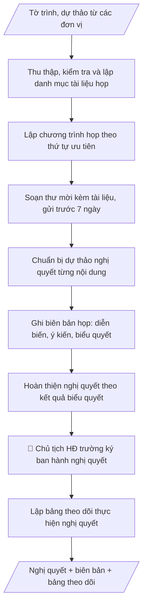

# Tư liệu lịch sử – không phải quy trình hiện hành

Nội dung từ phiên bản nguồn trước 1.1.0, giữ để đối chiếu dữ liệu đầu vào và thay đổi; căn cứ, điều kiện, mẫu và ví dụ có thể đã lỗi thời. Không dùng để thực hiện nghiệp vụ hiện tại.

## Khi nào dùng
Khi Văn phòng Hội đồng trường chuẩn bị các kỳ họp định kỳ hoặc đột xuất của Hội đồng trường:
tổng hợp tài liệu, gửi thư mời, chuẩn bị dự thảo nghị quyết, ghi biên bản và theo dõi thực hiện.

## Đầu vào (Input)

| Trường | Mô tả | Bắt buộc |
|---|---|---|
| `ky_hop` | Kỳ họp thứ mấy, năm nào | Có |
| `thoi_gian_dia_diem` | Thời gian, địa điểm họp | Có |
| `noi_dung_chuong_trinh` | Danh mục nội dung họp, tờ trình của từng nội dung | Có |
| `thanh_phan` | Thành viên Hội đồng trường, khách mời | Có |
| `tai_lieu_kem_theo` | Tờ trình, dự thảo văn bản của từng nội dung | Không |

## Quy trình

**Bước 1. Thu thập và kiểm tra tài liệu**
- Làm gì: nhận tờ trình, dự thảo văn bản của từng nội dung từ các đơn vị; đối chiếu với `noi_dung_chuong_trinh` xem nội dung nào đã có đủ tài liệu, nội dung nào còn thiếu; lập danh mục tài liệu họp (tên tài liệu – đơn vị trình – tình trạng).
- Dùng input: `noi_dung_chuong_trinh`, `tai_lieu_kem_theo`.
- Vai trò: Chuyên viên Văn phòng Hội đồng trường · AI hỗ trợ: đối chiếu tài liệu với chương trình, lập danh mục đủ/thiếu · ⏱ ~20–30 phút (ước tính)
- Lưu ý nghiệp vụ: đôn đốc đơn vị nộp đúng thời hạn quy định trong quy chế; tài liệu nộp trễ mà không được Chủ tịch chấp thuận thì đưa ra khỏi chương trình kỳ này.
- → Kết quả bước: danh mục tài liệu họp (đủ/thiếu từng nội dung).

**Bước 2. Lập chương trình họp**
- Làm gì: sắp xếp các nội dung trong `noi_dung_chuong_trinh` theo thứ tự ưu tiên (nội dung quan trọng, cần quyết trước lên đầu), phân bổ thời lượng cho từng nội dung và nghỉ giải lao; tính tổng thời gian khớp với `thoi_gian_dia_diem`.
- Dùng input: `noi_dung_chuong_trinh`, `thoi_gian_dia_diem`, `ky_hop`.
- Vai trò: Chánh Văn phòng Hội đồng trường (soát, duyệt chương trình họp) · AI hỗ trợ: sắp xếp nội dung theo thứ tự ưu tiên, phân bổ thời lượng · ⏱ ~20–30 phút (ước tính)
- Lưu ý nghiệp vụ: nội dung chưa có đủ tài liệu (bước 1) thì không đưa vào chương trình chính thức; chương trình phải được Chánh Văn phòng HĐ trường soát trước khi gửi.
- → Kết quả bước: chương trình họp (nội dung + thứ tự + thời lượng).

**Bước 3. Soạn và gửi thư mời họp**
- Làm gì: soạn thư mời ghi rõ kỳ họp, thời gian, địa điểm, thành phần, chương trình và danh mục tài liệu kèm theo; gửi cho toàn bộ `thanh_phan` (thành viên HĐ trường + khách mời) kèm đầy đủ tài liệu trước ngày họp theo quy chế (thường ít nhất 07 ngày); theo dõi xác nhận tham dự.
- Dùng input: `ky_hop`, `thoi_gian_dia_diem`, `thanh_phan`, kết quả bước 1–2.
- Vai trò: Chuyên viên Văn phòng Hội đồng trường (gửi thư mời, theo dõi xác nhận) · AI hỗ trợ: soạn thư mời theo thể thức, đối chiếu danh sách người nhận · ⏱ ~15–20 phút (ước tính)
- Lưu ý nghiệp vụ: kiểm tra danh sách người nhận không sót thành viên; lưu bằng chứng đã gửi (email/biên nhận) để chứng minh đủ thời gian thông báo theo quy chế.
- → Kết quả bước: thư mời đã gửi + danh sách xác nhận tham dự.

**Bước 4. Chuẩn bị dự thảo nghị quyết**
- Làm gì: soạn dự thảo nghị quyết cho từng nội dung trong chương trình: đầy đủ căn cứ pháp lý, phần quyết nghị để trống các ô điền kết quả biểu quyết; kiểm tra mỗi dự thảo bám sát đúng tờ trình của đơn vị, không thêm nội dung ngoài tờ trình.
- Dùng input: `noi_dung_chuong_trinh`, `tai_lieu_kem_theo`, kết quả bước 2.
- Vai trò: Chánh Văn phòng Hội đồng trường (soát dự thảo trước khi gửi) · AI hỗ trợ: soạn dự thảo nghị quyết bám sát tờ trình (phần quyết nghị để trống) · ⏱ ~20–30 phút/nội dung (ước tính)
- Lưu ý nghiệp vụ: AI không được tự quyết nội dung nghị quyết thay Hội đồng; phần quyết nghị để trống, chỉ điền sau khi có kết quả biểu quyết tại cuộc họp.
- → Kết quả bước: bộ dự thảo nghị quyết cho từng nội dung (phần quyết nghị để trống).

**Bước 5. Ghi biên bản họp**
- Làm gì: tại cuộc họp, ghi đầy đủ diễn biến, ý kiến phát biểu của từng thành viên (ghi tên + ý chính), kết quả biểu quyết từng nội dung (số tán thành/không tán thành/không ý kiến).
- Dùng input: `thanh_phan`, kết quả bước 2 (chương trình), `thoi_gian_dia_diem`.
- Vai trò: Thư ký hội đồng (ghi chép trực tiếp tại cuộc họp) · AI hỗ trợ: chuẩn bị trước tài liệu (chương trình, danh sách thành viên) phục vụ ghi chép · ⏱ theo thời lượng cuộc họp (ước tính)
- Lưu ý nghiệp vụ: chỉ ghi ý kiến thực sự phát biểu, không suy diễn thêm bớt; số liệu biểu quyết phải đếm thực tế tại chỗ; biên bản được các thành viên dự họp thông qua trước khi lưu chính thức.
- → Kết quả bước: biên bản họp (diễn biến + ý kiến + kết quả biểu quyết từng nội dung).

**Bước 6. Hoàn thiện và ban hành nghị quyết**
- Làm gì: điền kết quả biểu quyết từ biên bản vào phần quyết nghị còn trống của dự thảo; đối chiếu từng điều với biên bản để bảo đảm khớp 100%; trình Chủ tịch Hội đồng trường ký ban hành; phát hành nghị quyết đến các đơn vị liên quan.
- Dùng input: kết quả bước 4 (dự thảo), kết quả bước 5 (biên bản).
- Vai trò: Chủ tịch Hội đồng trường (ký ban hành nghị quyết) · AI hỗ trợ: đối chiếu điền kết quả biểu quyết vào dự thảo, chuẩn bị tài liệu trình ký · ⏱ ~30 phút–1 giờ (ước tính)
- Lưu ý nghiệp vụ: Chủ tịch là người duy nhất ký ban hành nghị quyết; tuyệt đối không sửa đổi nội dung đã biểu quyết khi hoàn thiện; tài liệu mật không phát tán ngoài thành viên.
- → Kết quả bước: nghị quyết đã ký ban hành + biên bản họp hoàn chỉnh.

**Bước 7. Theo dõi thực hiện nghị quyết**
- Làm gì: lập bảng theo dõi các nghị quyết (nghị quyết – nội dung chính – đơn vị thực hiện – thời hạn – trạng thái); định kỳ đôn đốc đơn vị thực hiện; cập nhật trạng thái và báo cáo tại kỳ họp sau.
- Dùng input: kết quả bước 6 (nghị quyết đã ban hành).
- Vai trò: Văn phòng Hội đồng trường (Chánh Văn phòng theo dõi, đôn đốc) · AI hỗ trợ: lập bảng theo dõi nghị quyết, cập nhật trạng thái và đôn đốc định kỳ · ⏱ ~15–20 phút (ước tính)
- Lưu ý nghiệp vụ: mỗi đầu việc trong nghị quyết phải có đơn vị chịu trách nhiệm và thời hạn cụ thể; nội dung quá hạn chưa thực hiện phải được đưa vào chương trình kỳ họp sau.
- → Kết quả bước: bảng theo dõi thực hiện nghị quyết (cập nhật trạng thái định kỳ).
## Luồng quy trình (Workflow)


## Đầu ra (Output)
- Bộ hồ sơ họp: thư mời, chương trình họp, danh mục tài liệu.
- Dự thảo nghị quyết từng nội dung + biên bản họp.
- Bảng theo dõi thực hiện nghị quyết.

**Cấu trúc output chuẩn:** khung mẫu cố định của sản phẩm chính — thư mời họp:
1. Tên cơ quan (VĂN PHÒNG HỘI ĐỒNG TRƯỜNG) và tên trường.
2. Tiêu đề "THƯ MỜI HỌP" + kỳ họp, năm.
3. Kính gửi: các thành viên Hội đồng trường (và khách mời nếu có).
4. Nội dung: thời gian, địa điểm, chương trình họp (từng nội dung + đơn vị trình).
5. Danh mục tài liệu gửi kèm.
6. Yêu cầu xác nhận tham dự + thời hạn xác nhận.
7. Địa danh, ngày tháng năm; chức danh người ký, họ tên.

## Checklist nghiệm thu

- [ ] Thư mời đủ 7 phần theo Cấu trúc output chuẩn: tên cơ quan + trường, tiêu đề + kỳ họp, kính gửi, nội dung (thời gian/địa điểm/chương trình), danh mục tài liệu kèm, yêu cầu xác nhận, địa danh/ngày/người ký.
- [ ] Nội dung chưa có đủ tài liệu không đưa vào chương trình chính thức; tài liệu nộp trễ không được Chủ tịch chấp thuận thì đưa ra khỏi chương trình kỳ này.
- [ ] Thư mời gửi đúng toàn bộ thành viên + khách mời, kèm đầy đủ tài liệu, trước ngày họp theo quy chế (thường ≥ 07 ngày); lưu bằng chứng đã gửi.
- [ ] Dự thảo nghị quyết bám sát tờ trình (không thêm nội dung ngoài tờ trình), căn cứ pháp lý đầy đủ; phần quyết nghị để trống cho đến khi có kết quả biểu quyết.
- [ ] Biên bản ghi đúng ý kiến thực sự phát biểu (không suy diễn thêm bớt); số liệu biểu quyết đếm thực tế tại chỗ; được các thành viên dự họp thông qua trước khi lưu chính thức.
- [ ] Nghị quyết ban hành khớp 100% biên bản đã biểu quyết (tuyệt đối không sửa đổi nội dung đã biểu quyết); chỉ Chủ tịch HĐ trường ký ban hành.
- [ ] Bảng theo dõi: mỗi đầu việc trong nghị quyết có đơn vị chịu trách nhiệm và thời hạn cụ thể; nội dung quá hạn chưa thực hiện đưa vào chương trình kỳ họp sau.
- [ ] Đã qua Human gate: Chánh Văn phòng soát chương trình và dự thảo nghị quyết; Chủ tịch ký ban hành nghị quyết.

> Tiêu chí đạt: tất cả các ô được đánh dấu.

## Ví dụ mô phỏng (dữ liệu giả lập)

> Tất cả tên trường, cá nhân, số liệu dưới đây đều là **giả lập**, không liên quan tổ chức/cá nhân có thật.

### Input mẫu

| Trường | Giá trị |
|---|---|
| `ky_hop` | Kỳ họp thứ 12, năm 2026 |
| `thoi_gian_dia_diem` | 08h00 ngày 20/12/2026, Phòng họp A101 |
| `noi_dung_chuong_trinh` | 1. Thông qua kế hoạch tài chính năm 2027 (Phòng TCKT trình). 2. Phê duyệt chủ trương mở ngành Trí tuệ nhân tạo (Phòng Đào tạo trình). 3. Kiện toàn nhân sự Phó Hiệu trưởng (Ban Giám hiệu trình). |
| `thanh_phan` | 15 thành viên Hội đồng trường; khách mời: Hiệu trưởng, Trưởng phòng TCKT, Trưởng phòng Đào tạo |
| `tai_lieu_kem_theo` | Tờ trình kế hoạch tài chính 2027; Đề án mở ngành; Tờ trình kiện toàn nhân sự |

### Output mẫu

```
TRƯỜNG ĐẠI HỌC A
VĂN PHÒNG HỘI ĐỒNG TRƯỜNG

                        THƯ MỜI HỌP
              Hội đồng trường – Kỳ họp thứ 12 năm 2026

Kính gửi: Các thành viên Hội đồng trường

Văn phòng Hội đồng trường trân trọng kính mời các thành viên dự họp
Hội đồng trường kỳ họp thứ 12 năm 2026:
- Thời gian: 08h00 ngày 20/12/2026
- Địa điểm: Phòng họp A101, Trường Đại học A
- Chương trình:
  1. Thông qua kế hoạch tài chính năm 2027 (Phòng TCKT trình).
  2. Phê duyệt chủ trương mở ngành Trí tuệ nhân tạo (Phòng Đào tạo trình).
  3. Kiện toàn nhân sự Phó Hiệu trưởng (Ban Giám hiệu trình).
Tài liệu họp gửi kèm thư mời này:
  1. Tờ trình kế hoạch tài chính năm 2027 (Phòng TCKT).
  2. Đề án mở ngành Trí tuệ nhân tạo (Phòng Đào tạo).
  3. Tờ trình kiện toàn nhân sự Phó Hiệu trưởng (Ban Giám hiệu).
Đề nghị các thành viên nghiên cứu trước và
xác nhận tham dự trước ngày 18/12/2026.

Thành phố C, ngày 10 tháng 12 năm 2026
                                      CHÁNH VĂN PHÒNG HĐ TRƯỜNG
                                              [CHỜ KÝ]

                                         ThS. Vũ Văn B

----------------------------------------
DỰ THẢO NGHỊ QUYẾT (mẫu cho nội dung 2)

HỘI ĐỒNG TRƯỜNG ĐẠI HỌC A
      Số: .../NQ-HĐT

                          NGHỊ QUYẾT
        Về việc phê duyệt chủ trương mở ngành Trí tuệ nhân tạo

HỘI ĐỒNG TRƯỜNG TRƯỜNG ĐẠI HỌC A
Căn cứ Luật Giáo dục đại học;
Căn cứ đề án mở ngành Trí tuệ nhân tạo do Phòng Đào tạo trình tại kỳ họp
thứ 12 năm 2026;

QUYẾT NGHỊ:
Điều 1. Phê duyệt chủ trương mở ngành Trí tuệ nhân tạo trình độ đại học
tại Trường Đại học A.
Điều 2. Giao Hiệu trưởng chỉ đạo Phòng Đào tạo hoàn thiện đề án theo quy định
và triển khai các bước tiếp theo.
Điều 3. Nghị quyết có hiệu lực kể từ ngày ký.

Nơi nhận:                                   CHỦ TỊCH HỘI ĐỒNG TRƯỜNG
- Ban Giám hiệu (để thực hiện);                        (ký, đóng dấu)
- Các đơn vị liên quan;
- Lưu: VT, VPHĐT.

----------------------------------------
BẢNG THEO DÕI THỰC HIỆN NGHỊ QUYẾT
| STT | Nghị quyết | Nội dung chính | Đơn vị thực hiện | Thời hạn | Trạng thái |
|-----|-----------|----------------|------------------|----------|------------|
| 1 | .../NQ-HĐT | Kế hoạch tài chính 2027 | Phòng TCKT | Quý I/2027 | Chưa thực hiện |
| 2 | .../NQ-HĐT | Chủ trương mở ngành Trí tuệ nhân tạo | Phòng Đào tạo | Quý II/2027 | Chưa thực hiện |
| 3 | .../NQ-HĐT | Kiện toàn nhân sự Phó Hiệu trưởng | Ban Giám hiệu | Quý I/2027 | Chưa thực hiện |
```

## Human gate (người kiểm duyệt)
- Chánh Văn phòng Hội đồng trường tổng hợp tài liệu, soát xét chương trình và dự thảo nghị quyết.
- Chủ tịch Hội đồng trường triệu tập họp và là người duy nhất ký ban hành nghị quyết.
- Biên bản họp được các thành viên dự họp thông qua trước khi lưu chính thức.

## Giới hạn (guardrails)
- AI không tự quyết nội dung nghị quyết thay Hội đồng trường.
- AI không ghi sai kết quả biểu quyết; số liệu biểu quyết phải theo biên bản được thông qua.
- Tài liệu mật của Hội đồng trường không được phát tán ngoài thành viên.

## Căn cứ & lưu ý
- Luật Giáo dục đại học (quy định về Hội đồng trường).
- Quy chế tổ chức và hoạt động của Hội đồng trường (văn bản nội bộ).
- Không dùng tên thật của trường/cá nhân khi mô phỏng.
