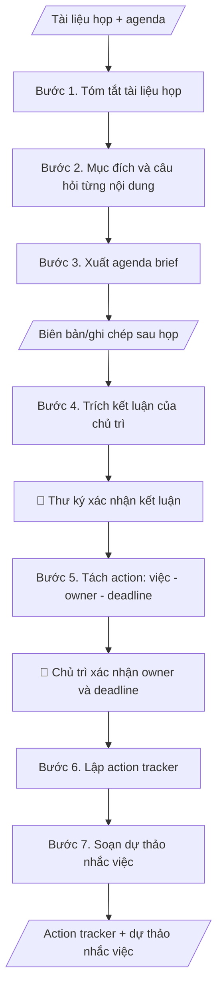

# Skill: Chuẩn bị họp & theo dõi action

## Khi nào dùng
- **Trước họp**: biến chồng tài liệu họp thành agenda brief ngắn gọn (mục đích từng nội dung, câu hỏi cần quyết).
- **Sau họp**: từ biên bản/ghi chép trích kết luận, tách thành đầu việc có owner và deadline, theo dõi trạng thái đến khi hoàn thành.

## Đầu vào (Input)

| Trường | Mô tả | Bắt buộc |
|---|---|---|
| `loai_hop` | Giao ban / Hội đồng / Họp đơn vị / Họp chuyên đề | Có |
| `agenda` | Chương trình họp (các nội dung) | Có |
| `tai_lieu_hop` | Tài liệu kèm từng nội dung (báo cáo, tờ trình...) | Có (cho brief trước họp) |
| `bien_ban_hoac_ghi_chep` | Biên bản/ghi chép sau họp | Có (cho action tracker) |
| `danh_sach_tham_du` | Thành phần tham dự | Không |

## Quy trình

**Pha 1 — Trước họp:**

**Bước 1. Tóm tắt tài liệu họp**
- Làm gì: mỗi tài liệu trong `tai_lieu_hop` tóm tắt 3–5 dòng: vấn đề chính, số liệu chính, đề xuất
  của tài liệu; gắn mỗi tóm tắt với đúng nội dung trong `agenda`.
- Dùng input: `tai_lieu_hop`, `agenda`.
- Vai trò: Thư ký cuộc họp · AI hỗ trợ: tóm tắt từng tài liệu 3–5 dòng, gắn đúng nội dung agenda · ⏱ ~15–30 phút (ước tính)
- Lưu ý nghiệp vụ: tóm tắt trung thành, không thêm ý ngoài tài liệu; tài liệu nào không gắn được với
  nội dung agenda nào thì ghi chú để thư ký kiểm tra.
- → Kết quả bước: bộ tóm tắt tài liệu theo từng nội dung agenda.

**Bước 2. Xác định mục đích và câu hỏi cho từng nội dung**
- Làm gì: với từng nội dung `agenda`, xác định mục đích: thông tin / xin ý kiến / quyết định;
  viết câu hỏi cụ thể mà cuộc họp cần trả lời cho nội dung đó.
- Dùng input: `agenda`, bộ tóm tắt (Bước 1).
- Vai trò: Thư ký cuộc họp · AI hỗ trợ: xác định mục đích (thông tin/xin ý kiến/quyết định) và viết câu hỏi cho từng nội dung · ⏱ ~10–20 phút (ước tính)
- Lưu ý nghiệp vụ: nội dung "xin quyết định" phải có câu hỏi quyết định rõ ràng (quyết cái gì, các phương án
  nào); nội dung chỉ "thông tin" thì không đặt câu hỏi quyết định giả.
- → Kết quả bước: bảng nội dung agenda (nội dung | mục đích | câu hỏi cần trả lời).

**Bước 3. Xuất agenda brief**
- Làm gì: gộp kết quả Bước 1–2 thành agenda brief tối đa 1–2 trang: mỗi nội dung gồm tóm tắt tài liệu +
  mục đích + câu hỏi; ghi `loai_hop`, thời gian, `danh_sach_tham_du` (nếu có).
- Dùng input: kết quả Bước 1–2, `loai_hop`, `danh_sach_tham_du`.
- Vai trò: Thư ký cuộc họp · AI hỗ trợ: gộp thành agenda brief tối đa 1–2 trang · ⏱ ~10–15 phút (ước tính)
- Lưu ý nghiệp vụ: brief để người dự đọc trước — ngắn gọn, mỗi nội dung đọc trong khoảng 1 phút;
  chỉ soạn dự thảo, không tự gửi.
- → Kết quả bước: agenda brief (tối đa 1–2 trang) sẵn sàng gửi người tham dự.

**Pha 2 — Sau họp:**

**Bước 4. Trích kết luận của chủ trì**
- Làm gì: đọc `bien_ban_hoac_ghi_chep`, trích từng kết luận/quyết định của chủ trì, giữ nguyên văn ý quyết định;
  chỗ nào chưa rõ thì đánh dấu "cần xác minh", không suy diễn.
- Dùng input: `bien_ban_hoac_ghi_chep`.
- Vai trò: Thư ký cuộc họp · AI hỗ trợ: trích kết luận của chủ trì từ biên bản; thư ký xác nhận trước khi tách action · ⏱ ~15–30 phút + ~15–30 phút duyệt (ước tính)
- Lưu ý nghiệp vụ: chỉ trích kết luận của chủ trì, không trích ý kiến thảo luận lẻ tẻ; mỗi kết luận phải đủ rõ
  để tách thành action (việc gì, ai, khi nào) — nếu thiếu thì ghi "cần xác minh" để thư ký bổ sung.
- → Kết quả bước: danh sách kết luận đã trích (đánh số, ghi nguồn trong biên bản).

**Bước 5. Tách action theo owner và deadline**
- Làm gì: mỗi kết luận tách thành một hoặc nhiều action; mỗi action ghi rõ: việc gì — ai làm (owner) —
  hạn nào (deadline) — phối hợp với ai; owner lấy từ phân công trong biên bản hoặc `danh_sach_tham_du`.
- Dùng input: danh sách kết luận (Bước 4), `danh_sach_tham_du`.
- Vai trò: Thư ký cuộc họp + Chủ trì cuộc họp · AI hỗ trợ: tách action (việc — owner — deadline); chủ trì xác nhận owner và deadline · ⏱ ~15–20 phút + ~20–30 phút duyệt (ước tính)
- Lưu ý nghiệp vụ: mỗi action chỉ có MỘT owner chính — tránh kiểu "cả phòng cùng làm" không ai chịu trách nhiệm;
  deadline phải là ngày cụ thể, không để "sớm"/"ngay".
- → Kết quả bước: danh sách action (việc | owner | deadline | phối hợp).

**Bước 6. Lập action tracker**
- Làm gì: đưa danh sách action vào bảng theo dõi với các trạng thái: Mới / Đang làm / Quá hạn /
  Hoàn thành / Chờ xác nhận; mỗi dòng ghi chú nguồn (kết luận số mấy của cuộc họp nào).
- Dùng input: danh sách action (Bước 5).
- Vai trò: Thư ký cuộc họp · AI hỗ trợ: lập action tracker với 5 trạng thái, trạng thái ban đầu đều "Mới" · ⏱ ~10–15 phút (ước tính)
- Lưu ý nghiệp vụ: tracker là tài liệu riêng, không ghi đè hay sửa đổi biên bản đã ký duyệt;
  trạng thái ban đầu của mọi action là "Mới".
- → Kết quả bước: action tracker hoàn chỉnh.

**Bước 7. Soạn dự thảo nhắc việc**
- Làm gì: với mỗi action sắp đến hạn (quy ước: trước deadline 3 ngày), soạn dự thảo tin nhắn/email nhắc
  owner cập nhật tiến độ; ghi rõ action số mấy, hạn nào, còn bao nhiêu ngày.
- Dùng input: action tracker (Bước 6).
- Vai trò: Thư ký cuộc họp · AI hỗ trợ: soạn dự thảo nhắc việc (quy ước trước deadline 3 ngày), KHÔNG tự gửi · ⏱ ~10 phút (ước tính)
- Lưu ý nghiệp vụ: chỉ là dự thảo — KHÔNG tự gửi cho bất kỳ ai; người dùng duyệt và gửi thủ công.
- → Kết quả bước: bộ dự thảo nhắc việc theo từng action.
## Luồng quy trình (Workflow)

## Đầu ra (Output)
- Agenda brief trước họp.
- Action tracker (bảng: action | owner | deadline | trạng thái | ghi chú).
- Dự thảo nhắc việc (chưa gửi).

**Cấu trúc output chuẩn** (sản phẩm chính: Action tracker):
1. Tiêu đề: ACTION TRACKER + tên cuộc họp + ngày họp.
2. Danh sách kết luận trích từ biên bản (đánh số, để truy vết từng action về kết luận gốc).
3. Bảng action: # | Action | Owner | Deadline | Trạng thái | Ghi chú (kết luận số mấy).
4. Lịch nhắc việc: action nào nhắc khi nào (quy ước: trước deadline 3 ngày).
5. Dự thảo nhắc việc mẫu (chưa gửi).

## Checklist nghiệm thu

- [ ] Output đầy đủ 5 phần theo Cấu trúc output chuẩn: tiêu đề tracker + tên cuộc họp + ngày họp; danh sách kết luận đánh số; bảng action (# | Action | Owner | Deadline | Trạng thái | Ghi chú); lịch nhắc việc; dự thảo nhắc việc mẫu.
- [ ] Mọi action đều có MỘT owner chính duy nhất và deadline là ngày cụ thể (không "sớm"/"ngay").
- [ ] Mỗi action truy vết được về đúng kết luận số mấy của cuộc họp nào (cột Ghi chú).
- [ ] Kết luận trích trung thành với biên bản gốc; chỗ chưa rõ đã đánh dấu "cần xác minh", không suy diễn.
- [ ] Trạng thái ban đầu của mọi action là "Mới"; tracker là tài liệu riêng, không sửa biên bản đã ký duyệt.
- [ ] Dự thảo nhắc việc chỉ ở trạng thái dự thảo — chưa gửi cho bất kỳ ai.
- [ ] Lịch nhắc việc đúng quy ước: nhắc trước deadline 3 ngày, ghi rõ còn bao nhiêu ngày.
- [ ] Đã qua Human gate: thư ký đã xác nhận kết luận trích chính xác; chủ trì đã xác nhận owner và deadline của từng action.

> Tiêu chí đạt: tất cả các ô được đánh dấu.

## Ví dụ mô phỏng (dữ liệu giả lập)

> Tất cả tên trường, cá nhân, số liệu dưới đây đều là **giả lập**.
> Ví dụ: họp giao ban Ban Giám hiệu — áp dụng tương tự cho mọi cuộc họp.

### Input mẫu

| Trường | Giá trị |
|---|---|
| `loai_hop` | Giao ban Ban Giám hiệu |
| `agenda` | 1. Tiến độ tuyển sinh đợt 2. 2. Chủ trương hội thảo sinh viên. 3. Sửa chữa giảng đường B |
| `bien_ban_hoac_ghi_chep` | (Biên bản cuộc họp ngày 12/10/2026: kết luận 3 nội dung như trong skill soan-bien-ban-hop) |

### Output mẫu

**ACTION TRACKER — Giao ban Ban Giám hiệu ngày 12/10/2026**

**Kết luận trích từ biên bản (3 kết luận):** (1) Hoàn thành tuyển sinh đợt 2; (2) Phòng KHCN trình kế hoạch chi tiết hội thảo sinh viên; (3) Hoàn thành sửa chữa giảng đường B.

| # | Action | Owner | Deadline | Trạng thái | Ghi chú |
|---|---|---|---|---|---|
| 1 | Hoàn thành tuyển sinh đợt 2 | Phòng Đào tạo (ThS. Đỗ Thị A) | 25/10/2026 | Đang làm | Kết luận số 1 |
| 2 | Trình kế hoạch chi tiết hội thảo SV | Phòng KHCN (PGS.TS. Trần Văn B) | 20/10/2026 | Mới | Kết luận số 2 |
| 3 | Hoàn thành sửa chữa giảng đường B | Phòng Quản trị – Thiết bị | 30/10/2026 | Mới | Kết luận số 3 |

**Lịch nhắc việc:** action #2 nhắc ngày 17/10/2026; action #1 nhắc ngày 22/10/2026; action #3 nhắc ngày 27/10/2026 (mỗi action nhắc trước deadline 3 ngày).

**Dự thảo nhắc việc (chưa gửi):**
"Kính gửi Phòng KHCN: action #2 đến hạn ngày 20/10/2026 (còn 3 ngày). Đề nghị cập nhật tiến độ..."

## Human gate (người kiểm duyệt)
1. **Thư ký cuộc họp**: xác nhận kết luận trích từ biên bản là chính xác trước khi tách action.
2. **Chủ trì**: xác nhận owner và deadline của từng action — tracker chỉ có hiệu lực sau bước này.
3. **Owner**: là người cập nhật trạng thái action của mình; AI không tự đổi trạng thái.

## Giới hạn (guardrails)
- KHÔNG tự gửi lịch họp, giấy mời, hay nhắc việc cho bất kỳ ai.
- KHÔNG ghi đè, sửa đổi biên bản đã được ký duyệt — tracker là tài liệu riêng.
- KHÔNG tự đánh dấu action "hoàn thành" khi chưa có xác nhận của owner/chủ trì.
- Trích kết luận phải trung thành với biên bản; chỗ nào chưa rõ thì đánh dấu "cần xác minh", không suy diễn.

## Căn cứ & lưu ý
- Kết hợp tốt với skill `soan-bien-ban-hop` (Tầng 2): biên bản là đầu vào của tracker.
- Mọi ví dụ đều giả lập; không dùng tên thật của trường/cá nhân.
