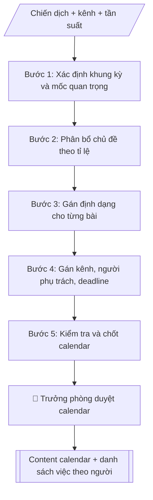

# Content calendar truyền thông

## Quy cách đầu ra và thông tin thiếu

Đọc [quy cách và cấu trúc sản phẩm](references/quy-cach-dau-ra.md) trước khi soạn/xuất. File giao chỉ gồm văn bản hoặc sản phẩm nghiệp vụ được yêu cầu; kiểm tra nội bộ không xuất kèm. Thiếu thông tin giữ nguyên trường/mục và chỗ điền theo mẫu gốc (dòng dấu chấm, dấu gạch hoặc ô trống); không tự điền dữ liệu mẫu, số 0, mã chờ xác minh hoặc dòng chờ ký. Mẫu chuyên ngành còn áp dụng được ưu tiên về cấu trúc, mã biểu và người ký. Các trường “bắt buộc” là điều kiện hoàn thiện hồ sơ, không ngăn việc soạn bản có chỗ chừa để điền. Mọi chỉ dẫn “để trống” trong skill được hiểu là không điền dữ liệu và giữ cách chừa chỗ của mẫu gốc, không phải xóa dấu chấm của mẫu.


## Kiểm soát áp dụng và phê duyệt

Trước khi chạy quy trình, xác định `ngay_ap_dung`, `loai_hinh_truong`, `quy_che_noi_bo`, `nguon_du_lieu` và `nguoi_kiem_duyet`. Chỉ yêu cầu thông tin có liên quan đến nghiệp vụ; không dùng giá trị giả định thay dữ liệu bắt buộc. Đối chiếu nội bộ hồ sơ có yếu tố pháp lý với văn bản gốc, hiệu lực, điều khoản áp dụng và chuyển tiếp; không tự đính kèm bảng kiểm tra vào file giao.

## Giới hạn và human gate

AI hỗ trợ chuẩn bị và đối chiếu. Cán bộ phụ trách kiểm tra dữ liệu/căn cứ, người có thẩm quyền duyệt và ký. Văn bản soạn chưa được coi là đã ban hành; không tự chèn nhãn trạng thái kiểm duyệt vào file giao; không đánh dấu đã ký, đã duyệt hoặc đã công bố nếu chưa có chứng cứ. Dữ liệu sinh viên, sức khỏe, nhân sự và tài chính phải hạn chế theo mục đích, phân quyền và che thông tin định danh khi dùng ví dụ. Không tải dữ liệu lên dịch vụ ngoài khi chưa có quyền. Kiểm tra Luật 91/2025/QH15 về bảo vệ dữ liệu cá nhân (hiệu lực 01/01/2026) và quy định áp dụng trước xử lý/chia sẻ dữ liệu cá nhân.

## Khi nào dùng
Khi cần lên lịch đăng bài chi tiết theo tuần hoặc tháng cho các kênh (website, fanpage, TikTok,
YouTube...), đảm bảo nội dung bám chiến dịch trong kế hoạch truyền thông năm.

## Đầu vào (Input)

| Trường | Mô tả | Bắt buộc |
|---|---|---|
| `ky` | Tuần/tháng áp dụng (VD: tuần 3 tháng 10/2026) | Có |
| `chien_dich` | Chiến dịch đang chạy trong kỳ | Có |
| `kenh` | Các kênh cần lên lịch | Có |
| `tan_suat` | Số bài/tuần theo từng kênh | Có |
| `chu_de_uu_tien` | Chủ đề/sự kiện cần ưu tiên trong kỳ | Không |
| `doi_ngu` | Danh sách người phụ trách (biên tập, thiết kế, quay dựng) | Không |

## Quy trình

**Bước 1. Xác định khung kỳ và mốc quan trọng**
- Làm gì: xác định số ngày trong kỳ; liệt kê sự kiện/mốc quan trọng (ngày lễ, deadline tuyển sinh, sự kiện của trường, ngày diễn ra chiến dịch); đánh dấu những ngày bắt buộc phải có bài.
- Dùng input: `ky`, `chien_dich`, `chu_de_uu_tien`.
- Vai trò: Chuyên viên Phòng Truyền thông – Tuyển sinh · AI hỗ trợ: xử lý sơ bộ, tổng hợp · ⏱ ~30–90 phút (ước tính)
- Lưu ý nghiệp vụ: ngày diễn ra sự kiện phải có bài trước (nhá hàng), trong (tường thuật), sau (recap); không để trống ngày cao điểm của chiến dịch.
- → Kết quả bước: Khung kỳ với các mốc bắt buộc phải có bài.

**Bước 2. Phân bổ chủ đề theo tỉ lệ**
- Làm gì: tính tổng số bài = tần suất × số kênh; phân bổ chủ đề theo tỉ lệ gợi ý: 40% tuyển sinh/đào tạo, 30% đời sống sinh viên, 20% nghiên cứu/khoa học, 10% thương hiệu; ưu tiên đưa chủ đề trong `chu_de_uu_tien` vào lịch.
- Dùng input: `tan_suat`, `kenh`, `chu_de_uu_tien`, `chien_dich`.
- Vai trò: Chuyên viên Phòng Truyền thông – Tuyển sinh · AI hỗ trợ: tính toán, phân tích số liệu · ⏱ ~1–2 giờ (ước tính)
- Lưu ý nghiệp vụ: tỉ lệ là gợi ý — cao điểm tuyển sinh thì tăng tỉ trọng tuyển sinh; không trùng chủ đề trong cùng kỳ.
- → Kết quả bước: Danh sách chủ đề đã phân bổ theo tỉ lệ.

**Bước 3. Gán định dạng cho từng bài**
- Làm gì: với từng chủ đề, chọn định dạng phù hợp kênh và nguồn lực: bài viết, infographic, video ngắn, livestream, album ảnh...; ghi yêu cầu sản xuất sơ bộ cho từng bài.
- Dùng input: `kenh`, `doi_ngu` (năng lực đội ngũ quyết định định dạng khả thi).
- Vai trò: Chuyên viên Phòng Truyền thông – Tuyển sinh · AI hỗ trợ: soạn dự thảo · ⏱ ~30–60 phút (ước tính)
- Lưu ý nghiệp vụ: định dạng nặng (video, livestream) phải đặt lịch sản xuất sớm; mỗi kênh nên đa dạng định dạng trong kỳ, tránh một màu.
- → Kết quả bước: Danh sách bài với định dạng đã gán.

**Bước 4. Gán kênh, người phụ trách và deadline**
- Làm gì: với từng bài: gán kênh đăng, người phụ trách (biên tập/thiết kế/quay dựng), deadline hoàn thành trước ngày đăng ít nhất 1–2 ngày; cân đối khối lượng, tránh dồn việc cho một người.
- Dùng input: `doi_ngu`, `kenh`.
- Vai trò: Chuyên viên Phòng Truyền thông – Tuyển sinh · AI hỗ trợ: lập bảng biểu, định dạng · ⏱ ~1–2 giờ (ước tính)
- Lưu ý nghiệp vụ: deadline sản xuất phải trừ thời gian duyệt bài; người phụ trách phải xác nhận đã nhận việc.
- → Kết quả bước: Bảng phân công (bài – kênh – người phụ trách – deadline).

**Bước 5. Kiểm tra và chốt calendar**
- Làm gì: kiểm tra 4 điểm: không trùng chủ đề, phủ đủ chiến dịch, cân đối tải việc giữa các thành viên, có ít nhất 1–2 bài dự phòng cho tình huống đột xuất; xuất bảng calendar + danh sách việc theo từng người.
- Dùng input: (kết quả các Bước 1–4).
- Vai trò: Trưởng phòng Truyền thông – Tuyển sinh · AI hỗ trợ: đối chiếu tự động, cảnh báo sai lệch · ⏱ ~1–2 giờ (ước tính)
- Lưu ý nghiệp vụ: bài dự phòng là bắt buộc; lịch đã duyệt chỉ được thay đổi khi có phê duyệt.
- → Kết quả bước: Content calendar hoàn chỉnh + danh sách việc theo người phụ trách.

## Luồng quy trình (Workflow)


```

## Đầu ra

Sản phẩm nghiệp vụ hoàn chỉnh theo [quy cách và cấu trúc](references/quy-cach-dau-ra.md), giữ các trường chưa có dữ liệu ở trạng thái trống. Không xuất kèm checklist/phụ lục kiểm tra đầu ra.

## Kiểm tra nội bộ trước khi giao

- [ ] Bố cục khớp mẫu áp dụng và cấu trúc tại references/quy-cach-dau-ra.md.
- [ ] Có đầy đủ sản phẩm: Bảng content calendar (markdown): ngày, chủ đề, định dạng, kênh, người phụ trách, trạng…
- [ ] Có đầy đủ sản phẩm: Danh sách việc theo từng người phụ trách
- [ ] Mọi số liệu, tên, ngày tháng trong output khớp với Input đã cung cấp (không thêm bớt, không suy đoán)
- [ ] Không bịa đặt số liệu, minh chứng, trích dẫn hay căn cứ
- [ ] Đúng thể thức, định dạng văn bản theo quy định hiện hành
- [ ] Căn cứ pháp lý nêu đầy đủ, còn hiệu lực tại thời điểm lập
- [ ] Đã qua Human gate: người có thẩm quyền đã kiểm tra/ký duyệt trước khi phát hành
- [ ] Ngày diễn ra sự kiện phải có bài trước (nhá hàng), trong (tường thuật), sau (recap)
- [ ] Tỉ lệ là gợi ý — cao điểm tuyển sinh thì tăng tỉ trọng tuyển sinh

> Tiêu chí đạt: tất cả các ô đều được đánh dấu.

## Human gate (người kiểm duyệt)
- Trưởng phòng duyệt content calendar trước khi giao sản xuất.
- Biên tập viên duyệt từng bài trước khi đăng theo lịch.

## Giới hạn (guardrails)
- Không tự đăng bài lên bất kỳ kênh nào.
- Không dùng hình ảnh, âm thanh không rõ bản quyền.
- Không tự ý thay đổi lịch đã duyệt khi chưa có phê duyệt.

## Căn cứ & lưu ý
- Brand voice: trẻ trung, học thuật — áp dụng cho mọi định dạng.
- Mọi số liệu tuyển sinh trong bài phải khớp với đề án tuyển sinh đã ban hành.
- Không dùng tên thật của trường/cá nhân khi mô phỏng.

## Quản trị phiên bản

- Phiên bản gói: `1.2.1`; ngày cập nhật: `2026-10-10`.
- Kho nguồn: https://github.com/phamtruong91/university-skills-framework
- Người duy trì trên GitHub: `phamtruong91` (Phạm Văn Trường). Người phê duyệt nghiệp vụ: **chưa chỉ định**.
- Commit nguồn trước cập nhật: `346719e6b0318ed034b4b016703f79733aa575e7`. Commit chứa phiên bản này xem bằng `git log -1 -- skills/content-calendar-truyen-thong`; không tự gán SHA chưa tạo.
- Giấy phép: theo LICENSE của kho; bản quyền CES Global.
- Lịch sử 1.1.0: bổ sung metadata giao diện, kiểm soát áp dụng, quản trị phiên bản.
- Trạng thái: dự thảo nghiệp vụ; kiểm tra pháp lý trước thực thi. Ngày cập nhật không đồng nghĩa mọi văn bản đã được rà soát toàn văn.
