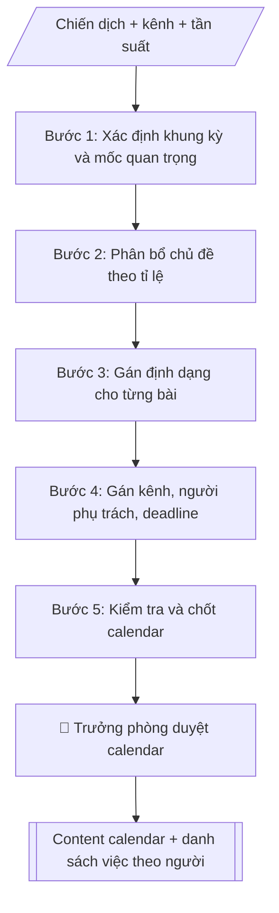

# Skill: Content calendar truyền thông

## Khi nào dùng
Khi cần lên lịch đăng bài chi tiết theo tuần hoặc tháng cho các kênh (website, fanpage, TikTok,
YouTube...), đảm bảo nội dung bám chiến dịch trong kế hoạch truyền thông năm.

## Đầu vào (Input)

| Trường | Mô tả | Bắt buộc |
|---|---|---|
| `ky` | Tuần/tháng áp dụng (VD: tuần 3 tháng 10/2026) | Có |
| `chien_dich` | Chiến dịch đang chạy trong kỳ | Có |
| `kenh` | Các kênh cần lên lịch | Có |
| `tan_suat` | Số bài/tuần theo từng kênh | Có |
| `chu_de_uu_tien` | Chủ đề/sự kiện cần ưu tiên trong kỳ | Không |
| `doi_ngu` | Danh sách người phụ trách (biên tập, thiết kế, quay dựng) | Không |

## Quy trình

**Bước 1. Xác định khung kỳ và mốc quan trọng**
- Làm gì: xác định số ngày trong kỳ; liệt kê sự kiện/mốc quan trọng (ngày lễ, deadline tuyển sinh, sự kiện của trường, ngày diễn ra chiến dịch); đánh dấu những ngày bắt buộc phải có bài.
- Dùng input: `ky`, `chien_dich`, `chu_de_uu_tien`.
- Vai trò: Chuyên viên Phòng Truyền thông – Tuyển sinh · AI hỗ trợ: xử lý sơ bộ, tổng hợp · ⏱ ~30–90 phút (ước tính)
- Lưu ý nghiệp vụ: ngày diễn ra sự kiện phải có bài trước (nhá hàng), trong (tường thuật), sau (recap); không để trống ngày cao điểm của chiến dịch.
- → Kết quả bước: Khung kỳ với các mốc bắt buộc phải có bài.

**Bước 2. Phân bổ chủ đề theo tỉ lệ**
- Làm gì: tính tổng số bài = tần suất × số kênh; phân bổ chủ đề theo tỉ lệ gợi ý: 40% tuyển sinh/đào tạo, 30% đời sống sinh viên, 20% nghiên cứu/khoa học, 10% thương hiệu; ưu tiên đưa chủ đề trong `chu_de_uu_tien` vào lịch.
- Dùng input: `tan_suat`, `kenh`, `chu_de_uu_tien`, `chien_dich`.
- Vai trò: Chuyên viên Phòng Truyền thông – Tuyển sinh · AI hỗ trợ: tính toán, phân tích số liệu · ⏱ ~1–2 giờ (ước tính)
- Lưu ý nghiệp vụ: tỉ lệ là gợi ý — cao điểm tuyển sinh thì tăng tỉ trọng tuyển sinh; không trùng chủ đề trong cùng kỳ.
- → Kết quả bước: Danh sách chủ đề đã phân bổ theo tỉ lệ.

**Bước 3. Gán định dạng cho từng bài**
- Làm gì: với từng chủ đề, chọn định dạng phù hợp kênh và nguồn lực: bài viết, infographic, video ngắn, livestream, album ảnh...; ghi yêu cầu sản xuất sơ bộ cho từng bài.
- Dùng input: `kenh`, `doi_ngu` (năng lực đội ngũ quyết định định dạng khả thi).
- Vai trò: Chuyên viên Phòng Truyền thông – Tuyển sinh · AI hỗ trợ: soạn dự thảo · ⏱ ~30–60 phút (ước tính)
- Lưu ý nghiệp vụ: định dạng nặng (video, livestream) phải đặt lịch sản xuất sớm; mỗi kênh nên đa dạng định dạng trong kỳ, tránh một màu.
- → Kết quả bước: Danh sách bài với định dạng đã gán.

**Bước 4. Gán kênh, người phụ trách và deadline**
- Làm gì: với từng bài: gán kênh đăng, người phụ trách (biên tập/thiết kế/quay dựng), deadline hoàn thành trước ngày đăng ít nhất 1–2 ngày; cân đối khối lượng, tránh dồn việc cho một người.
- Dùng input: `doi_ngu`, `kenh`.
- Vai trò: Chuyên viên Phòng Truyền thông – Tuyển sinh · AI hỗ trợ: lập bảng biểu, định dạng · ⏱ ~1–2 giờ (ước tính)
- Lưu ý nghiệp vụ: deadline sản xuất phải trừ thời gian duyệt bài; người phụ trách phải xác nhận đã nhận việc.
- → Kết quả bước: Bảng phân công (bài – kênh – người phụ trách – deadline).

**Bước 5. Kiểm tra và chốt calendar**
- Làm gì: kiểm tra 4 điểm: không trùng chủ đề, phủ đủ chiến dịch, cân đối tải việc giữa các thành viên, có ít nhất 1–2 bài dự phòng cho tình huống đột xuất; xuất bảng calendar + danh sách việc theo từng người.
- Dùng input: (kết quả các Bước 1–4).
- Vai trò: Trưởng phòng Truyền thông – Tuyển sinh · AI hỗ trợ: đối chiếu tự động, cảnh báo sai lệch · ⏱ ~1–2 giờ (ước tính)
- Lưu ý nghiệp vụ: bài dự phòng là bắt buộc; lịch đã duyệt chỉ được thay đổi khi có phê duyệt.
- → Kết quả bước: Content calendar hoàn chỉnh + danh sách việc theo người phụ trách.

## Luồng quy trình (Workflow)


```

## Đầu ra (Output)
- Bảng content calendar (markdown): ngày, chủ đề, định dạng, kênh, người phụ trách, trạng thái.
- Danh sách việc theo từng người phụ trách.

**Cấu trúc output chuẩn:** Content calendar gồm các phần bắt buộc theo đúng thứ tự sau:
1. Tiêu đề: "CONTENT CALENDAR — TUẦN/THÁNG ..." + tên trường + dòng chiến dịch (+ ghi chú giả lập nếu mô phỏng).
2. Bảng calendar với các cột: Ngày – Chủ đề – Định dạng – Kênh – Phụ trách – Trạng thái.
3. Danh sách việc theo từng người phụ trách.

## Checklist nghiệm thu

- [ ] Đủ các phần theo "Cấu trúc output chuẩn": Tiêu đề; Bảng calendar với các cột; Danh sách việc theo từng người phụ trách.
- [ ] Có đầy đủ sản phẩm: Bảng content calendar (markdown): ngày, chủ đề, định dạng, kênh, người phụ trách, trạng…
- [ ] Có đầy đủ sản phẩm: Danh sách việc theo từng người phụ trách
- [ ] Mọi số liệu, tên, ngày tháng trong output khớp với Input đã cung cấp (không thêm bớt, không suy đoán)
- [ ] Không bịa đặt số liệu, minh chứng, trích dẫn hay căn cứ
- [ ] Đúng thể thức, định dạng văn bản theo quy định hiện hành
- [ ] Căn cứ pháp lý nêu đầy đủ, còn hiệu lực tại thời điểm lập
- [ ] Đã qua Human gate: người có thẩm quyền đã kiểm tra/ký duyệt trước khi phát hành
- [ ] Ngày diễn ra sự kiện phải có bài trước (nhá hàng), trong (tường thuật), sau (recap)
- [ ] Tỉ lệ là gợi ý — cao điểm tuyển sinh thì tăng tỉ trọng tuyển sinh

> Tiêu chí đạt: tất cả các ô đều được đánh dấu.

## Ví dụ mô phỏng (dữ liệu giả lập)

> Tất cả tên trường, cá nhân, số liệu dưới đây đều là **giả lập**.

### Input mẫu

| Trường | Giá trị |
|---|---|
| `ky` | Tuần 3, tháng 10/2026 (12–17/10/2026) |
| `chien_dich` | Cao điểm tư vấn tuyển sinh |
| `kenh` | Fanpage, TikTok, Website |
| `tan_suat` | Fanpage 5 bài/tuần, TikTok 3 video/tuần, Website 2 bài/tuần |
| `chu_de_uu_tien` | Ngày hội tư vấn 17/10; gương sinh viên tiêu biểu |

### Output mẫu

```
CONTENT CALENDAR — TUẦN 3, THÁNG 10/2026 (Trường Đại học A — giả lập)
Chiến dịch: Cao điểm tư vấn tuyển sinh

| Ngày | Chủ đề | Định dạng | Kênh | Phụ trách | Trạng thái |
|------|--------|-----------|------|-----------|-----------|
| 12/10 | 5 lý do chọn ngành CNTT tại A | Infographic | Fanpage | BTV An | Chờ duyệt |
| 13/10 | Một ngày của sinh viên năm nhất | Video 60s | TikTok | Quay dựng Bình | Đang sản xuất |
| 14/10 | Hướng dẫn đăng ký xét học bạ online | Bài viết + ảnh | Website, Fanpage | BTV An | Chờ duyệt |
| 15/10 | Gương SV đạt học bổng toàn phần | Bài phỏng vấn | Website, Fanpage | BTV Chi | Lên ý tưởng |
| 16/10 | Nhá hàng Ngày hội tư vấn 17/10 | Teaser video 30s | TikTok, Fanpage | Quay dựng Bình | Đang sản xuất |
| 17/10 | Livestream Ngày hội tư vấn | Livestream | Fanpage | Cả nhóm | Chuẩn bị |
```

DANH SÁCH VIỆC THEO NGƯỜI PHỤ TRÁCH
- BTV An: 12/10 (infographic 5 lý do chọn ngành CNTT); 14/10 (bài viết hướng dẫn đăng ký xét học bạ)
- Quay dựng Bình: 13/10 (video 60s một ngày của SV năm nhất); 16/10 (teaser video 30s Ngày hội tư vấn)
- BTV Chi: 15/10 (bài phỏng vấn gương SV học bổng toàn phần)
- Cả nhóm: 17/10 (livestream Ngày hội tư vấn)
```

## Human gate (người kiểm duyệt)
- Trưởng phòng duyệt content calendar trước khi giao sản xuất.
- Biên tập viên duyệt từng bài trước khi đăng theo lịch.

## Giới hạn (guardrails)
- Không tự đăng bài lên bất kỳ kênh nào.
- Không dùng hình ảnh, âm thanh không rõ bản quyền.
- Không tự ý thay đổi lịch đã duyệt khi chưa có phê duyệt.

## Căn cứ & lưu ý
- Brand voice: trẻ trung, học thuật — áp dụng cho mọi định dạng.
- Mọi số liệu tuyển sinh trong bài phải khớp với đề án tuyển sinh đã ban hành.
- Không dùng tên thật của trường/cá nhân khi mô phỏng.
