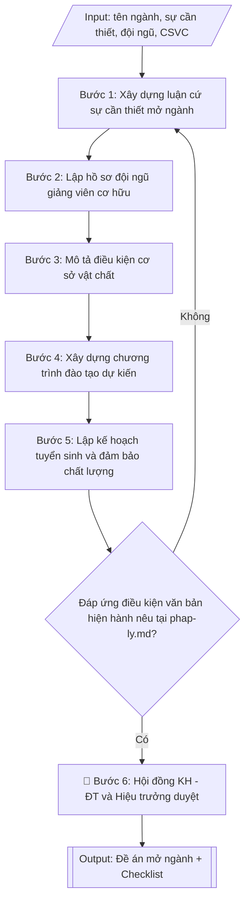

# Soạn đề án mở ngành đào tạo

## Định dạng và file đầu ra
Định dạng đầu ra có thể chọn theo sản phẩm/yêu cầu: .docx, .pdf. Đọc mục “Định dạng bổ sung” trong quy cách đầu ra trước khi chọn.

**Phải tạo file thực tế để tải xuống, không chỉ trả nội dung trong chat.** Định dạng mặc định của skill: **.docx**. Nếu có bảng số liệu nghiệp vụ yêu cầu file bảng tính riêng, tạo thêm Excel theo yêu cầu; không tự tạo file kiểm tra. Không chờ người dùng yêu cầu xuất file lần nữa. Ưu tiên định dạng người dùng chỉ định; đọc quy tắc xuất file tại references/quy-cach-dau-ra.md.

## Quy cách đầu ra và thông tin thiếu
Đọc [quy cách và cấu trúc sản phẩm](references/quy-cach-dau-ra.md) trước khi soạn/xuất. File giao chỉ gồm sản phẩm nghiệp vụ được yêu cầu; kiểm tra nội bộ không xuất kèm. Thiếu thông tin thì giữ nguyên trường/mục và chỗ điền theo mẫu gốc (dòng dấu chấm, dấu gạch hoặc ô trống); không tự điền dữ liệu mẫu, số 0, mã chờ xác minh hay dòng chờ ký. Mẫu chuyên ngành còn áp dụng được ưu tiên về cấu trúc, mã biểu và người ký. Bản đầy đủ: [quy tắc chung](references/quy-tac-chung.md).

## Kiểm soát áp dụng và phê duyệt
Trước khi chạy, xác định `ngay_ap_dung`, `loai_hinh_truong`, `quy_che_noi_bo`, `nguon_du_lieu`, `nguoi_kiem_duyet`; chỉ hỏi thông tin liên quan nghiệp vụ, không dùng giá trị giả định thay dữ liệu bắt buộc. Đối chiếu căn cứ pháp lý với văn bản gốc, hiệu lực, điều khoản áp dụng và chuyển tiếp. Bản đầy đủ: [quy tắc chung](references/quy-tac-chung.md).

Nếu có cập nhật pháp lý dưới đây, đọc [căn cứ và điều kiện áp dụng](references/phap-ly.md) trước khi làm. Quy trình dưới đây giữ nghiệp vụ từ bản gốc; mọi viện dẫn văn bản, mẫu biểu, điều khoản phải theo căn cứ đã chọn trong phap-ly.md, không theo văn bản cũ.

## Giới hạn và human gate
AI hỗ trợ chuẩn bị và đối chiếu; cán bộ phụ trách kiểm tra dữ liệu/căn cứ, người có thẩm quyền duyệt và ký. Không đánh dấu đã ký, đã duyệt, đã công bố khi chưa có chứng cứ. Dữ liệu sinh viên, sức khỏe, nhân sự, tài chính chỉ dùng theo mục đích và phân quyền, che thông tin định danh khi dùng ví dụ (Luật 91/2025/QH15, hiệu lực 01/01/2026); không tải dữ liệu lên dịch vụ ngoài khi chưa có quyền. Bản đầy đủ: [quy tắc chung](references/quy-tac-chung.md).

## Khi nào dùng
Khi nhà trường (Phòng Đào tạo phối hợp khoa dự kiến) cần lập đề án đề nghị Bộ Giáo dục và Đào tạo
cho phép mở ngành đào tạo mới trình độ đại học: tổng hợp sự cần thiết, minh chứng điều kiện đội ngũ
giảng viên, cơ sở vật chất, chương trình đào tạo dự kiến và kế hoạch tuyển sinh.

## Đầu vào (Input)
| Trường | Mô tả | Bắt buộc |
|---|---|---|
| `ten_nganh` | Tên ngành đào tạo dự kiến mở mới | Có |
| `ma_nganh` | Mã ngành theo danh mục (nếu đã xác định) | Không |
| `trinh_do` | Trình độ đào tạo (đại học) | Có |
| `ngon_ngu` | Ngôn ngữ giảng dạy (tiếng Việt / song ngữ / tiếng Anh) | Không (mặc định: tiếng Việt) |
| `su_can_thiet` | Luận cứ nhu cầu xã hội: phân tích cung – cầu nhân lực, chiến lược phát triển | Có |
| `doi_ngu` | Danh sách giảng viên cơ hữu: họ tên, học hàm/học vị, chuyên môn đào tạo, thâm niên | Có |
| `csvct` | Mô tả cơ sở vật chất: phòng học, phòng thí nghiệm, thư viện, học liệu | Có |
| `chuong_trinh_du_kien` | Khung CTĐT dự kiến: tổng số tín chỉ, các khối kiến thức | Có |
| `ke_hoach_tuyen_sinh` | Chỉ tiêu, phương thức tuyển sinh, đối tượng, lộ trình các năm đầu | Có |
| `dam_bao_chat_luong` | Cơ chế đảm bảo chất lượng: chuẩn đầu ra, đánh giá, khảo sát việc làm | Không |
| `minh_chung` | Danh mục hồ sơ minh chứng kèm theo (bằng cấp, hợp đồng, biên bản khảo sát...) | Có |
| `don_vi_chu_tri` | Khoa/bộ môn chủ trì xây dựng đề án | Có |

## Quy trình
**Ràng buộc pháp lý khi thực hiện** (trích references/phap-ly.md; đối chiếu toàn văn và hiệu lực tại ngày nghiệp vụ):
- Thông tư 54/2026/TT-BGDĐT, hiệu lực 30/06/2026: Phân loại xây dựng chương trình, chuẩn đầu ra hay mở ngành; yêu cầu chuẩn ngành/trình độ, trạng thái chương trình và ngày tiếp nhận hồ sơ. Đọc toàn văn và điều khoản chuyển tiếp trước khi đổi chuẩn/mẫu; chưa xác minh toàn văn thì ghi điều kiện chưa xác nhận, không tự đặt thời hạn chuyển đổi.
- Trước Bước 1: chọn căn cứ theo đối tượng, loại hình trường và chuyển tiếp; lập bảng văn bản / điều khoản / lý do áp dụng / bằng chứng. Thiếu văn bản gốc hoặc điều khoản thì ghi nhận nội bộ [CẦN XÁC MINH] (không đưa vào file giao), để trống phần tương ứng, chưa kết luận tuân thủ.

**Bước 1. Xây dựng luận cứ sự cần thiết mở ngành**
- Làm gì: phân tích từ `su_can_thiet`: nhu cầu nhân lực của ngành trên thị trường lao động
  (số liệu khảo sát doanh nghiệp, dự báo nhân lực, định hướng chiến lược của Nhà nước);
  thống kê các trường đang đào tạo ngành này (số cơ sở, tổng chỉ tiêu) để chỉ ra khoảng
  trống nhân lực; khẳng định sự phù hợp với chiến lược phát triển của trường.
- Dùng input: `ten_nganh`, `trinh_do`, `su_can_thiet`, `don_vi_chu_tri`.
- Vai trò: Chuyên viên đơn vị chủ trì (khoa/viện) · AI hỗ trợ: soạn dự thảo luận cứ, tổng hợp số liệu nhu cầu nhân lực · ⏱ ~1 giờ (ước tính)
- Lưu ý nghiệp vụ: luận cứ phải có số liệu định lượng (không viết chung chung "nhu cầu
  lớn"); nguồn số liệu phải ghi rõ (khảo sát nào, thời gian nào, quy mô mẫu); tránh dùng
  số liệu đã quá cũ (trên 3 năm) vì Bộ sẽ chất vấn tính thời sự.
- → Kết quả bước: phần "Sự cần thiết mở ngành" hoàn chỉnh (bối cảnh – khoảng trống đào
  tạo – sự phù hợp với định hướng trường) kèm số liệu minh chứng.

**Bước 2. Lập hồ sơ đội ngũ giảng viên cơ hữu**
- Làm gì: liệt kê từ `doi_ngu` toàn bộ giảng viên cơ hữu đúng chuyên môn ngành: họ tên, học
  hàm/học vị, chuyên ngành được đào tạo, thâm niên; đối chiếu từng người với yêu cầu của
  văn bản hiện hành nêu tại phap-ly.md (số lượng tối thiểu, trình độ tối thiểu, ngành đào tạo đúng chuyên môn);
  lập bảng tổng hợp kèm danh mục bản sao bằng cấp trong `minh_chung`.
- Dùng input: `doi_ngu`, `minh_chung`, `ten_nganh`.
- Vai trò: Chuyên viên đơn vị chủ trì (khoa/viện) · AI hỗ trợ: lập bảng sơ bộ, đối chiếu hồ sơ gốc và bằng cấp · ⏱ ~1 giờ (ước tính)
- Lưu ý nghiệp vụ: bẫy thường gặp — giảng viên "đúng chuyên môn" phải có bằng đúng ngành
  hoặc ngành gần được Bộ chấp nhận, không tính giảng viên trái ngành dù có kinh nghiệm;
  giảng viên thỉnh giảng không được tính vào đội ngũ cơ hữu; kiểm tra mỗi giảng viên chỉ
  kê khai cho một ngành trong cùng đợt mở ngành.
- → Kết quả bước: bảng tổng hợp đội ngũ giảng viên cơ hữu đúng chuyên môn (đạt/không đạt
  yêu cầu văn bản hiện hành nêu tại phap-ly.md) kèm danh mục bằng cấp minh chứng.

**Bước 3. Mô tả điều kiện cơ sở vật chất**
- Làm gì: mô tả từ `csvct`: phòng học lý thuyết, phòng thí nghiệm/thực hành chuyên ngành,
  thư viện (đầu sách, cơ sở dữ liệu số), ký túc xá, địa điểm thực tập; nêu kế hoạch đầu tư
  bổ sung (hạng mục, kinh phí, tiến độ); đối chiếu với yêu cầu tối thiểu của văn bản hiện hành nêu tại phap-ly.md.
- Dùng input: `csvct`, `minh_chung`, `ten_nganh`.
- Vai trò: Chuyên viên đơn vị chủ trì (khoa/viện) · AI hỗ trợ: soạn dự thảo mô tả CSVC, đối chiếu minh chứng · ⏱ ~45 phút (ước tính)
- Lưu ý nghiệp vụ: mỗi hạng mục CSVC phải có minh chứng tương ứng (quyết định đầu tư, biên
  bản nghiệm thu, ảnh hiện trạng) — mô tả "trên giấy" không có minh chứng sẽ bị đánh trượt;
  kế hoạch đầu tư bổ sung phải có mốc thời gian cụ thể, không viết "sẽ đầu tư trong tương lai".
- → Kết quả bước: phần "Điều kiện cơ sở vật chất" hoàn chỉnh kèm kế hoạch đầu tư bổ sung
  và danh mục minh chứng.

**Bước 4. Xây dựng chương trình đào tạo dự kiến**
- Làm gì: xây dựng từ `chuong_trinh_du_kien`: mục tiêu đào tạo, chuẩn đầu ra dự kiến, tổng
  số tín chỉ, cấu trúc khối kiến thức (đại cương – cơ sở ngành – chuyên ngành – thực tập –
  tốt nghiệp) với số tín chỉ từng khối, danh mục học phần dự kiến; kiểm tra tổng tín chỉ
  các khối bằng tổng số tín chỉ công bố.
- Dùng input: `chuong_trinh_du_kien`, `ten_nganh`, `trinh_do`, `ngon_ngu`.
- Vai trò: Chuyên viên đơn vị chủ trì (khoa/viện) · AI hỗ trợ: soạn dự thảo CTĐT dự kiến, kiểm tra theo chuẩn văn bản hiện hành nêu tại phap-ly.md · ⏱ ~1 giờ (ước tính)
- Lưu ý nghiệp vụ: CTĐT dự kiến phải tuân chuẩn chương trình đào tạo (văn bản hiện hành nêu tại phap-ly.md);
  tổng tín chỉ các khối phải cộng đúng 100%; danh mục học phần phải thể hiện được đặc thù
  của ngành mới, tránh "copy" nguyên CTĐT ngành gần rồi đổi tên.
- → Kết quả bước: phần "Chương trình đào tạo dự kiến" hoàn chỉnh (mục tiêu, chuẩn đầu ra,
  cấu trúc khối kiến thức, danh mục học phần).

**Bước 5. Lập kế hoạch tuyển sinh và đảm bảo chất lượng**
- Làm gì: từ `ke_hoach_tuyen_sinh` quy định chỉ tiêu năm đầu và lộ trình 3 năm tiếp theo,
  phương thức tuyển sinh, tổ hợp xét tuyển; từ `dam_bao_chat_luong` xây dựng cơ chế đảm bảo
  chất lượng: công bố chuẩn đầu ra, khảo thí, phản hồi người học, khảo sát việc làm sau tốt
  nghiệp với chỉ tiêu cụ thể.
- Dùng input: `ke_hoach_tuyen_sinh`, `dam_bao_chat_luong`, `ten_nganh`.
- Vai trò: Chuyên viên đơn vị chủ trì (khoa/viện) · AI hỗ trợ: soạn dự thảo kế hoạch tuyển sinh và ĐBCL, kiểm tra chỉ tiêu và lộ trình · ⏱ ~45 phút (ước tính)
- Lưu ý nghiệp vụ: chỉ tiêu năm đầu phải thận trọng, phù hợp với đội ngũ và CSVC hiện có
  (bẫy: đề xuất chỉ tiêu năm đầu quá cao so với năng lực thực tế sẽ bị chất vấn); lộ trình
  tăng chỉ tiêu phải có căn cứ (bổ sung giảng viên, đầu tư CSVC theo năm).
- → Kết quả bước: phần "Kế hoạch tuyển sinh và đảm bảo chất lượng" hoàn chỉnh (chỉ tiêu
  từng năm, phương thức, cơ chế ĐBCL).

**Bước 6. Hoàn thiện hồ sơ đề án và trình duyệt**
- Làm gì: ráp kết quả Bước 1–5 thành hồ sơ hoàn chỉnh theo mục lục chuẩn: tờ trình của Hiệu
  trưởng gửi Bộ GD&ĐT – đề án (các phần I–VI) – phụ lục minh chứng; kiểm tra tính nhất quán
  số liệu giữa các phần (số giảng viên, số tín chỉ, chỉ tiêu phải khớp nhau mọi nơi); lấy ý
  kiến khoa và Hội đồng khoa học – đào tạo; trình Hiệu trưởng ký gửi Bộ GD&ĐT.
- Dùng input: `minh_chung`, `don_vi_chu_tri`, toàn bộ kết quả các bước trên.
- Vai trò: Hội đồng KH–ĐT góp ý; Hiệu trưởng ký tờ trình; chuyên viên đơn vị chủ trì ráp hồ sơ · AI hỗ trợ: ráp hồ sơ, kiểm tra nhất quán số liệu giữa các phần · ⏱ ~1 giờ (ước tính)
- Lưu ý nghiệp vụ: số liệu trong đề án phải nhất quán tuyệt đối giữa các phần và khớp với
  minh chứng — sai lệch một con số là lý do phổ biến khiến hồ sơ bị yêu cầu bổ sung; kiểm
  tra lại toàn bộ file minh chứng đã ký/đóng dấu trước khi gửi.
- → Kết quả bước: hồ sơ đề án mở ngành hoàn chỉnh (tờ trình – đề án – phụ lục minh chứng),
  đã qua ý kiến Hội đồng KH–ĐT và Hiệu trưởng ký.

## Luồng quy trình (Workflow)

## Đầu ra
- Đề án mở ngành hoàn chỉnh (văn bản + phụ lục minh chứng), có cấu trúc chương mục.
- Bảng tổng hợp đội ngũ giảng viên cơ hữu đúng chuyên môn.
- Checklist đối chiếu điều kiện mở ngành theo Thông tư 02/2022/TT-BGDĐT.

**Cấu trúc output chuẩn:** khung mẫu CỐ ĐỊNH của sản phẩm chính (Đề án mở ngành đào tạo),
các phần bắt buộc theo đúng thứ tự xuất hiện:
1. Tiêu đề hành chính: quốc hiệu, tiêu ngữ, tên đơn vị trình, số ký hiệu, địa điểm – ngày tháng.
2. Tên văn bản: ĐỀ ÁN MỞ NGÀNH ĐÀO TẠO — NGÀNH ... — TRÌNH ĐỘ ...
3. Phần I – Sự cần thiết mở ngành: bối cảnh và nhu cầu xã hội; khoảng trống đào tạo; sự
   phù hợp với định hướng phát triển của trường.
4. Phần II – Điều kiện đội ngũ giảng viên: số lượng, trình độ, bảng tổng hợp đội ngũ cơ
   hữu đúng chuyên môn (đối chiếu Thông tư 02/2022).
5. Phần III – Điều kiện cơ sở vật chất: phòng học, phòng thí nghiệm/thực hành, thư viện,
   học liệu và kế hoạch đầu tư bổ sung.
6. Phần IV – Chương trình đào tạo dự kiến: mục tiêu, chuẩn đầu ra, tổng số tín chỉ, cấu
   trúc khối kiến thức, danh mục học phần dự kiến.
7. Phần V – Kế hoạch tuyển sinh và đảm bảo chất lượng: chỉ tiêu năm đầu và lộ trình các
   năm tiếp theo, phương thức tuyển sinh, cơ chế đảm bảo chất lượng.
8. Phần VI – Hồ sơ minh chứng kèm theo (phụ lục): danh sách đội ngũ + bằng cấp; danh mục
   học phần; biên bản khảo sát nhu cầu; quyết định đầu tư CSVC; danh mục học liệu.
9. Chữ ký người ký (KT. Hiệu trưởng) và con dấu.
10. Tài liệu kèm theo: Tờ trình gửi Bộ GD&ĐT; Checklist đối chiếu điều kiện mở ngành.

File nghiệp vụ thực tế theo định dạng mặc định ở đầu skill hoặc định dạng người dùng yêu cầu, kèm liên kết tải trong phản hồi cuối.

Sản phẩm nghiệp vụ hoàn chỉnh theo [quy cách và cấu trúc](references/quy-cach-dau-ra.md), giữ các trường chưa có dữ liệu ở trạng thái trống. Không xuất kèm checklist/phụ lục kiểm tra đầu ra.

## Kiểm tra nội bộ trước khi giao
Các tiêu chí sau dùng để tự đối chiếu; không sao chép vào file xuất. Mục thiếu dữ liệu được để trống, không đánh dấu đã đạt hoặc đã duyệt.

- [ ] Đủ 10 phần theo "Cấu trúc output chuẩn": tiêu đề hành chính, tên đề án (ngành + trình độ), Phần I sự cần thiết, Phần II đội ngũ giảng viên, Phần III cơ sở vật chất, Phần IV CTĐT dự kiến, Phần V kế hoạch tuyển sinh và đảm bảo chất lượng, Phần VI phụ lục minh chứng, chữ ký và con dấu, tờ trình + checklist đối chiếu.
- [ ] Đội ngũ giảng viên cơ hữu đúng chuyên môn, đáp ứng yêu cầu số lượng và trình độ theo văn bản hiện hành nêu tại phap-ly.md (giảng viên thỉnh giảng không được tính).
- [ ] Mỗi hạng mục cơ sở vật chất có minh chứng tương ứng; kế hoạch đầu tư bổ sung có hạng mục, kinh phí và mốc thời gian cụ thể.
- [ ] Tổng tín chỉ các khối kiến thức bằng tổng công bố; CTĐT dự kiến tuân chuẩn văn bản hiện hành nêu tại phap-ly.md.
- [ ] Chỉ tiêu năm đầu thận trọng, phù hợp với đội ngũ và CSVC hiện có; lộ trình tăng chỉ tiêu có căn cứ.
- [ ] Số liệu nhất quán tuyệt đối giữa các phần và khớp với hồ sơ minh chứng.
- [ ] Luận cứ sự cần thiết có số liệu định lượng, ghi rõ nguồn, còn thời sự (không quá 3 năm); khớp Input đã cho.
- [ ] Không bịa đặt số liệu khảo sát, minh chứng, bằng cấp hay trích dẫn văn bản.
- [ ] Căn cứ pháp lý đầy đủ, còn hiệu lực (văn bản hiện hành nêu tại phap-ly.md; Luật Giáo dục đại học sửa đổi, bổ sung năm 2018).
- [ ] Đã qua Human gate: Hội đồng KH–ĐT đã cho ý kiến, Hiệu trưởng đã ký tờ trình đề án gửi Bộ GD&ĐT.

## Căn cứ & lưu ý
- Căn cứ hiện hành: xem [căn cứ và điều kiện áp dụng](references/phap-ly.md); phải đối chiếu văn bản gốc, hiệu lực và chuyển tiếp tại ngày nghiệp vụ.
- Luật Giáo dục đại học (sửa đổi, bổ sung năm 2018).
- Hồ sơ đề án phải có tờ trình của Hiệu trưởng gửi Bộ GD&ĐT; số liệu trong đề án phải
  nhất quán giữa các phần và khớp với minh chứng.
- Không dùng tên thật của trường/cá nhân khi mô phỏng.

## Tư liệu đối chiếu
Bản gốc trước cập nhật pháp lý (kèm ví dụ giả lập) lưu tại `references/quy-trinh-lich-su.md`, chỉ để đối chiếu hồ sơ lịch sử; không dùng căn cứ, mẫu hay số liệu trong đó làm chỉ dẫn hiện hành.

## Quản trị phiên bản
- Phiên bản gói `1.3.2` (cập nhật 2026-10-10); hồ sơ đầy đủ tại [references/version.json](references/version.json).
- Người phê duyệt nghiệp vụ: **chưa chỉ định**. Trạng thái: dự thảo nghiệp vụ; kiểm tra pháp lý trước thực thi. Ngày cập nhật không đồng nghĩa mọi văn bản đã được rà soát toàn văn.
- Giấy phép theo LICENSE của kho (bản quyền CES Global). Lịch sử thay đổi: CHANGELOG.md.
