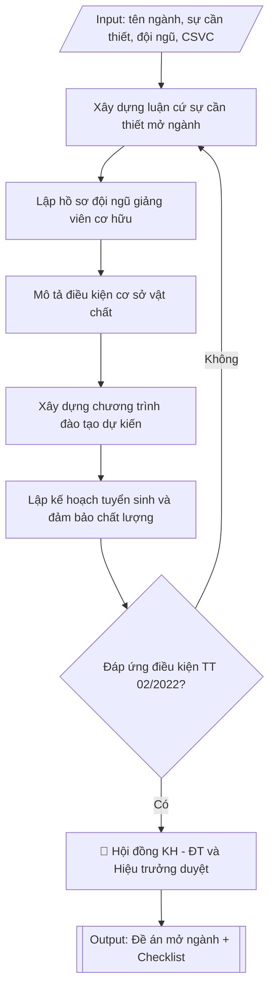

# Tư liệu lịch sử – không phải quy trình hiện hành

Nội dung từ phiên bản nguồn trước 1.1.0, giữ để đối chiếu dữ liệu đầu vào và thay đổi; căn cứ, điều kiện, mẫu và ví dụ có thể đã lỗi thời. Không dùng để thực hiện nghiệp vụ hiện tại.

## Khi nào dùng
Khi nhà trường (Phòng Đào tạo phối hợp khoa dự kiến) cần lập đề án đề nghị Bộ Giáo dục và Đào tạo
cho phép mở ngành đào tạo mới trình độ đại học: tổng hợp sự cần thiết, minh chứng điều kiện đội ngũ
giảng viên, cơ sở vật chất, chương trình đào tạo dự kiến và kế hoạch tuyển sinh.

## Đầu vào (Input)

| Trường | Mô tả | Bắt buộc |
|---|---|---|
| `ten_nganh` | Tên ngành đào tạo dự kiến mở mới | Có |
| `ma_nganh` | Mã ngành theo danh mục (nếu đã xác định) | Không |
| `trinh_do` | Trình độ đào tạo (đại học) | Có |
| `ngon_ngu` | Ngôn ngữ giảng dạy (tiếng Việt / song ngữ / tiếng Anh) | Không (mặc định: tiếng Việt) |
| `su_can_thiet` | Luận cứ nhu cầu xã hội: phân tích cung – cầu nhân lực, chiến lược phát triển | Có |
| `doi_ngu` | Danh sách giảng viên cơ hữu: họ tên, học hàm/học vị, chuyên môn đào tạo, thâm niên | Có |
| `csvct` | Mô tả cơ sở vật chất: phòng học, phòng thí nghiệm, thư viện, học liệu | Có |
| `chuong_trinh_du_kien` | Khung CTĐT dự kiến: tổng số tín chỉ, các khối kiến thức | Có |
| `ke_hoach_tuyen_sinh` | Chỉ tiêu, phương thức tuyển sinh, đối tượng, lộ trình các năm đầu | Có |
| `dam_bao_chat_luong` | Cơ chế đảm bảo chất lượng: chuẩn đầu ra, đánh giá, khảo sát việc làm | Không |
| `minh_chung` | Danh mục hồ sơ minh chứng kèm theo (bằng cấp, hợp đồng, biên bản khảo sát...) | Có |
| `don_vi_chu_tri` | Khoa/bộ môn chủ trì xây dựng đề án | Có |

## Quy trình

**Bước 1. Xây dựng luận cứ sự cần thiết mở ngành**
- Làm gì: phân tích từ `su_can_thiet`: nhu cầu nhân lực của ngành trên thị trường lao động
  (số liệu khảo sát doanh nghiệp, dự báo nhân lực, định hướng chiến lược của Nhà nước);
  thống kê các trường đang đào tạo ngành này (số cơ sở, tổng chỉ tiêu) để chỉ ra khoảng
  trống nhân lực; khẳng định sự phù hợp với chiến lược phát triển của trường.
- Dùng input: `ten_nganh`, `trinh_do`, `su_can_thiet`, `don_vi_chu_tri`.
- Vai trò: Chuyên viên đơn vị chủ trì (khoa/viện) · AI hỗ trợ: soạn dự thảo luận cứ, tổng hợp số liệu nhu cầu nhân lực · ⏱ ~1 giờ (ước tính)
- Lưu ý nghiệp vụ: luận cứ phải có số liệu định lượng (không viết chung chung "nhu cầu
  lớn"); nguồn số liệu phải ghi rõ (khảo sát nào, thời gian nào, quy mô mẫu); tránh dùng
  số liệu đã quá cũ (trên 3 năm) vì Bộ sẽ chất vấn tính thời sự.
- → Kết quả bước: phần "Sự cần thiết mở ngành" hoàn chỉnh (bối cảnh – khoảng trống đào
  tạo – sự phù hợp với định hướng trường) kèm số liệu minh chứng.

**Bước 2. Lập hồ sơ đội ngũ giảng viên cơ hữu**
- Làm gì: liệt kê từ `doi_ngu` toàn bộ giảng viên cơ hữu đúng chuyên môn ngành: họ tên, học
  hàm/học vị, chuyên ngành được đào tạo, thâm niên; đối chiếu từng người với yêu cầu của
  Thông tư 02/2022 (số lượng tối thiểu, trình độ tối thiểu, ngành đào tạo đúng chuyên môn);
  lập bảng tổng hợp kèm danh mục bản sao bằng cấp trong `minh_chung`.
- Dùng input: `doi_ngu`, `minh_chung`, `ten_nganh`.
- Vai trò: Chuyên viên đơn vị chủ trì (khoa/viện) · AI hỗ trợ: lập bảng sơ bộ, đối chiếu hồ sơ gốc và bằng cấp · ⏱ ~1 giờ (ước tính)
- Lưu ý nghiệp vụ: bẫy thường gặp — giảng viên "đúng chuyên môn" phải có bằng đúng ngành
  hoặc ngành gần được Bộ chấp nhận, không tính giảng viên trái ngành dù có kinh nghiệm;
  giảng viên thỉnh giảng không được tính vào đội ngũ cơ hữu; kiểm tra mỗi giảng viên chỉ
  kê khai cho một ngành trong cùng đợt mở ngành.
- → Kết quả bước: bảng tổng hợp đội ngũ giảng viên cơ hữu đúng chuyên môn (đạt/không đạt
  yêu cầu Thông tư 02/2022) kèm danh mục bằng cấp minh chứng.

**Bước 3. Mô tả điều kiện cơ sở vật chất**
- Làm gì: mô tả từ `csvct`: phòng học lý thuyết, phòng thí nghiệm/thực hành chuyên ngành,
  thư viện (đầu sách, cơ sở dữ liệu số), ký túc xá, địa điểm thực tập; nêu kế hoạch đầu tư
  bổ sung (hạng mục, kinh phí, tiến độ); đối chiếu với yêu cầu tối thiểu của Thông tư 02/2022.
- Dùng input: `csvct`, `minh_chung`, `ten_nganh`.
- Vai trò: Chuyên viên đơn vị chủ trì (khoa/viện) · AI hỗ trợ: soạn dự thảo mô tả CSVC, đối chiếu minh chứng · ⏱ ~45 phút (ước tính)
- Lưu ý nghiệp vụ: mỗi hạng mục CSVC phải có minh chứng tương ứng (quyết định đầu tư, biên
  bản nghiệm thu, ảnh hiện trạng) — mô tả "trên giấy" không có minh chứng sẽ bị đánh trượt;
  kế hoạch đầu tư bổ sung phải có mốc thời gian cụ thể, không viết "sẽ đầu tư trong tương lai".
- → Kết quả bước: phần "Điều kiện cơ sở vật chất" hoàn chỉnh kèm kế hoạch đầu tư bổ sung
  và danh mục minh chứng.

**Bước 4. Xây dựng chương trình đào tạo dự kiến**
- Làm gì: xây dựng từ `chuong_trinh_du_kien`: mục tiêu đào tạo, chuẩn đầu ra dự kiến, tổng
  số tín chỉ, cấu trúc khối kiến thức (đại cương – cơ sở ngành – chuyên ngành – thực tập –
  tốt nghiệp) với số tín chỉ từng khối, danh mục học phần dự kiến; kiểm tra tổng tín chỉ
  các khối bằng tổng số tín chỉ công bố.
- Dùng input: `chuong_trinh_du_kien`, `ten_nganh`, `trinh_do`, `ngon_ngu`.
- Vai trò: Chuyên viên đơn vị chủ trì (khoa/viện) · AI hỗ trợ: soạn dự thảo CTĐT dự kiến, kiểm tra theo chuẩn Thông tư 17/2021 · ⏱ ~1 giờ (ước tính)
- Lưu ý nghiệp vụ: CTĐT dự kiến phải tuân chuẩn chương trình đào tạo (Thông tư 17/2021);
  tổng tín chỉ các khối phải cộng đúng 100%; danh mục học phần phải thể hiện được đặc thù
  của ngành mới, tránh "copy" nguyên CTĐT ngành gần rồi đổi tên.
- → Kết quả bước: phần "Chương trình đào tạo dự kiến" hoàn chỉnh (mục tiêu, chuẩn đầu ra,
  cấu trúc khối kiến thức, danh mục học phần).

**Bước 5. Lập kế hoạch tuyển sinh và đảm bảo chất lượng**
- Làm gì: từ `ke_hoach_tuyen_sinh` quy định chỉ tiêu năm đầu và lộ trình 3 năm tiếp theo,
  phương thức tuyển sinh, tổ hợp xét tuyển; từ `dam_bao_chat_luong` xây dựng cơ chế đảm bảo
  chất lượng: công bố chuẩn đầu ra, khảo thí, phản hồi người học, khảo sát việc làm sau tốt
  nghiệp với chỉ tiêu cụ thể.
- Dùng input: `ke_hoach_tuyen_sinh`, `dam_bao_chat_luong`, `ten_nganh`.
- Vai trò: Chuyên viên đơn vị chủ trì (khoa/viện) · AI hỗ trợ: soạn dự thảo kế hoạch tuyển sinh và ĐBCL, kiểm tra chỉ tiêu và lộ trình · ⏱ ~45 phút (ước tính)
- Lưu ý nghiệp vụ: chỉ tiêu năm đầu phải thận trọng, phù hợp với đội ngũ và CSVC hiện có
  (bẫy: đề xuất chỉ tiêu năm đầu quá cao so với năng lực thực tế sẽ bị chất vấn); lộ trình
  tăng chỉ tiêu phải có căn cứ (bổ sung giảng viên, đầu tư CSVC theo năm).
- → Kết quả bước: phần "Kế hoạch tuyển sinh và đảm bảo chất lượng" hoàn chỉnh (chỉ tiêu
  từng năm, phương thức, cơ chế ĐBCL).

**Bước 6. Hoàn thiện hồ sơ đề án và trình duyệt**
- Làm gì: ráp kết quả Bước 1–5 thành hồ sơ hoàn chỉnh theo mục lục chuẩn: tờ trình của Hiệu
  trưởng gửi Bộ GD&ĐT – đề án (các phần I–VI) – phụ lục minh chứng; kiểm tra tính nhất quán
  số liệu giữa các phần (số giảng viên, số tín chỉ, chỉ tiêu phải khớp nhau mọi nơi); lấy ý
  kiến khoa và Hội đồng khoa học – đào tạo; trình Hiệu trưởng ký gửi Bộ GD&ĐT.
- Dùng input: `minh_chung`, `don_vi_chu_tri`, toàn bộ kết quả các bước trên.
- Vai trò: Hội đồng KH–ĐT góp ý; Hiệu trưởng ký tờ trình; chuyên viên đơn vị chủ trì ráp hồ sơ · AI hỗ trợ: ráp hồ sơ, kiểm tra nhất quán số liệu giữa các phần · ⏱ ~1 giờ (ước tính)
- Lưu ý nghiệp vụ: số liệu trong đề án phải nhất quán tuyệt đối giữa các phần và khớp với
  minh chứng — sai lệch một con số là lý do phổ biến khiến hồ sơ bị yêu cầu bổ sung; kiểm
  tra lại toàn bộ file minh chứng đã ký/đóng dấu trước khi gửi.
- → Kết quả bước: hồ sơ đề án mở ngành hoàn chỉnh (tờ trình – đề án – phụ lục minh chứng),
  đã qua ý kiến Hội đồng KH–ĐT và Hiệu trưởng ký.

## Luồng quy trình (Workflow)


## Đầu ra (Output)
- Đề án mở ngành hoàn chỉnh (văn bản + phụ lục minh chứng), có cấu trúc chương mục.
- Bảng tổng hợp đội ngũ giảng viên cơ hữu đúng chuyên môn.
- Checklist đối chiếu điều kiện mở ngành theo Thông tư 02/2022/TT-BGDĐT.

**Cấu trúc output chuẩn:** khung mẫu CỐ ĐỊNH của sản phẩm chính (Đề án mở ngành đào tạo),
các phần bắt buộc theo đúng thứ tự xuất hiện:
1. Tiêu đề hành chính: quốc hiệu, tiêu ngữ, tên đơn vị trình, số ký hiệu, địa điểm – ngày tháng.
2. Tên văn bản: ĐỀ ÁN MỞ NGÀNH ĐÀO TẠO — NGÀNH ... — TRÌNH ĐỘ ...
3. Phần I – Sự cần thiết mở ngành: bối cảnh và nhu cầu xã hội; khoảng trống đào tạo; sự
   phù hợp với định hướng phát triển của trường.
4. Phần II – Điều kiện đội ngũ giảng viên: số lượng, trình độ, bảng tổng hợp đội ngũ cơ
   hữu đúng chuyên môn (đối chiếu Thông tư 02/2022).
5. Phần III – Điều kiện cơ sở vật chất: phòng học, phòng thí nghiệm/thực hành, thư viện,
   học liệu và kế hoạch đầu tư bổ sung.
6. Phần IV – Chương trình đào tạo dự kiến: mục tiêu, chuẩn đầu ra, tổng số tín chỉ, cấu
   trúc khối kiến thức, danh mục học phần dự kiến.
7. Phần V – Kế hoạch tuyển sinh và đảm bảo chất lượng: chỉ tiêu năm đầu và lộ trình các
   năm tiếp theo, phương thức tuyển sinh, cơ chế đảm bảo chất lượng.
8. Phần VI – Hồ sơ minh chứng kèm theo (phụ lục): danh sách đội ngũ + bằng cấp; danh mục
   học phần; biên bản khảo sát nhu cầu; quyết định đầu tư CSVC; danh mục học liệu.
9. Chữ ký người ký (KT. Hiệu trưởng) và con dấu.
10. Tài liệu kèm theo: Tờ trình gửi Bộ GD&ĐT; Checklist đối chiếu điều kiện mở ngành.

## Checklist nghiệm thu

- [ ] Đủ 10 phần theo "Cấu trúc output chuẩn": tiêu đề hành chính, tên đề án (ngành + trình độ), Phần I sự cần thiết, Phần II đội ngũ giảng viên, Phần III cơ sở vật chất, Phần IV CTĐT dự kiến, Phần V kế hoạch tuyển sinh và đảm bảo chất lượng, Phần VI phụ lục minh chứng, chữ ký và con dấu, tờ trình + checklist đối chiếu.
- [ ] Đội ngũ giảng viên cơ hữu đúng chuyên môn, đáp ứng yêu cầu số lượng và trình độ theo Thông tư 02/2022 (giảng viên thỉnh giảng không được tính).
- [ ] Mỗi hạng mục cơ sở vật chất có minh chứng tương ứng; kế hoạch đầu tư bổ sung có hạng mục, kinh phí và mốc thời gian cụ thể.
- [ ] Tổng tín chỉ các khối kiến thức bằng tổng công bố; CTĐT dự kiến tuân chuẩn Thông tư 17/2021.
- [ ] Chỉ tiêu năm đầu thận trọng, phù hợp với đội ngũ và CSVC hiện có; lộ trình tăng chỉ tiêu có căn cứ.
- [ ] Số liệu nhất quán tuyệt đối giữa các phần và khớp với hồ sơ minh chứng.
- [ ] Luận cứ sự cần thiết có số liệu định lượng, ghi rõ nguồn, còn thời sự (không quá 3 năm); khớp Input đã cho.
- [ ] Không bịa đặt số liệu khảo sát, minh chứng, bằng cấp hay trích dẫn văn bản.
- [ ] Căn cứ pháp lý đầy đủ, còn hiệu lực (Thông tư 02/2022/TT-BGDĐT; Luật Giáo dục đại học sửa đổi, bổ sung năm 2018).
- [ ] Đã qua Human gate: Hội đồng KH–ĐT đã cho ý kiến, Hiệu trưởng đã ký tờ trình đề án gửi Bộ GD&ĐT.

Tiêu chí đạt = tất cả các ô được đánh dấu.

## Ví dụ mô phỏng (dữ liệu giả lập)

> Tất cả tên trường, cá nhân, số liệu dưới đây đều là **giả lập**, không liên quan tổ chức/cá nhân có thật.

### Input mẫu

| Trường | Giá trị |
|---|---|
| `ten_nganh` | Trí tuệ nhân tạo |
| `ma_nganh` | 7480107 |
| `trinh_do` | Đại học |
| `ngon_ngu` | Tiếng Việt |
| `su_can_thiet` | Chiến lược quốc gia về AI đến 2030 dự báo thiếu ~100.000 nhân lực AI; khảo sát 120 doanh nghiệp công nghệ của trường: 78% có nhu cầu tuyển kỹ sư AI trong 3 năm tới; hiện chỉ 12 cơ sở đào tạo chuyên sâu AI tại miền Bắc. |
| `doi_ngu` | 18 giảng viên cơ hữu: 2 PGS.TS, 8 TS, 8 ThS đúng chuyên môn AI/KHMT; Trưởng ngành dự kiến: TS. Nguyễn Văn C |
| `csvct` | 04 phòng thí nghiệm (AI & Robot, Xử lý dữ liệu lớn, Thị giác máy, Xử lý ngôn ngữ tự nhiên); 02 phòng máy (120 máy trạm GPU); thư viện 5.000 đầu sách CNTT/AI + cơ sở dữ liệu IEEE, Springer |
| `chuong_trinh_du_kien` | 130 tín chỉ: đại cương 38 TC, cơ sở ngành 30 TC, chuyên ngành 44 TC, thực tập 8 TC, tốt nghiệp 10 TC |
| `ke_hoach_tuyen_sinh` | Năm 1: 120 chỉ tiêu (xét điểm thi tốt nghiệp THPT tổ hợp A00, A01, D01 + xét học bạ); năm 2–4 tăng dần lên 200 |
| `dam_bao_chat_luong` | Chuẩn đầu ra theo chuẩn CTĐT; khảo sát việc làm sau 12 tháng tốt nghiệp; hội đồng cố vấn doanh nghiệp |
| `minh_chung` | Bản sao bằng cấp đội ngũ; biên bản khảo sát nhu cầu doanh nghiệp; quyết định đầu tư phòng lab; danh mục học liệu |
| `don_vi_chu_tri` | Khoa Công nghệ thông tin |

### Output mẫu

```
TRƯỜNG ĐẠI HỌC A            CỘNG HÒA XÃ HỘI CHỦ NGHĨA VIỆT NAM
PHÒNG ĐÀO TẠO                              Độc lập – Tự do – Hạnh phúc
      Số: 65/ĐA-ĐHA-ĐT
                                                 Thành phố C, ngày 09 tháng 10 năm 2026

                        ĐỀ ÁN MỞ NGÀNH ĐÀO TẠO
               NGÀNH TRÍ TUỆ NHÂN TẠO – TRÌNH ĐỘ ĐẠI HỌC

Phần I. SỰ CẦN THIẾT MỞ NGÀNH
1.1. Bối cảnh và nhu cầu xã hội
Trí tuệ nhân tạo là công nghệ lõi của cuộc cách mạng công nghiệp lần thứ tư. Theo
Chiến lược quốc gia về nghiên cứu, phát triển và ứng dụng trí tuệ nhân tạo đến năm
2030, Việt Nam dự báo thiếu khoảng 100.000 nhân lực AI trong giai đoạn 2026–2030.
Kết quả khảo sát 120 doanh nghiệp công nghệ do Trường Đại học A thực hiện
tháng 8/2026 cho thấy 78% doanh nghiệp có nhu cầu tuyển dụng kỹ sư AI trong 3 năm
tới, tập trung vào các vị trí: kỹ sư học máy, kỹ sư xử lý ngôn ngữ tự nhiên, kỹ sư
thị giác máy tính.
1.2. Khoảng trống đào tạo
Hiện tại khu vực miền Bắc chỉ có 12 cơ sở đào tạo chuyên sâu về AI, tổng chỉ tiêu
khoảng 2.500 sinh viên/năm, chưa đáp ứng nhu cầu tuyển dụng ước tính 15.000 vị trí/năm.
1.3. Sự phù hợp với định hướng phát triển của trường
Ngành Trí tuệ nhân tạo là bước phát triển tự nhiên từ ngành Công nghệ thông tin –
thế mạnh đào tạo của Nhà trường, phù hợp Chiến lược phát triển Trường Đại học
A giai đoạn 2025–2030.

Phần II. ĐIỀU KIỆN ĐỘI NGŨ GIẢNG VIÊN
Nhà trường có 18 giảng viên cơ hữu đúng chuyên môn ngành Trí tuệ nhân tạo /
Khoa học máy tính, trong đó: 02 PGS.TS, 08 TS, 08 ThS (danh sách chi tiết tại
Phụ lục 1). Trưởng ngành dự kiến: TS. Nguyễn Văn C – Trưởng khoa Công nghệ
thông tin, có 10 năm kinh nghiệm nghiên cứu AI.
=> Đáp ứng yêu cầu về số lượng và trình độ đội ngũ theo Thông tư 02/2022/TT-BGDĐT.

Phần III. ĐIỀU KIỆN CƠ SỞ VẬT CHẤT
- 04 phòng thí nghiệm chuyên ngành: AI & Robot, Xử lý dữ liệu lớn, Thị giác máy,
  Xử lý ngôn ngữ tự nhiên.
- 02 phòng máy tính với 120 máy trạm trang bị GPU phục vụ huấn luyện mô hình.
- Thư viện: 5.000 đầu sách lĩnh vực CNTT/AI; quyền truy cập cơ sở dữ liệu IEEE,
  Springer; 200 đầu giáo trình số.
- Kế hoạch đầu tư bổ sung năm 2027: 01 trung tâm tính toán hiệu năng cao (HPC).

Phần IV. CHƯƠNG TRÌNH ĐÀO TẠO DỰ KIẾN
- Mục tiêu: đào tạo kỹ sư AI có năng lực thiết kế, triển khai hệ thống trí tuệ
  nhân tạo, đáp ứng nhu cầu doanh nghiệp và nghiên cứu.
- Tổng số: 130 tín chỉ.
  + Kiến thức giáo dục đại cương: 38 TC
  + Kiến thức cơ sở ngành: 30 TC
  + Kiến thức chuyên ngành: 44 TC
  + Thực tập tốt nghiệp: 8 TC
  + Khóa luận/đồ án tốt nghiệp: 10 TC
- Danh mục 42 học phần dự kiến (Phụ lục 2).

Phần V. KẾ HOẠCH TUYỂN SINH VÀ ĐẢM BẢO CHẤT LƯỢNG
5.1. Kế hoạch tuyển sinh
Năm đầu tiên tuyển 120 chỉ tiêu; các năm tiếp theo tăng dần: 150 – 180 – 200.
Phương thức: xét điểm thi tốt nghiệp THPT (tổ hợp A00, A01, D01) và xét học bạ THPT.
5.2. Đảm bảo chất lượng
- Công bố chuẩn đầu ra CTĐT theo quy định; rà soát, cập nhật 2 năm/lần.
- Hội đồng cố vấn doanh nghiệp tham gia xây dựng và đánh giá chương trình.
- Khảo sát tình hình việc làm của sinh viên sau 12 tháng tốt nghiệp; mục tiêu
  tỷ lệ có việc làm đúng ngành ≥ 85%.

Phần VI. HỒ SƠ MINH CHỨNG KÈM THEO (Phụ lục)
Phụ lục 1: Danh sách đội ngũ giảng viên cơ hữu + bản sao bằng cấp.
Phụ lục 2: Danh mục học phần dự kiến của chương trình đào tạo.
Phụ lục 3: Biên bản khảo sát nhu cầu nhân lực doanh nghiệp.
Phụ lục 4: Quyết định đầu tư, biên bản nghiệm thu phòng thí nghiệm.
Phụ lục 5: Danh mục học liệu, thư viện phục vụ ngành.

                                        KT. HIỆU TRƯỞNG
                                        PHÓ HIỆU TRƯỞNG

                                        [CHỜ KÝ]

                                   PGS.TS. Trần Văn B
```

### Checklist đối chiếu điều kiện mở ngành (output kèm theo)
- [x] Sự cần thiết và nhu cầu xã hội có số liệu minh chứng
- [x] Đội ngũ giảng viên cơ hữu đúng chuyên môn (18 người: 2 PGS.TS, 8 TS, 8 ThS)
- [x] Cơ sở vật chất, phòng thí nghiệm chuyên ngành đầy đủ
- [x] Thư viện, học liệu đáp ứng
- [x] Chương trình đào tạo dự kiến có cấu trúc khối kiến thức rõ ràng
- [x] Kế hoạch tuyển sinh và đảm bảo chất lượng
- [x] Hồ sơ minh chứng kèm theo đầy đủ 5 phụ lục

## Căn cứ & lưu ý
- Thông tư 02/2022/TT-BGDĐT ngày 18/01/2022 của Bộ GD&ĐT quy định điều kiện, trình tự,
  thủ tục mở ngành đào tạo, đình chỉ hoạt động của ngành đào tạo trình độ đại học.
- Luật Giáo dục đại học (sửa đổi, bổ sung năm 2018).
- Hồ sơ đề án phải có tờ trình của Hiệu trưởng gửi Bộ GD&ĐT; số liệu trong đề án phải
  nhất quán giữa các phần và khớp với minh chứng.
- Không dùng tên thật của trường/cá nhân khi mô phỏng.
