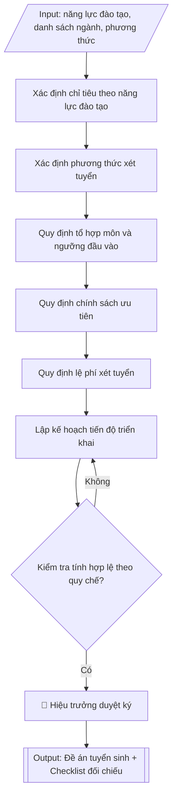

# Skill: Soạn đề án tuyển sinh hằng năm

## Khi nào dùng
Khi xây dựng hoặc điều chỉnh đề án tuyển sinh đại học hệ chính quy hằng năm: xác định chỉ tiêu
theo năng lực đào tạo thực tế, quy định các phương thức xét tuyển, tổ hợp môn, ngưỡng đảm bảo
chất lượng đầu vào, chính sách ưu tiên và kế hoạch triển khai.

## Đầu vào (Input)

| Trường | Mô tả | Bắt buộc |
|---|---|---|
| `nam_tuyen_sinh` | Năm tuyển sinh (vd: 2026) | Có |
| `nang_luc_dao_tao` | Số SV quy đổi tối đa theo kết quả xác định năng lực đào tạo từng ngành | Có |
| `danh_sach_nganh` | Tên ngành, mã ngành, chỉ tiêu dự kiến từng ngành | Có |
| `phuong_thuc_xet_tuyen` | Danh sách phương thức (điểm thi TN THPT, học bạ, tuyển thẳng, ĐGNL/ĐGTD...) | Có |
| `to_hop_mon` | Tổ hợp xét tuyển áp dụng cho từng ngành | Có |
| `nguong_dau_vao` | Ngưỡng đảm bảo chất lượng đầu vào tối thiểu từng phương thức/ngành | Có |
| `chinh_sach_uu_tien` | Đối tượng ưu tiên, điểm ưu tiên, tuyển thẳng, cộng điểm | Không |
| `le_phi_xet_tuyen` | Mức lệ phí xét tuyển từng phương thức | Không |
| `tien_do` | Các mốc thời gian: công bố đề án, đăng ký, xét tuyển, nhập học | Không |
| `nguoi_phu_trach` | Người ký/chủ trì đề án | Không (mặc định: Trưởng phòng Đào tạo) |

## Quy trình

**Bước 1. Xác định chỉ tiêu theo năng lực đào tạo**
- Làm gì: thu thập kết quả xác định năng lực đào tạo (NLĐT) năm gần nhất của từng ngành —
  số giảng viên cơ hữu, quy mô sinh viên/giảng viên, diện tích sàn bình quân trên người học;
  lấy tổng số sinh viên quy đổi làm "trần cứng". Phân bổ chỉ tiêu từng ngành theo 3 căn cứ:
  (a) nhu cầu xã hội và tỷ lệ việc làm sau tốt nghiệp; (b) kết quả tuyển sinh 2–3 năm gần
  nhất (tỷ lệ nhập học/chỉ tiêu); (c) định hướng phát triển của trường. Cộng tổng và đối
  chiếu không vượt NLĐT đã công bố.
- Dùng input: `nam_tuyen_sinh`, `nang_luc_dao_tao`, `danh_sach_nganh`.
- Vai trò: Chuyên viên Phòng Đào tạo · AI hỗ trợ: tổng hợp sơ bộ số liệu NLĐT, cảnh báo tổng vượt trần · ⏱ ~1 giờ (ước tính)
- Lưu ý nghiệp vụ: bẫy thường gặp là lấy số liệu NLĐT năm cũ — phải dùng năm gần nhất
  đã công bố trên website trường; tổng chỉ tiêu vượt trần là lỗi khiến đề án bị Bộ trả về;
  các ngành thuộc lĩnh vực sức khỏe có cấp chứng chỉ hành nghề và ngành sư phạm còn bị
  khống chế chỉ tiêu riêng theo văn bản giao của Bộ, phải tách ra kiểm tra riêng.
- → Kết quả bước: bảng phân bổ chỉ tiêu từng ngành kèm căn cứ (số liệu NLĐT, tỷ lệ đạt
  chỉ tiêu 2 năm gần nhất).

**Bước 2. Xác định phương thức xét tuyển**
- Làm gì: liệt kê đầy đủ các phương thức trường áp dụng trong năm từ `phuong_thuc_xet_tuyen`;
  với mỗi phương thức quy định tỷ lệ chỉ tiêu phân bổ (tổng các phương thức bằng 100%) và
  cách quy đổi điểm tương đương giữa các phương thức theo hướng dẫn của Bộ GD&ĐT; kiểm tra
  mỗi ngành đều được gán ít nhất một phương thức.
- Dùng input: `phuong_thuc_xet_tuyen`, `danh_sach_nganh`, `nguong_dau_vao`.
- Vai trò: Chuyên viên Phòng Đào tạo · AI hỗ trợ: soạn dự thảo bảng phương thức, đối chiếu quy chế · ⏱ ~45 phút (ước tính)
- Lưu ý nghiệp vụ: không tự đặt công thức quy đổi điểm "lạ" ngoài hướng dẫn của Bộ;
  phương thức mới (kỳ thi ĐGNL/ĐGTD, chứng chỉ ngoại ngữ quốc tế kết hợp) phải ghi rõ đơn
  vị tổ chức kỳ thi được công nhận; tỷ lệ chỉ tiêu mỗi phương thức phải quy được ra số
  tuyệt đối để đối chiếu với tổng chỉ tiêu ở Bước 1.
- → Kết quả bước: bảng phương thức xét tuyển với tỷ lệ chỉ tiêu và quy tắc quy đổi điểm.

**Bước 3. Quy định tổ hợp môn và ngưỡng đầu vào từng ngành**
- Làm gì: với từng ngành trong `danh_sach_nganh`, gán tổ hợp môn từ `to_hop_mon`; với từng
  phương thức, ghi ngưỡng đảm bảo chất lượng đầu vào tối thiểu từ `nguong_dau_vao`. Đối
  chiếu: tổ hợp môn phải phù hợp đặc thù ngành (ngành ngôn ngữ phải có môn ngoại ngữ trong
  tổ hợp); ngưỡng các ngành sức khỏe/sư phạm không thấp hơn ngưỡng tối thiểu do Bộ quy định.
- Dùng input: `danh_sach_nganh`, `to_hop_mon`, `nguong_dau_vao`, `phuong_thuc_xet_tuyen`.
- Vai trò: Chuyên viên Phòng Đào tạo · AI hỗ trợ: soạn sơ bộ bảng tổ hợp/ngưỡng, kiểm tra tính phù hợp đặc thù ngành · ⏱ ~1 giờ (ước tính)
- Lưu ý nghiệp vụ: bẫy thường gặp là tổ hợp môn thiếu môn phù hợp ngành (vd: không có môn
  Toán cho ngành kỹ thuật) gây tranh cãi khi kiểm định; đặt ngưỡng khác nhau giữa các ngành
  mà không có lý do thuyết minh; thiếu ngưỡng cho phương thức mới bổ sung ở Bước 2.
- → Kết quả bước: bảng tổ hợp môn và ngưỡng đầu vào chi tiết theo từng ngành, từng
  phương thức.

**Bước 4. Quy định chính sách ưu tiên**
- Làm gì: liệt kê đối tượng ưu tiên (đối tượng chính sách, khu vực) và mức cộng điểm ưu tiên
  từ `chinh_sach_uu_tien`; quy định đối tượng tuyển thẳng/ưu tiên xét tuyển và ngành áp dụng;
  ghi rõ cách cộng điểm ưu tiên vào tổng điểm xét tuyển và mức tối đa được cộng.
- Dùng input: `chinh_sach_uu_tien`.
- Vai trò: Chuyên viên Phòng Đào tạo · AI hỗ trợ: soạn dự thảo, đối chiếu Thông tư 08/2022 · ⏱ ~30 phút (ước tính)
- Lưu ý nghiệp vụ: mức cộng điểm ưu tiên có trần tối đa theo quy chế — kiểm tra Thông tư
  08/2022 và văn bản sửa đổi, bổ sung hiện hành; đối tượng tuyển thẳng phải đúng danh mục
  Bộ công bố, không tự "sáng tác" thêm đối tượng; phải ghi rõ mức cộng tối đa để tránh
  khiếu nại sau này.
- → Kết quả bước: mục chính sách ưu tiên hoàn chỉnh (đối tượng, khu vực, mức điểm,
  điều kiện tuyển thẳng).

**Bước 5. Quy định lệ phí xét tuyển**
- Làm gì: quy định mức lệ phí cho từng phương thức từ `le_phi_xet_tuyen` (phương thức xét
  điểm thi TN THPT tính theo nguyện vọng; xét học bạ/ĐGNL tính theo hồ sơ); ghi rõ hình thức
  nộp lệ phí và chính sách miễn/giảm (nếu có); đối chiếu mức thu với quy định của Bộ GD&ĐT
  và Bộ Tài chính.
- Dùng input: `le_phi_xet_tuyen`, `phuong_thuc_xet_tuyen`.
- Vai trò: Chuyên viên Phòng Đào tạo · AI hỗ trợ: soạn dự thảo bảng lệ phí, kiểm tra trần mức thu · ⏱ ~20 phút (ước tính)
- Lưu ý nghiệp vụ: mức thu không được vượt trần quy định; phương thức nào miễn phí phải ghi
  rõ "miễn phí" thay vì bỏ trống (bỏ trống dễ bị hiểu là thiếu sót khi kiểm tra).
- → Kết quả bước: bảng lệ phí xét tuyển theo từng phương thức.

**Bước 6. Lập kế hoạch tiến độ triển khai**
- Làm gì: dựng lịch triển khai từ `tien_do` theo các mốc bắt buộc: công bố đề án → tư vấn
  hướng nghiệp → nhận hồ sơ/đăng ký xét tuyển → tổ chức xét tuyển → công bố kết quả →
  xác nhận nhập học → nhập học chính thức → xét tuyển bổ sung (nếu còn chỉ tiêu); mỗi mốc
  ghi thời gian cụ thể và đơn vị chủ trì/phối hợp.
- Dùng input: `tien_do`, `nam_tuyen_sinh`.
- Vai trò: Chuyên viên Phòng Đào tạo · AI hỗ trợ: dựng lịch sơ bộ, đối chiếu khớp lịch chung Bộ GD&ĐT · ⏱ ~30 phút (ước tính)
- Lưu ý nghiệp vụ: lịch xét tuyển đợt chính phải khớp lịch chung Bộ GD&ĐT công bố hằng năm —
  lịch Bộ có thể điều chỉnh, cần cập nhật trước khi ban hành; mốc công bố đề án phải trước
  thời điểm thí sinh đăng ký nguyện vọng theo quy định.
- → Kết quả bước: bảng tiến độ triển khai với mốc thời gian, nội dung và đơn vị thực hiện.

**Bước 7. Kiểm tra tính hợp lệ theo quy chế**
- Làm gì: đối chiếu toàn bộ dự thảo với Quy chế tuyển sinh (Thông tư 08/2022/TT-BGDĐT):
  tổng chỉ tiêu không vượt NLĐT; tổ hợp môn phù hợp với từng ngành; ngưỡng đầu vào đúng
  quy định (đặc biệt ngành sức khỏe, sư phạm); lệ phí đúng mức; thông tin công khai đầy đủ
  theo danh mục Bộ yêu cầu. Lập checklist đánh dấu đạt/chưa đạt từng nội dung.
- Dùng input: toàn bộ các trường input (rà soát chéo số liệu giữa các bảng).
- Vai trò: Chuyên viên Phòng Đào tạo · AI hỗ trợ: đối chiếu sơ bộ toàn văn với Thông tư 08/2022, lập checklist · ⏱ ~1 giờ (ước tính)
- Lưu ý nghiệp vụ: đây là cổng chặn lỗi cuối — sai sót ở đây (nhất là tổng chỉ tiêu vượt
  NLĐT hoặc ngưỡng thấp hơn quy định) khiến đề án bị trả về; kiểm tra cộng chéo: tổng chỉ
  tiêu các ngành phải bằng tổng chỉ tiêu các phương thức.
- → Kết quả bước: checklist đối chiếu quy chế có đánh dấu đạt/chưa đạt từng nội dung;
  danh sách lỗi cần sửa (nếu có) để quay lại các bước tương ứng.

**Bước 8. Hoàn thiện và xuất bản đề án**
- Làm gì: sửa toàn bộ lỗi phát hiện ở Bước 7; trình `nguoi_phu_trach` (mặc định Trưởng phòng
  Đào tạo) ký duyệt; xuất bản đề án hoàn chỉnh dạng markdown gồm văn bản và các bảng (chỉ
  tiêu, phương thức, tổ hợp/ngưỡng, tiến độ) kèm checklist đối chiếu; đăng công khai trên
  trang thông tin điện tử của trường.
- Dùng input: `nguoi_phu_trach`, `nam_tuyen_sinh`.
- Vai trò: Hiệu trưởng ký duyệt; chuyên viên Phòng Đào tạo hoàn thiện và đăng công khai · AI hỗ trợ: hoàn thiện văn bản, định dạng hồ sơ trình ký · ⏱ ~45 phút (ước tính)
- Lưu ý nghiệp vụ: đề án phải được công bố công khai trước khi thí sinh đăng ký xét tuyển;
  lưu bản ký (ký số/ký giấy) vào hồ sơ pháp chế của Phòng Đào tạo.
- → Kết quả bước: đề án tuyển sinh hoàn chỉnh, sẵn sàng trình ký và công bố.

## Luồng quy trình (Workflow)


## Đầu ra (Output)
- Đề án tuyển sinh hoàn chỉnh (văn bản + bảng chỉ tiêu, bảng phương thức/tổ hợp/ngưỡng từng ngành).
- Checklist đối chiếu quy chế tuyển sinh của Bộ GD&ĐT.

**Cấu trúc output chuẩn:** khung mẫu CỐ ĐỊNH của sản phẩm chính (Đề án tuyển sinh), các phần
bắt buộc theo đúng thứ tự xuất hiện:
1. Tiêu đề hành chính: quốc hiệu, tiêu ngữ, số ký hiệu văn bản, địa điểm – ngày tháng ban hành.
2. Tên văn bản: ĐỀ ÁN TUYỂN SINH ĐẠI HỌC NĂM ... (ghi rõ hệ đào tạo).
3. Căn cứ pháp lý: Quy chế tuyển sinh (Thông tư 08/2022/TT-BGDĐT); năng lực đào tạo của
   trường trong năm tuyển sinh.
4. Phần I – Chỉ tiêu tuyển sinh theo ngành: bảng (TT, tên ngành, mã ngành, chỉ tiêu) kèm dòng tổng.
5. Phần II – Phương thức xét tuyển và phân bổ chỉ tiêu: bảng (phương thức, tỷ lệ chỉ tiêu)
   kèm quy tắc quy đổi điểm tương đương giữa các phương thức.
6. Phần III – Tổ hợp môn và ngưỡng đảm bảo chất lượng đầu vào: bảng theo từng ngành × từng phương thức.
7. Phần IV – Chính sách ưu tiên: đối tượng, khu vực, mức cộng điểm, điều kiện tuyển thẳng.
8. Phần V – Lệ phí xét tuyển: mức thu theo từng phương thức.
9. Phần VI – Tiến độ triển khai: bảng mốc thời gian, nội dung, đơn vị thực hiện.
10. Chữ ký người ký duyệt và con dấu.
11. Phụ lục kèm theo: Checklist đối chiếu quy chế tuyển sinh của Bộ GD&ĐT.

## Checklist nghiệm thu

- [ ] Đủ 11 phần theo "Cấu trúc output chuẩn": tiêu đề hành chính, tên văn bản (kèm năm và hệ đào tạo), căn cứ pháp lý, Phần I chỉ tiêu theo ngành, Phần II phương thức và phân bổ chỉ tiêu, Phần III tổ hợp môn và ngưỡng đầu vào, Phần IV chính sách ưu tiên, Phần V lệ phí, Phần VI tiến độ triển khai, chữ ký và con dấu, phụ lục checklist đối chiếu.
- [ ] Tổng chỉ tiêu không vượt năng lực đào tạo đã công bố (trần cứng), kể cả ngành sức khỏe/sư phạm bị khống chế riêng.
- [ ] Tổng chỉ tiêu theo ngành bằng tổng chỉ tiêu theo phương thức (cộng chéo khớp nhau).
- [ ] Tổ hợp môn phù hợp đặc thù từng ngành (ngành ngôn ngữ có môn ngoại ngữ; ngành kỹ thuật có môn Toán).
- [ ] Ngưỡng đầu vào ngành sức khỏe/sư phạm không thấp hơn ngưỡng tối thiểu do Bộ quy định.
- [ ] Chỉ tiêu, tỷ lệ phương thức, tổ hợp, ngưỡng, lệ phí, tiến độ khớp đúng Input đã cho.
- [ ] Không bịa đặt số liệu năng lực đào tạo, căn cứ pháp lý, số văn bản hay trích dẫn.
- [ ] Đúng thể thức văn bản hành chính theo NĐ 30/2020/NĐ-CP.
- [ ] Căn cứ pháp lý đầy đủ, còn hiệu lực (Quy chế tuyển sinh TT 08/2022/TT-BGDĐT và văn bản sửa đổi, bổ sung hiện hành).
- [ ] Đã qua Human gate: đề án đã được người có thẩm quyền duyệt ký trước khi công bố.

Tiêu chí đạt = tất cả các ô được đánh dấu.

## Ví dụ mô phỏng (dữ liệu giả lập)

> Tất cả tên trường, cá nhân, số liệu dưới đây đều là **giả lập**, không liên quan tổ chức/cá nhân có thật.

### Input mẫu

| Trường | Giá trị |
|---|---|
| `nam_tuyen_sinh` | 2026 |
| `nang_luc_dao_tao` | 3.200 SV quy đổi |
| `danh_sach_nganh` | CNTT (7480101): 500; Quản trị kinh doanh (7340101): 450; Kế toán (7340301): 400; Ngôn ngữ Anh (7220201): 300; Kỹ thuật điện – điện tử (7520201): 350 |
| `phuong_thuc_xet_tuyen` | 1. Điểm thi TN THPT (60%); 2. Học bạ THPT (25%); 3. Tuyển thẳng (5%); 4. ĐGNL B (10%, giả lập) |
| `to_hop_mon` | CNTT: A00, A01, D01; QTKD: A00, A01, D01, C00; Kế toán: A00, A01, D01; Ngôn ngữ Anh: D01, D14, D15; KTĐ-ĐT: A00, A01 |
| `nguong_dau_vao` | Điểm thi TN THPT: từ 18,0 điểm (tổ hợp 3 môn + ưu tiên); Học bạ: trung bình lớp 12 ≥ 6,5 |
| `chinh_sach_uu_tien` | Ưu tiên khu vực/đối tượng theo Quy chế tuyển sinh; tuyển thẳng HSG quốc gia |
| `le_phi_xet_tuyen` | 60.000đ/nguyện vọng (thi THPT); 50.000đ/hồ sơ (học bạ) |
| `nguoi_phu_trach` | Trưởng phòng Đào tạo |

### Output mẫu

```
TRƯỜNG ĐẠI HỌC A            CỘNG HÒA XÃ HỘI CHỈ NGHĨA VIỆT NAM
      Số: 45/ĐA-ĐHA-ĐT                    Độc lập – Tự do – Hạnh phúc
                                                 Thành phố C, ngày 15 tháng 01 năm 2026

                        ĐỀ ÁN TUYỂN SINH ĐẠI HỌC NĂM 2026
                       (Hệ đào tạo chính quy tập trung)

Căn cứ Thông tư số 08/2022/TT-BGDĐT ngày 06/6/2022 của Bộ trưởng Bộ Giáo dục và
Đào tạo ban hành Quy chế tuyển sinh đại học; tuyển sinh cao đẳng ngành Giáo dục
Mầm non;
Căn cứ năng lực đào tạo của Trường Đại học A năm 2026 là 3.200 sinh viên
quy đổi;
Trường Đại học A ban hành Đề án tuyển sinh đại học năm 2026 như sau:

I. CHỈ TIÊU TUYỂN SINH THEO NGÀNH

| TT | Tên ngành              | Mã ngành | Chỉ tiêu |
|----|------------------------|----------|----------|
| 1  | Công nghệ thông tin    | 7480101  | 500      |
| 2  | Quản trị kinh doanh    | 7340101  | 450      |
| 3  | Kế toán                | 7340301  | 400      |
| 4  | Ngôn ngữ Anh           | 7220201  | 300      |
| 5  | Kỹ thuật điện – điện tử| 7520201  | 350      |
|    | TỔNG                   |          | 2.000    |

II. PHƯƠNG THỨC XÉT TUYỂN VÀ PHÂN BỔ CHỈ TIÊU

| TT | Phương thức                                      | Tỷ lệ chỉ tiêu |
|----|--------------------------------------------------|----------------|
| 1  | Xét tuyển theo kết quả thi tốt nghiệp THPT      | 60%            |
| 2  | Xét tuyển theo kết quả học tập THPT (học bạ)    | 25%            |
| 3  | Xét tuyển thẳng theo quy chế của Bộ GD&ĐT       | 5%             |
| 4  | Xét tuyển theo kết quả kỳ thi ĐGNL của Trung tâm Khảo thí B (giả lập)     | 10%            |

Trường thực hiện quy đổi điểm tương đương giữa các phương thức xét tuyển theo
hướng dẫn của Bộ Giáo dục và Đào tạo.

III. TỔ HỢP MÔN VÀ NGƯỠNG ĐẢM BẢO CHẤT LƯỢNG ĐẦU VÀO

| Ngành               | Tổ hợp xét tuyển | Ngưỡng phương thức thi THPT | Ngưỡng phương thức học bạ |
|---------------------|------------------|-----------------------------|----------------------------|
| Công nghệ thông tin | A00, A01, D01    | ≥ 18,0 điểm                 | TB lớp 12 ≥ 6,5            |
| Quản trị kinh doanh | A00, A01, D01, C00 | ≥ 18,0 điểm               | TB lớp 12 ≥ 6,5            |
| Kế toán             | A00, A01, D01    | ≥ 18,0 điểm                 | TB lớp 12 ≥ 6,5            |
| Ngôn ngữ Anh        | D01, D14, D15    | ≥ 18,0 điểm (môn Anh ×2)    | TB lớp 12 ≥ 6,5            |
| Kỹ thuật điện – điện tử | A00, A01     | ≥ 18,0 điểm                 | TB lớp 12 ≥ 6,5            |

IV. CHÍNH SÁCH ƯU TIÊN
1. Thực hiện chính sách ưu tiên theo đối tượng và khu vực theo Quy chế tuyển
   sinh của Bộ GD&ĐT.
2. Tuyển thẳng thí sinh đoạt giải Nhất, Nhì, Ba kỳ thi học sinh giỏi quốc gia,
   thí sinh đoạt giải cuộc thi khoa học kỹ thuật quốc gia vào các ngành phù hợp.

V. LỆ PHÍ XÉT TUYỂN
- Phương thức xét điểm thi TN THPT: 60.000đ/nguyện vọng.
- Phương thức xét học bạ: 50.000đ/hồ sơ.

VI. TIẾN ĐỘ TRIỂN KHAI
1. Công bố đề án tuyển sinh: trước 28/02/2026.
2. Tư vấn hướng nghiệp, nhận hồ sơ xét học bạ: 01/3 – 30/6/2026.
3. Tổ chức xét tuyển theo kế hoạch chung của Bộ GD&ĐT: tháng 8/2026.
4. Công bố kết quả trúng tuyển, xác nhận nhập học: tháng 8 – 9/2026.
5. Nhập học chính thức: cuối tháng 9/2026.
6. Xét tuyển bổ sung (nếu còn chỉ tiêu): tháng 10/2026.

                                          KT. HIỆU TRƯỞNG
                                          PHÓ HIỆU TRƯỞNG PHỤ TRÁCH ĐÀO TẠO

                                               (đã ký)

                                          PGS.TS. Trần Văn B
```

### Checklist đối chiếu quy chế (output kèm theo)
- [x] Tổng chỉ tiêu (2.000) không vượt năng lực đào tạo (3.200 SV quy đổi)
- [x] Phương thức xét tuyển đúng Quy chế tuyển sinh (TT 08/2022/TT-BGDĐT)
- [x] Tổ hợp môn phù hợp với từng ngành đào tạo
- [x] Ngưỡng đảm bảo chất lượng đầu vào được quy định rõ
- [x] Chính sách ưu tiên, tuyển thẳng đúng quy định
- [x] Lệ phí xét tuyển đúng quy định
- [x] Kế hoạch tiến độ phù hợp lịch chung của Bộ GD&ĐT

## Căn cứ & lưu ý
- Thông tư 08/2022/TT-BGDĐT ngày 06/6/2022 của Bộ GD&ĐT ban hành Quy chế tuyển sinh
  đại học; tuyển sinh cao đẳng ngành Giáo dục Mầm non.
- Chỉ tiêu tuyển sinh xác định hằng năm không vượt quá năng lực đào tạo của cơ sở
  đào tạo (khoản 2 Điều 4 Quy chế tuyển sinh).
- Đề án tuyển sinh phải được công bố công khai trên trang thông tin điện tử của
  trường trước khi thí sinh đăng ký xét tuyển.
- Không dùng tên thật của trường/cá nhân khi mô phỏng.
