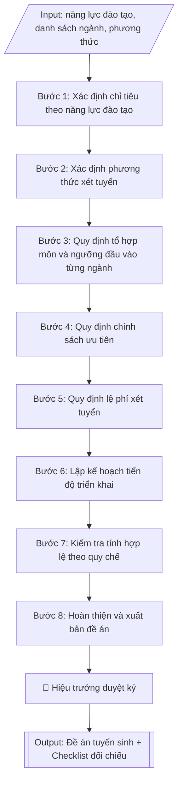

# Soạn đề án tuyển sinh hằng năm

## Định dạng và file đầu ra
Định dạng đầu ra có thể chọn theo sản phẩm/yêu cầu: .docx, .pdf. Đọc mục “Định dạng bổ sung” trong quy cách đầu ra trước khi chọn.

**Phải tạo file thực tế để tải xuống, không chỉ trả nội dung trong chat.** Định dạng mặc định của skill: **.docx**. Nếu có bảng số liệu nghiệp vụ yêu cầu file bảng tính riêng, tạo thêm Excel theo yêu cầu; không tự tạo file kiểm tra. Không chờ người dùng yêu cầu xuất file lần nữa. Ưu tiên định dạng người dùng chỉ định; đọc quy tắc xuất file tại references/quy-cach-dau-ra.md.

## Quy cách đầu ra và thông tin thiếu
Khi dựng file Word/Excel, áp dụng mục “Thể thức và bảng biểu khi dựng file” trong quy cách đầu ra (cỡ chữ từng thành phần, bảng nhiều trang, số trang, phụ lục). Đọc [quy cách và cấu trúc sản phẩm](references/quy-cach-dau-ra.md) trước khi soạn/xuất. File giao chỉ gồm sản phẩm nghiệp vụ được yêu cầu; kiểm tra nội bộ không xuất kèm. Thiếu thông tin thì giữ nguyên trường/mục và chỗ điền theo mẫu gốc (dòng dấu chấm, dấu gạch hoặc ô trống); không tự điền dữ liệu mẫu, số 0, mã chờ xác minh hay dòng chờ ký. Mẫu chuyên ngành còn áp dụng được ưu tiên về cấu trúc, mã biểu và người ký. Bản đầy đủ: [quy tắc chung](references/quy-tac-chung.md).

Khi người dùng yêu cầu bộ slide (.pptx), đọc mục “Xuất PowerPoint (.pptx) khi được yêu cầu” trong quy cách đầu ra.

## Kiểm soát áp dụng và phê duyệt
Trước khi chạy, xác định `ngay_ap_dung`, `loai_hinh_truong`, `quy_che_noi_bo`, `nguon_du_lieu`, `nguoi_kiem_duyet`; chỉ hỏi thông tin liên quan nghiệp vụ, không dùng giá trị giả định thay dữ liệu bắt buộc. Đối chiếu căn cứ pháp lý với văn bản gốc, hiệu lực, điều khoản áp dụng và chuyển tiếp. Bản đầy đủ: [quy tắc chung](references/quy-tac-chung.md).

Nếu có cập nhật pháp lý dưới đây, đọc [căn cứ và điều kiện áp dụng](references/phap-ly.md) trước khi làm. Quy trình dưới đây giữ nghiệp vụ từ bản gốc; mọi viện dẫn văn bản, mẫu biểu, điều khoản phải theo căn cứ đã chọn trong phap-ly.md, không theo văn bản cũ.

## Giới hạn và human gate
AI hỗ trợ chuẩn bị và đối chiếu; cán bộ phụ trách kiểm tra dữ liệu/căn cứ, người có thẩm quyền duyệt và ký. Không đánh dấu đã ký, đã duyệt, đã công bố khi chưa có chứng cứ. Dữ liệu sinh viên, sức khỏe, nhân sự, tài chính chỉ dùng theo mục đích và phân quyền, che thông tin định danh khi dùng ví dụ (Luật 91/2025/QH15, hiệu lực 01/01/2026); không tải dữ liệu lên dịch vụ ngoài khi chưa có quyền. Bản đầy đủ: [quy tắc chung](references/quy-tac-chung.md).

## Khi nào dùng
Khi xây dựng hoặc điều chỉnh đề án tuyển sinh đại học hệ chính quy hằng năm: xác định chỉ tiêu
theo năng lực đào tạo thực tế, quy định các phương thức xét tuyển, tổ hợp môn, ngưỡng đảm bảo
chất lượng đầu vào, chính sách ưu tiên và kế hoạch triển khai.

## Đầu vào (Input)
| Trường | Mô tả | Bắt buộc |
|---|---|---|
| `nam_tuyen_sinh` | Năm tuyển sinh (vd: 2026) | Có |
| `nang_luc_dao_tao` | Số SV quy đổi tối đa theo kết quả xác định năng lực đào tạo từng ngành | Có |
| `danh_sach_nganh` | Tên ngành, mã ngành, chỉ tiêu dự kiến từng ngành | Có |
| `phuong_thuc_xet_tuyen` | Danh sách phương thức (điểm thi TN THPT, học bạ, tuyển thẳng, ĐGNL/ĐGTD...) | Có |
| `to_hop_mon` | Tổ hợp xét tuyển áp dụng cho từng ngành | Có |
| `nguong_dau_vao` | Ngưỡng đảm bảo chất lượng đầu vào tối thiểu từng phương thức/ngành | Có |
| `chinh_sach_uu_tien` | Đối tượng ưu tiên, điểm ưu tiên, tuyển thẳng, cộng điểm | Không |
| `le_phi_xet_tuyen` | Mức lệ phí xét tuyển từng phương thức | Không |
| `tien_do` | Các mốc thời gian: công bố đề án, đăng ký, xét tuyển, nhập học | Không |
| `nguoi_phu_trach` | Người ký/chủ trì đề án | Không (mặc định: Trưởng phòng Đào tạo) |

## Quy trình
**Ràng buộc pháp lý khi thực hiện** (trích references/phap-ly.md; đối chiếu toàn văn và hiệu lực tại ngày nghiệp vụ):
- Thông tư 06/2026/TT-BGDĐT, hiệu lực 15/02/2026: Yêu cầu năm tuyển sinh, phương thức, trình độ và đề án đã duyệt. Đối chiếu quy chế 06/2026 và hướng dẫn năm tuyển sinh về điều kiện, quy đổi điểm, điểm cộng, thứ tự nguyện vọng; không giữ công thức cũ hoặc cộng hai lần chứng chỉ. Không tự đặt chỉ tiêu/ngưỡng khi chưa có quyết định và căn cứ.
- Trước Bước 1: chọn căn cứ theo đối tượng, loại hình trường và chuyển tiếp; lập bảng văn bản / điều khoản / lý do áp dụng / bằng chứng. Thiếu văn bản gốc hoặc điều khoản thì ghi nhận nội bộ [CẦN XÁC MINH] (không đưa vào file giao), để trống phần tương ứng, chưa kết luận tuân thủ.
- Các con số, thời hạn, số điều, số mức xếp loại, hệ số và mẫu biểu nêu trong các bước dưới đây được giữ từ quy trình gốc (trước cập nhật pháp lý); chỉ dùng khi đã đối chiếu đúng với căn cứ đã chọn, khác thì theo căn cứ. Danh sách điểm cần đối chiếu: docs/DIEM_CAN_DOI_CHIEU_PHAP_LY.md.

**Bước 1. Xác định chỉ tiêu theo năng lực đào tạo**
- Làm gì: thu thập kết quả xác định năng lực đào tạo (NLĐT) năm gần nhất của từng ngành —
  số giảng viên cơ hữu, quy mô sinh viên/giảng viên, diện tích sàn bình quân trên người học;
  lấy tổng số sinh viên quy đổi làm "trần cứng". Phân bổ chỉ tiêu từng ngành theo 3 căn cứ:
  (a) nhu cầu xã hội và tỷ lệ việc làm sau tốt nghiệp; (b) kết quả tuyển sinh 2–3 năm gần
  nhất (tỷ lệ nhập học/chỉ tiêu); (c) định hướng phát triển của trường. Cộng tổng và đối
  chiếu không vượt NLĐT đã công bố.
- Dùng input: `nam_tuyen_sinh`, `nang_luc_dao_tao`, `danh_sach_nganh`.
- Vai trò: Chuyên viên Phòng Đào tạo · AI hỗ trợ: tổng hợp sơ bộ số liệu NLĐT, cảnh báo tổng vượt trần · ⏱ ~1 giờ (ước tính)
- Lưu ý nghiệp vụ: bẫy thường gặp là lấy số liệu NLĐT năm cũ — phải dùng năm gần nhất
  đã công bố trên website trường; tổng chỉ tiêu vượt trần là lỗi khiến đề án bị Bộ trả về;
  các ngành thuộc lĩnh vực sức khỏe có cấp chứng chỉ hành nghề và ngành sư phạm còn bị
  khống chế chỉ tiêu riêng theo văn bản giao của Bộ, phải tách ra kiểm tra riêng.
- → Kết quả bước: bảng phân bổ chỉ tiêu từng ngành kèm căn cứ (số liệu NLĐT, tỷ lệ đạt
  chỉ tiêu 2 năm gần nhất).

**Bước 2. Xác định phương thức xét tuyển**
- Làm gì: liệt kê đầy đủ các phương thức trường áp dụng trong năm từ `phuong_thuc_xet_tuyen`;
  với mỗi phương thức quy định tỷ lệ chỉ tiêu phân bổ (tổng các phương thức bằng 100%) và
  cách quy đổi điểm tương đương giữa các phương thức theo hướng dẫn của Bộ GD&ĐT; kiểm tra
  mỗi ngành đều được gán ít nhất một phương thức.
- Dùng input: `phuong_thuc_xet_tuyen`, `danh_sach_nganh`, `nguong_dau_vao`.
- Vai trò: Chuyên viên Phòng Đào tạo · AI hỗ trợ: soạn dự thảo bảng phương thức, đối chiếu quy chế · ⏱ ~45 phút (ước tính)
- Lưu ý nghiệp vụ: không tự đặt công thức quy đổi điểm "lạ" ngoài hướng dẫn của Bộ;
  phương thức mới (kỳ thi ĐGNL/ĐGTD, chứng chỉ ngoại ngữ quốc tế kết hợp) phải ghi rõ đơn
  vị tổ chức kỳ thi được công nhận; tỷ lệ chỉ tiêu mỗi phương thức phải quy được ra số
  tuyệt đối để đối chiếu với tổng chỉ tiêu ở Bước 1.
- → Kết quả bước: bảng phương thức xét tuyển với tỷ lệ chỉ tiêu và quy tắc quy đổi điểm.

**Bước 3. Quy định tổ hợp môn và ngưỡng đầu vào từng ngành**
- Làm gì: với từng ngành trong `danh_sach_nganh`, gán tổ hợp môn từ `to_hop_mon`; với từng
  phương thức, ghi ngưỡng đảm bảo chất lượng đầu vào tối thiểu từ `nguong_dau_vao`. Đối
  chiếu: tổ hợp môn phải phù hợp đặc thù ngành (ngành ngôn ngữ phải có môn ngoại ngữ trong
  tổ hợp); ngưỡng các ngành sức khỏe/sư phạm không thấp hơn ngưỡng tối thiểu do Bộ quy định.
- Dùng input: `danh_sach_nganh`, `to_hop_mon`, `nguong_dau_vao`, `phuong_thuc_xet_tuyen`.
- Vai trò: Chuyên viên Phòng Đào tạo · AI hỗ trợ: soạn sơ bộ bảng tổ hợp/ngưỡng, kiểm tra tính phù hợp đặc thù ngành · ⏱ ~1 giờ (ước tính)
- Lưu ý nghiệp vụ: bẫy thường gặp là tổ hợp môn thiếu môn phù hợp ngành (vd: không có môn
  Toán cho ngành kỹ thuật) gây tranh cãi khi kiểm định; đặt ngưỡng khác nhau giữa các ngành
  mà không có lý do thuyết minh; thiếu ngưỡng cho phương thức mới bổ sung ở Bước 2.
- → Kết quả bước: bảng tổ hợp môn và ngưỡng đầu vào chi tiết theo từng ngành, từng
  phương thức.

**Bước 4. Quy định chính sách ưu tiên**
- Làm gì: liệt kê đối tượng ưu tiên (đối tượng chính sách, khu vực) và mức cộng điểm ưu tiên
  từ `chinh_sach_uu_tien`; quy định đối tượng tuyển thẳng/ưu tiên xét tuyển và ngành áp dụng;
  ghi rõ cách cộng điểm ưu tiên vào tổng điểm xét tuyển và mức tối đa được cộng.
- Dùng input: `chinh_sach_uu_tien`.
- Vai trò: Chuyên viên Phòng Đào tạo · AI hỗ trợ: soạn dự thảo, đối chiếu văn bản hiện hành nêu tại phap-ly.md · ⏱ ~30 phút (ước tính)
- Lưu ý nghiệp vụ: mức cộng điểm ưu tiên có trần tối đa theo quy chế — kiểm tra văn bản hiện hành nêu tại phap-ly.md và văn bản sửa đổi, bổ sung hiện hành; đối tượng tuyển thẳng phải đúng danh mục
  Bộ công bố, không tự "sáng tác" thêm đối tượng; phải ghi rõ mức cộng tối đa để tránh
  khiếu nại sau này.
- → Kết quả bước: mục chính sách ưu tiên hoàn chỉnh (đối tượng, khu vực, mức điểm,
  điều kiện tuyển thẳng).

**Bước 5. Quy định lệ phí xét tuyển**
- Làm gì: quy định mức lệ phí cho từng phương thức từ `le_phi_xet_tuyen` (phương thức xét
  điểm thi TN THPT tính theo nguyện vọng; xét học bạ/ĐGNL tính theo hồ sơ); ghi rõ hình thức
  nộp lệ phí và chính sách miễn/giảm (nếu có); đối chiếu mức thu với quy định của Bộ GD&ĐT
  và Bộ Tài chính.
- Dùng input: `le_phi_xet_tuyen`, `phuong_thuc_xet_tuyen`.
- Vai trò: Chuyên viên Phòng Đào tạo · AI hỗ trợ: soạn dự thảo bảng lệ phí, kiểm tra trần mức thu · ⏱ ~20 phút (ước tính)
- Lưu ý nghiệp vụ: mức thu không được vượt trần quy định; phương thức nào miễn phí phải ghi
  rõ "miễn phí" thay vì bỏ trống (bỏ trống dễ bị hiểu là thiếu sót khi kiểm tra).
- → Kết quả bước: bảng lệ phí xét tuyển theo từng phương thức.

**Bước 6. Lập kế hoạch tiến độ triển khai**
- Làm gì: dựng lịch triển khai từ `tien_do` theo các mốc bắt buộc: công bố đề án → tư vấn
  hướng nghiệp → nhận hồ sơ/đăng ký xét tuyển → tổ chức xét tuyển → công bố kết quả →
  xác nhận nhập học → nhập học chính thức → xét tuyển bổ sung (nếu còn chỉ tiêu); mỗi mốc
  ghi thời gian cụ thể và đơn vị chủ trì/phối hợp.
- Dùng input: `tien_do`, `nam_tuyen_sinh`.
- Vai trò: Chuyên viên Phòng Đào tạo · AI hỗ trợ: dựng lịch sơ bộ, đối chiếu khớp lịch chung Bộ GD&ĐT · ⏱ ~30 phút (ước tính)
- Lưu ý nghiệp vụ: lịch xét tuyển đợt chính phải khớp lịch chung Bộ GD&ĐT công bố hằng năm —
  lịch Bộ có thể điều chỉnh, cần cập nhật trước khi ban hành; mốc công bố đề án phải trước
  thời điểm thí sinh đăng ký nguyện vọng theo quy định.
- → Kết quả bước: bảng tiến độ triển khai với mốc thời gian, nội dung và đơn vị thực hiện.

**Bước 7. Kiểm tra tính hợp lệ theo quy chế**
- Làm gì: đối chiếu toàn bộ dự thảo với Quy chế tuyển sinh (văn bản hiện hành nêu tại phap-ly.md):
  tổng chỉ tiêu không vượt NLĐT; tổ hợp môn phù hợp với từng ngành; ngưỡng đầu vào đúng
  quy định (đặc biệt ngành sức khỏe, sư phạm); lệ phí đúng mức; thông tin công khai đầy đủ
  theo danh mục Bộ yêu cầu. Lập checklist đánh dấu đạt/chưa đạt từng nội dung.
- Dùng input: toàn bộ các trường input (rà soát chéo số liệu giữa các bảng).
- Vai trò: Chuyên viên Phòng Đào tạo · AI hỗ trợ: đối chiếu sơ bộ toàn văn với văn bản hiện hành nêu tại phap-ly.md, lập checklist · ⏱ ~1 giờ (ước tính)
- Lưu ý nghiệp vụ: đây là cổng chặn lỗi cuối — sai sót ở đây (nhất là tổng chỉ tiêu vượt
  NLĐT hoặc ngưỡng thấp hơn quy định) khiến đề án bị trả về; kiểm tra cộng chéo: tổng chỉ
  tiêu các ngành phải bằng tổng chỉ tiêu các phương thức.
- → Kết quả bước: checklist đối chiếu quy chế có đánh dấu đạt/chưa đạt từng nội dung;
  danh sách lỗi cần sửa (nếu có) để quay lại các bước tương ứng.

**Bước 8. Hoàn thiện và xuất bản đề án**
- Làm gì: sửa toàn bộ lỗi phát hiện ở Bước 7; trình `nguoi_phu_trach` (mặc định Trưởng phòng
  Đào tạo) ký duyệt; xuất bản đề án hoàn chỉnh theo định dạng đầu ra của skill gồm văn bản và các bảng (chỉ
  tiêu, phương thức, tổ hợp/ngưỡng, tiến độ) kèm checklist đối chiếu; đăng công khai trên
  trang thông tin điện tử của trường.
- Dùng input: `nguoi_phu_trach`, `nam_tuyen_sinh`.
- Vai trò: Hiệu trưởng ký duyệt; chuyên viên Phòng Đào tạo hoàn thiện và đăng công khai · AI hỗ trợ: hoàn thiện văn bản, định dạng hồ sơ trình ký · ⏱ ~45 phút (ước tính)
- Lưu ý nghiệp vụ: đề án phải được công bố công khai trước khi thí sinh đăng ký xét tuyển;
  lưu bản ký (ký số/ký giấy) vào hồ sơ pháp chế của Phòng Đào tạo.
- → Kết quả bước: đề án tuyển sinh hoàn chỉnh, sẵn sàng trình ký và công bố.

## Luồng quy trình (Workflow)

## Đầu ra
- Đề án tuyển sinh hoàn chỉnh (văn bản + bảng chỉ tiêu, bảng phương thức/tổ hợp/ngưỡng từng ngành).
- Checklist đối chiếu quy chế tuyển sinh của Bộ GD&ĐT.

File nghiệp vụ thực tế theo định dạng mặc định ở đầu skill hoặc định dạng người dùng yêu cầu, kèm liên kết tải trong phản hồi cuối.

Sản phẩm nghiệp vụ hoàn chỉnh theo [quy cách và cấu trúc](references/quy-cach-dau-ra.md), giữ các trường chưa có dữ liệu ở trạng thái trống. Không xuất kèm checklist/phụ lục kiểm tra đầu ra.

## Kiểm tra nội bộ trước khi giao
Các tiêu chí sau dùng để tự đối chiếu; không sao chép vào file xuất. Mục thiếu dữ liệu được để trống, không đánh dấu đã đạt hoặc đã duyệt.

- [ ] Đủ các phần và đúng bố cục theo cấu trúc tại references/quy-cach-dau-ra.md (không theo cấu trúc của bản gốc).
- [ ] Tổng chỉ tiêu không vượt năng lực đào tạo đã công bố (trần cứng), kể cả ngành sức khỏe/sư phạm bị khống chế riêng.
- [ ] Tổng chỉ tiêu theo ngành bằng tổng chỉ tiêu theo phương thức (cộng chéo khớp nhau).
- [ ] Tổ hợp môn phù hợp đặc thù từng ngành (ngành ngôn ngữ có môn ngoại ngữ; ngành kỹ thuật có môn Toán).
- [ ] Ngưỡng đầu vào ngành sức khỏe/sư phạm không thấp hơn ngưỡng tối thiểu do Bộ quy định.
- [ ] Chỉ tiêu, tỷ lệ phương thức, tổ hợp, ngưỡng, lệ phí, tiến độ khớp đúng Input đã cho.
- [ ] Không bịa đặt số liệu năng lực đào tạo, căn cứ pháp lý, số văn bản hay trích dẫn.
- [ ] Đúng thể thức văn bản hành chính theo NĐ 30/2020/NĐ-CP.
- [ ] Căn cứ pháp lý đầy đủ, còn hiệu lực (Quy chế tuyển sinh văn bản hiện hành nêu tại phap-ly.md và văn bản sửa đổi, bổ sung hiện hành).
- [ ] Đã qua Human gate: đề án đã được người có thẩm quyền duyệt ký trước khi công bố.

## Căn cứ & lưu ý
- Căn cứ hiện hành: xem [căn cứ và điều kiện áp dụng](references/phap-ly.md); phải đối chiếu văn bản gốc, hiệu lực và chuyển tiếp tại ngày nghiệp vụ.
- Chỉ tiêu tuyển sinh xác định hằng năm không vượt quá năng lực đào tạo của cơ sở
  đào tạo (khoản 2 Điều 4 Quy chế tuyển sinh).
- Đề án tuyển sinh phải được công bố công khai trên trang thông tin điện tử của
  trường trước khi thí sinh đăng ký xét tuyển.
- Không dùng tên thật của trường/cá nhân khi mô phỏng.

## Tư liệu đối chiếu
Bản gốc trước cập nhật pháp lý (kèm ví dụ giả lập) lưu tại `references/quy-trinh-lich-su.md`, chỉ để đối chiếu hồ sơ lịch sử; không dùng căn cứ, mẫu hay số liệu trong đó làm chỉ dẫn hiện hành.

## Quản trị phiên bản
- Phiên bản gói `1.3.2` (cập nhật 2026-10-10); hồ sơ đầy đủ tại [references/version.json](references/version.json).
- Người phê duyệt nghiệp vụ: **chưa chỉ định**. Trạng thái: dự thảo nghiệp vụ; kiểm tra pháp lý trước thực thi. Ngày cập nhật không đồng nghĩa mọi văn bản đã được rà soát toàn văn.
- Giấy phép theo LICENSE của kho (bản quyền CES Global). Lịch sử thay đổi: CHANGELOG.md.
