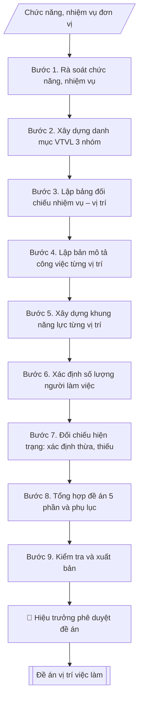

# Xây dựng đề án vị trí việc làm

## Định dạng và file đầu ra

Định dạng đầu ra có thể chọn theo sản phẩm/yêu cầu: .docx, .pdf. Đọc mục “Định dạng bổ sung” trong quy cách đầu ra trước khi chọn.

**Phải tạo file thực tế để tải xuống, không chỉ trả nội dung trong chat.** Định dạng mặc định của skill: **.docx**. Nếu có bảng số liệu nghiệp vụ yêu cầu file bảng tính riêng, tạo thêm Excel theo yêu cầu; không tự tạo file kiểm tra. Không chờ người dùng yêu cầu xuất file lần nữa. Ưu tiên định dạng người dùng chỉ định; đọc quy tắc xuất file tại references/quy-cach-dau-ra.md.

## Quy cách đầu ra và thông tin thiếu
Khi dựng file Word/Excel, áp dụng mục “Thể thức và bảng biểu khi dựng file” trong quy cách đầu ra (cỡ chữ từng thành phần, bảng nhiều trang, số trang, phụ lục). Đọc [quy cách và cấu trúc sản phẩm](references/quy-cach-dau-ra.md) trước khi soạn/xuất. File giao chỉ gồm sản phẩm nghiệp vụ được yêu cầu; kiểm tra nội bộ không xuất kèm. Thiếu thông tin thì giữ nguyên trường/mục và chỗ điền theo mẫu gốc (dòng dấu chấm, dấu gạch hoặc ô trống); không tự điền dữ liệu mẫu, số 0, mã chờ xác minh hay dòng chờ ký. Mẫu chuyên ngành còn áp dụng được ưu tiên về cấu trúc, mã biểu và người ký. Bản đầy đủ: [quy tắc chung](references/quy-tac-chung.md).

Khi người dùng yêu cầu bộ slide (.pptx), đọc mục “Xuất PowerPoint (.pptx) khi được yêu cầu” trong quy cách đầu ra.

## Kiểm soát áp dụng và phê duyệt
Trước khi chạy, xác định `ngay_ap_dung`, `loai_hinh_truong`, `quy_che_noi_bo`, `nguon_du_lieu`, `nguoi_kiem_duyet`; chỉ hỏi thông tin liên quan nghiệp vụ, không dùng giá trị giả định thay dữ liệu bắt buộc. Đối chiếu căn cứ pháp lý với văn bản gốc, hiệu lực, điều khoản áp dụng và chuyển tiếp. Bản đầy đủ: [quy tắc chung](references/quy-tac-chung.md).

## Giới hạn và human gate
AI hỗ trợ chuẩn bị và đối chiếu; cán bộ phụ trách kiểm tra dữ liệu/căn cứ, người có thẩm quyền duyệt và ký. Không đánh dấu đã ký, đã duyệt, đã công bố khi chưa có chứng cứ. Dữ liệu sinh viên, sức khỏe, nhân sự, tài chính chỉ dùng theo mục đích và phân quyền, che thông tin định danh khi dùng ví dụ (Luật 91/2025/QH15, hiệu lực 01/01/2026); không tải dữ liệu lên dịch vụ ngoài khi chưa có quyền. Bản đầy đủ: [quy tắc chung](references/quy-tac-chung.md).

## Khi nào dùng
Khi trường (hoặc một đơn vị trực thuộc) cần xây dựng / rà soát, điều chỉnh đề án vị trí việc làm:
làm rõ mỗi vị trí làm gì (bản mô tả công việc), cần năng lực gì (khung năng lực), cần bao nhiêu người
(số lượng theo định mức) — làm căn cứ cho tuyển dụng, bố trí, bổ nhiệm, đào tạo, đánh giá viên chức
và xác định số lượng người làm việc hưởng lương từ ngân sách.

## Đầu vào (Input)

| Trường | Mô tả | Bắt buộc |
|---|---|---|
| `pham_vi` | Toàn trường / một đơn vị trực thuộc (ghi rõ tên đơn vị) | Có |
| `chuc_nang_nhiem_vu` | Chức năng, nhiệm vụ của trường/đơn vị theo quy chế tổ chức và hoạt động | Có |
| `hien_trang_nhan_su` | Số viên chức, người lao động hiện có, phân theo trình độ, ngạch/chức danh nghề nghiệp | Có |
| `danh_muc_vi_tri` | Danh sách vị trí việc làm dự kiến (tên vị trí, thuộc nhóm: lãnh đạo quản lý / chuyên môn nghiệp vụ / hỗ trợ phục vụ) | Có |
| `dinh_muc` | Định mức, căn cứ xác định số lượng cho từng vị trí (tỷ lệ SV/GV, khối lượng công việc, quy định hiện hành) | Không |
| `de_xuat_dieu_chinh` | Các vị trí đề nghị bổ sung, sáp nhập hoặc xóa bỏ so với đề án hiện hành (nếu rà soát lại) | Không |
| `nguoi_ky` | Hiệu trưởng | Có |

## Quy trình

**Bước 1. Rà soát chức năng, nhiệm vụ**
- Làm gì: đọc kỹ `chuc_nang_nhiem_vu` của trường/đơn vị theo quy chế tổ chức và hoạt động và
chiến lược phát triển; liệt kê từng nhiệm vụ thành danh sách đánh số; đánh dấu các nhiệm vụ
mới phát sinh hoặc nhiệm vụ đã thay đổi so với đề án hiện hành (nếu rà soát lại).
- Dùng input: `pham_vi`, `chuc_nang_nhiem_vu`, `de_xuat_dieu_chinh`.
- Vai trò: Chuyên viên Phòng TCCB (Trưởng phòng kiểm tra lại) · AI hỗ trợ: quét lỗi theo checklist · ⏱ ~15–30 phút (ước tính)
- Lưu ý nghiệp vụ: mọi vị trí việc làm phải xuất phát từ nhiệm vụ được giao — nhiệm vụ nào
không có vị trí phụ trách thì đề án thiếu, vị trí nào không gắn với nhiệm vụ nào thì đề án
thừa; khi rà soát lại, đối chiếu với đề án cũ để xác định vị trí cần bổ sung/sáp nhập/xóa bỏ.
- → Kết quả bước: danh sách nhiệm vụ đã rà soát (đánh số, ghi chú nhiệm vụ mới/thay đổi).

**Bước 2. Xây dựng danh mục vị trí việc làm theo 3 nhóm**
- Làm gì: từ danh sách nhiệm vụ ở Bước 1, xác định các vị trí việc làm cần thiết, phân thành
3 nhóm theo văn bản về vị trí việc làm hiện hành (đối chiếu Nghị định 232/2026/NĐ-CP): (a) lãnh đạo, quản lý; (b) chức danh nghề nghiệp chuyên
ngành; (c) chức danh nghề nghiệp chuyên môn dùng chung và hỗ trợ, phục vụ; đối chiếu với
`danh_muc_vi_tri` dự kiến và `de_xuat_dieu_chinh` (bổ sung/sáp nhập/xóa bỏ).
- Dùng input: `danh_muc_vi_tri`, `de_xuat_dieu_chinh` + kết quả Bước 1.
- Vai trò: Chuyên viên Phòng TCCB · AI hỗ trợ: soạn dự thảo đúng thể thức · ⏱ ~20–45 phút (ước tính)
- Lưu ý nghiệp vụ: tên vị trí phải thống nhất với danh mục chức danh nghề nghiệp viên chức
theo quy định (không tự đặt tên vị trí lạ); vị trí lãnh đạo, quản lý phải gắn với cơ cấu
tổ chức đã được phê duyệt; mỗi đề xuất bổ sung/sáp nhập/xóa bỏ phải nêu rõ lý do gắn với
nhiệm vụ.
- → Kết quả bước: danh mục vị trí việc làm dự thảo (phân 3 nhóm, ghi chú vị trí mới/sáp nhập/xóa bỏ).

**Bước 3. Lập bảng đối chiếu nhiệm vụ – vị trí**
- Làm gì: lập bảng ma trận đối chiếu từng nhiệm vụ ở Bước 1 với vị trí ở Bước 2: mỗi nhiệm vụ
phải có ít nhất một vị trí phụ trách; mỗi vị trí phải gắn với ít nhất một nhiệm vụ; đánh dấu
các ô trống (nhiệm vụ chưa có vị trí phụ trách / vị trí chưa gắn nhiệm vụ) để điều chỉnh
danh mục.
- Dùng input: kết quả Bước 1–2.
- Vai trò: Chuyên viên Phòng TCCB (Trưởng phòng kiểm tra lại) · AI hỗ trợ: lập bảng tính toán · ⏱ ~15–30 phút (ước tính)
- Lưu ý nghiệp vụ: đây là bước kiểm soát chất lượng quan trọng nhất của đề án — bỏ qua sẽ
dẫn đến đề án có vị trí "trang trí" hoặc nhiệm vụ không ai làm; sau khi lấp đầy ma trận mới
được sang bước mô tả công việc.
- → Kết quả bước: bảng đối chiếu nhiệm vụ – vị trí (ma trận đầy đủ, không ô trống).

**Bước 4. Lập bản mô tả công việc cho từng vị trí**
- Làm gì: viết bản mô tả cho từng vị trí trong danh mục Bước 2, gồm: tên vị trí; nhóm vị trí;
mục đích vị trí (vị trí này tồn tại để làm gì); nhiệm vụ, công việc cụ thể (liệt kê theo
nhiệm vụ đã gắn ở Bước 3); quyền hạn; mối quan hệ công tác (báo cáo ai, phối hợp với ai).
- Dùng input: kết quả Bước 2–3.
- Vai trò: Chuyên viên Phòng TCCB · AI hỗ trợ: xử lý sơ bộ theo quy trình · ⏱ ~20–45 phút (ước tính)
- Lưu ý nghiệp vụ: nhiệm vụ trong bản mô tả phải là công việc cụ thể, đo đếm được (tránh
viết chung chung kiểu "thực hiện các nhiệm vụ khác"); quyền hạn phải tương xứng với nhiệm vụ;
bản mô tả của các vị trí cùng nhóm phải có độ chi tiết đồng đều.
- → Kết quả bước: bộ bản mô tả công việc của từng vị trí (dự thảo).

**Bước 5. Xây dựng khung năng lực cho từng vị trí**
- Làm gì: cho từng vị trí, xác định: kiến thức chuyên môn cần có; kỹ năng (chuyên môn + kỹ
năng mềm); phẩm chất, thái độ; tiêu chuẩn về trình độ đào tạo, bồi dưỡng, chứng chỉ, ngoại
ngữ, tin học theo hạng chức danh nghề nghiệp tương ứng của vị trí đó.
- Dùng input: kết quả Bước 2, Bước 4.
- Vai trò: Chuyên viên Phòng TCCB · AI hỗ trợ: soạn dự thảo đúng thể thức · ⏱ ~20–45 phút (ước tính)
- Lưu ý nghiệp vụ: tiêu chuẩn trình độ phải khớp với tiêu chuẩn chức danh nghề nghiệp viên
chức theo hạng tương ứng (không đặt cao hơn hoặc thấp hơn quy định); khung năng lực là căn
cứ tuyển dụng và đánh giá sau này nên phải thực tế, không "lý tưởng hóa".
- → Kết quả bước: khung năng lực của từng vị trí (kiến thức | kỹ năng | phẩm chất |
tiêu chuẩn trình độ).

**Bước 6. Xác định số lượng người làm việc cho từng vị trí**
- Làm gì: căn cứ khối lượng công việc (từ bản mô tả Bước 4) và `dinh_muc` (tỷ lệ SV/GV, định
mức hồ sơ/người, quy định hiện hành) để tính số người cần cho từng vị trí; kiểm tra tổng số
phù hợp khả năng ngân sách; tổng hợp thành bảng "danh mục vị trí việc làm và số lượng người
làm việc".
- Dùng input: `dinh_muc`, `hien_trang_nhan_su` + kết quả Bước 4.
- Vai trò: Chuyên viên Phòng TCCB · AI hỗ trợ: phân tích input, xác định yêu cầu · ⏱ ~20–45 phút (ước tính)
- Lưu ý nghiệp vụ: số lượng phải có căn cứ định mức cụ thể cho từng vị trí (không ước lượng
cảm tính); tổng số người làm việc hưởng lương từ ngân sách phải nằm trong chỉ tiêu được giao;
ghi rõ cách tính để cơ quan phê duyệt kiểm tra được.
- → Kết quả bước: bảng danh mục vị trí việc làm và số lượng người làm việc (có căn cứ tính).

**Bước 7. Đối chiếu hiện trạng, xác định thừa/thiếu**
- Làm gì: so sánh số lượng theo đề án (Bước 6) với `hien_trang_nhan_su` hiện có theo từng vị
trí → xác định thừa/thiếu từng vị trí; đề xuất phương án: tuyển dụng mới, đào tạo/bồi dưỡng,
điều động/sắp xếp lại, tinh giản; xây dựng lộ trình thực hiện theo năm.
- Dùng input: `hien_trang_nhan_su` + kết quả Bước 6.
- Vai trò: Chuyên viên Phòng TCCB (Trưởng phòng kiểm tra lại) · AI hỗ trợ: phân tích input, xác định yêu cầu · ⏱ ~15–30 phút (ước tính)
- Lưu ý nghiệp vụ: vị trí thiếu nhưng chưa tuyển ngay được thì phải có giải pháp tạm thời
(kiêm nhiệm, hợp đồng); vị trí thừa phải có lộ trình sắp xếp lại phù hợp quy định, không
đề xuất tinh giản đột ngột; lộ trình gắn với năm cụ thể và nguồn kinh phí.
- → Kết quả bước: bảng đối chiếu hiện trạng – nhu cầu (vị trí | hiện có | theo đề án |
thừa/thiếu | phương án) + lộ trình thực hiện.

**Bước 8. Tổng hợp thành đề án hoàn chỉnh**
- Làm gì: hợp nhất kết quả các bước thành văn bản đề án với bố cục 5 phần: I. Sự cần thiết
và căn cứ xây dựng đề án (1. sự cần thiết — nêu từ thực trạng và Bước 7; 2. căn cứ pháp lý:
văn bản vị trí việc làm hiện hành, quy chế trường/đơn vị); II. Thực trạng tổ chức bộ máy và nhân sự (từ
`hien_trang_nhan_su`); III. Danh mục vị trí việc làm, mô tả công việc, khung năng lực và số
lượng (kết quả Bước 2, 4, 5, 6 — trình bày theo 3 nhóm); IV. Phương án sắp xếp, bố trí nhân
sự và lộ trình thực hiện (kết quả Bước 7); V. Kiến nghị, đề xuất (trình `nguoi_ky` phê duyệt);
kèm phụ lục: bảng danh mục vị trí việc làm, các bản mô tả công việc chi tiết.
- Dùng input: `nguoi_ky` + kết quả Bước 1–7.
- Vai trò: Chuyên viên Phòng TCCB · AI hỗ trợ: tổng hợp và chuẩn hóa dữ liệu · ⏱ ~20–45 phút (ước tính)
- Lưu ý nghiệp vụ: phần I.1 (sự cần thiết) phải nêu được vấn đề thực tế cần giải quyết
(thiếu vị trí, chồng chéo nhiệm vụ...) — không viết chung chung; các số liệu giữa phần II,
III, IV và phụ lục phải khớp nhau tuyệt đối.
- → Kết quả bước: dự thảo đề án vị trí việc làm hoàn chỉnh (5 phần + phụ lục).

**Bước 9. Kiểm tra và xuất bản**
- Làm gì: soát toàn văn: đủ 3 nhóm vị trí theo văn bản vị trí việc làm hiện hành; nhất quán giữa chức năng –
nhiệm vụ – vị trí – số lượng (đối chiếu lại ma trận Bước 3); căn cứ pháp lý đầy đủ; thể thức
văn bản theo NĐ 30/2020 (đề án ban hành kèm quyết định phê duyệt của cấp có thẩm quyền);
hoàn thiện file theo định dạng đầu ra của skill, sẵn sàng trình phê duyệt.
- Dùng input: toàn bộ input (tổng soát).
- Vai trò: Chuyên viên Phòng TCCB (Trưởng phòng kiểm tra lại) · AI hỗ trợ: quét lỗi theo checklist · ⏱ ~15–30 phút (ước tính)
- Lưu ý nghiệp vụ: checklist văn bản vị trí việc làm hiện hành là công cụ kiểm tra cuối cùng — mọi mục không đạt
phải quay lại bước tương ứng sửa trước khi trình; đề án chỉ có giá trị sau khi được cấp có
thẩm quyền phê duyệt bằng quyết định.
- → Kết quả bước: đề án vị trí việc làm hoàn chỉnh + bảng đối chiếu hiện trạng nhân sự +
checklist theo văn bản vị trí việc làm hiện hành, sẵn sàng trình phê duyệt.

## Luồng quy trình (Workflow)

## Đầu ra

File nghiệp vụ thực tế theo định dạng mặc định ở đầu skill hoặc định dạng người dùng yêu cầu, kèm liên kết tải trong phản hồi cuối.

Sản phẩm nghiệp vụ hoàn chỉnh theo [quy cách và cấu trúc](references/quy-cach-dau-ra.md), giữ các trường chưa có dữ liệu ở trạng thái trống. Không xuất kèm checklist/phụ lục kiểm tra đầu ra.

## Kiểm tra nội bộ trước khi giao

Các tiêu chí sau dùng để tự đối chiếu; không sao chép vào file xuất. Mục thiếu dữ liệu được để trống, không đánh dấu đã đạt hoặc đã duyệt.

- [ ] Bố cục khớp mẫu áp dụng và cấu trúc tại references/quy-cach-dau-ra.md.
- [ ] Nội dung và số liệu trong output khớp đúng với Input đã cho (không thêm, bớt hay suy diễn)
- [ ] Không bịa đặt số liệu, minh chứng, trích dẫn hay căn cứ
- [ ] Đúng thể thức theo văn bản vị trí việc làm hiện hành và Nghị định 30/2020/NĐ-CP; đối chiếu hiệu lực của căn cứ tại ngày nghiệp vụ.
- [ ] Căn cứ pháp lý được trích dẫn đầy đủ và còn hiệu lực
- [ ] Không coi bản soạn là đã ký/đã duyệt; việc phê duyệt thuộc người có thẩm quyền trước phát hành
- [ ] Mọi vị trí việc làm phải xuất phát từ nhiệm vụ được giao — nhiệm vụ nào
- [ ] Tên vị trí phải thống nhất với danh mục chức danh nghề nghiệp viên chức
- [ ] Nhiệm vụ trong bản mô tả phải là công việc cụ thể, đo đếm được (tránh

## Căn cứ & lưu ý
- Căn cứ vị trí việc làm: Nghị định 232/2026/NĐ-CP về vị trí việc làm viên chức (theo nguồn thứ cấp, một công văn địa phương tháng 9/2026; chưa đọc toàn văn nên chưa biết nghị định này thay thế văn bản nào); cần Tổ chức cán bộ/pháp chế xác nhận
  trong đơn vị sự nghiệp công lập.
- Nghị định 30/2020/NĐ-CP về công tác văn thư (thể thức văn bản; đề án ban hành
  kèm quyết định phê duyệt của cấp có thẩm quyền).
- Quy chế tổ chức và hoạt động của trường/đơn vị; quy định công tác cán bộ
  (tiêu chuẩn chức danh nghề nghiệp viên chức theo từng hạng).
- Đề án vị trí việc làm là căn cứ pháp lý cho tuyển dụng, bổ nhiệm, đào tạo,
  đánh giá viên chức — số lượng người làm việc phải phù hợp khả năng ngân sách.
- Không dùng tên thật của trường/cá nhân khi mô phỏng.

## Quản trị phiên bản
- Phiên bản gói `1.3.2` (cập nhật 2026-10-10); hồ sơ đầy đủ tại [references/version.json](references/version.json).
- Người phê duyệt nghiệp vụ: **chưa chỉ định**. Trạng thái: dự thảo nghiệp vụ; kiểm tra pháp lý trước thực thi. Ngày cập nhật không đồng nghĩa mọi văn bản đã được rà soát toàn văn.
- Giấy phép theo LICENSE của kho (bản quyền CES Global). Lịch sử thay đổi: CHANGELOG.md.
