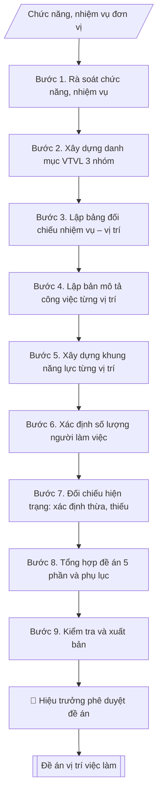

# Xây dựng đề án vị trí việc làm

## Kiểm soát áp dụng và phê duyệt

Trước khi chạy quy trình, xác định `ngay_ap_dung`, `loai_hinh_truong`, `quy_che_noi_bo`, `nguon_du_lieu` và `nguoi_kiem_duyet`. Chỉ yêu cầu thông tin có liên quan đến nghiệp vụ; không dùng giá trị giả định thay dữ liệu bắt buộc. Hồ sơ có yếu tố pháp lý phải kèm văn bản gốc, tình trạng hiệu lực, điều khoản áp dụng và chuyển tiếp.

## Giới hạn và human gate

AI hỗ trợ chuẩn bị và đối chiếu. Cán bộ phụ trách kiểm tra dữ liệu/căn cứ, người có thẩm quyền duyệt và ký. Mọi đầu ra mặc định là **DỰ THẢO – CHỜ KIỂM DUYỆT**; không đánh dấu đã ký, đã duyệt hoặc đã công bố nếu chưa có chứng cứ. Dữ liệu sinh viên, sức khỏe, nhân sự và tài chính phải hạn chế theo mục đích, phân quyền và che thông tin định danh khi dùng ví dụ. Không tải dữ liệu lên dịch vụ ngoài khi chưa có quyền. Kiểm tra Luật 91/2025/QH15 về bảo vệ dữ liệu cá nhân (hiệu lực 01/01/2026) và quy định áp dụng trước xử lý/chia sẻ dữ liệu cá nhân.


## Khi nào dùng
Khi trường (hoặc một đơn vị trực thuộc) cần xây dựng / rà soát, điều chỉnh đề án vị trí việc làm:
làm rõ mỗi vị trí làm gì (bản mô tả công việc), cần năng lực gì (khung năng lực), cần bao nhiêu người
(số lượng theo định mức) — làm căn cứ cho tuyển dụng, bố trí, bổ nhiệm, đào tạo, đánh giá viên chức
và xác định số lượng người làm việc hưởng lương từ ngân sách.

## Đầu vào (Input)

| Trường | Mô tả | Bắt buộc |
|---|---|---|
| `pham_vi` | Toàn trường / một đơn vị trực thuộc (ghi rõ tên đơn vị) | Có |
| `chuc_nang_nhiem_vu` | Chức năng, nhiệm vụ của trường/đơn vị theo quy chế tổ chức và hoạt động | Có |
| `hien_trang_nhan_su` | Số viên chức, người lao động hiện có, phân theo trình độ, ngạch/chức danh nghề nghiệp | Có |
| `danh_muc_vi_tri` | Danh sách vị trí việc làm dự kiến (tên vị trí, thuộc nhóm: lãnh đạo quản lý / chuyên môn nghiệp vụ / hỗ trợ phục vụ) | Có |
| `dinh_muc` | Định mức, căn cứ xác định số lượng cho từng vị trí (tỷ lệ SV/GV, khối lượng công việc, quy định hiện hành) | Không |
| `de_xuat_dieu_chinh` | Các vị trí đề nghị bổ sung, sáp nhập hoặc xóa bỏ so với đề án hiện hành (nếu rà soát lại) | Không |
| `nguoi_ky` | Hiệu trưởng | Có |

## Quy trình

**Bước 1. Rà soát chức năng, nhiệm vụ**
- Làm gì: đọc kỹ `chuc_nang_nhiem_vu` của trường/đơn vị theo quy chế tổ chức và hoạt động và
chiến lược phát triển; liệt kê từng nhiệm vụ thành danh sách đánh số; đánh dấu các nhiệm vụ
mới phát sinh hoặc nhiệm vụ đã thay đổi so với đề án hiện hành (nếu rà soát lại).
- Dùng input: `pham_vi`, `chuc_nang_nhiem_vu`, `de_xuat_dieu_chinh`.
- Vai trò: Chuyên viên Phòng TCCB (Trưởng phòng kiểm tra lại) · AI hỗ trợ: quét lỗi theo checklist · ⏱ ~15–30 phút (ước tính)
- Lưu ý nghiệp vụ: mọi vị trí việc làm phải xuất phát từ nhiệm vụ được giao — nhiệm vụ nào
không có vị trí phụ trách thì đề án thiếu, vị trí nào không gắn với nhiệm vụ nào thì đề án
thừa; khi rà soát lại, đối chiếu với đề án cũ để xác định vị trí cần bổ sung/sáp nhập/xóa bỏ.
- → Kết quả bước: danh sách nhiệm vụ đã rà soát (đánh số, ghi chú nhiệm vụ mới/thay đổi).

**Bước 2. Xây dựng danh mục vị trí việc làm theo 3 nhóm**
- Làm gì: từ danh sách nhiệm vụ ở Bước 1, xác định các vị trí việc làm cần thiết, phân thành
3 nhóm theo Nghị định 62/2017/NĐ-CP: (a) lãnh đạo, quản lý; (b) chức danh nghề nghiệp chuyên
ngành; (c) chức danh nghề nghiệp chuyên môn dùng chung và hỗ trợ, phục vụ; đối chiếu với
`danh_muc_vi_tri` dự kiến và `de_xuat_dieu_chinh` (bổ sung/sáp nhập/xóa bỏ).
- Dùng input: `danh_muc_vi_tri`, `de_xuat_dieu_chinh` + kết quả Bước 1.
- Vai trò: Chuyên viên Phòng TCCB · AI hỗ trợ: soạn dự thảo đúng thể thức · ⏱ ~20–45 phút (ước tính)
- Lưu ý nghiệp vụ: tên vị trí phải thống nhất với danh mục chức danh nghề nghiệp viên chức
theo quy định (không tự đặt tên vị trí lạ); vị trí lãnh đạo, quản lý phải gắn với cơ cấu
tổ chức đã được phê duyệt; mỗi đề xuất bổ sung/sáp nhập/xóa bỏ phải nêu rõ lý do gắn với
nhiệm vụ.
- → Kết quả bước: danh mục vị trí việc làm dự thảo (phân 3 nhóm, ghi chú vị trí mới/sáp nhập/xóa bỏ).

**Bước 3. Lập bảng đối chiếu nhiệm vụ – vị trí**
- Làm gì: lập bảng ma trận đối chiếu từng nhiệm vụ ở Bước 1 với vị trí ở Bước 2: mỗi nhiệm vụ
phải có ít nhất một vị trí phụ trách; mỗi vị trí phải gắn với ít nhất một nhiệm vụ; đánh dấu
các ô trống (nhiệm vụ chưa có vị trí phụ trách / vị trí chưa gắn nhiệm vụ) để điều chỉnh
danh mục.
- Dùng input: kết quả Bước 1–2.
- Vai trò: Chuyên viên Phòng TCCB (Trưởng phòng kiểm tra lại) · AI hỗ trợ: lập bảng tính toán · ⏱ ~15–30 phút (ước tính)
- Lưu ý nghiệp vụ: đây là bước kiểm soát chất lượng quan trọng nhất của đề án — bỏ qua sẽ
dẫn đến đề án có vị trí "trang trí" hoặc nhiệm vụ không ai làm; sau khi lấp đầy ma trận mới
được sang bước mô tả công việc.
- → Kết quả bước: bảng đối chiếu nhiệm vụ – vị trí (ma trận đầy đủ, không ô trống).

**Bước 4. Lập bản mô tả công việc cho từng vị trí**
- Làm gì: viết bản mô tả cho từng vị trí trong danh mục Bước 2, gồm: tên vị trí; nhóm vị trí;
mục đích vị trí (vị trí này tồn tại để làm gì); nhiệm vụ, công việc cụ thể (liệt kê theo
nhiệm vụ đã gắn ở Bước 3); quyền hạn; mối quan hệ công tác (báo cáo ai, phối hợp với ai).
- Dùng input: kết quả Bước 2–3.
- Vai trò: Chuyên viên Phòng TCCB · AI hỗ trợ: xử lý sơ bộ theo quy trình · ⏱ ~20–45 phút (ước tính)
- Lưu ý nghiệp vụ: nhiệm vụ trong bản mô tả phải là công việc cụ thể, đo đếm được (tránh
viết chung chung kiểu "thực hiện các nhiệm vụ khác"); quyền hạn phải tương xứng với nhiệm vụ;
bản mô tả của các vị trí cùng nhóm phải có độ chi tiết đồng đều.
- → Kết quả bước: bộ bản mô tả công việc của từng vị trí (dự thảo).

**Bước 5. Xây dựng khung năng lực cho từng vị trí**
- Làm gì: cho từng vị trí, xác định: kiến thức chuyên môn cần có; kỹ năng (chuyên môn + kỹ
năng mềm); phẩm chất, thái độ; tiêu chuẩn về trình độ đào tạo, bồi dưỡng, chứng chỉ, ngoại
ngữ, tin học theo hạng chức danh nghề nghiệp tương ứng của vị trí đó.
- Dùng input: kết quả Bước 2, Bước 4.
- Vai trò: Chuyên viên Phòng TCCB · AI hỗ trợ: soạn dự thảo đúng thể thức · ⏱ ~20–45 phút (ước tính)
- Lưu ý nghiệp vụ: tiêu chuẩn trình độ phải khớp với tiêu chuẩn chức danh nghề nghiệp viên
chức theo hạng tương ứng (không đặt cao hơn hoặc thấp hơn quy định); khung năng lực là căn
cứ tuyển dụng và đánh giá sau này nên phải thực tế, không "lý tưởng hóa".
- → Kết quả bước: khung năng lực của từng vị trí (kiến thức | kỹ năng | phẩm chất |
tiêu chuẩn trình độ).

**Bước 6. Xác định số lượng người làm việc cho từng vị trí**
- Làm gì: căn cứ khối lượng công việc (từ bản mô tả Bước 4) và `dinh_muc` (tỷ lệ SV/GV, định
mức hồ sơ/người, quy định hiện hành) để tính số người cần cho từng vị trí; kiểm tra tổng số
phù hợp khả năng ngân sách; tổng hợp thành bảng "danh mục vị trí việc làm và số lượng người
làm việc".
- Dùng input: `dinh_muc`, `hien_trang_nhan_su` + kết quả Bước 4.
- Vai trò: Chuyên viên Phòng TCCB · AI hỗ trợ: phân tích input, xác định yêu cầu · ⏱ ~20–45 phút (ước tính)
- Lưu ý nghiệp vụ: số lượng phải có căn cứ định mức cụ thể cho từng vị trí (không ước lượng
cảm tính); tổng số người làm việc hưởng lương từ ngân sách phải nằm trong chỉ tiêu được giao;
ghi rõ cách tính để cơ quan phê duyệt kiểm tra được.
- → Kết quả bước: bảng danh mục vị trí việc làm và số lượng người làm việc (có căn cứ tính).

**Bước 7. Đối chiếu hiện trạng, xác định thừa/thiếu**
- Làm gì: so sánh số lượng theo đề án (Bước 6) với `hien_trang_nhan_su` hiện có theo từng vị
trí → xác định thừa/thiếu từng vị trí; đề xuất phương án: tuyển dụng mới, đào tạo/bồi dưỡng,
điều động/sắp xếp lại, tinh giản; xây dựng lộ trình thực hiện theo năm.
- Dùng input: `hien_trang_nhan_su` + kết quả Bước 6.
- Vai trò: Chuyên viên Phòng TCCB (Trưởng phòng kiểm tra lại) · AI hỗ trợ: phân tích input, xác định yêu cầu · ⏱ ~15–30 phút (ước tính)
- Lưu ý nghiệp vụ: vị trí thiếu nhưng chưa tuyển ngay được thì phải có giải pháp tạm thời
(kiêm nhiệm, hợp đồng); vị trí thừa phải có lộ trình sắp xếp lại phù hợp quy định, không
đề xuất tinh giản đột ngột; lộ trình gắn với năm cụ thể và nguồn kinh phí.
- → Kết quả bước: bảng đối chiếu hiện trạng – nhu cầu (vị trí | hiện có | theo đề án |
thừa/thiếu | phương án) + lộ trình thực hiện.

**Bước 8. Tổng hợp thành đề án hoàn chỉnh**
- Làm gì: hợp nhất kết quả các bước thành văn bản đề án với bố cục 5 phần: I. Sự cần thiết
và căn cứ xây dựng đề án (1. sự cần thiết — nêu từ thực trạng và Bước 7; 2. căn cứ pháp lý:
NĐ 62/2017, quy chế trường/đơn vị); II. Thực trạng tổ chức bộ máy và nhân sự (từ
`hien_trang_nhan_su`); III. Danh mục vị trí việc làm, mô tả công việc, khung năng lực và số
lượng (kết quả Bước 2, 4, 5, 6 — trình bày theo 3 nhóm); IV. Phương án sắp xếp, bố trí nhân
sự và lộ trình thực hiện (kết quả Bước 7); V. Kiến nghị, đề xuất (trình `nguoi_ky` phê duyệt);
kèm phụ lục: bảng danh mục vị trí việc làm, các bản mô tả công việc chi tiết.
- Dùng input: `nguoi_ky` + kết quả Bước 1–7.
- Vai trò: Chuyên viên Phòng TCCB · AI hỗ trợ: tổng hợp và chuẩn hóa dữ liệu · ⏱ ~20–45 phút (ước tính)
- Lưu ý nghiệp vụ: phần I.1 (sự cần thiết) phải nêu được vấn đề thực tế cần giải quyết
(thiếu vị trí, chồng chéo nhiệm vụ...) — không viết chung chung; các số liệu giữa phần II,
III, IV và phụ lục phải khớp nhau tuyệt đối.
- → Kết quả bước: dự thảo đề án vị trí việc làm hoàn chỉnh (5 phần + phụ lục).

**Bước 9. Kiểm tra và xuất bản**
- Làm gì: soát toàn văn: đủ 3 nhóm vị trí theo NĐ 62/2017; nhất quán giữa chức năng –
nhiệm vụ – vị trí – số lượng (đối chiếu lại ma trận Bước 3); căn cứ pháp lý đầy đủ; thể thức
văn bản theo NĐ 30/2020 (đề án ban hành kèm quyết định phê duyệt của cấp có thẩm quyền);
hoàn thiện ở định dạng markdown, sẵn sàng trình phê duyệt.
- Dùng input: toàn bộ input (tổng soát).
- Vai trò: Chuyên viên Phòng TCCB (Trưởng phòng kiểm tra lại) · AI hỗ trợ: quét lỗi theo checklist · ⏱ ~15–30 phút (ước tính)
- Lưu ý nghiệp vụ: checklist NĐ 62/2017 là công cụ kiểm tra cuối cùng — mọi mục không đạt
phải quay lại bước tương ứng sửa trước khi trình; đề án chỉ có giá trị sau khi được cấp có
thẩm quyền phê duyệt bằng quyết định.
- → Kết quả bước: đề án vị trí việc làm hoàn chỉnh + bảng đối chiếu hiện trạng nhân sự +
checklist theo NĐ 62/2017, sẵn sàng trình phê duyệt.

## Luồng quy trình (Workflow)



## Đầu ra (Output)
- Văn bản đề án vị trí việc làm hoàn chỉnh (kèm bảng danh mục và 01 bản mô tả công việc mẫu).
- Bảng đối chiếu hiện trạng nhân sự với nhu cầu theo đề án (thừa/thiếu từng vị trí).
- Checklist kiểm tra tính đầy đủ theo Nghị định 62/2017/NĐ-CP.

**Cấu trúc output chuẩn:** (Đề án vị trí việc làm — sản phẩm chính; ban hành kèm quyết định
phê duyệt của cấp có thẩm quyền)
1. Quốc hiệu – Tiêu ngữ ("CỘNG HÒA XÃ HỘI CHỦ NGHĨA VIỆT NAM" / "Độc lập – Tự do – Hạnh phúc").
2. Tên loại văn bản "ĐỀ ÁN" + tên đề án ("Vị trí việc làm của ...").
3. Nội dung chính 5 phần: I. Sự cần thiết và căn cứ xây dựng đề án (1. sự cần thiết;
2. căn cứ pháp lý); II. Thực trạng tổ chức bộ máy và nhân sự; III. Danh mục vị trí việc
làm, mô tả công việc, khung năng lực và số lượng (trình bày theo 3 nhóm: lãnh đạo, quản
lý / chuyên môn nghiệp vụ / hỗ trợ, phục vụ); IV. Phương án sắp xếp, bố trí nhân sự và
lộ trình thực hiện; V. Kiến nghị, đề xuất.
4. Phụ lục: bảng danh mục vị trí việc làm và số lượng người làm việc; các bản mô tả công
việc chi tiết (tên vị trí | nhóm vị trí | mục đích | nhiệm vụ chính | khung năng lực |
số lượng).

## Checklist nghiệm thu

Tiêu chí đạt: tất cả các ô dưới đây được đánh dấu.

- [ ] Đủ các phần theo Cấu trúc output chuẩn: Quốc hiệu – Tiêu ngữ ("CỘNG HÒA XÃ HỘI CHỦ NGHĨA VIỆT NAM" / "Độc l…; Tên loại văn bản "ĐỀ ÁN" + tên đề án ("Vị trí việc làm của ...").; Nội dung chính 5 phần: I. Sự cần thiết và căn cứ xây dựng đề án (1.…; căn cứ pháp lý); II. Thực trạng tổ chức bộ máy và nhân sự; III. Dan…; Phụ lục: bảng danh mục vị trí việc làm và số lượng người làm việc;…
- [ ] Nội dung và số liệu trong output khớp đúng với Input đã cho (không thêm, bớt hay suy diễn)
- [ ] Không bịa đặt số liệu, minh chứng, trích dẫn hay căn cứ
- [ ] Đúng thể thức và định dạng theo Nghị định 62/2017/NĐ-CP ngày 25/5/2017 của Chính phủ về vị trí việc…
- [ ] Căn cứ pháp lý được trích dẫn đầy đủ và còn hiệu lực
- [ ] Đã qua Human gate: người có thẩm quyền đã kiểm tra/duyệt trước khi phát hành
- [ ] Mọi vị trí việc làm phải xuất phát từ nhiệm vụ được giao — nhiệm vụ nào
- [ ] Tên vị trí phải thống nhất với danh mục chức danh nghề nghiệp viên chức
- [ ] Nhiệm vụ trong bản mô tả phải là công việc cụ thể, đo đếm được (tránh

## Ví dụ mô phỏng (dữ liệu giả lập)

> Tất cả tên trường, cá nhân, số liệu dưới đây đều là **giả lập**, không liên quan tổ chức/cá nhân có thật.

### Input mẫu

| Trường | Giá trị |
|---|---|
| `pham_vi` | Phòng Tổ chức – Cán bộ, Trường Đại học A |
| `chuc_nang_nhiem_vu` | Tham mưu công tác tổ chức bộ máy, quản lý viên chức, tuyển dụng, bổ nhiệm, đào tạo bồi dưỡng, thi đua khen thưởng, tiền lương và chế độ chính sách |
| `hien_trang_nhan_su` | 09 người: 01 Trưởng phòng (ThS), 02 Phó Trưởng phòng (ThS), 06 chuyên viên (04 ThS, 02 cử nhân) |
| `danh_muc_vi_tri` | 1. Trưởng phòng (lãnh đạo quản lý). 2. Phó Trưởng phòng (lãnh đạo quản lý). 3. Chuyên viên tổ chức cán bộ (chuyên môn). 4. Chuyên viên thi đua khen thưởng (chuyên môn). 5. Chuyên viên tiền lương, chế độ chính sách (chuyên môn). 6. Văn thư – lưu trữ (hỗ trợ phục vụ) |
| `dinh_muc` | Khối lượng hồ sơ cán bộ ~450 viên chức; 01 chuyên viên phụ trách tối đa 150 hồ sơ |
| `de_xuat_dieu_chinh` | Bổ sung 01 vị trí chuyên viên công nghệ thông tin quản trị cơ sở dữ liệu cán bộ (chưa có trong đề án cũ) |
| `nguoi_ky` | Hiệu trưởng |

### Output mẫu (trích đề án hoàn chỉnh — phần chính và 01 bản mô tả mẫu)

```
TRƯỜNG ĐẠI HỌC A            CỘNG HÒA XÃ HỘI CHỦ NGHĨA VIỆT NAM
                                          Độc lập – Tự do – Hạnh phúc


                    ĐỀ ÁN
Vị trí việc làm của Phòng Tổ chức – Cán bộ
        Trường Đại học A

I. SỰ CẦN THIẾT VÀ CĂN CỨ XÂY DỰNG ĐỀ ÁN

1. Sự cần thiết
Phòng Tổ chức – Cán bộ hiện quản lý hồ sơ của khoảng 450 viên chức, người lao
động trong khi biên chế hiện có 09 người; một số mảng công việc (quản trị cơ sở
dữ liệu cán bộ) chưa có vị trí phụ trách chuyên trách. Việc xây dựng đề án vị
trí việc làm nhằm xác định rõ danh mục vị trí, mô tả công việc, khung năng lực
và số lượng người làm việc, làm căn cứ tuyển dụng, bố trí, đào tạo và đánh giá
viên chức của Phòng trong giai đoạn 2026–2030.

2. Căn cứ pháp lý
- Nghị định số 62/2017/NĐ-CP ngày 25/5/2017 của Chính phủ về vị trí việc làm
  trong đơn vị sự nghiệp công lập;
- Quy chế tổ chức và hoạt động của Trường Đại học A;
- Quy chế tổ chức và hoạt động của Phòng Tổ chức – Cán bộ.

II. THỰC TRẠNG TỔ CHỨC BỘ MÁY VÀ NHÂN SỰ

Phòng hiện có 09 người: 01 Trưởng phòng, 02 Phó Trưởng phòng, 06 chuyên viên.
Cơ cấu trình độ: 07 thạc sĩ, 02 cử nhân. Đánh giá chung: đáp ứng cơ bản nhiệm vụ
thường xuyên; còn thiếu vị trí chuyên trách quản trị cơ sở dữ liệu cán bộ phục
vụ chuyển đổi số công tác cán bộ.

III. DANH MỤC VỊ TRÍ VIỆC LÀM, MÔ TẢ CÔNG VIỆC, KHUNG NĂNG LỰC VÀ SỐ LƯỢNG

1. Nhóm vị trí việc làm lãnh đạo, quản lý: 03 vị trí
   - Trưởng phòng: 01 người; - Phó Trưởng phòng: 02 người.
2. Nhóm vị trí việc làm chuyên môn nghiệp vụ: 04 vị trí
   - Chuyên viên tổ chức cán bộ: 02 người;
   - Chuyên viên thi đua khen thưởng: 01 người;
   - Chuyên viên tiền lương, chế độ chính sách: 01 người;
   - Chuyên viên quản trị cơ sở dữ liệu cán bộ (bổ sung mới): 01 người.
3. Nhóm vị trí việc làm hỗ trợ, phục vụ: 01 vị trí
   - Văn thư – lưu trữ: 01 người.

Tổng số: 08 vị trí việc làm, 10 người làm việc (tăng 01 người so với hiện trạng).

(Bản mô tả công việc và khung năng lực chi tiết của từng vị trí tại Phụ lục 2.)

IV. PHƯƠNG ÁN SẮP XẾP, BỐ TRÍ NHÂN SỰ VÀ LỘ TRÌNH THỰC HIỆN

1. Giữ nguyên 09 vị trí hiện có, bố trí lại theo bản mô tả công việc mới.
2. Tuyển dụng bổ sung 01 chuyên viên quản trị cơ sở dữ liệu cán bộ trong năm 2027.
3. Đào tạo, bồi dưỡng 02 chuyên viên hiện có về quản trị dữ liệu và chuyển đổi số
   trong năm 2026–2027.

V. KIẾN NGHỊ, ĐỀ XUẤT

Đề nghị Hiệu trưởng phê duyệt đề án; giao Phòng Tổ chức – Cán bộ chủ trì phối
hợp với các đơn vị triển khai thực hiện./.
```

**Phụ lục 2 (trích): Bản mô tả công việc mẫu — Chuyên viên tổ chức cán bộ**

| Nội dung | Mô tả |
|---|---|
| Tên vị trí | Chuyên viên tổ chức cán bộ |
| Nhóm vị trí | Chuyên môn nghiệp vụ |
| Mục đích vị trí | Tham mưu, thực hiện công tác tuyển dụng, bổ nhiệm, điều động, đánh giá viên chức |
| Nhiệm vụ chính | 1. Soạn thảo kế hoạch tuyển dụng, hồ sơ bổ nhiệm/miễn nhiệm. 2. Quản lý, cập nhật hồ sơ viên chức. 3. Tổng hợp đánh giá, xếp loại viên chức hằng năm. 4. Thực hiện chế độ báo cáo thống kê cán bộ |
| Khung năng lực | - Kiến thức: Luật Viên chức, quy định công tác cán bộ. - Kỹ năng: soạn thảo văn bản, tổng hợp – phân tích số liệu, giao tiếp. - Tiêu chuẩn: tốt nghiệp đại học trở lên chuyên ngành phù hợp; chứng chỉ quản lý nhà nước ngạch chuyên viên |
| Số lượng | 02 người |

**Bảng đối chiếu hiện trạng – nhu cầu (trích)**

| Vị trí | Hiện có | Theo đề án | Thừa (+)/Thiếu (−) |
|---|---|---|---|
| Chuyên viên quản trị CSDL cán bộ | 0 | 1 | −1 (tuyển mới) |
| Các vị trí còn lại | 9 | 9 | 0 |

### Checklist theo Nghị định 62/2017/NĐ-CP (output kèm theo)
- [x] Đủ 3 nhóm vị trí: lãnh đạo quản lý / chuyên môn nghiệp vụ / hỗ trợ phục vụ
- [x] Mỗi vị trí có bản mô tả công việc (nhiệm vụ, quyền hạn, yêu cầu)
- [x] Mỗi vị trí có khung năng lực (kiến thức, kỹ năng, tiêu chuẩn trình độ)
- [x] Số lượng người làm việc có căn cứ định mức, khối lượng công việc
- [x] Đối chiếu hiện trạng → phương án sắp xếp và lộ trình thực hiện
- [x] Căn cứ pháp lý đầy đủ; thể thức văn bản theo NĐ 30/2020

## Căn cứ & lưu ý
- Nghị định 62/2017/NĐ-CP ngày 25/5/2017 của Chính phủ về vị trí việc làm
  trong đơn vị sự nghiệp công lập.
- Nghị định 30/2020/NĐ-CP về công tác văn thư (thể thức văn bản; đề án ban hành
  kèm quyết định phê duyệt của cấp có thẩm quyền).
- Quy chế tổ chức và hoạt động của trường/đơn vị; quy định công tác cán bộ
  (tiêu chuẩn chức danh nghề nghiệp viên chức theo từng hạng).
- Đề án vị trí việc làm là căn cứ pháp lý cho tuyển dụng, bổ nhiệm, đào tạo,
  đánh giá viên chức — số lượng người làm việc phải phù hợp khả năng ngân sách.
- Không dùng tên thật của trường/cá nhân khi mô phỏng.

## Quản trị phiên bản

- Phiên bản gói: `1.1.0`; ngày cập nhật: `2026-10-09`.
- Kho nguồn: https://github.com/phamtruong91/dh-skills
- Người duy trì trên GitHub: `phamtruong91` (Phạm Văn Trường). Người phê duyệt nghiệp vụ: **chưa chỉ định**.
- Commit nguồn trước cập nhật: `78fd1d51b8acd1a724d9b9af6c488460bc7551ad`. Commit chứa phiên bản này xem bằng `git log -1 -- skills/de-an-vi-tri-viec-lam`; không tự gán SHA chưa tạo.
- Giấy phép: theo LICENSE của kho; bản quyền CES Global.
- Lịch sử 1.1.0: bổ sung metadata giao diện, kiểm soát áp dụng, quản trị phiên bản.
- Trạng thái: dự thảo nghiệp vụ; kiểm tra pháp lý trước thực thi. Ngày cập nhật không đồng nghĩa mọi văn bản đã được rà soát toàn văn.
