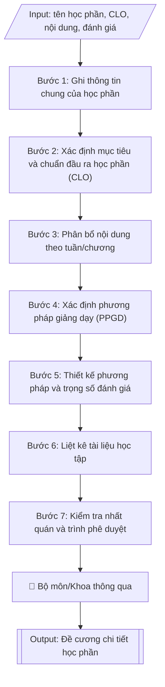

# Soạn đề cương chi tiết học phần

## Định dạng và file đầu ra
Định dạng đầu ra có thể chọn theo sản phẩm/yêu cầu: .docx, .pdf. Đọc mục “Định dạng bổ sung” trong quy cách đầu ra trước khi chọn.

**Phải tạo file thực tế để tải xuống, không chỉ trả nội dung trong chat.** Định dạng mặc định của skill: **.docx**. Nếu có bảng số liệu nghiệp vụ yêu cầu file bảng tính riêng, tạo thêm Excel theo yêu cầu; không tự tạo file kiểm tra. Không chờ người dùng yêu cầu xuất file lần nữa. Ưu tiên định dạng người dùng chỉ định; đọc quy tắc xuất file tại references/quy-cach-dau-ra.md.

## Quy cách đầu ra và thông tin thiếu
Khi dựng file Word/Excel, áp dụng mục “Thể thức và bảng biểu khi dựng file” trong quy cách đầu ra (cỡ chữ từng thành phần, bảng nhiều trang, số trang, phụ lục). Đọc [quy cách và cấu trúc sản phẩm](references/quy-cach-dau-ra.md) trước khi soạn/xuất. File giao chỉ gồm sản phẩm nghiệp vụ được yêu cầu; kiểm tra nội bộ không xuất kèm. Thiếu thông tin thì giữ nguyên trường/mục và chỗ điền theo mẫu gốc (dòng dấu chấm, dấu gạch hoặc ô trống); không tự điền dữ liệu mẫu, số 0, mã chờ xác minh hay dòng chờ ký. Mẫu chuyên ngành còn áp dụng được ưu tiên về cấu trúc, mã biểu và người ký. Bản đầy đủ: [quy tắc chung](references/quy-tac-chung.md).

Khi người dùng yêu cầu bộ slide (.pptx), đọc mục “Xuất PowerPoint (.pptx) khi được yêu cầu” trong quy cách đầu ra.

## Kiểm soát áp dụng và phê duyệt
Trước khi chạy, xác định `ngay_ap_dung`, `loai_hinh_truong`, `quy_che_noi_bo`, `nguon_du_lieu`, `nguoi_kiem_duyet`; chỉ hỏi thông tin liên quan nghiệp vụ, không dùng giá trị giả định thay dữ liệu bắt buộc. Đối chiếu căn cứ pháp lý với văn bản gốc, hiệu lực, điều khoản áp dụng và chuyển tiếp. Bản đầy đủ: [quy tắc chung](references/quy-tac-chung.md).

Nếu có cập nhật pháp lý dưới đây, đọc [căn cứ và điều kiện áp dụng](references/phap-ly.md) trước khi làm. Quy trình dưới đây giữ nghiệp vụ từ bản gốc; mọi viện dẫn văn bản, mẫu biểu, điều khoản phải theo căn cứ đã chọn trong phap-ly.md, không theo văn bản cũ.

## Giới hạn và human gate
AI hỗ trợ chuẩn bị và đối chiếu; cán bộ phụ trách kiểm tra dữ liệu/căn cứ, người có thẩm quyền duyệt và ký. Không đánh dấu đã ký, đã duyệt, đã công bố khi chưa có chứng cứ. Dữ liệu sinh viên, sức khỏe, nhân sự, tài chính chỉ dùng theo mục đích và phân quyền, che thông tin định danh khi dùng ví dụ (Luật 91/2025/QH15, hiệu lực 01/01/2026); không tải dữ liệu lên dịch vụ ngoài khi chưa có quyền. Bản đầy đủ: [quy tắc chung](references/quy-tac-chung.md).

## Khi nào dùng
Khi giảng viên/bộ môn cần soạn mới hoặc cập nhật đề cương chi tiết của một học phần:
xác định thông tin chung, mục tiêu và chuẩn đầu ra học phần (CLO), phân bổ nội dung theo
tuần/chương, phương pháp giảng dạy và cách thức đánh giá người học.

## Đầu vào (Input)
| Trường | Mô tả | Bắt buộc |
|---|---|---|
| `ten_hoc_phan` | Tên học phần (tiếng Việt, có thể kèm tên tiếng Anh) | Có |
| `ma_hoc_phan` | Mã học phần theo quy định của trường | Có |
| `so_tin_chi` | Số tín chỉ và phân bổ (lý thuyết – thực hành – tự học) | Có |
| `hoc_ky` | Học kỳ bố trí trong CTĐT | Có |
| `hoc_phan_tien_quyet` | Học phần tiên quyết / song hành (nếu có) | Không |
| `muc_tieu` | Mục tiêu của học phần | Có |
| `clo` | Danh sách chuẩn đầu ra học phần (CLO), gắn với PLO tương ứng | Có |
| `noi_dung_tuan` | Nội dung chi tiết theo từng tuần/chương | Có |
| `ppgd` | Phương pháp giảng dạy (thuyết trình, thảo luận nhóm, dự án, lab...) | Có |
| `danh_gia` | Các thành phần đánh giá và trọng số (chuyên cần, giữa kỳ, cuối kỳ...) | Có |
| `tai_lieu` | Giáo trình chính, tài liệu tham khảo | Có |
| `giang_vien` | Giảng viên phụ trách soạn đề cương | Không |

## Quy trình
**Ràng buộc pháp lý khi thực hiện** (trích references/phap-ly.md; đối chiếu toàn văn và hiệu lực tại ngày nghiệp vụ):
- Thông tư 56/2026/TT-BGDĐT, hiệu lực 07/07/2026: Yêu cầu khóa tuyển sinh, chương trình, ngày áp dụng và quy chế đào tạo nội bộ. Đối chiếu điều khoản chuyển tiếp trong toàn văn trước khi chọn quy tắc; không tự áp dụng quy định mới hồi tố cho mọi khóa. Không dùng điều/khoản, thang điểm hoặc điều kiện tốt nghiệp cũ như quy định hiện hành nếu chưa đối chiếu.
- Thông tư 54/2026/TT-BGDĐT, hiệu lực 30/06/2026: Phân loại xây dựng chương trình, chuẩn đầu ra hay mở ngành; yêu cầu chuẩn ngành/trình độ, trạng thái chương trình và ngày tiếp nhận hồ sơ. Đọc toàn văn và điều khoản chuyển tiếp trước khi đổi chuẩn/mẫu; chưa xác minh toàn văn thì ghi điều kiện chưa xác nhận, không tự đặt thời hạn chuyển đổi.
- Trước Bước 1: chọn căn cứ theo đối tượng, loại hình trường và chuyển tiếp; lập bảng văn bản / điều khoản / lý do áp dụng / bằng chứng. Thiếu văn bản gốc hoặc điều khoản thì ghi nhận nội bộ [CẦN XÁC MINH] (không đưa vào file giao), để trống phần tương ứng, chưa kết luận tuân thủ.
- Các con số, thời hạn, số điều, số mức xếp loại, hệ số và mẫu biểu nêu trong các bước dưới đây được giữ từ quy trình gốc (trước cập nhật pháp lý); chỉ dùng khi đã đối chiếu đúng với căn cứ đã chọn, khác thì theo căn cứ. Danh sách điểm cần đối chiếu: docs/DIEM_CAN_DOI_CHIEU_PHAP_LY.md.

**Bước 1. Ghi thông tin chung của học phần**
- Làm gì: ghi đầy đủ từ các trường input: tên học phần (`ten_hoc_phan`, kèm tên tiếng Anh nếu
  có), mã học phần (`ma_hoc_phan`), số tín chỉ và phân bổ lý thuyết – thực hành – tự học
  (`so_tin_chi`), học kỳ bố trí (`hoc_ky`), học phần tiên quyết/song hành (`hoc_phan_tien_quyet`),
  đơn vị phụ trách (bộ môn/khoa).
- Dùng input: `ten_hoc_phan`, `ma_hoc_phan`, `so_tin_chi`, `hoc_ky`, `hoc_phan_tien_quyet`.
- Vai trò: Giảng viên soạn đề cương (bộ môn) · AI hỗ trợ: soạn mục thông tin, đối chiếu khớp khung CTĐT · ⏱ ~20 phút (ước tính)
- Lưu ý nghiệp vụ: mã và tên học phần phải khớp 100% với danh mục học phần trong khung CTĐT
  đã ban hành; số tiết quy đổi từ tín chỉ phải đúng quy định (1 tín chỉ lý thuyết = 15 tiết,
  thực hành/thí nghiệm tính theo hệ số của trường); học phần tiên quyết phải thực sự được
  bố trí ở học kỳ trước.
- → Kết quả bước: mục "Thông tin chung" hoàn chỉnh của đề cương.

**Bước 2. Xác định mục tiêu và chuẩn đầu ra học phần (CLO)**
- Làm gì: viết mục tiêu tổng quát của học phần từ `muc_tieu`; cụ thể hóa thành các CLO trong
  `clo` bằng động từ hành động đo lường được; mỗi CLO ghi rõ đóng góp vào PLO nào của CTĐT
  và ở mức I/R/M nào.
- Dùng input: `muc_tieu`, `clo`.
- Vai trò: Giảng viên bộ môn · AI hỗ trợ: soạn dự thảo mục tiêu và CLO, kiểm tra động từ đo lường được · ⏱ ~45 phút (ước tính)
- Lưu ý nghiệp vụ: số CLO vừa phải (thường 3–5 cho một học phần); mỗi CLO phải có ít nhất một
  hình thức đánh giá tương ứng ở Bước 5 — CLO nào không đo được thì phải viết lại; tránh
  CLO trùng lặp nội dung với nhau.
- → Kết quả bước: mục "Mục tiêu" và "Chuẩn đầu ra học phần (CLO)" hoàn chỉnh, mỗi CLO gắn
  với PLO tương ứng.

**Bước 3. Phân bổ nội dung theo tuần/chương**
- Làm gì: chia `noi_dung_tuan` thành các tuần (hoặc chương): mỗi tuần ghi chủ đề, số tiết lý
  thuyết/thực hành, hoạt động của giảng viên và của sinh viên; đảm bảo tổng số tiết các tuần
  khớp với số tín chỉ ở Bước 1 và nội dung bao phủ hết các CLO ở Bước 2.
- Dùng input: `noi_dung_tuan`, kết quả Bước 1 (số tín chỉ/tiết), kết quả Bước 2 (danh sách CLO).
- Vai trò: Giảng viên bộ môn · AI hỗ trợ: chia nội dung theo tuần/chương, kiểm tra thứ tự và tổng số tiết · ⏱ ~45 phút (ước tính)
- Lưu ý nghiệp vụ: bẫy thường gặp — tổng số tiết các tuần không khớp số tín chỉ; nội dung
  tuần sau dùng kiến thức tuần trước nhưng chưa sắp xếp đúng thứ tự; tuần kiểm tra giữa kỳ
  và tuần dự án phải được tính vào tổng số tuần của học phần.
- → Kết quả bước: bảng phân bổ nội dung theo tuần (chủ đề, số tiết LT/TH, hoạt động GV–SV).

**Bước 4. Xác định phương pháp giảng dạy (PPGD)**
- Làm gì: từ `ppgd`, lựa chọn PPGD phù hợp cho từng khối nội dung ở Bước 3 (thuyết trình, dạy
  học theo dự án, học theo tình huống, thực hành phòng lab, seminar...); ưu tiên phương pháp
  lấy người học làm trung tâm; ghi rõ PPGD nào phục vụ CLO nào.
- Dùng input: `ppgd`, kết quả Bước 3 (nội dung theo tuần), kết quả Bước 2 (CLO).
- Vai trò: Giảng viên bộ môn · AI hỗ trợ: đề xuất PPGD theo nội dung và CLO, đối chiếu điều kiện thực tế · ⏱ ~30 phút (ước tính)
- Lưu ý nghiệp vụ: PPGD phải tương thích với điều kiện thực tế (sĩ số lớp, phòng lab, thiết
  bị); mỗi CLO kỹ năng/thực hành phải có PPGD thực hành tương ứng — không thể đạt CLO thực
  hành chỉ bằng thuyết trình.
- → Kết quả bước: mục "Phương pháp giảng dạy" hoàn chỉnh, mỗi PPGD gắn với nội dung và CLO
  tương ứng.

**Bước 5. Thiết kế phương pháp và trọng số đánh giá**
- Làm gì: từ `danh_gia`, xác định các thành phần đánh giá (chuyên cần, bài tập/thực hành,
  kiểm tra giữa kỳ, thi/dự án cuối kỳ); phân bổ trọng số từng thành phần (tổng đúng 100%);
  với mỗi thành phần ghi hình thức, tiêu chí đánh giá (rubric) và CLO được đánh giá.
- Dùng input: `danh_gia`, kết quả Bước 2 (CLO).
- Vai trò: Giảng viên bộ môn · AI hỗ trợ: soạn bảng đánh giá và rubric, kiểm tra trọng số cộng đúng 100% · ⏱ ~30 phút (ước tính)
- Lưu ý nghiệp vụ: tổng trọng số phải đúng 100% — lỗi cộng sai trọng số rất phổ biến; mỗi
  CLO phải được ít nhất một thành phần đánh giá đo lường; trọng số phải phản ánh đúng mức
  độ quan trọng (thành phần đánh giá CLO cốt lõi không thể chỉ chiếm 5%); ghi rõ thang điểm
  và cách làm tròn.
- → Kết quả bước: bảng đánh giá hoàn chỉnh (thành phần, hình thức, trọng số, CLO đánh giá,
  tổng 100%) kèm rubric.

**Bước 6. Liệt kê tài liệu học tập**
- Làm gì: liệt kê từ `tai_lieu`: giáo trình chính (bắt buộc, ghi rõ tên, tác giả, năm xuất
  bản), tài liệu tham khảo, nguồn học liệu số (cơ sở dữ liệu, website, bộ dữ liệu mở).
- Dùng input: `tai_lieu`.
- Vai trò: Giảng viên bộ môn · AI hỗ trợ: liệt kê sơ bộ tài liệu, kiểm tra tính khả dụng và cập nhật · ⏱ ~20 phút (ước tính)
- Lưu ý nghiệp vụ: giáo trình chính phải có thật và sinh viên tiếp cận được (thư viện trường
  có đủ số lượng hoặc có bản số); tài liệu tham khảo nên cập nhật trong 5 năm gần nhất đối
  với lĩnh vực công nghệ; ghi rõ tài liệu nào bắt buộc, tài liệu nào tham khảo.
- → Kết quả bước: mục "Tài liệu học tập" hoàn chỉnh (giáo trình chính, tài liệu tham khảo,
  học liệu số).

**Bước 7. Kiểm tra nhất quán và trình phê duyệt**
- Làm gì: kiểm tra tính nhất quán 4 chiều: CLO – nội dung (mỗi CLO có nội dung dạy) – PPGD
  (mỗi CLO có phương pháp phù hợp) – đánh giá (mỗi CLO có thành phần đo lường); sửa các điểm
  chưa khớp; ghi thông tin `giang_vien` soạn đề cương; trình bộ môn/khoa thông qua trước khi
  đưa vào giảng dạy.
- Dùng input: `giang_vien`, kết quả tất cả các bước trên.
- Vai trò: Bộ môn/khoa họp thông qua bằng biên bản · AI hỗ trợ: đối chiếu nhất quán 4 chiều (CLO – nội dung – PPGD – đánh giá), chuẩn bị tài liệu họp · ⏱ ~45 phút (ước tính)
- Lưu ý nghiệp vụ: đây là cổng chặn lỗi cuối — dùng bảng đối sánh CLO–PLO và CLO–đánh giá để
  kiểm tra trực quan; đề cương phải được bộ môn/khoa thông qua bằng biên bản trước khi áp dụng.
- → Kết quả bước: đề cương chi tiết học phần hoàn chỉnh kèm bảng đối sánh CLO–PLO và
  CLO–đánh giá, đã được bộ môn/khoa thông qua.

## Luồng quy trình (Workflow)

## Đầu ra
- Đề cương chi tiết học phần hoàn chỉnh (văn bản có cấu trúc mục rõ ràng).
- Bảng đối sánh CLO – PLO và CLO – hình thức đánh giá.

File nghiệp vụ thực tế theo định dạng mặc định ở đầu skill hoặc định dạng người dùng yêu cầu, kèm liên kết tải trong phản hồi cuối.

Sản phẩm nghiệp vụ hoàn chỉnh theo [quy cách và cấu trúc](references/quy-cach-dau-ra.md), giữ các trường chưa có dữ liệu ở trạng thái trống. Không xuất kèm checklist/phụ lục kiểm tra đầu ra.

## Kiểm tra nội bộ trước khi giao
Các tiêu chí sau dùng để tự đối chiếu; không sao chép vào file xuất. Mục thiếu dữ liệu được để trống, không đánh dấu đã đạt hoặc đã duyệt.

- [ ] Đủ các phần và đúng bố cục theo cấu trúc tại references/quy-cach-dau-ra.md (không theo cấu trúc của bản gốc).
- [ ] Mã, tên học phần khớp 100% danh mục học phần trong khung CTĐT đã ban hành; số tiết quy đổi từ tín chỉ đúng quy định.
- [ ] Nhất quán 4 chiều: mỗi CLO đều có nội dung dạy – PPGD phù hợp – thành phần đánh giá đo lường.
- [ ] Tổng trọng số các thành phần đánh giá đúng 100%; trọng số phản ánh đúng mức độ quan trọng của CLO.
- [ ] Tổng số tiết các tuần khớp số tín chỉ; nội dung bao phủ hết các CLO, sắp xếp đúng thứ tự tiến trình.
- [ ] Giáo trình chính có thật và sinh viên tiếp cận được; tài liệu tham khảo còn thời sự; phân biệt rõ bắt buộc/tham khảo.
- [ ] Mỗi CLO ghi rõ đóng góp vào PLO nào ở mức I/R/M; thông tin khớp Input đã cho.
- [ ] Không bịa đặt số liệu, tài liệu, minh chứng hay trích dẫn văn bản.
- [ ] Căn cứ pháp lý đầy đủ, còn hiệu lực (văn bản hiện hành nêu tại phap-ly.md; văn bản hiện hành nêu tại phap-ly.md).
- [ ] Đã qua Human gate: bộ môn/khoa đã thông qua bằng biên bản trước khi đưa vào giảng dạy.

## Căn cứ & lưu ý
- Căn cứ hiện hành: xem [căn cứ và điều kiện áp dụng](references/phap-ly.md); phải đối chiếu văn bản gốc, hiệu lực và chuyển tiếp tại ngày nghiệp vụ.
- CLO viết bằng động từ hành động đo lường được; mỗi CLO phải có hình thức đánh giá tương ứng.
- Không dùng tên thật của trường/cá nhân khi mô phỏng.

## Tư liệu đối chiếu
Bản gốc trước cập nhật pháp lý (kèm ví dụ giả lập) lưu tại `references/quy-trinh-lich-su.md`, chỉ để đối chiếu hồ sơ lịch sử; không dùng căn cứ, mẫu hay số liệu trong đó làm chỉ dẫn hiện hành.

## Quản trị phiên bản
- Phiên bản gói `1.3.2` (cập nhật 2026-10-10); hồ sơ đầy đủ tại [references/version.json](references/version.json).
- Người phê duyệt nghiệp vụ: **chưa chỉ định**. Trạng thái: dự thảo nghiệp vụ; kiểm tra pháp lý trước thực thi. Ngày cập nhật không đồng nghĩa mọi văn bản đã được rà soát toàn văn.
- Giấy phép theo LICENSE của kho (bản quyền CES Global). Lịch sử thay đổi: CHANGELOG.md.
