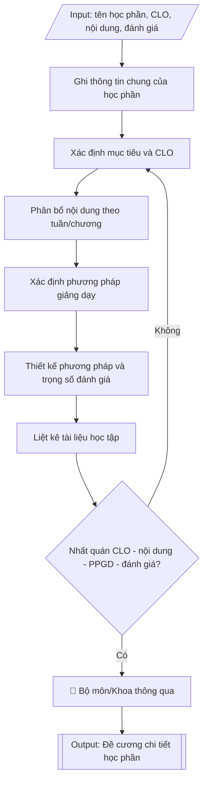

# Tư liệu lịch sử – không phải quy trình hiện hành

Nội dung từ phiên bản nguồn trước 1.1.0, giữ để đối chiếu dữ liệu đầu vào và thay đổi; căn cứ, điều kiện, mẫu và ví dụ có thể đã lỗi thời. Không dùng để thực hiện nghiệp vụ hiện tại.

## Khi nào dùng
Khi giảng viên/bộ môn cần soạn mới hoặc cập nhật đề cương chi tiết của một học phần:
xác định thông tin chung, mục tiêu và chuẩn đầu ra học phần (CLO), phân bổ nội dung theo
tuần/chương, phương pháp giảng dạy và cách thức đánh giá người học.

## Đầu vào (Input)

| Trường | Mô tả | Bắt buộc |
|---|---|---|
| `ten_hoc_phan` | Tên học phần (tiếng Việt, có thể kèm tên tiếng Anh) | Có |
| `ma_hoc_phan` | Mã học phần theo quy định của trường | Có |
| `so_tin_chi` | Số tín chỉ và phân bổ (lý thuyết – thực hành – tự học) | Có |
| `hoc_ky` | Học kỳ bố trí trong CTĐT | Có |
| `hoc_phan_tien_quyet` | Học phần tiên quyết / song hành (nếu có) | Không |
| `muc_tieu` | Mục tiêu của học phần | Có |
| `clo` | Danh sách chuẩn đầu ra học phần (CLO), gắn với PLO tương ứng | Có |
| `noi_dung_tuan` | Nội dung chi tiết theo từng tuần/chương | Có |
| `ppgd` | Phương pháp giảng dạy (thuyết trình, thảo luận nhóm, dự án, lab...) | Có |
| `danh_gia` | Các thành phần đánh giá và trọng số (chuyên cần, giữa kỳ, cuối kỳ...) | Có |
| `tai_lieu` | Giáo trình chính, tài liệu tham khảo | Có |
| `giang_vien` | Giảng viên phụ trách soạn đề cương | Không |

## Quy trình

**Bước 1. Ghi thông tin chung của học phần**
- Làm gì: ghi đầy đủ từ các trường input: tên học phần (`ten_hoc_phan`, kèm tên tiếng Anh nếu
  có), mã học phần (`ma_hoc_phan`), số tín chỉ và phân bổ lý thuyết – thực hành – tự học
  (`so_tin_chi`), học kỳ bố trí (`hoc_ky`), học phần tiên quyết/song hành (`hoc_phan_tien_quyet`),
  đơn vị phụ trách (bộ môn/khoa).
- Dùng input: `ten_hoc_phan`, `ma_hoc_phan`, `so_tin_chi`, `hoc_ky`, `hoc_phan_tien_quyet`.
- Vai trò: Giảng viên soạn đề cương (bộ môn) · AI hỗ trợ: soạn mục thông tin, đối chiếu khớp khung CTĐT · ⏱ ~20 phút (ước tính)
- Lưu ý nghiệp vụ: mã và tên học phần phải khớp 100% với danh mục học phần trong khung CTĐT
  đã ban hành; số tiết quy đổi từ tín chỉ phải đúng quy định (1 tín chỉ lý thuyết = 15 tiết,
  thực hành/thí nghiệm tính theo hệ số của trường); học phần tiên quyết phải thực sự được
  bố trí ở học kỳ trước.
- → Kết quả bước: mục "Thông tin chung" hoàn chỉnh của đề cương.

**Bước 2. Xác định mục tiêu và chuẩn đầu ra học phần (CLO)**
- Làm gì: viết mục tiêu tổng quát của học phần từ `muc_tieu`; cụ thể hóa thành các CLO trong
  `clo` bằng động từ hành động đo lường được; mỗi CLO ghi rõ đóng góp vào PLO nào của CTĐT
  và ở mức I/R/M nào.
- Dùng input: `muc_tieu`, `clo`.
- Vai trò: Giảng viên bộ môn · AI hỗ trợ: soạn dự thảo mục tiêu và CLO, kiểm tra động từ đo lường được · ⏱ ~45 phút (ước tính)
- Lưu ý nghiệp vụ: số CLO vừa phải (thường 3–5 cho một học phần); mỗi CLO phải có ít nhất một
  hình thức đánh giá tương ứng ở Bước 5 — CLO nào không đo được thì phải viết lại; tránh
  CLO trùng lặp nội dung với nhau.
- → Kết quả bước: mục "Mục tiêu" và "Chuẩn đầu ra học phần (CLO)" hoàn chỉnh, mỗi CLO gắn
  với PLO tương ứng.

**Bước 3. Phân bổ nội dung theo tuần/chương**
- Làm gì: chia `noi_dung_tuan` thành các tuần (hoặc chương): mỗi tuần ghi chủ đề, số tiết lý
  thuyết/thực hành, hoạt động của giảng viên và của sinh viên; đảm bảo tổng số tiết các tuần
  khớp với số tín chỉ ở Bước 1 và nội dung bao phủ hết các CLO ở Bước 2.
- Dùng input: `noi_dung_tuan`, kết quả Bước 1 (số tín chỉ/tiết), kết quả Bước 2 (danh sách CLO).
- Vai trò: Giảng viên bộ môn · AI hỗ trợ: chia nội dung theo tuần/chương, kiểm tra thứ tự và tổng số tiết · ⏱ ~45 phút (ước tính)
- Lưu ý nghiệp vụ: bẫy thường gặp — tổng số tiết các tuần không khớp số tín chỉ; nội dung
  tuần sau dùng kiến thức tuần trước nhưng chưa sắp xếp đúng thứ tự; tuần kiểm tra giữa kỳ
  và tuần dự án phải được tính vào tổng số tuần của học phần.
- → Kết quả bước: bảng phân bổ nội dung theo tuần (chủ đề, số tiết LT/TH, hoạt động GV–SV).

**Bước 4. Xác định phương pháp giảng dạy (PPGD)**
- Làm gì: từ `ppgd`, lựa chọn PPGD phù hợp cho từng khối nội dung ở Bước 3 (thuyết trình, dạy
  học theo dự án, học theo tình huống, thực hành phòng lab, seminar...); ưu tiên phương pháp
  lấy người học làm trung tâm; ghi rõ PPGD nào phục vụ CLO nào.
- Dùng input: `ppgd`, kết quả Bước 3 (nội dung theo tuần), kết quả Bước 2 (CLO).
- Vai trò: Giảng viên bộ môn · AI hỗ trợ: đề xuất PPGD theo nội dung và CLO, đối chiếu điều kiện thực tế · ⏱ ~30 phút (ước tính)
- Lưu ý nghiệp vụ: PPGD phải tương thích với điều kiện thực tế (sĩ số lớp, phòng lab, thiết
  bị); mỗi CLO kỹ năng/thực hành phải có PPGD thực hành tương ứng — không thể đạt CLO thực
  hành chỉ bằng thuyết trình.
- → Kết quả bước: mục "Phương pháp giảng dạy" hoàn chỉnh, mỗi PPGD gắn với nội dung và CLO
  tương ứng.

**Bước 5. Thiết kế phương pháp và trọng số đánh giá**
- Làm gì: từ `danh_gia`, xác định các thành phần đánh giá (chuyên cần, bài tập/thực hành,
  kiểm tra giữa kỳ, thi/dự án cuối kỳ); phân bổ trọng số từng thành phần (tổng đúng 100%);
  với mỗi thành phần ghi hình thức, tiêu chí đánh giá (rubric) và CLO được đánh giá.
- Dùng input: `danh_gia`, kết quả Bước 2 (CLO).
- Vai trò: Giảng viên bộ môn · AI hỗ trợ: soạn bảng đánh giá và rubric, kiểm tra trọng số cộng đúng 100% · ⏱ ~30 phút (ước tính)
- Lưu ý nghiệp vụ: tổng trọng số phải đúng 100% — lỗi cộng sai trọng số rất phổ biến; mỗi
  CLO phải được ít nhất một thành phần đánh giá đo lường; trọng số phải phản ánh đúng mức
  độ quan trọng (thành phần đánh giá CLO cốt lõi không thể chỉ chiếm 5%); ghi rõ thang điểm
  và cách làm tròn.
- → Kết quả bước: bảng đánh giá hoàn chỉnh (thành phần, hình thức, trọng số, CLO đánh giá,
  tổng 100%) kèm rubric.

**Bước 6. Liệt kê tài liệu học tập**
- Làm gì: liệt kê từ `tai_lieu`: giáo trình chính (bắt buộc, ghi rõ tên, tác giả, năm xuất
  bản), tài liệu tham khảo, nguồn học liệu số (cơ sở dữ liệu, website, bộ dữ liệu mở).
- Dùng input: `tai_lieu`.
- Vai trò: Giảng viên bộ môn · AI hỗ trợ: liệt kê sơ bộ tài liệu, kiểm tra tính khả dụng và cập nhật · ⏱ ~20 phút (ước tính)
- Lưu ý nghiệp vụ: giáo trình chính phải có thật và sinh viên tiếp cận được (thư viện trường
  có đủ số lượng hoặc có bản số); tài liệu tham khảo nên cập nhật trong 5 năm gần nhất đối
  với lĩnh vực công nghệ; ghi rõ tài liệu nào bắt buộc, tài liệu nào tham khảo.
- → Kết quả bước: mục "Tài liệu học tập" hoàn chỉnh (giáo trình chính, tài liệu tham khảo,
  học liệu số).

**Bước 7. Kiểm tra nhất quán và trình phê duyệt**
- Làm gì: kiểm tra tính nhất quán 4 chiều: CLO – nội dung (mỗi CLO có nội dung dạy) – PPGD
  (mỗi CLO có phương pháp phù hợp) – đánh giá (mỗi CLO có thành phần đo lường); sửa các điểm
  chưa khớp; ghi thông tin `giang_vien` soạn đề cương; trình bộ môn/khoa thông qua trước khi
  đưa vào giảng dạy.
- Dùng input: `giang_vien`, kết quả tất cả các bước trên.
- Vai trò: Bộ môn/khoa họp thông qua bằng biên bản · AI hỗ trợ: đối chiếu nhất quán 4 chiều (CLO – nội dung – PPGD – đánh giá), chuẩn bị tài liệu họp · ⏱ ~45 phút (ước tính)
- Lưu ý nghiệp vụ: đây là cổng chặn lỗi cuối — dùng bảng đối sánh CLO–PLO và CLO–đánh giá để
  kiểm tra trực quan; đề cương phải được bộ môn/khoa thông qua bằng biên bản trước khi áp dụng.
- → Kết quả bước: đề cương chi tiết học phần hoàn chỉnh kèm bảng đối sánh CLO–PLO và
  CLO–đánh giá, đã được bộ môn/khoa thông qua.

## Luồng quy trình (Workflow)


## Đầu ra (Output)
- Đề cương chi tiết học phần hoàn chỉnh (văn bản có cấu trúc mục rõ ràng).
- Bảng đối sánh CLO – PLO và CLO – hình thức đánh giá.

**Cấu trúc output chuẩn:** khung mẫu CỐ ĐỊNH của sản phẩm chính (Đề cương chi tiết học phần),
các phần bắt buộc theo đúng thứ tự xuất hiện:
1. Tiêu đề: tên trường, tên khoa/bộ môn; dòng "ĐỀ CƯƠNG CHI TIẾT HỌC PHẦN".
2. Mục 1 – Thông tin chung: tên học phần (kèm tên tiếng Anh nếu có), mã học phần, số tín
   chỉ (lý thuyết – thực hành – tự học), học kỳ, học phần tiên quyết/song hành, đơn vị
   phụ trách.
3. Mục 2 – Mục tiêu học phần.
4. Mục 3 – Chuẩn đầu ra học phần (CLO): liệt kê đánh số, mỗi CLO ghi rõ đóng góp vào PLO
   nào (mức I/R/M).
5. Mục 4 – Tóm tắt nội dung theo tuần/chương: bảng hoặc danh sách (tuần, chủ đề, số tiết
   LT/TH, hoạt động GV–SV).
6. Mục 5 – Phương pháp giảng dạy (PPGD).
7. Mục 6 – Phương pháp và trọng số đánh giá: bảng (thành phần, hình thức, trọng số, CLO
   đánh giá) với tổng trọng số 100%; thang điểm và cách làm tròn.
8. Mục 7 – Tài liệu học tập: giáo trình chính (bắt buộc), tài liệu tham khảo, học liệu số.
9. Mục 8 – Thông tin giảng viên soạn đề cương; địa điểm – ngày tháng; chữ ký (trưởng khoa,
   người soạn).
10. Phụ lục kèm theo: Bảng đối sánh CLO – PLO.

## Checklist nghiệm thu

- [ ] Đủ 10 phần theo "Cấu trúc output chuẩn": tiêu đề, Mục 1 thông tin chung, Mục 2 mục tiêu, Mục 3 CLO, Mục 4 nội dung theo tuần, Mục 5 PPGD, Mục 6 phương pháp và trọng số đánh giá, Mục 7 tài liệu học tập, Mục 8 giảng viên soạn + chữ ký, phụ lục đối sánh CLO–PLO.
- [ ] Mã, tên học phần khớp 100% danh mục học phần trong khung CTĐT đã ban hành; số tiết quy đổi từ tín chỉ đúng quy định.
- [ ] Nhất quán 4 chiều: mỗi CLO đều có nội dung dạy – PPGD phù hợp – thành phần đánh giá đo lường.
- [ ] Tổng trọng số các thành phần đánh giá đúng 100%; trọng số phản ánh đúng mức độ quan trọng của CLO.
- [ ] Tổng số tiết các tuần khớp số tín chỉ; nội dung bao phủ hết các CLO, sắp xếp đúng thứ tự tiến trình.
- [ ] Giáo trình chính có thật và sinh viên tiếp cận được; tài liệu tham khảo còn thời sự; phân biệt rõ bắt buộc/tham khảo.
- [ ] Mỗi CLO ghi rõ đóng góp vào PLO nào ở mức I/R/M; thông tin khớp Input đã cho.
- [ ] Không bịa đặt số liệu, tài liệu, minh chứng hay trích dẫn văn bản.
- [ ] Căn cứ pháp lý đầy đủ, còn hiệu lực (Thông tư 17/2021/TT-BGDĐT; Thông tư 08/2021/TT-BGDĐT).
- [ ] Đã qua Human gate: bộ môn/khoa đã thông qua bằng biên bản trước khi đưa vào giảng dạy.

Tiêu chí đạt = tất cả các ô được đánh dấu.

## Ví dụ mô phỏng (dữ liệu giả lập)

> Tất cả tên trường, cá nhân, số liệu dưới đây đều là **giả lập**, không liên quan tổ chức/cá nhân có thật.

### Input mẫu

| Trường | Giá trị |
|---|---|
| `ten_hoc_phan` | Học máy (Machine Learning) |
| `ma_hoc_phan` | AI301 |
| `so_tin_chi` | 4 (3–1), tương đương 45 tiết lý thuyết + 30 tiết thực hành |
| `hoc_ky` | Học kỳ 5 |
| `hoc_phan_tien_quyet` | AI201 Xác suất thống kê cho AI; AI202 Cấu trúc dữ liệu và giải thuật |
| `muc_tieu` | Trang bị kiến thức nền tảng và kỹ năng thực hành về các thuật toán học máy, giúp sinh viên có khả năng huấn luyện, đánh giá mô hình trên dữ liệu thực tế. |
| `clo` | CLO1: Trình bày được nguyên lý các thuật toán học máy cơ bản (PLO3). CLO2: Tiền xử lý được dữ liệu, lựa chọn đặc trưng phù hợp (PLO5). CLO3: Huấn luyện, tinh chỉnh và đánh giá được mô hình học máy (PLO5, PLO8). CLO4: Làm việc nhóm thực hiện dự án học máy hoàn chỉnh (PLO7). |
| `noi_dung_tuan` | 15 tuần: tổng quan – tiền xử lý dữ liệu – hồi quy – phân loại – cây quyết định – SVM – phân cụm – giảm chiều – ensemble – mạng nơ-ron cơ bản – đánh giá mô hình – dự án nhóm – ôn tập – thi |
| `ppgd` | Thuyết trình kết hợp ví dụ minh họa; thực hành trên phòng lab với Python/scikit-learn; dạy học theo dự án nhóm; seminar trình bày kết quả |
| `danh_gia` | Chuyên cần 10%; bài tập và thực hành lab 20%; kiểm tra giữa kỳ 20%; dự án nhóm cuối kỳ 50% (báo cáo + bảo vệ) |
| `tai_lieu` | Giáo trình chính: "Học máy cơ bản" (biên soạn nội bộ, 2025). Tham khảo: Aurélien Géron – "Hands-On Machine Learning"; tài liệu scikit-learn. |
| `giang_vien` | TS. Nguyễn Văn C – Khoa Công nghệ thông tin |

### Output mẫu

```
TRƯỜNG ĐẠI HỌC A
KHOA CÔNG NGHỆ THÔNG TIN

ĐỀ CƯƠNG CHI TIẾT HỌC PHẦN

1. Thông tin chung
- Tên học phần: Học máy (Machine Learning)
- Mã học phần: AI301
- Số tín chỉ: 4 (3 lý thuyết – 1 thực hành); 45 tiết LT + 30 tiết TH
- Học kỳ: 5 (ngành Trí tuệ nhân tạo)
- Học phần tiên quyết: AI201 – Xác suất thống kê cho AI; AI202 – Cấu trúc dữ liệu và giải thuật
- Đơn vị phụ trách: Bộ môn Trí tuệ nhân tạo – Khoa Công nghệ thông tin

2. Mục tiêu học phần
Trang bị kiến thức nền tảng và kỹ năng thực hành về các thuật toán học máy, giúp sinh viên
có khả năng huấn luyện, tinh chỉnh và đánh giá mô hình học máy trên dữ liệu thực tế, làm
nền tảng cho các học phần chuyên sâu (Học sâu, Xử lý ngôn ngữ tự nhiên, Thị giác máy tính).

3. Chuẩn đầu ra học phần (CLO)
- CLO1: Trình bày được nguyên lý, ưu – nhược điểm của các thuật toán học máy cơ bản
  (hồi quy, phân loại, phân cụm). [Đóng góp: PLO3 – mức R]
- CLO2: Thực hiện được tiền xử lý dữ liệu, lựa chọn và trích xuất đặc trưng phù hợp
  với bài toán. [Đóng góp: PLO5 – mức I]
- CLO3: Huấn luyện, tinh chỉnh siêu tham số và đánh giá được mô hình học máy bằng các
  độ đo phù hợp, sử dụng thành thạo scikit-learn. [Đóng góp: PLO5 – mức R; PLO8 – mức R]
- CLO4: Phối hợp nhóm thực hiện trọn vẹn một dự án học máy: từ dữ liệu thô đến báo cáo
  và trình bày kết quả. [Đóng góp: PLO7 – mức R]

4. Tóm tắt nội dung theo tuần

Tuần 1: Tổng quan về học máy – các mô hình học (giám sát, không giám sát, tăng cường);
        quy trình xây dựng mô hình. [3LT]
Tuần 2: Thu thập và tiền xử lý dữ liệu – làm sạch, chuẩn hóa, mã hóa biến. [2LT+2TH]
Tuần 3: Hồi quy tuyến tính và hồi quy logistic. [3LT]
Tuần 4: Thực hành: xây dựng mô hình hồi quy/phân loại trên bộ dữ liệu mẫu. [1LT+4TH]
Tuần 5: Cây quyết định và rừng ngẫu nhiên. [3LT]
Tuần 6: Máy vectơ hỗ trợ (SVM). [3LT]
Tuần 7: Thực hành: so sánh các thuật toán phân loại. [1LT+4TH]
Tuần 8: Kiểm tra giữa kỳ. [2LT]
Tuần 9: Phân cụm: K-means, phân cụm phân cấp, DBSCAN. [3LT]
Tuần 10: Giảm chiều dữ liệu: PCA. [2LT+2TH]
Tuần 11: Phương pháp ensemble: bagging, boosting. [3LT]
Tuần 12: Giới thiệu mạng nơ-ron và học sâu. [3LT]
Tuần 13: Đánh giá mô hình: cross-validation, các độ đo, đường cong ROC. [2LT+2TH]
Tuần 14: Dự án nhóm: triển khai và trình bày kết quả (đợt 1). [5TH]
Tuần 15: Dự án nhóm: bảo vệ dự án (đợt 2); tổng kết học phần. [2LT+3TH]

5. Phương pháp giảng dạy (PPGD)
- Thuyết trình kết hợp ví dụ minh họa và câu hỏi gợi mở trên lớp lý thuyết.
- Thực hành trên phòng lab với Python và thư viện scikit-learn theo từng chủ đề.
- Dạy học theo dự án: nhóm 3–4 sinh viên thực hiện một bài toán học máy thực tế
  từ tuần 9 đến tuần 15.
- Seminar: các nhóm trình bày, phản biện kết quả dự án trước lớp.

6. Phương pháp và trọng số đánh giá

| Thành phần | Hình thức | Trọng số | CLO đánh giá |
|---|---|---|---|
| Chuyên cần | Điểm danh, tham gia thảo luận | 10% | — |
| Bài tập & thực hành lab | Bài tập tuần, báo cáo lab | 20% | CLO1, CLO2, CLO3 |
| Kiểm tra giữa kỳ | Trắc nghiệm + tự luận (tuần 8) | 20% | CLO1, CLO2 |
| Dự án nhóm cuối kỳ | Sản phẩm + báo cáo + bảo vệ (rubric) | 50% | CLO2, CLO3, CLO4 |
| **Tổng** | | **100%** | |

Thang điểm 10; điểm học phần là trung bình có trọng số, làm tròn đến 0,1.

7. Tài liệu học tập
- Giáo trình chính (bắt buộc): Bộ môn Trí tuệ nhân tạo, "Học máy cơ bản", Trường Đại học
  A (lưu hành nội bộ, 2025).
- Tài liệu tham khảo:
  + Aurélien Géron, "Hands-On Machine Learning with Scikit-Learn, Keras & TensorFlow".
  + Tài liệu chính thức của thư viện scikit-learn (scikit-learn.org).
  + Các bộ dữ liệu mở: UCI Machine Learning Repository, Kaggle.

8. Thông tin giảng viên soạn đề cương
TS. Nguyễn Văn C – Trưởng khoa Công nghệ thông tin.

                                        Thành phố C, ngày 09 tháng 10 năm 2026
                                        TRƯỞNG KHOA              NGƯỜI SOẠN
                                        [CHỜ KÝ]                  [CHỜ KÝ]
                                   TS. Nguyễn Văn C        TS. Nguyễn Văn C
```

**Bảng đối sánh CLO – PLO (kèm theo)**

| CLO | PLO3 | PLO5 | PLO7 | PLO8 |
|---|---|---|---|---|
| CLO1 | R | | | |
| CLO2 | | I | | |
| CLO3 | | R | | R |
| CLO4 | | | R | |

## Căn cứ & lưu ý
- Thông tư 17/2021/TT-BGDĐT: chuẩn đầu ra học phần phải cụ thể hóa và đóng góp vào chuẩn
  đầu ra của chương trình đào tạo.
- Thông tư 08/2021/TT-BGDĐT (quy chế đào tạo trình độ đại học): quy định về đánh giá
  kết quả học tập của người học theo học phần.
- CLO viết bằng động từ hành động đo lường được; mỗi CLO phải có hình thức đánh giá tương ứng.
- Không dùng tên thật của trường/cá nhân khi mô phỏng.
