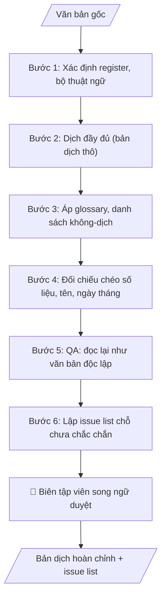

# Dịch song ngữ & quản lý thuật ngữ

## Định dạng và file đầu ra

Định dạng đầu ra có thể chọn theo sản phẩm/yêu cầu: .docx, .pdf, .txt, .md, .html. Đọc mục “Định dạng bổ sung” trong quy cách đầu ra trước khi chọn.

**Phải tạo file thực tế để tải xuống, không chỉ trả nội dung trong chat.** Định dạng mặc định của skill: **.docx**. Nếu có bảng số liệu nghiệp vụ yêu cầu file bảng tính riêng, tạo thêm Excel theo yêu cầu; không tự tạo file kiểm tra. Không chờ người dùng yêu cầu xuất file lần nữa. Ưu tiên định dạng người dùng chỉ định; đọc quy tắc xuất file tại references/quy-cach-dau-ra.md.

## Quy cách đầu ra và thông tin thiếu
Đọc [quy cách và cấu trúc sản phẩm](references/quy-cach-dau-ra.md) trước khi soạn/xuất. File giao chỉ gồm sản phẩm nghiệp vụ được yêu cầu; kiểm tra nội bộ không xuất kèm. Thiếu thông tin thì giữ nguyên trường/mục và chỗ điền theo mẫu gốc (dòng dấu chấm, dấu gạch hoặc ô trống); không tự điền dữ liệu mẫu, số 0, mã chờ xác minh hay dòng chờ ký. Mẫu chuyên ngành còn áp dụng được ưu tiên về cấu trúc, mã biểu và người ký. Bản đầy đủ: [quy tắc chung](references/quy-tac-chung.md).

## Kiểm soát áp dụng và phê duyệt
Trước khi chạy, xác định `ngay_ap_dung`, `loai_hinh_truong`, `quy_che_noi_bo`, `nguon_du_lieu`, `nguoi_kiem_duyet`; chỉ hỏi thông tin liên quan nghiệp vụ, không dùng giá trị giả định thay dữ liệu bắt buộc. Đối chiếu căn cứ pháp lý với văn bản gốc, hiệu lực, điều khoản áp dụng và chuyển tiếp. Bản đầy đủ: [quy tắc chung](references/quy-tac-chung.md).

## Giới hạn và human gate
AI hỗ trợ chuẩn bị và đối chiếu; cán bộ phụ trách kiểm tra dữ liệu/căn cứ, người có thẩm quyền duyệt và ký. Không đánh dấu đã ký, đã duyệt, đã công bố khi chưa có chứng cứ. Dữ liệu sinh viên, sức khỏe, nhân sự, tài chính chỉ dùng theo mục đích và phân quyền, che thông tin định danh khi dùng ví dụ (Luật 91/2025/QH15, hiệu lực 01/01/2026); không tải dữ liệu lên dịch vụ ngoài khi chưa có quyền. Bản đầy đủ: [quy tắc chung](references/quy-tac-chung.md).

## Khi nào dùng
Khi cần bản tiếng Anh (hoặc tiếng Việt) của văn bản trường học: MOU/MOA, thông báo tuyển sinh,
giới thiệu chương trình, văn bằng/chứng chỉ, nội dung website, hồ sơ kiểm định quốc tế...

## Đầu vào (Input)

| Trường | Mô tả | Bắt buộc |
|---|---|---|
| `van_ban_goc` | Toàn văn bản gốc | Có |
| `huong_dich` | Việt → Anh / Anh → Việt | Có |
| `glossary` | Bảng thuật ngữ chuẩn (thuật ngữ + bản dịch cố định), gồm danh sách KHÔNG dịch (tên riêng, chức danh...) | Không (khuyến nghị có) |
| `doi_tuong_doc` | Đối tác quốc tế / kiểm định viên / sinh viên quốc tế... (để chọn register) | Không |

## Quy trình

**Bước 1. Xác định register và bộ thuật ngữ áp dụng**
- Làm gì: Đọc toàn văn `van_ban_goc` để xác định loại văn bản (MOU, thông báo tuyển sinh, văn bằng, nội dung website...); căn cứ `doi_tuong_doc` để chốt register (hành chính–trang trọng / học thuật / truyền thông); trích từ `glossary` danh sách thuật ngữ cố định và danh sách KHÔNG dịch áp dụng cho văn bản này; ghi nhận độ dài và phạm vi văn bản.
- Dùng input: `van_ban_goc`, `doi_tuong_doc`, `glossary`.
- Vai trò: Biên tập viên song ngữ · AI hỗ trợ: xác định register, trích bộ thuật ngữ và danh sách không-dịch áp dụng · ⏱ ~10–20 phút (ước tính)
- Lưu ý nghiệp vụ: register phải nhất quán toàn văn — văn bản pháp lý dùng văn phong trang trọng, động từ khiếm khuyết chuẩn (VD: "shall" cho nghĩa vụ); các mục trong danh sách không-dịch (tên trường, tên đơn vị, chức danh) luôn giữ nguyên, kể cả khi nghe có vẻ "dịch được".
- → Kết quả bước: Bảng "register + danh sách thuật ngữ/không-dịch áp dụng" làm chuẩn cho bước dịch.

**Bước 2. Dịch đầy đủ (bản dịch thô)**
- Làm gì: Dịch từng đoạn của `van_ban_goc` sang ngôn ngữ đích theo `huong_dich`, không lược ý; câu hành chính dài được tách thành câu ngắn hơn nhưng giữ đầy đủ nghĩa pháp lý; đánh dấu [?] ngay tại chỗ nào còn nghi ngờ để xử lý ở bước 6.
- Dùng input: `van_ban_goc`, `huong_dich`.
- Vai trò: Biên tập viên song ngữ · AI hỗ trợ: dịch đầy đủ bản thô, không lược ý, đánh dấu [?] chỗ nghi ngờ · ⏱ ~20–40 phút (ước tính)
- Lưu ý nghiệp vụ: bẫy thường gặp là "dịch đẹp mà mất nghĩa" ở câu có điều kiện pháp lý (VD: nhầm "shall" với "should"); chưa áp glossary ở bước này để bước 3 áp đồng bộ một lượt.
- → Kết quả bước: Bản dịch thô đầy đủ, các đoạn nghi ngờ đã đánh dấu [?].

**Bước 3. Áp glossary và danh sách không-dịch**
- Làm gì: Quét toàn bộ bản dịch thô, thay mọi thuật ngữ có trong `glossary` bằng bản dịch cố định; kiểm tra từng tên riêng/tên đơn vị/chức danh đối chiếu với danh sách không-dịch — chỗ nào sai thì sửa về đúng chuẩn (VD: tên giao dịch quốc tế đã đăng ký của trường); ghi thêm các thuật ngữ mới phát sinh chưa có trong glossary vào danh sách tạm.
- Dùng input: `glossary` (bản dịch thô từ bước 2).
- Vai trò: Biên tập viên song ngữ · AI hỗ trợ: áp glossary đồng bộ toàn văn, kiểm tra danh sách không-dịch · ⏱ ~15–30 phút (ước tính)
- Lưu ý nghiệp vụ: một thuật ngữ phải thống nhất 100% ở mọi vị trí xuất hiện — dùng tìm kiếm toàn văn để bắt chỗ sót; tên trường/đơn vị trong văn bằng phải khớp tuyệt đối với tên giao dịch chính thức.
- → Kết quả bước: Bản dịch đã chuẩn hóa thuật ngữ + "danh sách thuật ngữ mới phát sinh" để cập nhật glossary.

**Bước 4. Đối chiếu chéo số liệu, tên riêng, ngày tháng**
- Làm gì: Lập bảng đối chiếu song song bản gốc–bản dịch cho mọi số liệu, ngày tháng, họ tên, tên đơn vị, số/ký hiệu văn bản; kiểm tra định dạng ngày tháng theo chuẩn ngôn ngữ đích (VD: 01/03/2027 → March 1, 2027); đánh dấu và sửa mọi điểm lệch dù chỉ một ký tự.
- Dùng input: `van_ban_goc` (bản dịch từ bước 3).
- Vai trò: Biên tập viên song ngữ · AI hỗ trợ: lập bảng đối chiếu chéo bản gốc–bản dịch (số liệu, ngày tháng, tên riêng) · ⏱ ~15–30 phút (ước tính)
- Lưu ý nghiệp vụ: bẫy thường gặp — số tiền/số lượng bị dịch nhầm đơn vị, ngày tháng bị đảo ngày/tháng; văn bản pháp lý yêu cầu khớp 100%, không được "đại khái".
- → Kết quả bước: Bảng đối chiếu chéo (match/mismatch) — mọi mismatch đã được sửa.

**Bước 5. Đọc lại bản dịch như văn bản độc lập (QA)**
- Làm gì: Đọc lại toàn bộ bản dịch mà KHÔNG nhìn bản gốc để phát hiện câu tối nghĩa, sai ngữ pháp, lỗi chính tả, văn phong không tự nhiên; kiểm tra register có nhất quán từ đầu đến cuối theo `doi_tuong_doc`; sửa và ghi lại mọi chỉnh sửa vào nhật ký hiệu đính.
- Dùng input: `doi_tuong_doc` (bản dịch từ bước 4).
- Vai trò: Biên tập viên song ngữ · AI hỗ trợ: QA bằng cách đọc lại bản dịch như văn bản độc lập, ghi nhật ký hiệu đính · ⏱ ~15–25 phút (ước tính)
- Lưu ý nghiệp vụ: mắt đọc lần hai dễ bỏ sót — nên đọc to thành tiếng hoặc nghỉ một quãng rồi mới QA; độc giả mục tiêu quyết định độ trang trọng của văn phong.
- → Kết quả bước: Bản dịch hoàn chỉnh sau QA + nhật ký hiệu đính.

**Bước 6. Lập issue list**
- Làm gì: Tổng hợp mọi chỗ còn chưa chắc chắn (thuật ngữ chưa có trong glossary, khái niệm đặc thù Việt Nam khó dịch sát như "chỉ tiêu", "chính quy"); mỗi issue ghi rõ: vị trí, phương án đề xuất, phương án thay thế và câu hỏi cần biên tập viên quyết định.
- Dùng input: `glossary` (các đánh dấu [?] từ bước 2, danh sách thuật ngữ mới từ bước 3).
- Vai trò: Biên tập viên song ngữ · AI hỗ trợ: lập issue list; biên tập viên song ngữ quyết định từng issue · ⏱ ~10–20 phút + ~30–60 phút duyệt (ước tính)
- Lưu ý nghiệp vụ: KHÔNG "dịch đại cho xong" — chỗ nào không chắc phải lên issue list; khái niệm không có tương đương tiếng Anh cần đề xuất cách dịch nghĩa, kèm giữ thuật ngữ gốc trong ngoặc nếu cần thiết.
- → Kết quả bước: Issue list đầy đủ — đầu vào cho Human gate (biên tập viên song ngữ duyệt).
## Luồng quy trình (Workflow)

## Đầu ra

File nghiệp vụ thực tế theo định dạng mặc định ở đầu skill hoặc định dạng người dùng yêu cầu, kèm liên kết tải trong phản hồi cuối.

Sản phẩm nghiệp vụ hoàn chỉnh theo [quy cách và cấu trúc](references/quy-cach-dau-ra.md), giữ các trường chưa có dữ liệu ở trạng thái trống. Không xuất kèm checklist/phụ lục kiểm tra đầu ra.

## Kiểm tra nội bộ trước khi giao

- [ ] Output đầy đủ 4 phần theo cấu trúc sản phẩm tại references/quy-cach-dau-ra.md: thông tin văn bản (tên, hướng dịch, register, ngày xuất bản); bản dịch; glossary cập nhật; issue list.
- [ ] Bản dịch trình bày 2 cột song ngữ hoặc 2 văn bản riêng, các đoạn tương ứng nhau; register nhất quán toàn văn theo đối tượng đọc.
- [ ] Số liệu, ngày tháng, họ tên, tên đơn vị, số/ký hiệu văn bản khớp 100% bản gốc; định dạng ngày tháng theo chuẩn ngôn ngữ đích.
- [ ] Thuật ngữ theo glossary thống nhất 100% mọi vị trí; danh sách không-dịch (tên trường, tên đơn vị, chức danh) giữ nguyên; tên giao dịch quốc tế của trường chính xác.
- [ ] Không "dịch đại cho xong": mọi chỗ chưa chắc chắn đã đưa vào issue list (vị trí + phương án đề xuất + phương án thay thế + câu hỏi cho biên tập viên).
- [ ] Không dịch nội dung mật/không được phép công bố ra ngoài (đã kiểm tra phân loại tài liệu).
- [ ] Đã qua Human gate: biên tập viên song ngữ đã duyệt toàn bộ bản dịch và chốt issue list; văn bản có giá trị pháp lý (MOU, văn bằng) đã được lãnh đạo ký duyệt.

> Tiêu chí đạt: tất cả các ô được đánh dấu.

## Human gate (người kiểm duyệt)
1. **Biên tập viên song ngữ** của trường: duyệt toàn bộ bản dịch, quyết định các mục trong issue list,
   chốt glossary.
2. Với văn bản có giá trị pháp lý (MOU, văn bằng), bản dịch cuối phải được lãnh đạo ký duyệt
   như văn bản gốc.

## Giới hạn (guardrails)
- KHÔNG thay thế phiên dịch/phê duyệt cuối cùng đối với văn bản pháp lý, văn bằng, hồ sơ kiểm định.
- KHÔNG tự ý dịch tên riêng, tên đơn vị, chức danh khi đã có trong danh sách không-dịch hoặc tên giao dịch chính thức.
- Mọi chỗ chưa chắc chắn phải đưa vào issue list, không "dịch đại cho xong".
- KHÔNG dịch nội dung mật/không được phép công bố ra ngoài (kiểm tra phân loại tài liệu trước khi dịch).

## Căn cứ & lưu ý
- Tên giao dịch quốc tế của trường (nếu đã đăng ký) là chuẩn duy nhất, không dịch theo nghĩa đen.
- Glossary là tài sản dùng chung — cập nhật sau mỗi lần dịch để các lần sau nhất quán.
- Mọi ví dụ đều giả lập; không dùng tên thật của trường/cá nhân.

## Quản trị phiên bản
- Phiên bản gói `1.3.2` (cập nhật 2026-10-10); hồ sơ đầy đủ tại [references/version.json](references/version.json).
- Người phê duyệt nghiệp vụ: **chưa chỉ định**. Trạng thái: dự thảo nghiệp vụ; kiểm tra pháp lý trước thực thi. Ngày cập nhật không đồng nghĩa mọi văn bản đã được rà soát toàn văn.
- Giấy phép theo LICENSE của kho (bản quyền CES Global). Lịch sử thay đổi: CHANGELOG.md.
