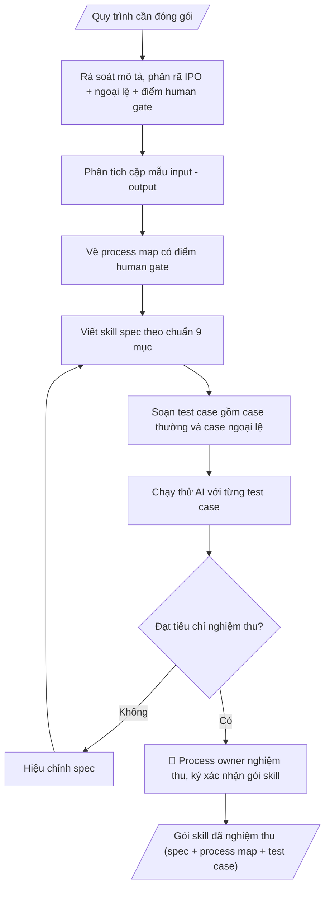

# Skill: Đóng gói skill từ quy trình (meta-skill)

## Khi nào dùng
Khi một đơn vị muốn biến quy trình công việc thực tế (đang làm thủ công hoặc nằm trong
đầu cán bộ) thành skill AI có thể tái dùng, kiểm thử và chuyển giao. Đây là skill
"dùng để tạo ra các skill khác" — áp dụng chung cho mọi phòng ban.

## Đầu vào (Input)

| Trường | Mô tả | Bắt buộc |
|---|---|---|
| `mo_ta_quy_trinh` | Mô tả quy trình: phỏng vấn cán bộ, SOP hiện có, các bước thực hiện | Có |
| `mau_input` | Ít nhất 1 mẫu input thực tế (đã ẩn danh) | Có |
| `mau_output` | Ít nhất 1 mẫu output tương ứng | Có |
| `tieu_chi_nghiem_thu` | Tiêu chí đánh giá output đạt/không đạt | Có |
| `ngoai_le` | Các trường hợp ngoại lệ, tình huống đặc biệt đã gặp | Không |

## Quy trình

**Bước 1. Rà soát mô tả và phân rã IPO**
- Làm gì: đọc kỹ `mo_ta_quy_trinh`, tách quy trình thành chuỗi Input → các bước xử lý → Output; đánh dấu bước nào mô tả mơ hồ, thiếu điều kiện hoặc chưa rõ người chịu trách nhiệm để hỏi lại process owner.
- Dùng input: `mo_ta_quy_trinh`, `ngoai_le`.
- Vai trò: Process owner (chủ quy trình) · AI hỗ trợ: phân rã IPO nháp, đánh dấu điểm mờ cần làm rõ · ⏱ ~30 phút–1 giờ (ước tính)
- Lưu ý nghiệp vụ: không "AI hóa" quy trình còn tranh cãi — nếu các bên mô tả cách làm khác nhau thì phải thống nhất trước; ghi riêng danh sách ngoại lệ và điểm cần con người quyết định ngay từ bước này.
- → Kết quả bước: bản phân rã IPO nháp (danh sách bước xử lý + danh sách điểm mờ cần làm rõ).

**Bước 2. Phân tích cặp mẫu input – output**
- Làm gì: đặt `mau_input` cạnh `mau_output`, đối chiếu từng trường input tạo ra phần nào của output; trích các trường bắt buộc, điều kiện ràng buộc và quy tắc xử lý ngầm mà mô tả chữ không nêu.
- Dùng input: `mau_input`, `mau_output`, `ngoai_le`.
- Vai trò: Cán bộ phụ trách đóng gói skill (phối hợp process owner) · AI hỗ trợ: đối chiếu cặp mẫu input–output, trích trường bắt buộc và quy tắc ngầm · ⏱ ~20–30 phút (ước tính)
- Lưu ý nghiệp vụ: mẫu dữ liệu phải đã được ẩn danh; nếu output có thông tin mà mẫu input không chứa trường tương ứng thì ghi rõ là suy luận cần kiểm chứng, tuyệt đối không bịa quy tắc.
- → Kết quả bước: bảng đối chiếu input – output + danh sách ngoại lệ và quy tắc xử lý.

**Bước 3. Vẽ process map**
- Làm gì: vẽ sơ đồ luồng toàn bộ quy trình theo đúng thứ tự các bước, thêm nhánh rẽ cho từng ngoại lệ, đánh dấu điểm kiểm soát và điểm human gate (cần con người quyết định/duyệt).
- Dùng input: kết quả bước 1–2, `ngoai_le`.
- Vai trò: Cán bộ phụ trách đóng gói skill · AI hỗ trợ: vẽ process map đầy đủ nhánh ngoại lệ và điểm human gate · ⏱ ~20–30 phút (ước tính)
- Lưu ý nghiệp vụ: mỗi nhánh ngoại lệ phải có điểm kết thúc rõ ràng (quay lại luồng chính hay dừng và báo cho ai); human gate đặt tại các quyết định không thể tự động (phê duyệt, ký, đánh giá định tính).
- → Kết quả bước: process map có đầy đủ nhánh ngoại lệ và điểm human gate.

**Bước 4. Viết skill spec theo chuẩn SKILL.md 9 mục**
- Làm gì: viết đầy đủ 9 mục — frontmatter (name, description), khi nào dùng, input (bảng), quy trình, output, ví dụ mô phỏng, human gate, giới hạn, căn cứ; mỗi mục viết cụ thể, cấm câu chung chung kiểu "xử lý phù hợp".
- Dùng input: kết quả bước 1–3, `mau_input`, `mau_output`, `tieu_chi_nghiem_thu`.
- Vai trò: Cán bộ phụ trách đóng gói skill · AI hỗ trợ: viết skill spec đầy đủ 9 mục theo chuẩn, phản ánh đúng process map · ⏱ ~30–45 phút (ước tính)
- Lưu ý nghiệp vụ: mục Quy trình của spec phải phản ánh đúng process map (kể cả nhánh ngoại lệ); ví dụ mô phỏng dùng đúng cặp mẫu input/output đã phân tích ở bước 2.
- → Kết quả bước: bản nháp skill spec hoàn chỉnh 9 mục.

**Bước 5. Soạn bộ test case kiểm thử**
- Làm gì: soạn mỗi test case gồm input mẫu → output kỳ vọng → tiêu chí đạt/không đạt; bao phủ cả case thường, case biên và case ngoại lệ.
- Dùng input: `mau_input`, `tieu_chi_nghiem_thu`, `ngoai_le`.
- Vai trò: Cán bộ phụ trách đóng gói skill · AI hỗ trợ: soạn bộ test case (thường + biên + ngoại lệ) theo tiêu chí đo được · ⏱ ~20–30 phút (ước tính)
- Lưu ý nghiệp vụ: tiêu chí đạt phải đo được (đếm được/kiểm tra được), không dùng từ mơ hồ; test case ngoại lệ bắt buộc phải có — skill không qua test ngoại lệ thì chưa hoàn thành.
- → Kết quả bước: bộ test case (case thường + case biên + case ngoại lệ).

**Bước 6. Chạy thử, hiệu chỉnh và nghiệm thu**
- Làm gì: cho AI chạy từng test case với bản nháp spec, so output thực tế với output kỳ vọng theo tiêu chí; sửa spec (quay lại bước 4) đến khi tất cả test case đạt; trình process owner nghiệm thu và ký xác nhận gói skill.
- Dùng input: `tieu_chi_nghiem_thu`, kết quả bước 4–5.
- Vai trò: Process owner (chạy thử, hiệu chỉnh spec và ký nghiệm thu) · AI hỗ trợ: chạy thử từng test case với bản nháp spec, hỗ trợ hiệu chỉnh · ⏱ ~1–2 giờ (tùy số case) (ước tính)
- Lưu ý nghiệp vụ: mỗi lần sửa spec phải chạy lại toàn bộ test case (tránh sửa chỗ này hỏng chỗ khác); không đưa vào sử dụng chính thức khi chưa có chữ ký nghiệm thu.
- → Kết quả bước: gói skill đã nghiệm thu (skill spec + process map + bộ test case).
## Luồng quy trình (Workflow)


## Đầu ra (Output)
- Process map của quy trình.
- Skill spec hoàn chỉnh theo chuẩn SKILL.md.
- Bộ test case kiểm thử.

**Cấu trúc output chuẩn:** khung mẫu cố định của sản phẩm chính — skill spec:
1. Frontmatter (`name`, `description`) và tiêu đề tên skill.
2. "Khi nào dùng": điều kiện kích hoạt, phạm vi áp dụng.
3. "Đầu vào (Input)": bảng Trường | Mô tả | Bắt buộc.
4. "Quy trình": các bước thực thi, mỗi bước cho ra bán thành phẩm.
5. "Đầu ra (Output)": danh sách sản phẩm cuối.
6. "Ví dụ mô phỏng": Input mẫu + Output mẫu (dữ liệu giả lập, có ghi chú giả lập).
7. "Human gate": ai kiểm duyệt, kiểm duyệt nội dung gì, điều kiện dừng.
8. "Giới hạn": các việc cấm làm.
9. "Căn cứ & lưu ý": văn bản/căn cứ áp dụng.

## Checklist nghiệm thu

- [ ] Đủ 3 sản phẩm theo Cấu trúc output chuẩn: process map, skill spec, bộ test case.
- [ ] Skill spec đủ 9 mục: frontmatter, khi nào dùng, input (bảng), quy trình, output, ví dụ mô phỏng, human gate, giới hạn, căn cứ.
- [ ] Quy trình trong spec phản ánh đúng process map, kể cả nhánh ngoại lệ và điểm human gate.
- [ ] Ví dụ mô phỏng dùng đúng cặp mẫu input/output đã phân tích ở bước 2 (dữ liệu giả lập, đã ẩn danh).
- [ ] Bộ test case bao phủ case thường + case biên + case ngoại lệ; tiêu chí đạt đo được (đếm/kiểm tra được, không từ mơ hồ).
- [ ] Mọi test case đã chạy thử đạt trước khi nghiệm thu (mỗi lần sửa spec chạy lại toàn bộ); test case ngoại lệ bắt buộc phải có.
- [ ] Không bịa quy tắc xử lý cho trường hợp mẫu input không chứa thông tin tương ứng; quy trình còn tranh cãi thì thống nhất trước, không "AI hóa" sự lộn xộn.
- [ ] Đã qua Human gate: process owner nghiệm thu và ký xác nhận gói skill (duyệt spec, duyệt test case).

> Tiêu chí đạt: tất cả các ô được đánh dấu.

## Ví dụ mô phỏng (dữ liệu giả lập)

> Tất cả tên quy trình, dữ liệu dưới đây đều là **giả lập**, minh họa cách đóng gói.

### Input mẫu

| Trường | Giá trị |
|---|---|
| `mo_ta_quy_trinh` | Quy trình "Tiếp nhận và phúc đáp công văn đến": văn thư nhận → đăng ký sổ → trình lãnh đạo phân công → chuyên viên dự thảo → trình ký → phát hành → lưu |
| `mau_input` | Công văn đến giả lập số 45/CV-SK của Học viện B: đề nghị phối hợp hội thảo |
| `mau_output` | Công văn phúc đáp 182/CV-ĐHA-HCTH (đã ban hành, giả lập) |
| `tieu_chi_nghiem_thu` | Đúng thể thức NĐ 30/2020; trích dẫn đúng công văn đến; nơi nhận đủ |

### Output mẫu

```
PROCESS MAP (rút gọn):
Nhận CV đến → Đăng ký sổ (1 ngày) → Trình lãnh đạo phân công (2 ngày)
→ Chuyên viên dự thảo (3 ngày) → Trình ký → Phát hành & lưu
  └─ Ngoại lệ: CV khẩn → rút ngắn còn 1 ngày, báo ngay qua điện thoại

SKILL SPEC: xem mẫu "soan-cong-van" — skill này được sinh ra chính bằng meta-skill này.
(rút gọn đủ 9 mục cho quy trình "Tiếp nhận và phúc đáp công văn đến", dữ liệu giả lập)
1. Frontmatter: name: tiep-nhan-phuc-dap-cong-van-den; description: tiếp nhận công văn
   đến, dự thảo phúc đáp đúng thể thức NĐ 30/2020.
2. Khi nào dùng: khi văn thư nhận được công văn đến cần phúc đáp bằng văn bản.
3. Input (bảng): cong_van_den | tai_lieu_kem_theo | do_khan | nguoi_phan_cong.
4. Quy trình: nhận CV → đăng ký sổ → trình lãnh đạo phân công → chuyên viên dự thảo
   → trình ký → phát hành → lưu hồ sơ.
5. Output: dự thảo công văn phúc đáp đúng thể thức; sổ đăng ký công văn đến cập nhật.
6. Ví dụ mô phỏng: Input: CV số 45/CV-SK của Học viện B (giả lập)
   → Output: công văn phúc đáp 182/CV-ĐHA-HCTH (giả lập, đã ban hành).
7. Human gate: lãnh đạo phân công chuyên viên; người có thẩm quyền ký duyệt dự thảo.
8. Giới hạn: không bịa số hiệu/ký hiệu công văn; không dự thảo khi công văn đến
   thiếu thông tin bắt buộc.
9. Căn cứ: Nghị định 30/2020/NĐ-CP về công tác văn thư; quy chế văn thư nội bộ.

TEST CASE:
| # | Input | Output kỳ vọng | Tiêu chí đạt |
|---|---|---|---|
| 1 | CV đề nghị phối hợp (thường) | Dự thảo phúc đáp | Đủ 8 thành phần thể thức |
| 2 | CV khẩn | Dự thảo + ghi chú độ khẩn | Có dấu "Khẩn", đúng hạn |
| 3 | CV thiếu số/ký hiệu | Yêu cầu bổ sung, không dự thảo | Không bịa số hiệu |
```

## Human gate (người kiểm duyệt)
- **Process owner** (chủ quy trình — trưởng đơn vị hoặc cán bộ phụ trách nghiệp vụ)
  nghiệm thu gói skill: duyệt spec, duyệt test case, ký xác nhận.
- Không đưa skill vào sử dụng chính thức khi chưa nghiệm thu.

## Giới hạn (guardrails)
- **Không đóng gói khi thiếu mẫu input/output thực tế và tiêu chí kiểm thử rõ ràng** —
  skill không có test case thì không được coi là hoàn thành.
- Không đóng gói quy trình mà đơn vị chưa thống nhất (còn tranh cãi về cách làm).
- Mọi mẫu dữ liệu dùng để đóng gói phải được ẩn danh trước.
- Meta-skill không thay thế việc chuẩn hóa quy trình — quy trình rối thì phải gỡ rối
  trước, không "AI hóa" sự lộn xộn.

## Căn cứ & lưu ý
- Chuẩn SKILL.md 9 mục của khung skill tổng thể (`khung-skill-tong-the.md`).
- Không dùng tên thật của trường/cá nhân khi mô phỏng.
