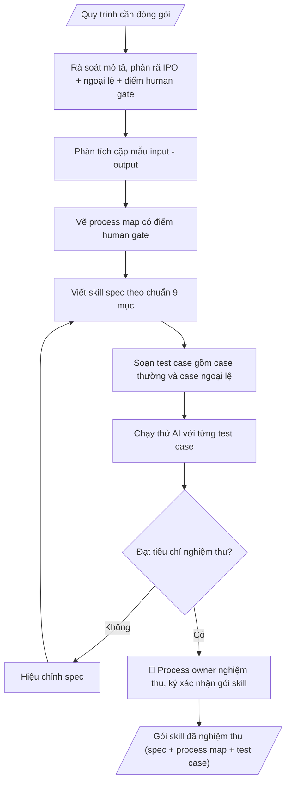

# Đóng gói skill từ quy trình (meta-skill)

## Quy cách đầu ra và thông tin thiếu

Đọc [quy cách và cấu trúc sản phẩm](references/quy-cach-dau-ra.md) trước khi soạn/xuất. File giao chỉ gồm văn bản hoặc sản phẩm nghiệp vụ được yêu cầu; kiểm tra nội bộ không xuất kèm. Thiếu thông tin giữ nguyên trường/mục và chỗ điền theo mẫu gốc (dòng dấu chấm, dấu gạch hoặc ô trống); không tự điền dữ liệu mẫu, số 0, mã chờ xác minh hoặc dòng chờ ký. Mẫu chuyên ngành còn áp dụng được ưu tiên về cấu trúc, mã biểu và người ký. Các trường “bắt buộc” là điều kiện hoàn thiện hồ sơ, không ngăn việc soạn bản có chỗ chừa để điền. Mọi chỉ dẫn “để trống” trong skill được hiểu là không điền dữ liệu và giữ cách chừa chỗ của mẫu gốc, không phải xóa dấu chấm của mẫu.

## Kiểm soát áp dụng và phê duyệt

Trước khi chạy quy trình, xác định `ngay_ap_dung`, `loai_hinh_truong`, `quy_che_noi_bo`, `nguon_du_lieu` và `nguoi_kiem_duyet`. Chỉ yêu cầu thông tin có liên quan đến nghiệp vụ; không dùng giá trị giả định thay dữ liệu bắt buộc. Đối chiếu nội bộ hồ sơ có yếu tố pháp lý với văn bản gốc, hiệu lực, điều khoản áp dụng và chuyển tiếp; không tự đính kèm bảng kiểm tra vào file giao.

## Giới hạn và human gate

AI hỗ trợ chuẩn bị và đối chiếu. Cán bộ phụ trách kiểm tra dữ liệu/căn cứ, người có thẩm quyền duyệt và ký. Văn bản soạn chưa được coi là đã ban hành; không tự chèn nhãn trạng thái kiểm duyệt vào file giao; không đánh dấu đã ký, đã duyệt hoặc đã công bố nếu chưa có chứng cứ. Dữ liệu sinh viên, sức khỏe, nhân sự và tài chính phải hạn chế theo mục đích, phân quyền và che thông tin định danh khi dùng ví dụ. Không tải dữ liệu lên dịch vụ ngoài khi chưa có quyền. Kiểm tra Luật 91/2025/QH15 về bảo vệ dữ liệu cá nhân (hiệu lực 01/01/2026) và quy định áp dụng trước xử lý/chia sẻ dữ liệu cá nhân.

## Khi nào dùng
Khi một đơn vị muốn biến quy trình công việc thực tế (đang làm thủ công hoặc nằm trong
đầu cán bộ) thành skill AI có thể tái dùng, kiểm thử và chuyển giao. Đây là skill
"dùng để tạo ra các skill khác" — áp dụng chung cho mọi phòng ban.

## Đầu vào (Input)

| Trường | Mô tả | Bắt buộc |
|---|---|---|
| `mo_ta_quy_trinh` | Mô tả quy trình: phỏng vấn cán bộ, SOP hiện có, các bước thực hiện | Có |
| `mau_input` | Ít nhất 1 mẫu input thực tế (đã ẩn danh) | Có |
| `mau_output` | Ít nhất 1 mẫu output tương ứng | Có |
| `tieu_chi_nghiem_thu` | Tiêu chí đánh giá output đạt/không đạt | Có |
| `ngoai_le` | Các trường hợp ngoại lệ, tình huống đặc biệt đã gặp | Không |

## Quy trình

**Bước 1. Rà soát mô tả và phân rã IPO**
- Làm gì: đọc kỹ `mo_ta_quy_trinh`, tách quy trình thành chuỗi Input → các bước xử lý → Output; đánh dấu bước nào mô tả mơ hồ, thiếu điều kiện hoặc chưa rõ người chịu trách nhiệm để hỏi lại process owner.
- Dùng input: `mo_ta_quy_trinh`, `ngoai_le`.
- Vai trò: Process owner (chủ quy trình) · AI hỗ trợ: phân rã IPO nháp, đánh dấu điểm mờ cần làm rõ · ⏱ ~30 phút–1 giờ (ước tính)
- Lưu ý nghiệp vụ: không "AI hóa" quy trình còn tranh cãi — nếu các bên mô tả cách làm khác nhau thì phải thống nhất trước; ghi riêng danh sách ngoại lệ và điểm cần con người quyết định ngay từ bước này.
- → Kết quả bước: bản phân rã IPO nháp (danh sách bước xử lý + danh sách điểm mờ cần làm rõ).

**Bước 2. Phân tích cặp mẫu input – output**
- Làm gì: đặt `mau_input` cạnh `mau_output`, đối chiếu từng trường input tạo ra phần nào của output; trích các trường bắt buộc, điều kiện ràng buộc và quy tắc xử lý ngầm mà mô tả chữ không nêu.
- Dùng input: `mau_input`, `mau_output`, `ngoai_le`.
- Vai trò: Cán bộ phụ trách đóng gói skill (phối hợp process owner) · AI hỗ trợ: đối chiếu cặp mẫu input–output, trích trường bắt buộc và quy tắc ngầm · ⏱ ~20–30 phút (ước tính)
- Lưu ý nghiệp vụ: mẫu dữ liệu phải đã được ẩn danh; nếu output có thông tin mà mẫu input không chứa trường tương ứng thì ghi rõ là suy luận cần kiểm chứng, tuyệt đối không bịa quy tắc.
- → Kết quả bước: bảng đối chiếu input – output + danh sách ngoại lệ và quy tắc xử lý.

**Bước 3. Vẽ process map**
- Làm gì: vẽ sơ đồ luồng toàn bộ quy trình theo đúng thứ tự các bước, thêm nhánh rẽ cho từng ngoại lệ, đánh dấu điểm kiểm soát và điểm human gate (cần con người quyết định/duyệt).
- Dùng input: kết quả bước 1–2, `ngoai_le`.
- Vai trò: Cán bộ phụ trách đóng gói skill · AI hỗ trợ: vẽ process map đầy đủ nhánh ngoại lệ và điểm human gate · ⏱ ~20–30 phút (ước tính)
- Lưu ý nghiệp vụ: mỗi nhánh ngoại lệ phải có điểm kết thúc rõ ràng (quay lại luồng chính hay dừng và báo cho ai); human gate đặt tại các quyết định không thể tự động (phê duyệt, ký, đánh giá định tính).
- → Kết quả bước: process map có đầy đủ nhánh ngoại lệ và điểm human gate.

**Bước 4. Viết skill spec theo chuẩn SKILL.md 9 mục**
- Làm gì: viết đầy đủ 9 mục — frontmatter (name, description), khi nào dùng, input (bảng), quy trình, output, ví dụ mô phỏng, human gate, giới hạn, căn cứ; mỗi mục viết cụ thể, cấm câu chung chung kiểu "xử lý phù hợp".
- Dùng input: kết quả bước 1–3, `mau_input`, `mau_output`, `tieu_chi_nghiem_thu`.
- Vai trò: Cán bộ phụ trách đóng gói skill · AI hỗ trợ: viết skill spec đầy đủ 9 mục theo chuẩn, phản ánh đúng process map · ⏱ ~30–45 phút (ước tính)
- Lưu ý nghiệp vụ: mục Quy trình của spec phải phản ánh đúng process map (kể cả nhánh ngoại lệ); ví dụ mô phỏng dùng đúng cặp mẫu input/output đã phân tích ở bước 2.
- → Kết quả bước: bản nháp skill spec hoàn chỉnh 9 mục.

**Bước 5. Soạn bộ test case kiểm thử**
- Làm gì: soạn mỗi test case gồm input mẫu → output kỳ vọng → tiêu chí đạt/không đạt; bao phủ cả case thường, case biên và case ngoại lệ.
- Dùng input: `mau_input`, `tieu_chi_nghiem_thu`, `ngoai_le`.
- Vai trò: Cán bộ phụ trách đóng gói skill · AI hỗ trợ: soạn bộ test case (thường + biên + ngoại lệ) theo tiêu chí đo được · ⏱ ~20–30 phút (ước tính)
- Lưu ý nghiệp vụ: tiêu chí đạt phải đo được (đếm được/kiểm tra được), không dùng từ mơ hồ; test case ngoại lệ bắt buộc phải có — skill không qua test ngoại lệ thì chưa hoàn thành.
- → Kết quả bước: bộ test case (case thường + case biên + case ngoại lệ).

**Bước 6. Chạy thử, hiệu chỉnh và nghiệm thu**
- Làm gì: cho AI chạy từng test case với bản nháp spec, so output thực tế với output kỳ vọng theo tiêu chí; sửa spec (quay lại bước 4) đến khi tất cả test case đạt; trình process owner nghiệm thu và ký xác nhận gói skill.
- Dùng input: `tieu_chi_nghiem_thu`, kết quả bước 4–5.
- Vai trò: Process owner (chạy thử, hiệu chỉnh spec và ký nghiệm thu) · AI hỗ trợ: chạy thử từng test case với bản nháp spec, hỗ trợ hiệu chỉnh · ⏱ ~1–2 giờ (tùy số case) (ước tính)
- Lưu ý nghiệp vụ: mỗi lần sửa spec phải chạy lại toàn bộ test case (tránh sửa chỗ này hỏng chỗ khác); không đưa vào sử dụng chính thức khi chưa có chữ ký nghiệm thu.
- → Kết quả bước: gói skill đã nghiệm thu (skill spec + process map + bộ test case).
## Luồng quy trình (Workflow)

## Đầu ra

Sản phẩm nghiệp vụ hoàn chỉnh theo [quy cách và cấu trúc](references/quy-cach-dau-ra.md), giữ các trường chưa có dữ liệu ở trạng thái trống. Không xuất kèm checklist/phụ lục kiểm tra đầu ra.

## Kiểm tra nội bộ trước khi giao

- [ ] Bố cục khớp mẫu áp dụng và cấu trúc tại references/quy-cach-dau-ra.md.
- [ ] Skill spec đủ 9 mục: frontmatter, khi nào dùng, input (bảng), quy trình, output, ví dụ mô phỏng, human gate, giới hạn, căn cứ.
- [ ] Quy trình trong spec phản ánh đúng process map, kể cả nhánh ngoại lệ và điểm human gate.
- [ ] Ví dụ mô phỏng dùng đúng cặp mẫu input/output đã phân tích ở bước 2 (dữ liệu giả lập, đã ẩn danh).
- [ ] Bộ test case bao phủ case thường + case biên + case ngoại lệ; tiêu chí đạt đo được (đếm/kiểm tra được, không từ mơ hồ).
- [ ] Mọi test case đã chạy thử đạt trước khi nghiệm thu (mỗi lần sửa spec chạy lại toàn bộ); test case ngoại lệ bắt buộc phải có.
- [ ] Không bịa quy tắc xử lý cho trường hợp mẫu input không chứa thông tin tương ứng; quy trình còn tranh cãi thì thống nhất trước, không "AI hóa" sự lộn xộn.
- [ ] Đã qua Human gate: process owner nghiệm thu và ký xác nhận gói skill (duyệt spec, duyệt test case).

> Tiêu chí đạt: tất cả các ô được đánh dấu.

## Human gate (người kiểm duyệt)
- **Process owner** (chủ quy trình — trưởng đơn vị hoặc cán bộ phụ trách nghiệp vụ)
  nghiệm thu gói skill: duyệt spec, duyệt test case, ký xác nhận.
- Không đưa skill vào sử dụng chính thức khi chưa nghiệm thu.

## Giới hạn (guardrails)
- **Không đóng gói khi thiếu mẫu input/output thực tế và tiêu chí kiểm thử rõ ràng** —
  skill không có test case thì không được coi là hoàn thành.
- Không đóng gói quy trình mà đơn vị chưa thống nhất (còn tranh cãi về cách làm).
- Mọi mẫu dữ liệu dùng để đóng gói phải được ẩn danh trước.
- Meta-skill không thay thế việc chuẩn hóa quy trình — quy trình rối thì phải gỡ rối
  trước, không "AI hóa" sự lộn xộn.

## Căn cứ & lưu ý
- Chuẩn SKILL.md 9 mục của khung skill tổng thể (`khung-skill-tong-the.md`).
- Không dùng tên thật của trường/cá nhân khi mô phỏng.

## Quản trị phiên bản

- Phiên bản gói: `1.2.1`; ngày cập nhật: `2026-10-10`.
- Kho nguồn: https://github.com/phamtruong91/university-skills-framework
- Người duy trì trên GitHub: `phamtruong91` (Phạm Văn Trường). Người phê duyệt nghiệp vụ: **chưa chỉ định**.
- Commit nguồn trước cập nhật: `346719e6b0318ed034b4b016703f79733aa575e7`. Commit chứa phiên bản này xem bằng `git log -1 -- skills/dong-goi-skill-tu-quy-trinh`; không tự gán SHA chưa tạo.
- Giấy phép: theo LICENSE của kho; bản quyền CES Global.
- Lịch sử 1.1.0: bổ sung metadata giao diện, kiểm soát áp dụng, quản trị phiên bản.
- Trạng thái: dự thảo nghiệp vụ; kiểm tra pháp lý trước thực thi. Ngày cập nhật không đồng nghĩa mọi văn bản đã được rà soát toàn văn.
