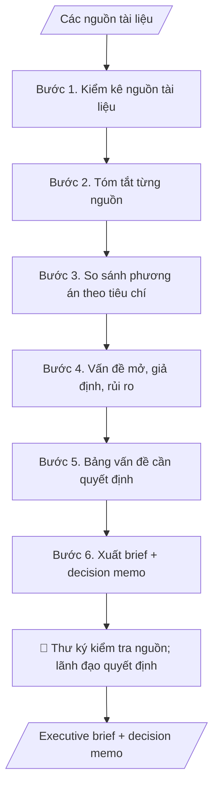

# Executive brief trình lãnh đạo

## Định dạng và file đầu ra

Định dạng đầu ra có thể chọn theo sản phẩm/yêu cầu: .docx, .pdf, .pptx. Đọc mục “Định dạng bổ sung” trong quy cách đầu ra trước khi chọn.

**Phải tạo file thực tế để tải xuống, không chỉ trả nội dung trong chat.** Định dạng mặc định của skill: **.docx**. Nếu có bảng số liệu nghiệp vụ yêu cầu file bảng tính riêng, tạo thêm Excel theo yêu cầu; không tự tạo file kiểm tra. Không chờ người dùng yêu cầu xuất file lần nữa. Ưu tiên định dạng người dùng chỉ định; đọc quy tắc xuất file tại references/quy-cach-dau-ra.md.

## Quy cách đầu ra và thông tin thiếu
Đọc [quy cách và cấu trúc sản phẩm](references/quy-cach-dau-ra.md) trước khi soạn/xuất. File giao chỉ gồm sản phẩm nghiệp vụ được yêu cầu; kiểm tra nội bộ không xuất kèm. Thiếu thông tin thì giữ nguyên trường/mục và chỗ điền theo mẫu gốc (dòng dấu chấm, dấu gạch hoặc ô trống); không tự điền dữ liệu mẫu, số 0, mã chờ xác minh hay dòng chờ ký. Mẫu chuyên ngành còn áp dụng được ưu tiên về cấu trúc, mã biểu và người ký. Bản đầy đủ: [quy tắc chung](references/quy-tac-chung.md).

## Kiểm soát áp dụng và phê duyệt
Trước khi chạy, xác định `ngay_ap_dung`, `loai_hinh_truong`, `quy_che_noi_bo`, `nguon_du_lieu`, `nguoi_kiem_duyet`; chỉ hỏi thông tin liên quan nghiệp vụ, không dùng giá trị giả định thay dữ liệu bắt buộc. Đối chiếu căn cứ pháp lý với văn bản gốc, hiệu lực, điều khoản áp dụng và chuyển tiếp. Bản đầy đủ: [quy tắc chung](references/quy-tac-chung.md).

## Giới hạn và human gate
AI hỗ trợ chuẩn bị và đối chiếu; cán bộ phụ trách kiểm tra dữ liệu/căn cứ, người có thẩm quyền duyệt và ký. Không đánh dấu đã ký, đã duyệt, đã công bố khi chưa có chứng cứ. Dữ liệu sinh viên, sức khỏe, nhân sự, tài chính chỉ dùng theo mục đích và phân quyền, che thông tin định danh khi dùng ví dụ (Luật 91/2025/QH15, hiệu lực 01/01/2026); không tải dữ liệu lên dịch vụ ngoài khi chưa có quyền. Bản đầy đủ: [quy tắc chung](references/quy-tac-chung.md).

## Khi nào dùng
Khi lãnh đạo cần quyết định một vấn đề phức tạp có nhiều nguồn thông tin: phê duyệt đề án,
chọn phương án đầu tư, xử lý vụ việc... Thay vì đọc cả chồng tài liệu, lãnh đạo chỉ đọc
brief 1–2 trang + bảng vấn đề cần quyết định.

## Đầu vào (Input)

| Trường | Mô tả | Bắt buộc |
|---|---|---|
| `van_de` | Vấn đề cần quyết định (1 câu) | Có |
| `nguon_tai_lieu` | Danh sách nguồn: báo cáo, tờ trình, bảng số liệu, văn bản liên quan | Có |
| `tieu_chi_quyet_dinh` | Các tiêu chí lãnh đạo sẽ dùng để quyết (VD: chi phí, tiến độ, rủi ro, phù hợp chiến lược) | Có |
| `phuong_an_hien_co` | Các phương án đang được đề xuất (nếu đã có) | Không |
| `thoi_han_quyet_dinh` | Deadline cần ra quyết định | Không |

## Quy trình

**Bước 1. Kiểm kê nguồn tài liệu**
- Làm gì: liệt kê toàn bộ nguồn trong `nguon_tai_lieu`; kiểm tra mỗi nguồn có đủ thông tin trích dẫn
  (tên, số/ký hiệu, ngày); nêu rõ nguồn nào còn thiếu và ảnh hưởng của việc thiếu đó đến độ tin cậy của brief.
- Dùng input: `nguon_tai_lieu`, `van_de`.
- Vai trò: Thư ký lãnh đạo (hoặc chuyên viên đơn vị trình vấn đề) · AI hỗ trợ: kiểm kê nguồn, ghi nhận nguồn thiếu và mâu thuẫn · ⏱ ~10–20 phút (ước tính)
- Lưu ý nghiệp vụ: nguồn thiếu không được "bù" bằng suy đoán — phải ghi rõ trong brief; các nguồn mâu thuẫn
  nhau phải được ghi nhận ngay từ bước này để xử lý ở Bước 3–4.
- → Kết quả bước: danh mục nguồn (đủ/thiếu) + ghi chú ảnh hưởng của nguồn thiếu.

**Bước 2. Tóm tắt từng nguồn**
- Làm gì: mỗi nguồn tóm tắt 3–5 dòng: sự kiện chính, số liệu chính, kết luận/quan điểm của nguồn;
  giữ nguyên ý của nguồn, không trộn ý kiến cá nhân.
- Dùng input: `nguon_tai_lieu`.
- Vai trò: Thư ký lãnh đạo (hoặc chuyên viên đơn vị trình vấn đề) · AI hỗ trợ: tóm tắt từng nguồn 3–5 dòng, giữ nguyên ý và ghi nguồn số liệu · ⏱ ~15–30 phút (ước tính)
- Lưu ý nghiệp vụ: tóm tắt phải trung thành — không "làm mềm" số liệu bất lợi của bất kỳ phương án nào;
  mỗi số liệu ghi rõ lấy từ nguồn nào.
- → Kết quả bước: bộ tóm tắt từng nguồn (3–5 dòng/nguồn).

**Bước 3. So sánh phương án theo tiêu chí**
- Làm gì: lập bảng ma trận — hàng là các tiêu chí trong `tieu_chi_quyet_dinh`, cột là từng phương án
  trong `phuong_an_hien_co`; nếu chưa có phương án thì đề xuất các phương án hiển nhiên rút ra từ nguồn
  (làm / không làm / hoãn); mỗi ô điền đánh giá và ghi nguồn số liệu.
- Dùng input: `phuong_an_hien_co`, `tieu_chi_quyet_dinh`, bộ tóm tắt (Bước 2).
- Vai trò: Thư ký lãnh đạo (hoặc chuyên viên đơn vị trình vấn đề) · AI hỗ trợ: lập bảng ma trận so sánh phương án theo tiêu chí, mỗi ô có nguồn · ⏱ ~15–30 phút (ước tính)
- Lưu ý nghiệp vụ: ô nào không có số liệu thì ghi "chưa có số liệu", không bịa; mọi phương án phải được
  đánh giá trên cùng một bộ tiêu chí để so sánh công bằng.
- → Kết quả bước: bảng so sánh phương án theo tiêu chí (mỗi ô có nguồn).

**Bước 4. Nêu vấn đề còn mở, giả định và rủi ro**
- Làm gì: liệt kê thông tin chưa có, giả định đang phải dùng tạm, rủi ro chưa lượng hóa được;
  đánh giá mức độ ảnh hưởng của từng điểm mở đến quyết định.
- Dùng input: bộ tóm tắt (Bước 2), bảng so sánh (Bước 3).
- Vai trò: Thư ký lãnh đạo (hoặc chuyên viên đơn vị trình vấn đề) · AI hỗ trợ: liệt kê thông tin thiếu, giả định tạm dùng, rủi ro chưa lượng hóa · ⏱ ~10–20 phút (ước tính)
- Lưu ý nghiệp vụ: đây là phần bảo vệ lãnh đạo khỏi quyết định mù — phải trung thực, không giấu điểm yếu
  của phương án đang được "ưa thích".
- → Kết quả bước: danh sách vấn đề mở + giả định + rủi ro chưa lượng hóa.

**Bước 5. Lập bảng vấn đề cần quyết định**
- Làm gì: với mỗi điểm cần lãnh đạo chốt, viết một câu hỏi quyết định cụ thể; liệt kê các phương án;
  đưa khuyến nghị TRUNG LẬP kèm căn cứ (trích từ Bước 3–4); ghi `thoi_han_quyet_dinh` nếu có.
- Dùng input: `van_de`, bảng so sánh (Bước 3), vấn đề mở (Bước 4), `thoi_han_quyet_dinh`.
- Vai trò: Thư ký lãnh đạo (hoặc chuyên viên đơn vị trình vấn đề) · AI hỗ trợ: lập bảng vấn đề cần quyết định với khuyến nghị trung lập kèm căn cứ · ⏱ ~15–25 phút (ước tính)
- Lưu ý nghiệp vụ: khuyến nghị trung lập = trình bày cân bằng, luôn kèm căn cứ, cấm thiên vị phương án;
  câu hỏi phải đủ cụ thể để lãnh đạo trả lời được ngay, tránh câu hỏi chung chung.
- → Kết quả bước: bảng vấn đề cần quyết định (câu hỏi | phương án | khuyến nghị trung lập + căn cứ).

**Bước 6. Xuất brief và decision memo**
- Làm gì: viết executive brief tối đa 2 trang gồm: bối cảnh, số liệu chính, bảng so sánh rút gọn,
  vấn đề mở, bảng vấn đề cần quyết định; đính kèm decision memo — mẫu để lãnh đạo ghi: quyết định,
  người quyết định, ngày quyết định, ý kiến chỉ đạo.
- Dùng input: kết quả các Bước 1–5.
- Vai trò: Thư ký lãnh đạo (hoặc chuyên viên đơn vị trình vấn đề) · AI hỗ trợ: xuất brief tối đa 2 trang + decision memo có chỗ ký xác nhận · ⏱ ~15–25 phút (ước tính)
- Lưu ý nghiệp vụ: brief tốt = ngắn + đủ + trung thực; chi tiết đầy đủ để ở phụ lục nguồn, không nhồi
  vào brief; decision memo phải có chỗ ký/xác nhận của lãnh đạo.
- → Kết quả bước: executive brief (tối đa 2 trang) + decision memo.
## Luồng quy trình (Workflow)

## Đầu ra

File nghiệp vụ thực tế theo định dạng mặc định ở đầu skill hoặc định dạng người dùng yêu cầu, kèm liên kết tải trong phản hồi cuối.

Sản phẩm nghiệp vụ hoàn chỉnh theo [quy cách và cấu trúc](references/quy-cach-dau-ra.md), giữ các trường chưa có dữ liệu ở trạng thái trống. Không xuất kèm checklist/phụ lục kiểm tra đầu ra.

## Kiểm tra nội bộ trước khi giao

- [ ] Brief đầy đủ 7 phần theo cấu trúc sản phẩm tại references/quy-cach-dau-ra.md: tiêu đề + vấn đề 1 câu + thời hạn; bối cảnh (3–5 dòng); số liệu chính; bảng so sánh phương án; vấn đề còn mở; bảng vấn đề cần quyết định; phụ lục danh mục nguồn.
- [ ] Brief không quá 2 trang; chi tiết đầy đủ để ở phụ lục nguồn, không nhồi vào brief.
- [ ] Mọi số liệu khớp với Input; mỗi số ghi rõ nguồn; ô không có số liệu ghi "chưa có số liệu", không bịa.
- [ ] Khuyến nghị trung lập: trình bày cân bằng các phương án, luôn kèm căn cứ; không thiên vị phương án nào.
- [ ] Vấn đề mở, giả định, rủi ro chưa lượng hóa được nêu trung thực — không giấu điểm yếu của bất kỳ phương án nào.
- [ ] Decision memo có đủ ô: quyết định, người quyết định, ngày quyết định, ý kiến chỉ đạo, chỗ ký/xác nhận.
- [ ] Câu hỏi quyết định đủ cụ thể để lãnh đạo trả lời được ngay.
- [ ] Đã qua Human gate: thư ký/văn phòng lãnh đạo đã kiểm tra nguồn trích dẫn đầy đủ, chính xác, không sót nguồn quan trọng.

> Tiêu chí đạt: tất cả các ô được đánh dấu.

## Human gate (người kiểm duyệt)
1. **Thư ký/văn phòng lãnh đạo**: kiểm tra nguồn trích dẫn trong brief có đầy đủ, chính xác;
   đảm bảo không sót nguồn quan trọng.
2. **Lãnh đạo**: là người DUY NHẤT ra quyết định; ghi quyết định vào decision memo.
3. Brief chỉ có giá trị tham khảo — không thay thế tờ trình, hồ sơ chính thức.

## Giới hạn (guardrails)
- KHÔNG ra quyết định thay lãnh đạo dưới bất kỳ hình thức nào.
- Khuyến nghị trong brief phải TRUNG LẬP, luôn kèm căn cứ; cấm thiên vị phương án.
- KHÔNG giấu rủi ro, thông tin bất lợi của bất kỳ phương án nào.
- KHÔNG bịa số liệu, trích dẫn; nguồn nào thiếu phải nêu rõ.

## Căn cứ & lưu ý
- Brief tốt = ngắn + đủ + trung thực. Tối đa 2 trang; chi tiết để ở phụ lục nguồn.
- Mọi ví dụ đều giả lập; không dùng tên thật của trường/cá nhân.

## Quản trị phiên bản
- Phiên bản gói `1.3.2` (cập nhật 2026-10-10); hồ sơ đầy đủ tại [references/version.json](references/version.json).
- Người phê duyệt nghiệp vụ: **chưa chỉ định**. Trạng thái: dự thảo nghiệp vụ; kiểm tra pháp lý trước thực thi. Ngày cập nhật không đồng nghĩa mọi văn bản đã được rà soát toàn văn.
- Giấy phép theo LICENSE của kho (bản quyền CES Global). Lịch sử thay đổi: CHANGELOG.md.
