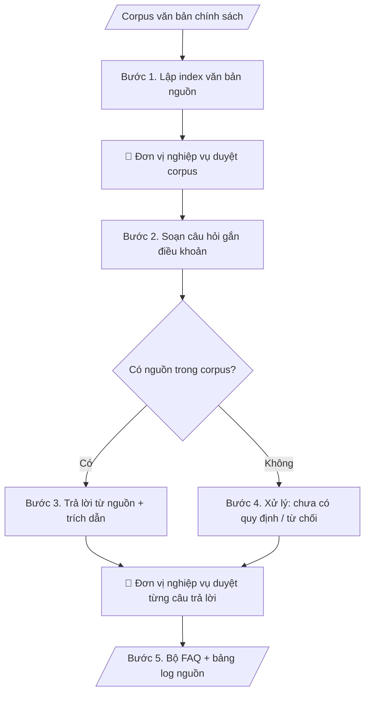

# Hỏi đáp chính sách có trích nguồn

## Kiểm soát áp dụng và phê duyệt

Trước khi chạy quy trình, xác định `ngay_ap_dung`, `loai_hinh_truong`, `quy_che_noi_bo`, `nguon_du_lieu` và `nguoi_kiem_duyet`. Chỉ yêu cầu thông tin có liên quan đến nghiệp vụ; không dùng giá trị giả định thay dữ liệu bắt buộc. Hồ sơ có yếu tố pháp lý phải kèm văn bản gốc, tình trạng hiệu lực, điều khoản áp dụng và chuyển tiếp.

## Giới hạn và human gate

AI hỗ trợ chuẩn bị và đối chiếu. Cán bộ phụ trách kiểm tra dữ liệu/căn cứ, người có thẩm quyền duyệt và ký. Mọi đầu ra mặc định là **DỰ THẢO – CHỜ KIỂM DUYỆT**; không đánh dấu đã ký, đã duyệt hoặc đã công bố nếu chưa có chứng cứ. Dữ liệu sinh viên, sức khỏe, nhân sự và tài chính phải hạn chế theo mục đích, phân quyền và che thông tin định danh khi dùng ví dụ. Không tải dữ liệu lên dịch vụ ngoài khi chưa có quyền. Kiểm tra Luật 91/2025/QH15 về bảo vệ dữ liệu cá nhân (hiệu lực 01/01/2026) và quy định áp dụng trước xử lý/chia sẻ dữ liệu cá nhân.

## Khi nào dùng
Khi cần xây dựng hoặc vận hành kênh hỏi đáp (FAQ, chatbot, tư vấn viên) về các chính sách,
quy định của trường: học phí, học bổng, quy chế đào tạo, chế độ cán bộ, KTX...
Yêu cầu cao nhất: trả lời đúng văn bản, có trích nguồn kiểm chứng được.

## Đầu vào (Input)

| Trường | Mô tả | Bắt buộc |
|---|---|---|
| `van_ban_nguon` | Danh sách văn bản nguồn: tên, số/ký hiệu, ngày ban hành, ngày hiệu lực | Có |
| `chu_de` | Chủ đề FAQ (VD: học bổng; miễn giảm học phí; bảo lưu kết quả) | Có |
| `doi_tuong` | Sinh viên / Cán bộ / Phụ huynh... (để điều chỉnh cách diễn đạt) | Không |
| `cau_hoi_mau` | Các câu hỏi thực tế thường gặp (nếu có) | Không |

## Quy trình

**Bước 1. Lập index văn bản nguồn**
- Làm gì: với mỗi văn bản trong `van_ban_nguon`, ghi: tên, số/ký hiệu, ngày ban hành, ngày hiệu lực;
  tra cứu và đánh dấu trạng thái: còn hiệu lực / hết hiệu lực / bị thay thế (ghi rõ văn bản thay thế).
- Dùng input: `van_ban_nguon`.
- Vai trò: Đơn vị nghiệp vụ (đơn vị ban hành/sở hữu chính sách) · AI hỗ trợ: lập index văn bản nguồn; đơn vị nghiệp vụ xác nhận trạng thái hiệu lực · ⏱ ~20–30 phút + ~30–60 phút duyệt (ước tính)
- Lưu ý nghiệp vụ: văn bản hết hiệu lực phải loại khỏi corpus trả lời hiện hành, nhưng vẫn lưu trong index
  để giải thích "quy định cũ" khi được hỏi; trạng thái hiệu lực do đơn vị nghiệp vụ xác nhận (human gate),
  AI chỉ đề xuất.
- → Kết quả bước: index văn bản nguồn (văn bản | hiệu lực | trạng thái | văn bản thay thế).

**Bước 2. Soạn câu hỏi gắn điều khoản**
- Làm gì: dựa trên `chu_de`, `doi_tuong` và `cau_hoi_mau` (nếu có), soạn bộ câu hỏi; mỗi câu hỏi gắn với
  (các) điều/khoản cụ thể trong index nguồn; ghi chú câu nào không tìm được điều khoản tương ứng.
- Dùng input: `chu_de`, `doi_tuong`, `cau_hoi_mau`, index nguồn (Bước 1).
- Vai trò: Chuyên viên đơn vị nghiệp vụ (đơn vị sở hữu chính sách) · AI hỗ trợ: soạn câu hỏi theo ngôn ngữ đối tượng, gắn điều khoản, đánh dấu câu chưa có nguồn · ⏱ ~15–25 phút (ước tính)
- Lưu ý nghiệp vụ: câu hỏi viết theo ngôn ngữ của đối tượng (sinh viên hỏi kiểu sinh viên); mỗi câu hỏi phải
  truy vết được về điều khoản — câu nào không gắn được thì chuyển sang nhóm "chưa có nguồn" để xử lý ở Bước 4.
- → Kết quả bước: danh sách câu hỏi (câu hỏi | điều khoản tương ứng | trạng thái có/không nguồn).

**Bước 3. Trả lời chỉ từ nguồn, có trích dẫn**
- Làm gì: viết câu trả lời cho từng câu hỏi có nguồn: diễn đạt lại dễ hiểu nhưng không thêm ý ngoài văn bản;
  cuối mỗi câu trả lời trích đủ 3 yếu tố: tên văn bản + điều/khoản + ngày hiệu lực.
- Dùng input: danh sách câu hỏi (Bước 2), `van_ban_nguon`.
- Vai trò: Chuyên viên đơn vị nghiệp vụ (đơn vị sở hữu chính sách) · AI hỗ trợ: viết câu trả lời chỉ từ nguồn, trích đủ 3 yếu tố (tên văn bản + điều/khoản + ngày hiệu lực) · ⏱ ~20–40 phút (ước tính)
- Lưu ý nghiệp vụ: cấm suy đoán, cấm "lấp" ý; câu trả lời phải đứng vững khi người đọc mở văn bản gốc
  ra đối chiếu; trích dẫn thiếu 1 trong 3 yếu tố là chưa đạt.
- → Kết quả bước: bộ câu hỏi – trả lời có trích nguồn đầy đủ.

**Bước 4. Xử lý trường hợp đặc biệt**
- Làm gì: với câu hỏi không có nguồn — trả lời "Hiện chưa có quy định về nội dung này" + hướng dẫn liên hệ
  đơn vị phụ trách; câu hỏi ngoài phạm vi corpus — từ chối lịch sự + hướng dẫn; câu hỏi về văn bản hết
  hiệu lực — ghi rõ "quy định cũ, đã được thay thế bởi..." và không dùng để trả lời cho tình huống hiện hành.
- Dùng input: danh sách câu hỏi "chưa có nguồn" (Bước 2), index nguồn (Bước 1).
- Vai trò: Chuyên viên đơn vị nghiệp vụ (đơn vị sở hữu chính sách) · AI hỗ trợ: xử lý trường hợp đặc biệt — từ chối + hướng dẫn liên hệ, không "lấp" ý · ⏱ ~10–20 phút (ước tính)
- Lưu ý nghiệp vụ: không bao giờ trả lời kiểu "chắc là..." — thà từ chối còn hơn trả lời sai chính sách;
  mọi từ chối đều phải kèm hướng đi tiếp theo cho người hỏi (liên hệ ai, ở đâu).
- → Kết quả bước: nhóm câu trả lời đặc biệt (chưa có quy định / ngoài phạm vi / quy định cũ).

**Bước 5. Xuất bộ FAQ và bảng log nguồn**
- Làm gì: gộp kết quả Bước 3–4 thành bộ FAQ hoàn chỉnh: mỗi mục gồm Hỏi | Đáp | trích nguồn; lập bảng log
  nguồn (câu hỏi ↔ điều khoản ↔ văn bản ↔ hiệu lực); lập danh sách câu hỏi ngoài phạm vi để bổ sung
  hoặc chuyển đơn vị xử lý.
- Dùng input: kết quả Bước 3, Bước 4.
- Vai trò: Chuyên viên đơn vị nghiệp vụ (đơn vị sở hữu chính sách) · AI hỗ trợ: xuất bộ FAQ, bảng log nguồn, danh sách câu hỏi ngoài phạm vi · ⏱ ~15–25 phút (ước tính)
- Lưu ý nghiệp vụ: bảng log là công cụ kiểm chứng — đơn vị nghiệp vụ dùng để duyệt từng câu trước khi
  công bố (human gate); bộ FAQ phải ghi phiên bản và ngày cập nhật.
- → Kết quả bước: bộ FAQ + bảng log nguồn + danh sách câu hỏi ngoài phạm vi.
## Luồng quy trình (Workflow)

## Đầu ra (Output)
- Bộ câu hỏi – trả lời (mỗi câu có trích nguồn + ngày hiệu lực).
- Bảng log nguồn và trạng thái hiệu lực văn bản.
- Danh sách câu hỏi ngoài phạm vi (để bổ sung hoặc chuyển đơn vị xử lý).

**Cấu trúc output chuẩn** (sản phẩm chính: Bộ FAQ):
1. Tiêu đề: FAQ + chủ đề + đối tượng + phiên bản/ngày cập nhật + corpus văn bản áp dụng.
2. Danh sách Hỏi – Đáp: mỗi mục gồm câu hỏi, câu trả lời, trích nguồn (tên văn bản + điều/khoản + ngày hiệu lực).
3. Nhóm câu hỏi chưa có quy định / ngoài phạm vi (cách xử lý + đơn vị liên hệ).
4. Bảng log nguồn: câu hỏi ↔ điều khoản ↔ văn bản ↔ trạng thái hiệu lực.
5. Ghi chú: văn bản hết hiệu lực đã loại khỏi corpus trả lời hiện hành.

## Checklist nghiệm thu

- [ ] Bộ FAQ đầy đủ 5 phần theo Cấu trúc output chuẩn: tiêu đề + chủ đề + đối tượng + phiên bản/ngày cập nhật + corpus văn bản áp dụng; danh sách Hỏi–Đáp; nhóm câu hỏi chưa có quy định/ngoài phạm vi; bảng log nguồn; ghi chú văn bản hết hiệu lực đã loại khỏi corpus.
- [ ] Mỗi câu trả lời có trích dẫn đủ 3 yếu tố: tên văn bản + điều/khoản + ngày hiệu lực (thiếu 1 yếu tố là chưa đạt).
- [ ] Corpus văn bản nguồn còn hiệu lực, đã được đơn vị nghiệp vụ duyệt; văn bản hết hiệu lực không dùng để trả lời tình huống hiện hành.
- [ ] Câu hỏi không có nguồn được trả lời "Hiện chưa có quy định về nội dung này" kèm hướng dẫn liên hệ đơn vị phụ trách — không "lấp" ý, không dùng "chắc là...".
- [ ] Bộ FAQ ghi rõ phiên bản và ngày cập nhật.
- [ ] Không tư vấn ngoài phạm vi chính sách đã duyệt; không đưa lời khuyên mang tính quyết định cá nhân.
- [ ] Đã qua Human gate: đơn vị nghiệp vụ đã duyệt corpus và từng câu trả lời trước khi công bố.

> Tiêu chí đạt: tất cả các ô được đánh dấu.

## Ví dụ mô phỏng (dữ liệu giả lập)

> Tất cả tên trường, cá nhân, số liệu dưới đây đều là **giả lập**.
> Ví dụ: FAQ học bổng — áp dụng tương tự cho mọi chính sách.

### Input mẫu

| Trường | Giá trị |
|---|---|
| `van_ban_nguon` | Quy định học bổng Trường Đại học A, QĐ 120/QĐ-ĐHA ngày 01/09/2026, hiệu lực từ 01/09/2026 |
| `chu_de` | Học bổng khuyến khích học tập |
| `doi_tuong` | Sinh viên |

### Output mẫu

**FAQ — Học bổng khuyến khích học tập** (đối tượng: sinh viên; corpus: Quy định học bổng QĐ 120/QĐ-ĐHA ngày 01/09/2026; cập nhật: 09/10/2026)

**Hỏi:** Điều kiện để được xét học bổng khuyến khích học tập là gì?
**Đáp:** Sinh viên cần đồng thời: (1) điểm trung bình học kỳ từ 8.0 trở lên; (2) điểm rèn luyện từ 80 trở lên;
(3) không có học phần nào dưới 5.0 trong học kỳ xét.
*(Nguồn: Điều 4, Quy định học bổng QĐ 120/QĐ-ĐHA ngày 01/09/2026 — hiệu lực từ 01/09/2026)*

**Hỏi:** Sinh viên năm nhất có được xét học bổng không?
**Đáp:** Hiện quy định chưa đề cập đối tượng sinh viên năm nhất học kỳ 1 (chưa có kết quả học tập).
Đề nghị liên hệ Phòng Công tác sinh viên để được hướng dẫn.
*(Không có nguồn điều chỉnh — không suy đoán)*

**Bảng log nguồn:**
| Câu hỏi | Điều khoản | Văn bản | Trạng thái hiệu lực |
|---|---|---|---|
| Điều kiện xét học bổng | Điều 4 | QĐ 120/QĐ-ĐHA ngày 01/09/2026 | Còn hiệu lực (từ 01/09/2026) |
| SV năm nhất có được xét không | — | — | Chưa có quy định — chuyển Phòng CTSV |

## Human gate (người kiểm duyệt)
1. **Đơn vị nghiệp vụ** (đơn vị ban hành/sở hữu chính sách): duyệt **corpus** — danh mục văn bản nguồn
   và trạng thái hiệu lực — trước khi đưa vào sử dụng.
2. Đơn vị nghiệp vụ duyệt từng câu trả lời trong bộ FAQ trước khi công bố.
3. Khi văn bản nguồn thay đổi, đơn vị nghiệp vụ xác nhận cập nhật; AI không tự ý dùng văn bản mới
   khi chưa được duyệt.

## Giới hạn (guardrails)
- KHÔNG tư vấn, trả lời ngoài phạm vi chính sách đã được duyệt trong corpus.
- KHÔNG dùng văn bản hết hiệu lực để trả lời cho tình huống hiện hành.
- KHÔNG suy đoán, "lấp" câu trả lời khi không có nguồn — phải nói rõ là chưa có quy định.
- KHÔNG đưa ra lời khuyên mang tính quyết định cá nhân (VD: "bạn nên nghỉ học kỳ này").

## Căn cứ & lưu ý
- Corpus văn bản nguồn là "sự thật duy nhất" — mọi câu trả lời đều phải truy vết được về nguồn.
- Định kỳ rà soát hiệu lực văn bản (ít nhất mỗi học kỳ).
- Mọi ví dụ đều giả lập; không dùng tên thật của trường/cá nhân.

## Quản trị phiên bản

- Phiên bản gói: `1.1.0`; ngày cập nhật: `2026-10-09`.
- Kho nguồn: https://github.com/phamtruong91/dh-skills
- Người duy trì trên GitHub: `phamtruong91` (Phạm Văn Trường). Người phê duyệt nghiệp vụ: **chưa chỉ định**.
- Commit nguồn trước cập nhật: `78fd1d51b8acd1a724d9b9af6c488460bc7551ad`. Commit chứa phiên bản này xem bằng `git log -1 -- skills/faq-chinh-sach-co-trich-nguon`; không tự gán SHA chưa tạo.
- Giấy phép: theo LICENSE của kho; bản quyền CES Global.
- Lịch sử 1.1.0: bổ sung metadata giao diện, kiểm soát áp dụng, quản trị phiên bản.
- Trạng thái: dự thảo nghiệp vụ; kiểm tra pháp lý trước thực thi. Ngày cập nhật không đồng nghĩa mọi văn bản đã được rà soát toàn văn.
