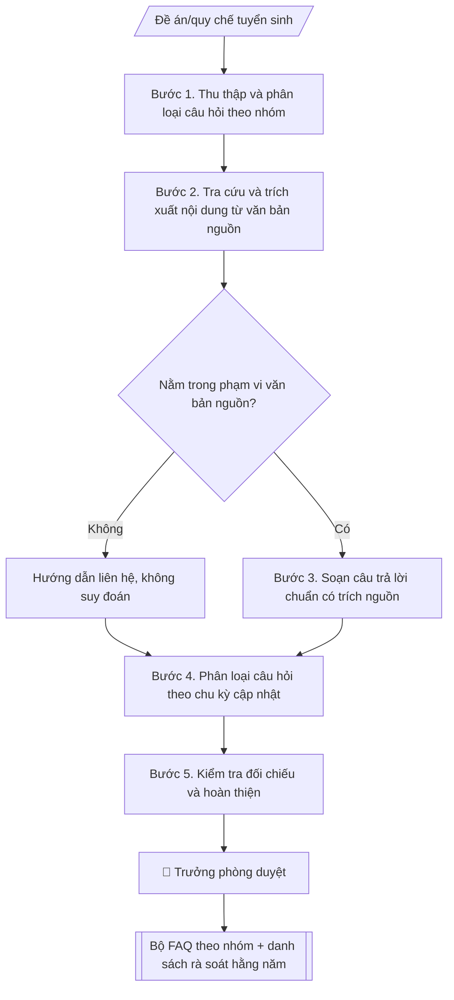

# FAQ tuyển sinh

## Định dạng và file đầu ra

Định dạng đầu ra có thể chọn theo sản phẩm/yêu cầu: .docx, .pdf, .txt, .md, .html. Đọc mục “Định dạng bổ sung” trong quy cách đầu ra trước khi chọn.

**Phải tạo file thực tế để tải xuống, không chỉ trả nội dung trong chat.** Định dạng mặc định của skill: **.docx**. Nếu có bảng số liệu nghiệp vụ yêu cầu file bảng tính riêng, tạo thêm Excel theo yêu cầu; không tự tạo file kiểm tra. Không chờ người dùng yêu cầu xuất file lần nữa. Ưu tiên định dạng người dùng chỉ định; đọc quy tắc xuất file tại references/quy-cach-dau-ra.md.

## Quy cách đầu ra và thông tin thiếu

Đọc [quy cách và cấu trúc sản phẩm](references/quy-cach-dau-ra.md) trước khi soạn/xuất. File giao chỉ gồm văn bản hoặc sản phẩm nghiệp vụ được yêu cầu; kiểm tra nội bộ không xuất kèm. Thiếu thông tin giữ nguyên trường/mục và chỗ điền theo mẫu gốc (dòng dấu chấm, dấu gạch hoặc ô trống); không tự điền dữ liệu mẫu, số 0, mã chờ xác minh hoặc dòng chờ ký. Mẫu chuyên ngành còn áp dụng được ưu tiên về cấu trúc, mã biểu và người ký. Các trường “bắt buộc” là điều kiện hoàn thiện hồ sơ, không ngăn việc soạn bản có chỗ chừa để điền. Mọi chỉ dẫn “để trống” trong skill được hiểu là không điền dữ liệu và giữ cách chừa chỗ của mẫu gốc, không phải xóa dấu chấm của mẫu.

## Kiểm soát áp dụng và phê duyệt

Trước khi chạy quy trình, xác định `ngay_ap_dung`, `loai_hinh_truong`, `quy_che_noi_bo`, `nguon_du_lieu` và `nguoi_kiem_duyet`. Chỉ yêu cầu thông tin có liên quan đến nghiệp vụ; không dùng giá trị giả định thay dữ liệu bắt buộc. Đối chiếu nội bộ hồ sơ có yếu tố pháp lý với văn bản gốc, hiệu lực, điều khoản áp dụng và chuyển tiếp; không tự đính kèm bảng kiểm tra vào file giao.

## Giới hạn và human gate

AI hỗ trợ chuẩn bị và đối chiếu. Cán bộ phụ trách kiểm tra dữ liệu/căn cứ, người có thẩm quyền duyệt và ký. Văn bản soạn chưa được coi là đã ban hành; không tự chèn nhãn trạng thái kiểm duyệt vào file giao; không đánh dấu đã ký, đã duyệt hoặc đã công bố nếu chưa có chứng cứ. Dữ liệu sinh viên, sức khỏe, nhân sự và tài chính phải hạn chế theo mục đích, phân quyền và che thông tin định danh khi dùng ví dụ. Không tải dữ liệu lên dịch vụ ngoài khi chưa có quyền. Kiểm tra Luật 91/2025/QH15 về bảo vệ dữ liệu cá nhân (hiệu lực 01/01/2026) và quy định áp dụng trước xử lý/chia sẻ dữ liệu cá nhân.

## Khi nào dùng
Khi cần bộ câu hỏi thường gặp về tuyển sinh: phương thức xét tuyển, chỉ tiêu, học phí,
học bổng, hồ sơ, thời gian... cho website, chatbot tư vấn và đội ngũ tư vấn viên.

## Đầu vào (Input)

| Trường | Mô tả | Bắt buộc |
|---|---|---|
| `nam_tuyen_sinh` | Năm áp dụng (VD: 2027) | Có |
| `nguon` | Đề án/quy chế/thông báo tuyển sinh của năm (trích dẫn cụ thể) | Có |
| `nhom_cau_hoi` | Các nhóm: phương thức, chỉ tiêu, học phí, học bổng, hồ sơ, thời gian, liên hệ | Có |
| `cau_hoi_thuc_te` | Câu hỏi thí sinh hay hỏi (từ tư vấn viên/chatbot) | Không |

## Quy trình

**Bước 1. Thu thập và phân loại câu hỏi theo nhóm**
- Làm gì: gom câu hỏi từ `cau_hoi_thuc_te` (log chatbot, hotline, fanpage, ghi nhận của tư vấn viên); bổ sung câu hỏi chuẩn cho mỗi nhóm trong `nhom_cau_hoi` (phương thức, chỉ tiêu, học phí, học bổng, hồ sơ, thời gian, liên hệ); loại câu trùng ý, gộp câu hỏi tương tự.
- Dùng input: `nhom_cau_hoi`, `cau_hoi_thuc_te`.
- Vai trò: Chuyên viên Phòng Truyền thông – Tuyển sinh · AI hỗ trợ: tổng hợp, chuẩn hóa dữ liệu · ⏱ ~30–60 phút (ước tính)
- Lưu ý nghiệp vụ: ưu tiên câu hỏi thực tế thí sinh hay hỏi; mỗi nhóm tối thiểu 3–5 câu để phủ đủ nội dung.
- → Kết quả bước: Danh sách câu hỏi đã phân nhóm (đã loại trùng).

**Bước 2. Tra cứu và trích xuất nội dung từ văn bản nguồn**
- Làm gì: với từng câu hỏi, tra trong `nguon` (đề án/quy chế/thông báo tuyển sinh) tìm điều/mục quy định; trích nguyên văn đoạn liên quan; đánh dấu câu hỏi nằm ngoài phạm vi văn bản nguồn.
- Dùng input: `nguon` + danh sách câu hỏi (Bước 1).
- Vai trò: Chuyên viên Phòng Truyền thông – Tuyển sinh · AI hỗ trợ: xử lý sơ bộ, tổng hợp · ⏱ ~30–60 phút (ước tính)
- Lưu ý nghiệp vụ: chỉ dùng văn bản của đúng `nam_tuyen_sinh` — không dùng quy định năm cũ; câu hỏi ngoài phạm vi văn bản được chuyển sang nhóm "hướng dẫn liên hệ", tuyệt đối không suy đoán.
- → Kết quả bước: Bảng ánh xạ câu hỏi → điều/mục văn bản (kèm nguyên văn trích dẫn) + danh sách câu hỏi ngoài phạm vi.

**Bước 3. Soạn câu trả lời chuẩn có trích nguồn**
- Làm gì: viết câu trả lời 2–4 câu, ngôn ngữ dễ hiểu với học sinh/phụ huynh; cuối mỗi câu trả lời ghi nguồn theo mẫu: (Nguồn: [tên văn bản], mục X — áp dụng năm YYYY); với câu hỏi ngoài phạm vi: viết mẫu hướng dẫn liên hệ (bộ phận, số điện thoại).
- Dùng input: `nam_tuyen_sinh` + bảng ánh xạ (Bước 2).
- Vai trò: Chuyên viên Phòng Truyền thông – Tuyển sinh · AI hỗ trợ: soạn dự thảo · ⏱ ~30–60 phút (ước tính)
- Lưu ý nghiệp vụ: không trả lời chung chung kiểu "liên hệ để biết thêm" khi văn bản đã quy định rõ; số liệu (chỉ tiêu, học phí) phải chép đúng từng chữ số.
- → Kết quả bước: Dự thảo FAQ (câu hỏi → câu trả lời → nguồn + năm áp dụng).

**Bước 4. Phân loại câu hỏi theo chu kỳ cập nhật**
- Làm gì: đánh dấu từng câu hỏi: "cập nhật hằng năm" (chỉ tiêu, học phí, thời gian, hồ sơ) vs "ổn định" (quy trình chung, khái niệm); lập danh sách rà soát hằng năm kèm thời điểm rà soát (ngay sau khi có đề án tuyển sinh mới).
- Dùng input: dự thảo FAQ (Bước 3) + `nam_tuyen_sinh`.
- Vai trò: Chuyên viên Phòng Truyền thông – Tuyển sinh · AI hỗ trợ: đối chiếu tự động, cảnh báo sai lệch, lập bảng biểu, định dạng · ⏱ ~30–60 phút (ước tính)
- Lưu ý nghiệp vụ: lỗi phổ biến nhất là dùng FAQ năm cũ cho năm mới — danh sách rà soát này là rào chắn bắt buộc.
- → Kết quả bước: Bộ FAQ có gắn nhãn chu kỳ cập nhật + danh sách rà soát hằng năm.

**Bước 5. Kiểm tra đối chiếu và hoàn thiện**
- Làm gì: đọc lại từng câu trả lời đối chiếu với văn bản nguồn (khớp 100%); kiểm tra năm áp dụng đã ghi đủ ở mọi câu; kiểm tra định dạng phù hợp kênh đăng tải (website/chatbot).
- Dùng input: bộ FAQ (Bước 4) + `nguon`.
- Vai trò: Chuyên viên Phòng Truyền thông – Tuyển sinh · AI hỗ trợ: đối chiếu tự động, cảnh báo sai lệch, chuẩn bị bản phát hành · ⏱ ~1–2 giờ (ước tính)
- Lưu ý nghiệp vụ: người kiểm tra chéo nên khác người soạn để bắt lỗi tốt hơn; đặc biệt soát các mốc thời gian trong câu trả lời.
- → Kết quả bước: Bộ FAQ hoàn chỉnh + danh sách rà soát hằng năm (sẵn sàng trình duyệt).

## Luồng quy trình (Workflow)

## Đầu ra

File nghiệp vụ thực tế theo định dạng mặc định ở đầu skill hoặc định dạng người dùng yêu cầu, kèm liên kết tải trong phản hồi cuối.

Sản phẩm nghiệp vụ hoàn chỉnh theo [quy cách và cấu trúc](references/quy-cach-dau-ra.md), giữ các trường chưa có dữ liệu ở trạng thái trống. Không xuất kèm checklist/phụ lục kiểm tra đầu ra.

## Kiểm tra nội bộ trước khi giao

- [ ] Bố cục khớp mẫu áp dụng và cấu trúc tại references/quy-cach-dau-ra.md.
- [ ] Có đầy đủ sản phẩm: Bộ FAQ theo nhóm (markdown): câu hỏi → câu trả lời → nguồn trích dẫn + năm áp dụng
- [ ] Có đầy đủ sản phẩm: Danh sách câu hỏi cần rà soát lại mỗi năm
- [ ] Mọi số liệu, tên, ngày tháng trong output khớp với Input đã cung cấp (không thêm bớt, không suy đoán)
- [ ] Không bịa đặt số liệu, minh chứng, trích dẫn hay căn cứ
- [ ] Đúng thể thức, định dạng văn bản theo quy định hiện hành
- [ ] Căn cứ pháp lý nêu đầy đủ, còn hiệu lực tại thời điểm lập
- [ ] Đã qua Human gate: người có thẩm quyền đã kiểm tra/ký duyệt trước khi phát hành
- [ ] Ưu tiên câu hỏi thực tế thí sinh hay hỏi
- [ ] Chỉ dùng văn bản của đúng `nam_tuyen_sinh` — không dùng quy định năm cũ

> Tiêu chí đạt: tất cả các ô đều được đánh dấu.

## Human gate (người kiểm duyệt)
- Tư vấn viên trưởng rà soát tính đúng đắn của câu trả lời.
- Trưởng phòng duyệt bộ FAQ trước khi đăng tải.
- Khi quy chế/đề án thay đổi, đơn vị nghiệp vụ (Phòng Đào tạo) xác nhận lại nội dung.

## Giới hạn (guardrails)
- Không trả lời ngoài phạm vi văn bản nguồn; câu hỏi chưa có quy định thì hướng dẫn liên hệ thay vì suy đoán.
- Mọi câu trả lời phải ghi rõ năm áp dụng; không dùng FAQ năm cũ cho năm mới.
- Không quyết định trúng tuyển thay hội đồng tuyển sinh.
- Không tự đăng tải; không tự cập nhật khi chưa có văn bản mới.

## Căn cứ & lưu ý
- Nguồn chính: đề án tuyển sinh hằng năm, quy chế tuyển sinh của Bộ GD&ĐT.
- Không dùng tên thật của trường/cá nhân khi mô phỏng.

## Quản trị phiên bản

- Phiên bản gói: `1.3.1`; ngày cập nhật: `2026-10-10`.
- Kho nguồn: https://github.com/phamtruong91/university-skills-framework
- Người duy trì trên GitHub: `phamtruong91` (Phạm Văn Trường). Người phê duyệt nghiệp vụ: **chưa chỉ định**.
- Commit nguồn trước cập nhật: `346719e6b0318ed034b4b016703f79733aa575e7`. Commit chứa phiên bản này xem bằng `git log -1 -- skills/faq-tuyen-sinh`; không tự gán SHA chưa tạo.
- Giấy phép: theo LICENSE của kho; bản quyền CES Global.
- Lịch sử 1.1.0: bổ sung metadata giao diện, kiểm soát áp dụng, quản trị phiên bản.
- Trạng thái: dự thảo nghiệp vụ; kiểm tra pháp lý trước thực thi. Ngày cập nhật không đồng nghĩa mọi văn bản đã được rà soát toàn văn.
