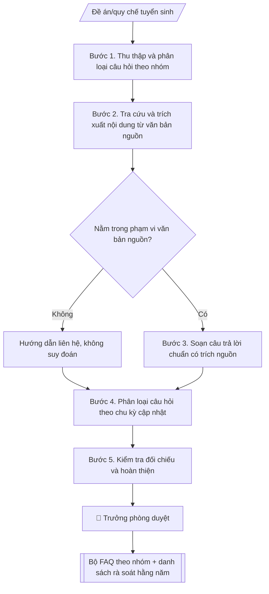

# Skill: FAQ tuyển sinh

## Khi nào dùng
Khi cần bộ câu hỏi thường gặp về tuyển sinh: phương thức xét tuyển, chỉ tiêu, học phí,
học bổng, hồ sơ, thời gian... cho website, chatbot tư vấn và đội ngũ tư vấn viên.

## Đầu vào (Input)

| Trường | Mô tả | Bắt buộc |
|---|---|---|
| `nam_tuyen_sinh` | Năm áp dụng (VD: 2027) | Có |
| `nguon` | Đề án/quy chế/thông báo tuyển sinh của năm (trích dẫn cụ thể) | Có |
| `nhom_cau_hoi` | Các nhóm: phương thức, chỉ tiêu, học phí, học bổng, hồ sơ, thời gian, liên hệ | Có |
| `cau_hoi_thuc_te` | Câu hỏi thí sinh hay hỏi (từ tư vấn viên/chatbot) | Không |

## Quy trình

**Bước 1. Thu thập và phân loại câu hỏi theo nhóm**
- Làm gì: gom câu hỏi từ `cau_hoi_thuc_te` (log chatbot, hotline, fanpage, ghi nhận của tư vấn viên); bổ sung câu hỏi chuẩn cho mỗi nhóm trong `nhom_cau_hoi` (phương thức, chỉ tiêu, học phí, học bổng, hồ sơ, thời gian, liên hệ); loại câu trùng ý, gộp câu hỏi tương tự.
- Dùng input: `nhom_cau_hoi`, `cau_hoi_thuc_te`.
- Vai trò: Chuyên viên Phòng Truyền thông – Tuyển sinh · AI hỗ trợ: tổng hợp, chuẩn hóa dữ liệu · ⏱ ~30–60 phút (ước tính)
- Lưu ý nghiệp vụ: ưu tiên câu hỏi thực tế thí sinh hay hỏi; mỗi nhóm tối thiểu 3–5 câu để phủ đủ nội dung.
- → Kết quả bước: Danh sách câu hỏi đã phân nhóm (đã loại trùng).

**Bước 2. Tra cứu và trích xuất nội dung từ văn bản nguồn**
- Làm gì: với từng câu hỏi, tra trong `nguon` (đề án/quy chế/thông báo tuyển sinh) tìm điều/mục quy định; trích nguyên văn đoạn liên quan; đánh dấu câu hỏi nằm ngoài phạm vi văn bản nguồn.
- Dùng input: `nguon` + danh sách câu hỏi (Bước 1).
- Vai trò: Chuyên viên Phòng Truyền thông – Tuyển sinh · AI hỗ trợ: xử lý sơ bộ, tổng hợp · ⏱ ~30–60 phút (ước tính)
- Lưu ý nghiệp vụ: chỉ dùng văn bản của đúng `nam_tuyen_sinh` — không dùng quy định năm cũ; câu hỏi ngoài phạm vi văn bản được chuyển sang nhóm "hướng dẫn liên hệ", tuyệt đối không suy đoán.
- → Kết quả bước: Bảng ánh xạ câu hỏi → điều/mục văn bản (kèm nguyên văn trích dẫn) + danh sách câu hỏi ngoài phạm vi.

**Bước 3. Soạn câu trả lời chuẩn có trích nguồn**
- Làm gì: viết câu trả lời 2–4 câu, ngôn ngữ dễ hiểu với học sinh/phụ huynh; cuối mỗi câu trả lời ghi nguồn theo mẫu: (Nguồn: [tên văn bản], mục X — áp dụng năm YYYY); với câu hỏi ngoài phạm vi: viết mẫu hướng dẫn liên hệ (bộ phận, số điện thoại).
- Dùng input: `nam_tuyen_sinh` + bảng ánh xạ (Bước 2).
- Vai trò: Chuyên viên Phòng Truyền thông – Tuyển sinh · AI hỗ trợ: soạn dự thảo · ⏱ ~30–60 phút (ước tính)
- Lưu ý nghiệp vụ: không trả lời chung chung kiểu "liên hệ để biết thêm" khi văn bản đã quy định rõ; số liệu (chỉ tiêu, học phí) phải chép đúng từng chữ số.
- → Kết quả bước: Dự thảo FAQ (câu hỏi → câu trả lời → nguồn + năm áp dụng).

**Bước 4. Phân loại câu hỏi theo chu kỳ cập nhật**
- Làm gì: đánh dấu từng câu hỏi: "cập nhật hằng năm" (chỉ tiêu, học phí, thời gian, hồ sơ) vs "ổn định" (quy trình chung, khái niệm); lập danh sách rà soát hằng năm kèm thời điểm rà soát (ngay sau khi có đề án tuyển sinh mới).
- Dùng input: dự thảo FAQ (Bước 3) + `nam_tuyen_sinh`.
- Vai trò: Chuyên viên Phòng Truyền thông – Tuyển sinh · AI hỗ trợ: đối chiếu tự động, cảnh báo sai lệch, lập bảng biểu, định dạng · ⏱ ~30–60 phút (ước tính)
- Lưu ý nghiệp vụ: lỗi phổ biến nhất là dùng FAQ năm cũ cho năm mới — danh sách rà soát này là rào chắn bắt buộc.
- → Kết quả bước: Bộ FAQ có gắn nhãn chu kỳ cập nhật + danh sách rà soát hằng năm.

**Bước 5. Kiểm tra đối chiếu và hoàn thiện**
- Làm gì: đọc lại từng câu trả lời đối chiếu với văn bản nguồn (khớp 100%); kiểm tra năm áp dụng đã ghi đủ ở mọi câu; kiểm tra định dạng phù hợp kênh đăng tải (website/chatbot).
- Dùng input: bộ FAQ (Bước 4) + `nguon`.
- Vai trò: Chuyên viên Phòng Truyền thông – Tuyển sinh · AI hỗ trợ: đối chiếu tự động, cảnh báo sai lệch, chuẩn bị bản phát hành · ⏱ ~1–2 giờ (ước tính)
- Lưu ý nghiệp vụ: người kiểm tra chéo nên khác người soạn để bắt lỗi tốt hơn; đặc biệt soát các mốc thời gian trong câu trả lời.
- → Kết quả bước: Bộ FAQ hoàn chỉnh + danh sách rà soát hằng năm (sẵn sàng trình duyệt).

## Luồng quy trình (Workflow)



## Đầu ra (Output)
- Bộ FAQ theo nhóm (markdown): câu hỏi → câu trả lời → nguồn trích dẫn + năm áp dụng.
- Danh sách câu hỏi cần rà soát lại mỗi năm.

**Cấu trúc output chuẩn** (khung mẫu cố định của sản phẩm chính — Bộ FAQ):
1. Tiêu đề bộ FAQ (tên trường + năm tuyển sinh áp dụng).
2. Các nhóm câu hỏi theo đúng thứ tự `nhom_cau_hoi`; trong mỗi nhóm, mỗi mục gồm:
   a. Câu hỏi (Q).
   b. Câu trả lời (A): ngắn gọn 2–4 câu, ngôn ngữ dễ hiểu với học sinh/phụ huynh.
   c. Dòng nguồn: (Nguồn: [tên văn bản], [điều/mục] — áp dụng năm YYYY).
3. Phụ lục: danh sách câu hỏi cần rà soát lại mỗi năm (kèm thời điểm rà soát).

## Checklist nghiệm thu

- [ ] Đủ các phần theo "Cấu trúc output chuẩn": Tiêu đề bộ FAQ (tên trường + năm tuyển sinh…; Các nhóm câu hỏi theo đúng thứ tự…; Phụ lục
- [ ] Có đầy đủ sản phẩm: Bộ FAQ theo nhóm (markdown): câu hỏi → câu trả lời → nguồn trích dẫn + năm áp dụng
- [ ] Có đầy đủ sản phẩm: Danh sách câu hỏi cần rà soát lại mỗi năm
- [ ] Mọi số liệu, tên, ngày tháng trong output khớp với Input đã cung cấp (không thêm bớt, không suy đoán)
- [ ] Không bịa đặt số liệu, minh chứng, trích dẫn hay căn cứ
- [ ] Đúng thể thức, định dạng văn bản theo quy định hiện hành
- [ ] Căn cứ pháp lý nêu đầy đủ, còn hiệu lực tại thời điểm lập
- [ ] Đã qua Human gate: người có thẩm quyền đã kiểm tra/ký duyệt trước khi phát hành
- [ ] Ưu tiên câu hỏi thực tế thí sinh hay hỏi
- [ ] Chỉ dùng văn bản của đúng `nam_tuyen_sinh` — không dùng quy định năm cũ

> Tiêu chí đạt: tất cả các ô đều được đánh dấu.

## Ví dụ mô phỏng (dữ liệu giả lập)

> Tất cả tên trường, cá nhân, số liệu dưới đây đều là **giả lập**.

### Input mẫu

| Trường | Giá trị |
|---|---|
| `nam_tuyen_sinh` | 2027 |
| `nguon` | Đề án tuyển sinh 2027 của Trường Đại học A (giả lập) |
| `nhom_cau_hoi` | Phương thức, học phí, học bổng, hồ sơ |

### Output mẫu

```
FAQ TUYỂN SINH 2027 — Trường Đại học A (dữ liệu giả lập)

**Nhóm: Phương thức xét tuyển**
Q: Năm 2027 trường xét tuyển theo những phương thức nào?
A: 03 phương thức: (1) xét điểm thi tốt nghiệp THPT, (2) xét học bạ THPT,
(3) xét tuyển thẳng theo quy định.
(Nguồn: Đề án tuyển sinh 2027, mục 2 — áp dụng năm 2027)

**Nhóm: Học phí**
Q: Học phí năm 2027 là bao nhiêu?
A: 18 triệu đồng/năm với khối ngành Kinh tế, 22 triệu đồng/năm với khối ngành
Kỹ thuật (số liệu giả lập).
(Nguồn: Đề án tuyển sinh 2027, mục 4 — áp dụng năm 2027, cần rà soát lại mỗi năm)

**Nhóm: Học bổng**
Q: Trường có học bổng cho tân sinh viên không?
A: Có. Học bổng thủ khoa 100% học phí năm nhất và 50 suất học bổng khuyến khích
(số liệu giả lập).
(Nguồn: Đề án tuyển sinh 2027, mục 5 — áp dụng năm 2027)

**Nhóm: Hồ sơ**
Q: Hồ sơ xét học bạ gồm những gì?
A: Phiếu đăng ký (mẫu của trường), bản sao học bạ THPT, bản sao CCCD.
(Nguồn: Thông báo tuyển sinh đợt 1/2027 — áp dụng năm 2027)

PHỤ LỤC: DANH SÁCH CÂU HỎI RÀ SOÁT HẰNG NĂM
(Rà soát ngay sau khi Đề án tuyển sinh năm mới được ban hành)
- Nhóm Học phí: câu hỏi về mức học phí năm 2027.
- Nhóm Hồ sơ: câu hỏi về thành phần hồ sơ xét học bạ.
- Câu hỏi về chỉ tiêu, thời gian (khi bổ sung vào bộ FAQ).
```

## Human gate (người kiểm duyệt)
- Tư vấn viên trưởng rà soát tính đúng đắn của câu trả lời.
- Trưởng phòng duyệt bộ FAQ trước khi đăng tải.
- Khi quy chế/đề án thay đổi, đơn vị nghiệp vụ (Phòng Đào tạo) xác nhận lại nội dung.

## Giới hạn (guardrails)
- Không trả lời ngoài phạm vi văn bản nguồn; câu hỏi chưa có quy định thì hướng dẫn liên hệ thay vì suy đoán.
- Mọi câu trả lời phải ghi rõ năm áp dụng; không dùng FAQ năm cũ cho năm mới.
- Không quyết định trúng tuyển thay hội đồng tuyển sinh.
- Không tự đăng tải; không tự cập nhật khi chưa có văn bản mới.

## Căn cứ & lưu ý
- Nguồn chính: đề án tuyển sinh hằng năm, quy chế tuyển sinh của Bộ GD&ĐT.
- Không dùng tên thật của trường/cá nhân khi mô phỏng.
