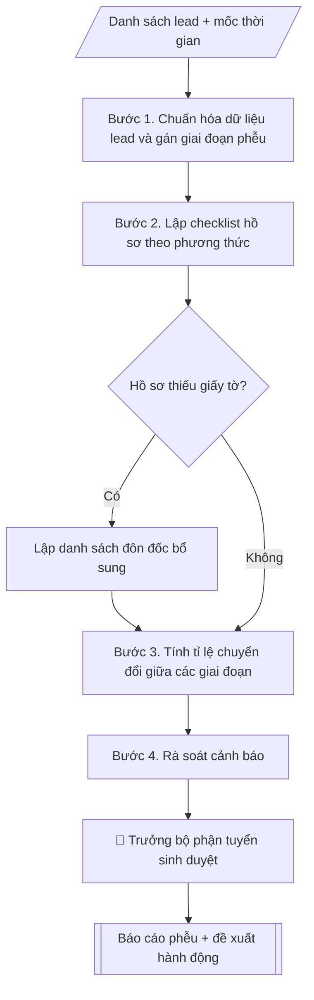

# Skill: Funnel theo dõi thí sinh

## Khi nào dùng
Trong chiến dịch tuyển sinh, khi cần quản lý danh sách thí sinh tiềm năng theo từng giai đoạn
phễu, đôn đốc hồ sơ và báo cáo tỉ lệ chuyển đổi cho lãnh đạo.

## Đầu vào (Input)

| Trường | Mô tả | Bắt buộc |
|---|---|---|
| `chien_dich` | Tên chiến dịch/đợt tuyển sinh | Có |
| `du_lieu_lead` | Danh sách lead: họ tên, kênh tiếp cận, giai đoạn hiện tại, ghi chú (đã ẩn danh/bảo mật) | Có |
| `moc_thoi_gian` | Các mốc: mở đăng ký, hạn nộp hồ sơ, công bố kết quả, nhập học | Có |
| `chi_tieu` | Chỉ tiêu lead và tỉ lệ chuyển đổi mục tiêu theo giai đoạn | Không |

## Quy trình

**Bước 1. Chuẩn hóa dữ liệu lead và gán giai đoạn phễu**
- Làm gì: loại bỏ lead trùng (trùng SĐT/email); chuẩn hóa tên kênh tiếp cận về danh mục thống nhất; gán mỗi lead vào đúng 1 giai đoạn theo định nghĩa thống nhất: Biết đến → Quan tâm (đăng ký tư vấn) → Nộp hồ sơ → Đủ điều kiện → Trúng tuyển → Nhập học.
- Dùng input: `du_lieu_lead`, `chien_dich`.
- Vai trò: Chuyên viên Phòng Truyền thông – Tuyển sinh · AI hỗ trợ: xử lý sơ bộ, tổng hợp · ⏱ ~30–60 phút (ước tính)
- Lưu ý nghiệp vụ: định nghĩa "giai đoạn" phải viết thành văn bản trước khi gán (VD: "Quan tâm" = đã để lại SĐT đăng ký tư vấn); dữ liệu cá nhân thí sinh chỉ xử lý trên hệ thống được phân quyền, ẩn danh khi xuất báo cáo.
- → Kết quả bước: Bộ dữ liệu lead sạch đã gán giai đoạn (kèm log số lead trùng bị loại).

**Bước 2. Lập checklist hồ sơ theo phương thức**
- Làm gì: với từng phương thức xét tuyển, liệt kê thành phần hồ sơ bắt buộc; đối chiếu từng lead ở giai đoạn "Nộp hồ sơ" → đánh dấu đủ/thiếu từng thành phần; lập danh sách lead cần bổ sung kèm hạn bổ sung.
- Dùng input: `du_lieu_lead` đã chuẩn hóa (Bước 1) + `moc_thoi_gian`.
- Vai trò: Chuyên viên Phòng Truyền thông – Tuyển sinh · AI hỗ trợ: đối chiếu tự động, cảnh báo sai lệch, lập bảng biểu, định dạng · ⏱ ~30–60 phút (ước tính)
- Lưu ý nghiệp vụ: mỗi phương thức có checklist riêng (xét học bạ khác xét điểm thi); hạn bổ sung phải trước hạn nộp hồ sơ ít nhất 5 ngày làm việc.
- → Kết quả bước: Checklist hồ sơ từng phương thức + danh sách lead thiếu giấy tờ cần đôn đốc.

**Bước 3. Tính tỉ lệ chuyển đổi giữa các giai đoạn**
- Làm gì: đếm số lead từng giai đoạn → tính tỉ lệ chuyển đổi giữa các giai đoạn kề nhau; so sánh với `chi_tieu` (nếu có) và với cùng kỳ năm trước; xác định giai đoạn rớt nhiều nhất.
- Dùng input: bộ dữ liệu lead đã chuẩn hóa (Bước 1) + `chi_tieu`.
- Vai trò: Chuyên viên Phòng Truyền thông – Tuyển sinh · AI hỗ trợ: tính toán, phân tích số liệu · ⏱ ~30–60 phút (ước tính)
- Lưu ý nghiệp vụ: tỉ lệ tính trên số liệu thực tế chốt tại một thời điểm, không ước lượng; ghi rõ thời điểm chốt số liệu trong báo cáo.
- → Kết quả bước: Bảng phễu kèm tỉ lệ chuyển đổi + so sánh với chỉ tiêu/cùng kỳ.

**Bước 4. Rà soát cảnh báo**
- Làm gì: quét danh sách đôn đốc (Bước 2) tìm lead sắp quá hạn bổ sung (còn ≤ 5 ngày); quét bảng phễu (Bước 3) tìm giai đoạn có tỉ lệ rớt bất thường (giảm > 10 điểm % so với cùng kỳ hoặc thấp hơn chỉ tiêu); ghi nhận từng cảnh báo kèm số lượng cụ thể.
- Dùng input: danh sách đôn đốc (Bước 2) + bảng phễu (Bước 3) + `moc_thoi_gian`.
- Vai trò: Chuyên viên Phòng Truyền thông – Tuyển sinh · AI hỗ trợ: đối chiếu tự động, cảnh báo sai lệch · ⏱ ~1–2 giờ (ước tính)
- Lưu ý nghiệp vụ: cảnh báo phải cụ thể đến nhóm lead (VD: "180 hồ sơ thiếu học bạ, hạn 25/06"), không cảnh báo chung chung.
- → Kết quả bước: Danh sách cảnh báo (lead sắp quá hạn / giai đoạn rớt bất thường).

**Bước 5. Xuất báo cáo và đề xuất hành động**
- Làm gì: tổng hợp bảng phễu + checklist đôn đốc + cảnh báo thành báo cáo ngắn; viết nhận xét (kênh nào hiệu quả nhất, nút thắt ở đâu) và đề xuất hành động cụ thể (tăng cường kênh nào, đôn đốc nhóm nào, trước ngày nào, ai phụ trách).
- Dùng input: bảng phễu (Bước 3) + danh sách đôn đốc (Bước 2) + cảnh báo (Bước 4) + `chien_dich`.
- Vai trò: Chuyên viên Phòng Truyền thông – Tuyển sinh · AI hỗ trợ: soạn dự thảo, tổng hợp, chuẩn hóa dữ liệu · ⏱ ~30–60 phút (ước tính)
- Lưu ý nghiệp vụ: mỗi đề xuất phải gắn người phụ trách và thời hạn; báo cáo ẩn danh thông tin cá nhân thí sinh.
- → Kết quả bước: Báo cáo phễu theo dõi thí sinh kèm đề xuất hành động.

## Luồng quy trình (Workflow)



## Đầu ra (Output)
- Bảng phễu lead theo giai đoạn (markdown) + tỉ lệ chuyển đổi.
- Checklist hồ sơ thiếu cần đôn đốc.
- Báo cáo ngắn kèm đề xuất hành động.

**Cấu trúc output chuẩn** (khung mẫu cố định của sản phẩm chính — Báo cáo phễu):
1. Tiêu đề (tên chiến dịch/đợt tuyển sinh + thời điểm chốt số liệu).
2. Bảng phễu: Giai đoạn | Số lượng | Tỉ lệ chuyển đổi (kèm so sánh chỉ tiêu/cùng kỳ nếu có).
3. Checklist hồ sơ cần đôn đốc (nhóm theo loại giấy tờ thiếu + số lượng + hạn bổ sung).
4. Cảnh báo (lead sắp quá hạn bổ sung; giai đoạn có tỉ lệ rớt bất thường).
5. Nhận xét và đề xuất hành động (kênh cần tăng cường, nhóm cần đôn đốc, người phụ trách, thời hạn).

## Checklist nghiệm thu

- [ ] Đủ các phần theo "Cấu trúc output chuẩn": Tiêu đề (tên chiến dịch/đợt tuyển sinh +…; Bảng phễu; Checklist hồ sơ cần đôn đốc (nhóm theo loại…; Cảnh báo (lead sắp quá hạn bổ sung; giai…; Nhận xét và đề xuất hành động (kênh cần tăng…
- [ ] Có đầy đủ sản phẩm: Bảng phễu lead theo giai đoạn (markdown) + tỉ lệ chuyển đổi
- [ ] Có đầy đủ sản phẩm: Checklist hồ sơ thiếu cần đôn đốc
- [ ] Mọi số liệu, tên, ngày tháng trong output khớp với Input đã cung cấp (không thêm bớt, không suy đoán)
- [ ] Không bịa đặt số liệu, minh chứng, trích dẫn hay căn cứ
- [ ] Đúng thể thức, định dạng văn bản theo quy định hiện hành
- [ ] Căn cứ pháp lý nêu đầy đủ, còn hiệu lực tại thời điểm lập
- [ ] Đã qua Human gate: người có thẩm quyền đã kiểm tra/ký duyệt trước khi phát hành
- [ ] Định nghĩa "giai đoạn" phải viết thành văn bản trước khi gán (VD: "Quan tâm" = đã để lại SĐT đăng ký tư vấn)
- [ ] Mỗi phương thức có checklist riêng (xét học bạ khác xét điểm thi)

> Tiêu chí đạt: tất cả các ô đều được đánh dấu.

## Ví dụ mô phỏng (dữ liệu giả lập)

> Tất cả tên trường, cá nhân, số liệu dưới đây đều là **giả lập**. Dữ liệu lead trong ví dụ đã ẩn danh.

### Input mẫu

| Trường | Giá trị |
|---|---|
| `chien_dich` | Tuyển sinh đợt 1/2027 |
| `du_lieu_lead` | 5.000 lead (giả lập): 3.000 từ fanpage, 1.200 từ ngày hội tư vấn, 800 từ website |
| `moc_thoi_gian` | Hạn nộp hồ sơ: 30/06/2027; công bố kết quả: 20/07/2027; nhập học: 15/08/2027 |
| `chi_tieu` | 2.500 nhập học (giả lập) |

### Output mẫu

```
PHỄU THEO DÕI THÍ SINH — Đợt 1/2027 (Trường Đại học A — giả lập)
Thời điểm chốt số liệu: 20/06/2027

| Giai đoạn | Số lượng (giả lập) | Tỉ lệ chuyển đổi |
|-----------|-------------------|------------------|
| Biết đến (tiếp cận) | 50.000 | — |
| Quan tâm (đăng ký tư vấn) | 5.000 | 10% |
| Nộp hồ sơ | 3.200 | 64% |
| Đủ điều kiện | 2.900 | 91% |
| Trúng tuyển (dự kiến) | 2.700 | 93% |
| Nhập học (mục tiêu) | 2.500 | 93% |

CHECKLIST HỒ SƠ CẦN ĐÔN ĐỐC (tính đến 20/06/2027):
- 180 hồ sơ thiếu bản sao học bạ — hạn bổ sung: 25/06/2027 (giả lập)
- 95 hồ sơ thiếu CCCD — hạn bổ sung: 25/06/2027 (giả lập)

CẢNH BÁO:
- 275 hồ sơ còn ≤ 5 ngày đến hạn bổ sung (25/06/2027).
- Tỉ lệ Quan tâm → Nộp hồ sơ đạt 64%, thấp hơn 8 điểm % so với cùng kỳ năm 2026.

NHẬN XÉT VÀ ĐỀ XUẤT:
1. Tăng cường quảng cáo fanpage (kênh cho tỉ lệ chuyển đổi cao nhất: 12%) —
   Phòng Truyền thông và Tuyển sinh thực hiện từ 22/06/2027.
2. Nhắn tin đôn đốc 275 hồ sơ thiếu giấy tờ trước 25/06/2027 —
   Bộ phận tuyển sinh phụ trách.
```

## Human gate (người kiểm duyệt)
- Trưởng bộ phận tuyển sinh duyệt phân loại giai đoạn và báo cáo trước khi trình lãnh đạo.
- Dữ liệu thí sinh (họ tên, liên hệ) chỉ người được phân quyền mới truy cập.

## Giới hạn (guardrails)
- Không tự gửi tin nhắn/email cho thí sinh khi chưa được duyệt nội dung và danh sách.
- Không tự nhận/trả hồ sơ thay cán bộ tuyển sinh.
- Không quyết định trúng tuyển thay hội đồng tuyển sinh.
- Không chia sẻ dữ liệu cá nhân thí sinh ra ngoài; tuân thủ quy định bảo vệ dữ liệu cá nhân.
- Không bịa số liệu chuyển đổi.

## Căn cứ & lưu ý
- Gắn với đề án tuyển sinh và lịch tuyển sinh của Bộ GD&ĐT từng năm.
- Không dùng tên thật của trường/cá nhân khi mô phỏng; dữ liệu lead ví dụ đã ẩn danh.
