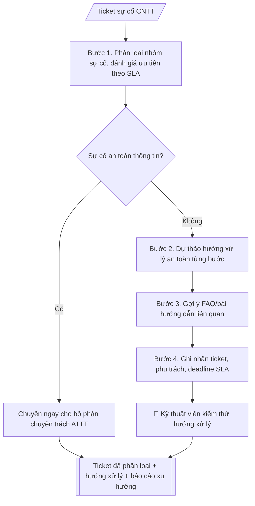

# Helpdesk CNTT (triage)

## Kiểm soát áp dụng và phê duyệt

Trước khi chạy quy trình, xác định `ngay_ap_dung`, `loai_hinh_truong`, `quy_che_noi_bo`, `nguon_du_lieu` và `nguoi_kiem_duyet`. Chỉ yêu cầu thông tin có liên quan đến nghiệp vụ; không dùng giá trị giả định thay dữ liệu bắt buộc. Hồ sơ có yếu tố pháp lý phải kèm văn bản gốc, tình trạng hiệu lực, điều khoản áp dụng và chuyển tiếp.

## Giới hạn và human gate

AI hỗ trợ chuẩn bị và đối chiếu. Cán bộ phụ trách kiểm tra dữ liệu/căn cứ, người có thẩm quyền duyệt và ký. Mọi đầu ra mặc định là **DỰ THẢO – CHỜ KIỂM DUYỆT**; không đánh dấu đã ký, đã duyệt hoặc đã công bố nếu chưa có chứng cứ. Dữ liệu sinh viên, sức khỏe, nhân sự và tài chính phải hạn chế theo mục đích, phân quyền và che thông tin định danh khi dùng ví dụ. Không tải dữ liệu lên dịch vụ ngoài khi chưa có quyền. Kiểm tra Luật 91/2025/QH15 về bảo vệ dữ liệu cá nhân (hiệu lực 01/01/2026) và quy định áp dụng trước xử lý/chia sẻ dữ liệu cá nhân.


## Khi nào dùng
Khi tiếp nhận yêu cầu hỗ trợ CNTT (mạng, phần mềm, tài khoản, thiết bị) cần phân loại
nhanh, ưu tiên đúng SLA và có hướng xử lý nhất quán. Dùng chung cho trung tâm CNTT
hoặc cán bộ phụ trách CNTT của mọi đơn vị.

## Đầu vào (Input)

| Trường | Mô tả | Bắt buộc |
|---|---|---|
| `mo_ta_su_co` | Mô tả sự cố từ người dùng | Có |
| `nguoi_bao` | Đơn vị/cá nhân báo (mã hóa nếu cần) | Có |
| `muc_do_bao` | Mức độ người dùng tự đánh giá: thấp/trung bình/cao/khẩn | Không |
| `thong_tin_he_thong` | Thiết bị, phần mềm, thời điểm xảy ra | Không |
| `quy_dinh_sla` | Thời gian xử lý theo mức ưu tiên của đơn vị | Không |

## Quy trình

**Bước 1. Phân loại và đánh giá ưu tiên**
- Làm gì: đọc `mo_ta_su_co` và `thong_tin_he_thong`, xếp sự cố vào một nhóm (mạng /
  phần mềm / tài khoản & phân quyền / thiết bị / an toàn thông tin); đánh giá lại mức
  ưu tiên theo `quy_dinh_sla` dựa trên phạm vi và số người bị ảnh hưởng — không phụ thuộc
  hoàn toàn vào `muc_do_bao` do người dùng tự đánh giá; tính deadline SLA từ thời điểm
  tiếp nhận.
- Dùng input: `mo_ta_su_co`, `nguoi_bao`, `muc_do_bao`, `thong_tin_he_thong`, `quy_dinh_sla`
- Vai trò: Kỹ thuật viên CNTT (tuyến 1) · AI hỗ trợ: phân loại nhóm sự cố, đề xuất mức ưu tiên và deadline theo SLA · ⏱ ~5–10 phút (ước tính)
- Lưu ý nghiệp vụ: dấu hiệu an toàn thông tin (nghi bị xâm nhập, mã độc, rò rỉ dữ liệu)
  → chuyển ngay cho bộ phận ATTT, dừng xử lý tại skill này; mức ưu tiên phải ghi rõ
  căn cứ SLA và deadline cụ thể.
- → Kết quả bước: "phiếu phân loại" (nhóm sự cố + mức ưu tiên + căn cứ SLA + deadline).

**Bước 2. Dự thảo hướng xử lý an toàn**
- Làm gì: soạn hướng xử lý từng bước theo thứ tự kiểm tra → khắc phục cơ bản mà người
  dùng hoặc kỹ thuật viên tuyến 1 có thể làm; với mỗi bước ghi rõ thao tác, kết quả
  mong đợi, và điểm dừng để chuyển tuyến 2.
- Dùng input: kết quả bước 1 (phiếu phân loại), `thong_tin_he_thong`
- Vai trò: Kỹ thuật viên CNTT · AI hỗ trợ: dự thảo hướng xử lý an toàn từng bước (thao tác → kết quả mong đợi → điểm chuyển tuyến 2) để kiểm thử trước khi áp dụng · ⏱ ~15–30 phút (ước tính)
- Lưu ý nghiệp vụ: hướng xử lý chỉ ở mức dự thảo — kỹ thuật viên phải kiểm thử trước khi
  thực hiện hoặc gửi cho người dùng; không bao gồm thao tác thay đổi cấu hình hệ thống,
  đặt lại mật khẩu hay cấp quyền nếu thiếu xác thực/phê duyệt theo quy trình.
- → Kết quả bước: "hướng xử lý dự thảo từng bước" (kèm điểm chuyển tuyến 2).

**Bước 3. Gợi ý FAQ**
- Làm gì: đối chiếu nhóm sự cố và từ khóa triệu chứng với kho tri thức, gợi ý FAQ/bài
  hướng dẫn liên quan (ghi mã bài và tên bài).
- Dùng input: kết quả bước 1 (phiếu phân loại)
- Vai trò: Kỹ thuật viên CNTT (tuyến 1) · AI hỗ trợ: đối chiếu kho tri thức, gợi ý FAQ khớp triệu chứng · ⏱ ~5 phút (ước tính)
- Lưu ý nghiệp vụ: chỉ gợi ý bài có thật trong kho tri thức — không bịa mã FAQ;
  ưu tiên bài khớp đúng triệu chứng người dùng mô tả.
- → Kết quả bước: "danh sách FAQ liên quan" (mã + tên bài).

**Bước 4. Ghi nhận ticket**
- Làm gì: cấp mã ticket duy nhất; ghi nhận đầy đủ phân loại, ưu tiên, `nguoi_bao`,
  hướng xử lý dự thảo (bước 2), FAQ liên quan (bước 3), người phụ trách đề xuất
  và deadline SLA.
- Dùng input: `nguoi_bao`, kết quả các bước 1–3, `quy_dinh_sla`
- Vai trò: Kỹ thuật viên CNTT (tuyến 1) · AI hỗ trợ: cấp mã ticket duy nhất, ghi nhận đầy đủ các trường bắt buộc · ⏱ ~5 phút (ước tính)
- Lưu ý nghiệp vụ: deadline SLA tính theo giờ làm việc quy định của đơn vị; mã ticket
  không trùng; mọi trường bắt buộc phải có trước khi đóng triage.
- → Kết quả bước: "ticket đã ghi nhận đầy đủ" (sản phẩm chính, chuyển sang Human gate).

**Bước 5. Báo cáo xu hướng** (định kỳ / theo yêu cầu)
- Làm gì: tổng hợp các ticket đã ghi nhận trong kỳ theo nhóm sự cố, đơn vị phát sinh,
  thời gian xử lý trung bình; chỉ ra sự cố lặp lại và đề xuất biện pháp phòng ngừa.
- Dùng input: các ticket đã ghi nhận trong kỳ (kết quả bước 4 của nhiều ticket)
- Vai trò: Trưởng bộ phận CNTT · AI hỗ trợ: tổng hợp ticket trong kỳ, chỉ ra sự cố lặp lại và đề xuất biện pháp phòng ngừa · ⏱ ~15–30 phút (ước tính)
- Lưu ý nghiệp vụ: báo cáo phục vụ cải tiến hệ thống, không dùng để quy trách nhiệm
  cá nhân; số liệu lấy nguyên từ ticket, không ước lượng.
- → Kết quả bước: "báo cáo xu hướng sự cố định kỳ" (trình trưởng bộ phận CNTT duyệt).
## Luồng quy trình (Workflow)


## Đầu ra (Output)
- Ticket đã phân loại + mức ưu tiên + hướng xử lý dự thảo.
- Gợi ý FAQ liên quan.
- Báo cáo xu hướng sự cố (theo yêu cầu định kỳ).

**Cấu trúc output chuẩn** (sản phẩm chính: Ticket đã phân loại + hướng xử lý dự thảo):
1. Mã ticket (người báo, thời điểm tiếp nhận).
2. Phân loại và mức ưu tiên (nhóm sự cố, mức ưu tiên, căn cứ SLA, deadline).
3. Mô tả sự cố.
4. Hướng xử lý dự thảo từng bước (thao tác → kết quả mong đợi; ghi rõ điểm chuyển tuyến 2).
5. Phân công xử lý (kỹ thuật viên phụ trách đề xuất).
6. FAQ liên quan (mã + tên bài).
7. Ghi chú kiểm thử (kỹ thuật viên kiểm tra trước khi thực hiện/gửi người dùng).

## Checklist nghiệm thu

- [ ] Đủ 7 phần theo Cấu trúc output chuẩn: mã ticket, phân loại + ưu tiên, mô tả sự cố, hướng xử lý dự thảo, phân công, FAQ, ghi chú kiểm thử.
- [ ] Mức ưu tiên có căn cứ SLA và deadline cụ thể (tính theo giờ làm việc của đơn vị), không phụ thuộc hoàn toàn vào mức độ người dùng tự đánh giá.
- [ ] Hướng xử lý từng bước có thao tác → kết quả mong đợi; điểm chuyển tuyến 2 ghi rõ ràng.
- [ ] FAQ chỉ gợi ý bài có thật trong kho tri thức (mã + tên bài), khớp đúng triệu chứng người dùng mô tả — không bịa mã FAQ.
- [ ] Sự cố có dấu hiệu an toàn thông tin đã chuyển ngay cho bộ phận ATTT, không xử lý tại skill.
- [ ] Không đặt lại mật khẩu, cấp quyền hay thay đổi cấu hình hệ thống khi thiếu xác thực/phê duyệt theo quy trình.
- [ ] Ticket có mã duy nhất, đầy đủ trường bắt buộc trước khi đóng triage.
- [ ] Đã qua Human gate: kỹ thuật viên kiểm thử hướng xử lý trước khi gửi cho người dùng hoặc thực hiện.

> Tiêu chí đạt: tất cả các ô được đánh dấu.

## Ví dụ mô phỏng (dữ liệu giả lập)

> Tất cả tên người, đơn vị, sự cố dưới đây đều là **giả lập**.

### Input mẫu

| Trường | Giá trị |
|---|---|
| `mo_ta_su_co` | Không đăng nhập được email công vụ, báo sai mật khẩu dù đã nhập đúng |
| `nguoi_bao` | CB-1024 (Phòng Đào tạo) |
| `muc_do_bao` | Cao |
| `thong_tin_he_thong` | Laptop cá nhân, trình duyệt Chrome, xảy ra từ sáng 09/10/2026 |

### Output mẫu

```
TICKET HD-2026-0341 (giả lập)

1. Mã ticket
HD-2026-0341 | Người báo: CB-1024 (Phòng Đào tạo) | Tiếp nhận: sáng 09/10/2026

2. Phân loại và mức ưu tiên
Nhóm: Tài khoản & phân quyền | Ưu tiên: Cao (ảnh hưởng công việc) | SLA: 4 giờ
Deadline SLA: 13h00 ngày 09/10/2026

3. Mô tả sự cố
Không đăng nhập được email công vụ, báo sai mật khẩu dù đã nhập đúng
(Laptop cá nhân, Chrome, xảy ra từ sáng 09/10/2026).

4. Hướng xử lý dự thảo
1. Xác minh tài khoản CB-1024 còn hiệu lực trên hệ thống quản trị
   → kết quả mong đợi: thấy trạng thái tài khoản.
2. Kiểm tra có bị khóa do nhập sai quá số lần không → mở khóa nếu có
   (chỉ thực hiện sau khi xác thực đúng người báo).
3. Hướng dẫn đặt lại mật khẩu qua kênh xác thực chính thức; kiểm tra đăng nhập lại.
4. Nếu vẫn lỗi → chuyển tuyến 2 (kiểm tra đồng bộ hệ thống).

5. Phân công xử lý
Kỹ thuật viên trực ca sáng 09/10/2026.

6. FAQ liên quan
"Quên mật khẩu email công vụ phải làm gì?" (mã FAQ-07).

7. Ghi chú kiểm thử
Kỹ thuật viên kiểm thử hướng xử lý trước khi thực hiện hoặc gửi cho người dùng.
```

## Human gate (người kiểm duyệt)
- **Kỹ thuật viên** kiểm thử/kiểm tra hướng xử lý trước khi gửi cho người dùng hoặc
  thực hiện trên hệ thống.
- Trưởng bộ phận CNTT duyệt báo cáo xu hướng và đề xuất phòng ngừa.

## Giới hạn (guardrails)
- Không tự chạy lệnh, không thay đổi cấu hình/thiết lập hệ thống một cách tự động.
- Không đặt lại mật khẩu hay cấp quyền mà không có xác thực và phê duyệt theo quy trình.
- Không truy cập, sao chép dữ liệu cá nhân/dữ liệu nhạy cảm của người dùng.
- Sự cố an toàn thông tin (nghi bị xâm nhập, mã độc) phải chuyển ngay cho bộ phận
  an toàn thông tin, không tự xử lý.

## Căn cứ & lưu ý
- Theo quy chế an toàn thông tin và SLA nội bộ của đơn vị.
- Không dùng tên thật của trường/cá nhân khi mô phỏng.

## Quản trị phiên bản

- Phiên bản gói: `1.1.0`; ngày cập nhật: `2026-10-09`.
- Kho nguồn: https://github.com/phamtruong91/dh-skills
- Người duy trì trên GitHub: `phamtruong91` (Phạm Văn Trường). Người phê duyệt nghiệp vụ: **chưa chỉ định**.
- Commit nguồn trước cập nhật: `78fd1d51b8acd1a724d9b9af6c488460bc7551ad`. Commit chứa phiên bản này xem bằng `git log -1 -- skills/helpdesk-cntt-triage`; không tự gán SHA chưa tạo.
- Giấy phép: theo LICENSE của kho; bản quyền CES Global.
- Lịch sử 1.1.0: bổ sung metadata giao diện, kiểm soát áp dụng, quản trị phiên bản.
- Trạng thái: dự thảo nghiệp vụ; kiểm tra pháp lý trước thực thi. Ngày cập nhật không đồng nghĩa mọi văn bản đã được rà soát toàn văn.
