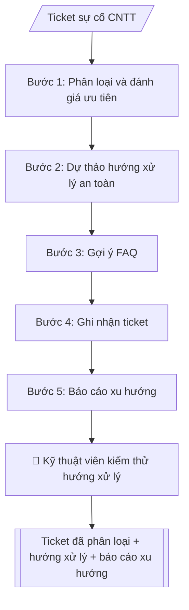

# Helpdesk CNTT (triage)

## Định dạng và file đầu ra

Định dạng đầu ra có thể chọn theo sản phẩm/yêu cầu: .docx, .pdf. Đọc mục “Định dạng bổ sung” trong quy cách đầu ra trước khi chọn.

**Phải tạo file thực tế để tải xuống, không chỉ trả nội dung trong chat.** Định dạng mặc định của skill: **.docx**. Nếu có bảng số liệu nghiệp vụ yêu cầu file bảng tính riêng, tạo thêm Excel theo yêu cầu; không tự tạo file kiểm tra. Không chờ người dùng yêu cầu xuất file lần nữa. Ưu tiên định dạng người dùng chỉ định; đọc quy tắc xuất file tại references/quy-cach-dau-ra.md.

## Quy cách đầu ra và thông tin thiếu
Khi dựng file Word/Excel, áp dụng mục “Thể thức và bảng biểu khi dựng file” trong quy cách đầu ra (cỡ chữ từng thành phần, bảng nhiều trang, số trang, phụ lục). Đọc [quy cách và cấu trúc sản phẩm](references/quy-cach-dau-ra.md) trước khi soạn/xuất. File giao chỉ gồm sản phẩm nghiệp vụ được yêu cầu; kiểm tra nội bộ không xuất kèm. Thiếu thông tin thì giữ nguyên trường/mục và chỗ điền theo mẫu gốc (dòng dấu chấm, dấu gạch hoặc ô trống); không tự điền dữ liệu mẫu, số 0, mã chờ xác minh hay dòng chờ ký. Mẫu chuyên ngành còn áp dụng được ưu tiên về cấu trúc, mã biểu và người ký. Bản đầy đủ: [quy tắc chung](references/quy-tac-chung.md).

## Kiểm soát áp dụng và phê duyệt
Trước khi chạy, xác định `ngay_ap_dung`, `loai_hinh_truong`, `quy_che_noi_bo`, `nguon_du_lieu`, `nguoi_kiem_duyet`; chỉ hỏi thông tin liên quan nghiệp vụ, không dùng giá trị giả định thay dữ liệu bắt buộc. Đối chiếu căn cứ pháp lý với văn bản gốc, hiệu lực, điều khoản áp dụng và chuyển tiếp. Bản đầy đủ: [quy tắc chung](references/quy-tac-chung.md).

## Giới hạn và human gate
AI hỗ trợ chuẩn bị và đối chiếu; cán bộ phụ trách kiểm tra dữ liệu/căn cứ, người có thẩm quyền duyệt và ký. Không đánh dấu đã ký, đã duyệt, đã công bố khi chưa có chứng cứ. Dữ liệu sinh viên, sức khỏe, nhân sự, tài chính chỉ dùng theo mục đích và phân quyền, che thông tin định danh khi dùng ví dụ (Luật 91/2025/QH15, hiệu lực 01/01/2026); không tải dữ liệu lên dịch vụ ngoài khi chưa có quyền. Bản đầy đủ: [quy tắc chung](references/quy-tac-chung.md).

## Khi nào dùng
Khi tiếp nhận yêu cầu hỗ trợ CNTT (mạng, phần mềm, tài khoản, thiết bị) cần phân loại
nhanh, ưu tiên đúng SLA và có hướng xử lý nhất quán. Dùng chung cho trung tâm CNTT
hoặc cán bộ phụ trách CNTT của mọi đơn vị.

## Đầu vào (Input)

| Trường | Mô tả | Bắt buộc |
|---|---|---|
| `mo_ta_su_co` | Mô tả sự cố từ người dùng | Có |
| `nguoi_bao` | Đơn vị/cá nhân báo (mã hóa nếu cần) | Có |
| `muc_do_bao` | Mức độ người dùng tự đánh giá: thấp/trung bình/cao/khẩn | Không |
| `thong_tin_he_thong` | Thiết bị, phần mềm, thời điểm xảy ra | Không |
| `quy_dinh_sla` | Thời gian xử lý theo mức ưu tiên của đơn vị | Không |

## Quy trình

**Bước 1. Phân loại và đánh giá ưu tiên**
- Làm gì: đọc `mo_ta_su_co` và `thong_tin_he_thong`, xếp sự cố vào một nhóm (mạng /
  phần mềm / tài khoản & phân quyền / thiết bị / an toàn thông tin); đánh giá lại mức
  ưu tiên theo `quy_dinh_sla` dựa trên phạm vi và số người bị ảnh hưởng — không phụ thuộc
  hoàn toàn vào `muc_do_bao` do người dùng tự đánh giá; tính deadline SLA từ thời điểm
  tiếp nhận.
- Dùng input: `mo_ta_su_co`, `nguoi_bao`, `muc_do_bao`, `thong_tin_he_thong`, `quy_dinh_sla`
- Vai trò: Kỹ thuật viên CNTT (tuyến 1) · AI hỗ trợ: phân loại nhóm sự cố, đề xuất mức ưu tiên và deadline theo SLA · ⏱ ~5–10 phút (ước tính)
- Lưu ý nghiệp vụ: dấu hiệu an toàn thông tin (nghi bị xâm nhập, mã độc, rò rỉ dữ liệu)
  → chuyển ngay cho bộ phận ATTT, dừng xử lý tại skill này; mức ưu tiên phải ghi rõ
  căn cứ SLA và deadline cụ thể.
- → Kết quả bước: "phiếu phân loại" (nhóm sự cố + mức ưu tiên + căn cứ SLA + deadline).

**Bước 2. Dự thảo hướng xử lý an toàn**
- Làm gì: soạn hướng xử lý từng bước theo thứ tự kiểm tra → khắc phục cơ bản mà người
  dùng hoặc kỹ thuật viên tuyến 1 có thể làm; với mỗi bước ghi rõ thao tác, kết quả
  mong đợi, và điểm dừng để chuyển tuyến 2.
- Dùng input: kết quả bước 1 (phiếu phân loại), `thong_tin_he_thong`
- Vai trò: Kỹ thuật viên CNTT · AI hỗ trợ: dự thảo hướng xử lý an toàn từng bước (thao tác → kết quả mong đợi → điểm chuyển tuyến 2) để kiểm thử trước khi áp dụng · ⏱ ~15–30 phút (ước tính)
- Lưu ý nghiệp vụ: hướng xử lý chỉ ở mức dự thảo — kỹ thuật viên phải kiểm thử trước khi
  thực hiện hoặc gửi cho người dùng; không bao gồm thao tác thay đổi cấu hình hệ thống,
  đặt lại mật khẩu hay cấp quyền nếu thiếu xác thực/phê duyệt theo quy trình.
- → Kết quả bước: "hướng xử lý dự thảo từng bước" (kèm điểm chuyển tuyến 2).

**Bước 3. Gợi ý FAQ**
- Làm gì: đối chiếu nhóm sự cố và từ khóa triệu chứng với kho tri thức, gợi ý FAQ/bài
  hướng dẫn liên quan (ghi mã bài và tên bài).
- Dùng input: kết quả bước 1 (phiếu phân loại)
- Vai trò: Kỹ thuật viên CNTT (tuyến 1) · AI hỗ trợ: đối chiếu kho tri thức, gợi ý FAQ khớp triệu chứng · ⏱ ~5 phút (ước tính)
- Lưu ý nghiệp vụ: chỉ gợi ý bài có thật trong kho tri thức — không bịa mã FAQ;
  ưu tiên bài khớp đúng triệu chứng người dùng mô tả.
- → Kết quả bước: "danh sách FAQ liên quan" (mã + tên bài).

**Bước 4. Ghi nhận ticket**
- Làm gì: cấp mã ticket duy nhất; ghi nhận đầy đủ phân loại, ưu tiên, `nguoi_bao`,
  hướng xử lý dự thảo (bước 2), FAQ liên quan (bước 3), người phụ trách đề xuất
  và deadline SLA.
- Dùng input: `nguoi_bao`, kết quả các bước 1–3, `quy_dinh_sla`
- Vai trò: Kỹ thuật viên CNTT (tuyến 1) · AI hỗ trợ: cấp mã ticket duy nhất, ghi nhận đầy đủ các trường bắt buộc · ⏱ ~5 phút (ước tính)
- Lưu ý nghiệp vụ: deadline SLA tính theo giờ làm việc quy định của đơn vị; mã ticket
  không trùng; mọi trường bắt buộc phải có trước khi đóng triage.
- → Kết quả bước: "ticket đã ghi nhận đầy đủ" (sản phẩm chính, chuyển sang Human gate).

**Bước 5. Báo cáo xu hướng** (định kỳ / theo yêu cầu)
- Làm gì: tổng hợp các ticket đã ghi nhận trong kỳ theo nhóm sự cố, đơn vị phát sinh,
  thời gian xử lý trung bình; chỉ ra sự cố lặp lại và đề xuất biện pháp phòng ngừa.
- Dùng input: các ticket đã ghi nhận trong kỳ (kết quả bước 4 của nhiều ticket)
- Vai trò: Trưởng bộ phận CNTT · AI hỗ trợ: tổng hợp ticket trong kỳ, chỉ ra sự cố lặp lại và đề xuất biện pháp phòng ngừa · ⏱ ~15–30 phút (ước tính)
- Lưu ý nghiệp vụ: báo cáo phục vụ cải tiến hệ thống, không dùng để quy trách nhiệm
  cá nhân; số liệu lấy nguyên từ ticket, không ước lượng.
- → Kết quả bước: "báo cáo xu hướng sự cố định kỳ" (trình trưởng bộ phận CNTT duyệt).
## Luồng quy trình (Workflow)

## Đầu ra

File nghiệp vụ thực tế theo định dạng mặc định ở đầu skill hoặc định dạng người dùng yêu cầu, kèm liên kết tải trong phản hồi cuối.

Sản phẩm nghiệp vụ hoàn chỉnh theo [quy cách và cấu trúc](references/quy-cach-dau-ra.md), giữ các trường chưa có dữ liệu ở trạng thái trống. Không xuất kèm checklist/phụ lục kiểm tra đầu ra.

## Kiểm tra nội bộ trước khi giao

- [ ] Bố cục khớp mẫu áp dụng và cấu trúc tại references/quy-cach-dau-ra.md.
- [ ] Mức ưu tiên có căn cứ SLA và deadline cụ thể (tính theo giờ làm việc của đơn vị), không phụ thuộc hoàn toàn vào mức độ người dùng tự đánh giá.
- [ ] Hướng xử lý từng bước có thao tác → kết quả mong đợi; điểm chuyển tuyến 2 ghi rõ ràng.
- [ ] FAQ chỉ gợi ý bài có thật trong kho tri thức (mã + tên bài), khớp đúng triệu chứng người dùng mô tả — không bịa mã FAQ.
- [ ] Sự cố có dấu hiệu an toàn thông tin đã chuyển ngay cho bộ phận ATTT, không xử lý tại skill.
- [ ] Không đặt lại mật khẩu, cấp quyền hay thay đổi cấu hình hệ thống khi thiếu xác thực/phê duyệt theo quy trình.
- [ ] Ticket có mã duy nhất, đầy đủ trường bắt buộc trước khi đóng triage.
- [ ] Đã qua Human gate: kỹ thuật viên kiểm thử hướng xử lý trước khi gửi cho người dùng hoặc thực hiện.

> Tiêu chí đạt: tất cả các ô được đánh dấu.

## Human gate (người kiểm duyệt)
- **Kỹ thuật viên** kiểm thử/kiểm tra hướng xử lý trước khi gửi cho người dùng hoặc
  thực hiện trên hệ thống.
- Trưởng bộ phận CNTT duyệt báo cáo xu hướng và đề xuất phòng ngừa.

## Giới hạn (guardrails)
- Không tự chạy lệnh, không thay đổi cấu hình/thiết lập hệ thống một cách tự động.
- Không đặt lại mật khẩu hay cấp quyền mà không có xác thực và phê duyệt theo quy trình.
- Không truy cập, sao chép dữ liệu cá nhân/dữ liệu nhạy cảm của người dùng.
- Sự cố an toàn thông tin (nghi bị xâm nhập, mã độc) phải chuyển ngay cho bộ phận
  an toàn thông tin, không tự xử lý.

## Căn cứ & lưu ý
- Theo quy chế an toàn thông tin và SLA nội bộ của đơn vị.
- Không dùng tên thật của trường/cá nhân khi mô phỏng.

## Quản trị phiên bản
- Phiên bản gói `1.3.2` (cập nhật 2026-10-10); hồ sơ đầy đủ tại [references/version.json](references/version.json).
- Người phê duyệt nghiệp vụ: **chưa chỉ định**. Trạng thái: dự thảo nghiệp vụ; kiểm tra pháp lý trước thực thi. Ngày cập nhật không đồng nghĩa mọi văn bản đã được rà soát toàn văn.
- Giấy phép theo LICENSE của kho (bản quyền CES Global). Lịch sử thay đổi: CHANGELOG.md.
