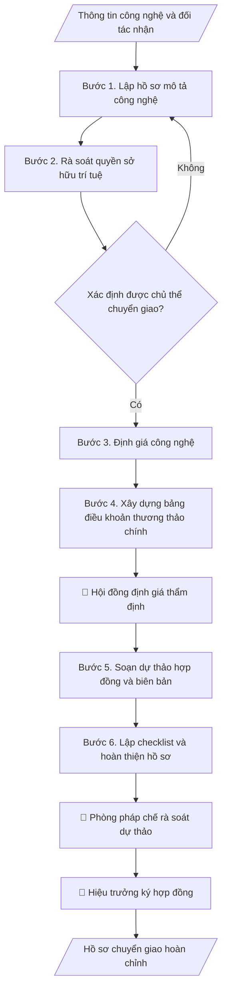

# Hồ sơ chuyển giao công nghệ

## Định dạng và file đầu ra
Định dạng đầu ra có thể chọn theo sản phẩm/yêu cầu: .docx, .pdf. Đọc mục “Định dạng bổ sung” trong quy cách đầu ra trước khi chọn.

**Phải tạo file thực tế để tải xuống, không chỉ trả nội dung trong chat.** Định dạng mặc định của skill: **.docx**. Nếu có bảng số liệu nghiệp vụ yêu cầu file bảng tính riêng, tạo thêm Excel theo yêu cầu; không tự tạo file kiểm tra. Không chờ người dùng yêu cầu xuất file lần nữa. Ưu tiên định dạng người dùng chỉ định; đọc quy tắc xuất file tại references/quy-cach-dau-ra.md.

## Quy cách đầu ra và thông tin thiếu
Khi dựng file Word/Excel, áp dụng mục “Thể thức và bảng biểu khi dựng file” trong quy cách đầu ra (cỡ chữ từng thành phần, bảng nhiều trang, số trang, phụ lục). Đọc [quy cách và cấu trúc sản phẩm](references/quy-cach-dau-ra.md) trước khi soạn/xuất. File giao chỉ gồm sản phẩm nghiệp vụ được yêu cầu; kiểm tra nội bộ không xuất kèm. Thiếu thông tin thì giữ nguyên trường/mục và chỗ điền theo mẫu gốc (dòng dấu chấm, dấu gạch hoặc ô trống); không tự điền dữ liệu mẫu, số 0, mã chờ xác minh hay dòng chờ ký. Mẫu chuyên ngành còn áp dụng được ưu tiên về cấu trúc, mã biểu và người ký. Bản đầy đủ: [quy tắc chung](references/quy-tac-chung.md).

## Kiểm soát áp dụng và phê duyệt
Trước khi chạy, xác định `ngay_ap_dung`, `loai_hinh_truong`, `quy_che_noi_bo`, `nguon_du_lieu`, `nguoi_kiem_duyet`; chỉ hỏi thông tin liên quan nghiệp vụ, không dùng giá trị giả định thay dữ liệu bắt buộc. Đối chiếu căn cứ pháp lý với văn bản gốc, hiệu lực, điều khoản áp dụng và chuyển tiếp. Bản đầy đủ: [quy tắc chung](references/quy-tac-chung.md).

## Giới hạn và human gate
AI hỗ trợ chuẩn bị và đối chiếu; cán bộ phụ trách kiểm tra dữ liệu/căn cứ, người có thẩm quyền duyệt và ký. Không đánh dấu đã ký, đã duyệt, đã công bố khi chưa có chứng cứ. Dữ liệu sinh viên, sức khỏe, nhân sự, tài chính chỉ dùng theo mục đích và phân quyền, che thông tin định danh khi dùng ví dụ (Luật 91/2025/QH15, hiệu lực 01/01/2026); không tải dữ liệu lên dịch vụ ngoài khi chưa có quyền. Bản đầy đủ: [quy tắc chung](references/quy-tac-chung.md).

## Khi nào dùng
Khi Viện có kết quả nghiên cứu (sáng chế, giải pháp, quy trình, phần mềm...) sẵn sàng chuyển giao
cho doanh nghiệp/tổ chức: cần bộ hồ sơ gồm mô tả công nghệ, định giá, điều khoản thương thảo và
biên bản chuyển giao.

## Đầu vào (Input)
| Trường | Mô tả | Bắt buộc |
|---|---|---|
| `ten_cong_nghe` | Tên công nghệ/kết quả nghiên cứu | Có |
| `mo_ta` | Mô tả: nguyên lý, ưu điểm, phạm vi ứng dụng, mức sẵn sàng (TRL) | Có |
| `quyen_so_huu` | Tình trạng sở hữu trí tuệ (đã cấp/không, đồng sở hữu...) | Có |
| `doi_tac_nhan` | Tổ chức/doanh nghiệp nhận chuyển giao | Có |
| `hinh_thuc` | Chuyển nhượng quyền / Li-xăng độc quyền / Li-xăng không độc quyền / Góp vốn | Có |
| `pham_vi` | Phạm vi lãnh thổ, lĩnh vực, thời hạn | Có |

## Quy trình
**Ràng buộc pháp lý khi thực hiện** (trích references/phap-ly.md; đối chiếu toàn văn và hiệu lực tại ngày nghiệp vụ):
- Luật 93/2025/QH15; Nghị định 265/2025 và 267/2025, hiệu lực 14/10/2025: Yêu cầu cấp nhiệm vụ, nguồn kinh phí, tài trợ/đặt hàng, ngày phê duyệt, quy chế cơ quan tài trợ, phương thức khoán và quyền sử dụng kết quả. Đối chiếu NĐ 265 về tài chính và NĐ 267 về nhiệm vụ; không cố định thang xếp loại hoặc thu hồi toàn bộ kinh phí cho mọi đề tài. Nghiệm thu dựa hợp đồng và tiêu chí được duyệt, hội đồng có thẩm quyền xác nhận.
- Luật 131/2025/QH15 sửa đổi sở hữu trí tuệ, hiệu lực 01/04/2026: Yêu cầu chủ thể quyền, nguồn tài trợ, hợp đồng và loại tài sản trí tuệ; đối chiếu sửa đổi 131/2025 theo thời điểm. Không mặc định quyền thuộc trường hay tác giả khi chưa có căn cứ; rà soát quyền sử dụng học liệu trước chia sẻ/chuyển giao.
- Trước Bước 1: chọn căn cứ theo đối tượng, loại hình trường và chuyển tiếp; lập bảng văn bản / điều khoản / lý do áp dụng / bằng chứng. Thiếu văn bản gốc hoặc điều khoản thì ghi nhận nội bộ [CẦN XÁC MINH] (không đưa vào file giao), để trống phần tương ứng, chưa kết luận tuân thủ.
- Các con số, thời hạn, số điều, số mức xếp loại, hệ số và mẫu biểu nêu trong các bước dưới đây được giữ từ quy trình gốc (trước cập nhật pháp lý); chỉ dùng khi đã đối chiếu đúng với căn cứ đã chọn, khác thì theo căn cứ. Danh sách điểm cần đối chiếu: docs/DIEM_CAN_DOI_CHIEU_PHAP_LY.md.

**Bước 1. Lập hồ sơ mô tả công nghệ**
- Làm gì: Viết tài liệu mô tả: nguyên lý hoạt động, thông số kỹ thuật chính, ưu điểm vượt
  trội so với giải pháp hiện có (có số liệu so sánh), mức sẵn sàng công nghệ TRL 1–9 kèm
  bằng chứng đạt mức đó, phạm vi ứng dụng/lĩnh vực.
- Dùng input: `ten_cong_nghe`, `mo_ta`.
- Vai trò: Chuyên viên chuyển giao công nghệ · AI hỗ trợ: soạn dự thảo tài liệu mô tả công nghệ, nhóm nghiên cứu bổ sung thông số và bằng chứng TRL · ⏱ 2–4 giờ (ước tính)
- Lưu ý nghiệp vụ: TRL phải có minh chứng (kết quả thử nghiệm, báo cáo đánh giá) — không
  khai TRL cao hơn thực tế; phần "ưu điểm" phải định lượng được (%, lần, chi phí), tránh
  tính từ chung chung.
- → Kết quả bước: Tài liệu mô tả công nghệ (kèm bảng so sánh ưu điểm với giải pháp hiện có).

**Bước 2. Rà soát quyền sở hữu trí tuệ**
- Làm gì: Liệt kê toàn bộ văn bằng SHTT liên quan (sáng chế, giải pháp hữu ích, kiểu dáng,
  bản quyền phần mềm): số văn bằng, chủ sở hữu, tình trạng hiệu lực (đã đóng phí duy trì
  chưa); xác định tỷ lệ sở hữu của trường/nhóm tác giả/đối tác phối hợp; kết luận chủ thể
  có quyền ký chuyển giao.
- Dùng input: `quyen_so_huu`.
- Vai trò: Chuyên viên chuyển giao công nghệ · AI hỗ trợ: lập bảng rà soát văn bằng · ⏱ 1–2 giờ (ước tính)
- Lưu ý nghiệp vụ: nếu đồng sở hữu phải có văn bản đồng ý của các bên đồng sở hữu; nếu
  kết quả từ đề tài dùng vốn ngân sách nhà nước, kiểm tra quy định về quyền sở hữu và
  phân chia lợi ích trước khi chuyển giao.
- → Kết quả bước: Bảng rà soát SHTT + kết luận chủ thể có quyền chuyển giao.

**Bước 3. Định giá công nghệ**
- Làm gì: Áp dụng 1–3 phương pháp (chi phí / so sánh thị trường / thu nhập); với mỗi
  phương pháp nêu: dữ liệu đầu vào, giả định, cách tính; tổng hợp thành khoảng giá đề
  xuất; lập bảng tính chi tiết đính kèm.
- Dùng input: `ten_cong_nghe`, `hinh_thuc`, `pham_vi` (hình thức độc quyền/không độc
  quyền, lãnh thổ, thời hạn đều ảnh hưởng đến giá).
- Vai trò: Hội đồng định giá · AI hỗ trợ: tính toán theo 1–3 phương pháp định giá · ⏱ 1–2 ngày làm việc (ước tính)
- Lưu ý nghiệp vụ: nêu rõ mọi giả định và độ không chắc chắn; thiếu dữ liệu thị trường
  thì ghi rõ hạn chế, không bịa số liệu; giá phải tương xứng với hình thức chuyển giao
  (li-xăng độc quyền cao hơn không độc quyền).
- → Kết quả bước: Báo cáo định giá (phương pháp, giả định, khoảng giá đề xuất, bảng tính).

**Bước 4. Xây dựng bảng điều khoản thương thảo chính**
- Làm gì: Lập bảng các điều khoản cốt lõi để đàm phán: phí chuyển giao (cách tính, lịch
  thanh toán theo đợt), royalty (% doanh thu, cách tính, kỳ quyết toán), phạm vi li-xăng,
  nghĩa vụ đào tạo chuyển giao, hỗ trợ kỹ thuật (thời hạn), bảo mật/NDA, bảo hành công
  nghệ, xử lý vi phạm và chấm dứt. Mỗi điều khoản ghi: đề xuất của bên giao và mức
  sàn/trần chấp nhận được.
- Dùng input: `hinh_thuc`, `pham_vi`, `doi_tac_nhan` (đặc thù đối tác để điều chỉnh điều
  khoản).
- Vai trò: Hội đồng định giá · AI hỗ trợ: soạn bảng điều khoản thương thảo (term sheet) · ⏱ 2–3 giờ (ước tính)
- Lưu ý nghiệp vụ: mức sàn/trần phải được hội đồng định giá thông qua TRƯỚC khi đàm phán;
  lịch thanh toán theo đợt phải gắn với mốc bàn giao cụ thể, không thanh toán 100% trước.
- → Kết quả bước: Bảng điều khoản thương thảo (term sheet) có mức sàn/trần đã duyệt.

**Bước 5. Soạn dự thảo hợp đồng và biên bản**
- Làm gì: Chuyển term sheet đã thống nhất với đối tác thành dự thảo hợp đồng đầy đủ điều
  khoản; soạn kèm biên bản thương thảo và mẫu biên bản bàn giao công nghệ (danh mục tài
  liệu kỹ thuật sẽ bàn giao, checklist ký nhận).
- Dùng input: `doi_tac_nhan`, `hinh_thuc`, `pham_vi` + term sheet (kết quả bước 4).
- Vai trò: Chuyên viên chuyển giao công nghệ · AI hỗ trợ: chuyển term sheet thành dự thảo hợp đồng và biên bản mẫu, phòng pháp chế rà soát · ⏱ 2–4 giờ (ước tính)
- Lưu ý nghiệp vụ: dùng mẫu hợp đồng chuẩn của trường (nếu có); mọi con số trong dự thảo
  phải khớp báo cáo định giá và term sheet; ghi rõ danh mục tài liệu kỹ thuật bàn giao để
  tránh tranh chấp "đã giao đủ hay chưa".
- → Kết quả bước: Dự thảo hợp đồng + biên bản thương thảo + mẫu biên bản bàn giao công nghệ.

**Bước 6. Lập checklist và hoàn thiện hồ sơ**
- Làm gì: Đối chiếu hồ sơ với checklist: tờ trình, mô tả công nghệ (bước 1), báo cáo định
  giá (bước 3), dự thảo hợp đồng (bước 5), ý kiến pháp chế, biên bản thương thảo; đánh dấu
  đủ/thiếu từng mục; bổ sung mục còn thiếu trước khi trình ký; lưu hồ sơ theo quy định.
- Dùng input: (tổng hợp kết quả các bước 1–5).
- Vai trò: Chuyên viên chuyển giao công nghệ · AI hỗ trợ: đối chiếu hồ sơ với checklist và đánh dấu đủ/thiếu · ⏱ 30–60 phút (ước tính)
- Lưu ý nghiệp vụ: không trình ký khi checklist còn mục thiếu; mỗi tài liệu trong hồ sơ
  ghi rõ phiên bản/ngày để tránh nhầm bản cũ.
- → Kết quả bước: Checklist hồ sơ đầy đủ + bộ hồ sơ chuyển giao hoàn chỉnh.

## Luồng quy trình (Workflow)

## Đầu ra
- Hồ sơ chuyển giao: mô tả công nghệ, báo cáo định giá, bảng điều khoản thương thảo,
  dự thảo hợp đồng/biên bản chuyển giao, checklist.

File nghiệp vụ thực tế theo định dạng mặc định ở đầu skill hoặc định dạng người dùng yêu cầu, kèm liên kết tải trong phản hồi cuối.

Sản phẩm nghiệp vụ theo [quy cách và cấu trúc](references/quy-cach-dau-ra.md); trường thiếu để trống, không kèm tài liệu kiểm tra đầu ra.

## Kiểm tra nội bộ trước khi giao
Các tiêu chí sau dùng để tự đối chiếu; không sao chép vào file xuất. Mục thiếu dữ liệu được để trống, không đánh dấu đã đạt hoặc đã duyệt.

- [ ] Đủ các phần và đúng bố cục theo cấu trúc tại references/quy-cach-dau-ra.md (không theo cấu trúc của bản gốc).
- [ ] Mức TRL nêu trong hồ sơ có bằng chứng kèm theo, không khai cao hơn thực tế.
- [ ] Số liệu định giá khớp với Input; mọi giả định và độ không chắc chắn được nêu rõ, không bịa dữ liệu thị trường.
- [ ] Kết luận chủ thể chuyển giao phù hợp với tình trạng văn bằng SHTT (hiệu lực, đồng sở hữu).
- [ ] Mức sàn/trần điều khoản đã được hội đồng định giá thông qua TRƯỚC khi đàm phán.
- [ ] Lịch thanh toán theo đợt gắn với mốc bàn giao cụ thể, không thanh toán 100% trước.
- [ ] Dự thảo hợp đồng đúng mẫu chuẩn của trường; các con số khớp báo cáo định giá và term sheet.
- [ ] Căn cứ pháp lý đầy đủ, còn hiệu lực: Luật Chuyển giao công nghệ, Luật Sở hữu trí tuệ, quy định nội bộ về tài sản trí tuệ.
- [ ] Đã qua Human gate: hội đồng thẩm định định giá và điều khoản, phòng pháp chế rà soát, hiệu trưởng ký hợp đồng.

## Căn cứ & lưu ý
- Luật Chuyển giao công nghệ; Luật Sở hữu trí tuệ; quy định nội bộ về quản lý tài sản trí tuệ của trường.
- Mọi số liệu định giá trong ví dụ đều giả lập, chỉ minh họa phương pháp.
- Không dùng tên thật của trường/cá nhân/tổ chức khi mô phỏng.

## Tư liệu đối chiếu
Bản gốc trước cập nhật pháp lý (kèm ví dụ giả lập) lưu tại `references/quy-trinh-lich-su.md`, chỉ để đối chiếu hồ sơ lịch sử; không dùng căn cứ, mẫu hay số liệu trong đó làm chỉ dẫn hiện hành.

## Quản trị phiên bản
- Phiên bản gói `1.3.2` (cập nhật 2026-10-10); hồ sơ đầy đủ tại [references/version.json](references/version.json).
- Người phê duyệt nghiệp vụ: **chưa chỉ định**. Trạng thái: dự thảo nghiệp vụ; kiểm tra pháp lý trước thực thi. Ngày cập nhật không đồng nghĩa mọi văn bản đã được rà soát toàn văn.
- Giấy phép theo LICENSE của kho (bản quyền CES Global). Lịch sử thay đổi: CHANGELOG.md.
